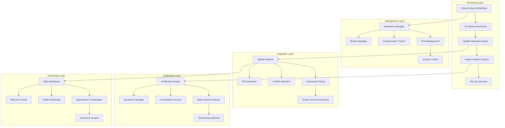

# Design Document - Phase 0: Dependency Management Setup

## Overview

Phase 0 establishes a comprehensive dependency management system for the algorithmic trading platform, managing 50+ external repositories and components through automated monitoring, tiered management strategies, and intelligent update integration. The design emphasizes proactive management, security, and system stability while minimizing manual overhead.

## Architecture

### High-Level Architecture



### Component Architecture

The system follows a microservices architecture with clear separation of concerns:

1. **Monitoring Layer**: Automated detection and analysis of dependency changes
2. **Management Layer**: Repository and customization management
3. **Integration Layer**: Automated testing and integration pipelines
4. **Notification Layer**: Multi-channel communication and alerting
5. **Dashboard Layer**: Visualization and manual control interfaces

## Components and Interfaces

### Repository Management System

#### 1. Fork Management Service
```typescript
interface ForkManager {
  createFork(upstream: Repository, tier: ComponentTier): Promise<Fork>;
  updateFork(fork: Fork, changes: UpstreamChange[]): Promise<UpdateResult>;
  validateFork(fork: Fork): Promise<ValidationResult>;
  syncWithUpstream(fork: Fork): Promise<SyncResult>;
}

interface ComponentTier {
  level: 'tier1' | 'tier2' | 'tier3' | 'tier4';
  monitoringFrequency: 'daily' | 'weekly';
  notificationPriority: 'immediate' | 'standard' | 'batch' | 'summary';
  testingRequirements: TestingLevel;
}
```

#### 2. Customization Tracking System
```typescript
interface CustomizationTracker {
  recordCustomization(fork: Fork, customization: Customization): Promise<void>;
  getCustomizations(fork: Fork): Promise<Customization[]>;
  analyzeImpact(fork: Fork, upstreamChange: Change): Promise<ImpactAnalysis>;
  validateCustomizations(fork: Fork): Promise<ValidationResult>;
}

interface Customization {
  id: string;
  type: 'enhancement' | 'bugfix' | 'integration' | 'configuration';
  description: string;
  files: string[];
  rationale: string;
  maintainer: string;
  created: Date;
  lastValidated: Date;
}
```

### Monitoring and Detection System

#### 1. Update Detection Engine
```typescript
interface UpdateDetector {
  scanRepository(repo: Repository): Promise<UpdateInfo[]>;
  analyzeChanges(changes: Change[]): Promise<ChangeAnalysis>;
  classifyUpdate(update: UpdateInfo): Promise<UpdateClassification>;
  generateImpactReport(update: UpdateInfo, customizations: Customization[]): Promise<ImpactReport>;
}

interface UpdateInfo {
  repository: Repository;
  version: string;
  changes: Change[];
  securityImpact: SecurityImpact;
  breakingChanges: BreakingChange[];
  releaseNotes: string;
  publishedAt: Date;
}
```

#### 2. Security Vulnerability Scanner
```typescript
interface SecurityScanner {
  scanForVulnerabilities(repo: Repository): Promise<Vulnerability[]>;
  assessSeverity(vulnerability: Vulnerability): Promise<SeverityAssessment>;
  checkPatchAvailability(vulnerability: Vulnerability): Promise<PatchInfo>;
  generateSecurityReport(vulnerabilities: Vulnerability[]): Promise<SecurityReport>;
}

interface Vulnerability {
  id: string;
  cveId?: string;
  severity: 'critical' | 'high' | 'medium' | 'low';
  description: string;
  affectedVersions: string[];
  patchedVersion?: string;
  workaround?: string;
}
```

### Integration Pipeline System

#### 1. Automated Testing Framework
```typescript
interface TestingFramework {
  createTestEnvironment(repo: Repository): Promise<TestEnvironment>;
  runComponentTests(env: TestEnvironment): Promise<TestResult>;
  runIntegrationTests(env: TestEnvironment): Promise<TestResult>;
  runPerformanceTests(env: TestEnvironment): Promise<PerformanceResult>;
  runSecurityTests(env: TestEnvironment): Promise<SecurityTestResult>;
}

interface TestEnvironment {
  id: string;
  dockerImage: string;
  dependencies: Dependency[];
  configuration: EnvironmentConfig;
  resources: ResourceAllocation;
}
```

#### 2. Update Integration Pipeline
```typescript
interface IntegrationPipeline {
  createUpdateBranch(update: UpdateInfo): Promise<Branch>;
  applyUpdate(branch: Branch, update: UpdateInfo): Promise<ApplyResult>;
  resolveConflicts(conflicts: Conflict[]): Promise<ConflictResolution>;
  createPullRequest(branch: Branch): Promise<PullRequest>;
  scheduleReview(pr: PullRequest): Promise<ReviewSchedule>;
}

interface ConflictResolution {
  conflicts: Conflict[];
  resolutions: Resolution[];
  manualInterventionRequired: boolean;
  recommendations: string[];
}
```

### Notification and Communication System

#### 1. Multi-Channel Notification Engine
```typescript
interface NotificationEngine {
  sendNotification(notification: Notification, channels: Channel[]): Promise<DeliveryResult>;
  consolidateNotifications(notifications: Notification[]): Promise<ConsolidatedNotification>;
  scheduleNotification(notification: Notification, schedule: Schedule): Promise<void>;
  trackDelivery(notificationId: string): Promise<DeliveryStatus>;
}

interface Notification {
  id: string;
  type: 'update' | 'security' | 'conflict' | 'success' | 'failure';
  priority: 'immediate' | 'high' | 'medium' | 'low';
  title: string;
  content: string;
  metadata: NotificationMetadata;
  recipients: Recipient[];
}
```

#### 2. Escalation Management System
```typescript
interface EscalationManager {
  defineEscalationRules(rules: EscalationRule[]): Promise<void>;
  checkEscalationTriggers(notification: Notification): Promise<EscalationAction[]>;
  executeEscalation(action: EscalationAction): Promise<EscalationResult>;
  trackEscalationHistory(notificationId: string): Promise<EscalationHistory>;
}

interface EscalationRule {
  trigger: EscalationTrigger;
  delay: number;
  action: EscalationAction;
  recipients: Recipient[];
}
```

## Data Models

### Repository and Component Models
```typescript
interface Repository {
  id: string;
  name: string;
  url: string;
  tier: ComponentTier;
  fork?: Fork;
  upstream?: Repository;
  customizations: Customization[];
  lastChecked: Date;
  status: 'active' | 'deprecated' | 'archived';
}

interface Fork {
  id: string;
  originalRepo: Repository;
  forkUrl: string;
  branches: Branch[];
  customizations: Customization[];
  syncStatus: SyncStatus;
  lastSync: Date;
}

interface Component {
  id: string;
  name: string;
  category: 'critical' | 'important' | 'supporting' | 'infrastructure';
  repositories: Repository[];
  dependencies: Dependency[];
  integrationPoints: IntegrationPoint[];
}
```

### Monitoring and Analysis Models
```typescript
interface MonitoringResult {
  repository: Repository;
  timestamp: Date;
  updates: UpdateInfo[];
  vulnerabilities: Vulnerability[];
  healthScore: number;
  recommendations: Recommendation[];
}

interface ImpactAnalysis {
  updateId: string;
  impactLevel: 'low' | 'medium' | 'high' | 'critical';
  affectedComponents: Component[];
  breakingChanges: BreakingChange[];
  migrationRequired: boolean;
  estimatedEffort: number;
  recommendations: string[];
}
```

## Error Handling

### Monitoring Error Handling
```typescript
interface MonitoringErrorHandler {
  handleRepositoryUnavailable(repo: Repository): Promise<void>;
  handleRateLimitExceeded(service: string): Promise<void>;
  handleAuthenticationFailure(repo: Repository): Promise<void>;
  handleNetworkTimeout(operation: string): Promise<void>;
}
```

### Integration Error Handling
```typescript
interface IntegrationErrorHandler {
  handleMergeConflict(conflict: Conflict): Promise<ConflictResolution>;
  handleTestFailure(testResult: TestResult): Promise<FailureAnalysis>;
  handleBuildFailure(buildResult: BuildResult): Promise<BuildAnalysis>;
  handleDeploymentFailure(deployment: Deployment): Promise<RollbackPlan>;
}
```

## Testing Strategy

### Component Testing
- **Unit Tests**: Individual service testing with >95% coverage
- **Integration Tests**: Cross-service communication validation
- **Contract Tests**: API contract validation between services
- **Performance Tests**: Load and stress testing for all components

### End-to-End Testing
- **Workflow Tests**: Complete dependency update workflows
- **Notification Tests**: Multi-channel notification delivery
- **Dashboard Tests**: UI functionality and data accuracy
- **Recovery Tests**: Failure scenarios and recovery procedures

### Test Data Management
```typescript
interface TestDataManager {
  createMockRepository(config: MockRepoConfig): Promise<MockRepository>;
  generateTestUpdates(repo: Repository): Promise<UpdateInfo[]>;
  simulateVulnerabilities(severity: string): Promise<Vulnerability[]>;
  createTestNotifications(type: string): Promise<Notification[]>;
}
```

## Security Considerations

### Access Control and Authentication
- **Repository Access**: Fine-grained access control for all repositories
- **API Authentication**: Secure authentication for all external APIs
- **Webhook Security**: Signed webhooks for secure event delivery
- **Credential Management**: Secure storage and rotation of credentials

### Data Protection
- **Encryption**: All sensitive data encrypted at rest and in transit
- **Audit Logging**: Comprehensive audit trails for all operations
- **Data Retention**: Configurable retention policies for all data types
- **Privacy Compliance**: GDPR and other privacy regulation compliance

## Performance Optimization

### Monitoring Performance
- **Parallel Processing**: Concurrent monitoring of multiple repositories
- **Caching**: Intelligent caching of repository metadata and analysis results
- **Rate Limiting**: Respectful API usage with intelligent rate limiting
- **Resource Management**: Efficient resource allocation and cleanup

### Scalability Design
- **Horizontal Scaling**: Support for multiple monitoring instances
- **Load Balancing**: Intelligent distribution of monitoring workloads
- **Queue Management**: Asynchronous processing with message queues
- **Database Optimization**: Optimized queries and indexing strategies

## Deployment Strategy

### Infrastructure Requirements
- **Container Orchestration**: Kubernetes-based deployment
- **Service Mesh**: Istio for service communication and security
- **Monitoring Stack**: Prometheus, Grafana, and Jaeger integration
- **Storage**: Persistent storage for configuration and historical data

### Deployment Pipeline
- **GitOps**: ArgoCD-based deployment automation
- **Environment Management**: Separate dev, staging, and production environments
- **Blue-Green Deployment**: Zero-downtime deployment strategy
- **Rollback Capability**: Automated rollback on deployment failures

This design ensures comprehensive dependency management while maintaining system stability, security, and performance throughout the dependency lifecycle.