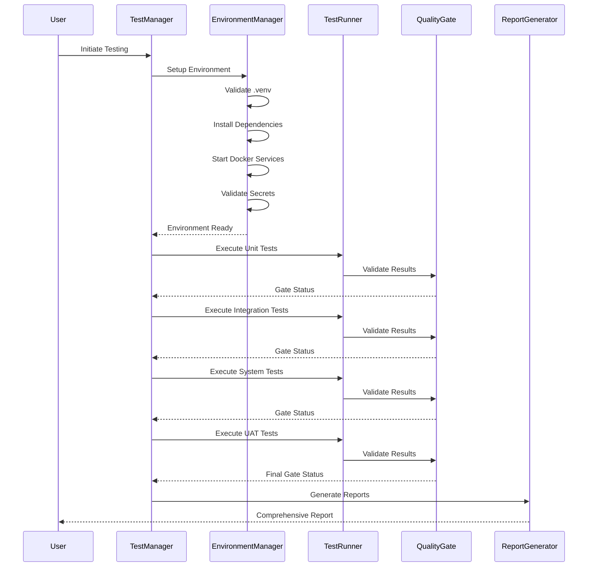
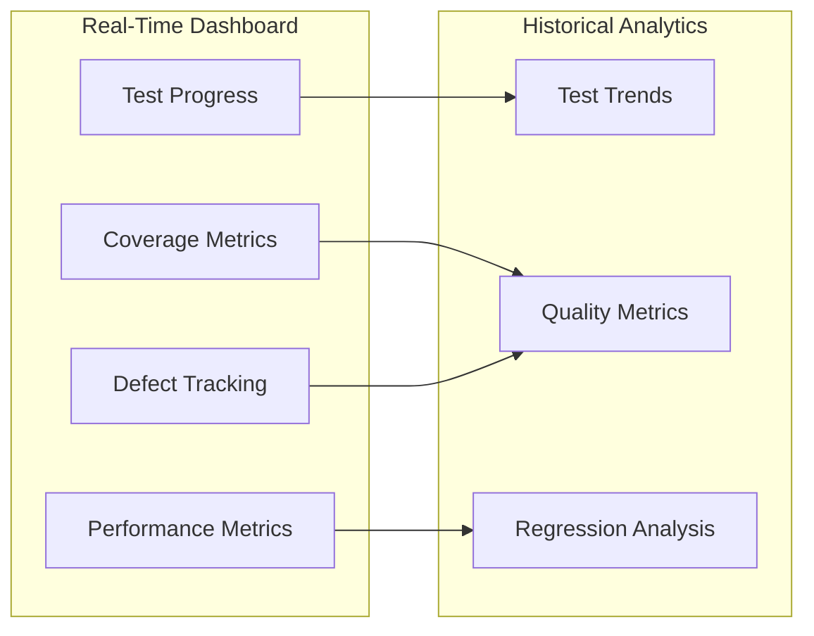

# Design Document

## Overview

This design document outlines the comprehensive testing and validation architecture for Phase 1 of the Algorithmic Trading System. The design implements a multi-layered testing framework that ensures 100% test coverage and 100% pass rate across all system components, with zero tolerance for blockers. The architecture supports 13 distinct testing types, from unit testing to user acceptance testing, with automated reporting, defect tracking, and quality gates.

## Architecture

### High-Level Testing Architecture

```mermaid
graph TB
    subgraph "Test Execution Framework"
        TEF[Test Execution Framework]
        TM[Test Manager]
        TR[Test Runner]
        RG[Report Generator]
    end
    
    subgraph "Test Types"
        UT[Unit Tests]
        IT[Integration Tests]
        AT[API Tests]
        ST[System Tests]
        SET[Security Tests]
        PT[Performance Tests]
        LT[Load Tests]
        SRT[Stress Tests]
        CT[Compatibility Tests]
        RT[Regression Tests]
        RCT[Recovery Tests]
        UAT[User Acceptance Tests]
        UST[Usability Tests]
    end
    
    subgraph "Environment Management"
        ENV[Environment Manager]
        DOCKER[Docker Orchestrator]
        CONFIG[Configuration Manager]
        SECRETS[Secrets Manager]
    end
    
    subgraph "Quality Gates"
        QG[Quality Gate Engine]
        DT[Defect Tracker]
        CM[Coverage Monitor]
        PM[Performance Monitor]
    end
    
    subgraph "Reporting & Analytics"
        HTML[HTML Reports]
        JSON[JSON Reports]
        METRICS[Metrics Dashboard]
        AUDIT[Audit Trail]
    end
    
    TEF --> TM
    TM --> TR
    TR --> UT
    TR --> IT
    TR --> AT
    TR --> ST
    TR --> SET
    TR --> PT
    TR --> LT
    TR --> SRT
    TR --> CT
    TR --> RT
    TR --> RCT
    TR --> UAT
    TR --> UST
    
    ENV --> DOCKER
    ENV --> CONFIG
    ENV --> SECRETS
    
    TR --> QG
    QG --> DT
    QG --> CM
    QG --> PM
    
    RG --> HTML
    RG --> JSON
    RG --> METRICS
    RG --> AUDIT
    
    TM --> ENV
    TR --> RG
```



### Testing Pipeline Architecture



## Components and Interfaces

### 1. Test Execution Framework

#### TestExecutionManager
```python
class TestExecutionManager:
    """Central orchestrator for all testing activities"""
    
    def __init__(self):
        self.environment_manager = EnvironmentManager()
        self.test_runner = TestRunner()
        self.quality_gate = QualityGateEngine()
        self.report_generator = ReportGenerator()
        self.defect_tracker = DefectTracker()
    
    async def execute_comprehensive_testing(self) -> TestExecutionReport:
        """Execute all 13 test types with quality gates"""
        
    def validate_environment(self) -> EnvironmentValidationResult:
        """Validate testing environment setup"""
        
    def enforce_quality_gates(self, results: TestResults) -> QualityGateResult:
        """Enforce zero-tolerance quality gates"""
```

#### TestRunner
```python
class TestRunner:
    """Executes individual test suites with coverage tracking"""
    
    async def run_unit_tests(self) -> TestSuiteResult:
        """Execute unit tests with 100% coverage requirement"""
        
    async def run_integration_tests(self) -> TestSuiteResult:
        """Execute integration tests with mocking strategy"""
        
    async def run_performance_tests(self) -> PerformanceTestResult:
        """Execute performance tests with SLA validation"""
        
    async def run_security_tests(self) -> SecurityTestResult:
        """Execute security tests with vulnerability scanning"""
```

### 2. Environment Management

#### EnvironmentManager
```python
class EnvironmentManager:
    """Manages testing environment setup and validation"""
    
    def setup_virtual_environment(self) -> bool:
        """Setup and validate .venv environment"""
        
    def validate_dependencies(self) -> DependencyValidationResult:
        """Validate all requirements.txt dependencies"""
        
    def orchestrate_docker_services(self) -> DockerOrchestrationResult:
        """Start and validate all Docker services"""
        
    def validate_secrets_configuration(self) -> SecretsValidationResult:
        """Validate all required environment variables"""
```

#### DockerOrchestrator
```python
class DockerOrchestrator:
    """Manages Docker container lifecycle for testing"""
    
    def rebuild_containers(self) -> bool:
        """Rebuild all containers with --no-cache"""
        
    def start_service_stack(self) -> ServiceStackResult:
        """Start all services with health checks"""
        
    def validate_container_health(self) -> HealthCheckResult:
        """Validate all containers are healthy"""
```

### 3. Quality Gate Engine

#### QualityGateEngine
```python
class QualityGateEngine:
    """Enforces quality gates with zero tolerance for failures"""
    
    def evaluate_test_results(self, results: TestResults) -> QualityGateResult:
        """Evaluate results against quality criteria"""
        
    def enforce_coverage_requirements(self, coverage: CoverageReport) -> bool:
        """Enforce 100% coverage requirement"""
        
    def validate_performance_slas(self, metrics: PerformanceMetrics) -> bool:
        """Validate performance SLAs (order placement <100ms)"""
        
    def assess_security_compliance(self, security_results: SecurityResults) -> bool:
        """Assess security compliance (zero high/critical CVEs)"""
```

### 4. Test Data Management

#### TestDataManager
```python
class TestDataManager:
    """Manages test data across all test types"""
    
    def generate_market_data(self) -> MarketDataSet:
        """Generate realistic market data for testing"""
        
    def create_test_portfolios(self) -> List[TestPortfolio]:
        """Create test portfolios with various configurations"""
        
    def setup_mock_services(self) -> MockServiceRegistry:
        """Setup mock external services"""
```

## Data Models

### Test Execution Models

```python
@dataclass
class TestExecutionReport:
    execution_id: str
    start_time: datetime
    end_time: datetime
    total_duration: float
    environment_validation: EnvironmentValidationResult
    test_suite_results: List[TestSuiteResult]
    quality_gate_results: QualityGateResult
    defects: List[Defect]
    coverage_report: CoverageReport
    performance_metrics: PerformanceMetrics
    security_assessment: SecurityAssessment
    recommendations: List[str]
    uat_sign_off_status: UATSignOffStatus

@dataclass
class TestSuiteResult:
    suite_name: str
    test_type: TestType
    total_tests: int
    passed_tests: int
    failed_tests: int
    skipped_tests: int
    error_tests: int
    pass_rate: float
    coverage_percentage: float
    execution_time: float
    test_cases: List[TestCaseResult]

@dataclass
class TestCaseResult:
    test_name: str
    status: TestStatus
    duration: float
    error_message: Optional[str]
    stack_trace: Optional[str]
    coverage_data: Optional[CoverageData]
    performance_metrics: Optional[PerformanceData]
```

### Quality Gate Models

```python
@dataclass
class QualityGateResult:
    overall_status: QualityGateStatus
    coverage_gate: CoverageGateResult
    performance_gate: PerformanceGateResult
    security_gate: SecurityGateResult
    defect_gate: DefectGateResult
    blocking_issues: List[BlockingIssue]

@dataclass
class DefectGateResult:
    total_defects: int
    critical_defects: int
    high_defects: int
    medium_defects: int
    low_defects: int
    gate_passed: bool
    blocking_defects: List[Defect]
```

### Performance Models

```python
@dataclass
class PerformanceMetrics:
    order_placement_latency: LatencyMetrics
    data_processing_latency: LatencyMetrics
    throughput_metrics: ThroughputMetrics
    resource_utilization: ResourceMetrics
    scalability_metrics: ScalabilityMetrics

@dataclass
class LatencyMetrics:
    p50: float
    p95: float
    p99: float
    max: float
    sla_compliance: bool
    sla_threshold: float
```

## Error Handling

### Error Classification System

```python
class ErrorClassifier:
    """Classifies errors and determines appropriate responses"""
    
    def classify_error(self, error: Exception, context: TestContext) -> ErrorClassification:
        """Classify error severity and impact"""
        
    def determine_retry_strategy(self, error: ErrorClassification) -> RetryStrategy:
        """Determine if error should trigger retry"""
        
    def escalate_blocking_issues(self, error: ErrorClassification) -> EscalationAction:
        """Escalate blocking issues immediately"""

class ErrorRecoveryManager:
    """Manages error recovery and retry logic"""
    
    def attempt_recovery(self, error: ErrorClassification) -> RecoveryResult:
        """Attempt automatic error recovery"""
        
    def implement_fallback_strategy(self, context: TestContext) -> FallbackResult:
        """Implement fallback testing strategy"""
```

### Defect Management

```python
class DefectTracker:
    """Tracks and manages defects throughout testing"""
    
    def create_defect(self, test_failure: TestFailure) -> Defect:
        """Create defect from test failure"""
        
    def classify_defect_severity(self, defect: Defect) -> DefectSeverity:
        """Classify defect severity based on impact"""
        
    def track_defect_resolution(self, defect: Defect) -> DefectResolutionStatus:
        """Track defect resolution progress"""
        
    def generate_defect_report(self) -> DefectReport:
        """Generate comprehensive defect report"""
```

## Testing Strategy

### Test Type Implementation Strategy

#### 1. Unit Testing Strategy
- **Coverage Target**: 100% line coverage on `src/` directory
- **Mocking Strategy**: Mock all external dependencies (APIs, databases, file systems)
- **Test Structure**: Arrange-Act-Assert pattern with comprehensive edge case coverage
- **Tools**: pytest, pytest-cov, unittest.mock, pytest-asyncio

#### 2. Integration Testing Strategy
- **Scope**: Component interaction validation with minimal mocking
- **Database Testing**: Use test databases with transaction rollback
- **API Testing**: Test actual API endpoints with test data
- **Event Testing**: Validate Kafka event flows with test topics

#### 3. Performance Testing Strategy
- **Latency SLAs**: Order placement <100ms, Data processing <500ms
- **Load Testing**: Support 100 req/s average, 500 req/s peak
- **Memory Testing**: Stable memory usage under load
- **Tools**: locust, pytest-benchmark, memory_profiler

#### 4. Security Testing Strategy
- **Static Analysis**: bandit for code security scanning
- **Dependency Scanning**: safety check for known vulnerabilities
- **Dynamic Testing**: OWASP ZAP for runtime security testing
- **Compliance**: Zero high/critical CVEs allowed

### Test Data Strategy

```python
class TestDataStrategy:
    """Comprehensive test data management strategy"""
    
    def generate_realistic_market_data(self) -> MarketDataSet:
        """Generate realistic market data with various scenarios"""
        
    def create_edge_case_scenarios(self) -> List[EdgeCaseScenario]:
        """Create edge case test scenarios"""
        
    def setup_performance_test_data(self) -> PerformanceTestDataSet:
        """Setup data for performance testing"""
```

## Monitoring and Observability

### Test Execution Monitoring

```python
class TestExecutionMonitor:
    """Monitors test execution in real-time"""
    
    def track_test_progress(self) -> TestProgressMetrics:
        """Track real-time test execution progress"""
        
    def monitor_resource_usage(self) -> ResourceUsageMetrics:
        """Monitor system resource usage during testing"""
        
    def detect_performance_anomalies(self) -> List[PerformanceAnomaly]:
        """Detect performance anomalies during testing"""
```

### Reporting Dashboard



## Deployment and Infrastructure

### Testing Infrastructure

```yaml
# docker-compose.test.yml
version: '3.8'
services:
  test-runner:
    build:
      context: .
      dockerfile: testing/Dockerfile
    environment:
      - TESTING_MODE=true
      - COVERAGE_THRESHOLD=100
      - PERFORMANCE_SLA_ORDER_LATENCY=100
      - PERFORMANCE_SLA_DATA_PROCESSING=500
    volumes:
      - ./tests:/app/tests
      - ./coverage:/app/coverage
      - ./reports:/app/reports
    depends_on:
      - postgres-test
      - redis-test
      - kafka-test
  
  postgres-test:
    image: postgres:15
    environment:
      POSTGRES_DB: trading_test
      POSTGRES_USER: test_user
      POSTGRES_PASSWORD: test_password
    tmpfs:
      - /var/lib/postgresql/data
  
  redis-test:
    image: redis:7-alpine
    command: redis-server --save ""
  
  kafka-test:
    image: confluentinc/cp-kafka:7.4.0
    environment:
      KAFKA_ZOOKEEPER_CONNECT: zookeeper-test:2181
      KAFKA_ADVERTISED_LISTENERS: PLAINTEXT://kafka-test:9092
```

### CI/CD Integration

```python
class CICDIntegration:
    """Integration with CI/CD pipelines"""
    
    def generate_junit_reports(self) -> JUnitReport:
        """Generate JUnit XML reports for CI/CD"""
        
    def publish_coverage_reports(self) -> CoverageReport:
        """Publish coverage reports to CI/CD"""
        
    def set_build_status(self, results: TestResults) -> BuildStatus:
        """Set build status based on test results"""
```

## Security Considerations

### Test Environment Security

```python
class TestSecurityManager:
    """Manages security aspects of testing environment"""
    
    def sanitize_test_data(self) -> SanitizedTestData:
        """Sanitize sensitive data in test datasets"""
        
    def manage_test_secrets(self) -> SecretManagementResult:
        """Manage secrets for testing environment"""
        
    def validate_security_compliance(self) -> SecurityComplianceResult:
        """Validate security compliance of test environment"""
```

### Data Privacy in Testing

- **PII Handling**: All test data uses synthetic/anonymized data
- **Secret Management**: Test secrets isolated from production
- **Access Control**: Role-based access to test environments
- **Audit Trail**: Complete audit trail of test executions

## Performance Optimization

### Test Execution Optimization

```python
class TestOptimizer:
    """Optimizes test execution performance"""
    
    def parallelize_test_execution(self) -> ParallelExecutionPlan:
        """Create parallel execution plan for tests"""
        
    def optimize_test_data_loading(self) -> DataLoadingStrategy:
        """Optimize test data loading strategies"""
        
    def implement_smart_test_selection(self) -> TestSelectionStrategy:
        """Implement smart test selection based on code changes"""
```

### Resource Management

- **Memory Management**: Efficient memory usage during test execution
- **CPU Optimization**: Parallel test execution where possible
- **I/O Optimization**: Optimized database and file system operations
- **Network Optimization**: Efficient network usage for distributed tests

This comprehensive design ensures that the Phase 1 testing and validation system meets all requirements for achieving 100% test coverage and 100% pass rate, with robust error handling, comprehensive reporting, and zero tolerance for blocking issues.