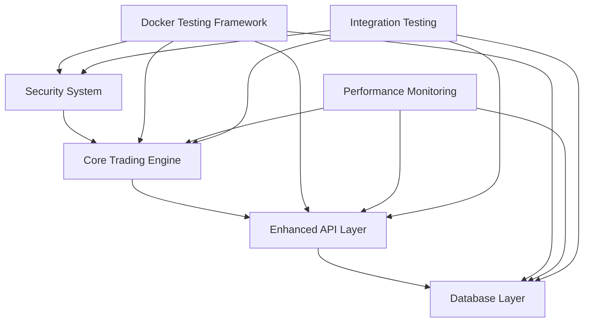

# Design Document - Phase 1: Immediate Priority

## Overview

Phase 1 establishes a comprehensive foundation for the algorithmic trading system by implementing robust security validation, comprehensive NautilusTrader engine testing, enhanced API layers with GraphQL/REST/WebSocket support, and multi-database integration (PostgreSQL, ClickHouse, DuckDB, Qdrant). The design emphasizes Docker-based testing, multi-asset support, sub-millisecond performance requirements, and enterprise-grade reliability with >95% test coverage.

## Architecture

### System Architecture Overview



### Component Architecture

#### 1. Security System Validation
- **Purpose**: Ensure robust security framework with zero-trust architecture
- **Technology**: Zero-trust security, advanced fraud detection, behavioral analytics
- **Components**: 
  - Authentication and authorization system
  - Fraud detection engine with ML-based scoring
  - Behavioral analytics for anomaly detection
  - Automated threat response system

#### 2. Core Trading Engine Testing
- **Purpose**: Comprehensive NautilusTrader validation with multi-asset support
- **Technology**: NautilusTrader, order management, risk management, multi-asset handlers
- **Components**:
  - NautilusTrader engine initialization and configuration validation
  - Order management system with all order types (market, limit, stop, stop-limit)
  - Real-time risk management with 1ms calculation requirements
  - Multi-asset support (equities, forex, crypto, futures) with unified margin calculation
  - Cross-asset correlation analysis and portfolio management

#### 3. Enhanced API Layer
- **Purpose**: Provide comprehensive API access for frontend and external systems
- **Technology**: FastAPI, GraphQL, WebSocket, REST
- **Components**:
  - GraphQL API with real-time subscriptions
  - Enhanced REST API with versioning
  - WebSocket API for real-time data
  - API security and rate limiting

#### 4. Database Integration Layer
- **Purpose**: Ensure reliable and performant data operations
- **Technology**: PostgreSQL, ClickHouse, DuckDB, Qdrant
- **Components**:
  - PostgreSQL for transactional data
  - ClickHouse for time-series analytics
  - DuckDB for research queries
  - Qdrant for vector operations

## Components and Interfaces

### Security System Components

#### Authentication Framework
```python
@dataclass
class AuthenticationConfig:
    multi_factor_enabled: bool
    session_timeout: int
    token_expiry: int
    biometric_support: bool
    
class AuthenticationService:
    def authenticate_user(self, credentials: UserCredentials) -> AuthResult
    def validate_session(self, session_token: str) -> SessionInfo
    def refresh_token(self, refresh_token: str) -> TokenPair
    def logout_user(self, session_token: str) -> bool
```

#### Fraud Detection Engine
```python
@dataclass
class FraudDetectionConfig:
    ml_model_path: str
    threshold_score: float
    real_time_monitoring: bool
    
class FraudDetectionService:
    def analyze_transaction(self, transaction: Transaction) -> FraudScore
    def update_user_behavior(self, user_id: str, behavior: UserBehavior)
    def get_risk_assessment(self, user_id: str) -> RiskAssessment
```

### Core Trading Engine Components

#### Order Management System
```python
@dataclass
class OrderConfig:
    max_order_size: Decimal
    supported_order_types: List[OrderType]
    risk_checks_enabled: bool
    
class OrderManagementService:
    def create_order(self, order_request: OrderRequest) -> Order
    def modify_order(self, order_id: str, modifications: OrderModifications) -> Order
    def cancel_order(self, order_id: str) -> CancellationResult
    def get_order_status(self, order_id: str) -> OrderStatus
```

#### Risk Management Engine
```python
@dataclass
class RiskConfig:
    max_position_size: Decimal
    max_daily_loss: Decimal
    var_limit: Decimal
    
class RiskManagementService:
    def validate_order(self, order: Order) -> RiskValidationResult
    def calculate_portfolio_risk(self, portfolio: Portfolio) -> RiskMetrics
    def check_position_limits(self, position: Position) -> LimitCheckResult
    def calculate_var(self, portfolio: Portfolio, confidence: float) -> VaRResult
```

### Enhanced API Layer Components

#### GraphQL API Schema
```graphql
type Query {
  orders(filter: OrderFilter): [Order]
  positions(symbol: String): [Position]
  portfolio: Portfolio
  marketData(symbol: String!): MarketData
}

type Mutation {
  createOrder(input: OrderInput!): OrderResult
  cancelOrder(orderId: ID!): CancellationResult
  modifyOrder(orderId: ID!, input: OrderModification!): OrderResult
}

type Subscription {
  orderUpdates(userId: ID!): Order
  marketDataUpdates(symbols: [String!]!): MarketData
  portfolioUpdates(userId: ID!): Portfolio
}
```

#### REST API Endpoints
```python
class TradingAPI:
    @app.post("/api/v1/orders")
    async def create_order(order: OrderRequest) -> OrderResponse
    
    @app.get("/api/v1/orders/{order_id}")
    async def get_order(order_id: str) -> OrderResponse
    
    @app.put("/api/v1/orders/{order_id}")
    async def modify_order(order_id: str, modifications: OrderModifications) -> OrderResponse
    
    @app.delete("/api/v1/orders/{order_id}")
    async def cancel_order(order_id: str) -> CancellationResponse
```

#### WebSocket API
```python
class WebSocketManager:
    async def handle_connection(self, websocket: WebSocket, user_id: str)
    async def subscribe_to_orders(self, websocket: WebSocket, user_id: str)
    async def subscribe_to_market_data(self, websocket: WebSocket, symbols: List[str])
    async def broadcast_order_update(self, order: Order)
    async def broadcast_market_data(self, market_data: MarketData)
```

### Database Integration Interfaces

#### PostgreSQL Integration
```python
class PostgreSQLService:
    async def create_connection_pool(self) -> asyncpg.Pool
    async def execute_transaction(self, queries: List[str]) -> TransactionResult
    async def get_orders(self, filter: OrderFilter) -> List[Order]
    async def store_order(self, order: Order) -> bool
```

#### ClickHouse Integration
```python
class ClickHouseService:
    async def store_market_data(self, data: MarketData) -> bool
    async def query_historical_data(self, query: HistoricalQuery) -> DataFrame
    async def get_analytics_data(self, analytics_query: AnalyticsQuery) -> AnalyticsResult
```

## Data Models

### Core Trading Models
```python
@dataclass
class Order:
    order_id: str
    symbol: str
    side: OrderSide
    order_type: OrderType
    quantity: Decimal
    price: Optional[Decimal]
    status: OrderStatus
    created_at: datetime
    updated_at: datetime

@dataclass
class Position:
    symbol: str
    quantity: Decimal
    average_price: Decimal
    market_value: Decimal
    unrealized_pnl: Decimal
    realized_pnl: Decimal

@dataclass
class Portfolio:
    user_id: str
    cash_balance: Decimal
    total_value: Decimal
    positions: List[Position]
    daily_pnl: Decimal
    total_pnl: Decimal
```

### Security Models
```python
@dataclass
class UserCredentials:
    username: str
    password: str
    mfa_token: Optional[str]
    biometric_data: Optional[bytes]

@dataclass
class FraudScore:
    score: float
    risk_level: RiskLevel
    factors: List[RiskFactor]
    timestamp: datetime
```

## Error Handling

### API Error Handling
- **HTTP Status Codes**: Proper use of 4xx and 5xx status codes
- **Error Response Format**: Consistent JSON error responses
- **Rate Limiting**: Implement rate limiting with proper error messages
- **Validation Errors**: Detailed validation error messages

### Trading Engine Error Handling
- **Order Validation**: Comprehensive order validation with clear error messages
- **Risk Check Failures**: Detailed risk violation explanations
- **Market Data Issues**: Graceful handling of market data interruptions
- **Database Failures**: Automatic retry with exponential backoff

### Security Error Handling
- **Authentication Failures**: Secure error messages without information leakage
- **Authorization Violations**: Clear access denied messages
- **Fraud Detection**: Appropriate responses to fraud detection alerts
- **Session Management**: Proper session timeout and renewal handling

## Testing Strategy

### Unit Testing
- **Coverage**: >95% code coverage for all components
- **Framework**: pytest for Python, Jest for JavaScript/TypeScript
- **Mocking**: Comprehensive mocking of external dependencies
- **Test Data**: Realistic test data generation and management

### Integration Testing
- **API Testing**: Comprehensive API endpoint testing
- **Database Testing**: Database integration and transaction testing
- **Security Testing**: Authentication and authorization flow testing
- **Performance Testing**: Load testing and performance validation

### Docker-Based Testing
- **Isolation**: All tests run in isolated Docker containers
- **Consistency**: Consistent test environments across different systems
- **Cleanup**: Automatic container cleanup after test completion
- **CI/CD Integration**: Seamless integration with CI/CD pipelines

### End-to-End Testing
- **Trading Workflows**: Complete trading workflow validation
- **User Journeys**: End-to-end user journey testing
- **Error Scenarios**: Comprehensive error handling validation
- **Performance Validation**: End-to-end performance testing

## Security Considerations

### API Security
- **Authentication**: JWT-based authentication with refresh tokens
- **Authorization**: Role-based access control (RBAC)
- **Rate Limiting**: API rate limiting to prevent abuse
- **Input Validation**: Comprehensive input validation and sanitization

### Data Security
- **Encryption**: All sensitive data encrypted at rest and in transit
- **Access Control**: Strict access control for all data operations
- **Audit Logging**: Comprehensive audit logging for all operations
- **Data Privacy**: Compliance with data privacy regulations

### Trading Security
- **Order Validation**: Multi-level order validation and risk checks
- **Position Limits**: Strict position and exposure limits
- **Fraud Detection**: Real-time fraud detection and prevention
- **Audit Trail**: Complete audit trail for all trading activities

## Performance Requirements

### Latency Requirements
- **Order Execution**: Sub-millisecond order processing
- **Market Data**: Real-time market data with <10ms latency
- **API Response**: API responses within 100ms for 95th percentile
- **Database Queries**: Database queries within 50ms average

### Throughput Requirements
- **Orders**: 10,000+ orders per second
- **Market Data**: 100,000+ market data updates per second
- **API Requests**: 50,000+ API requests per second
- **Concurrent Users**: 10,000+ concurrent users

### Scalability Requirements
- **Horizontal Scaling**: Support for horizontal scaling
- **Load Balancing**: Efficient load balancing across instances
- **Resource Utilization**: Optimal CPU and memory utilization
- **Auto-scaling**: Automatic scaling based on load

## Monitoring and Observability

### Metrics Collection
- **Business Metrics**: Trading volume, order success rates, P&L
- **Technical Metrics**: Response times, error rates, resource usage
- **Security Metrics**: Authentication attempts, fraud detection alerts
- **Performance Metrics**: Latency, throughput, availability

### Logging
- **Structured Logging**: JSON-formatted logs with correlation IDs
- **Log Levels**: Appropriate log levels for different events
- **Log Aggregation**: Centralized log aggregation and analysis
- **Log Retention**: Appropriate log retention policies

### Alerting
- **Real-time Alerts**: Immediate alerts for critical issues
- **Escalation**: Alert escalation procedures
- **Notification Channels**: Multiple notification channels
- **Alert Correlation**: Intelligent alert correlation and deduplication