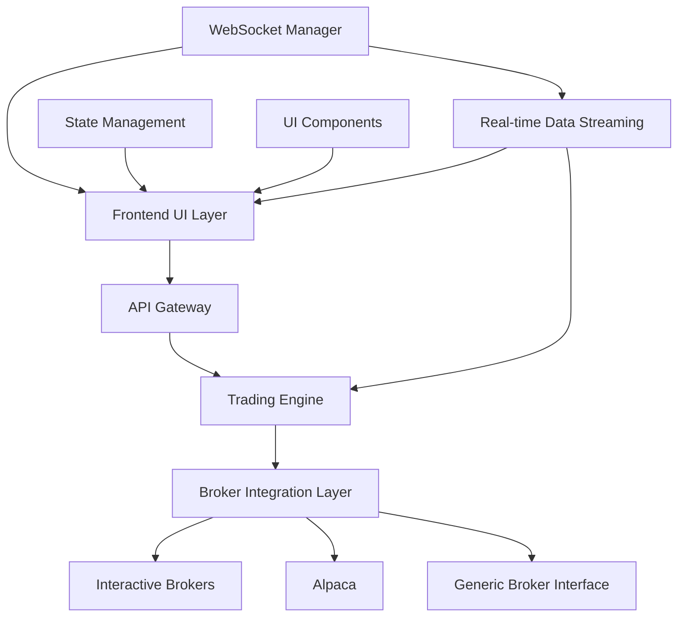

# Design Document - Phase 2: Frontend and Broker Integration

## Overview

This document outlines the comprehensive technical design for Phase 2, encompassing multi-platform frontend development (web, mobile, desktop), Progressive Web App features, TradingView charting integration, extensive broker support (Interactive Brokers, Alpaca, OANDA, Coinbase), unified broker abstraction, and advanced real-time data streaming capabilities.

## Architecture

### System Architecture Overview



### Component Architecture

#### 1. Multi-Platform Frontend Layer
- **Purpose**: Comprehensive trading interfaces across web, mobile, and desktop platforms
- **Technology**: Next.js 14, React 18, TypeScript, Tailwind CSS, React Native, Electron
- **Components**:
  - Next.js Web Application with SSR/SSG
  - Progressive Web App (PWA) with offline capabilities
  - React Native Mobile Applications (iOS/Android)
  - Electron Desktop Application (Windows/macOS/Linux)
  - TradingView Charting Integration
  - Real-time WebSocket Data Streaming

#### 2. Advanced UI Components
- **Purpose**: Rich, interactive trading interface components
- **Technology**: Material-UI, TradingView Charting Library, WebSocket connections
- **Components**:
  - Real-time Trading Dashboard with customizable layouts
  - Advanced Order Entry with risk validation
  - Portfolio Management with P&L tracking
  - Market Data Visualization with technical indicators
  - Risk Management Interface with real-time monitoring

#### 3. Progressive Web App Features
- **Purpose**: Offline functionality and native app-like experience
- **Technology**: Service Workers, Push API, Web App Manifest
- **Components**:
  - Service Worker for offline caching
  - Push Notifications for critical alerts
  - App Installation and Update Management
  - Offline Data Synchronization

#### 4. Mobile Application Architecture
- **Purpose**: Native mobile trading experience
- **Technology**: React Native, Expo, Biometric Authentication
- **Components**:
  - Cross-platform mobile UI components
  - Biometric authentication (Touch ID, Face ID)
  - Push notification handling
  - Mobile-optimized trading workflows

#### 5. Desktop Application Framework
- **Purpose**: Native desktop trading application
- **Technology**: Electron, Native OS Integration
- **Components**:
  - Desktop application wrapper
  - System tray integration
  - Native notifications
  - Auto-update mechanisms

#### 6. Comprehensive Broker Integration Layer
- **Purpose**: Unified interface for multiple broker platforms
- **Technology**: Python asyncio, REST/WebSocket APIs, FIX Protocol
- **Components**:
  - Interactive Brokers (Paper & Live Trading)
  - Alpaca Integration
  - OANDA Integration (Forex)
  - Coinbase Integration (Crypto)
  - Unified Broker Abstraction Layer
  - Smart Order Routing Engine
  - Account Management System

#### 3. Real-time Data Streaming
- **Purpose**: Efficient real-time market data distribution
- **Technology**: WebSocket, Redis Streams, data compression
- **Components**:
  - Market Data Aggregator
  - WebSocket Connection Manager
  - Data Normalization Engine
  - Subscription Management

## Components and Interfaces

### Frontend UI Components

#### Trading Dashboard Component
```typescript
interface TradingDashboardProps {
  portfolioData: Portfolio;
  positions: Position[];
  orders: Order[];
  marketData: MarketData[];
}

interface DashboardState {
  selectedTimeframe: Timeframe;
  watchlist: string[];
  layoutConfig: LayoutConfig;
  alerts: Alert[];
}

class TradingDashboard extends React.Component<TradingDashboardProps, DashboardState> {
  componentDidMount(): void;
  handleOrderSubmit(order: OrderRequest): Promise<void>;
  handlePositionClose(positionId: string): Promise<void>;
  updateMarketData(data: MarketData): void;
}
```

#### Order Management Interface
```typescript
interface OrderFormProps {
  symbol: string;
  accountId: string;
  availableBrokers: Broker[];
  onOrderSubmit: (order: OrderRequest) => Promise<OrderResult>;
}

interface OrderFormState {
  orderType: OrderType;
  side: OrderSide;
  quantity: number;
  price?: number;
  timeInForce: TimeInForce;
  selectedBroker: string;
  riskChecks: RiskCheckResult;
}

class OrderForm extends React.Component<OrderFormProps, OrderFormState> {
  validateOrder(): ValidationResult;
  calculateRisk(): RiskCheckResult;
  submitOrder(): Promise<void>;
  resetForm(): void;
}
```

#### Market Data Visualization
```typescript
interface ChartComponentProps {
  symbol: string;
  timeframe: Timeframe;
  indicators: TechnicalIndicator[];
  onSymbolChange: (symbol: string) => void;
}

interface ChartState {
  priceData: OHLCV[];
  volume: VolumeData[];
  indicators: IndicatorData[];
  selectedRange: DateRange;
}

class ChartComponent extends React.Component<ChartComponentProps, ChartState> {
  updatePriceData(data: OHLCV): void;
  addIndicator(indicator: TechnicalIndicator): void;
  handleZoom(range: DateRange): void;
  exportChart(): void;
}
```

### Broker Integration Components

#### Generic Broker Interface
```python
from abc import ABC, abstractmethod
from typing import List, Optional, Dict, Any
from dataclasses import dataclass

@dataclass
class BrokerConfig:
    broker_id: str
    api_key: str
    secret_key: str
    base_url: str
    sandbox_mode: bool
    rate_limit: int

class BrokerInterface(ABC):
    @abstractmethod
    async def connect(self, config: BrokerConfig) -> bool:
        """Establish connection to broker"""
        pass
    
    @abstractmethod
    async def disconnect(self) -> bool:
        """Disconnect from broker"""
        pass
    
    @abstractmethod
    async def get_account_info(self) -> AccountInfo:
        """Retrieve account information"""
        pass
    
    @abstractmethod
    async def get_positions(self) -> List[Position]:
        """Get current positions"""
        pass
    
    @abstractmethod
    async def place_order(self, order: OrderRequest) -> OrderResult:
        """Place a new order"""
        pass
    
    @abstractmethod
    async def cancel_order(self, order_id: str) -> CancellationResult:
        """Cancel an existing order"""
        pass
    
    @abstractmethod
    async def get_market_data(self, symbol: str) -> MarketData:
        """Get current market data"""
        pass
    
    @abstractmethod
    async def subscribe_market_data(self, symbols: List[str]) -> None:
        """Subscribe to real-time market data"""
        pass
```

#### Interactive Brokers Integration
```python
from ib_insync import IB, Stock, Order as IBOrder
import asyncio

class InteractiveBrokersAdapter(BrokerInterface):
    def __init__(self):
        self.ib = IB()
        self.connected = False
        self.subscriptions = {}
    
    async def connect(self, config: BrokerConfig) -> bool:
        try:
            await self.ib.connectAsync(
                host=config.base_url,
                port=7497 if config.sandbox_mode else 7496,
                clientId=1
            )
            self.connected = True
            return True
        except Exception as e:
            logger.error(f"IBKR connection failed: {e}")
            return False
    
    async def place_order(self, order: OrderRequest) -> OrderResult:
        try:
            contract = Stock(order.symbol, 'SMART', 'USD')
            ib_order = IBOrder(
                action=order.side.value,
                totalQuantity=order.quantity,
                orderType=order.order_type.value
            )
            
            if order.price:
                ib_order.lmtPrice = order.price
            
            trade = self.ib.placeOrder(contract, ib_order)
            
            return OrderResult(
                order_id=str(trade.order.orderId),
                status=OrderStatus.SUBMITTED,
                broker_order_id=str(trade.order.orderId)
            )
        except Exception as e:
            return OrderResult(
                order_id="",
                status=OrderStatus.REJECTED,
                error_message=str(e)
            )
    
    async def get_account_info(self) -> AccountInfo:
        account_values = self.ib.accountValues()
        
        cash_balance = 0
        total_value = 0
        
        for value in account_values:
            if value.tag == 'CashBalance':
                cash_balance = float(value.value)
            elif value.tag == 'NetLiquidation':
                total_value = float(value.value)
        
        return AccountInfo(
            account_id=self.ib.client.account,
            cash_balance=cash_balance,
            total_value=total_value,
            buying_power=cash_balance * 4,  # Simplified calculation
            currency='USD'
        )
```

#### Alpaca Integration
```python
import alpaca_trade_api as tradeapi
from alpaca_trade_api.rest import TimeFrame

class AlpacaAdapter(BrokerInterface):
    def __init__(self):
        self.api = None
        self.connected = False
    
    async def connect(self, config: BrokerConfig) -> bool:
        try:
            self.api = tradeapi.REST(
                key_id=config.api_key,
                secret_key=config.secret_key,
                base_url=config.base_url
            )
            
            # Test connection
            account = self.api.get_account()
            self.connected = True
            return True
        except Exception as e:
            logger.error(f"Alpaca connection failed: {e}")
            return False
    
    async def place_order(self, order: OrderRequest) -> OrderResult:
        try:
            alpaca_order = self.api.submit_order(
                symbol=order.symbol,
                qty=order.quantity,
                side=order.side.value,
                type=order.order_type.value,
                time_in_force=order.time_in_force.value,
                limit_price=order.price if order.price else None
            )
            
            return OrderResult(
                order_id=alpaca_order.id,
                status=OrderStatus.SUBMITTED,
                broker_order_id=alpaca_order.id
            )
        except Exception as e:
            return OrderResult(
                order_id="",
                status=OrderStatus.REJECTED,
                error_message=str(e)
            )
    
    async def get_positions(self) -> List[Position]:
        try:
            alpaca_positions = self.api.list_positions()
            positions = []
            
            for pos in alpaca_positions:
                positions.append(Position(
                    symbol=pos.symbol,
                    quantity=float(pos.qty),
                    average_price=float(pos.avg_cost),
                    market_value=float(pos.market_value),
                    unrealized_pnl=float(pos.unrealized_pl),
                    side=PositionSide.LONG if float(pos.qty) > 0 else PositionSide.SHORT
                ))
            
            return positions
        except Exception as e:
            logger.error(f"Error getting Alpaca positions: {e}")
            return []
```

### Real-time Data Streaming Components

#### Market Data Aggregator
```python
import asyncio
import json
from typing import Dict, Set, Callable
from dataclasses import dataclass

@dataclass
class MarketDataSubscription:
    symbol: str
    subscriber_id: str
    callback: Callable[[MarketData], None]

class MarketDataAggregator:
    def __init__(self):
        self.subscriptions: Dict[str, Set[MarketDataSubscription]] = {}
        self.broker_connections: Dict[str, BrokerInterface] = {}
        self.data_cache: Dict[str, MarketData] = {}
    
    async def subscribe(self, symbol: str, subscriber_id: str, callback: Callable):
        if symbol not in self.subscriptions:
            self.subscriptions[symbol] = set()
        
        subscription = MarketDataSubscription(symbol, subscriber_id, callback)
        self.subscriptions[symbol].add(subscription)
        
        # Subscribe to broker data if first subscription
        if len(self.subscriptions[symbol]) == 1:
            await self._subscribe_to_brokers(symbol)
    
    async def unsubscribe(self, symbol: str, subscriber_id: str):
        if symbol in self.subscriptions:
            self.subscriptions[symbol] = {
                sub for sub in self.subscriptions[symbol] 
                if sub.subscriber_id != subscriber_id
            }
            
            # Unsubscribe from brokers if no more subscribers
            if not self.subscriptions[symbol]:
                await self._unsubscribe_from_brokers(symbol)
                del self.subscriptions[symbol]
    
    async def _subscribe_to_brokers(self, symbol: str):
        for broker in self.broker_connections.values():
            try:
                await broker.subscribe_market_data([symbol])
            except Exception as e:
                logger.error(f"Failed to subscribe to {symbol} on broker: {e}")
    
    def _broadcast_market_data(self, symbol: str, data: MarketData):
        if symbol in self.subscriptions:
            for subscription in self.subscriptions[symbol]:
                try:
                    subscription.callback(data)
                except Exception as e:
                    logger.error(f"Error broadcasting data to subscriber: {e}")
        
        # Update cache
        self.data_cache[symbol] = data
```

#### WebSocket Connection Manager
```python
import websockets
import json
from typing import Dict, Set
import asyncio

class WebSocketManager:
    def __init__(self):
        self.connections: Dict[str, websockets.WebSocketServerProtocol] = {}
        self.subscriptions: Dict[str, Set[str]] = {}  # symbol -> set of connection_ids
    
    async def handle_connection(self, websocket, path):
        connection_id = f"conn_{id(websocket)}"
        self.connections[connection_id] = websocket
        
        try:
            async for message in websocket:
                await self._handle_message(connection_id, json.loads(message))
        except websockets.exceptions.ConnectionClosed:
            pass
        finally:
            await self._cleanup_connection(connection_id)
    
    async def _handle_message(self, connection_id: str, message: dict):
        msg_type = message.get('type')
        
        if msg_type == 'subscribe':
            symbol = message.get('symbol')
            if symbol:
                await self._subscribe_connection(connection_id, symbol)
        
        elif msg_type == 'unsubscribe':
            symbol = message.get('symbol')
            if symbol:
                await self._unsubscribe_connection(connection_id, symbol)
        
        elif msg_type == 'place_order':
            await self._handle_order_placement(connection_id, message.get('order'))
    
    async def broadcast_market_data(self, symbol: str, data: MarketData):
        if symbol in self.subscriptions:
            message = {
                'type': 'market_data',
                'symbol': symbol,
                'data': data.to_dict()
            }
            
            disconnected = []
            for connection_id in self.subscriptions[symbol]:
                if connection_id in self.connections:
                    try:
                        await self.connections[connection_id].send(json.dumps(message))
                    except websockets.exceptions.ConnectionClosed:
                        disconnected.append(connection_id)
            
            # Clean up disconnected connections
            for conn_id in disconnected:
                await self._cleanup_connection(conn_id)
```

## Data Models

### Frontend Data Models
```typescript
interface Portfolio {
  totalValue: number;
  cashBalance: number;
  dayPnL: number;
  totalPnL: number;
  positions: Position[];
  orders: Order[];
}

interface Position {
  symbol: string;
  quantity: number;
  averagePrice: number;
  marketPrice: number;
  marketValue: number;
  unrealizedPnL: number;
  realizedPnL: number;
  side: 'LONG' | 'SHORT';
}

interface Order {
  orderId: string;
  symbol: string;
  side: 'BUY' | 'SELL';
  orderType: 'MARKET' | 'LIMIT' | 'STOP' | 'STOP_LIMIT';
  quantity: number;
  price?: number;
  stopPrice?: number;
  status: OrderStatus;
  timeInForce: 'DAY' | 'GTC' | 'IOC' | 'FOK';
  createdAt: Date;
  updatedAt: Date;
}

interface MarketData {
  symbol: string;
  price: number;
  bid: number;
  ask: number;
  bidSize: number;
  askSize: number;
  volume: number;
  timestamp: Date;
}
```

### Backend Data Models
```python
from dataclasses import dataclass
from typing import Optional, List
from enum import Enum
from datetime import datetime
from decimal import Decimal

class OrderSide(Enum):
    BUY = "BUY"
    SELL = "SELL"

class OrderType(Enum):
    MARKET = "MARKET"
    LIMIT = "LIMIT"
    STOP = "STOP"
    STOP_LIMIT = "STOP_LIMIT"

class OrderStatus(Enum):
    PENDING = "PENDING"
    SUBMITTED = "SUBMITTED"
    FILLED = "FILLED"
    PARTIALLY_FILLED = "PARTIALLY_FILLED"
    CANCELLED = "CANCELLED"
    REJECTED = "REJECTED"

@dataclass
class OrderRequest:
    symbol: str
    side: OrderSide
    order_type: OrderType
    quantity: Decimal
    price: Optional[Decimal] = None
    stop_price: Optional[Decimal] = None
    time_in_force: str = "DAY"
    broker_id: Optional[str] = None

@dataclass
class OrderResult:
    order_id: str
    status: OrderStatus
    broker_order_id: Optional[str] = None
    error_message: Optional[str] = None
    filled_quantity: Decimal = Decimal('0')
    average_fill_price: Optional[Decimal] = None

@dataclass
class AccountInfo:
    account_id: str
    cash_balance: Decimal
    total_value: Decimal
    buying_power: Decimal
    currency: str
    day_trading_buying_power: Optional[Decimal] = None
```

## Error Handling

### Frontend Error Handling
- **Network Errors**: Automatic retry with exponential backoff
- **Validation Errors**: Real-time form validation with clear error messages
- **API Errors**: User-friendly error messages with suggested actions
- **WebSocket Disconnections**: Automatic reconnection with state preservation

### Broker Integration Error Handling
- **Connection Failures**: Automatic reconnection with circuit breaker pattern
- **API Rate Limiting**: Request queuing and throttling
- **Order Rejections**: Detailed error analysis and user notification
- **Data Feed Issues**: Fallback to alternative data sources

### Real-time Data Error Handling
- **Stream Interruptions**: Automatic reconnection and data recovery
- **Data Quality Issues**: Validation and filtering of bad data
- **Subscription Failures**: Retry mechanism with exponential backoff
- **Memory Management**: Automatic cleanup of stale subscriptions

## Testing Strategy

### Frontend Testing
- **Unit Tests**: Jest and React Testing Library for component testing
- **Integration Tests**: Cypress for end-to-end user workflow testing
- **Visual Regression Tests**: Automated screenshot comparison
- **Performance Tests**: Lighthouse and custom performance metrics

### Broker Integration Testing
- **Mock Testing**: Comprehensive mocking of broker APIs
- **Sandbox Testing**: Testing against broker sandbox environments
- **Load Testing**: High-volume order and data testing
- **Failover Testing**: Connection failure and recovery testing

### Real-time Data Testing
- **Latency Testing**: Measurement of data delivery latency
- **Throughput Testing**: High-frequency data handling
- **Reliability Testing**: Long-running stability tests
- **Memory Leak Testing**: Extended operation memory monitoring

## Security Considerations

### Frontend Security
- **Authentication**: JWT-based authentication with refresh tokens
- **Authorization**: Role-based access control for different user types
- **Input Validation**: Comprehensive client-side and server-side validation
- **XSS Protection**: Content Security Policy and input sanitization

### Broker Integration Security
- **Credential Management**: Secure storage and rotation of API credentials
- **API Security**: HTTPS/TLS for all broker communications
- **Rate Limiting**: Protection against API abuse
- **Audit Logging**: Comprehensive logging of all broker interactions

### Data Security
- **Encryption**: All sensitive data encrypted at rest and in transit
- **Access Control**: Strict access control for market data and trading operations
- **Data Privacy**: Compliance with financial data privacy regulations
- **Audit Trail**: Complete audit trail for all trading activities

## Performance Requirements

### Frontend Performance
- **Initial Load**: Application loads within 3 seconds
- **Interaction Response**: UI interactions respond within 100ms
- **Real-time Updates**: Market data updates with <100ms latency
- **Memory Usage**: Efficient memory management for long-running sessions

### Broker Integration Performance
- **Order Latency**: Order submission within 50ms
- **Data Latency**: Market data delivery within 10ms
- **Throughput**: Support for 1000+ orders per minute
- **Concurrent Connections**: Support for multiple simultaneous broker connections

### Scalability Requirements
- **User Scalability**: Support for 1000+ concurrent users
- **Data Scalability**: Handle 100,000+ market data updates per second
- **Broker Scalability**: Support for 10+ simultaneous broker connections
- **Geographic Distribution**: Support for global deployment

## Monitoring and Observability

### Frontend Monitoring
- **User Experience**: Real User Monitoring (RUM) for performance tracking
- **Error Tracking**: Comprehensive error tracking and reporting
- **Usage Analytics**: User behavior and feature usage analytics
- **Performance Metrics**: Core Web Vitals and custom performance metrics

### Broker Integration Monitoring
- **Connection Health**: Real-time monitoring of broker connections
- **Order Execution**: Tracking of order success rates and latency
- **API Usage**: Monitoring of API rate limits and usage patterns
- **Error Rates**: Tracking of broker-specific error rates and types

### System Monitoring
- **Infrastructure**: CPU, memory, and network utilization
- **Application**: Custom business metrics and KPIs
- **Alerting**: Real-time alerting for critical issues
- **Dashboards**: Comprehensive monitoring dashboards for operations team
## Componen
ts and Interfaces

### Multi-Platform Frontend Architecture

#### Next.js Web Application
```typescript
// Next.js App Router Structure
interface WebAppArchitecture {
  app: {
    layout: 'root-layout-with-providers';
    dashboard: 'trading-dashboard-page';
    orders: 'order-management-page';
    portfolio: 'portfolio-overview-page';
    analytics: 'performance-analytics-page';
  };
  components: {
    ui: 'reusable-ui-components';
    trading: 'trading-specific-components';
    charts: 'tradingview-integration';
    realtime: 'websocket-data-components';
  };
  hooks: {
    useWebSocket: 'real-time-data-hook';
    useOrders: 'order-management-hook';
    usePortfolio: 'portfolio-data-hook';
  };
}

// Real-time Data Management
interface RealtimeDataManager {
  connect(): Promise<WebSocket>;
  subscribe(channels: string[]): void;
  unsubscribe(channels: string[]): void;
  onMessage(callback: (data: any) => void): void;
  reconnect(): Promise<void>;
}
```

#### Progressive Web App Implementation
```typescript
// Service Worker Configuration
interface PWAConfig {
  caching: {
    strategy: 'cache-first' | 'network-first' | 'stale-while-revalidate';
    resources: string[];
    maxAge: number;
  };
  notifications: {
    vapidKey: string;
    endpoint: string;
    permissions: NotificationPermission;
  };
  offline: {
    fallbackPages: string[];
    syncStrategies: SyncStrategy[];
  };
}

// Push Notification Service
interface PushNotificationService {
  requestPermission(): Promise<NotificationPermission>;
  subscribe(): Promise<PushSubscription>;
  sendNotification(data: NotificationData): Promise<void>;
  handleNotificationClick(event: NotificationEvent): void;
}
```

#### React Native Mobile Architecture
```typescript
// Mobile App Navigation
interface MobileNavigation {
  stack: {
    Auth: 'authentication-screens';
    Main: 'main-trading-interface';
    Orders: 'order-management-screens';
    Portfolio: 'portfolio-screens';
    Settings: 'user-settings';
  };
  tabs: {
    Dashboard: 'main-dashboard';
    Trading: 'order-entry';
    Portfolio: 'positions-pnl';
    Analytics: 'performance-charts';
  };
}

// Biometric Authentication
interface BiometricAuth {
  isAvailable(): Promise<boolean>;
  authenticate(reason: string): Promise<AuthResult>;
  getSupportedTypes(): Promise<BiometricType[]>;
  cancel(): void;
}

// Mobile-Specific Services
interface MobileServices {
  notifications: PushNotificationService;
  biometrics: BiometricAuth;
  storage: SecureStorage;
  networking: NetworkManager;
}
```

#### Electron Desktop Application
```typescript
// Main Process Architecture
interface ElectronMainProcess {
  windowManager: WindowManager;
  menuBuilder: MenuBuilder;
  autoUpdater: AutoUpdater;
  systemTray: SystemTray;
  ipcHandlers: IPCHandlers;
}

// System Integration
interface SystemIntegration {
  tray: {
    create(): Tray;
    setContextMenu(menu: Menu): void;
    displayBalloon(options: BalloonOptions): void;
  };
  notifications: {
    show(options: NotificationOptions): void;
    onClick(callback: () => void): void;
  };
  autoUpdater: {
    checkForUpdates(): Promise<UpdateInfo>;
    downloadUpdate(): Promise<void>;
    quitAndInstall(): void;
  };
}
```

### TradingView Charting Integration

#### Chart Configuration
```typescript
interface TradingViewConfig {
  container: string;
  symbol: string;
  interval: ChartInterval;
  datafeed: IDatafeed;
  library_path: string;
  locale: string;
  disabled_features: string[];
  enabled_features: string[];
  charts_storage_url: string;
  charts_storage_api_version: string;
  client_id: string;
  user_id: string;
  fullscreen: boolean;
  autosize: boolean;
  studies_overrides: StudiesOverrides;
  overrides: ChartOverrides;
}

// Custom Datafeed Implementation
interface CustomDatafeed extends IDatafeed {
  onReady(callback: OnReadyCallback): void;
  searchSymbols(userInput: string, exchange: string, symbolType: string, onResult: SearchSymbolsCallback): void;
  resolveSymbol(symbolName: string, onResolve: ResolveCallback, onError: ErrorCallback): void;
  getBars(symbolInfo: LibrarySymbolInfo, resolution: ResolutionString, periodParams: PeriodParams, onResult: HistoryCallback, onError: ErrorCallback): void;
  subscribeBars(symbolInfo: LibrarySymbolInfo, resolution: ResolutionString, onTick: SubscribeBarsCallback, listenerGuid: string, onResetCacheNeededCallback: () => void): void;
  unsubscribeBars(listenerGuid: string): void;
}
```

### Comprehensive Broker Integration

#### Unified Broker Interface
```typescript
interface UnifiedBrokerInterface {
  // Connection Management
  connect(credentials: BrokerCredentials): Promise<ConnectionResult>;
  disconnect(): Promise<void>;
  isConnected(): boolean;
  getConnectionStatus(): ConnectionStatus;

  // Account Management
  getAccountInfo(): Promise<AccountInfo>;
  getPositions(): Promise<Position[]>;
  getOrders(): Promise<Order[]>;
  getBalance(): Promise<Balance>;

  // Order Management
  placeOrder(order: OrderRequest): Promise<OrderResult>;
  modifyOrder(orderId: string, modifications: OrderModifications): Promise<OrderResult>;
  cancelOrder(orderId: string): Promise<CancellationResult>;
  getOrderStatus(orderId: string): Promise<OrderStatus>;

  // Market Data
  subscribeToMarketData(symbols: string[]): Promise<void>;
  unsubscribeFromMarketData(symbols: string[]): Promise<void>;
  getMarketData(symbol: string): Promise<MarketData>;
  getHistoricalData(request: HistoricalDataRequest): Promise<HistoricalData>;
}
```

#### Interactive Brokers Integration
```typescript
interface IBKRIntegration extends UnifiedBrokerInterface {
  // IBKR-Specific Methods
  connectToTWS(host: string, port: number, clientId: number): Promise<void>;
  connectToGateway(host: string, port: number, clientId: number): Promise<void>;
  requestMarketDataType(marketDataType: number): void;
  requestAccountSummary(reqId: number, group: string, tags: string): void;
  
  // Order Types
  createMarketOrder(symbol: string, quantity: number, action: 'BUY' | 'SELL'): IBKROrder;
  createLimitOrder(symbol: string, quantity: number, action: 'BUY' | 'SELL', price: number): IBKROrder;
  createStopOrder(symbol: string, quantity: number, action: 'BUY' | 'SELL', stopPrice: number): IBKROrder;
  
  // Market Data
  requestMarketData(reqId: number, contract: Contract, genericTickList: string, snapshot: boolean, regulatorySnapshot: boolean, mktDataOptions: TagValue[]): void;
  cancelMarketData(reqId: number): void;
}
```

#### Alpaca Integration
```typescript
interface AlpacaIntegration extends UnifiedBrokerInterface {
  // Alpaca-Specific Configuration
  baseUrl: string;
  keyId: string;
  secretKey: string;
  paper: boolean;

  // Alpaca Order Management
  submitOrder(orderRequest: AlpacaOrderRequest): Promise<AlpacaOrder>;
  getOrder(orderId: string): Promise<AlpacaOrder>;
  listOrders(status?: OrderStatus, limit?: number, after?: Date, until?: Date, direction?: 'asc' | 'desc'): Promise<AlpacaOrder[]>;
  replaceOrder(orderId: string, orderRequest: AlpacaOrderRequest): Promise<AlpacaOrder>;
  cancelOrder(orderId: string): Promise<void>;

  // Alpaca Market Data
  getBars(symbols: string[], timeframe: Timeframe, start?: Date, end?: Date, limit?: number): Promise<BarData>;
  getTrades(symbols: string[], start?: Date, end?: Date, limit?: number): Promise<TradeData>;
  getQuotes(symbols: string[], start?: Date, end?: Date, limit?: number): Promise<QuoteData>;
}
```

#### OANDA Forex Integration
```typescript
interface OANDAIntegration extends UnifiedBrokerInterface {
  // OANDA-Specific Configuration
  apiUrl: string;
  accountId: string;
  accessToken: string;
  environment: 'practice' | 'trade';

  // Forex-Specific Methods
  getCurrencyPairs(): Promise<CurrencyPair[]>;
  getSpread(instrument: string): Promise<Spread>;
  createForexOrder(instrument: string, units: number, type: 'MARKET' | 'LIMIT' | 'STOP', price?: number): Promise<ForexOrder>;
  
  // Position Management
  getOpenPositions(): Promise<ForexPosition[]>;
  closePosition(instrument: string, longUnits?: string, shortUnits?: string): Promise<PositionCloseResult>;
  
  // Pricing and Market Data
  getPricing(instruments: string[]): Promise<PricingData>;
  getCandles(instrument: string, granularity: CandleGranularity, count?: number, from?: Date, to?: Date): Promise<CandleData>;
}
```

#### Coinbase Crypto Integration
```typescript
interface CoinbaseIntegration extends UnifiedBrokerInterface {
  // Coinbase-Specific Configuration
  apiUrl: string;
  apiKey: string;
  apiSecret: string;
  passphrase: string;
  sandbox: boolean;

  // Crypto-Specific Methods
  getCryptoCurrencies(): Promise<CryptoCurrency[]>;
  getTradingPairs(): Promise<TradingPair[]>;
  getOrderBook(productId: string, level?: number): Promise<OrderBook>;
  
  // Crypto Order Management
  placeCryptoOrder(order: CryptoOrderRequest): Promise<CryptoOrder>;
  getCryptoOrder(orderId: string): Promise<CryptoOrder>;
  cancelCryptoOrder(orderId: string): Promise<void>;
  
  // Wallet Management
  getAccounts(): Promise<CryptoAccount[]>;
  getAccount(accountId: string): Promise<CryptoAccount>;
  getAccountHistory(accountId: string): Promise<AccountActivity[]>;
  
  // Market Data
  getTicker(productId: string): Promise<Ticker>;
  getHistoricRates(productId: string, start?: Date, end?: Date, granularity?: number): Promise<HistoricRate[]>;
}
```

### Real-time Data Streaming Architecture

#### WebSocket Manager
```typescript
interface WebSocketManager {
  connections: Map<string, WebSocket>;
  subscriptions: Map<string, Set<string>>;
  reconnectAttempts: Map<string, number>;
  
  // Connection Management
  createConnection(url: string, protocols?: string[]): Promise<WebSocket>;
  closeConnection(connectionId: string): void;
  reconnect(connectionId: string): Promise<void>;
  
  // Subscription Management
  subscribe(connectionId: string, channels: string[]): void;
  unsubscribe(connectionId: string, channels: string[]): void;
  
  // Message Handling
  onMessage(connectionId: string, handler: MessageHandler): void;
  sendMessage(connectionId: string, message: any): void;
  broadcast(message: any): void;
}

// Message Processing
interface MessageProcessor {
  processMarketData(data: RawMarketData): ProcessedMarketData;
  processOrderUpdate(data: RawOrderUpdate): ProcessedOrderUpdate;
  processPortfolioUpdate(data: RawPortfolioUpdate): ProcessedPortfolioUpdate;
  processNewsUpdate(data: RawNewsUpdate): ProcessedNewsUpdate;
}
```

### State Management Architecture

#### Redux Toolkit Configuration
```typescript
// Store Configuration
interface StoreConfig {
  reducer: {
    auth: AuthSlice;
    orders: OrdersSlice;
    portfolio: PortfolioSlice;
    marketData: MarketDataSlice;
    ui: UISlice;
    notifications: NotificationsSlice;
  };
  middleware: Middleware[];
  devTools: boolean;
}

// RTK Query API
interface TradingAPI {
  // Order Management
  getOrders: QueryDefinition<OrderFilter, any, 'api', Order[]>;
  createOrder: MutationDefinition<OrderRequest, any, 'api', OrderResult>;
  updateOrder: MutationDefinition<{id: string, updates: OrderUpdates}, any, 'api', OrderResult>;
  cancelOrder: MutationDefinition<string, any, 'api', CancellationResult>;
  
  // Portfolio Management
  getPortfolio: QueryDefinition<void, any, 'api', Portfolio>;
  getPositions: QueryDefinition<void, any, 'api', Position[]>;
  getPerformance: QueryDefinition<PerformanceRequest, any, 'api', PerformanceData>;
  
  // Market Data
  getMarketData: QueryDefinition<string[], any, 'api', MarketData[]>;
  getHistoricalData: QueryDefinition<HistoricalRequest, any, 'api', HistoricalData>;
}
```

## Data Models

### Trading Data Models
```typescript
interface Order {
  id: string;
  clientOrderId: string;
  symbol: string;
  side: 'buy' | 'sell';
  orderType: 'market' | 'limit' | 'stop' | 'stop_limit';
  quantity: number;
  price?: number;
  stopPrice?: number;
  timeInForce: 'GTC' | 'IOC' | 'FOK' | 'DAY';
  status: OrderStatus;
  broker: string;
  createdAt: Date;
  updatedAt: Date;
  fills: Fill[];
}

interface Position {
  symbol: string;
  quantity: number;
  averagePrice: number;
  marketPrice: number;
  marketValue: number;
  unrealizedPnL: number;
  realizedPnL: number;
  dayPnL: number;
  broker: string;
  lastUpdated: Date;
}

interface Portfolio {
  id: string;
  userId: string;
  totalValue: number;
  cashBalance: number;
  dayPnL: number;
  totalPnL: number;
  positions: Position[];
  orders: Order[];
  performance: PerformanceMetrics;
  riskMetrics: RiskMetrics;
}
```

### Market Data Models
```typescript
interface MarketData {
  symbol: string;
  price: number;
  bid: number;
  ask: number;
  bidSize: number;
  askSize: number;
  volume: number;
  change: number;
  changePercent: number;
  high: number;
  low: number;
  open: number;
  previousClose: number;
  timestamp: Date;
}

interface HistoricalData {
  symbol: string;
  interval: string;
  data: OHLCV[];
}

interface OHLCV {
  timestamp: Date;
  open: number;
  high: number;
  low: number;
  close: number;
  volume: number;
}
```

## Security and Performance

### Security Implementation
- **Authentication**: JWT tokens with refresh mechanism
- **Authorization**: Role-based access control (RBAC)
- **Data Encryption**: End-to-end encryption for sensitive data
- **API Security**: Rate limiting, input validation, CORS configuration
- **Broker Credentials**: Secure storage with encryption at rest

### Performance Optimization
- **Code Splitting**: Dynamic imports for optimal bundle sizes
- **Lazy Loading**: Component-level lazy loading
- **Memoization**: React.memo and useMemo for expensive operations
- **Virtual Scrolling**: For large data sets
- **WebSocket Optimization**: Connection pooling and message batching
- **Caching**: Intelligent caching strategies for API responses

### Testing Strategy
- **Unit Tests**: Jest and React Testing Library
- **Integration Tests**: API integration testing
- **E2E Tests**: Cypress for complete user workflows
- **Performance Tests**: Lighthouse CI for web vitals
- **Mobile Testing**: Detox for React Native testing
- **Cross-Platform Testing**: Automated testing across all platforms

This comprehensive design ensures Phase 2 delivers a complete multi-platform trading solution with extensive broker integration capabilities.