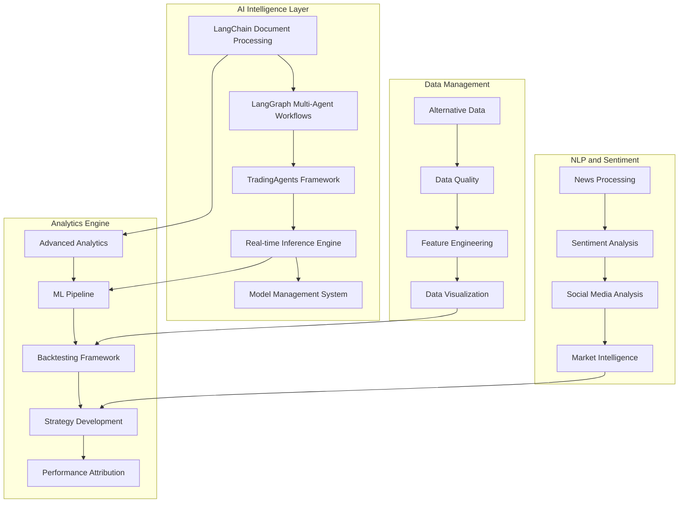

# Design Document - Phase 3: Advanced Analytics and AI Integration

## Overview

Phase 3 implements a comprehensive AI-powered trading ecosystem featuring LangChain/LangGraph agentic frameworks, TradingAgents multi-agent systems, real-time model inference engines with sub-millisecond latency, advanced analytics, machine learning pipelines, natural language processing for market sentiment, and sophisticated backtesting infrastructure. The design emphasizes enterprise-grade ML operations, multi-agent coordination, and intelligent trading decision support.

## Architecture

### High-Level AI Architecture



### Component Architecture

#### 1. LangChain/LangGraph Agentic AI Framework
- **Purpose**: Multi-agent coordination and document processing for trading research
- **Technology**: LangChain, LangGraph, OpenAI/Anthropic APIs, Vector Databases
- **Components**:
  - Document Processing Pipeline with RAG
  - Multi-Agent Workflow Orchestration
  - Agent Communication Protocols
  - Knowledge Base Management
  - Agentic Research Automation

#### 2. TradingAgents Multi-Agent System
- **Purpose**: Specialized trading agents with role-based decision making
- **Technology**: Custom Agent Framework, Message Passing, Consensus Algorithms
- **Components**:
  - Analyst Agent (Market Analysis)
  - Risk Manager Agent (Risk Assessment)
  - Trader Agent (Execution Decisions)
  - Portfolio Manager Agent (Asset Allocation)
  - Research Agent (Information Gathering)

#### 3. Real-time Model Inference Engine
- **Purpose**: Sub-millisecond AI model inference for high-frequency trading
- **Technology**: TensorFlow Serving, PyTorch, ONNX Runtime, GPU Acceleration
- **Components**:
  - Model Serving Infrastructure
  - Inference Pipeline Optimization
  - Model Warm-up and Caching
  - Batch Processing Engine
  - Performance Monitoring

#### 4. Advanced Analytics Engine
- **Purpose**: Comprehensive market analysis and quantitative research
- **Technology**: Pandas, NumPy, SciPy, Statsmodels, QuantLib
- **Components**:
  - Time-series Analysis
  - Statistical Modeling
  - Risk Analytics (VaR, CVaR)
  - Portfolio Optimization
  - Factor Analysis

#### 5. Machine Learning Pipeline
- **Purpose**: End-to-end ML workflow for trading strategies
- **Technology**: Scikit-learn, XGBoost, LightGBM, MLflow, Kubeflow
- **Components**:
  - Feature Engineering Pipeline
  - Model Training and Validation
  - Hyperparameter Optimization
  - Model Deployment and Monitoring
  - A/B Testing Framework

## Components and Interfaces

### LangChain/LangGraph Integration

#### Document Processing Pipeline
```python
from langchain.document_loaders import WebBaseLoader, PDFLoader
from langchain.text_splitter import RecursiveCharacterTextSplitter
from langchain.embeddings import OpenAIEmbeddings
from langchain.vectorstores import Chroma
from langchain.chains import RetrievalQA

class TradingDocumentProcessor:
    def __init__(self):
        self.embeddings = OpenAIEmbeddings()
        self.vectorstore = Chroma(embedding_function=self.embeddings)
        self.text_splitter = RecursiveCharacterTextSplitter(
            chunk_size=1000,
            chunk_overlap=200
        )
    
    async def process_financial_documents(self, documents: List[Document]) -> VectorStore:
        """Process financial documents for RAG pipeline"""
        chunks = self.text_splitter.split_documents(documents)
        return await self.vectorstore.afrom_documents(chunks, self.embeddings)
    
    async def create_research_chain(self, query: str) -> str:
        """Create research chain for trading analysis"""
        qa_chain = RetrievalQA.from_chain_type(
            llm=self.llm,
            chain_type="stuff",
            retriever=self.vectorstore.as_retriever()
        )
        return await qa_chain.arun(query)
```

#### LangGraph Multi-Agent Workflows
```python
from langgraph.graph import StateGraph, END
from langgraph.prebuilt import ToolExecutor

class TradingWorkflowState(TypedDict):
    market_data: Dict[str, Any]
    analysis_results: List[str]
    trading_signals: List[TradingSignal]
    risk_assessment: RiskAssessment
    final_decision: TradingDecision

class TradingWorkflowGraph:
    def __init__(self):
        self.workflow = StateGraph(TradingWorkflowState)
        self.setup_workflow()
    
    def setup_workflow(self):
        # Add nodes
        self.workflow.add_node("market_analyst", self.market_analysis_node)
        self.workflow.add_node("risk_manager", self.risk_assessment_node)
        self.workflow.add_node("signal_generator", self.signal_generation_node)
        self.workflow.add_node("decision_maker", self.decision_making_node)
        
        # Add edges
        self.workflow.add_edge("market_analyst", "risk_manager")
        self.workflow.add_edge("risk_manager", "signal_generator")
        self.workflow.add_edge("signal_generator", "decision_maker")
        self.workflow.add_edge("decision_maker", END)
        
        # Set entry point
        self.workflow.set_entry_point("market_analyst")
    
    async def market_analysis_node(self, state: TradingWorkflowState) -> TradingWorkflowState:
        """Perform market analysis using AI agents"""
        # Implementation for market analysis
        pass
    
    async def risk_assessment_node(self, state: TradingWorkflowState) -> TradingWorkflowState:
        """Assess risk using risk management agent"""
        # Implementation for risk assessment
        pass
```

### TradingAgents Multi-Agent Framework

#### Agent Base Class
```python
from abc import ABC, abstractmethod
from typing import Dict, List, Any
import asyncio

class TradingAgent(ABC):
    def __init__(self, agent_id: str, capabilities: List[str]):
        self.agent_id = agent_id
        self.capabilities = capabilities
        self.message_queue = asyncio.Queue()
        self.knowledge_base = {}
    
    @abstractmethod
    async def process_message(self, message: AgentMessage) -> AgentResponse:
        """Process incoming message and return response"""
        pass
    
    @abstractmethod
    async def make_decision(self, context: DecisionContext) -> Decision:
        """Make trading decision based on context"""
        pass
    
    async def send_message(self, recipient: str, message: AgentMessage):
        """Send message to another agent"""
        await self.agent_manager.route_message(recipient, message)
    
    async def broadcast_message(self, message: AgentMessage):
        """Broadcast message to all agents"""
        await self.agent_manager.broadcast(message)
```

#### Specialized Trading Agents
```python
class AnalystAgent(TradingAgent):
    def __init__(self):
        super().__init__("analyst", ["market_analysis", "technical_analysis", "fundamental_analysis"])
        self.models = {
            "sentiment": SentimentAnalysisModel(),
            "technical": TechnicalAnalysisModel(),
            "fundamental": FundamentalAnalysisModel()
        }
    
    async def analyze_market(self, symbol: str, timeframe: str) -> MarketAnalysis:
        """Perform comprehensive market analysis"""
        technical_analysis = await self.models["technical"].analyze(symbol, timeframe)
        fundamental_analysis = await self.models["fundamental"].analyze(symbol)
        sentiment_analysis = await self.models["sentiment"].analyze(symbol)
        
        return MarketAnalysis(
            symbol=symbol,
            technical=technical_analysis,
            fundamental=fundamental_analysis,
            sentiment=sentiment_analysis,
            confidence=self.calculate_confidence([technical_analysis, fundamental_analysis, sentiment_analysis])
        )

class RiskManagerAgent(TradingAgent):
    def __init__(self):
        super().__init__("risk_manager", ["risk_assessment", "position_sizing", "portfolio_risk"])
        self.risk_models = {
            "var": VaRModel(),
            "portfolio": PortfolioRiskModel(),
            "position": PositionRiskModel()
        }
    
    async def assess_trade_risk(self, trade_proposal: TradeProposal) -> RiskAssessment:
        """Assess risk for proposed trade"""
        position_risk = await self.risk_models["position"].calculate_risk(trade_proposal)
        portfolio_impact = await self.risk_models["portfolio"].assess_impact(trade_proposal)
        var_impact = await self.risk_models["var"].calculate_var_impact(trade_proposal)
        
        return RiskAssessment(
            position_risk=position_risk,
            portfolio_impact=portfolio_impact,
            var_impact=var_impact,
            recommendation=self.generate_risk_recommendation(position_risk, portfolio_impact, var_impact)
        )

class TraderAgent(TradingAgent):
    def __init__(self):
        super().__init__("trader", ["order_execution", "timing", "market_microstructure"])
        self.execution_algorithms = {
            "twap": TWAPAlgorithm(),
            "vwap": VWAPAlgorithm(),
            "implementation_shortfall": ImplementationShortfallAlgorithm()
        }
    
    async def execute_trade(self, trade_decision: TradeDecision) -> ExecutionResult:
        """Execute trade using optimal algorithm"""
        algorithm = self.select_execution_algorithm(trade_decision)
        return await algorithm.execute(trade_decision)
```

### Real-time Model Inference Engine

#### Model Serving Infrastructure
```python
import torch
import onnxruntime as ort
from typing import Union, List
import asyncio

class ModelInferenceEngine:
    def __init__(self):
        self.models = {}
        self.model_cache = {}
        self.inference_queue = asyncio.Queue()
        self.batch_size = 32
        self.max_latency_ms = 1  # Sub-millisecond requirement
    
    async def load_model(self, model_id: str, model_path: str, framework: str = "pytorch"):
        """Load model for inference"""
        if framework == "pytorch":
            model = torch.jit.load(model_path)
            model.eval()
        elif framework == "onnx":
            model = ort.InferenceSession(model_path)
        else:
            raise ValueError(f"Unsupported framework: {framework}")
        
        self.models[model_id] = {
            "model": model,
            "framework": framework,
            "loaded_at": asyncio.get_event_loop().time()
        }
    
    async def predict(self, model_id: str, input_data: torch.Tensor) -> torch.Tensor:
        """Perform inference with sub-millisecond latency"""
        start_time = asyncio.get_event_loop().time()
        
        model_info = self.models[model_id]
        model = model_info["model"]
        
        if model_info["framework"] == "pytorch":
            with torch.no_grad():
                result = model(input_data)
        elif model_info["framework"] == "onnx":
            input_name = model.get_inputs()[0].name
            result = model.run(None, {input_name: input_data.numpy()})
            result = torch.tensor(result[0])
        
        inference_time = (asyncio.get_event_loop().time() - start_time) * 1000
        if inference_time > self.max_latency_ms:
            logger.warning(f"Inference time {inference_time:.3f}ms exceeded target {self.max_latency_ms}ms")
        
        return result
    
    async def batch_predict(self, model_id: str, batch_data: List[torch.Tensor]) -> List[torch.Tensor]:
        """Batch inference for improved throughput"""
        batched_input = torch.stack(batch_data)
        batched_result = await self.predict(model_id, batched_input)
        return [batched_result[i] for i in range(len(batch_data))]
```

#### Model Management System
```python
class ModelManager:
    def __init__(self):
        self.model_registry = {}
        self.model_versions = {}
        self.performance_metrics = {}
        self.a_b_tests = {}
    
    async def register_model(self, model_info: ModelInfo):
        """Register new model version"""
        self.model_registry[model_info.model_id] = model_info
        self.model_versions[model_info.model_id] = model_info.version
    
    async def deploy_model(self, model_id: str, version: str, deployment_config: DeploymentConfig):
        """Deploy model to inference engine"""
        model_path = self.get_model_path(model_id, version)
        await self.inference_engine.load_model(model_id, model_path)
        
        # Start performance monitoring
        await self.start_performance_monitoring(model_id)
    
    async def create_ab_test(self, model_a: str, model_b: str, traffic_split: float):
        """Create A/B test between two models"""
        test_id = f"{model_a}_vs_{model_b}_{int(time.time())}"
        self.a_b_tests[test_id] = {
            "model_a": model_a,
            "model_b": model_b,
            "traffic_split": traffic_split,
            "start_time": time.time(),
            "metrics": {"model_a": {}, "model_b": {}}
        }
        return test_id
    
    async def evaluate_ab_test(self, test_id: str) -> ABTestResult:
        """Evaluate A/B test results"""
        test_data = self.a_b_tests[test_id]
        # Statistical analysis of model performance
        return ABTestResult(
            winner=self.determine_winner(test_data),
            confidence=self.calculate_confidence(test_data),
            metrics=test_data["metrics"]
        )
```

### Advanced Analytics Engine

#### Time-Series Analysis
```python
import pandas as pd
import numpy as np
from statsmodels.tsa.arima.model import ARIMA
from statsmodels.tsa.stattools import adfuller
from arch import arch_model

class TimeSeriesAnalyzer:
    def __init__(self):
        self.models = {}
    
    async def analyze_price_series(self, price_data: pd.Series) -> TimeSeriesAnalysis:
        """Comprehensive time series analysis"""
        # Stationarity test
        stationarity = self.test_stationarity(price_data)
        
        # Trend analysis
        trend = self.analyze_trend(price_data)
        
        # Seasonality detection
        seasonality = self.detect_seasonality(price_data)
        
        # Volatility modeling
        volatility = await self.model_volatility(price_data)
        
        # Forecasting
        forecast = await self.forecast_prices(price_data)
        
        return TimeSeriesAnalysis(
            stationarity=stationarity,
            trend=trend,
            seasonality=seasonality,
            volatility=volatility,
            forecast=forecast
        )
    
    def test_stationarity(self, series: pd.Series) -> StationarityResult:
        """Test for stationarity using Augmented Dickey-Fuller test"""
        result = adfuller(series.dropna())
        return StationarityResult(
            adf_statistic=result[0],
            p_value=result[1],
            critical_values=result[4],
            is_stationary=result[1] < 0.05
        )
    
    async def model_volatility(self, returns: pd.Series) -> VolatilityModel:
        """Model volatility using GARCH"""
        model = arch_model(returns, vol='Garch', p=1, q=1)
        fitted_model = model.fit(disp='off')
        
        # Forecast volatility
        forecast = fitted_model.forecast(horizon=5)
        
        return VolatilityModel(
            model=fitted_model,
            forecast=forecast,
            conditional_volatility=fitted_model.conditional_volatility
        )
```

#### Portfolio Optimization
```python
import cvxpy as cp
from scipy.optimize import minimize
import numpy as np

class PortfolioOptimizer:
    def __init__(self):
        self.risk_models = {
            "sample_covariance": self.sample_covariance,
            "shrinkage": self.shrinkage_covariance,
            "factor_model": self.factor_model_covariance
        }
    
    async def optimize_portfolio(self, expected_returns: np.ndarray, 
                               covariance_matrix: np.ndarray,
                               constraints: PortfolioConstraints) -> OptimizationResult:
        """Optimize portfolio using modern portfolio theory"""
        n_assets = len(expected_returns)
        weights = cp.Variable(n_assets)
        
        # Objective: maximize return - risk penalty
        risk_penalty = constraints.risk_aversion * cp.quad_form(weights, covariance_matrix)
        objective = cp.Maximize(expected_returns.T @ weights - risk_penalty)
        
        # Constraints
        constraints_list = [
            cp.sum(weights) == 1,  # Fully invested
            weights >= constraints.min_weight,  # Minimum weight
            weights <= constraints.max_weight   # Maximum weight
        ]
        
        # Sector constraints
        if constraints.sector_limits:
            for sector, (min_weight, max_weight) in constraints.sector_limits.items():
                sector_weights = cp.sum([weights[i] for i in constraints.sector_mapping[sector]])
                constraints_list.extend([
                    sector_weights >= min_weight,
                    sector_weights <= max_weight
                ])
        
        # Solve optimization
        problem = cp.Problem(objective, constraints_list)
        problem.solve()
        
        return OptimizationResult(
            weights=weights.value,
            expected_return=expected_returns.T @ weights.value,
            expected_risk=np.sqrt(weights.value.T @ covariance_matrix @ weights.value),
            sharpe_ratio=self.calculate_sharpe_ratio(weights.value, expected_returns, covariance_matrix),
            status=problem.status
        )
    
    async def black_litterman_optimization(self, market_caps: np.ndarray,
                                         views: Dict[str, float],
                                         view_confidence: np.ndarray) -> OptimizationResult:
        """Black-Litterman portfolio optimization"""
        # Implementation of Black-Litterman model
        pass
```

### Natural Language Processing and Sentiment Analysis

#### News Sentiment Analysis
```python
from transformers import pipeline, AutoTokenizer, AutoModelForSequenceClassification
import asyncio

class NewsSentimentAnalyzer:
    def __init__(self):
        self.sentiment_pipeline = pipeline(
            "sentiment-analysis",
            model="ProsusAI/finbert",
            tokenizer="ProsusAI/finbert"
        )
        self.news_sources = [
            "reuters", "bloomberg", "wsj", "ft", "cnbc"
        ]
    
    async def analyze_news_sentiment(self, symbol: str, timeframe: str = "1d") -> SentimentAnalysis:
        """Analyze news sentiment for a given symbol"""
        # Fetch news articles
        articles = await self.fetch_news_articles(symbol, timeframe)
        
        # Process articles in batches
        sentiment_scores = []
        for batch in self.batch_articles(articles, batch_size=32):
            batch_scores = await self.process_article_batch(batch)
            sentiment_scores.extend(batch_scores)
        
        # Aggregate sentiment
        aggregated_sentiment = self.aggregate_sentiment(sentiment_scores)
        
        return SentimentAnalysis(
            symbol=symbol,
            timeframe=timeframe,
            overall_sentiment=aggregated_sentiment,
            article_count=len(articles),
            sentiment_distribution=self.calculate_distribution(sentiment_scores),
            confidence=self.calculate_confidence(sentiment_scores)
        )
    
    async def process_article_batch(self, articles: List[NewsArticle]) -> List[SentimentScore]:
        """Process batch of articles for sentiment"""
        texts = [article.title + " " + article.content[:500] for article in articles]
        results = self.sentiment_pipeline(texts)
        
        return [
            SentimentScore(
                article_id=articles[i].id,
                sentiment=result['label'],
                confidence=result['score'],
                timestamp=articles[i].published_at
            )
            for i, result in enumerate(results)
        ]
```

#### Social Media Sentiment
```python
class SocialMediaAnalyzer:
    def __init__(self):
        self.platforms = {
            "twitter": TwitterAPI(),
            "reddit": RedditAPI(),
            "stocktwits": StockTwitsAPI()
        }
        self.sentiment_model = SentimentModel()
    
    async def analyze_social_sentiment(self, symbol: str, timeframe: str = "1h") -> SocialSentiment:
        """Analyze social media sentiment"""
        all_posts = []
        
        # Collect posts from all platforms
        for platform_name, platform_api in self.platforms.items():
            posts = await platform_api.get_posts(symbol, timeframe)
            all_posts.extend(posts)
        
        # Analyze sentiment
        sentiment_results = await self.sentiment_model.analyze_batch([post.text for post in all_posts])
        
        # Calculate metrics
        sentiment_score = np.mean([result.score for result in sentiment_results])
        volume = len(all_posts)
        engagement = sum([post.likes + post.shares + post.comments for post in all_posts])
        
        return SocialSentiment(
            symbol=symbol,
            sentiment_score=sentiment_score,
            volume=volume,
            engagement=engagement,
            platform_breakdown=self.calculate_platform_breakdown(all_posts, sentiment_results),
            trending_topics=self.extract_trending_topics(all_posts)
        )
```

## Data Models

### AI and ML Models
```python
@dataclass
class ModelInfo:
    model_id: str
    name: str
    version: str
    framework: str
    model_type: str
    input_shape: Tuple[int, ...]
    output_shape: Tuple[int, ...]
    performance_metrics: Dict[str, float]
    created_at: datetime
    updated_at: datetime

@dataclass
class InferenceRequest:
    model_id: str
    input_data: Union[torch.Tensor, np.ndarray]
    batch_size: int = 1
    timeout_ms: int = 1
    priority: str = "normal"

@dataclass
class InferenceResult:
    request_id: str
    model_id: str
    predictions: Union[torch.Tensor, np.ndarray]
    confidence_scores: Optional[np.ndarray]
    inference_time_ms: float
    timestamp: datetime
```

### Agent Communication Models
```python
@dataclass
class AgentMessage:
    sender_id: str
    recipient_id: str
    message_type: str
    content: Dict[str, Any]
    timestamp: datetime
    correlation_id: str
    priority: int = 0

@dataclass
class AgentResponse:
    response_id: str
    original_message_id: str
    sender_id: str
    content: Dict[str, Any]
    status: str
    timestamp: datetime

@dataclass
class DecisionContext:
    market_data: Dict[str, Any]
    portfolio_state: Dict[str, Any]
    risk_metrics: Dict[str, Any]
    external_signals: List[Dict[str, Any]]
    timestamp: datetime
```

### Analytics Models
```python
@dataclass
class TimeSeriesAnalysis:
    symbol: str
    analysis_type: str
    stationarity: StationarityResult
    trend: TrendAnalysis
    seasonality: SeasonalityAnalysis
    volatility: VolatilityModel
    forecast: ForecastResult
    confidence_intervals: Dict[str, Tuple[float, float]]

@dataclass
class SentimentAnalysis:
    symbol: str
    timeframe: str
    overall_sentiment: float
    sentiment_distribution: Dict[str, float]
    article_count: int
    confidence: float
    trending_topics: List[str]
    timestamp: datetime
```

## Performance and Scalability

### Inference Performance
- **Latency Target**: Sub-millisecond inference for critical models
- **Throughput**: 100,000+ inferences per second
- **Batch Processing**: Dynamic batching for optimal throughput
- **GPU Acceleration**: CUDA/ROCm support for intensive models
- **Model Optimization**: ONNX, TensorRT, and quantization support

### Scalability Architecture
- **Horizontal Scaling**: Kubernetes-based model serving
- **Load Balancing**: Intelligent request routing
- **Auto-scaling**: Dynamic scaling based on inference load
- **Resource Management**: GPU/CPU resource optimization
- **Caching**: Multi-level caching for frequently used models

This comprehensive design ensures Phase 3 delivers enterprise-grade AI capabilities with the performance and reliability required for algorithmic trading.