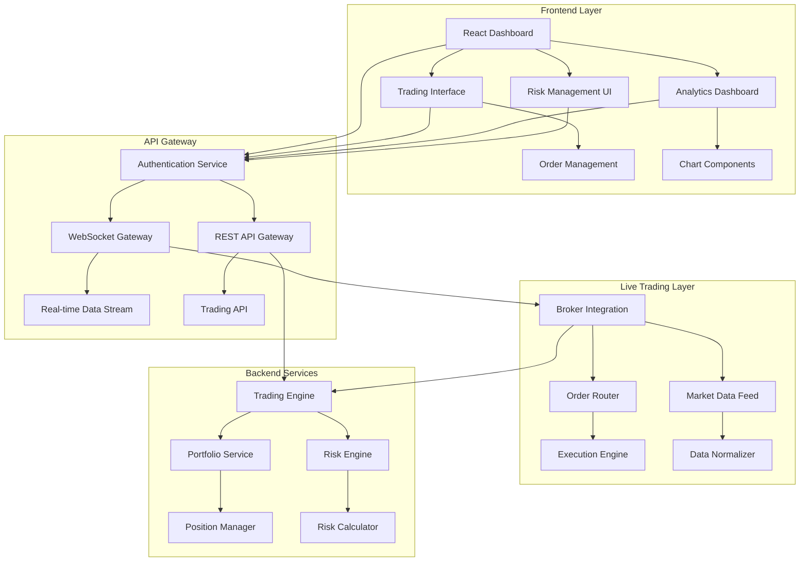

# Design Document - Phase 4: Frontend & Live Trading

## Overview

Phase 4 transforms the algorithmic trading system into a complete, production-ready platform with advanced frontend capabilities and live trading integration. The design emphasizes real-time performance, user experience, and seamless integration with existing backend services while maintaining security and scalability.

## Architecture

### High-Level Architecture



### Component Architecture

The system follows a microservices architecture with clear separation of concerns:

1. **Frontend Layer**: React-based SPA with real-time capabilities
2. **API Gateway**: Centralized routing and authentication
3. **Live Trading Layer**: Broker integration and market data handling
4. **Backend Services**: Core trading logic and data management

## Components and Interfaces

### Frontend Components

#### 1. Dashboard Framework
- **Technology**: React 18 with TypeScript
- **State Management**: Redux Toolkit with RTK Query
- **Real-time Updates**: WebSocket integration with Socket.IO
- **Styling**: Material-UI with custom trading theme

#### 2. Trading Interface Components
```typescript
interface TradingInterface {
  orderEntry: OrderEntryComponent;
  positionManager: PositionManagerComponent;
  orderBook: OrderBookComponent;
  tradeHistory: TradeHistoryComponent;
}

interface OrderEntryComponent {
  symbol: string;
  orderType: 'market' | 'limit' | 'stop' | 'stop-limit';
  quantity: number;
  price?: number;
  timeInForce: 'GTC' | 'IOC' | 'FOK' | 'DAY';
  validation: OrderValidation;
}
```

#### 3. Charting and Visualization
- **Library**: TradingView Charting Library
- **Real-time Data**: WebSocket-based price feeds
- **Technical Indicators**: 50+ built-in indicators
- **Custom Drawing Tools**: Trend lines, Fibonacci retracements

#### 4. Risk Management Dashboard
```typescript
interface RiskDashboard {
  portfolioMetrics: PortfolioRiskMetrics;
  positionLimits: PositionLimitMonitor;
  varCalculation: VaRCalculator;
  stressTests: StressTestResults;
}
```

### API Gateway Design

#### Authentication Service
- **JWT-based authentication** with refresh tokens
- **Multi-factor authentication** support
- **Role-based access control** (RBAC)
- **Session management** with Redis

#### WebSocket Gateway
```typescript
interface WebSocketEvents {
  'market-data': MarketDataUpdate;
  'order-updates': OrderStatusUpdate;
  'portfolio-updates': PortfolioUpdate;
  'risk-alerts': RiskAlert;
  'system-notifications': SystemNotification;
}
```

### Live Trading Integration

#### Broker Connectivity
- **FIX Protocol** for institutional brokers
- **REST/WebSocket APIs** for retail brokers
- **Multi-broker support** with unified interface
- **Failover mechanisms** for high availability

#### Market Data Integration
```typescript
interface MarketDataFeed {
  symbols: string[];
  dataTypes: ('quotes' | 'trades' | 'depth' | 'news')[];
  frequency: 'tick' | '1s' | '5s' | '1m';
  normalization: DataNormalizationConfig;
}
```

#### Order Management System
- **Smart order routing** across multiple venues
- **Order validation** and risk checks
- **Execution algorithms** (TWAP, VWAP, Implementation Shortfall)
- **Fill management** and trade reporting

## Data Models

### Trading Models
```typescript
interface Order {
  id: string;
  clientOrderId: string;
  symbol: string;
  side: 'buy' | 'sell';
  orderType: OrderType;
  quantity: number;
  price?: number;
  stopPrice?: number;
  timeInForce: TimeInForce;
  status: OrderStatus;
  timestamps: OrderTimestamps;
  fills: Fill[];
}

interface Position {
  symbol: string;
  quantity: number;
  averagePrice: number;
  marketValue: number;
  unrealizedPnL: number;
  realizedPnL: number;
  lastUpdate: Date;
}

interface Portfolio {
  id: string;
  name: string;
  totalValue: number;
  cashBalance: number;
  positions: Position[];
  performance: PerformanceMetrics;
  riskMetrics: RiskMetrics;
}
```

### Market Data Models
```typescript
interface Quote {
  symbol: string;
  bid: number;
  ask: number;
  bidSize: number;
  askSize: number;
  timestamp: Date;
}

interface Trade {
  symbol: string;
  price: number;
  size: number;
  timestamp: Date;
  conditions: string[];
}

interface MarketDepth {
  symbol: string;
  bids: PriceLevel[];
  asks: PriceLevel[];
  timestamp: Date;
}
```

## Error Handling

### Frontend Error Handling
- **Global error boundary** for React components
- **API error interceptors** with user-friendly messages
- **Retry mechanisms** for failed requests
- **Offline mode** with cached data

### Trading Error Handling
- **Order rejection handling** with clear error messages
- **Connection failure recovery** with automatic reconnection
- **Data validation errors** with field-level feedback
- **Risk limit violations** with immediate user notification

### System Error Handling
```typescript
interface ErrorHandler {
  captureError(error: Error, context: ErrorContext): void;
  notifyUser(error: UserFacingError): void;
  logError(error: Error, severity: 'low' | 'medium' | 'high' | 'critical'): void;
  triggerAlert(error: CriticalError): void;
}
```

## Testing Strategy

### Frontend Testing
- **Unit Tests**: Jest + React Testing Library
- **Integration Tests**: Cypress for E2E testing
- **Visual Regression Tests**: Chromatic for UI consistency
- **Performance Tests**: Lighthouse CI for performance monitoring

### API Testing
- **Unit Tests**: Jest for business logic
- **Integration Tests**: Supertest for API endpoints
- **Load Tests**: Artillery for performance testing
- **Contract Tests**: Pact for API contract validation

### Trading System Testing
- **Simulation Environment**: Paper trading with real market data
- **Backtesting Framework**: Historical data validation
- **Stress Testing**: High-volume order processing
- **Failover Testing**: Connection and system failure scenarios

### Test Data Management
```typescript
interface TestDataManager {
  generateMarketData(config: MarketDataConfig): MarketData[];
  createTestPortfolio(config: PortfolioConfig): Portfolio;
  simulateOrderFlow(orders: Order[]): OrderExecution[];
  mockBrokerResponses(scenarios: BrokerScenario[]): MockResponse[];
}
```

## Security Considerations

### Authentication & Authorization
- **OAuth 2.0 + OIDC** for enterprise integration
- **API key management** for service-to-service communication
- **Rate limiting** to prevent abuse
- **Audit logging** for all user actions

### Data Protection
- **Encryption at rest** for sensitive data
- **TLS 1.3** for all communications
- **Data masking** in non-production environments
- **GDPR compliance** for user data handling

### Trading Security
- **Order validation** to prevent erroneous trades
- **Position limits** enforcement
- **Suspicious activity detection**
- **Emergency stop mechanisms**

## Performance Optimization

### Frontend Performance
- **Code splitting** for faster initial load
- **Lazy loading** for non-critical components
- **Memoization** for expensive calculations
- **Virtual scrolling** for large data sets

### Real-time Data Performance
- **WebSocket connection pooling**
- **Data compression** for market data feeds
- **Client-side caching** with TTL
- **Selective subscriptions** to reduce bandwidth

### API Performance
- **Response caching** with Redis
- **Database query optimization**
- **Connection pooling** for database connections
- **Horizontal scaling** with load balancers

## Deployment Strategy

### Infrastructure
- **Kubernetes** for container orchestration
- **Docker** for application containerization
- **NGINX** for load balancing and SSL termination
- **Redis** for session storage and caching

### CI/CD Pipeline
- **GitHub Actions** for automated testing and deployment
- **Blue-green deployment** for zero-downtime updates
- **Feature flags** for gradual rollouts
- **Monitoring and alerting** for deployment health

### Environment Management
- **Development**: Local development with mock data
- **Staging**: Production-like environment with paper trading
- **Production**: Live trading with full monitoring
- **Disaster Recovery**: Multi-region deployment capability