# Design Document - Phase 5: Enterprise Readiness

## Overview

Phase 5 transforms the algorithmic trading system into an enterprise-grade platform capable of operating in regulated financial environments. The design emphasizes observability, security, compliance, high availability, and scalability while maintaining the performance characteristics required for algorithmic trading.

## Architecture

### Enterprise Architecture Overview

```mermaid
graph TB
    subgraph "Observability Layer"
        A[Prometheus Metrics] --> B[Grafana Dashboards]
        A --> C[AlertManager]
        D[Jaeger Tracing] --> E[Distributed Tracing]
        F[ELK Stack] --> G[Log Aggregation]
    end
    
    subgraph "Security Layer"
        H[Identity Provider] --> I[OAuth2/OIDC]
        H --> J[RBAC Engine]
        K[WAF] --> L[API Gateway]
        M[Vault] --> N[Secret Management]
    end
    
    subgraph "High Availability Layer"
        O[Load Balancer] --> P[Multi-AZ Deployment]
        Q[Database Cluster] --> R[Read Replicas]
        S[Message Queue Cluster] --> T[Event Streaming]
        U[Cache Cluster] --> V[Distributed Cache]
    end
    
    subgraph "Application Layer"
        W[Trading Services] --> X[API Services]
        W --> Y[Background Jobs]
        X --> Z[WebSocket Services]
        Y --> AA[Batch Processing]
    end
    
    subgraph "Data Layer"
        BB[Primary DB] --> CC[Backup Systems]
        DD[Time Series DB] --> EE[Analytics DB]
        FF[Object Storage] --> GG[Archive Storage]
    end
    
    A --> W
    D --> W
    F --> W
    I --> X
    L --> X
    O --> W
    W --> BB
    W --> DD
```



### Microservices Architecture

The system follows a domain-driven microservices architecture with clear service boundaries:

1. **Core Trading Services**: Order management, execution, portfolio management
2. **Market Data Services**: Real-time feeds, historical data, analytics
3. **Risk Management Services**: Risk calculation, limit monitoring, compliance
4. **User Management Services**: Authentication, authorization, user profiles
5. **Notification Services**: Alerts, reporting, communication
6. **Infrastructure Services**: Configuration, monitoring, logging

## Components and Interfaces

### Observability Infrastructure

#### Metrics Collection
```typescript
interface MetricsCollector {
  // Business metrics
  recordTradeExecution(trade: Trade): void;
  recordOrderLatency(orderId: string, latency: number): void;
  recordPortfolioValue(portfolioId: string, value: number): void;
  
  // System metrics
  recordAPILatency(endpoint: string, latency: number): void;
  recordDatabaseQuery(query: string, duration: number): void;
  recordCacheHit(key: string, hit: boolean): void;
  
  // Custom metrics
  recordCustomMetric(name: string, value: number, labels: Record<string, string>): void;
}
```

#### Distributed Tracing
```typescript
interface TracingService {
  startSpan(operationName: string, parentSpan?: Span): Span;
  finishSpan(span: Span, tags?: Record<string, any>): void;
  injectHeaders(span: Span): Record<string, string>;
  extractSpan(headers: Record<string, string>): Span | null;
}
```

#### Logging Framework
```typescript
interface StructuredLogger {
  info(message: string, context: LogContext): void;
  warn(message: string, context: LogContext): void;
  error(message: string, error: Error, context: LogContext): void;
  audit(action: string, user: string, resource: string, context: AuditContext): void;
}

interface LogContext {
  traceId: string;
  spanId: string;
  userId?: string;
  sessionId?: string;
  correlationId: string;
  metadata: Record<string, any>;
}
```

### Security Infrastructure

#### Identity and Access Management
```typescript
interface IdentityProvider {
  authenticate(credentials: Credentials): Promise<AuthResult>;
  validateToken(token: string): Promise<TokenValidation>;
  refreshToken(refreshToken: string): Promise<TokenPair>;
  revokeToken(token: string): Promise<void>;
}

interface AuthorizationService {
  checkPermission(user: User, resource: string, action: string): Promise<boolean>;
  getUserRoles(userId: string): Promise<Role[]>;
  getResourcePermissions(resource: string): Promise<Permission[]>;
  enforcePolicy(policy: SecurityPolicy, context: RequestContext): Promise<PolicyResult>;
}
```

#### Encryption and Key Management
```typescript
interface EncryptionService {
  encrypt(data: string, keyId: string): Promise<EncryptedData>;
  decrypt(encryptedData: EncryptedData): Promise<string>;
  generateKey(keyType: KeyType): Promise<CryptoKey>;
  rotateKey(keyId: string): Promise<void>;
}

interface SecretManager {
  getSecret(secretName: string): Promise<string>;
  setSecret(secretName: string, value: string): Promise<void>;
  rotateSecret(secretName: string): Promise<void>;
  auditSecretAccess(secretName: string, accessor: string): Promise<void>;
}
```

### High Availability Design

#### Load Balancing and Failover
```typescript
interface LoadBalancer {
  registerService(service: ServiceInstance): void;
  deregisterService(serviceId: string): void;
  getHealthyInstances(serviceName: string): ServiceInstance[];
  routeRequest(request: Request): ServiceInstance;
}

interface FailoverManager {
  detectFailure(service: ServiceInstance): void;
  initiateFailover(primaryService: string, backupService: string): Promise<void>;
  validateFailover(service: string): Promise<boolean>;
  rollbackFailover(service: string): Promise<void>;
}
```

#### Data Replication and Backup
```typescript
interface ReplicationManager {
  setupReplication(primary: DatabaseConfig, replicas: DatabaseConfig[]): Promise<void>;
  monitorReplicationLag(): Promise<ReplicationStatus[]>;
  promoteReplica(replicaId: string): Promise<void>;
  resyncReplica(replicaId: string): Promise<void>;
}

interface BackupService {
  createBackup(database: string, type: BackupType): Promise<BackupResult>;
  restoreBackup(backupId: string, targetDatabase: string): Promise<RestoreResult>;
  scheduleBackup(schedule: BackupSchedule): Promise<void>;
  validateBackup(backupId: string): Promise<ValidationResult>;
}
```

### Performance and Scalability

#### Auto-scaling Infrastructure
```typescript
interface AutoScaler {
  defineScalingPolicy(service: string, policy: ScalingPolicy): void;
  monitorMetrics(service: string): Promise<MetricSnapshot>;
  scaleUp(service: string, instances: number): Promise<ScalingResult>;
  scaleDown(service: string, instances: number): Promise<ScalingResult>;
}

interface ScalingPolicy {
  minInstances: number;
  maxInstances: number;
  targetCPU: number;
  targetMemory: number;
  scaleUpCooldown: number;
  scaleDownCooldown: number;
  customMetrics: CustomMetric[];
}
```

#### Caching Strategy
```typescript
interface CacheManager {
  get<T>(key: string): Promise<T | null>;
  set<T>(key: string, value: T, ttl?: number): Promise<void>;
  invalidate(pattern: string): Promise<void>;
  getStats(): Promise<CacheStats>;
}

interface CacheStrategy {
  writeThrough: boolean;
  writeBack: boolean;
  readThrough: boolean;
  evictionPolicy: 'LRU' | 'LFU' | 'FIFO' | 'TTL';
  maxSize: number;
  ttl: number;
}
```

## Data Models

### Monitoring Data Models
```typescript
interface Metric {
  name: string;
  value: number;
  timestamp: Date;
  labels: Record<string, string>;
  type: 'counter' | 'gauge' | 'histogram' | 'summary';
}

interface Alert {
  id: string;
  name: string;
  severity: 'info' | 'warning' | 'critical';
  status: 'firing' | 'resolved';
  labels: Record<string, string>;
  annotations: Record<string, string>;
  startsAt: Date;
  endsAt?: Date;
}

interface Trace {
  traceId: string;
  spans: Span[];
  duration: number;
  startTime: Date;
  endTime: Date;
  services: string[];
}
```

### Security Data Models
```typescript
interface User {
  id: string;
  username: string;
  email: string;
  roles: Role[];
  permissions: Permission[];
  lastLogin: Date;
  mfaEnabled: boolean;
  status: 'active' | 'inactive' | 'locked';
}

interface AuditLog {
  id: string;
  timestamp: Date;
  userId: string;
  action: string;
  resource: string;
  outcome: 'success' | 'failure';
  ipAddress: string;
  userAgent: string;
  details: Record<string, any>;
}

interface SecurityEvent {
  id: string;
  type: 'authentication' | 'authorization' | 'data_access' | 'system_change';
  severity: 'low' | 'medium' | 'high' | 'critical';
  timestamp: Date;
  source: string;
  description: string;
  metadata: Record<string, any>;
}
```

## Error Handling

### Enterprise Error Management
```typescript
interface ErrorHandler {
  handleError(error: Error, context: ErrorContext): Promise<void>;
  categorizeError(error: Error): ErrorCategory;
  shouldRetry(error: Error): boolean;
  getRetryStrategy(error: Error): RetryStrategy;
}

interface ErrorContext {
  service: string;
  operation: string;
  userId?: string;
  traceId: string;
  timestamp: Date;
  metadata: Record<string, any>;
}

interface RetryStrategy {
  maxAttempts: number;
  backoffType: 'exponential' | 'linear' | 'fixed';
  initialDelay: number;
  maxDelay: number;
  jitter: boolean;
}
```

### Circuit Breaker Pattern
```typescript
interface CircuitBreaker {
  call<T>(operation: () => Promise<T>): Promise<T>;
  getState(): 'closed' | 'open' | 'half-open';
  getMetrics(): CircuitBreakerMetrics;
  reset(): void;
}

interface CircuitBreakerConfig {
  failureThreshold: number;
  recoveryTimeout: number;
  monitoringPeriod: number;
  expectedErrors: string[];
}
```

## Testing Strategy

### Enterprise Testing Framework
```typescript
interface TestingFramework {
  // Unit testing
  runUnitTests(service: string): Promise<TestResult>;
  
  // Integration testing
  runIntegrationTests(services: string[]): Promise<TestResult>;
  
  // End-to-end testing
  runE2ETests(scenarios: TestScenario[]): Promise<TestResult>;
  
  // Performance testing
  runLoadTests(config: LoadTestConfig): Promise<PerformanceResult>;
  
  // Security testing
  runSecurityTests(targets: string[]): Promise<SecurityTestResult>;
  
  // Chaos testing
  runChaosTests(experiments: ChaosExperiment[]): Promise<ChaosTestResult>;
}
```

### Test Data Management
```typescript
interface TestDataManager {
  createTestEnvironment(config: EnvironmentConfig): Promise<TestEnvironment>;
  seedTestData(environment: string, dataset: TestDataset): Promise<void>;
  cleanupTestData(environment: string): Promise<void>;
  maskSensitiveData(data: any): any;
}
```

## Deployment and Operations

### Infrastructure as Code
```typescript
interface InfrastructureManager {
  deployInfrastructure(template: InfrastructureTemplate): Promise<DeploymentResult>;
  updateInfrastructure(changes: InfrastructureChange[]): Promise<UpdateResult>;
  rollbackInfrastructure(version: string): Promise<RollbackResult>;
  validateInfrastructure(): Promise<ValidationResult>;
}
```

### Configuration Management
```typescript
interface ConfigurationManager {
  getConfiguration(service: string, environment: string): Promise<Configuration>;
  updateConfiguration(service: string, config: Configuration): Promise<void>;
  validateConfiguration(config: Configuration): Promise<ValidationResult>;
  rollbackConfiguration(service: string, version: string): Promise<void>;
}

interface FeatureFlagManager {
  isFeatureEnabled(flag: string, context: FeatureContext): Promise<boolean>;
  updateFeatureFlag(flag: string, config: FeatureFlagConfig): Promise<void>;
  getFeatureFlagMetrics(flag: string): Promise<FeatureFlagMetrics>;
  scheduleFeatureRollout(flag: string, schedule: RolloutSchedule): Promise<void>;
}
```

### Monitoring and Alerting
```typescript
interface MonitoringService {
  createDashboard(config: DashboardConfig): Promise<Dashboard>;
  createAlert(config: AlertConfig): Promise<Alert>;
  getSystemHealth(): Promise<HealthStatus>;
  generateReport(type: ReportType, timeRange: TimeRange): Promise<Report>;
}

interface AlertingService {
  sendAlert(alert: Alert, channels: NotificationChannel[]): Promise<void>;
  escalateAlert(alertId: string): Promise<void>;
  acknowledgeAlert(alertId: string, userId: string): Promise<void>;
  resolveAlert(alertId: string, resolution: string): Promise<void>;
}
```

## Compliance and Governance

### Regulatory Compliance
```typescript
interface ComplianceManager {
  generateComplianceReport(regulation: string, period: TimePeriod): Promise<ComplianceReport>;
  validateTransaction(transaction: Transaction): Promise<ComplianceResult>;
  auditDataAccess(userId: string, resource: string): Promise<void>;
  enforceDataRetention(policy: RetentionPolicy): Promise<void>;
}

interface RegulatoryReporting {
  generateMiFIDReport(period: TimePeriod): Promise<MiFIDReport>;
  generateEMIRReport(period: TimePeriod): Promise<EMIRReport>;
  generateSOXReport(period: TimePeriod): Promise<SOXReport>;
  submitRegulatoryReport(report: RegulatoryReport): Promise<SubmissionResult>;
}
```

This design ensures the algorithmic trading system meets enterprise-grade requirements for security, compliance, scalability, and operational excellence while maintaining the high-performance characteristics essential for algorithmic trading operations.