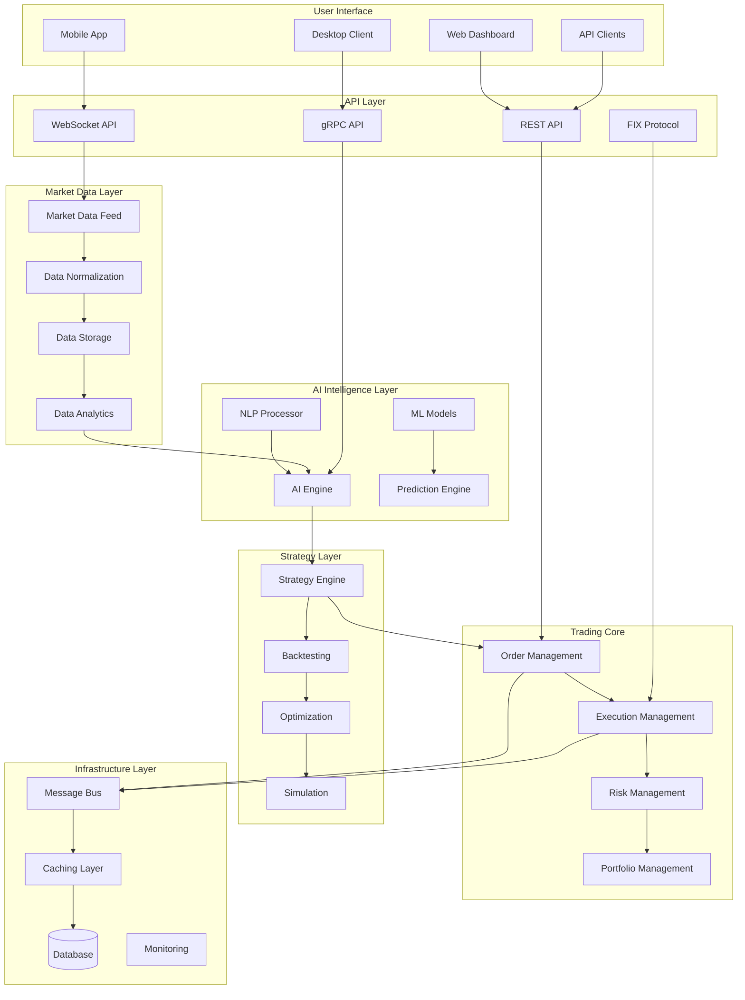

# Nautilus Trader Engine - Phase 6 System Enhancement Design

## Overview

This design document outlines the comprehensive architecture for Phase 6 system enhancements, including extended broker integrations (OANDA live, Coinbase live, FIX protocol), advanced portfolio analytics with multi-method VaR, automated regulatory reporting, Kubernetes deployment infrastructure, CI/CD pipelines, and enterprise-grade monitoring. The design emphasizes production readiness, regulatory compliance, and scalable cloud-native deployment.

## Architecture

### High-Level System Architecture



### Component Architecture

#### 1. AI Intelligence Layer

**ML Models Component**
- TensorFlow/PyTorch integration for deep learning models
- Model versioning and A/B testing framework
- Real-time inference engine with sub-millisecond latency
- Automated model retraining pipeline

**AI Engine Component**
- Pattern recognition for market anomalies
- Sentiment analysis from news and social media
- Predictive analytics for price movements
- Risk assessment and recommendation engine

**NLP Processor Component**
- News sentiment analysis
- Earnings call transcription and analysis
- Social media sentiment tracking
- Regulatory filing analysis

#### 2. Enhanced Trading Core

**Advanced Order Management System (OMS)**
```python
class AdvancedOMS:
    def __init__(self):
        self.order_router = SmartOrderRouter()
        self.execution_algos = ExecutionAlgorithms()
        self.compliance_engine = ComplianceEngine()
        self.risk_manager = RealTimeRiskManager()
    
    async def process_order(self, order: Order) -> OrderResponse:
        # Pre-trade compliance check
        compliance_result = await self.compliance_engine.validate(order)
        if not compliance_result.approved:
            return OrderResponse.rejected(compliance_result.reason)
        
        # Risk assessment
        risk_assessment = await self.risk_manager.assess_order(order)
        if risk_assessment.risk_level > self.max_risk_threshold:
            return OrderResponse.rejected("Risk threshold exceeded")
        
        # Smart routing
        routing_decision = await self.order_router.route(order)
        
        # Execute with appropriate algorithm
        execution_result = await self.execution_algos.execute(
            order, routing_decision
        )
        
        return execution_result
```

**Execution Management System (EMS)**
- TWAP, VWAP, Implementation Shortfall algorithms
- Adaptive execution based on market conditions
- Multi-venue routing and dark pool access
- Real-time execution quality measurement

**Risk Management System (RMS)**
- Real-time VaR calculation
- Stress testing and scenario analysis
- Dynamic position sizing
- Correlation-based hedging

#### 3. Market Microstructure Analysis

**Order Book Analytics**
```python
class OrderBookAnalyzer:
    def __init__(self):
        self.depth_analyzer = MarketDepthAnalyzer()
        self.flow_detector = OrderFlowDetector()
        self.liquidity_tracker = LiquidityTracker()
    
    def analyze_microstructure(self, order_book: OrderBook) -> MicrostructureMetrics:
        return MicrostructureMetrics(
            bid_ask_spread=self.calculate_spread(order_book),
            market_depth=self.depth_analyzer.analyze(order_book),
            order_flow=self.flow_detector.detect_institutional_flow(order_book),
            liquidity_score=self.liquidity_tracker.calculate_score(order_book),
            market_impact=self.estimate_market_impact(order_book)
        )
```

**Liquidity Detection**
- Hidden liquidity identification
- Market maker behavior analysis
- Iceberg order detection
- Dark pool activity estimation

#### 4. Multi-Asset Class Support

**Asset Class Framework**
```python
class AssetClassManager:
    def __init__(self):
        self.equity_handler = EquityHandler()
        self.options_handler = OptionsHandler()
        self.futures_handler = FuturesHandler()
        self.forex_handler = ForexHandler()
        self.crypto_handler = CryptoHandler()
    
    def get_handler(self, asset_type: AssetType) -> AssetHandler:
        handlers = {
            AssetType.EQUITY: self.equity_handler,
            AssetType.OPTION: self.options_handler,
            AssetType.FUTURE: self.futures_handler,
            AssetType.FOREX: self.forex_handler,
            AssetType.CRYPTO: self.crypto_handler
        }
        return handlers[asset_type]
```

**Cross-Asset Analytics**
- Correlation analysis across asset classes
- Arbitrage opportunity detection
- Currency hedging recommendations
- Margin requirement calculations

### Data Models

#### Enhanced Market Data Model
```python
@dataclass
class EnhancedMarketData:
    symbol: str
    timestamp: datetime
    bid_price: Decimal
    ask_price: Decimal
    bid_size: int
    ask_size: int
    last_price: Decimal
    volume: int
    order_book: OrderBook
    trades: List[Trade]
    market_microstructure: MicrostructureMetrics
    ai_signals: List[AISignal]
    sentiment_score: float
    volatility_forecast: VolatilityForecast
```

#### AI Signal Model
```python
@dataclass
class AISignal:
    signal_id: str
    model_name: str
    signal_type: SignalType
    confidence: float
    prediction: Prediction
    features: Dict[str, float]
    explanation: str
    timestamp: datetime
    expiry: datetime
```

#### Risk Metrics Model
```python
@dataclass
class RiskMetrics:
    portfolio_var: Decimal
    component_var: Dict[str, Decimal]
    stress_test_results: Dict[str, Decimal]
    correlation_matrix: np.ndarray
    beta_exposure: Dict[str, float]
    sector_exposure: Dict[str, float]
    currency_exposure: Dict[str, Decimal]
    liquidity_risk: float
```

### Error Handling

#### Comprehensive Error Management
```python
class TradingSystemError(Exception):
    def __init__(self, error_code: str, message: str, context: Dict):
        self.error_code = error_code
        self.message = message
        self.context = context
        self.timestamp = datetime.utcnow()
        super().__init__(message)

class ErrorHandler:
    def __init__(self):
        self.circuit_breaker = CircuitBreaker()
        self.retry_policy = RetryPolicy()
        self.alerting = AlertingSystem()
    
    async def handle_error(self, error: Exception, context: Dict):
        if isinstance(error, TradingSystemError):
            await self.handle_trading_error(error)
        elif isinstance(error, NetworkError):
            await self.handle_network_error(error, context)
        elif isinstance(error, DataError):
            await self.handle_data_error(error, context)
        else:
            await self.handle_unknown_error(error, context)
```

### Testing Strategy

#### Multi-Level Testing Approach

**Unit Testing**
- Component-level testing with 95%+ coverage
- Mock external dependencies
- Property-based testing for financial calculations

**Integration Testing**
- End-to-end workflow testing
- Database integration testing
- API contract testing

**Performance Testing**
- Latency benchmarking (target: <100μs)
- Throughput testing (target: 1M+ messages/sec)
- Memory usage profiling
- Stress testing under extreme loads

**Backtesting Framework**
```python
class AdvancedBacktester:
    def __init__(self):
        self.market_simulator = RealisticMarketSimulator()
        self.cost_model = TransactionCostModel()
        self.slippage_model = SlippageModel()
        self.risk_manager = BacktestRiskManager()
    
    async def run_backtest(self, strategy: Strategy, 
                          data: HistoricalData,
                          config: BacktestConfig) -> BacktestResults:
        
        results = BacktestResults()
        
        for timestamp, market_data in data:
            # Generate signals
            signals = await strategy.generate_signals(market_data)
            
            # Apply risk management
            filtered_signals = await self.risk_manager.filter_signals(
                signals, results.current_portfolio
            )
            
            # Simulate execution
            executions = await self.market_simulator.execute_signals(
                filtered_signals, market_data
            )
            
            # Apply costs and slippage
            realistic_executions = self.apply_market_impact(executions)
            
            # Update portfolio
            results.update_portfolio(realistic_executions)
            
        return results
```

### Performance Optimization

#### Ultra-Low Latency Design

**Memory Management**
- Zero-copy message passing
- Object pooling for frequently used objects
- Custom memory allocators
- Garbage collection optimization

**Network Optimization**
- Kernel bypass networking (DPDK)
- CPU affinity and NUMA awareness
- Lock-free data structures
- Batch processing where appropriate

**Caching Strategy**
```python
class HighPerformanceCache:
    def __init__(self):
        self.l1_cache = LRUCache(size=10000)  # In-memory
        self.l2_cache = RedisCache()          # Distributed
        self.l3_cache = DatabaseCache()       # Persistent
    
    async def get(self, key: str) -> Optional[Any]:
        # Try L1 cache first
        value = self.l1_cache.get(key)
        if value is not None:
            return value
        
        # Try L2 cache
        value = await self.l2_cache.get(key)
        if value is not None:
            self.l1_cache.set(key, value)
            return value
        
        # Try L3 cache
        value = await self.l3_cache.get(key)
        if value is not None:
            self.l1_cache.set(key, value)
            await self.l2_cache.set(key, value)
            return value
        
        return None
```

### Security Architecture

#### Zero-Trust Security Model
```python
class SecurityManager:
    def __init__(self):
        self.auth_service = AuthenticationService()
        self.authz_service = AuthorizationService()
        self.encryption_service = EncryptionService()
        self.audit_service = AuditService()
    
    async def secure_request(self, request: Request) -> SecureRequest:
        # Authenticate user
        user = await self.auth_service.authenticate(request.credentials)
        
        # Authorize action
        permissions = await self.authz_service.get_permissions(
            user, request.resource
        )
        
        if not permissions.allows(request.action):
            raise UnauthorizedError("Insufficient permissions")
        
        # Encrypt sensitive data
        encrypted_request = await self.encryption_service.encrypt(request)
        
        # Log for audit
        await self.audit_service.log_access(user, request)
        
        return encrypted_request
```

#### Fraud Detection
- Behavioral analytics for anomaly detection
- Real-time transaction monitoring
- Machine learning-based fraud scoring
- Automated response and alerting

### Monitoring and Observability

#### Comprehensive Monitoring Stack
```python
class MonitoringSystem:
    def __init__(self):
        self.metrics_collector = MetricsCollector()
        self.trace_collector = TraceCollector()
        self.log_aggregator = LogAggregator()
        self.alerting_engine = AlertingEngine()
    
    def setup_monitoring(self):
        # Business metrics
        self.metrics_collector.register_gauge("active_orders")
        self.metrics_collector.register_counter("trades_executed")
        self.metrics_collector.register_histogram("order_latency")
        
        # System metrics
        self.metrics_collector.register_gauge("cpu_usage")
        self.metrics_collector.register_gauge("memory_usage")
        self.metrics_collector.register_gauge("network_throughput")
        
        # Custom alerts
        self.alerting_engine.add_rule(
            "high_latency",
            condition="order_latency > 1ms",
            action="page_oncall_engineer"
        )
```

### Deployment Architecture

#### Cloud-Native Infrastructure
```yaml
# Kubernetes deployment example
apiVersion: apps/v1
kind: Deployment
metadata:
  name: trading-engine
spec:
  replicas: 3
  selector:
    matchLabels:
      app: trading-engine
  template:
    metadata:
      labels:
        app: trading-engine
    spec:
      containers:
      - name: trading-engine
        image: nautilus-trader:latest
        resources:
          requests:
            memory: "2Gi"
            cpu: "1000m"
          limits:
            memory: "4Gi"
            cpu: "2000m"
        env:
        - name: ENVIRONMENT
          value: "production"
        - name: LOG_LEVEL
          value: "INFO"
```

#### Infrastructure as Code
- Terraform for cloud resource management
- Ansible for configuration management
- GitOps for deployment automation
- Helm charts for Kubernetes applications

This design provides a comprehensive foundation for transforming the Nautilus Trader Engine into a world-class, enterprise-grade trading platform with cutting-edge AI capabilities, ultra-low latency performance, and institutional-quality features.##
 Extended Broker Integration Architecture

### OANDA Live Trading Integration
```python
class OANDALiveTrading:
    def __init__(self, account_id: str, access_token: str, environment: str = "practice"):
        self.account_id = account_id
        self.access_token = access_token
        self.environment = environment
        self.api_url = f"https://api-fx{environment}.oanda.com"
        self.stream_url = f"https://stream-fx{environment}.oanda.com"
    
    async def create_forex_order(self, instrument: str, units: int, 
                                order_type: str, price: float = None) -> ForexOrderResult:
        """Create forex order with OANDA-specific parameters"""
        order_data = {
            "order": {
                "type": order_type,
                "instrument": instrument,
                "units": str(units),
                "timeInForce": "FOK",
                "positionFill": "DEFAULT"
            }
        }
        
        if price and order_type in ["LIMIT", "STOP"]:
            order_data["order"]["price"] = str(price)
        
        # Forex-specific risk management
        risk_check = await self.validate_forex_risk(instrument, units)
        if not risk_check.approved:
            raise ForexRiskViolation(risk_check.reason)
        
        return await self.execute_order(order_data)
    
    async def validate_forex_risk(self, instrument: str, units: int) -> ForexRiskCheck:
        """Validate forex-specific risk parameters"""
        # Currency exposure limits
        base_currency, quote_currency = instrument.split("_")
        current_exposure = await self.get_currency_exposure(base_currency)
        
        # Leverage checks
        account_info = await self.get_account_info()
        max_leverage = account_info.max_leverage
        
        # Position size validation
        max_position_size = account_info.balance * max_leverage * 0.02  # 2% risk
        
        return ForexRiskCheck(
            approved=abs(units) <= max_position_size,
            max_position_size=max_position_size,
            current_exposure=current_exposure,
            reason="Position size exceeds risk limits" if abs(units) > max_position_size else None
        )
```

### Coinbase Live Trading Integration
```python
class CoinbaseLiveTrading:
    def __init__(self, api_key: str, api_secret: str, passphrase: str, sandbox: bool = False):
        self.api_key = api_key
        self.api_secret = api_secret
        self.passphrase = passphrase
        self.sandbox = sandbox
        self.base_url = "https://api-public.sandbox.pro.coinbase.com" if sandbox else "https://api.pro.coinbase.com"
        self.websocket_url = "wss://ws-feed-public.sandbox.pro.coinbase.com" if sandbox else "wss://ws-feed.pro.coinbase.com"
    
    async def place_crypto_order(self, product_id: str, side: str, 
                                order_type: str, size: float, price: float = None) -> CryptoOrderResult:
        """Place cryptocurrency order with crypto-specific security measures"""
        # Crypto-specific security validation
        security_check = await self.validate_crypto_security(product_id, size)
        if not security_check.approved:
            raise CryptoSecurityViolation(security_check.reason)
        
        order_data = {
            "product_id": product_id,
            "side": side,
            "type": order_type,
            "size": str(size)
        }
        
        if price and order_type == "limit":
            order_data["price"] = str(price)
        
        # Crypto-specific risk metrics
        volatility_risk = await self.assess_crypto_volatility(product_id)
        if volatility_risk.level == "HIGH":
            order_data["time_in_force"] = "IOC"  # Immediate or Cancel for high volatility
        
        return await self.execute_crypto_order(order_data)
    
    async def validate_crypto_security(self, product_id: str, size: float) -> CryptoSecurityCheck:
        """Validate crypto-specific security measures"""
        # Wallet security validation
        wallet_status = await self.check_wallet_security()
        
        # Transaction size limits
        daily_limit = await self.get_daily_trading_limit()
        current_daily_volume = await self.get_current_daily_volume()
        
        # Suspicious activity detection
        activity_check = await self.detect_suspicious_activity(product_id, size)
        
        return CryptoSecurityCheck(
            approved=all([wallet_status.secure, current_daily_volume + size <= daily_limit, not activity_check.suspicious]),
            wallet_secure=wallet_status.secure,
            within_limits=current_daily_volume + size <= daily_limit,
            suspicious_activity=activity_check.suspicious,
            reason=self.generate_security_reason(wallet_status, daily_limit, current_daily_volume, size, activity_check)
        )
```

### FIX Protocol Gateway
```python
import quickfix as fix

class FIXProtocolGateway(fix.Application):
    def __init__(self, config_file: str):
        super().__init__()
        self.config_file = config_file
        self.session_settings = fix.SessionSettings(config_file)
        self.store_factory = fix.FileStoreFactory(self.session_settings)
        self.log_factory = fix.FileLogFactory(self.session_settings)
        self.initiator = fix.SocketInitiator(self, self.store_factory, self.session_settings, self.log_factory)
        
        # Order management
        self.orders = {}
        self.executions = {}
        
        # Message handlers
        self.message_handlers = {
            fix.MsgType_ExecutionReport: self.handle_execution_report,
            fix.MsgType_OrderCancelReject: self.handle_cancel_reject,
            fix.MsgType_BusinessMessageReject: self.handle_business_reject
        }
    
    def onCreate(self, sessionID: fix.SessionID):
        """Called when session is created"""
        print(f"FIX session created: {sessionID}")
    
    def onLogon(self, sessionID: fix.SessionID):
        """Called when session logs on"""
        print(f"FIX session logged on: {sessionID}")
        # Send test request to verify connectivity
        self.send_test_request(sessionID)
    
    def onLogout(self, sessionID: fix.SessionID):
        """Called when session logs out"""
        print(f"FIX session logged out: {sessionID}")
    
    def toAdmin(self, message: fix.Message, sessionID: fix.SessionID):
        """Called for outgoing admin messages"""
        msg_type = fix.MsgType()
        message.getHeader().getField(msg_type)
        
        if msg_type.getValue() == fix.MsgType_Logon:
            # Add authentication if required
            username = fix.Username("your_username")
            password = fix.Password("your_password")
            message.setField(username)
            message.setField(password)
    
    def fromAdmin(self, message: fix.Message, sessionID: fix.SessionID):
        """Called for incoming admin messages"""
        pass
    
    def toApp(self, message: fix.Message, sessionID: fix.SessionID):
        """Called for outgoing application messages"""
        pass
    
    def fromApp(self, message: fix.Message, sessionID: fix.SessionID):
        """Called for incoming application messages"""
        msg_type = fix.MsgType()
        message.getHeader().getField(msg_type)
        
        handler = self.message_handlers.get(msg_type.getValue())
        if handler:
            handler(message, sessionID)
    
    async def send_new_order(self, order: FIXOrder, session_id: fix.SessionID) -> str:
        """Send new order single message"""
        message = fix.Message()
        header = message.getHeader()
        header.setField(fix.MsgType(fix.MsgType_NewOrderSingle))
        
        # Required fields
        message.setField(fix.ClOrdID(order.client_order_id))
        message.setField(fix.Symbol(order.symbol))
        message.setField(fix.Side(order.side))
        message.setField(fix.TransactTime())
        message.setField(fix.OrdType(order.order_type))
        message.setField(fix.OrderQty(order.quantity))
        
        if order.price:
            message.setField(fix.Price(order.price))
        
        if order.stop_price:
            message.setField(fix.StopPx(order.stop_price))
        
        # Time in force
        message.setField(fix.TimeInForce(order.time_in_force))
        
        # Store order for tracking
        self.orders[order.client_order_id] = order
        
        # Send message
        fix.Session.sendToTarget(message, session_id)
        return order.client_order_id
```

## Advanced Portfolio Analytics

### Multi-Method VaR Calculation
```python
import numpy as np
from scipy import stats
from sklearn.covariance import LedoitWolf
import pandas as pd

class AdvancedVaRCalculator:
    def __init__(self):
        self.methods = {
            "historical": self.historical_var,
            "parametric": self.parametric_var,
            "monte_carlo": self.monte_carlo_var,
            "cornish_fisher": self.cornish_fisher_var
        }
    
    async def calculate_portfolio_var(self, portfolio: Portfolio, 
                                    confidence_level: float = 0.05,
                                    time_horizon: int = 1) -> VaRResult:
        """Calculate VaR using multiple methodologies"""
        returns = await self.get_portfolio_returns(portfolio)
        
        var_results = {}
        for method_name, method_func in self.methods.items():
            var_value = await method_func(returns, confidence_level, time_horizon)
            var_results[method_name] = var_value
        
        # Model averaging
        averaged_var = np.mean(list(var_results.values()))
        
        # Backtesting
        backtest_results = await self.backtest_var_models(returns, var_results, confidence_level)
        
        return VaRResult(
            portfolio_id=portfolio.id,
            confidence_level=confidence_level,
            time_horizon=time_horizon,
            var_estimates=var_results,
            averaged_var=averaged_var,
            backtest_results=backtest_results,
            model_weights=self.calculate_model_weights(backtest_results)
        )
    
    async def historical_var(self, returns: pd.Series, confidence_level: float, time_horizon: int) -> float:
        """Historical simulation VaR"""
        sorted_returns = returns.sort_values()
        index = int(confidence_level * len(sorted_returns))
        return -sorted_returns.iloc[index] * np.sqrt(time_horizon)
    
    async def parametric_var(self, returns: pd.Series, confidence_level: float, time_horizon: int) -> float:
        """Parametric VaR assuming normal distribution"""
        mean_return = returns.mean()
        std_return = returns.std()
        z_score = stats.norm.ppf(confidence_level)
        return -(mean_return + z_score * std_return) * np.sqrt(time_horizon)
    
    async def monte_carlo_var(self, returns: pd.Series, confidence_level: float, 
                            time_horizon: int, num_simulations: int = 10000) -> float:
        """Monte Carlo VaR simulation"""
        mean_return = returns.mean()
        std_return = returns.std()
        
        # Generate random scenarios
        random_returns = np.random.normal(mean_return, std_return, num_simulations)
        simulated_returns = random_returns * np.sqrt(time_horizon)
        
        # Calculate VaR
        sorted_returns = np.sort(simulated_returns)
        index = int(confidence_level * num_simulations)
        return -sorted_returns[index]
    
    async def cornish_fisher_var(self, returns: pd.Series, confidence_level: float, time_horizon: int) -> float:
        """Cornish-Fisher VaR accounting for skewness and kurtosis"""
        mean_return = returns.mean()
        std_return = returns.std()
        skewness = returns.skew()
        kurtosis = returns.kurtosis()
        
        # Cornish-Fisher quantile
        z = stats.norm.ppf(confidence_level)
        cf_quantile = (z + 
                      (z**2 - 1) * skewness / 6 + 
                      (z**3 - 3*z) * kurtosis / 24 - 
                      (2*z**3 - 5*z) * skewness**2 / 36)
        
        return -(mean_return + cf_quantile * std_return) * np.sqrt(time_horizon)
```

### Comprehensive Stress Testing
```python
class StressTestingFramework:
    def __init__(self):
        self.historical_scenarios = {
            "2008_financial_crisis": self.load_2008_scenario(),
            "2020_covid_crash": self.load_covid_scenario(),
            "1987_black_monday": self.load_black_monday_scenario(),
            "2000_dot_com_crash": self.load_dot_com_scenario()
        }
        
        self.custom_scenarios = {}
    
    async def run_comprehensive_stress_test(self, portfolio: Portfolio) -> StressTestResult:
        """Run comprehensive stress testing"""
        results = {}
        
        # Historical scenario tests
        for scenario_name, scenario_data in self.historical_scenarios.items():
            result = await self.run_historical_scenario(portfolio, scenario_data)
            results[f"historical_{scenario_name}"] = result
        
        # Monte Carlo stress tests
        mc_results = await self.run_monte_carlo_stress_test(portfolio)
        results["monte_carlo"] = mc_results
        
        # Correlation breakdown tests
        correlation_results = await self.run_correlation_breakdown_test(portfolio)
        results["correlation_breakdown"] = correlation_results
        
        # Liquidity stress tests
        liquidity_results = await self.run_liquidity_stress_test(portfolio)
        results["liquidity_stress"] = liquidity_results
        
        return StressTestResult(
            portfolio_id=portfolio.id,
            test_date=datetime.now(),
            scenario_results=results,
            worst_case_loss=min([r.portfolio_loss for r in results.values()]),
            recovery_time=self.estimate_recovery_time(results),
            recommendations=self.generate_stress_recommendations(results)
        )
    
    async def run_monte_carlo_stress_test(self, portfolio: Portfolio, 
                                        num_simulations: int = 10000) -> MonteCarloStressResult:
        """Monte Carlo stress testing with correlation breakdown"""
        returns_data = await self.get_portfolio_returns_data(portfolio)
        
        # Normal correlation matrix
        normal_corr = returns_data.corr()
        
        # Stress correlation scenarios
        stress_scenarios = [
            {"name": "high_correlation", "correlation_multiplier": 1.5},
            {"name": "correlation_breakdown", "correlation_multiplier": 0.1},
            {"name": "negative_correlation", "correlation_multiplier": -0.5}
        ]
        
        scenario_results = {}
        for scenario in stress_scenarios:
            stressed_corr = self.apply_correlation_stress(normal_corr, scenario["correlation_multiplier"])
            portfolio_losses = []
            
            for _ in range(num_simulations):
                # Generate correlated random returns
                random_returns = self.generate_correlated_returns(stressed_corr, returns_data.std())
                portfolio_return = self.calculate_portfolio_return(portfolio, random_returns)
                portfolio_losses.append(-portfolio_return * portfolio.total_value)
            
            scenario_results[scenario["name"]] = {
                "mean_loss": np.mean(portfolio_losses),
                "var_95": np.percentile(portfolio_losses, 95),
                "var_99": np.percentile(portfolio_losses, 99),
                "max_loss": np.max(portfolio_losses)
            }
        
        return MonteCarloStressResult(scenario_results)
```

### Automated Regulatory Reporting
```python
class RegulatoryReportingEngine:
    def __init__(self):
        self.report_generators = {
            "mifid_ii": MiFIDIIReportGenerator(),
            "emir": EMIRReportGenerator(),
            "cftc": CFTCReportGenerator(),
            "sec": SECReportGenerator()
        }
        
        self.submission_handlers = {
            "mifid_ii": MiFIDIISubmissionHandler(),
            "emir": EMIRSubmissionHandler(),
            "cftc": CFTCSubmissionHandler(),
            "sec": SECSubmissionHandler()
        }
    
    async def generate_mifid_ii_report(self, trading_data: TradingData, 
                                     report_date: datetime) -> MiFIDIIReport:
        """Generate MiFID II transaction reporting"""
        transactions = await self.get_reportable_transactions(trading_data, report_date)
        
        report_records = []
        for transaction in transactions:
            record = MiFIDIITransactionRecord(
                # Identification fields
                trading_venue_transaction_id=transaction.venue_transaction_id,
                executing_entity_id=self.get_lei_code(),
                investment_firm_covered=True,
                
                # Instrument identification
                instrument_id=transaction.instrument_id,
                instrument_id_type="ISIN",
                instrument_name=transaction.instrument_name,
                instrument_classification="EQTY",  # Equity
                
                # Transaction details
                buy_sell_indicator="B" if transaction.side == "buy" else "S",
                quantity=transaction.quantity,
                price=transaction.price,
                price_currency=transaction.currency,
                
                # Venue and timing
                venue_of_execution=transaction.venue,
                country_of_branch_membership="GB",  # Example: UK
                transaction_date_time=transaction.execution_time,
                
                # Additional fields
                settlement_date=transaction.settlement_date,
                transaction_reference_number=transaction.reference_number,
                
                # Flags
                commodity_derivative_indicator=False,
                securities_financing_transaction_indicator=False,
                post_trade_deferral_reason=None
            )
            report_records.append(record)
        
        return MiFIDIIReport(
            report_date=report_date,
            reporting_entity=self.get_lei_code(),
            records=report_records,
            record_count=len(report_records)
        )
    
    async def submit_regulatory_report(self, report: RegulatoryReport, 
                                     regulation_type: str) -> SubmissionResult:
        """Submit regulatory report to appropriate authority"""
        submission_handler = self.submission_handlers[regulation_type]
        
        # Validate report
        validation_result = await submission_handler.validate_report(report)
        if not validation_result.is_valid:
            return SubmissionResult(
                success=False,
                errors=validation_result.errors,
                submission_id=None
            )
        
        # Submit report
        submission_result = await submission_handler.submit_report(report)
        
        # Track submission
        await self.track_submission(submission_result.submission_id, regulation_type, report)
        
        return submission_result
    
    async def schedule_automated_reporting(self, regulation_type: str, 
                                         schedule: ReportingSchedule):
        """Schedule automated regulatory reporting"""
        scheduler = ReportingScheduler()
        
        job_config = ScheduledReportJob(
            regulation_type=regulation_type,
            schedule=schedule,
            report_generator=self.report_generators[regulation_type],
            submission_handler=self.submission_handlers[regulation_type]
        )
        
        await scheduler.schedule_job(job_config)
```

## Kubernetes Deployment Infrastructure

### Helm Chart Configuration
```yaml
# values.yaml
global:
  imageRegistry: "your-registry.com"
  imageTag: "latest"
  environment: "production"

trading-engine:
  replicaCount: 3
  image:
    repository: trading-engine
    tag: "{{ .Values.global.imageTag }}"
  
  resources:
    requests:
      memory: "2Gi"
      cpu: "1000m"
    limits:
      memory: "4Gi"
      cpu: "2000m"
  
  autoscaling:
    enabled: true
    minReplicas: 3
    maxReplicas: 10
    targetCPUUtilizationPercentage: 70
    targetMemoryUtilizationPercentage: 80

market-data:
  replicaCount: 2
  image:
    repository: market-data-service
    tag: "{{ .Values.global.imageTag }}"
  
  resources:
    requests:
      memory: "1Gi"
      cpu: "500m"
    limits:
      memory: "2Gi"
      cpu: "1000m"

database:
  postgresql:
    enabled: true
    auth:
      postgresPassword: "{{ .Values.postgresql.password }}"
    primary:
      persistence:
        size: "100Gi"
        storageClass: "fast-ssd"
  
  clickhouse:
    enabled: true
    shards: 3
    replicas: 2
    persistence:
      size: "500Gi"
      storageClass: "fast-ssd"

monitoring:
  prometheus:
    enabled: true
    retention: "30d"
    storageSize: "50Gi"
  
  grafana:
    enabled: true
    adminPassword: "{{ .Values.grafana.adminPassword }}"
  
  jaeger:
    enabled: true
    storage:
      type: "elasticsearch"

istio:
  enabled: true
  gateway:
    enabled: true
    hosts:
      - "trading.yourdomain.com"
  
  virtualService:
    enabled: true
    routes:
      - match:
          - uri:
              prefix: "/api/v1"
        route:
          - destination:
              host: trading-engine
              port:
                number: 8080
```

### Kubernetes Manifests
```yaml
# trading-engine-deployment.yaml
apiVersion: apps/v1
kind: Deployment
metadata:
  name: trading-engine
  labels:
    app: trading-engine
    version: v1
spec:
  replicas: 3
  selector:
    matchLabels:
      app: trading-engine
      version: v1
  template:
    metadata:
      labels:
        app: trading-engine
        version: v1
      annotations:
        sidecar.istio.io/inject: "true"
        prometheus.io/scrape: "true"
        prometheus.io/port: "9090"
        prometheus.io/path: "/metrics"
    spec:
      serviceAccountName: trading-engine
      containers:
      - name: trading-engine
        image: your-registry.com/trading-engine:latest
        ports:
        - containerPort: 8080
          name: http
        - containerPort: 9090
          name: metrics
        env:
        - name: DATABASE_URL
          valueFrom:
            secretKeyRef:
              name: database-credentials
              key: url
        - name: REDIS_URL
          valueFrom:
            configMapKeyRef:
              name: redis-config
              key: url
        resources:
          requests:
            memory: "2Gi"
            cpu: "1000m"
          limits:
            memory: "4Gi"
            cpu: "2000m"
        livenessProbe:
          httpGet:
            path: /health
            port: 8080
          initialDelaySeconds: 30
          periodSeconds: 10
        readinessProbe:
          httpGet:
            path: /ready
            port: 8080
          initialDelaySeconds: 5
          periodSeconds: 5
        volumeMounts:
        - name: config
          mountPath: /app/config
          readOnly: true
        - name: logs
          mountPath: /app/logs
      volumes:
      - name: config
        configMap:
          name: trading-engine-config
      - name: logs
        emptyDir: {}
---
apiVersion: v1
kind: Service
metadata:
  name: trading-engine
  labels:
    app: trading-engine
spec:
  selector:
    app: trading-engine
  ports:
  - port: 8080
    targetPort: 8080
    name: http
  - port: 9090
    targetPort: 9090
    name: metrics
```

### CI/CD Pipeline Configuration
```yaml
# .github/workflows/deploy.yml
name: Deploy Trading System

on:
  push:
    branches: [main]
  pull_request:
    branches: [main]

env:
  REGISTRY: your-registry.com
  IMAGE_NAME: trading-system

jobs:
  test:
    runs-on: ubuntu-latest
    steps:
    - uses: actions/checkout@v3
    
    - name: Set up Python
      uses: actions/setup-python@v4
      with:
        python-version: '3.11'
    
    - name: Install dependencies
      run: |
        pip install -r requirements.txt
        pip install -r requirements-test.txt
    
    - name: Run tests
      run: |
        pytest tests/ --cov=src --cov-report=xml
    
    - name: Upload coverage
      uses: codecov/codecov-action@v3

  build:
    needs: test
    runs-on: ubuntu-latest
    if: github.ref == 'refs/heads/main'
    
    steps:
    - uses: actions/checkout@v3
    
    - name: Set up Docker Buildx
      uses: docker/setup-buildx-action@v2
    
    - name: Login to Container Registry
      uses: docker/login-action@v2
      with:
        registry: ${{ env.REGISTRY }}
        username: ${{ secrets.REGISTRY_USERNAME }}
        password: ${{ secrets.REGISTRY_PASSWORD }}
    
    - name: Build and push Docker image
      uses: docker/build-push-action@v4
      with:
        context: .
        push: true
        tags: |
          ${{ env.REGISTRY }}/${{ env.IMAGE_NAME }}:latest
          ${{ env.REGISTRY }}/${{ env.IMAGE_NAME }}:${{ github.sha }}
        cache-from: type=gha
        cache-to: type=gha,mode=max

  deploy:
    needs: build
    runs-on: ubuntu-latest
    if: github.ref == 'refs/heads/main'
    
    steps:
    - uses: actions/checkout@v3
    
    - name: Set up Kubectl
      uses: azure/setup-kubectl@v3
      with:
        version: 'v1.28.0'
    
    - name: Set up Helm
      uses: azure/setup-helm@v3
      with:
        version: 'v3.12.0'
    
    - name: Configure kubectl
      run: |
        echo "${{ secrets.KUBECONFIG }}" | base64 -d > kubeconfig
        export KUBECONFIG=kubeconfig
    
    - name: Deploy with Helm
      run: |
        helm upgrade --install trading-system ./helm/trading-system \
          --namespace trading-system \
          --create-namespace \
          --set global.imageTag=${{ github.sha }} \
          --set global.environment=production \
          --wait --timeout=10m
    
    - name: Verify deployment
      run: |
        kubectl rollout status deployment/trading-engine -n trading-system
        kubectl get pods -n trading-system
```

This comprehensive design ensures Phase 6 delivers enterprise-grade enhancements with production-ready deployment capabilities, advanced analytics, regulatory compliance, and extended broker integrations.