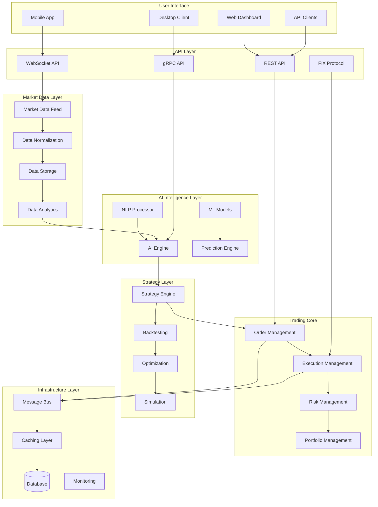

# Nautilus Trader Engine - Phase 6 System Enhancement Design

## Overview

This design document outlines the architecture and implementation approach for comprehensive enhancements to the Nautilus Trader Engine. The design focuses on creating a next-generation trading platform with AI-powered intelligence, ultra-low latency performance, and enterprise-grade capabilities.

## Architecture

### High-Level System Architecture



### Component Architecture

#### 1. AI Intelligence Layer

**ML Models Component**
- TensorFlow/PyTorch integration for deep learning models
- Model versioning and A/B testing framework
- Real-time inference engine with sub-millisecond latency
- Automated model retraining pipeline

**AI Engine Component**
- Pattern recognition for market anomalies
- Sentiment analysis from news and social media
- Predictive analytics for price movements
- Risk assessment and recommendation engine

**NLP Processor Component**
- News sentiment analysis
- Earnings call transcription and analysis
- Social media sentiment tracking
- Regulatory filing analysis

#### 2. Enhanced Trading Core

**Advanced Order Management System (OMS)**
```python
class AdvancedOMS:
    def __init__(self):
        self.order_router = SmartOrderRouter()
        self.execution_algos = ExecutionAlgorithms()
        self.compliance_engine = ComplianceEngine()
        self.risk_manager = RealTimeRiskManager()
    
    async def process_order(self, order: Order) -> OrderResponse:
        # Pre-trade compliance check
        compliance_result = await self.compliance_engine.validate(order)
        if not compliance_result.approved:
            return OrderResponse.rejected(compliance_result.reason)
        
        # Risk assessment
        risk_assessment = await self.risk_manager.assess_order(order)
        if risk_assessment.risk_level > self.max_risk_threshold:
            return OrderResponse.rejected("Risk threshold exceeded")
        
        # Smart routing
        routing_decision = await self.order_router.route(order)
        
        # Execute with appropriate algorithm
        execution_result = await self.execution_algos.execute(
            order, routing_decision
        )
        
        return execution_result
```

**Execution Management System (EMS)**
- TWAP, VWAP, Implementation Shortfall algorithms
- Adaptive execution based on market conditions
- Multi-venue routing and dark pool access
- Real-time execution quality measurement

**Risk Management System (RMS)**
- Real-time VaR calculation
- Stress testing and scenario analysis
- Dynamic position sizing
- Correlation-based hedging

#### 3. Market Microstructure Analysis

**Order Book Analytics**
```python
class OrderBookAnalyzer:
    def __init__(self):
        self.depth_analyzer = MarketDepthAnalyzer()
        self.flow_detector = OrderFlowDetector()
        self.liquidity_tracker = LiquidityTracker()
    
    def analyze_microstructure(self, order_book: OrderBook) -> MicrostructureMetrics:
        return MicrostructureMetrics(
            bid_ask_spread=self.calculate_spread(order_book),
            market_depth=self.depth_analyzer.analyze(order_book),
            order_flow=self.flow_detector.detect_institutional_flow(order_book),
            liquidity_score=self.liquidity_tracker.calculate_score(order_book),
            market_impact=self.estimate_market_impact(order_book)
        )
```

**Liquidity Detection**
- Hidden liquidity identification
- Market maker behavior analysis
- Iceberg order detection
- Dark pool activity estimation

#### 4. Multi-Asset Class Support

**Asset Class Framework**
```python
class AssetClassManager:
    def __init__(self):
        self.equity_handler = EquityHandler()
        self.options_handler = OptionsHandler()
        self.futures_handler = FuturesHandler()
        self.forex_handler = ForexHandler()
        self.crypto_handler = CryptoHandler()
    
    def get_handler(self, asset_type: AssetType) -> AssetHandler:
        handlers = {
            AssetType.EQUITY: self.equity_handler,
            AssetType.OPTION: self.options_handler,
            AssetType.FUTURE: self.futures_handler,
            AssetType.FOREX: self.forex_handler,
            AssetType.CRYPTO: self.crypto_handler
        }
        return handlers[asset_type]
```

**Cross-Asset Analytics**
- Correlation analysis across asset classes
- Arbitrage opportunity detection
- Currency hedging recommendations
- Margin requirement calculations

### Data Models

#### Enhanced Market Data Model
```python
@dataclass
class EnhancedMarketData:
    symbol: str
    timestamp: datetime
    bid_price: Decimal
    ask_price: Decimal
    bid_size: int
    ask_size: int
    last_price: Decimal
    volume: int
    order_book: OrderBook
    trades: List[Trade]
    market_microstructure: MicrostructureMetrics
    ai_signals: List[AISignal]
    sentiment_score: float
    volatility_forecast: VolatilityForecast
```

#### AI Signal Model
```python
@dataclass
class AISignal:
    signal_id: str
    model_name: str
    signal_type: SignalType
    confidence: float
    prediction: Prediction
    features: Dict[str, float]
    explanation: str
    timestamp: datetime
    expiry: datetime
```

#### Risk Metrics Model
```python
@dataclass
class RiskMetrics:
    portfolio_var: Decimal
    component_var: Dict[str, Decimal]
    stress_test_results: Dict[str, Decimal]
    correlation_matrix: np.ndarray
    beta_exposure: Dict[str, float]
    sector_exposure: Dict[str, float]
    currency_exposure: Dict[str, Decimal]
    liquidity_risk: float
```

### Error Handling

#### Comprehensive Error Management
```python
class TradingSystemError(Exception):
    def __init__(self, error_code: str, message: str, context: Dict):
        self.error_code = error_code
        self.message = message
        self.context = context
        self.timestamp = datetime.utcnow()
        super().__init__(message)

class ErrorHandler:
    def __init__(self):
        self.circuit_breaker = CircuitBreaker()
        self.retry_policy = RetryPolicy()
        self.alerting = AlertingSystem()
    
    async def handle_error(self, error: Exception, context: Dict):
        if isinstance(error, TradingSystemError):
            await self.handle_trading_error(error)
        elif isinstance(error, NetworkError):
            await self.handle_network_error(error, context)
        elif isinstance(error, DataError):
            await self.handle_data_error(error, context)
        else:
            await self.handle_unknown_error(error, context)
```

### Testing Strategy

#### Multi-Level Testing Approach

**Unit Testing**
- Component-level testing with 95%+ coverage
- Mock external dependencies
- Property-based testing for financial calculations

**Integration Testing**
- End-to-end workflow testing
- Database integration testing
- API contract testing

**Performance Testing**
- Latency benchmarking (target: <100μs)
- Throughput testing (target: 1M+ messages/sec)
- Memory usage profiling
- Stress testing under extreme loads

**Backtesting Framework**
```python
class AdvancedBacktester:
    def __init__(self):
        self.market_simulator = RealisticMarketSimulator()
        self.cost_model = TransactionCostModel()
        self.slippage_model = SlippageModel()
        self.risk_manager = BacktestRiskManager()
    
    async def run_backtest(self, strategy: Strategy, 
                          data: HistoricalData,
                          config: BacktestConfig) -> BacktestResults:
        
        results = BacktestResults()
        
        for timestamp, market_data in data:
            # Generate signals
            signals = await strategy.generate_signals(market_data)
            
            # Apply risk management
            filtered_signals = await self.risk_manager.filter_signals(
                signals, results.current_portfolio
            )
            
            # Simulate execution
            executions = await self.market_simulator.execute_signals(
                filtered_signals, market_data
            )
            
            # Apply costs and slippage
            realistic_executions = self.apply_market_impact(executions)
            
            # Update portfolio
            results.update_portfolio(realistic_executions)
            
        return results
```

### Performance Optimization

#### Ultra-Low Latency Design

**Memory Management**
- Zero-copy message passing
- Object pooling for frequently used objects
- Custom memory allocators
- Garbage collection optimization

**Network Optimization**
- Kernel bypass networking (DPDK)
- CPU affinity and NUMA awareness
- Lock-free data structures
- Batch processing where appropriate

**Caching Strategy**
```python
class HighPerformanceCache:
    def __init__(self):
        self.l1_cache = LRUCache(size=10000)  # In-memory
        self.l2_cache = RedisCache()          # Distributed
        self.l3_cache = DatabaseCache()       # Persistent
    
    async def get(self, key: str) -> Optional[Any]:
        # Try L1 cache first
        value = self.l1_cache.get(key)
        if value is not None:
            return value
        
        # Try L2 cache
        value = await self.l2_cache.get(key)
        if value is not None:
            self.l1_cache.set(key, value)
            return value
        
        # Try L3 cache
        value = await self.l3_cache.get(key)
        if value is not None:
            self.l1_cache.set(key, value)
            await self.l2_cache.set(key, value)
            return value
        
        return None
```

### Security Architecture

#### Zero-Trust Security Model
```python
class SecurityManager:
    def __init__(self):
        self.auth_service = AuthenticationService()
        self.authz_service = AuthorizationService()
        self.encryption_service = EncryptionService()
        self.audit_service = AuditService()
    
    async def secure_request(self, request: Request) -> SecureRequest:
        # Authenticate user
        user = await self.auth_service.authenticate(request.credentials)
        
        # Authorize action
        permissions = await self.authz_service.get_permissions(
            user, request.resource
        )
        
        if not permissions.allows(request.action):
            raise UnauthorizedError("Insufficient permissions")
        
        # Encrypt sensitive data
        encrypted_request = await self.encryption_service.encrypt(request)
        
        # Log for audit
        await self.audit_service.log_access(user, request)
        
        return encrypted_request
```

#### Fraud Detection
- Behavioral analytics for anomaly detection
- Real-time transaction monitoring
- Machine learning-based fraud scoring
- Automated response and alerting

### Monitoring and Observability

#### Comprehensive Monitoring Stack
```python
class MonitoringSystem:
    def __init__(self):
        self.metrics_collector = MetricsCollector()
        self.trace_collector = TraceCollector()
        self.log_aggregator = LogAggregator()
        self.alerting_engine = AlertingEngine()
    
    def setup_monitoring(self):
        # Business metrics
        self.metrics_collector.register_gauge("active_orders")
        self.metrics_collector.register_counter("trades_executed")
        self.metrics_collector.register_histogram("order_latency")
        
        # System metrics
        self.metrics_collector.register_gauge("cpu_usage")
        self.metrics_collector.register_gauge("memory_usage")
        self.metrics_collector.register_gauge("network_throughput")
        
        # Custom alerts
        self.alerting_engine.add_rule(
            "high_latency",
            condition="order_latency > 1ms",
            action="page_oncall_engineer"
        )
```

### Deployment Architecture

#### Cloud-Native Infrastructure
```yaml
# Kubernetes deployment example
apiVersion: apps/v1
kind: Deployment
metadata:
  name: trading-engine
spec:
  replicas: 3
  selector:
    matchLabels:
      app: trading-engine
  template:
    metadata:
      labels:
        app: trading-engine
    spec:
      containers:
      - name: trading-engine
        image: nautilus-trader:latest
        resources:
          requests:
            memory: "2Gi"
            cpu: "1000m"
          limits:
            memory: "4Gi"
            cpu: "2000m"
        env:
        - name: ENVIRONMENT
          value: "production"
        - name: LOG_LEVEL
          value: "INFO"
```

#### Infrastructure as Code
- Terraform for cloud resource management
- Ansible for configuration management
- GitOps for deployment automation
- Helm charts for Kubernetes applications

This design provides a comprehensive foundation for transforming the Nautilus Trader Engine into a world-class, enterprise-grade trading platform with cutting-edge AI capabilities, ultra-low latency performance, and institutional-quality features.