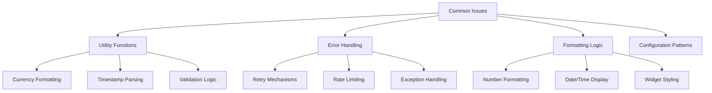
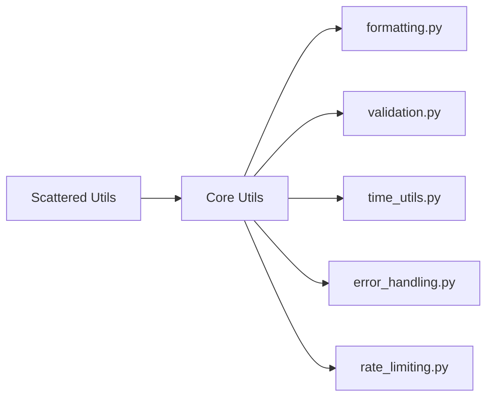
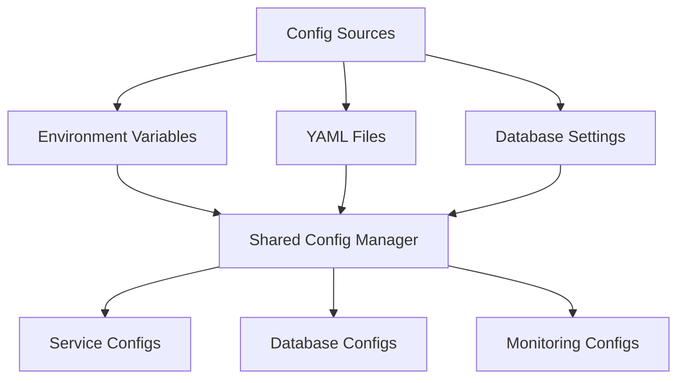
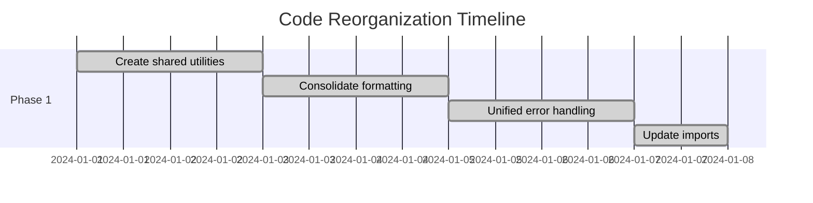
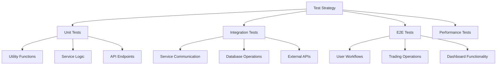
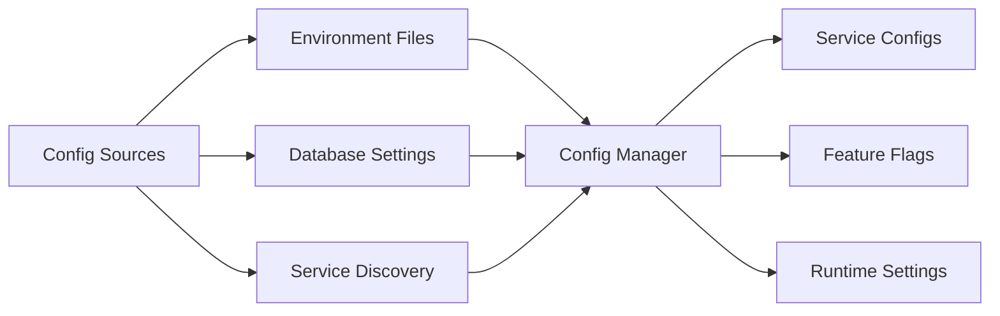

# Codebase Audit, Refactor, and Reorganisation Design

## Overview

This design document outlines a comprehensive strategy for auditing, refactoring, and reorganizing the Algorithmic Trading System codebase. The project is an enterprise-grade trading platform built on microservices architecture with Python backends, TypeScript frontends, and sophisticated AI/ML capabilities. The goal is to establish a clean, maintainable foundation while preserving all existing functionality, particularly the "vertical slice" prototype and Phase 0 workflows.

## Current State Analysis

### Repository Type
**Full-Stack Application** - The system combines:
- Backend microservices (Python/FastAPI)
- Frontend applications (Next.js/React)
- AI/ML services (LangChain/PyTorch)
- Infrastructure automation (Docker/Kubernetes)
- Trading engine integration (NautilusTrader)

### Technology Stack
- **Backend**: Python 3.11, FastAPI, NautilusTrader, LangChain
- **Frontend**: Next.js 15, TypeScript, React, Tailwind CSS
- **Databases**: PostgreSQL, ClickHouse, DuckDB, Redis
- **Infrastructure**: Docker, Kubernetes, Kafka, Prometheus/Grafana
- **AI/ML**: PyTorch, Transformers, FinRL, Optuna

### Architectural Principles
Based on the GEMINI.md analysis:
1. **Microservices Architecture**: Event-driven, loosely coupled services
2. **Event-Driven Design**: Kafka-based pub/sub communication
3. **CQRS Pattern**: Separate read/write databases
4. **Zero-Trust Security**: OAuth2/JWT with RBAC
5. **Observability First**: Comprehensive monitoring from the start

## Code Quality Issues Identified

### 1. Code Duplication Patterns



**Identified Duplications:**
- **Utility Functions**: Currency formatting, timestamp parsing, validation logic spread across multiple files
- **Error Handling**: Retry decorators and rate limiters implemented inconsistently
- **Formatting Logic**: Number/percentage formatting duplicated in mobile and web components
- **Configuration Management**: Dashboard and monitoring configs using similar patterns

### 2. Poor Readability Issues

**Complex Functions:**
- `react_native_app.py`: Monolithic generation functions with poor separation of concerns
- `dashboard_frontend.py`: Large JavaScript blocks embedded in Python strings
- Mobile components: Inconsistent naming conventions and structure

**Missing Documentation:**
- Many functions lack comprehensive docstrings
- Inline comments are sparse or unclear
- Type hints are inconsistent across modules

### 3. Misplaced Files

**Current Structure Issues:**
- Services scattered across multiple directories
- Utilities duplicated in different modules
- Mobile and web components not clearly separated
- Test files mixed with implementation code

## Refactoring Strategy

### 1. Utility Consolidation

**Create Centralized Utilities:**



**Implementation Plan:**
- **`/shared/utils/formatting.py`**: Currency, number, percentage formatting
- **`/shared/utils/validation.py`**: Symbol, price, quantity validation
- **`/shared/utils/time_utils.py`**: Timestamp parsing, market hours checks
- **`/shared/utils/error_handling.py`**: Unified retry mechanisms and error tracking
- **`/shared/utils/rate_limiting.py`**: Consistent rate limiting across services

### 2. Code Quality Improvements

**Function Decomposition:**
- Break down large functions into single-responsibility components
- Extract embedded JavaScript/HTML into separate template files
- Implement consistent error handling patterns

**Documentation Standards:**
- Add comprehensive docstrings following Google/NumPy style
- Include type hints for all function parameters and returns
- Add inline comments for complex business logic

**Naming Conventions:**
- Use descriptive, domain-specific names
- Follow Python PEP 8 conventions consistently
- Standardize naming across similar components

### 3. Configuration Management

**Centralized Configuration:**



## Directory Reorganization Plan

### Target Structure

```
/
├── shared/                           # Shared utilities and common code
│   ├── utils/                       # Consolidated utility functions
│   │   ├── formatting.py           # Currency, number, percentage formatting
│   │   ├── validation.py           # Input validation functions
│   │   ├── time_utils.py           # Timestamp and time operations
│   │   ├── error_handling.py       # Unified error handling and retries
│   │   ├── rate_limiting.py        # Rate limiting utilities
│   │   └── __init__.py
│   ├── models/                      # Shared data models and schemas
│   │   ├── trading.py              # Trading-related models
│   │   ├── market_data.py          # Market data models
│   │   └── __init__.py
│   ├── config/                      # Configuration management
│   │   ├── settings.py             # Central configuration manager
│   │   ├── database.py             # Database configuration
│   │   └── __init__.py
│   └── __init__.py
│
├── nautilus_trader_engine/
│   ├── strategies/                  # Trading strategy implementations
│   │   ├── base/                   # Base strategy classes
│   │   ├── momentum/               # Momentum-based strategies
│   │   ├── mean_reversion/         # Mean reversion strategies
│   │   └── arbitrage/              # Arbitrage strategies
│   ├── indicators/                  # Custom technical indicators
│   │   ├── volume_weighted/        # Volume-weighted indicators
│   │   ├── pattern_recognition/    # Pattern recognition indicators
│   │   └── risk_metrics/           # Risk-based indicators
│   ├── core/                        # Core engine integration
│   │   ├── engine.py               # Main engine wrapper
│   │   ├── execution.py            # Order execution logic
│   │   ├── risk_manager.py         # Risk management
│   │   └── data_handler.py         # Market data handling
│   ├── api/                         # Trading engine API
│   │   ├── routes/                 # API route definitions
│   │   ├── middleware/             # Authentication and validation
│   │   └── schemas/                # Request/response schemas
│   └── tests/                       # Engine-specific tests
│       ├── unit/                   # Unit tests
│       ├── integration/            # Integration tests
│       └── performance/            # Performance tests
│
├── ai_assistant/
│   ├── agents/                      # Specialized AI agents
│   │   ├── analyst_agent.py        # Market analysis agent
│   │   ├── researcher_agent.py     # Research and data gathering
│   │   ├── risk_agent.py           # Risk assessment agent
│   │   └── trading_agent.py        # Trading decision agent
│   ├── workflows/                   # LangGraph workflow definitions
│   │   ├── analysis_workflow.py    # Market analysis workflows
│   │   ├── strategy_workflow.py    # Strategy development workflows
│   │   └── risk_workflow.py        # Risk assessment workflows
│   ├── models/                      # ML models and configurations
│   │   ├── forecasting/            # Price prediction models
│   │   ├── sentiment/              # Sentiment analysis models
│   │   └── risk/                   # Risk assessment models
│   ├── tools/                       # Custom tools for agents
│   │   ├── data_tools.py           # Data retrieval and processing
│   │   ├── analysis_tools.py       # Technical analysis tools
│   │   └── execution_tools.py      # Trade execution tools
│   ├── rag/                         # RAG pipeline components
│   │   ├── document_processing/    # Document ingestion and processing
│   │   ├── vector_stores/          # Vector database management
│   │   └── retrieval/              # Information retrieval logic
│   └── tests/                       # AI assistant tests
│
├── frontend/
│   ├── algorithmic-trading-frontend/
│   │   ├── src/
│   │   │   ├── app/                # Next.js App Router pages
│   │   │   │   ├── dashboard/      # Dashboard pages
│   │   │   │   ├── trading/        # Trading interface pages
│   │   │   │   ├── analytics/      # Analytics and reporting
│   │   │   │   └── strategy/       # Strategy builder pages
│   │   │   ├── components/         # React components (Atomic Design)
│   │   │   │   ├── atoms/          # Basic UI elements
│   │   │   │   ├── molecules/      # Composite components
│   │   │   │   ├── organisms/      # Complex UI sections
│   │   │   │   └── templates/      # Page layouts
│   │   │   ├── store/              # Redux Toolkit state management
│   │   │   │   ├── slices/         # Feature-specific state slices
│   │   │   │   ├── middleware/     # Custom middleware
│   │   │   │   └── types/          # TypeScript type definitions
│   │   │   ├── hooks/              # Custom React hooks
│   │   │   │   ├── trading/        # Trading-specific hooks
│   │   │   │   ├── data/           # Data fetching hooks
│   │   │   │   └── ui/             # UI-related hooks
│   │   │   ├── services/           # API client services
│   │   │   │   ├── trading_api.ts  # Trading operations
│   │   │   │   ├── market_data.ts  # Market data services
│   │   │   │   └── websocket.ts    # Real-time data connections
│   │   │   └── utils/              # Frontend utility functions
│   │   │       ├── formatting.ts   # Data formatting utilities
│   │   │       ├── validation.ts   # Form validation
│   │   │       └── constants.ts    # Application constants
│   │   └── tests/                  # Frontend tests
│   └── mobile/                     # Mobile application (future)
│       ├── react_native/           # React Native app
│       └── electron/               # Desktop app wrapper
│
├── services/                        # Microservices directory
│   ├── market_data_service/        # Market data ingestion and processing
│   │   ├── src/                    # Service source code
│   │   ├── config/                 # Service configuration
│   │   ├── tests/                  # Service tests
│   │   ├── Dockerfile              # Container definition
│   │   └── requirements.txt        # Python dependencies
│   ├── order_management_service/   # Order lifecycle management
│   │   ├── src/                    # Service implementation
│   │   ├── schemas/                # Order data schemas
│   │   └── tests/                  # OMS tests
│   ├── risk_manager_service/       # Risk assessment and controls
│   │   ├── src/                    # Risk logic implementation
│   │   ├── models/                 # Risk calculation models
│   │   └── tests/                  # Risk manager tests
│   ├── portfolio_manager_service/  # Portfolio tracking and analytics
│   │   ├── src/                    # Portfolio management logic
│   │   ├── analytics/              # Performance analytics
│   │   └── tests/                  # Portfolio tests
│   └── dependency_management_service/ # Existing dependency service
│
├── infrastructure/
│   ├── terraform/                   # Infrastructure as Code
│   │   ├── environments/           # Environment-specific configs
│   │   ├── modules/                # Reusable Terraform modules
│   │   └── global/                 # Global infrastructure
│   ├── kubernetes/                  # Kubernetes manifests
│   │   ├── base/                   # Base Kubernetes resources
│   │   ├── overlays/               # Environment-specific overlays
│   │   └── helm/                   # Helm charts
│   ├── docker/                      # Docker configurations
│   │   ├── base/                   # Base Docker images
│   │   ├── services/               # Service-specific Dockerfiles
│   │   └── compose/                # Docker Compose files
│   └── ci_cd/                       # CI/CD pipeline definitions
│       ├── github/                 # GitHub Actions workflows
│       ├── jenkins/                # Jenkins pipeline files
│       └── scripts/                # Deployment scripts
│
└── docs/                           # Documentation
    ├── architecture/               # System architecture docs
    ├── api/                        # API documentation
    ├── deployment/                 # Deployment guides
    └── development/                # Development guidelines
```

## Implementation Strategy

### Phase 1: Utility Consolidation (Week 1)



**Tasks:**
1. Create `/shared/utils/` directory structure
2. Consolidate formatting functions from multiple files
3. Merge error handling and retry mechanisms
4. Update all import statements to use shared utilities
5. Remove duplicate utility files

### Phase 2: Service Reorganization (Week 2)

**Tasks:**
1. Create proper microservice directory structure
2. Move scattered service code into organized structure
3. Establish service-specific configuration patterns
4. Update Docker configurations and imports

### Phase 3: Code Quality Improvements (Week 2-3)

**Tasks:**
1. Add comprehensive docstrings to all functions
2. Implement consistent type hints
3. Break down complex functions into smaller components
4. Extract embedded templates into separate files
5. Standardize naming conventions

### Phase 4: Testing and Validation (Week 3)

**Tasks:**
1. Update all test imports and references
2. Run comprehensive test suite
3. Validate API endpoints functionality
4. Perform integration testing
5. Document any breaking changes

## Risk Mitigation

### Functionality Preservation

**Critical Components to Preserve:**
- **Vertical Slice Prototype**: Core trading workflow functionality
- **Phase 0 Workflows**: Dependency management and monitoring
- **API Endpoints**: All existing REST/GraphQL/WebSocket endpoints
- **Database Schemas**: Existing data structures and relationships

**Validation Strategy:**
1. **Pre-refactor Testing**: Run complete test suite to establish baseline
2. **Incremental Validation**: Test after each phase completion
3. **API Contract Testing**: Ensure all endpoints maintain compatibility
4. **Data Integrity Checks**: Validate database operations remain functional

### Rollback Strategy

**Version Control:**
- Create feature branch for reorganization work
- Tag current stable state before beginning
- Implement incremental commits for easy rollback points

**Testing Checkpoints:**
- Automated test runs after each major change
- Manual validation of critical user workflows
- Performance benchmarking to ensure no degradation

## Testing Strategy

### Automated Testing Approach



### Test Coverage Requirements

**Minimum Coverage Targets:**
- **Utility Functions**: 95% code coverage
- **Core Trading Logic**: 90% code coverage
- **API Endpoints**: 85% code coverage
- **Integration Points**: 80% code coverage

## Documentation Standards

### Code Documentation

**Docstring Format (Google Style):**
```python
def calculate_position_size(
    account_balance: float,
    risk_percentage: float,
    entry_price: float,
    stop_loss_price: float
) -> float:
    """Calculate optimal position size based on risk management principles.
    
    This function implements the standard risk-based position sizing formula
    used in algorithmic trading systems to determine the appropriate quantity
    of shares to purchase based on account balance and risk tolerance.
    
    Args:
        account_balance: Total available account balance in USD
        risk_percentage: Maximum percentage of account to risk (0-100)
        entry_price: Planned entry price per share
        stop_loss_price: Stop loss price per share
        
    Returns:
        Calculated position size in number of shares
        
    Raises:
        ValueError: If any price values are zero or negative
        
    Example:
        >>> calculate_position_size(10000, 2.0, 100.0, 95.0)
        400.0
    """
```

### API Documentation

**OpenAPI Integration:**
- Comprehensive endpoint documentation
- Request/response schema validation
- Authentication requirements
- Example requests and responses

## Configuration Management

### Centralized Configuration System



**Implementation:**
- **Environment-based configuration**: Different settings for dev/staging/prod
- **Feature flags**: Dynamic feature toggling without deployment
- **Secret management**: Secure handling of API keys and credentials
- **Configuration validation**: Type checking and schema validation

## Performance Considerations

### Optimization Targets

**Key Metrics:**
- **API Response Time**: < 200ms (95th percentile)
- **Order Execution**: < 500ms average
- **Data Processing**: < 100ms latency
- **Memory Usage**: No increase from current baseline
- **Code Complexity**: Reduce cyclomatic complexity by 20%

### Monitoring Integration

**Observability Enhancements:**
- **Code Quality Metrics**: Track complexity and maintainability scores
- **Performance Monitoring**: Monitor API response times and throughput
- **Error Tracking**: Centralized error logging and alerting
- **Dependency Health**: Monitor external service dependencies

## Security Enhancements

### Code Security Improvements

**Security Measures:**
- **Input Validation**: Comprehensive validation for all user inputs
- **Secret Management**: Proper handling of API keys and credentials
- **Access Control**: Role-based access to configuration and utilities
- **Audit Logging**: Track all configuration changes and access

### Compliance Considerations

**Regulatory Requirements:**
- **SOX Compliance**: Audit trail for all code changes
- **PCI DSS**: Secure handling of financial data
- **GDPR**: Data privacy and protection measures
- **Sarbanes-Oxley**: Change management and documentation

## Migration Timeline

### Week 1: Foundation and Utilities
- **Day 1-2**: Create shared utilities structure
- **Day 3-4**: Consolidate formatting and validation functions
- **Day 5-7**: Implement unified error handling and testing

### Week 2: Service Reorganization
- **Day 1-3**: Restructure microservices directories
- **Day 4-5**: Update configurations and Docker files
- **Day 6-7**: Validate service communication and APIs

### Week 3: Quality and Validation
- **Day 1-2**: Add comprehensive documentation
- **Day 3-4**: Improve code readability and naming
- **Day 5-7**: Final testing and validation

## Success Criteria

### Technical Metrics
- **Code Duplication**: Reduced by 60%
- **Cyclomatic Complexity**: Decreased by 20%
- **Test Coverage**: Maintained at 85%+
- **Documentation Coverage**: 95% of public APIs
- **Build Time**: No increase from current baseline

### Functional Validation
- **All existing tests pass**: 100% success rate
- **API compatibility**: No breaking changes
- **Performance**: No degradation in response times
- **User workflows**: All critical paths remain functional

### Quality Improvements
- **Maintainability Index**: Improved by 25%
- **Technical Debt**: Reduced as measured by SonarQube
- **Developer Experience**: Faster onboarding and development cycles
- **Code Consistency**: Standardized patterns across all modules