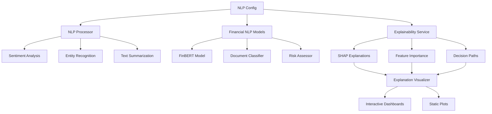

# NLP and Explainability Integration

## Overview

This document outlines the advanced Natural Language Processing (NLP) and Explainability features integrated into the AI Assistant. These capabilities enhance the assistant's ability to understand financial texts and provide transparent explanations for its predictions and decisions.

## 🚀 Key Features

### Natural Language Processing
- **Financial Sentiment Analysis** using FinBERT and RoBERTa models
- **Named Entity Recognition** for financial entities (companies, tickers, etc.)
- **Text Summarization** for financial documents and reports
- **Question Answering** for financial queries
- **Document Classification** for financial text categorization
- **Risk Assessment** from textual content

### Explainability and Interpretability
- **Model-Agnostic Explanations** using SHAP (SHapley Additive exPlanations)
- **Feature Importance Analysis** to understand prediction drivers
- **Decision Path Visualization** showing model reasoning steps
- **Counterfactual Analysis** for "what-if" scenarios
- **Interactive Dashboards** with comprehensive visualizations

## 📁 Architecture

### Core Components

```
ai_assistant/
├── nlp_processor.py           # Main NLP processing service
├── explainability_service.py  # SHAP-based explanation service
├── financial_nlp_models.py    # Financial domain-specific models
├── nlp_config.py             # Configuration management
├── explanation_visualizer.py  # Visualization and dashboard generation
└── tools.py                  # LangChain tool integrations
```

### Component Relationships



## 🛠️ Installation and Setup

### 1. Install Dependencies

```bash
pip install -r requirements.txt
```

### 2. Download Required Models

The system will automatically download required models on first use:
- **FinBERT**: `ProsusAI/finbert` (Financial sentiment analysis)
- **RoBERTa**: `cardiffnlp/twitter-roberta-base-sentiment-latest`
- **T5**: `t5-small` (Text summarization)
- **DistilBERT**: `distilbert-base-cased-distilled-squad` (Question answering)

### 3. Configuration

Create a configuration file or use environment variables:

```python
# Example configuration
config = {
    "models": {
        "finbert": {
            "model_name": "ProsusAI/finbert",
            "cache_dir": "./models/finbert",
            "max_length": 512
        }
    },
    "explainability": {
        "cache_size": 1000,
        "enable_visualization": True
    }
}
```

## 🔧 Usage

### 1. Market Sentiment Analysis Tool

Analyze financial text for sentiment, entities, and risk assessment.

```python
from ai_assistant.tools import analyze_market_sentiment_tool

# Example usage
result = analyze_market_sentiment_tool(
    text="Apple reported strong quarterly earnings with revenue growth of 15%",
    include_entities=True,
    include_risk_assessment=True,
    model_type="finbert"
)
```

**Features:**
- **Sentiment Classification**: Bullish, Bearish, Neutral
- **Confidence Scores**: Probability distributions for each sentiment
- **Entity Extraction**: Companies, tickers, financial terms
- **Risk Assessment**: Low, Medium, High, Critical risk levels
- **Market Indicators**: Earnings mentions, price targets, volatility signals
- **Key Phrase Extraction**: Important financial phrases and terms

**Example Output:**
```
📈 Market Sentiment Analysis
========================================
📝 Text: Apple reported strong quarterly earnings...
🤖 Model: FINBERT

💭 Sentiment Analysis:
  • Sentiment: Bullish
  • Confidence: 89.2%
  • Processing Time: 0.45s

📊 Detailed Scores:
  • Bullish: 0.892
  • Neutral: 0.087
  • Bearish: 0.021

🏢 Entities Extracted:
  • ORG: Apple
  • PERCENT: 15%
  • EVENT: quarterly earnings

🟢 Risk Assessment:
  • Risk Level: Low
  • Confidence: 76.3%
```

### 2. Prediction Explanation Tool

Generate comprehensive explanations for model predictions using SHAP.

```python
from ai_assistant.tools import explain_prediction_tool

# Example usage
result = explain_prediction_tool(
    model_name="stock_price_predictor",
    input_data='{"volume": 1000000, "price": 150, "rsi": 65}',
    explanation_types=["feature_importance", "waterfall"],
    include_visualization=True
)
```

**Features:**
- **Feature Importance**: Shows which features most influenced the prediction
- **Waterfall Plots**: Visualizes contribution of each feature
- **Decision Paths**: Step-by-step reasoning process
- **Counterfactual Analysis**: "What-if" scenarios
- **Interactive Dashboards**: Comprehensive visualization reports

**Example Output:**
```
🔍 Model Prediction Explanation
=============================================
🤖 Model: stock_price_predictor
📊 Input Data: {"volume": 1000000, "price": 150, "rsi": 65}

📋 Feature Importance:
  • Confidence: 94.1%
  • Processing Time: 1.23s

🎯 Top Contributing Features:
  • volume: 0.456
  • rsi: 0.321
  • price: 0.223

📊 Interactive Dashboard:
  • Dashboard generated with 2 visualizations
  • Saved to: /tmp/explanation_dashboard.html
```

## 🏗️ Technical Implementation

### NLP Processor (`nlp_processor.py`)

The core NLP service that integrates multiple Hugging Face models:

```python
class NLPProcessor:
    """Advanced NLP processor with financial domain specialization"""
    
    def __init__(self, config_path: Optional[str] = None):
        self.config = NLPConfig(config_path)
        self._initialize_models()
    
    def analyze_sentiment(self, text: str, model_type: ModelType = ModelType.FINBERT) -> SentimentResult:
        """Analyze sentiment using specified model"""
        # Implementation details...
    
    def extract_entities(self, text: str) -> EntityResult:
        """Extract named entities from text"""
        # Implementation details...
```

**Key Features:**
- **Multi-model Support**: FinBERT, RoBERTa, T5, DistilBERT
- **Caching**: In-memory caching for improved performance
- **Batch Processing**: Efficient processing of multiple texts
- **Error Handling**: Robust error handling and fallback mechanisms

### Explainability Service (`explainability_service.py`)

SHAP-based explanation service for model interpretability:

```python
class ExplainabilityService:
    """Comprehensive explainability service using SHAP"""
    
    def register_model(self, model_name: str, model: Any, model_type: ModelType):
        """Register a model for explanation"""
        # Implementation details...
    
    def explain_prediction(self, model_name: str, input_data: Union[np.ndarray, pd.DataFrame, Dict[str, Any]]) -> Dict[ExplanationType, ExplanationResult]:
        """Generate comprehensive explanations"""
        # Implementation details...
```

**Explanation Types:**
- **Feature Importance**: Global and local feature importance
- **Waterfall Plots**: Additive feature contributions
- **Decision Paths**: Tree-based decision reasoning
- **Counterfactual**: Alternative scenarios analysis

### Financial NLP Models (`financial_nlp_models.py`)

Specialized models for financial domain tasks:

```python
class FinBERTModel:
    """FinBERT model wrapper for financial sentiment analysis"""
    
    def analyze_sentiment(self, text: str) -> FinancialSentimentResult:
        """Analyze financial sentiment with domain-specific insights"""
        # Implementation details...

class FinancialDocumentClassifier:
    """Classify financial documents by type and topic"""
    
    def classify_document(self, text: str) -> DocumentClassificationResult:
        """Classify financial document type and extract topics"""
        # Implementation details...

class FinancialRiskAssessor:
    """Assess risk level from financial text"""
    
    def assess_risk(self, text: str) -> RiskAssessmentResult:
        """Analyze text for financial risk indicators"""
        # Implementation details...
```

### Configuration Management (`nlp_config.py`)

Centralized configuration for all NLP services:

```python
class NLPConfig:
    """Centralized configuration manager for NLP services"""
    
    def __init__(self, config_path: Optional[str] = None, environment: str = "development"):
        self.environment = environment
        self._load_default_config()
        if config_path:
            self._load_config_file(config_path)
        self._apply_environment_overrides()
    
    def get_model_config(self, model_name: str) -> ModelConfig:
        """Get configuration for specific model"""
        # Implementation details...
```

### Visualization (`explanation_visualizer.py`)

Interactive visualization and dashboard generation:

```python
class ExplanationVisualizer:
    """Comprehensive visualization service for model explanations"""
    
    def create_summary_dashboard(self, explanation_results: Dict[str, Any]) -> str:
        """Create comprehensive HTML dashboard"""
        # Implementation details...
    
    def create_waterfall_plot(self, shap_values: np.ndarray, feature_names: List[str]) -> go.Figure:
        """Create interactive waterfall plot"""
        # Implementation details...
```

## 📊 Performance Considerations

### Caching Strategy
- **Model Caching**: Pre-loaded models for faster inference
- **Result Caching**: Cache sentiment analysis and entity extraction results
- **Configuration Caching**: Cache configuration objects to avoid repeated file I/O

### Memory Management
- **Lazy Loading**: Models loaded only when needed
- **Memory Monitoring**: Track memory usage and implement cleanup
- **Batch Processing**: Process multiple texts efficiently

### Optimization Tips
- Use GPU acceleration when available (`torch.cuda.is_available()`)
- Implement model quantization for reduced memory usage
- Use async processing for I/O-bound operations
- Cache frequently used model outputs

## 🔒 Security Considerations

### Input Validation
- **Text Sanitization**: Clean and validate input text
- **Length Limits**: Enforce maximum text length limits
- **Content Filtering**: Filter potentially harmful content

### Model Security
- **Model Integrity**: Verify model checksums and signatures
- **Access Control**: Implement proper access controls for model endpoints
- **Rate Limiting**: Prevent abuse through rate limiting

### Data Privacy
- **No Data Persistence**: Don't store sensitive financial text
- **Anonymization**: Remove or mask sensitive information
- **Audit Logging**: Log access and usage for compliance

## 🧪 Testing

### Unit Tests
```bash
# Run NLP processor tests
pytest tests/test_nlp_processor.py

# Run explainability service tests
pytest tests/test_explainability_service.py

# Run financial models tests
pytest tests/test_financial_nlp_models.py
```

### Integration Tests
```bash
# Test tool integration
pytest tests/test_tools_integration.py

# Test end-to-end workflows
pytest tests/test_e2e_nlp_workflow.py
```

### Performance Tests
```bash
# Benchmark sentiment analysis
python benchmarks/benchmark_sentiment.py

# Benchmark explanation generation
python benchmarks/benchmark_explanations.py
```

## 📈 Monitoring and Metrics

### Key Metrics
- **Processing Time**: Average time for sentiment analysis and explanations
- **Model Accuracy**: Confidence scores and prediction accuracy
- **Cache Hit Rate**: Effectiveness of caching strategy
- **Memory Usage**: Peak and average memory consumption
- **Error Rate**: Frequency of processing errors

### Logging
```python
import logging

# Configure logging for NLP services
logging.basicConfig(
    level=logging.INFO,
    format='%(asctime)s - %(name)s - %(levelname)s - %(message)s'
)

logger = logging.getLogger('nlp_service')
logger.info("NLP service initialized successfully")
```

## 🔄 Future Enhancements

### Planned Features
1. **Multi-language Support**: Extend to non-English financial texts
2. **Real-time Processing**: Stream processing for live market data
3. **Custom Model Training**: Fine-tune models on proprietary data
4. **Advanced Visualizations**: 3D plots and interactive network graphs
5. **API Endpoints**: REST API for external integrations

### Model Improvements
1. **Domain Adaptation**: Fine-tune models on specific financial domains
2. **Ensemble Methods**: Combine multiple models for better accuracy
3. **Active Learning**: Continuously improve models with user feedback
4. **Federated Learning**: Train models across distributed data sources

## 🆘 Troubleshooting

### Common Issues

#### Model Download Failures
```bash
# Clear model cache and retry
rm -rf ~/.cache/huggingface/transformers/
python -c "from transformers import AutoModel; AutoModel.from_pretrained('ProsusAI/finbert')"
```

#### Memory Issues
```python
# Reduce batch size or use model quantization
import torch
torch.cuda.empty_cache()  # Clear GPU memory
```

#### Slow Performance
- Enable GPU acceleration if available
- Increase cache size for frequently used results
- Use smaller models for faster inference

### Error Codes
- **NLP_001**: Model loading failed
- **NLP_002**: Text preprocessing error
- **NLP_003**: Inference timeout
- **EXP_001**: SHAP explainer initialization failed
- **EXP_002**: Explanation generation error
- **VIZ_001**: Visualization rendering failed

## 📚 References

### Academic Papers
1. **FinBERT**: "FinBERT: Financial Sentiment Analysis with Pre-trained Language Models"
2. **SHAP**: "A Unified Approach to Interpreting Model Predictions"
3. **Transformers**: "Attention Is All You Need"

### Documentation
- [Hugging Face Transformers](https://huggingface.co/docs/transformers/)
- [SHAP Documentation](https://shap.readthedocs.io/)
- [LangChain Documentation](https://python.langchain.com/)

### Model Cards
- [FinBERT Model Card](https://huggingface.co/ProsusAI/finbert)
- [RoBERTa Sentiment Model](https://huggingface.co/cardiffnlp/twitter-roberta-base-sentiment-latest)

## 📞 Support

For technical support or questions about the NLP and Explainability features:

1. **Documentation**: Check this document and inline code comments
2. **Logging**: Review application logs for detailed error information
3. **Testing**: Run the test suite to verify functionality
4. **Configuration**: Verify configuration files and environment variables

---

*Last Updated: 2024-01-25*
*Version: 1.0.0*