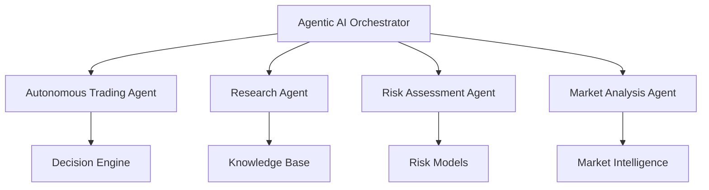

# Agentic AI Service

## Overview

The Agentic AI Service provides autonomous AI agent capabilities for the Algorithmic Trading System. It implements multi-agent workflows, advanced reasoning, and autonomous decision-making capabilities that can operate independently while integrating with the broader trading ecosystem.

## Architecture

### Multi-Agent Framework
- **Autonomous Agents**: Self-directed AI agents with specific roles
- **Agent Coordination**: Inter-agent communication and collaboration
- **Workflow Orchestration**: Complex multi-step autonomous workflows
- **Reasoning Engine**: Advanced decision-making and planning capabilities

### Key Components


## Agent Types

### 1. Autonomous Trading Agent
- **Purpose**: Independent trading decision-making
- **Capabilities**: 
  - Portfolio management
  - Order execution decisions
  - Risk-adjusted position sizing
  - Multi-timeframe analysis

### 2. Research Agent
- **Purpose**: Autonomous market research and analysis
- **Capabilities**:
  - News and sentiment analysis
  - Economic indicator monitoring
  - Earnings and event tracking
  - Competitive intelligence gathering

### 3. Risk Assessment Agent
- **Purpose**: Continuous risk monitoring and management
- **Capabilities**:
  - Real-time risk calculation
  - Scenario analysis
  - Stress testing
  - Correlation monitoring

### 4. Market Analysis Agent
- **Purpose**: Comprehensive market condition assessment
- **Capabilities**:
  - Technical pattern recognition
  - Market regime detection
  - Volatility analysis
  - Liquidity assessment

## Integration Points

### Event-Driven Communication
- **Kafka Topics**: `agentic.agents.commands`, `agentic.agents.responses`
- **Inter-Agent Messaging**: Asynchronous agent-to-agent communication
- **System Integration**: Connection to trading engine, risk manager, portfolio manager

### AI/ML Integration
- **LangChain/LangGraph**: Workflow orchestration and reasoning
- **Model Integration**: Connection to forecasting and ML models
- **Knowledge Retrieval**: RAG-based information access
- **Decision Support**: Advanced reasoning and planning

## Autonomous Capabilities

### Decision-Making Framework
- **Goal-Oriented Planning**: Autonomous goal setting and achievement
- **Multi-Criteria Decision Analysis**: Complex decision optimization
- **Adaptive Learning**: Continuous improvement from outcomes
- **Risk-Aware Autonomy**: Built-in risk constraints and limits

### Workflow Examples
1. **Autonomous Trade Execution**:
   - Market analysis → Opportunity identification → Risk assessment → Trade execution
2. **Research-Driven Strategy**:
   - News monitoring → Sentiment analysis → Strategy adjustment → Performance tracking
3. **Risk Management**:
   - Continuous monitoring → Threat detection → Mitigation planning → Action execution

## Configuration

### Agent Parameters
```yaml
autonomous_trading_agent:
  risk_tolerance: moderate
  max_position_size: 0.1
  decision_frequency: 1m
  learning_rate: 0.01

research_agent:
  news_sources: [bloomberg, reuters, financial_times]
  analysis_depth: comprehensive
  update_frequency: 5m
  sentiment_threshold: 0.7
```

### Safety Mechanisms
- **Kill Switches**: Emergency stop capabilities
- **Boundary Enforcement**: Hard limits on agent actions
- **Human Override**: Manual intervention capabilities
- **Audit Trails**: Complete action logging and traceability

## API Endpoints

### Agent Management
- `GET /api/v1/agents` - List all agents and status
- `POST /api/v1/agents/{id}/start` - Start specific agent
- `POST /api/v1/agents/{id}/stop` - Stop specific agent
- `GET /api/v1/agents/{id}/status` - Get agent status and metrics

### Agent Communication
- `POST /api/v1/agents/{id}/message` - Send message to agent
- `GET /api/v1/agents/{id}/decisions` - Get recent decisions
- `GET /api/v1/agents/{id}/performance` - Get performance metrics

## Development Phases

### Phase 0: Infrastructure Setup ✅
- Directory structure and documentation
- Basic agent framework design
- Integration point definitions

### Phase 1: Core Agent Implementation 📋
- Basic autonomous trading agent
- Simple decision-making framework
- Event-driven communication

### Phase 2: Advanced Reasoning 🔬
- Multi-agent coordination
- Complex workflow orchestration
- Advanced decision algorithms

### Phase 3: Full Autonomy 🚀
- Self-improving agents
- Advanced learning capabilities
- Complex strategy development

## Security and Compliance

### Access Control
- Agent-specific permissions and roles
- Action authorization and validation
- Resource access limitations

### Monitoring and Auditing
- Complete decision audit trails
- Performance monitoring and alerting
- Compliance verification and reporting

### Risk Management
- Built-in risk constraints
- Emergency stop mechanisms
- Human oversight capabilities

## Dependencies

- **AI Frameworks**: LangChain, LangGraph, Transformers
- **ML Libraries**: PyTorch, scikit-learn, TensorFlow
- **Event Streaming**: Apache Kafka
- **Database**: PostgreSQL (decisions), ClickHouse (analytics)
- **Knowledge Base**: Vector databases (Qdrant, pgvector)

## Future Enhancements

- **Advanced Planning**: Multi-step planning and execution
- **Social Learning**: Agent-to-agent knowledge transfer
- **Emergent Behaviors**: Complex system-level behaviors
- **Human-AI Collaboration**: Enhanced human-agent interaction