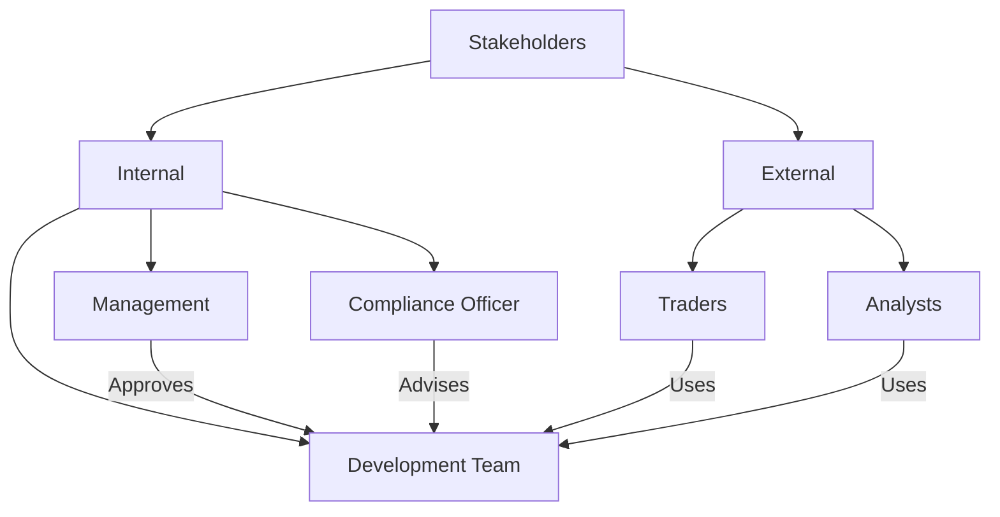
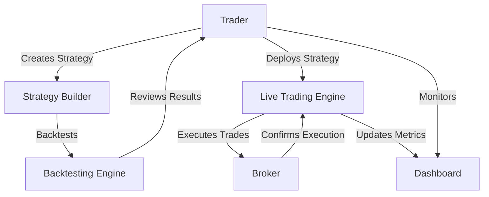
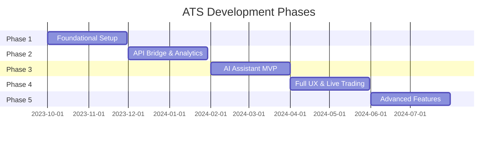
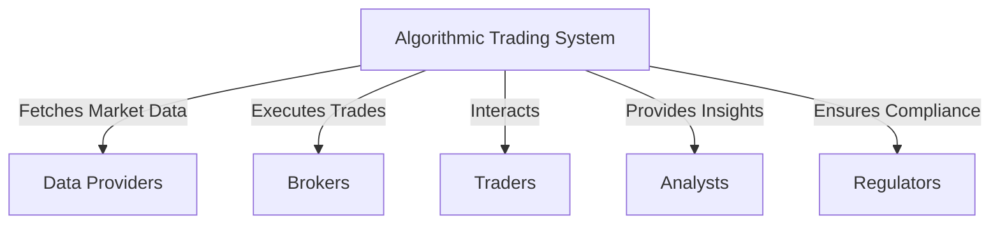

# Business Requirements Document (BRD)

## Algorithmic Trading System (ATS)

---

### 1. Introduction

#### 1.1 Purpose of the Document

This Business Requirements Document (BRD) outlines the business needs, objectives, and expectations for the development of the Algorithmic Trading System (ATS).  The document serves as a comprehensive guide for stakeholders—including business owners, project sponsors, developers, and end-users—to understand the business needs, objectives, and scope of the project, ensuring alignment on the project’s vision, scope, and deliverables. It ensures that the system aligns with organizational goals and provides a clear roadmap for successful implementation, bridging the gap between business expectations and technical execution. The ATS is designed to be an enterprise-grade platform that automates trading strategies across multiple asset classes, leveraging a "Best-of-Breed" integration strategy with leading open-source technologies and advanced AI-driven capabilities.

#### 1.2 Project Overview

The ATS aims to create a modular, scalable, and user-friendly trading platform catering to both non-technical traders and professional analysts. It incorporates a microservices architecture with Apache Kafka as the central event bus, NautilusTrader as the core trading engine, and an Agentic AI Assistant as the system’s "brain" for natural language interaction, strategy development, and decision-making. The platform supports trading across stocks, ETFs, futures, options, forex, and cryptocurrencies, with features including no-code strategy building, backtesting, live trading, real-time analytics, and enterprise-grade security.

#### 1.3 Scope of the Project

The scope of the ATS includes:  

- Development of a comprehensive trading platform with no-code and code-based strategy development tools.  
- Integration of real-time data feeds, backtesting engines, and live trading capabilities.  
- Deployment of an AI Assistant for natural language queries, code generation, and predictive analytics.  
- Support for multiple asset classes and compliance with financial regulations (e.g., SEC, GDPR).  
- Implementation of a 5-phase development roadmap to ensure incremental delivery and enterprise readiness.  

Out of Scope:  

- Proprietary hardware development.  
- Direct management of third-party broker platforms beyond API integrations.  

#### 1.4 Definitions, Acronyms, and Abbreviations

| Term | Definition                         |
| ---- | ---------------------------------- |
| ATS  | Algorithmic Trading System         |
| BRD  | Business Requirements Document     |
| AI   | Artificial Intelligence            |
| ML   | Machine Learning                   |
| API  | Application Programming Interface  |
| UI   | User Interface                     |
| RBAC | Role-Based Access Control          |
| SEC  | Securities and Exchange Commission |
| GDPR | General Data Protection Regulation |
| FIX  | Financial Information eXchange     |
| RAG  | Retrieval-Augmented Generation     |
| MVP  | Minimum Viable Product             |

#### 1.5. Project Background

##### 1.5.1 Business Drivers
The development of the Algorithmic Trading System is motivated by several key business drivers:
- **Market Demand**: Growing interest in algorithmic trading among retail and professional traders necessitates a platform that balances accessibility and advanced functionality.
- **Technological Advancements**: Advances in artificial intelligence, real-time data processing, and open-source frameworks provide an opportunity to create a competitive, cutting-edge trading solution.
- **User Empowerment**: Enabling a diverse user base—ranging from novices to experts—to participate in algorithmic trading through tailored tools and interfaces.
- **Competitive Edge**: Offering a unique combination of AI-driven insights, high performance, and enterprise-grade features to differentiate from existing solutions.

##### 1.5.2 Current State
The current landscape of trading platforms presents several challenges:
- Many platforms are either overly simplistic, lacking the depth required by professional traders, or excessively complex, alienating non-technical users.
- Integration of AI-driven tools for strategy development and decision-making is limited or absent in most solutions.
- Real-time data processing capabilities are often inadequate for high-frequency trading, resulting in missed opportunities.
- Security and compliance features in existing systems frequently fail to meet enterprise standards, limiting adoption by institutional users.

### 1.5.3 Future State
The Algorithmic Trading System aims to address these gaps by delivering:
- A unified platform that supports both no-code and advanced technical workflows, catering to a broad user base.
- An AI-driven assistant that provides natural language interaction, strategy generation, and actionable insights.
- High-performance, low-latency execution and data processing to support real-time trading.
- A secure, compliant, and scalable system suitable for enterprise adoption, with features like Zero-Trust architecture and audit trails.

---

### 2. Business Objectives

#### 2.1 High-Level Goals

- **Enhance Trading Efficiency**: Automate trading processes to minimize manual intervention.  
- **Reduce Operational Costs**: Leverage open-source technologies and AI to optimize resource use.  
- **Increase Profitability**: Provide AI-driven insights and advanced analytics for better decision-making.  
- **Improve Risk Management**: Implement real-time monitoring and pre-trade risk controls.  
- **Democratize Access**: Enable non-technical users to participate in algorithmic trading.  
- **Ensure Compliance**: Meet regulatory and data security standards across jurisdictions.  

#### 2.2 Specific Outcomes

- A fully functional platform with no-code (Blockly) and code-based (Python) strategy development tools.  
- Real-time data processing and trade execution with latency under 100ms.  
- An AI Assistant capable of natural language interaction, code generation, and predictive analytics.  
- Advanced portfolio optimization and risk management tools.  
- A secure, scalable system compliant with financial regulations (e.g., GDPR, CCPA).  

---

### 3. Stakeholders

#### 3.1 Key Stakeholders

| Stakeholder        | Role                                     | Interest                              |
| ------------------ | ---------------------------------------- | ------------------------------------- |
| Management         | Project oversight and funding            | Aligns with business strategy and ROI |
| Development Team   | System design and implementation         | Technical feasibility and delivery    |
| Compliance Officer | Regulatory adherence                     | Ensures legal and ethical compliance  |
| Traders            | Primary end-users                        | Ease of use and trading performance   |
| Analysts           | Market insights and strategy development | Advanced analytics and data access    |

The following stakeholders are involved in the project:

- **Project Sponsor**: [Name/Title] – Provides funding and strategic oversight, ensuring alignment with organizational priorities.
- **Business Owner**: [Name/Title] – Defines business goals and ensures the system meets market and user needs.
- **Development Team**:
  - **Lead Developer**: Oversees technical implementation and integration.
  - **AI Specialist**: Designs and implements the AI assistant and predictive models.
  - **UI/UX Designer**: Creates intuitive interfaces for diverse user personas.
  - **DevOps Engineer**: Manages deployment, scaling, and infrastructure.
- **End Users**:
  - **Non-technical Traders**: Leverage no-code tools and AI assistance for strategy development.
  - **Professional Traders/Analysts**: Utilize advanced features for high-frequency trading and custom workflows.
- **Compliance Officer**: [Name/Title] – Ensures regulatory adherence and auditability.
- **Security Team**: [Name/Title] – Implements and monitors security protocols.

#### 3.2 Stakeholder Relationship Diagram

---

### 4. Functional Requirements

#### 4.1 Core Functionalities

- **Strategy Development**:  
  - No-code builder with drag-and-drop interface (Blockly).  
  - Python-based environment for advanced users (Python Studio).  
- **Backtesting**:  
  - Historical data simulation with performance metrics (Sharpe Ratio, Max Drawdown).  
  - GPU-accelerated backtesting with VectorBT.  
- **Live Trading**:  
  - Real-time data integration and order execution via NautilusTrader.  
  - Support for multiple brokers (e.g., Interactive Brokers) and order types (Market, Limit, VWAP, TWAP).  
- **AI Assistant**:  
  - Natural language query processing via Lobe Chat and LangChain.  
  - Automated code generation and debugging with OpenHands.  
- **Analytics**:  
  - ML-based forecasting (LSTM, Stock Prediction Models).  
  - Portfolio optimization (PyPortfolioOpt, Riskfolio-Lib).  
  - Options analytics (QuantLib).  
- **User Interface**:  
  - Next.js frontend with real-time dashboards (react-financial-charts, Plotly Dash).  
  - Real-time risk metrics and trade blotter (ag-Grid).  
- **APIs**:  
  - RESTful endpoints via FastAPI for external integrations.  
  - gRPC for low-latency internal communications.  

#### 4.2 Use Case Example: Non-Technical Trader Creates a Strategy

- **Actor**: Sarah, a retail investor.  
- **Preconditions**: Sarah is logged into the ATS with a verified account.  
- **Steps**:  
  1. Sarah accesses the no-code strategy builder.  
  2. She uses drag-and-drop blocks to create a moving average crossover strategy.  
  3. She configures parameters (e.g., 50-day SMA, 200-day SMA) and selects an asset (AAPL).  
  4. She runs a backtest and reviews performance metrics.  
  5. She deploys the strategy for live trading.  
- **Postconditions**: The strategy executes trades automatically, with results visible on the dashboard.  

#### 4.3 Use Case 2: Professional Trader Executes a Trade

* **Actor**: Michael, a quant analyst.
* **Scenario**: Michael uses the API to execute a high-frequency trade and reviews post-trade analytics.
* **Outcome**: Trade completes with minimal latency, and analytics inform future strategies.

#### 4.4 Use Case 3: User Queries AI Assistant

* **Actor**: Trader.
* **Scenario**: Trader asks the AI assistant for stock trend insights.
* **Outcome**: AI provides a data-driven summary based on real-time and historical data.

#### 4.5 Trading Process Flow Diagram

---

### 5. Non-Functional Requirements

#### 5.1 Performance

- Process high-frequency data with latency under 100ms.  
- Support 1,000 concurrent users without performance degradation.  

#### 5.2 Security

- Implement Zero-Trust architecture with RBAC.  
- Encrypt data with AES-256; comply with GDPR, CCPA, and SEC regulations.  
- Use Static Application Security Testing (SAST) with Bandit for code security.  

#### 5.3 Scalability

- Utilize microservices and horizontal scaling to handle increased load.  
- Leverage Apache Kafka for event-driven scalability.  

#### 5.4 Usability

- Ensure intuitive design for novice and expert users via Next.js UI.  
- Provide accessibility features (e.g., screen reader support).  

#### 5.5 Reliability

- Achieve 99.9% uptime with fallback data feeds (Yahoo Finance, Alpha Vantage, etc.).  
- Implement observability with Prometheus, Grafana, and Memray for proactive monitoring.  

---

### 6. Project Phases and Milestones

The ATS will be developed in five phases, each building on the previous to deliver incremental value.  

#### 6.1 Phase 1: Foundational Setup

- **Objective**: Establish core infrastructure with Kafka as the backbone.  
- **Deliverables**:  
  - NautilusTrader engine with Kafka integration.  
  - Databases: PostgreSQL/pgvector, ClickHouse, DuckDB.  
  - Initial backtesting with Backtrader and TradingGym.  
  - Observability with Prometheus and Grafana.  
- **Duration**: 60 days (2023-10-01 to 2023-11-30).  

#### 6.2 Phase 2: API Bridge & Initial Analytics

- **Objective**: Build the API layer and enable programmatic backtesting.  
- **Deliverables**:  
  - FastAPI bridge with endpoints (e.g., /backtest, /optimise).  
  - VectorBT for GPU-accelerated backtesting.  
  - Optuna for hyperparameter tuning.  
  - gRPC for low-latency data streaming.  
- **Duration**: 60 days (2023-12-01 to 2024-01-30).  

#### 6.3 Phase 3: AI Assistant MVP

- **Objective**: Connect the AI Assistant to the trading engine.  
- **Deliverables**:  
  - AI Assistant service with LangChain, Lobe Chat, and RAGFlow.  
  - Tools: run_backtest_tool, query_documents_tool.  
  - Forecasting with LSTM and Stock Prediction Models.  
- **Duration**: 60 days (2024-02-01 to 2024-03-31).  

#### 6.4 Phase 4: Full User Experience & Live Trading

- **Objective**: Develop the frontend and enable live trading.  
- **Deliverables**:  
  - Next.js frontend with dashboards and risk metrics.  
  - Live trading with Interactive Brokers via FIX Gateway.  
  - Expanded API for portfolio and order management.  
- **Duration**: 60 days (2024-04-01 to 2024-05-31).  

#### 6.5 Phase 5: Advanced Features & Enterprise Readiness

- **Objective**: Add advanced analytics and security for enterprise use.  
- **Deliverables**:  
  - QuantLib for options analytics.  
  - No-code strategy builder with Blockly.  
  - Zero-Trust security, RBAC, and Apache Iceberg audit trails.  
  - Full observability stack (Prometheus, Grafana, Memray).  
- **Duration**: 60 days (2024-06-01 to 2024-07-31).  

#### 6.6 Gantt Chart for Project Phases

---

### 7. Risks and Mitigation Strategies

| Risk                          | Description                              | Mitigation Strategy                            |
| ----------------------------- | ---------------------------------------- | ---------------------------------------------- |
| **Integration Complexity**    | Challenges integrating open-source tools | Allocate buffer time, conduct thorough testing |
| **Performance Bottlenecks**   | High-frequency trading latency issues    | Optimize pipelines, use low-latency tech       |
| **Security Vulnerabilities**  | Exposure of sensitive financial data     | Implement Zero-Trust, regular audits           |
| **Regulatory Non-Compliance** | Failure to meet legal standards          | Involve compliance team, ensure audit trails   |

---

### 8. Context Diagram

---

### 9. Technical Approach (High-Level)
The ATS will leverage a microservices architecture with event-driven data streaming (Apache Kafka). The core trading engine (NautilusTrader) will ensure high performance, while the frontend (Next.js) will provide a responsive user experience. APIs (FastAPI, gRPC) will facilitate communication, and security will be enforced via a Zero-Trust model.

---

### 10. Approval and Sign-off

#### 10.1 Approval Process

The BRD requires formal approval from the following stakeholders:  

- **Project Sponsor**: [Name]  
- **Business Owner**: [Name]  
- **Lead Developer**: [Name]  
- **Compliance Officer**: [Name]  

#### 10.2 Sign-off

Approval signifies agreement on the scope, objectives, and requirements outlined in this document. Signed copies will be maintained for reference throughout the project lifecycle.

---

### 11. Appendices

#### 11.1 Core Technology Stack

- **Trading Engine**: NautilusTrader  
- **Data Pipeline**: Apache Kafka, Schema Registry  
- **AI Assistant**: LangChain, LangGraph, TradingAgents, OpenBB, OpenHands  
- **Backtesting**: VectorBT, Backtrader, TradingGym  
- **Databases**: PostgreSQL/pgvector, ClickHouse, DuckDB, Qdrant, Apache Iceberg  
- **UI**: Next.js, react-financial-charts, Plotly Dash, ag-Grid  
- **APIs**: FastAPI, gRPC  
- **Security**: Zero-Trust, RBAC, Bandit  

#### 11.2 Supported Asset Classes

- Stocks & ETFs  
- Futures (Stock, Index)  
- Options (Stock, Index)  
- Forex & Forex Futures  
- Commodities & Commodity Futures  
- Cryptocurrencies  

This BRD provides a detailed foundation for the ATS, ensuring alignment between business goals and technical implementation across all phases.
