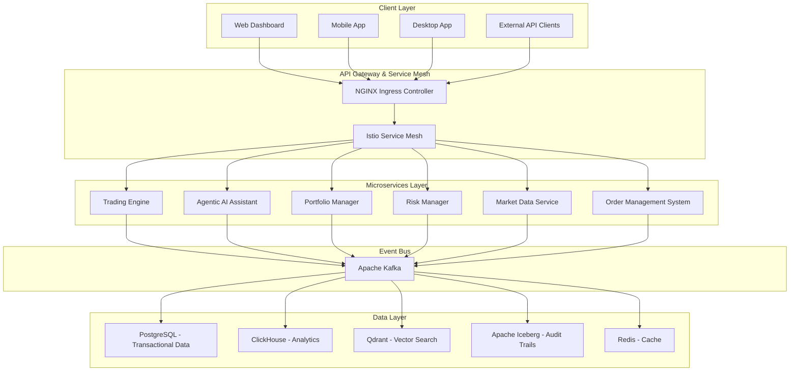
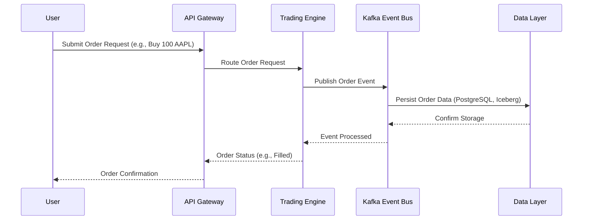

# Business Requirements Document (BRD)

## Nautilus Trader: Enterprise Algorithmic Trading System

| **Document Attribute** | **Details**                |
|-----------------------|----------------------------|
| **Version**           | 2.0                        |
| **Date**              | August 6, 2025             |
| **Status**            | Draft                      |
| **Author**            | Vincent Pereira            |
| **Owner**             | Project Sponsor, Business Owner |

---

## 1.0 Introduction

### 1.1 Purpose of the Document

This Business Requirements Document (BRD) outlines the business needs, objectives, and detailed requirements for the **Nautilus Trader Algorithmic Trading System (ATS)**, an enterprise-grade platform designed to revolutionize algorithmic trading. The purpose of this document is to:

- Define the scope and objectives of the Nautilus Trader ATS.
- Articulate the functional and non-functional requirements necessary to meet business goals.
- Serve as a contractual agreement between stakeholders and the development team.
- Provide a comprehensive roadmap for building a high-performance, secure, and accessible trading platform.

The Nautilus Trader ATS aims to bridge the gap between retail and institutional traders by offering a scalable, AI-enhanced, and compliant trading solution that leverages open-source technologies in a "Best-of-Breed" integration approach.

### 1.2 Project Background

The financial trading industry faces several challenges that Nautilus Trader seeks to address:

- **Accessibility**: Existing platforms either cater to novices with limited functionality or overwhelm non-technical users with complexity, leaving a gap for a balanced solution.
- **Performance**: High-frequency trading demands sub-millisecond latency, which many systems fail to deliver consistently.
- **Intelligence**: There is a lack of integrated AI-driven tools for real-time market analysis, sentiment tracking, and strategy optimization.
- **Compliance**: Institutional adoption requires robust security, auditability, and regulatory compliance, which many platforms inadequately provide.

Nautilus Trader emerges from the need to create a unified platform that combines cutting-edge technology, user-friendly design, and enterprise-grade features to empower traders across all experience levels.

### 1.3 Business Objectives

The Nautilus Trader ATS is driven by the following business objectives:

1. **Democratize Algorithmic Trading**
   - **Goal**: Provide sophisticated trading tools to retail users and enterprise features to professionals.
   - **KPIs**:
     - 50% of retail users adopt the no-code strategy builder within 6 months.
     - User satisfaction score >85% for the Agentic AI Assistant.

2. **Achieve Superior Performance**
   - **Goal**: Deliver a low-latency trading experience suitable for high-frequency strategies.
   - **KPIs**:
     - Core trading engine latency < 1ms.
     - API gateway latency < 10ms.
     - Market data processing latency < 100µs.

3. **Enhance Decision-Making with AI**
   - **Goal**: Integrate AI and machine learning for predictive insights and automated trading decisions.
   - **KPIs**:
     - >90% accuracy in ML-based pattern recognition.
     - >85% accuracy in NLP sentiment analysis.
     - Measurable profit and loss (P&L) improvement from AI strategies.

4. **Ensure Enterprise-Grade Security and Compliance**
   - **Goal**: Meet institutional standards for security, auditability, and regulatory compliance.
   - **KPIs**:
     - Zero critical vulnerabilities in penetration tests.
     - Automated compliance reports generated successfully (e.g., MiFID II).
     - Immutable audit trails verifiable at all times.

5. **Increase Trading Efficiency**
   - **Goal**: Automate workflows and reduce operational costs using open-source technology.
   - **KPIs**:
     - 75% reduction in manual trade execution errors.
     - 50% increase in strategies managed per user.
     - Lower total cost of ownership compared to proprietary systems.

6. **Guarantee High Reliability**
   - **Goal**: Ensure consistent availability and fault tolerance for trading operations.
   - **KPIs**:
     - 99.95% system uptime.
     - Recovery Time Objective (RTO) < 4 hours, Recovery Point Objective (RPO) < 15 minutes.

### 1.4 Scope

#### 1.4.1 In-Scope

- **Multi-Asset Trading**: Support for stocks, ETFs, futures, options, forex, and cryptocurrencies.
- **Strategy Development**: No-code builder, AI-assisted tools, and Python-based coding options.
- **Risk and Compliance**: Real-time risk management, portfolio optimization, and regulatory reporting.
- **Broker Integrations**: Initial support for Interactive Brokers and Alpaca, with plans for OANDA, Coinbase, and FIX protocol.
- **Security and Scalability**: Enterprise-grade features including zero-trust security and horizontal scaling.
- **Development Phases**: Seven-phase plan from dependency management to future enhancements.

#### 1.4.2 Out-of-Scope

- Development of proprietary hardware solutions.
- Direct management or custody of client funds.

---

## 2.0 Stakeholder Analysis

### 2.1 Key Stakeholders

| **Role**                | **Responsibilities**                                                                                  |
|-------------------------|-------------------------------------------------------------------------------------------------------|
| **Project Sponsor**     | Provides funding, strategic oversight, and champions the project at the executive level.             |
| **Business Owner**      | Defines business requirements, ensures alignment with organizational goals, and approves deliverables. |
| **Traders (End-Users)** | Primary users of the platform; provide feedback on usability, functionality, and performance.        |
| **Compliance Team**     | Ensures adherence to financial regulations (e.g., GDPR, MiFID II) and validates audit capabilities.  |
| **Development Team**    | Designs, builds, and maintains the platform, ensuring technical feasibility and performance.         |
| **Quantitative Analysts**| Develops and validates trading strategies; requires advanced analytics and high-performance tools.   |

### 2.2 Stakeholder Needs

- **Traders**: Intuitive interface, fast execution, and AI-driven insights.
- **Compliance Team**: Immutable audit trails, automated reporting, and regulatory compliance.
- **Developers**: Modular architecture, robust tools, and clear requirements.
- **Sponsor/Business Owner**: High ROI, scalability, and market competitiveness.

---

## 3.0 Functional Requirements

### 3.1 Trading Capabilities

- **FR-01**: The system SHALL support trading across multiple asset classes: stocks, ETFs, futures, options, forex, and cryptocurrencies.
- **FR-02**: The system SHALL provide a unified Order Management System (OMS) supporting:
  - Market orders
  - Limit orders
  - Stop orders
  - Algorithmic orders (e.g., TWAP, VWAP)
- **FR-03**: The system SHALL integrate with:
  - Interactive Brokers (Phase 1)
  - Alpaca (Phase 1)
  - OANDA (Phase 2)
  - Coinbase (Phase 2)
  - FIX protocol for institutional connectivity (Phase 3)

### 3.2 Strategy Development

- **FR-04**: The system SHALL provide a no-code strategy builder using Blockly, enabling retail users to:
  - Visually design trading strategies.
  - Backtest strategies with historical data.
  - Deploy strategies to live trading.
- **FR-05**: The system SHALL include an Agentic AI Assistant to:
  - Interpret natural language commands (e.g., "Buy 100 shares of AAPL when RSI > 70").
  - Generate and optimize trading strategies.
  - Provide real-time market insights.
- **FR-06**: The system SHALL support Python-based strategy development with:
  - Integration into the NautilusTrader engine.
  - Access to real-time and historical data APIs.
  - Debugging and profiling tools.

### 3.3 AI and Analytics

- **FR-07**: The Agentic AI Assistant SHALL:
  - Process natural language inputs for trading, research, and portfolio management.
  - Collaborate with specialized agents (e.g., market analyst, risk evaluator).
- **FR-08**: The system SHALL integrate machine learning models for:
  - Pattern recognition (>90% accuracy).
  - Market forecasting.
  - Sentiment analysis using NLP (>85% accuracy).
- **FR-09**: The system SHALL provide real-time analytics including:
  - Portfolio optimization (Sharpe ratio, diversification metrics).
  - Risk assessment (VaR, stress testing).
  - Performance attribution (P&L breakdown).

### 3.4 Risk Management and Compliance

- **FR-10**: The system SHALL implement real-time risk monitoring with:
  - Pre-trade risk checks (e.g., margin, exposure limits).
  - Position limits per user and account.
  - Value at Risk (VaR) calculations updated intraday.
- **FR-11**: The system SHALL generate compliance reports for:
  - MiFID II (transaction reporting).
  - GDPR (data privacy).
  - Immutable audit trails stored via Apache Iceberg.
- **FR-12**: The system SHALL enforce security with:
  - Role-Based Access Control (RBAC).
  - Zero-trust architecture (verify every request).

### 3.5 User Interface and Experience

- **FR-13**: The system SHALL offer a multi-platform UI:
  - Web dashboard with real-time data visualization.
  - Mobile app for monitoring and basic trading.
  - Desktop app for advanced users.
- **FR-14**: The system SHALL ensure:
  - WCAG 2.1 accessibility compliance.
  - Customizable dashboards (e.g., widgets for positions, charts).

---

## 4.0 Non-Functional Requirements

### 4.1 Performance

- **NFR-01**: Core trading engine latency SHALL be < 1ms under normal load.
- **NFR-02**: API gateway SHALL respond with median latency < 10ms.
- **NFR-03**: Market data processing SHALL achieve latency < 100µs.

### 4.2 Scalability

- **NFR-04**: The system SHALL support 10,000 concurrent users with horizontal scaling.
- **NFR-05**: The event bus SHALL handle 1 million messages/second at peak load.

### 4.3 Reliability and Availability

- **NFR-06**: System uptime SHALL be ≥ 99.95%, with multi-zone failover.
- **NFR-07**: Disaster recovery SHALL meet:
  - RTO < 4 hours.
  - RPO < 15 minutes.

### 4.4 Security

- **NFR-08**: The system SHALL use:
  - AES-256 encryption at rest.
  - TLS 1.3 for data in transit.
- **NFR-09**: Security audits and penetration tests SHALL report zero critical vulnerabilities.

### 4.5 Observability

- **NFR-10**: The system SHALL provide:
  - Real-time monitoring and logging.
  - Distributed tracing for all services.
  - Anomaly detection with alerts.

---

## 5.0 Constraints and Assumptions

### 5.1 Constraints

- **Integration**: MUST connect with financial data providers (e.g., Bloomberg, Refinitiv) and brokers.
- **Regulatory**: MUST comply with GDPR, MiFID II, and other applicable regulations.
- **Deployment**: MUST support cloud deployment (AWS, GCP) with multi-region capabilities.

### 5.2 Assumptions

- Users have reliable internet and modern devices.
- Cloud infrastructure can scale to meet performance needs.
- Open-source components remain stable and customizable.

---

## 6.0 Architecture Diagram

The high-level architecture of Nautilus Trader ATS is depicted below using a Mermaid diagram, illustrating the interaction between client interfaces, API gateway, microservices, event bus, and data storage.

---

## 7.0 Data Flow Diagram

The following Mermaid sequence diagram illustrates the data flow for placing a trade order, showing interactions between the user, API gateway, trading engine, event bus, and data layer.

---

## 8.0 Risks and Mitigation Strategies

| **Risk**                  | **Impact**                          | **Likelihood** | **Mitigation**                                                                 |
|---------------------------|-------------------------------------|----------------|--------------------------------------------------------------------------------|
| **Integration Complexity**| Delays from 50+ open-source components | High           | Use dependency management (Phase 0); maintain forks; allocate buffer time.    |
| **Performance Issues**    | Failure to meet latency goals       | Medium         | Implement Rust for critical components; use Memray for profiling.             |
| **Security Breaches**     | Exposure of sensitive data          | Medium         | Zero-trust model; regular audits; integrate Bandit for SAST.                  |
| **Regulatory Non-Compliance** | Fines, reputational damage       | Low            | Early compliance involvement; immutable audit trails; automated reporting.    |
| **Dependency Risks**      | Open-source project abandonment     | Medium         | Monitor dependencies; maintain forks; prioritize security patches.            |

---

## 9.0 Approval and Sign-Off

| **Role**             | **Name** | **Signature** | **Date** |
|----------------------|----------|---------------|----------|
| Project Sponsor      |          |               |          |
| Business Owner       |          |               |          |
| Lead Developer       |          |               |          |
| Compliance Officer   |          |               |          |

---

## 10.0 Glossary

| **Term**         | **Definition**                                                                 |
|------------------|--------------------------------------------------------------------------------|
| **Agentic AI**   | Collaborative AI agents that reason, plan, and execute tasks autonomously.    |
| **ATS**          | Algorithmic Trading System.                                                    |
| **FIX Protocol** | Financial Information eXchange protocol for real-time securities transactions.|
| **RAG**          | Retrieval-Augmented Generation, enhancing AI responses with retrieved data.   |
| **RBAC**         | Role-Based Access Control, restricting access based on user roles.            |
| **VaR**          | Value at Risk, a measure of potential financial loss over a time frame.       |
| **Zero-Trust**   | Security model requiring verification for every access request.               |

---

This BRD provides a detailed blueprint for the Nautilus Trader ATS, ensuring all business needs are met with a robust technical foundation.