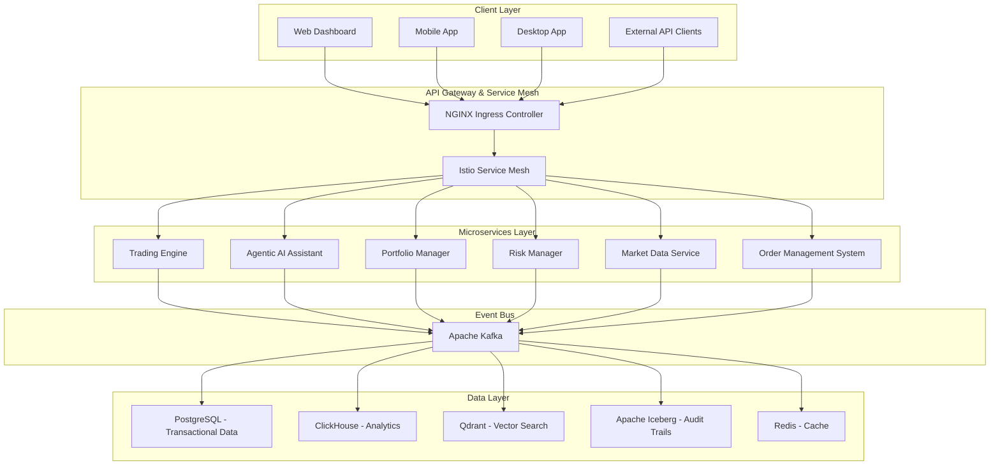
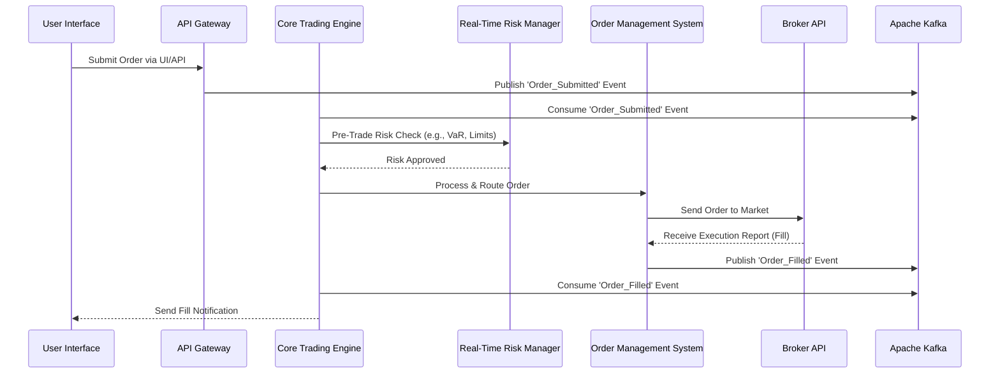

## **Business Requirements Document (BRD)**

### **Nautilus Trader: Enterprise Algorithmic Trading System**

| **Version:** | 2.0                             |
|:------------ |:------------------------------- |
| **Date:**    | August 6, 2025                  |
| **Status:**  | Draft                           |
| **Author:**  | Vincent Pereira                 |
| **Owner:**   | Project Sponsor, Business Owner |

-----

### **1.0 Executive Summary**

#### **1.1 Purpose**

[cite\_start]This Business Requirements Document (BRD) defines the business needs, objectives, and functional and non-functional requirements for the **Nautilus Trader Algorithmic Trading System (ATS)**[cite: 573]. [cite\_start]It serves as the foundational agreement between stakeholders, providing a clear roadmap for the development team to ensure the final product aligns perfectly with business goals and user expectations[cite: 574, 575]. [cite\_start]The project's goal is to build a comprehensive, enterprise-grade algorithmic trading platform from the ground up, designed to automate trading strategies across a wide array of asset classes[cite: 1, 576].

#### **1.2 Project Background and Problem Statement**

[cite\_start]The development of the ATS is driven by a clear market need for a sophisticated yet accessible trading platform[cite: 598]. [cite\_start]The current market offers platforms that are either too simplistic for professional traders or overwhelmingly complex for non-technical users[cite: 602]. [cite\_start]Furthermore, existing solutions often lack robust, integrated AI-driven tools, exhibit inadequate performance for high-frequency data processing, and fail to meet stringent enterprise security and compliance standards[cite: 603, 604, 605].

[cite\_start]This project will build a "Best-of-Breed" system by integrating premier open-source technologies to create a powerful, modular, and scalable foundation[cite: 2]. [cite\_start]The platform will address the existing market gaps by delivering a unified, high-performance, and secure system that empowers a diverse user base—from novices to expert quantitative analysts—with cutting-edge AI-powered tools and analytics[cite: 3, 606, 607, 608, 609].

#### **1.3 Business Objectives and Success Criteria**

The primary business objectives for the Nautilus Trader platform are:

| Objective                                         | Description                                                                                                                                        | Success Criteria / Key Performance Indicators (KPIs)                                                                                                                                                                                                                               |
|:------------------------------------------------- |:-------------------------------------------------------------------------------------------------------------------------------------------------- |:---------------------------------------------------------------------------------------------------------------------------------------------------------------------------------------------------------------------------------------------------------------------------------- |
| **Democratize Algorithmic Trading**               | [cite\_start]Make sophisticated trading tools accessible to non-technical users while providing powerful features for professionals[cite: 3, 614]. | - [cite\_start]Successful launch and adoption of the no-code strategy builder [cite: 21, 378][cite\_start].\<br\>- High user satisfaction scores for the Agentic AI Assistant[cite: 6, 22].                                                                                        |
| **Achieve High Performance**                      | [cite\_start]Deliver an institutional-grade, low-latency trading experience suitable for high-frequency strategies[cite: 12].                      | - [cite\_start]Core trading engine latency under 1ms[cite: 12].\<br\>- API gateway latency under 10ms.\<br\>- Market data processing latency under 100µs.                                                                                                                          |
| **Provide AI-Driven Intelligence**                | [cite\_start]Leverage AI and ML to offer predictive insights, automated analysis, and enhanced decision-making capabilities[cite: 6, 612].         | - \>90% accuracy for ML-based pattern recognition.\<br\>- \>85% accuracy for NLP sentiment analysis.\<br\>- Measurable P\&L improvement from AI-recommended strategies.                                                                                                            |
| **Ensure Enterprise-Grade Security & Compliance** | [cite\_start]Build a secure, auditable, and compliant platform that meets the highest institutional standards[cite: 12, 615].                      | - [cite\_start]Zero critical vulnerabilities found in penetration tests.\<br\>- Successful generation of automated compliance reports (e.g., for MiFID II) [cite: 536][cite\_start].\<br\>- Immutable audit trails for all system actions are maintained and verifiable[cite: 29]. |
| **Enhance Trading Efficiency & Reduce Costs**     | [cite\_start]Automate trading workflows and leverage open-source technology to minimize manual effort and operational overhead[cite: 610, 611].    | - Reduction in manual trade execution errors.\<br\>- Increased number of strategies managed per user.\<br\>- Lower total cost of ownership compared to proprietary systems.                                                                                                        |
| **Achieve High Reliability & Availability**       | Ensure the platform is fault-tolerant and consistently available for trading operations.                                                           | - Achieve 99.95% system uptime.\<br\>- Successful execution of automated disaster recovery drills with an RTO of \< 4 hours and RPO of \< 15 minutes.                                                                                                                              |

#### **1.4 Scope**

##### **In-Scope**

The scope of this project includes the design, development, and deployment of a complete algorithmic trading system with the following key capabilities:

* [cite\_start]**Multi-Asset Trading:** Support for stocks, ETFs, futures, options, forex, and cryptocurrencies[cite: 15, 40].
* [cite\_start]**Strategy Development:** Multiple interfaces including a no-code visual builder (Blockly), a traditional Python Studio, and AI-assisted development[cite: 21, 22, 23, 381].
* [cite\_start]**AI-Powered Core:** A sophisticated Agentic AI Assistant for natural language interaction, research, analysis, and trade management[cite: 6, 22, 26]. [cite\_start]This includes document analysis (RAG), sentiment analysis, and predictive modeling[cite: 24, 150, 496].
* [cite\_start]**Backtesting & Optimization:** A high-performance backtesting engine (NautilusTrader) supplemented by GPU-accelerated testing (VectorBT) and hyperparameter tuning (Optuna)[cite: 7, 10, 354].
* [cite\_start]**Broker Integration:** Connectivity to multiple brokers, starting with Interactive Brokers and Alpaca, with a framework for future expansion to others like OANDA, Coinbase, and via the FIX protocol[cite: 19, 473, 556].
* [cite\_start]**Multi-Platform User Interface:** A unified and responsive user experience across Web (Next.js), Mobile (React Native), Desktop (Electron), and PWA[cite: 168, 476, 486].
* [cite\_start]**Portfolio & Risk Management:** Real-time risk monitoring (VaR), portfolio optimization, and performance analytics[cite: 16, 17, 362, 366].
* [cite\_start]**Enterprise Features:** A Zero-Trust security architecture, role-based access control (RBAC), immutable audit trails (Apache Iceberg), and comprehensive observability (Prometheus, Grafana, Jaeger)[cite: 28, 29, 257, 264, 314].

##### **Out-of-Scope**

* Development of proprietary trading hardware.
* Direct management of client funds or acting as a custodian.
* Providing financial advice; the platform provides tools for analysis, not recommendations to be acted upon without user discretion.
* [cite\_start]Management of third-party broker platforms or services beyond the defined API integrations[cite: 586].

#### **1.5 Stakeholders**

| Stakeholder Role                       | Name/Title       | Interest & Responsibilities                                                                                                                                                                                                                          |
|:-------------------------------------- |:---------------- |:---------------------------------------------------------------------------------------------------------------------------------------------------------------------------------------------------------------------------------------------------- |
| **Project Sponsor**                    | [To Be Assigned] | [cite\_start]Provides project funding and strategic oversight; ensures alignment with business goals[cite: 633].                                                                                                                                     |
| **Business Owner**                     | [To Be Assigned] | [cite\_start]Defines business goals and product vision; responsible for ROI and market fit[cite: 634].                                                                                                                                               |
| **Retail / Non-Technical Trader**      | End-User Persona | [cite\_start]Primary user of the no-code tools and AI assistant; requires an intuitive, user-friendly interface[cite: 3, 638].                                                                                                                       |
| **Professional / Quantitative Trader** | End-User Persona | [cite\_start]Primary user of the Python Studio, advanced analytics, and low-latency execution features; requires performance and deep functionality[cite: 3, 639].                                                                                   |
| **Portfolio / Risk Manager**           | End-User Persona | [cite\_start]Uses risk dashboards, portfolio optimization, and compliance reporting tools to manage firm-wide exposure[cite: 17, 16].                                                                                                                |
| **Compliance Officer**                 | [To Be Assigned] | [cite\_start]Ensures the platform meets all legal and regulatory requirements (e.g., MiFID II, SOX); requires robust audit trails and reporting[cite: 627, 628].                                                                                     |
| **Development Team**                   | Internal         | [cite\_start]Responsible for the technical design, implementation, testing, and deployment of the system[cite: 625, 626]. [cite\_start]Includes roles like Lead Developer, AI/ML Engineer, UI/UX Designer, and DevOps Engineer[cite: 635, 636, 637]. |
| **Security Team**                      | [To Be Assigned] | [cite\_start]Implements and monitors security architecture, including the Zero-Trust model, encryption, and threat detection[cite: 640].                                                                                                             |

#### **1.6 Assumptions and Dependencies**

* **Assumption:** Required market data feeds and broker APIs (e.g., Interactive Brokers, Alpaca) will be available, accessible, and provide documented, reliable performance.
* **Assumption:** Cloud infrastructure (e.g., Kubernetes, S3-compatible storage) will be available and can meet the performance and scalability requirements of the platform.
* [cite\_start]**Dependency:** The project relies heavily on the stability, security, and continued maintenance of the selected open-source components (e.g., NautilusTrader, Kafka, LangChain)[cite: 2, 397]. [cite\_start]A comprehensive dependency management strategy (as defined in Phase 0) is critical to mitigate this risk[cite: 432].
* [cite\_start]**Dependency:** The successful implementation of each project phase is dependent on the completion and validation of the deliverables from the preceding phase[cite: 428].

-----

## 2. Diagrams and Workflows

### 2.1 Architecture Diagram

The high-level architecture of Nautilus Trader ATS is depicted below using a Mermaid diagram, illustrating the interaction between client interfaces, API gateway, microservices, event bus, and data storage.

-----

### 2.2 Business Process Model

The "To-Be" business process for a typical trading workflow is event-driven and automated, designed to minimize latency and ensure real-time risk management.

#### **2.2.1 High-Level Trading Workflow**

The diagram below illustrates the sequence of events from a user submitting a trade to its execution and notification.

**Workflow Description:**

1. A user submits a trade order through one of the client interfaces (Web, Mobile, API).
2. The API Gateway receives the request and publishes an `Order_Submitted` event to the Apache Kafka event bus.
3. The Trading Engine consumes this event, initiating the trade lifecycle.
4. Before execution, the engine sends the order details to the Risk Manager for real-time pre-trade compliance and risk checks.
5. Once approved, the Trading Engine forwards the order to the Order Management System (OMS).
6. The OMS validates and routes the order to the appropriate external broker.
7. The broker executes the trade and returns a fill confirmation to the OMS.
8. The OMS publishes an `Order_Filled` event to Kafka.
9. The Trading Engine and other relevant services (e.g., Portfolio Manager) consume this event to update their state, and a notification is sent back to the user's interface.

-----

### **3.0 Functional Requirements**

The system's functional requirements are broken down by core capability areas.

#### **3.1 User Interfaces and Experience (UI/UX)**

* [cite\_start]**FR-101: Multi-Platform Access:** The system must provide a consistent and responsive user experience across Web (Next.js), Mobile (React Native), Desktop (Electron), and Progressive Web App (PWA) platforms[cite: 472, 476].
* [cite\_start]**FR-102: Real-Time Trading Dashboard:** The UI must feature a customizable real-time dashboard displaying portfolio value, P\&L, positions, market data, and active strategies[cite: 472, 516]. [cite\_start]All data must update in real-time without requiring a page refresh[cite: 475].
* [cite\_start]**FR-103: Advanced Charting:** The system must integrate a professional-grade charting library (e.g., TradingView) supporting real-time data, 50+ technical indicators, drawing tools, and multiple timeframes[cite: 472, 515].
* [cite\_start]**FR-104: AI Chat Interface:** The system must provide an intuitive chat interface (Lobe Chat) for users to interact with the Agentic AI Assistant using natural language[cite: 24, 474].
* [cite\_start]**FR-105: No-Code Strategy Builder:** The system must include a visual, drag-and-drop interface (Blockly) for non-technical users to build, test, and deploy trading strategies[cite: 21, 474].
* [cite\_start]**FR-106: Python Development Environment:** The system must provide a "Python Studio," a traditional coding environment for professional users to develop and debug complex strategies[cite: 23, 381].

#### **3.2 Trading and Order Management**

* [cite\_start]**FR-201: Multi-Asset Class Support:** The trading engine must support the trading of equities, ETFs, futures, options, forex, and cryptocurrencies across multiple venues simultaneously[cite: 15, 40].
* [cite\_start]**FR-202: Comprehensive Order Types:** The Order Management System (OMS) must support standard order types (Market, Limit, Stop, Stop-limit) as well as advanced algorithmic orders (e.g., VWAP, TWAP)[cite: 19].
* [cite\_start]**FR-203: Broker Integration:** The system must integrate with multiple brokers, starting with Interactive Brokers and Alpaca, through a unified abstraction layer that enables intelligent order routing[cite: 19, 473, 483].
* [cite\_start]**FR-204: FIX Protocol Connectivity:** The system must include a FIX Gateway (using QuickFIX/J or FIX8) to support institutional-grade trading connectivity[cite: 20, 556].
* [cite\_start]**FR-205: Smart Order Routing (SOR):** The system must develop a smart order router to execute large orders by intelligently slicing them and routing them to optimal venues to minimize market impact[cite: 554].

#### **3.3 AI, Analytics, and Strategy Development**

* [cite\_start]**FR-301: Agentic AI Assistant:** The system must feature a sophisticated AI assistant that acts as the platform's "brain"[cite: 6]. This assistant must be capable of:
  * [cite\_start]Answering natural language queries about markets, portfolios, and strategies[cite: 26].
  * [cite\_start]Assisting with Python code generation, debugging, and optimization for trading strategies using specialized agents like OpenHands[cite: 22, 92].
  * [cite\_start]Executing complex, multi-step workflows like running a backtest and deploying a strategy via conversational commands, orchestrated by LangGraph and Goose[cite: 116, 119, 122].
  * [cite\_start]Analyzing user-uploaded documents (e.g., research papers, financial reports) using a Retrieval-Augmented Generation (RAG) pipeline to provide insights[cite: 24, 25].
* [cite\_start]**FR-302: Predictive Modeling:** The system must integrate and support various ML and deep learning models (e.g., LSTM, ARIMA) for time-series forecasting to enhance AI-driven strategies[cite: 9, 150, 153].
* [cite\_start]**FR-303: High-Performance Backtesting:** The system must provide a realistic, event-driven backtesting engine (NautilusTrader) to validate strategies against historical data, including simulations of slippage and fees[cite: 7, 35]. [cite\_start]This will be supplemented by GPU-accelerated backtesting (VectorBT) for speed[cite: 10, 158].
* [cite\_start]**FR-304: Portfolio Optimization:** The system must integrate tools (PyPortfolioOpt, Riskfolio-Lib) to perform advanced portfolio optimization, such as mean-variance optimization and hierarchical risk parity[cite: 11, 16, 362, 366].
* [cite\_start]**FR-305: Sentiment Analysis:** The system must have a data pipeline for analyzing sentiment from news, social media, and financial documents to use as a feature in trading models[cite: 496, 507].
* [cite\_start]**FR-306: Explainable AI (XAI):** To ensure transparency, the system must integrate tools like SHAP to explain the outputs of its machine learning models[cite: 374, 377].

#### **3.4 Risk, Security, and Compliance**

* [cite\_start]**FR-401: Real-Time Risk Management:** The system must provide a real-time risk dashboard and engine that monitors metrics like Value at Risk (VaR), exposure limits, and account-level circuit breakers[cite: 17, 28]. All trades must pass pre-trade risk checks before execution.
* [cite\_start]**FR-402: Zero-Trust Security:** The platform must be built on a Zero-Trust security architecture, where no actor is trusted by default and all access is continuously verified[cite: 28, 331].
* [cite\_start]**FR-403: Role-Based Access Control (RBAC):** The system must implement granular RBAC to ensure users can only access data and functionality appropriate for their role[cite: 28, 533].
* [cite\_start]**FR-404: Immutable Audit Trails:** All user actions, trades, system events, and configuration changes must be recorded in an immutable audit trail using technologies like Apache Iceberg to ensure regulatory compliance and forensic capability[cite: 29, 332, 533].
* [cite\_start]**FR-405: Automated Security Scanning:** The development lifecycle must include Static Application Security Testing (SAST) using tools like Bandit to automatically scan Python code for vulnerabilities before deployment[cite: 31, 339, 341].
* [cite\_start]**FR-406: Feature Flags & Kill Switches:** The system must use a feature management tool (Unleash) to dynamically toggle strategies and features, providing a "kill switch" for emergency shutdowns[cite: 30, 333].

-----

### **4.0 Non-Functional Requirements (NFRs)**

| Category                       | NFR ID | Requirement Description                                                                                                                                                                      |
|:------------------------------ |:------ |:-------------------------------------------------------------------------------------------------------------------------------------------------------------------------------------------- |
| **Performance & Latency**      | NFR-01 | The core trading engine must process orders with a latency of less than 1 millisecond.                                                                                                       |
|                                | NFR-02 | The API Gateway must respond to requests in under 10 milliseconds.                                                                                                                           |
|                                | NFR-03 | The Market Data service must process incoming data streams with a latency of under 100 microseconds.                                                                                         |
| **Scalability & Throughput**   | NFR-04 | The system must be able to scale horizontally to support 10,000+ concurrent users and connections.                                                                                           |
|                                | NFR-05 | The API Gateway must handle a throughput of at least 10,000 requests per second (RPS).                                                                                                       |
|                                | NFR-06 | The Market Data service must handle a throughput of 1 million messages per second.                                                                                                           |
| **Reliability & Availability** | NFR-07 | The system must achieve a minimum of 99.95% uptime, excluding scheduled maintenance.                                                                                                         |
|                                | NFR-08 | [cite\_start]The system must be deployed in a multi-AZ (Availability Zone) configuration to ensure high availability and automatic failover[cite: 544].                                      |
|                                | NFR-09 | The system's Recovery Time Objective (RTO) must be less than 4 hours, and its Recovery Point Objective (RPO) must be less than 15 minutes.                                                   |
| **Security**                   | NFR-10 | All data in transit must be encrypted using TLS 1.3 or higher.                                                                                                                               |
|                                | NFR-11 | All sensitive data at rest (e.g., credentials, user data) must be encrypted using AES-256.                                                                                                   |
|                                | NFR-12 | [cite\_start]The system must implement a Zero-Trust security model with continuous verification for all service-to-service communication, enforced via a service mesh like Istio[cite: 330]. |
| **Observability**              | NFR-13 | [cite\_start]The system must provide comprehensive, real-time monitoring of system health, application metrics, and business KPIs using Prometheus and Grafana[cite: 257, 264, 532].         |
|                                | NFR-14 | [cite\_start]The system must support distributed tracing (Jaeger, Grafana Tempo) to track requests across all microservices for performance debugging[cite: 314, 532].                       |
|                                | NFR-15 | [cite\_start]The system must aggregate logs from all services into a centralized, searchable system (e.g., ELK Stack or Grafana Loki) for analysis and troubleshooting[cite: 300, 532].      |
| **Compliance**                 | NFR-16 | [cite\_start]The system must have the capability to generate automated reports to meet regulatory requirements such as MiFID II and SOX[cite: 536].                                          |

-----

### **5.0 Data Requirements**

#### **5.1 Data Sources**

The system will ingest data from a variety of sources:

* **Real-time and Historical Market Data:** From integrated data providers and broker feeds.
* [cite\_start]**Fundamental Data:** From services like OpenBB[cite: 8].
* **Alternative Data:** Financial news, social media feeds, and other non-traditional sources.
* **User Data:** User profiles, account settings, and strategy configurations.
* **Transactional Data:** Orders, executions, and portfolio positions.

#### **5.2 Data Management and Storage**

The system will utilize a polyglot persistence strategy to use the best database for each specific need:

* [cite\_start]**Transactional Data:** Stored in a relational database like **PostgreSQL**[cite: 209].
* [cite\_start]**Vector Embeddings:** **PostgreSQL with pgvector** and **Qdrant** will be used for AI-related semantic search and RAG capabilities[cite: 209, 218].
* [cite\_start]**Time-Series Data:** High-frequency market data will be stored in a specialized time-series database like **InfluxDB** or **ClickHouse** for fast analytics[cite: 213, 235].
* [cite\_start]**Immutable Storage:** **Apache Iceberg** will be used for long-term, immutable storage of audit trails and trade records for compliance[cite: 29, 223].
* [cite\_start]**Caching:** **Redis** will be used for high-performance caching of frequently accessed data and for managing user sessions[cite: 225].
* [cite\_start]**Event Streaming:** **Apache Kafka** will serve as the central, durable event log for all system-wide communication, ensuring data replayability and decoupling of services[cite: 4, 44].
* [cite\_start]**Data Consistency:** A **Schema Registry** will be used with Kafka to enforce data schemas and ensure data consistency across all microservices[cite: 47].

-----

### **6.0 Project Phases and Milestones**

[cite\_start]The project will be delivered in an incremental, multi-phase approach to manage complexity and deliver value faster[cite: 403, 406].

| Phase       | Title & Objective                                                                                                                                                                          | Key Deliverables                                                                                                                                                                                                                                                                                                     |
|:----------- |:------------------------------------------------------------------------------------------------------------------------------------------------------------------------------------------ |:-------------------------------------------------------------------------------------------------------------------------------------------------------------------------------------------------------------------------------------------------------------------------------------------------------------------- |
| **Phase 0** | [cite\_start]**Dependency Management Setup**\<br\>Establish a robust framework to manage the 60+ open-source components, ensuring stability and security[cite: 421, 432].                  | - [cite\_start]Automated monitoring and notification system for dependency updates [cite: 434, 435][cite\_start].\<br\>- Docker-based testing environments for dependency validation [cite: 436][cite\_start].\<br\>- Real-time dependency health dashboard[cite: 438].                                              |
| **Phase 1** | [cite\_start]**Core System Validation & Hardening**\<br\>Stabilize the existing foundation, validate security, test the trading engine, and enhance the core API layer[cite: 422, 457].    | - [cite\_start]Validated Zero-Trust architecture and fraud detection mechanisms [cite: 459][cite\_start].\<br\>- Comprehensively tested NautilusTrader engine [cite: 460][cite\_start].\<br\>- Enhanced multi-protocol API layer (REST, GraphQL, WebSocket, gRPC)[cite: 461].                                        |
| **Phase 2** | [cite\_start]**Frontend and Broker Integration**\<br\>Build the multi-platform UIs and integrate brokers to enable trading functionality[cite: 423, 471].                                  | - [cite\_start]Responsive UI for Web, Mobile, and Desktop [cite: 482][cite\_start].\<br\>- Integration of Interactive Brokers and Alpaca via a unified abstraction layer [cite: 483][cite\_start].\<br\>- Integration of Lobe Chat and Blockly into the frontend[cite: 484].                                         |
| **Phase 3** | [cite\_start]**AI/ML Integration**\<br\>Integrate advanced AI capabilities, including agentic frameworks and predictive models, to create an intelligent system[cite: 424, 491].           | - [cite\_start]Fully deployed TradingAgents framework with specialized agents [cite: 504][cite\_start].\<br\>- Real-time model inference engine for sub-millisecond predictions [cite: 505][cite\_start].\<br\>- Sentiment analysis pipeline and integration of advanced ML libraries (FinRL, PyOD)[cite: 506, 507]. |
| **Phase 4** | [cite\_start]**Frontend & Live Trading Enablement**\<br\>Connect the frontend to the live trading backend for a seamless, real-time user trading experience[cite: 425, 512, 520].          | - [cite\_start]Fully functional trading interface for placing, modifying, and canceling orders [cite: 514, 522][cite\_start].\<br\>- Real-time TradingView chart integration [cite: 515, 523][cite\_start].\<br\>- Frontend security enabled with MFA and RBAC[cite: 526].                                           |
| **Phase 5** | [cite\_start]**Enterprise Readiness**\<br\>Elevate the platform to institutional-grade status with full observability, advanced security, and compliance features[cite: 426, 531].         | - [cite\_start]Deployment of the full observability stack (Prometheus, Grafana, Jaeger, ELK) [cite: 542][cite\_start].\<br\>- Integration with enterprise authentication (OAuth2/OIDC, SSO) [cite: 543][cite\_start].\<br\>- Automated regulatory reporting and data retention policies[cite: 547].                  |
| **Phase 6** | [cite\_start]**System Enhancement & Future-Ready Tech**\<br\>Introduce next-generation features, ultra-low latency optimizations, and expanded institutional connectivity[cite: 427, 552]. | - [cite\_start]Smart order router and advanced execution algorithms (TWAP, VWAP) [cite: 554, 564][cite\_start].\<br\>- Integration of OANDA, Coinbase, and the FIX protocol [cite: 556, 566][cite\_start].\<br\>- Future-ready features like voice trading interfaces and AR visuals[cite: 558, 568].                |

-----

### **7.0 Risks and Mitigation**

| Risk Category                   | Description                                                                                                                                                                  | Mitigation Strategy                                                                                                                                                                                                                                                                                                                                            |
|:------------------------------- |:---------------------------------------------------------------------------------------------------------------------------------------------------------------------------- |:-------------------------------------------------------------------------------------------------------------------------------------------------------------------------------------------------------------------------------------------------------------------------------------------------------------------------------------------------------------- |
| **Integration Complexity**      | [cite\_start]Difficulty integrating the large number of "Best-of-Breed" open-source components, leading to delays and instability[cite: 696].                                | - [cite\_start]Implement the comprehensive dependency management and testing framework from Phase 0.\<br\>- Allocate buffer time in the project plan for integration challenges.\<br\>- Maintain forked repositories to control changes and ensure stability[cite: 397].                                                                                       |
| **Performance Bottlenecks**     | [cite\_start]The system fails to meet the stringent sub-millisecond latency requirements for high-frequency trading, rendering it non-competitive[cite: 697].                | - [cite\_start]Use performance-oriented technologies like Rust for critical components [cite: 7, 221][cite\_start].\<br\>- Conduct continuous performance testing and memory profiling (Memray) throughout the development lifecycle [cite: 283, 449][cite\_start].\<br\>- Optimize data flow with low-latency technologies like gRPC and Kafka[cite: 177, 4]. |
| **Security Vulnerabilities**    | [cite\_start]A security breach could lead to the exposure of sensitive financial data, user credentials, or proprietary trading strategies[cite: 698].                       | - [cite\_start]Adhere strictly to the Zero-Trust security model [cite: 28, 669][cite\_start].\<br\>- Conduct regular security audits and penetration testing [cite: 548][cite\_start].\<br\>- Integrate automated security scanning (SAST with Bandit) into the CI/CD pipeline to catch vulnerabilities early[cite: 31, 339].                                  |
| **Regulatory Non-Compliance**   | [cite\_start]The platform fails to meet the legal and regulatory standards of financial markets (e.g., MiFID II, GDPR), leading to fines and reputational damage[cite: 700]. | - [cite\_start]Involve the compliance team from the initial design phase [cite: 627, 701][cite\_start].\<br\>- Implement immutable audit trails for all actions [cite: 29, 332][cite\_start].\<br\>- Automate the generation of required regulatory reports[cite: 536].                                                                                        |
| **Open-Source Dependency Risk** | A critical open-source project is abandoned, introduces a severe vulnerability, or makes a breaking change that is difficult to adopt.                                       | - [cite\_start]The dependency management system (Phase 0) will monitor for updates and security issues [cite: 434][cite\_start].\<br\>- Maintain customized forks of critical repositories to control the update cycle [cite: 397][cite\_start].\<br\>- Prioritize security patches for immediate integration[cite: 440].                                      |

-----

### **8.0 Approval and Sign-off**

This Business Requirements Document requires formal approval from the key project stakeholders listed below. Their signatures indicate a shared understanding and agreement on the project's scope, objectives, and requirements as detailed herein. Once signed, this document will serve as the primary guide for all subsequent project phases.

| Stakeholder Role       | Signature | Date |
|:---------------------- |:--------- |:---- |
| **Project Sponsor**    |           |      |
| **Business Owner**     |           |      |
| **Lead Developer**     |           |      |
| **Compliance Officer** |           |      |

-----

### **9.0 Glossary**

| Term           | Definition                                                                                                                                                                                    |
|:-------------- |:--------------------------------------------------------------------------------------------------------------------------------------------------------------------------------------------- |
| **Agentic AI** | [cite\_start]An AI system composed of multiple specialized, collaborative agents that can reason, plan, and execute complex tasks[cite: 3].                                                   |
| **ATS**        | [cite\_start]Algorithmic Trading System[cite: 587].                                                                                                                                           |
| **FIX**        | [cite\_start]Financial Information eXchange: A messaging protocol for the real-time electronic exchange of securities transactions[cite: 243, 595].                                           |
| **RAG**        | [cite\_start]Retrieval-Augmented Generation: An AI technique that enhances responses by retrieving relevant information from a knowledge base before generating an answer[cite: 24, 25, 595]. |
| **RBAC**       | [cite\_start]Role-Based Access Control: A security paradigm that restricts system access to authorized users based on their role[cite: 28, 593].                                              |
| **VaR**        | Value at Risk: A statistic that quantifies the extent of possible financial loss within a firm, portfolio, or position over a specific time frame.                                            |
| **Zero-Trust** | [cite\_start]A security model that operates on the principle of "never trust, always verify," treating every access request as if it originates from an untrusted network[cite: 28].          |

### **10.0 Appendices**

* **Appendix A:** Comprehensive System Architecture Document (`comprehensive_system_architecture.md`)
* **Appendix B:** Detailed Design Specifications (`complete_designs.md`)
* **Appendix C:** Full Phased Implementation Tasks (`complete_tasks.md`)
