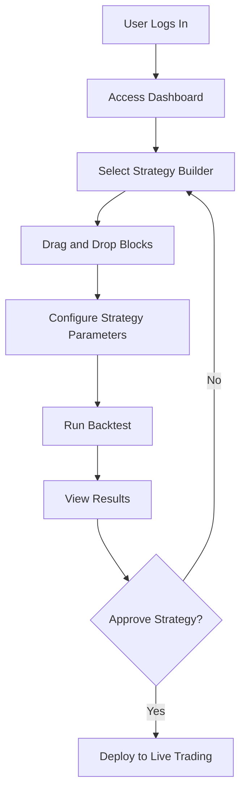
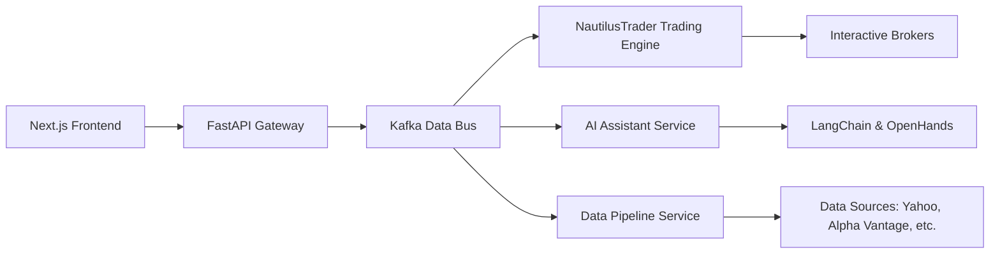

# Product Requirements Document (PRD): Algorithmic Trading System

## 1. Introduction

### 1.1 Purpose of the Document

This Product Requirements Document (PRD) serves as a detailed blueprint for the development of an enterprise-grade Algorithmic Trading System. It outlines the vision, features, functionalities, technical architecture, and requirements necessary to build a scalable, secure, and user-friendly platform that meets the needs of diverse users, including non-technical traders and professional analysts.

### 1.2 Project Overview

The Algorithmic Trading System is a modular platform designed to enable users to develop, test, and execute trading strategies across multiple asset classes (stocks, ETFs, futures, options, forex, and cryptocurrencies). Leveraging a "Best-of-Breed" integration strategy, it combines leading open-source technologies with AI-driven capabilities, real-time data processing, and an intuitive interface to support both no-code and advanced technical workflows.

### 1.3 Target Audience

- **Non-technical Traders**: Retail investors with basic market knowledge seeking an accessible, no-code solution to create and manage trading strategies.
- **Professional Traders/Analysts**: Experienced users requiring high-performance tools, low-latency execution, and customization options for complex trading needs.

---

## 2. Project Vision and Goals

### 2.1 High-Level "Why" of the Project

The Algorithmic Trading System aims to democratize access to sophisticated trading tools, bridging the gap between non-technical users and advanced trading technology. By integrating AI, real-time analytics, and a flexible architecture, the system empowers users to make informed trading decisions, optimize strategies, and capitalize on market opportunities efficiently.

### 2.2 Objectives and Success Criteria

- **Objective 1**: Build a modular and scalable system using best-in-class open-source technologies.
  - *Success Criterion*: System supports seamless integration of new features and scales to 1000 concurrent users.
- **Objective 2**: Provide an AI-powered assistant for natural language interaction and strategy development.
  - *Success Criterion*: AI assistant accurately interprets 95% of user queries and generates actionable insights.
- **Objective 3**: Deliver high-performance, low-latency data processing and trade execution.
  - *Success Criterion*: Latency under 100ms for data processing and trade execution.
- **Objective 4**: Ensure enterprise-grade security and compliance.
  - *Success Criterion*: Passes third-party security audits with zero critical vulnerabilities.
- **Objective 5**: Create an intuitive and seamless user experience for all personas.
  - *Success Criterion*: User satisfaction score of 85%+ in usability testing.

---

## 3. User Personas and Stories

### 3.1 User Personas

- **Persona A: Non-technical Trader (Sarah)**  
  
  - *Background*: 35-year-old retail investor with basic market knowledge and no coding skills.  
  - *Goals*: Easily create, test, and deploy trading strategies without technical barriers.  
  - *Pain Points*: Overwhelmed by complex platforms and jargon-heavy documentation.  

- **Persona B: Professional Trader/Analyst (Michael)**  
  
  - *Background*: 40-year-old quantitative analyst with 10+ years of trading and coding experience.  
  - *Goals*: Utilize advanced tools for high-frequency trading and custom strategy optimization.  
  - *Pain Points*: Frustrated by slow systems and lack of integration with custom workflows.  

### 3.2 User Stories

- **For Sarah (Non-technical Trader):**
  
  - As Sarah, I want a drag-and-drop interface to build trading strategies so that I can create ideas without coding.
  - As Sarah, I want the AI assistant to explain market trends in simple terms so that I can understand and act on them.
  - As Sarah, I want a real-time portfolio summary so that I can monitor my investments easily.

- **For Michael (Professional Trader/Analyst):**
  
  - As Michael, I want real-time market data and trade execution with minimal latency so that I can act on short-term opportunities.
  - As Michael, I want to integrate custom Python scripts into the platform so that I can tailor strategies to my needs.
  - As Michael, I want detailed backtesting metrics so that I can evaluate strategy performance comprehensively.

---

## 4. Functional Requirements

### 4.1 Core Trading Engine

- **Feature 1.1: Multi-Asset Class Trading Support**  
  - *Description*: Enable trading across stocks, ETFs, futures, options, forex, and cryptocurrencies using NautilusTrader.  
  - *Priority*: High  
- **Feature 1.2: Backtesting and Live Trading**  
  - *Description*: Support backtesting with historical data and live trading with real-time data feeds.  
  - *Priority*: High  

### 4.2 Data Pipelines

- **Feature 2.1: Real-Time Data Streaming**  
  - *Description*: Ingest and process real-time market data using Apache Kafka.  
  - *Priority*: High  
- **Feature 2.2: Data Source Fallback Mechanism**  
  - *Description*: Switch between data providers (e.g., Yahoo Finance to Alpha Vantage) if the primary source fails.  
  - *Priority*: Medium  

### 4.3 Agentic AI Assistant

- **Feature 3.1: Natural Language Interaction**  
  - *Description*: Implement an AI assistant using LangChain and LangGraph to interpret queries and provide insights.  
  - *Priority*: High  
- **Feature 3.2: Code Generation Support**  
  - *Description*: Use OpenHands to generate and debug code for trading strategies based on user input.  
  - *Priority*: Medium  

### 4.4 Prediction and Analytics

- **Feature 4.1: Machine Learning Predictions**  
  - *Description*: Integrate ML models for stock price forecasting and real-time market predictions.  
  - *Priority*: High  
- **Feature 4.2: Backtesting and Simulation Tools**  
  - *Description*: Provide comprehensive backtesting capabilities using VectorBT, backtrader, and TradingGym.  
  - *Priority*: High  

### 4.5 User Interface

- **Feature 5.1: Real-Time Dashboard**  
  - *Description*: Develop a Next.js frontend with react-financial-charts and ag-Grid for portfolio and risk metrics.  
  - *Priority*: High  
- **Feature 5.2: No-Code Strategy Builder**  
  - *Description*: Offer a drag-and-drop interface for non-technical users to create strategies.  
  - *Priority*: High  

### 4.6 API and Orchestration

- **Feature 6.1: Central API Bridge**  
  - *Description*: Use FastAPI to connect frontend, backend services, and external integrations.  
  - *Priority*: High  
- **Feature 6.2: Low-Latency Streaming**  
  - *Description*: Implement gRPC for efficient data streaming between components.  
  - *Priority*: High  

### 4.7 Security and Compliance

- **Feature 7.1: Zero-Trust Architecture**  
  - *Description*: Enforce strict access controls and Role-Based Access Control (RBAC).  
  - *Priority*: High  
- **Feature 7.2: Audit Trails**  
  - *Description*: Maintain immutable logs of all system activities for regulatory compliance.  
  - *Priority*: High  

---

## 5. Non-Functional Requirements

- **Performance**:  
  - Process high-frequency data streams with latency under 100ms.  
  - Support 1000 concurrent users without performance degradation.  
- **Security**:  
  - Encrypt data at rest and in transit using AES-256.  
  - Conduct regular vulnerability scans with Bandit.  
- **Scalability**:  
  - Enable horizontal scaling with Docker containers and Kubernetes orchestration.  
- **Usability**:  
  - Achieve a user satisfaction score of 85%+ for both personas.  
  - Ensure AI assistant response time is under 2 seconds.  

---

## 6. User Interface and Experience

### 6.1 UI Mockups and Wireframes

- **Dashboard**:  
  - *Description*: Displays portfolio value, live charts (react-financial-charts), and risk metrics (e.g., VaR, Sharpe Ratio) in an ag-Grid table.  
  - *Layout*: Top navigation bar, main panel with charts, sidebar with portfolio summary.  
- **Strategy Builder**:  
  - *Description*: Drag-and-drop interface with pre-built blocks (indicators, conditions, actions) for strategy creation.  
  - *Layout*: Canvas for block placement, toolbar with block library, preview pane for strategy output.  
- **AI Chat Interface**:  
  - *Description*: Conversational panel for interacting with the AI assistant via text input and responses with charts or suggestions.  
  - *Layout*: Chat window with input field at the bottom, scrollable response area.  

### 6.2 User Flow Diagrams

Below is a Mermaid diagram showing the user flow for creating and testing a trading strategy:

---

## 7. Technical Architecture

### 7.1 High-Level System Architecture

- *Overview*: A microservices architecture with Apache Kafka as the data bus, connecting services like the trading engine, AI assistant, and data pipeline. The Next.js frontend interacts with a FastAPI gateway orchestrating backend operations.  
- *Diagram*:

### 7.2 Technology Stack

- **Frontend**: Next.js, react-financial-charts, Plotly Dash, ag-Grid  
- **Backend**: FastAPI, gRPC, NautilusTrader  
- **Data**: Apache Kafka, PostgreSQL (with pgvector), ClickHouse, Apache Iceberg  
- **AI/ML**: LangChain, LangGraph, TradingAgents, OpenHands, VectorBT  
- **Security**: Bandit, Zero-Trust architecture  

### 7.3 Integration Points

- NautilusTrader integrates with Kafka for data ingestion and Interactive Brokers for live trading.  
- FastAPI serves as the central API bridge, connecting frontend and AI services.  

---

## 8. Data Requirements

### 8.1 Data Sources

- **Primary Sources**: Yahoo Finance, Alpha Vantage, Finnhub  
- **Live Trading**: Interactive Brokers  
- **Fallback Mechanism**: Switch to secondary source if primary fails (e.g., Alpha Vantage if Yahoo is down).  

### 8.2 Data Processing and Storage

- **Real-Time Processing**: Kafka streams data to ClickHouse for time-series analytics.  
- **Storage**:  
  - PostgreSQL with pgvector for relational and vector data.  
  - Apache Iceberg for immutable long-term storage.  
- **Schema Example (Portfolio Table)**:  
  - Columns: `user_id (int), asset (varchar), quantity (float), value (float), timestamp (datetime)`  

---

## 9. Testing and Quality Assurance

### 9.1 Test Cases

- **Test Case 1: Backtesting a Strategy**  
  - *Preconditions*: Historical data loaded, strategy defined.  
  - *Steps*: Run backtest, validate output metrics (e.g., profit, drawdown).  
  - *Expected Result*: Metrics match expected values within 1% tolerance.  
- **Test Case 2: AI Assistant Query**  
  - *Preconditions*: AI assistant active, user logged in.  
  - *Steps*: Input "Suggest a strategy for tech stocks," verify response.  
  - *Expected Result*: AI provides a valid strategy with explanation.  
- **Test Case 3: Live Trade Execution**  
  - *Preconditions*: Connected to Interactive Brokers, strategy deployed.  
  - *Steps*: Execute trade, check latency and confirmation.  
  - *Expected Result*: Trade executed in <100ms with confirmation.  

### 9.2 Acceptance Criteria

- System handles 1000 concurrent users with <100ms response time.  
- AI assistant achieves 95% accuracy in query responses.  
- Zero critical security vulnerabilities in audits.  

---

## 10. Project Timeline and Milestones

### 10.1 Development Phases

- **Phase 1: Foundational Setup (Month 1-2)**  
  - *Deliverables*: Kafka setup, NautilusTrader integration, basic FastAPI.  
- **Phase 2: API Bridge & Initial Analytics (Month 3-4)**  
  - *Deliverables*: Full API bridge, backtesting with VectorBT.  
- **Phase 3: AI Assistant MVP (Month 5-6)**  
  - *Deliverables*: Conversational AI with LangChain integration.  
- **Phase 4: Full User Experience & Live Trading (Month 7-8)**  
  - *Deliverables*: Next.js frontend, live trading with Interactive Brokers.  
- **Phase 5: Advanced Features & Enterprise Readiness (Month 9-10)**  
  - *Deliverables*: Security enhancements, advanced analytics.  

### 10.2 Key Deliverables

- *Month 2*: Operational core with data streaming.  
- *Month 6*: AI assistant MVP.  
- *Month 8*: Complete trading system with UI.  

---

## 11. Risks and Mitigation Strategies

### 11.1 Potential Risks

- **Risk 1: Integration Complexities**  
  - *Impact*: Delays in development timeline.  
- **Risk 2: Performance Bottlenecks**  
  - *Impact*: Reduced user satisfaction due to latency issues.  

### 11.2 Contingency Plans

- **Mitigation 1**: Allocate 2 extra weeks for integration testing and debugging.  
- **Mitigation 2**: Optimize Kafka and gRPC configurations, add caching layer with Redis.  

---

## 12. Appendices

### 12.1 Glossary

- **Agentic AI**: An AI system capable of autonomous decision-making and task execution.  
- **RAG Pipeline**: Retrieval-Augmented Generation for enhanced AI responses using external data.  

### 12.2 References

- NautilusTrader Documentation: [link]  
- Apache Kafka Documentation: [link]
