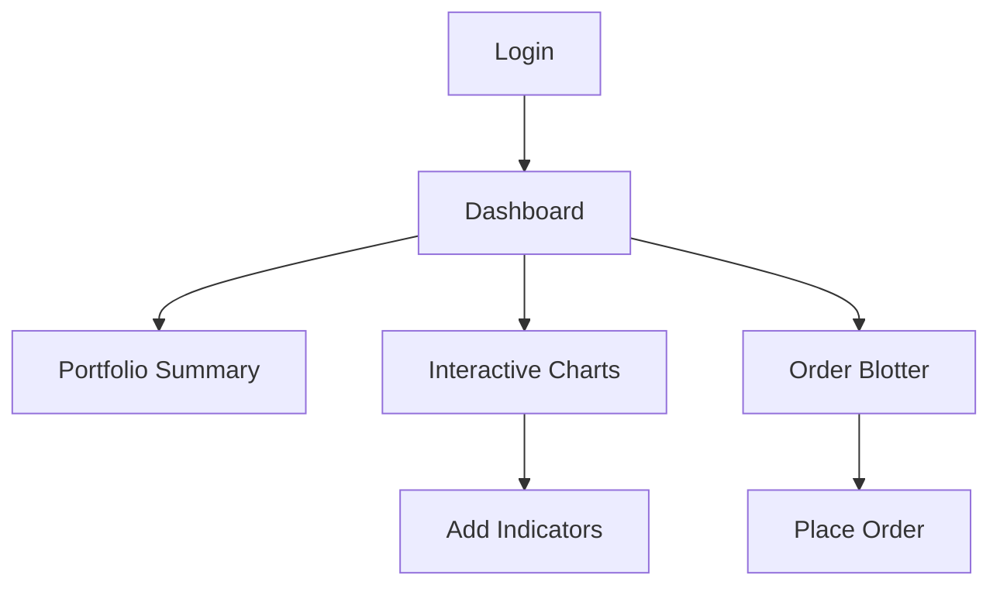
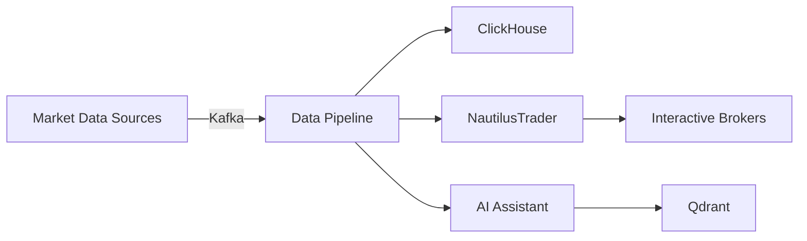

# Functional Specification Document (FSD): Algorithmic Trading System

## 1. Introduction

### 1.1 Purpose

This Functional Specification Document (FSD) provides an exhaustive description of the functional design and requirements for the Algorithmic Trading System (ATS). It serves as a technical blueprint for developers, testers, and stakeholders to implement and validate the system, ensuring alignment with the business goals outlined in the Business Requirements Document (BRD), the functional details in the Functional Requirements Document (FRD), and the product vision in the Product Requirements Document (PRD). The FSD bridges the gap between high-level requirements and technical implementation, detailing how the system will operate, its features, and its interactions with users and external systems.

### 1.2 Scope

The ATS is an enterprise-grade platform designed to enable users to develop, test, and execute trading strategies across multiple asset classes, including stocks, ETFs, futures, options, forex, and cryptocurrencies. This FSD covers the following functional areas:

- **Core Trading Engine**: Strategy execution, backtesting, and live trading capabilities.
- **Data Pipelines**: Real-time market data ingestion, processing, and storage.
- **Agentic AI Assistant**: Natural language interaction, strategy generation, and code debugging.
- **Prediction and Analytics**: Machine learning-based forecasting and backtesting tools.
- **User Interface**: Real-time dashboards, no-code strategy builder, and AI007 tools.
- **API and Orchestration**: RESTful APIs and low-latency streaming services.
- **Security and Compliance**: Zero-Trust architecture, encryption, and audit trails.

Non-functional aspects like performance and scalability are referenced where they impact functionality but are detailed in the PRD.

### 1.3 Definitions, Acronyms, and Abbreviations

- **ATS**: Algorithmic Trading System
- **BRD**: Business Requirements Document
- **FRD**: Functional Requirements Document
- **PRD**: Product Requirements Document
- **FSD**: Functional Specification Document
- **AI**: Artificial Intelligence
- **ML**: Machine Learning
- **API**: Application Programming Interface
- **UI**: User Interface
- **UX**: User Experience
- **RBAC**: Role-Based Access Control
- **SMA**: Simple Moving Average
- **RSI**: Relative Strength Index
- **VWAP**: Volume-Weighted Average Price
- **TWAP**: Time-Weighted Average Price
- **VaR**: Value at Risk
- **SEC**: Securities and Exchange Commission
- **FINRA**: Financial Industry Regulatory Authority
- **GDPR**: General Data Protection Regulation
- **CCPA**: California Consumer Privacy Act

### 1.4 References

- "Features, Phases & Integration Strategy - Algorithmic Trading System.docx"
- Business Requirements Document (BRD)
- Functional Requirements Document (FRD)
- Product Requirements Document (PRD)

---

## 2. System Overview

### 2.1 System Description

The ATS is a modular, scalable platform leveraging a "Best-of-Breed" integration strategy with leading open-source technologies. It supports two primary user personas:

- **Non-technical Traders**: Retail investors seeking intuitive, no-code tools.
- **Professional Traders/Analysts**: Experts requiring high-performance, customizable solutions.

Key components include:
- **Core Trading Engine**: Powered by NautilusTrader for strategy execution and order management.
- **Data Pipelines**: Apache Kafka-based real-time data streaming and processing.
- **Agentic AI Assistant**: LangChain and LangGraph-driven natural language and code generation.
- **Prediction and Analytics**: ML models and backtesting tools for strategy optimization.
- **User Interface**: Next.js frontend with dashboards and a no-code builder.
- **API and Orchestration**: FastAPI and gRPC for internal and external communication.
- **Security and Compliance**: Zero-Trust, RBAC, and immutable audit trails.

### 2.2 System Architecture

The ATS employs a microservices architecture with Apache Kafka as the central event bus. Below is a high-level diagram:

```mermaid
graph TD
    A[Next.js Frontend] -->|REST API| B[FastAPI Gateway]
    B -->|gRPC| C[Kafka Data Bus]
    C -->|Pub/Sub| D[NautilusTrader Engine]
    C -->|Pub/Sub| E[AI Assistant Service]
    C -->|Pub/Sub| F[Data Pipeline Service]
    F -->|Ingest| G[Market Data Sources (Yahoo Finance, Alpha Vantage, IB)]
    D -->|Execute Trades| H[Interactive Brokers]
    E -->|NLP & Code Gen| I[LangChain & OpenHands]
    B --> J[PostgreSQL]
    J -->|Store| K[User Data & Strategies]
    F --> L[ClickHouse]
    L -->|Analyze| M[Time-Series Data]
    E --> N[Qdrant]
    N -->|Vector Search| O[AI Embeddings]
    F --> P[Apache Iceberg]
    P -->|Audit Trails| Q[Compliance Logs]
```

This architecture ensures decoupling, scalability, and real-time capabilities.

---

## 3. Functional Requirements

### 3.1 Core Trading Engine

The Core Trading Engine manages trading strategies and broker interactions.

- **FR-CE-001**: Support trading across stocks, ETFs, futures, options, forex, and cryptocurrencies.
  - **Details**: Configurable asset selection via UI or API.
- **FR-CE-002**: Enable custom Python-based strategies with technical indicators (SMA, RSI).
  - **Details**: Supports manual coding or AI-generated scripts.
- **FR-CE-003**: Provide backtesting with metrics (profit/loss, Sharpe ratio).
  - **Details**: Customizable parameters (e.g., date range).
- **FR-CE-004**: Facilitate live trading with real-time data and broker connectivity.
  - **Details**: Supports Interactive Brokers with authentication.
- **FR-CE-005**: Handle order types (market, limit, VWAP, TWAP).
  - **Details**: Configurable via UI or strategy logic.
- **FR-CE-006**: Maintain a real-time portfolio view (positions, P/L).
  - **Details**: Updated via Kafka streams.
- **FR-CE-007**: Offer order management (place, modify, cancel).
  - **Details**: Accessible via UI and API.
- **FR-CE-008**: Support paper trading with simulated real-time data.
  - **Details**: Mirrors live trading conditions.

### 3.2 Data Pipelines

Manages market data ingestion and processing.

- **FR-DP-001**: Ingest real-time data from Yahoo Finance, Alpha Vantage, and Interactive Brokers.
  - **Details**: Kafka streams ensure low latency.
- **FR-DP-002**: Normalize data for consistency (timestamps, missing values).
  - **Details**: Pre-storage processing service.
- **FR-DP-003**: Store historical data in ClickHouse.
  - **Details**: Optimized for time-series queries.
- **FR-DP-004**: Implement fallback for data source outages.
  - **Details**: Automatic switching with priority rules.
- **FR-DP-005**: Use Kafka for scalable data streaming.
  - **Details**: Pub/sub model for downstream services.
- **FR-DP-006**: Log events and metrics for auditing.
  - **Details**: Stored in Apache Iceberg.

### 3.3 Agentic AI Assistant

Enhances user interaction via AI.

- **FR-AI-001**: Interpret natural language queries (e.g., "AAPL trend").
  - **Details**: LangChain processes and responds.
- **FR-AI-002**: Generate Python strategy code from descriptions.
  - **Details**: OpenHands ensures executable output.
- **FR-AI-003**: Debug and optimize existing code.
  - **Details**: Suggests fixes and improvements.
- **FR-AI-004**: Integrate RAG for document-based insights.
  - **Details**: Uses Qdrant for vector search.
- **FR-AI-005**: Support multi-turn conversations.
  - **Details**: Maintains context across queries.

### 3.4 Prediction and Analytics

Provides forecasting and evaluation tools.

- **FR-PA-001**: Include ML models (LSTM, ARIMA) for predictions.
  - **Details**: Trained on historical data.
- **FR-PA-002**: Offer backtesting with detailed metrics (VaR, beta).
  - **Details**: Visualized via equity curves.
- **FR-PA-003**: Provide portfolio optimization (PyPortfolioOpt).
  - **Details**: User-defined risk/return inputs.
- **FR-PA-004**: Detect anomalies (PyOD).
  - **Details**: Alerts for price spikes or errors.
- **FR-PA-005**: Generate exportable reports (PDF, CSV).
  - **Details**: Includes backtest and analytics data.

### 3.5 User Interface

Delivers intuitive frontend experiences.

- **FR-UI-001**: Provide a real-time dashboard.
  - **Details**: Portfolio, charts (react-financial-charts), and risk metrics.
- **FR-UI-002**: Support interactive charting (timeframes, indicators).
  - **Details**: Zoomable and pannable.
- **FR-UI-003**: Include a no-code strategy builder (Blockly).
  - **Details**: Drag-and-drop with visual workflows.
- **FR-UI-004**: Generate Python code from visual strategies.
  - **Details**: Editable by advanced users.
- **FR-UI-005**: Integrate an AI chat interface.
  - **Details**: Conversational panel in dashboard.
- **FR-UI-006**: Support authentication and RBAC.
  - **Details**: Secure, role-based access.

### 3.6 API and Orchestration

Manages system communication.

- **FR-AO-001**: Use FastAPI for RESTful endpoints.
  - **Details**: Exposes strategies, portfolio, etc.
- **FR-AO-002**: Implement gRPC for low-latency streaming.
  - **Details**: Internal service communication.
- **FR-AO-003**: Support OAuth2 with JWT.
  - **Details**: Secure API access.
- **FR-AO-004**: Provide Swagger-based API documentation.
  - **Details**: Auto-generated from code.

### 3.7 Security and Compliance

Ensures data protection and regulatory adherence.

- **FR-SC-001**: Enforce Zero-Trust architecture.
  - **Details**: Verification for all requests.
- **FR-SC-002**: Implement RBAC for permissions.
  - **Details**: Roles: Trader, Analyst, Admin.
- **FR-SC-003**: Encrypt data with AES-256.
  - **Details**: At rest and in transit.
- **FR-SC-004**: Maintain immutable audit trails (Iceberg).
  - **Details**: Logs all activities.
- **FR-SC-005**: Comply with SEC, FINRA, GDPR, CCPA.
  - **Details**: Regulatory reporting supported.

---

## 4. Use Cases

### 4.1 Non-technical User Creating a Strategy

- **Actor**: Sarah (Non-technical Trader)
- **Steps**:
  1. Logs in and accesses strategy builder.
  2. Selects "Moving Average Crossover" template.
  3. Configures parameters (10-day SMA, 50-day SMA, AAPL).
  4. Runs backtest and reviews metrics.
  5. Deploys strategy for live trading.

### 4.2 Professional Trader Executing a Trade

- **Actor**: Michael (Professional Trader)
- **Steps**:
  1. Views real-time dashboard.
  2. Submits market order via API.
  3. Receives confirmation within 100ms.
  4. Reviews post-trade analytics.

### 4.3 User Querying AI Assistant

- **Actor**: Any User
- **Steps**:
  1. Opens AI chat interface.
  2. Queries "AAPL trend?"
  3. Receives response with data summary.
  4. Follows up with "Should I buy?"

---

## 5. User Interface Requirements

### 5.1 Dashboard Flow



### 5.2 Strategy Builder

- Drag-and-drop blocks: Data Inputs, Indicators, Conditions, Actions.
- Generates Python code viewable/editable.

### 5.3 AI Chat

- Scrollable history with multi-turn context support.

---

## 6. Data Requirements

### 6.1 Data Flow



- **Market Data**: Price, volume, order book.
- **User Data**: Profiles, strategies, encrypted in PostgreSQL.
- **System Data**: Logs in Apache Iceberg.

---

## 7. Integration Requirements

- **NautilusTrader**: Subscribes to Kafka, publishes order events.
- **FastAPI**: REST endpoints (e.g., `/strategies`).
- **gRPC**: Low-latency internal streams.
- **External**: FIX protocol for brokers.

---

## 8. Testing and Quality Assurance

- **Unit Tests**: 80% coverage with pytest.
- **Integration Tests**: Service and external system interactions.
- **UAT**: Validates use cases with end-users.

---

## 9. Appendices

### 9.1 Glossary

- **Agentic AI**: Autonomous AI for decision-making.
- **RAG**: Retrieval-Augmented Generation.

### 9.2 References

- NautilusTrader Docs: [link]
- Kafka Docs: [link]