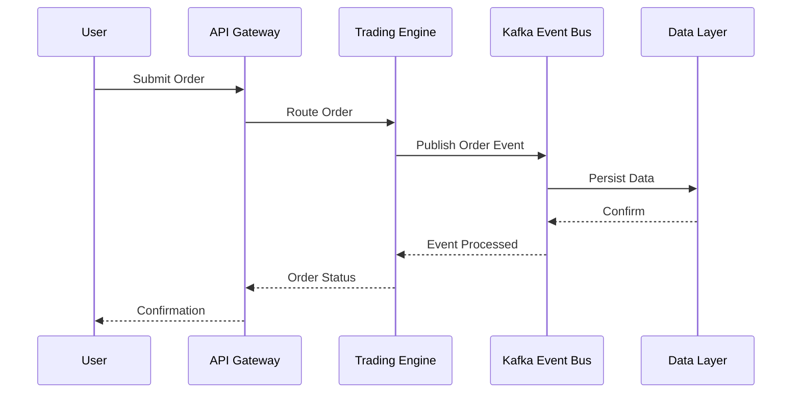
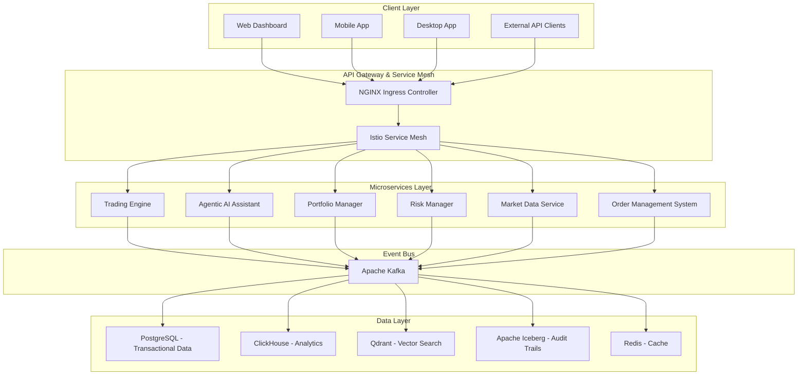

# Functional Specification Document (FSD)

## Nautilus Trader: Enterprise Algorithmic Trading System

| **Version:**      | 2.0                    |
|:----------------- |:---------------------- |
| **Date:**         | August 6, 2025         |
| **Status:**       | Draft                  |
| **Author:**       | Vincent Pereira        |
| **Owner:**        | Project Sponsor, Business Owner |

---

## 1.0 Introduction

### 1.1 Purpose of the Document

This Functional Specification Document (FSD) provides a detailed description of the functional requirements and behavior of the Nautilus Trader Algorithmic Trading System (ATS). It serves as a critical link between the business requirements outlined in the Business Requirements Document (BRD) and the technical details specified in the Technical Specification Document (TSD) and System Design Document (SDD). The purpose of this FSD is to ensure that all stakeholders—business owners, developers, testers, and end-users—have a shared understanding of the system's functionality, enabling effective development, testing, and deployment.

### 1.2 Scope

The scope of this FSD encompasses the functional aspects of the Nautilus Trader ATS, including but not limited to:

- Detailed functional requirements for each major system component.
- User interactions and workflows for different user types (e.g., retail investors and quantitative analysts).
- Expected system behavior under normal and error conditions.
- Integration with external systems (e.g., brokers, data providers) and internal services.
- Security, compliance, performance, and usability requirements to ensure a robust and user-friendly system.

This document does not cover non-functional requirements such as hardware specifications or detailed technical implementation, which are addressed in separate documents.

### 1.3 Definitions, Acronyms, and Abbreviations

| Term                | Definition                                                                 |
|---------------------|---------------------------------------------------------------------------|
| **ATS**             | Algorithmic Trading System                                               |
| **OMS**             | Order Management System                                                  |
| **FIX**             | Financial Information eXchange protocol                                  |
| **RAG**             | Retrieval-Augmented Generation (AI technique)                            |
| **RBAC**            | Role-Based Access Control                                                |
| **VaR**             | Value at Risk (risk measurement metric)                                  |
| **API**             | Application Programming Interface                                        |
| **JWT**             | JSON Web Token (security token standard)                                 |

---

## 2.0 System Overview

The Nautilus Trader ATS is an enterprise-grade algorithmic trading platform designed to serve both retail and institutional traders. It adopts a "Best-of-Breed" integration strategy, leveraging leading open-source technologies to deliver a modular, scalable, and high-performance trading solution. Built on a microservices architecture, the system uses an event-driven design with Apache Kafka as the backbone for inter-service communication.

### Key Components

- **Trading Engine**: Core component responsible for executing trading strategies and managing orders.
- **Agentic AI Assistant**: Natural language interface for trading, research, and analysis, powered by advanced AI models.
- **Portfolio Manager**: Manages portfolio allocations, performance tracking, and rebalancing.
- **Risk Manager**: Monitors and mitigates trading risks in real-time.
- **Market Data Service**: Collects, processes, and distributes real-time and historical market data.
- **Order Management System (OMS)**: Oversees the lifecycle of orders from placement to execution.

The system is designed to support a wide range of asset classes and integrate seamlessly with multiple brokers and data providers, making it a versatile tool for algorithmic trading.

---

## 3.0 Functional Requirements

### 3.1 Trading Engine

- **FR-01**: The Trading Engine SHALL support trading across multiple asset classes, including stocks, ETFs, futures, options, forex, and cryptocurrencies.
- **FR-02**: The Trading Engine SHALL execute trading strategies based on user-defined parameters or AI-generated strategies provided by the Agentic AI Assistant.
- **FR-03**: The Trading Engine SHALL manage order operations, including placement, modification, and cancellation, with support for real-time updates.
- **FR-04**: The Trading Engine SHALL provide real-time updates on positions, account balances, and profit/loss metrics.
- **FR-05**: The Trading Engine SHALL integrate with multiple brokers (e.g., Interactive Brokers, Alpaca) via a unified API abstraction layer.

### 3.2 Agentic AI Assistant

- **FR-06**: The Agentic AI Assistant SHALL interpret natural language commands for tasks such as placing trades, conducting research, and managing portfolios.
- **FR-07**: The Agentic AI Assistant SHALL generate trading strategies based on user inputs (e.g., risk tolerance) and current market conditions.
- **FR-08**: The Agentic AI Assistant SHALL deliver real-time market insights and customizable alerts based on user preferences.
- **FR-09**: The Agentic AI Assistant SHALL collaborate with specialized AI agents (e.g., market analysis, risk evaluation) to enhance decision-making.

### 3.3 Portfolio Manager

- **FR-10**: The Portfolio Manager SHALL optimize portfolio allocations based on user-defined risk tolerance, investment goals, and market conditions.
- **FR-11**: The Portfolio Manager SHALL perform automated asset allocation and periodic rebalancing.
- **FR-12**: The Portfolio Manager SHALL generate performance attribution reports, detailing returns by asset and strategy.
- **FR-13**: The Portfolio Manager SHALL integrate with the Risk Manager to provide real-time risk assessments and adjustments.

### 3.4 Risk Manager

- **FR-14**: The Risk Manager SHALL monitor trading risks in real-time, including market, credit, and operational risks.
- **FR-15**: The Risk Manager SHALL calculate risk metrics such as Value at Risk (VaR), expected shortfall, and volatility.
- **FR-16**: The Risk Manager SHALL enforce user-defined exposure limits and position limits to prevent over-leveraging.
- **FR-17**: The Risk Manager SHALL perform stress testing and scenario analysis to evaluate portfolio resilience.

### 3.5 Market Data Service

- **FR-18**: The Market Data Service SHALL collect real-time market data from multiple sources (e.g., Bloomberg, Polygon.io).
- **FR-19**: The Market Data Service SHALL process and normalize market data to ensure consistency across feeds.
- **FR-20**: The Market Data Service SHALL distribute processed market data to other system components via Apache Kafka.
- **FR-21**: The Market Data Service SHALL store historical market data in a time-series database for backtesting and analysis.

### 3.6 Order Management System (OMS)

- **FR-22**: The OMS SHALL manage the full lifecycle of orders, including validation, routing, execution, and confirmation.
- **FR-23**: The OMS SHALL support multiple order types, including market, limit, stop, and algorithmic orders (e.g., TWAP, VWAP).
- **FR-24**: The OMS SHALL perform pre-trade compliance checks, such as margin requirements and regulatory restrictions.
- **FR-25**: The OMS SHALL integrate with the Trading Engine to ensure seamless order execution and status updates.

---

## 4.0 User Interactions and Workflows

### 4.1 Retail Investor Workflow

1. **Login**: User authenticates using OAuth2/OIDC credentials.
2. **Dashboard**: User views a real-time summary of portfolio performance, open positions, and market data.
3. **Strategy Builder**: User creates a trading strategy using a no-code interface (e.g., Blockly).
4. **Backtesting**: User tests the strategy against historical data to evaluate performance.
5. **Deployment**: User deploys the strategy to live trading with a single click.
6. **Monitoring**: User monitors strategy performance and receives real-time alerts via the dashboard or notifications.

### 4.2 Quantitative Analyst Workflow

1. **Login**: User authenticates using OAuth2/OIDC credentials.
2. **Code Editor**: User writes and debugs Python-based trading strategies in an integrated development environment.
3. **Data Analysis**: User accesses historical and real-time market data for analysis and model development.
4. **Model Integration**: User integrates custom machine learning models into trading strategies.
5. **Execution**: User deploys strategies to the Trading Engine for live execution.
6. **Risk Management**: User monitors risk metrics and adjusts strategies as needed via the Risk Manager.

---

## 5.0 System Behavior

### 5.1 Normal Conditions

- The system SHALL process orders with sub-millisecond latency under normal market conditions.
- Market data updates SHALL be delivered with latency below 100 microseconds.
- The Agentic AI Assistant SHALL respond to user queries within 2 seconds.

### 5.2 Error Conditions

- **Network Failure**: The system SHALL retry connections up to 5 times and log errors for review.
- **Data Inconsistency**: The system SHALL use event sourcing to rebuild state from Kafka logs.
- **Security Breach**: The system SHALL trigger immediate alerts and initiate lockdown procedures, restricting access until resolved.

---

## 6.0 Integration Points

### 6.1 External Systems

- **Brokers**: Interactive Brokers, Alpaca, OANDA, Coinbase, and FIX-compliant brokers.
- **Data Providers**: Bloomberg, Refinitiv, Polygon.io, Alpha Vantage.
- **Notification Services**: Slack, Email, SMS, Webhooks for real-time alerts.

### 6.2 Internal Services

- All microservices SHALL communicate asynchronously via Apache Kafka.
- High-performance synchronous calls SHALL use gRPC between services.

---

## 7.0 Security and Compliance

### 7.1 Security

- **Authentication**: OAuth2/OIDC with JWT tokens for secure user access.
- **Authorization**: Role-Based Access Control (RBAC) enforced at the API gateway and individual service levels.
- **Encryption**: Data at rest encrypted with AES-256; data in transit secured with TLS 1.3.

### 7.2 Compliance

- **Audit Trails**: Immutable logs stored in Apache Iceberg for traceability.
- **Regulatory Reporting**: Automated generation of reports compliant with MiFID II, GDPR, and other regulations.

---

## 8.0 Performance Requirements

- **Latency**: Trading Engine <1ms, API Gateway <10ms, Market Data Service <100µs.
- **Throughput**: System SHALL handle 1 million messages/second on the Kafka event bus.
- **Scalability**: System SHALL support up to 10,000 concurrent users with horizontal scaling.

---

## 9.0 Usability Requirements

- **Intuitiveness**: Basic operations SHALL require no tutorial for users with trading experience.
- **Consistency**: Uniform design and navigation across web, mobile, and desktop interfaces.
- **Feedback**: System SHALL provide immediate visual or auditory feedback for all user actions.

---

## 10.0 Appendices

### 10.1 Data Flow Diagram

### 10.2 Architecture Diagram

---

This FSD provides a thorough and detailed specification of the Nautilus Trader ATS, covering all functional requirements and supporting diagrams to aid in development and testing.