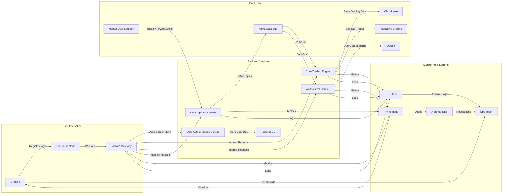
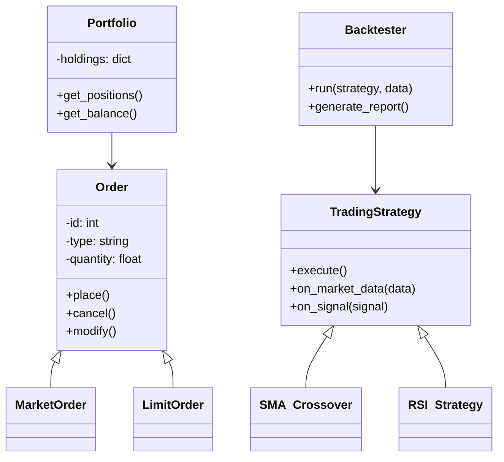
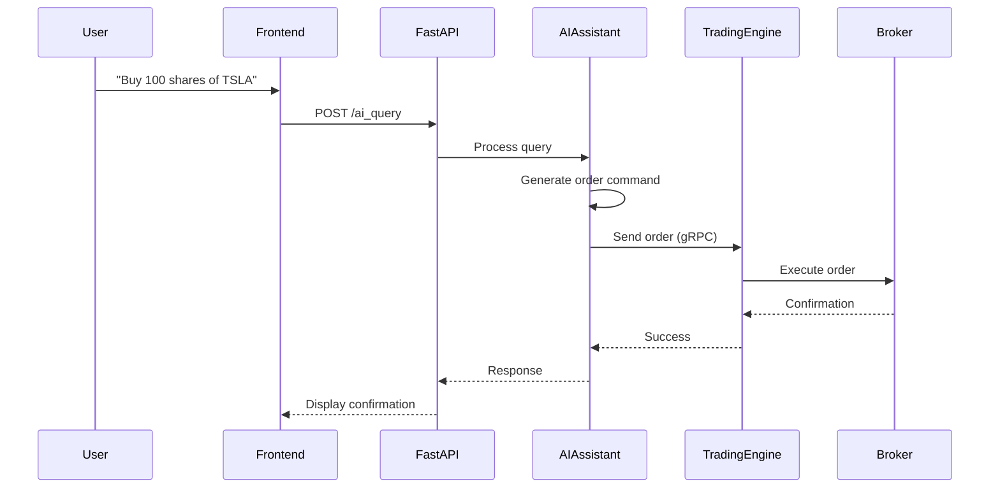

# Technical Specification Document (TSD): Algorithmic Trading System

## 1. Introduction

### 1.1 Purpose

This Technical Specification Document (TSD) outlines the technical details required to design, develop, test, deploy, and maintain the Algorithmic Trading System (ATS). The ATS is a sophisticated platform designed to automate trading strategies, provide real-time market analytics, and integrate AI-driven insights for retail and institutional traders. This document serves as a blueprint for developers, architects, and technical stakeholders, ensuring alignment with business and functional requirements.

### 1.2 Scope

The TSD covers the following aspects of the ATS:

- System architecture based on microservices and event-driven design.
- Technical design, including data flows, class structures, sequence interactions, and database schemas.
- Implementation details, such as programming languages, frameworks, and development tools.
- Testing strategies to ensure quality and performance.
- Deployment processes for cloud-native environments.
- Maintenance and support mechanisms for reliability and compliance.

This document focuses on technical implementation and does not address user training or detailed UI/UX specifications, which are covered in the FSD and PRD.

### 1.3 Definitions, Acronyms, and Abbreviations

- **ATS**: Algorithmic Trading System
- **BRD**: Business Requirements Document
- **FRD**: Functional Requirements Document
- **PRD**: Product Requirements Document
- **FSD**: Functional Specification Document
- **API**: Application Programming Interface
- **UI**: User Interface
- **UX**: User Experience
- **RBAC**: Role-Based Access Control
- **AI**: Artificial Intelligence
- **ML**: Machine Learning
- **NLP**: Natural Language Processing
- **RAG**: Retrieval-Augmented Generation
- **SMA**: Simple Moving Average
- **RSI**: Relative Strength Index
- **VWAP**: Volume-Weighted Average Price
- **VaR**: Value at Risk

### 1.4 References

- "Features, Phases & Integration Strategy - Algorithmic Trading System.docx"
- Business Requirements Document (BRD)
- Functional Requirements Document (FRD)
- Product Requirements Document (PRD)
- Functional Specification Document (FSD)
- NautilusTrader Documentation
- Apache Kafka Documentation

---

## 2. System Architecture

### 2.1 Overview

The ATS employs a microservices architecture to ensure scalability, modularity, and fault tolerance. Apache Kafka serves as the central event bus, facilitating real-time data streaming and decoupling of services. The system integrates a trading engine, AI assistant, data pipelines, and a user interface, all orchestrated in a cloud-native environment. Key enhancements include robust user authentication and management, seamless frontend-backend integration for predictive analytics, and comprehensive production-ready monitoring and alerting systems.

### 2.2 Architecture Diagram

The following Mermaid diagram depicts the high-level architecture:

```mermaid
graph TD
    A[Next.js Frontend] -->|User Auth & API Calls| B[FastAPI Gateway]
    B -->|gRPC| C[Kafka Data Bus]
    C -->|Pub/Sub| D[NautilusTrader Engine]
    C -->|Pub/Sub| E[AI Assistant Service]
    C -->|Pub/Sub| F[Data Pipeline Service]
    F -->|Ingest| G[Market Data Sources<br/>(Yahoo Finance, Alpha Vantage, IB)]
    D -->|Execute Trades| H[Interactive Brokers]
    E -->|NLP & Code Gen| I[LangChain & OpenHands]
    J[PostgreSQL] -->|Store| K[User Data & Strategies]
    L[ClickHouse] -->|Analyze| M[Time-Series Data]
    N[Qdrant] -->|Vector Search| O[AI Embeddings]
    P[Apache Iceberg] -->|Audit Trails| Q[Compliance Logs]
    B -->|Auth & User Mgmt| R[User Authentication Service]
    R -->|Store| J
    S[Prometheus] -->|Scrape Metrics| B
    S -->|Scrape Metrics| D
    S -->|Scrape Metrics| E
    S -->|Scrape Metrics| F
    S -->|Alerts| T[Alertmanager]
    T -->|Notifications| U[Ops Team]
    S -->|Visualize| V[Grafana]
    V -->|Dashboards| U
```

### 2.3 Components and Modules

- **Next.js Frontend**: A React-based UI for dashboards, strategy creation, and AI interaction.
- **FastAPI Gateway**: A high-performance API layer bridging frontend and backend services, handling API routing and authentication.
- **User Authentication Service**: Manages user registration, login, and profile management, integrating with PostgreSQL for user data storage.
- **Kafka Data Bus**: Manages real-time data streaming between services, ensuring decoupled and scalable communication.
- **NautilusTrader Engine**: Executes trading strategies, backtesting, and live trading operations.
- **AI Assistant Service**: Provides NLP-based query handling and code generation capabilities.
- **Data Pipeline Service**: Ingests and processes market data from external sources, feeding into the Kafka Data Bus.
- **Databases**:
  - **PostgreSQL with pgvector**: Stores user profiles, strategies, and vector embeddings, serving as the primary relational database.
  - **ClickHouse**: Handles high-volume time-series data for analytics and historical market data.
  - **Qdrant**: Enables efficient vector search for AI-driven insights and RAG (Retrieval-Augmented Generation) functionalities.
  - **Apache Iceberg**: Maintains immutable logs for auditing and compliance, ensuring data integrity and traceability.
- **Monitoring and Alerting Systems**:
  - **Prometheus**: Collects metrics from all services for real-time performance monitoring.
  - **Grafana**: Provides customizable dashboards for visualizing system metrics and operational insights.
  - **Alertmanager**: Manages and routes alerts generated by Prometheus to relevant teams or notification channels.

---

## 3. Technical Design

### 3.1 Data Flow

The data flow diagram illustrates how data moves through the ATS:



### 3.2 Class Diagrams

A simplified class diagram for the **NautilusTrader Engine**:



### 3.3 Sequence Diagrams

The sequence diagram below shows a user executing a trade via the AI assistant:



### 3.4 Database Schema

Example schema for key tables in **PostgreSQL**:

#### Users Table
```sql
CREATE TABLE users (
    id SERIAL PRIMARY KEY,
    username VARCHAR(50) UNIQUE NOT NULL,
    email VARCHAR(100) UNIQUE NOT NULL,
    password_hash VARCHAR(255) NOT NULL, -- Stores bcrypt hashed passwords
    role VARCHAR(20) DEFAULT 'user',
    created_at TIMESTAMP DEFAULT CURRENT_TIMESTAMP
);
```

#### Strategies Table
```sql
CREATE TABLE strategies (
    id SERIAL PRIMARY KEY,
    user_id INT REFERENCES users(id),
    name VARCHAR(100) NOT NULL,
    code TEXT NOT NULL,
    parameters JSONB,
    created_at TIMESTAMP DEFAULT CURRENT_TIMESTAMP
);
```

#### Time-Series Data in ClickHouse
```sql
CREATE TABLE market_data (
    symbol String,
    timestamp DateTime,
    open Float32,
    high Float32,
    low Float32,
    close Float32,
    volume UInt32
) ENGINE = MergeTree()
ORDER BY (symbol, timestamp);
```

---

## 4. Implementation Details

### 4.1 Programming Languages

- **Backend**: Python 3.9+ for its ecosystem and performance.
- **Frontend**: JavaScript/TypeScript with ES6+ for modern web development.
- **AI/ML**: Python with libraries like PyTorch or TensorFlow.

### 4.2 Frameworks and Libraries

- **Backend**:
  - FastAPI: High-performance RESTful APIs.
  - gRPC: Efficient service-to-service communication.
  - NautilusTrader: Core trading engine.
  - LangChain & OpenHands: AI assistant functionality.
- **Frontend**:
  - Next.js: Server-side rendering and static site generation.
  - react-financial-charts: Real-time charting.
- **Data**:
  - Apache Kafka: Event streaming.
  - PostgreSQL with pgvector: Relational data and embeddings.
  - ClickHouse: Time-series analytics.
  - Qdrant: Vector search for RAG.
  - Apache Iceberg: Compliance and audit trails.

### 4.3 Development Environment

- **Containerization**: Docker for consistent environments.
- **Orchestration**: Kubernetes for scalability and resilience.
- **Version Control**: Git with GitHub for collaboration.
- **CI/CD**: GitHub Actions for automated builds and deployments.

### 4.4 Coding Standards

- **Python**: PEP8, type hints, and comprehensive docstrings.
- **JavaScript/TypeScript**: ESLint, Prettier, and JSDoc for consistency.
- **Commit Messages**: Follow Conventional Commits for traceability.

---

## 5. Testing and Quality Assurance

### 5.1 Unit Testing

- **Python**: pytest with 80%+ code coverage.
- **JavaScript**: Jest for frontend components and logic.

### 5.2 Integration Testing

- Test service interactions (e.g., FastAPI to Kafka, NautilusTrader to Broker).
- Use Postman or custom scripts for API validation.

### 5.3 System Testing

- End-to-end tests for critical workflows (e.g., strategy execution, AI queries).
- Selenium or Cypress for UI testing.

### 5.4 Performance Testing

- Simulate 1000+ concurrent users and high-frequency data ingestion.
- Measure latency and throughput under load.

---

## 6. Deployment

### 6.1 Deployment Architecture

- **Cloud Provider**: AWS (EKS), GCP (GKE), or Azure (AKS).
- **Container Orchestration**: Kubernetes with auto-scaling.
- **Load Balancing**: NGINX ingress controller.

### 6.2 Installation Instructions

1. Clone repository: `git clone <repo-url>`
2. Build Docker images: `docker build -t ats-service .`
3. Deploy with Helm: `helm install ats ./helm-charts`
4. Verify pods: `kubectl get pods`

### 6.3 Configuration Management

- Use `.env` files for environment variables (e.g., API keys, database URLs).
- Kubernetes ConfigMaps and Secrets for runtime configuration.

---

## 7. Maintenance and Support

### 7.1 Error Handling

- Implement try-catch blocks with user-friendly error messages.
- Retry logic for transient failures (e.g., network timeouts).

### 7.2 Logging

- Centralized logging with ELK stack (Elasticsearch, Logstash, Kibana).
- Log levels: DEBUG, INFO, WARN, ERROR.

### 7.3 Monitoring

The ATS incorporates a robust monitoring and alerting system to ensure high availability, performance, and early detection of issues.

- **Prometheus**: Used for collecting time-series metrics from all services (FastAPI Gateway, NautilusTrader Engine, AI Assistant, Data Pipeline). Custom exporters are implemented where necessary to expose application-specific metrics.
- **Grafana**: Provides rich, customizable dashboards for visualizing the metrics collected by Prometheus. This allows for real-time operational insights into system health, resource utilization, API performance, and trading engine activity.
- **Alertmanager**: Integrates with Prometheus to handle alerts. It deduplicates, groups, and routes alerts to appropriate notification channels (e.g., Slack, email, PagerDuty) based on predefined rules, minimizing alert fatigue and ensuring critical issues are addressed promptly.

### 7.4 Backup and Recovery

- Daily snapshots of PostgreSQL and ClickHouse.
- Kafka topic replication with a retention period of 7 days.

---

## 8. Appendices

### 8.1 Glossary

- **Microservices**: Independent, loosely coupled services.
- **Event-Driven**: System design based on event production and consumption.

### 8.2 References

- NautilusTrader Docs: [https://nautilustrader.io/](https://nautilustrader.io/)
- Kafka Docs: [https://kafka.apache.org/](https://kafka.apache.org/)

### 8.3 Change History

- **v1.0**: Initial draft (2023-10-01).
- **v1.1**: Added detailed deployment steps (2023-10-05).