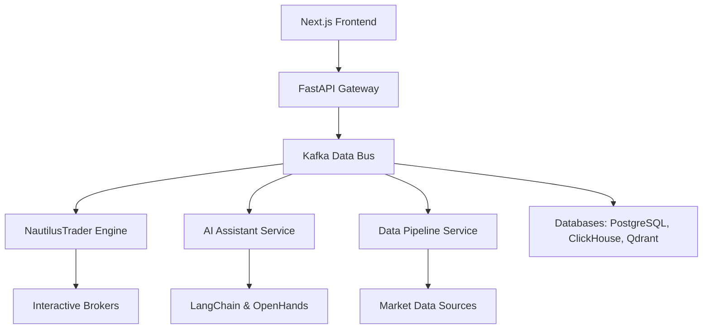
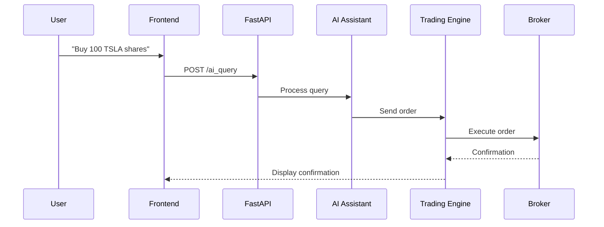

# Software Requirements Specification (SRS): Algorithmic Trading System

## 1. Introduction

### 1.1 Purpose
This Software Requirements Specification (SRS) outlines the functional and non-functional requirements for the Algorithmic Trading System (ATS), a sophisticated platform designed to automate trading strategies, deliver real-time analytics, and leverage AI-driven assistance. The ATS targets both retail and institutional traders, providing tools for strategy development, execution, and portfolio management. This document serves as a detailed guide for developers to implement the system, testers to verify its functionality, and stakeholders to align on project goals.

### 1.2 Scope
The ATS is a cloud-native, microservices-based system that integrates the following components:
- **Trading Engine**: Automates strategy execution and backtesting across multiple asset classes (stocks, ETFs, futures, options, forex, cryptocurrencies).
- **Data Pipelines**: Processes real-time and historical market data with low-latency streaming.
- **AI Assistant**: Offers natural language query processing, code generation, and market insights.
- **Analytics**: Provides ML-based predictions, portfolio optimization, and anomaly detection.
- **User Interface**: Includes real-time dashboards, a no-code strategy builder, and an AI chat interface.
- **APIs**: Exposes RESTful and gRPC endpoints for internal and external integration.
- **Security**: Implements Zero-Trust architecture, encryption, and regulatory compliance.

The system supports both non-technical users (via no-code tools) and professionals (via advanced APIs and customization), ensuring accessibility and performance.

### 1.3 Definitions, Acronyms, and Abbreviations
- **ATS**: Algorithmic Trading System
- **BRD**: Business Requirements Document
- **FRD**: Functional Requirements Document
- **PRD**: Product Requirements Document
- **FSD**: Functional Specification Document
- **TSD**: Technical Specification Document
- **SDD**: System Design Document
- **API**: Application Programming Interface
- **UI**: User Interface
- **RBAC**: Role-Based Access Control
- **AI**: Artificial Intelligence
- **ML**: Machine Learning
- **NLP**: Natural Language Processing
- **RAG**: Retrieval-Augmented Generation
- **SMA**: Simple Moving Average
- **RSI**: Relative Strength Index
- **VWAP**: Volume-Weighted Average Price
- **VaR**: Value at Risk
- **SEC**: Securities and Exchange Commission
- **FINRA**: Financial Industry Regulatory Authority
- **GDPR**: General Data Protection Regulation
- **CCPA**: California Consumer Privacy Act

### 1.4 References
- "Features, Phases & Integration Strategy - Algorithmic Trading System.docx"
- Business Requirements Document (BRD)
- Functional Requirements Document (FRD)
- Product Requirements Document (PRD)
- Functional Specification Document (FSD)
- Technical Specification Document (TSD)
- System Design Document (SDD)
- NautilusTrader Documentation: [https://nautilustrader.io/](https://nautilustrader.io/)
- Apache Kafka Documentation: [https://kafka.apache.org/](https://kafka.apache.org/)

---

## 2. Overall Description

### 2.1 Product Perspective
The ATS operates within a microservices architecture, utilizing Apache Kafka for event-driven data streaming and NautilusTrader as its core trading engine. It integrates AI capabilities (via LangChain and LangGraph) and advanced analytics to provide a robust trading ecosystem. The system connects to external brokers (e.g., Interactive Brokers) and data providers (e.g., Yahoo Finance) to enable real-time trading and analysis.

### 2.2 Product Functions
Key functionalities include:
- **Strategy Development**: Users can create and backtest strategies using a no-code builder or Python code.
- **Trade Execution**: Executes live trades with sub-100ms latency across multiple asset classes.
- **AI Assistance**: Provides natural language interaction for strategy creation and market queries.
- **Analytics**: Delivers ML-driven forecasts, portfolio optimization, and real-time metrics.
- **Interfaces**: Offers dashboards, a strategy builder, and APIs for user and system interaction.
- **Security**: Ensures data protection and regulatory compliance through advanced measures.

### 2.3 User Classes and Characteristics
- **Non-technical Traders**: Require intuitive tools (e.g., no-code builder) and basic market knowledge.
- **Professional Traders**: Need high-performance execution, customization, and programmatic access.
- **Administrators**: Manage user roles, system settings, and compliance logs.

### 2.4 Operating Environment
- **Deployment**: Cloud-native on AWS/GCP/Azure, using Docker containers and Kubernetes orchestration.
- **External Integrations**: Connects to brokers via FIX protocol and data providers via REST APIs.

### 2.5 Design and Implementation Constraints
- **Tech Stack**: Must utilize NautilusTrader, Kafka, FastAPI, and open-source AI tools.
- **Compliance**: Must meet SEC, FINRA, GDPR, and CCPA requirements.
- **Performance**: Must achieve sub-100ms latency for critical operations.

### 2.6 Assumptions and Dependencies
- **Assumptions**: Reliable data feeds, user familiarity with trading basics, and team expertise in specified technologies.
- **Dependencies**: External APIs (brokers, data providers) and cloud infrastructure availability.

---

## 3. System Architecture

The ATS follows a microservices architecture, as depicted below:



---

## 4. Functional Requirements

### 4.1 Core Trading Engine
- **FR-CE-001**: Shall support trading of stocks, ETFs, futures, options, forex, and cryptocurrencies.
- **FR-CE-002**: Shall enable custom strategy creation in Python with technical indicators (e.g., SMA, RSI).
- **FR-CE-003**: Shall provide backtesting with metrics (e.g., Sharpe ratio, maximum drawdown).
- **FR-CE-004**: Shall execute live trades via brokers with real-time data integration.

### 4.2 Data Pipelines
- **FR-DP-001**: Shall ingest data from Yahoo Finance, Alpha Vantage, and Interactive Brokers.
- **FR-DP-002**: Shall process and normalize data for consistency.
- **FR-DP-003**: Shall store historical data in ClickHouse for efficient retrieval.

### 4.3 AI Assistant
- **FR-AI-001**: Shall process natural language queries for market insights and strategy creation.
- **FR-AI-002**: Shall generate Python code for trading strategies using OpenHands.
- **FR-AI-003**: Shall support multi-turn conversations with context retention.

### 4.4 Analytics
- **FR-AN-001**: Shall provide ML-based price forecasting (e.g., LSTM models).
- **FR-AN-002**: Shall offer portfolio optimization using PyPortfolioOpt.

### 4.5 User Interface
- **FR-UI-001**: Shall include a dashboard with real-time portfolio and chart views.
- **FR-UI-002**: Shall provide a no-code strategy builder with Blockly integration.

### 4.6 APIs
- **FR-API-001**: Shall expose RESTful endpoints via FastAPI for all major functions.
- **FR-API-002**: Shall use gRPC for internal service communication.

---

## 5. Non-Functional Requirements

### 5.1 Performance
- **NFR-PERF-001**: Trade execution latency shall be under 100ms.
- **NFR-PERF-002**: Shall support 1000 concurrent users.

### 5.2 Security
- **NFR-SEC-001**: Shall implement Zero-Trust and AES-256 encryption.
- **NFR-SEC-002**: Shall maintain immutable audit trails.

### 5.3 Scalability
- **NFR-SCALE-001**: Shall scale horizontally with Kubernetes.

---

## 6. Use Cases

### 6.1 Trade Execution via AI Assistant


---

## 7. Database Schema

### 7.1 Users Table
```sql
CREATE TABLE users (
    id SERIAL PRIMARY KEY,
    username VARCHAR(50) UNIQUE NOT NULL,
    email VARCHAR(100) UNIQUE NOT NULL,
    password_hash VARCHAR(255) NOT NULL,
    role VARCHAR(20) DEFAULT 'user',
    created_at TIMESTAMP DEFAULT CURRENT_TIMESTAMP
);
```

---

## 8. Testing Strategy
- **Unit Tests**: Use pytest for 80% code coverage.
- **Integration Tests**: Verify service interactions.
- **Performance Tests**: Simulate 10,000 messages/second.

---