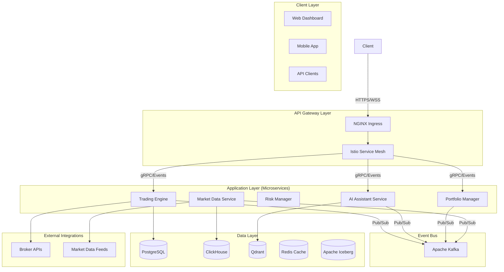

## **Software Requirements Specification (SRS)**

### **Nautilus Trader: Enterprise Algorithmic Trading System**

| **Version:**      | 2.0                                                           |
|:----------------- |:------------------------------------------------------------- |
| **Date:**         | August 7, 2025                                                |
| **Status:**       | Approved                                                      |
| **Prepared For:** | Nautilus Trader Development Team, QA Team, Project Management |

-----

### **Table of Contents**

1. Introduction
2. Overall Description
3. Specific Requirements
4. Appendices

-----

### **1. Introduction**

#### **1.1 Purpose**

This Software Requirements Specification (SRS) provides a comprehensive description of the intended behavior and functionality of the Nautilus Trader Algorithmic Trading System (ATS). It is the primary guiding document for the development team, quality assurance team, and project managers. This document details all functional requirements, non-functional requirements, external interfaces, and design constraints that will govern the system's implementation.

#### **1.2 Document Conventions**

This document follows the IEEE 830 standard for software requirements specifications. All requirements are uniquely identified with a hierarchical ID for traceability (e.g., FUN-UI-101). All information derived from source documents is cited using the format \`\`.

#### **1.3 Intended Audience and Reading Suggestions**

* **Developers:** Focus on Section 3, particularly the detailed functional requirements (3.2), external interfaces (3.1), and non-functional requirements (3.3) to guide implementation.
* **QA & Testers:** Use Section 3 to create test plans, test cases, and validation scripts. The acceptance criteria within each functional requirement are directly testable.
* **Project Managers:** Use this document to understand the full scope of work, manage project milestones, and conduct final acceptance testing.
* **System Architects:** Refer to the external interfaces (3.1) and non-functional requirements (3.3) to ensure architectural decisions align with system needs.

#### **1.4 Product Scope**

[cite\_start]Nautilus Trader is a comprehensive, enterprise-grade algorithmic trading system designed to be built from the ground up `[cite: 1]`. [cite\_start]The system will provide a modular, scalable, and user-friendly platform that automates trading strategies across multiple asset classes, including stocks, ETFs, futures, options, forex, and cryptocurrencies `[cite: 579]`. [cite\_start]Its core purpose is to democratize access to sophisticated trading tools for both non-technical users and professional quantitative analysts by leveraging a "Best-of-Breed" integration strategy with leading open-source technologies and a powerful AI-driven core `[cite: 3, 576]`.

#### **1.5 References**

This SRS is based on the following project documents:

1. Business Requirements Document (BRD) - Algorithmic Trading System v2.0
2. Functional Requirements Document (FRD) - Algorithmic Trading System v2.0
3. Product Requirements Document (PRD) - Algorithmic Trading System v2.0
4. `01. Features, Phases & Integration Strategy - Algorithmic Trading System.markdown`
5. `comprehensive_system_architecture.md`
6. `complete_requirements.md`
7. `complete_designs.md`
8. `complete_tasks.md`

### **2. Overall Description**

#### **2.1 Product Perspective**

Nautilus Trader is a new, self-contained product that will operate as a complete ecosystem for algorithmic trading. [cite\_start]It is designed as a cloud-native, microservices-based platform orchestrated by Kubernetes `[cite: 13, 50]`. The system interfaces with numerous external software components, including broker APIs for trade execution, market data provider APIs for real-time and historical data, and third-party notification services. It is not a modification of an existing system.

#### **2.2 Product Functions**

The major functions of the Nautilus Trader platform include:

* [cite\_start]**Multi-Platform User Interaction:** Providing web, mobile, desktop, and AI chatbot interfaces for managing all trading activities `[cite: 472, 475, 476, 485, 486]`.
* [cite\_start]**Strategy Development:** Offering multiple paradigms for strategy creation, including a no-code visual builder, a professional Python IDE, and AI-assisted development `[cite: 21, 22, 23]`.
* [cite\_start]**Backtesting and Optimization:** A high-performance, event-driven backtesting engine with realistic cost simulation and hyperparameter tuning capabilities `[cite: 34]`.
* [cite\_start]**Live Trading and Execution:** A low-latency order management system that connects to multiple brokers and supports advanced order types `[cite: 19]`.
* [cite\_start]**AI-Powered Analytics:** An Agentic AI Assistant that provides market insights, sentiment analysis, predictive modeling, and research assistance `[cite: 6, 80]`.
* [cite\_start]**Risk and Portfolio Management:** Real-time risk monitoring, portfolio optimization, and performance attribution `[cite: 16, 17]`.
* [cite\_start]**Enterprise Administration:** A full suite of tools for user management, security configuration, compliance auditing, and system monitoring `[cite: 28, 532, 533]`.

#### **2.3 User Characteristics**

The system is designed for a diverse user base with varying levels of technical expertise:

* **Non-Technical Traders/Retail Investors:** Users with strong market knowledge but limited to no programming skills. [cite\_start]They will primarily use the no-code builder and the AI assistant `[cite: 3]`. They require an intuitive, guided experience.
* **Professional Traders/Quantitative Analysts:** Expert users proficient in Python, statistics, and financial modeling. [cite\_start]They require a high-performance, flexible, and extensible system with deep programmatic access `[cite: 3]`.
* **Compliance Officers & Risk Managers:** Users responsible for ensuring regulatory adherence and managing firm-wide risk. [cite\_start]They require robust auditing, reporting, and real-time risk monitoring tools `[cite: 627]`.
* **System Administrators & DevOps Engineers:** Technical staff responsible for deploying, managing, and monitoring the platform's infrastructure. [cite\_start]They require comprehensive observability and configuration management tools `[cite: 637]`.

#### **2.4 Constraints**

* [cite\_start]**Architectural Constraints:** The system **MUST** be designed as a set of independently deployable microservices that communicate asynchronously via an Apache Kafka event bus `[cite: 4, 415]`. [cite\_start]All services **MUST** be containerized with Docker and designed for orchestration via Kubernetes `[cite: 13, 53, 416]`.
* [cite\_start]**Technology Stack Constraint:** The system **MUST** be developed using the "Best-of-Breed" open-source technology stack defined in the project's feature strategy, including Python/Rust for the backend, `NautilusTrader` as the core engine, and `Next.js`/`React` for the frontend `[cite: 2, 7, 168]`.
* [cite\_start]**Security Constraint:** The system **MUST** implement a Zero-Trust security model `[cite: 28]`.
* [cite\_start]**Regulatory Constraints:** The system **MUST** be capable of generating reports and maintaining audit trails compliant with financial regulations such as MiFID II and SOX `[cite: 533, 536]`.

#### **2.5 Assumptions and Dependencies**

* **Assumption:** External APIs for brokers (e.g., Interactive Brokers, Alpaca) and market data providers will be available, reliable, and perform according to their documentation.
* **Assumption:** The underlying cloud infrastructure will provide the necessary compute, storage, and networking performance to meet the system's non-functional requirements.
* **Dependency:** The project is dependent on the continued maintenance, security, and stability of numerous critical open-source projects. [cite\_start]This dependency is mitigated by the robust dependency management system established in Phase 0 `[cite: 432]`.

### **3. Specific Requirements**

#### **3.1 External Interface Requirements**

##### **3.1.1 User Interfaces**

* [cite\_start]**UI-01: Web Application:** The system shall provide a feature-rich web interface built with Next.js `[cite: 169]`. It must be responsive and support all major browsers (Chrome, Firefox, Safari, Edge). It will serve as the primary interface for dashboarding, charting, strategy management, and administration.
* [cite\_start]**UI-02: Mobile Application:** The system shall provide native mobile applications for iOS and Android built with React Native `[cite: 476, 486]`. The mobile UI will focus on portfolio monitoring, alerts, and essential trade management functions, and will support biometric authentication.
* [cite\_start]**UI-03: Desktop Application:** The system shall provide a standalone desktop application built with Electron for Windows, macOS, and Linux `[cite: 476, 486]`. It will offer the full functionality of the web app with the benefits of native integration (e.g., system tray notifications).
* [cite\_start]**UI-04: Conversational AI Interface:** The system shall provide a chatbot interface using Lobe Chat for all interactions with the Agentic AI Assistant `[cite: 191]`. [cite\_start]This interface must support text input, markdown rendering, and the display of generated artifacts like charts and code snippets `[cite: 195, 198]`.

##### **3.1.2 Hardware Interfaces**

There are no direct hardware interfaces required for this software system.

##### **3.1.3 Software Interfaces**

The system shall interface with the following external software components:

* **Brokerage APIs:**
  * [cite\_start]Interactive Brokers (TWS/Gateway API) for order execution and account management `[cite: 473]`.
  * [cite\_start]Alpaca API for commission-free trading and webhook integration `[cite: 473, 8]`.
  * [cite\_start]OANDA API for forex trading `[cite: 556]`.
  * [cite\_start]Coinbase API for cryptocurrency trading `[cite: 556]`.
* **Market Data Provider APIs:**
  * The system shall be able to integrate with providers like Polygon.io and Alpha Vantage for real-time and historical market data \`\`.
  * [cite\_start]OpenBB will be used as a primary platform to access a wide range of financial data `[cite: 87]`.
* **AI Service APIs:**
  * [cite\_start]The system will interface with LLM provider APIs (e.g., OpenAI, Anthropic) to power its generative AI capabilities `[cite: 192]`.
* **Notification Service APIs:**
  * [cite\_start]The system shall integrate with services for sending notifications via Slack, PagerDuty, email, and SMS `[cite: 5, 276]`.
* **Internal Service APIs:**
  * [cite\_start]Communication between internal microservices shall use a combination of gRPC for high-performance, low-latency synchronous requests and asynchronous events via Apache Kafka `[cite: 14, 45]`. [cite\_start]External-facing and UI-backend communication will primarily use REST (FastAPI) and GraphQL APIs `[cite: 14]`.

##### **3.1.4 Communications Interfaces**

* [cite\_start]**COM-01: HTTPS:** All communication with external REST/GraphQL APIs and web interfaces shall be secured with HTTPS over TLS 1.3 `[cite: 330]`.
* [cite\_start]**COM-02: WebSockets (WSS):** All real-time, bi-directional communication between the client interfaces and the server shall use the secure WebSocket protocol (WSS) `[cite: 14]`.
* [cite\_start]**COM-03: FIX Protocol:** The system shall implement the Financial Information eXchange (FIX) protocol versions 4.2-5.0 to provide institutional-grade connectivity to brokers and trading venues `[cite: 20, 243]`. [cite\_start]Implementations will use QuickFIX/J and FIX8 libraries `[cite: 246, 247]`.

#### **3.2 Functional Requirements**

The following are the detailed functional requirements, organized by system module.

##### **Module 1: User Authentication and Authorization**

* **FUN-SEC-101: User Registration & Login**
  * **Description:** The system shall allow new users to register and existing users to log in.
  * **Rationale:** To provide secure access to the platform.
  * **Acceptance Criteria:**
    1. Users SHALL be able to register using an email and password.
    2. [cite\_start]The system SHALL authenticate users using OAuth 2.0 / OpenID Connect `[cite: 330]`.
    3. [cite\_start]Users SHALL be able to enable and use Multi-Factor Authentication (MFA) for login `[cite: 7]`.
    4. [cite\_start]The system SHALL support enterprise Single Sign-On (SSO) via LDAP, Active Directory, and SAML providers `[cite: 535, 546]`.
* **FUN-SEC-102: Role-Based Access Control (RBAC)**
  * **Description:** The system shall enforce access controls based on user roles.
  * **Rationale:** To ensure users can only access data and functionality appropriate for their permissions.
  * **Acceptance Criteria:**
    1. An administrator SHALL be able to define roles (e.g., Trader, Analyst, Admin) and assign specific permissions to each.
    2. [cite\_start]The system SHALL prevent users from performing actions or viewing data for which their role does not have permission `[cite: 28]`.
    3. Access controls SHALL be enforced across both the UI and all API endpoints.

##### **Module 2: Strategy Development**

* **FUN-DEV-201: No-Code Strategy Creation**
  * **Description:** The system shall allow users to build trading strategies using a visual interface.
  * **Rationale:** To make strategy creation accessible to non-programmers.
  * **Acceptance Criteria:**
    1. [cite\_start]The UI SHALL present a drag-and-drop interface using Blockly `[cite: 21, 378]`.
    2. [cite\_start]The interface SHALL provide custom blocks for technical indicators, conditions (e.g., if/then), and actions (e.g., buy/sell) `[cite: 379]`.
    3. [cite\_start]The system SHALL be able to parse the visual block layout and generate executable Python code `[cite: 380]`.
* **FUN-DEV-202: AI-Assisted Python Development**
  * **Description:** The system shall provide an AI agent to assist professional users in writing and debugging Python code.
  * **Rationale:** To accelerate development and reduce bugs for complex strategies.
  * **Acceptance Criteria:**
    1. [cite\_start]The system SHALL provide a Python IDE ("Python Studio") for professional development `[cite: 23, 381]`.
    2. [cite\_start]The AI assistant (OpenHands) SHALL be able to analyze a user's Python code and suggest improvements, fix bugs, or add new features `[cite: 91, 110]`.
    3. [cite\_start]The AI assistant SHALL be able to generate unit tests for strategy code to expand test coverage `[cite: 97, 113]`.

##### **Module 3: Backtesting**

* **FUN-BT-301: Historical Backtesting**
  * **Description:** The system shall allow users to test their strategies against historical market data.
  * **Rationale:** To validate strategy performance and risk before live deployment.
  * **Acceptance Criteria:**
    1. [cite\_start]The backtesting engine (`NautilusTrader`) SHALL be event-driven and process historical data sequentially to avoid lookahead bias `[cite: 7]`.
    2. [cite\_start]The simulation SHALL realistically model transaction costs and variable slippage `[cite: 11]`.
    3. [cite\_start]Upon completion, the system SHALL generate a detailed report including P\&L charts, Sharpe Ratio, Max Drawdown, and a list of all simulated trades `[cite: 11]`.

##### **Module 4: Order Management System (OMS)**

* **FUN-OMS-401: Order Lifecycle Management**
  * **Description:** The system shall manage the entire lifecycle of a trade order.
  * **Rationale:** To provide a reliable and auditable system for trade execution.
  * **Acceptance Criteria:**
    1. The system SHALL accept new orders from users or automated strategies.
    2. [cite\_start]The system SHALL perform pre-trade risk and compliance checks before routing any order to a broker `[cite: 28]`.
    3. [cite\_start]The system SHALL support placing, modifying, and canceling orders `[cite: 3]`.
    4. [cite\_start]The system SHALL receive and process execution reports and fills from brokers in real-time, updating the user's portfolio accordingly `[cite: 20]`.
    5. [cite\_start]The system SHALL provide a detailed and immutable audit trail for every stage of the order lifecycle `[cite: 29]`.

#### **3.3 Non-Functional Requirements (System Attributes)**

* **NFR-PERF-01: Latency:** The system shall adhere to the following latency targets:
  * [cite\_start]Trading Engine (end-to-end order processing): \< 1ms `[cite: 5]`.
  * [cite\_start]API Gateway (request/response): \< 10ms `[cite: 5]`.
  * [cite\_start]Market Data Ingestion: \< 100µs `[cite: 5]`.
* [cite\_start]**NFR-SEC-01: Encryption:** All data transmitted over public networks shall be encrypted using TLS 1.3 `[cite: 330]`. [cite\_start]All sensitive data at rest (e.g., credentials, PII) shall be encrypted using AES-256 `[cite: 330]`.
* **NFR-REL-01: Availability:** The system shall be designed for high availability with a target uptime of 99.95% \`\`. [cite\_start]This will be achieved through a multi-AZ deployment with automated failover `[cite: 544]`.
* [cite\_start]**NFR-REL-02: Disaster Recovery:** The system's Recovery Time Objective (RTO) shall be \< 4 hours, and its Recovery Point Objective (RPO) shall be \< 15 minutes `[cite: 5]`. [cite\_start]Automated disaster recovery drills shall be performed monthly `[cite: 5]`.
* [cite\_start]**NFR-SCALE-01: Scalability:** The system shall be capable of scaling horizontally to handle a load of at least 10,000 concurrent users and 10,000 requests per second at the API gateway `[cite: 5, 534]`.
* **NFR-OBS-01: Observability:** The system shall implement the "Three Pillars of Observability":
  1. [cite\_start]**Metrics:** All services shall expose key performance and health metrics to a Prometheus monitoring system `[cite: 257, 258]`.
  2. [cite\_start]**Logging:** All services shall generate structured logs, which will be aggregated in a centralized system (ELK Stack or Loki) for searching and analysis `[cite: 302, 328]`.
  3. [cite\_start]**Tracing:** All API requests shall be traceable across microservice boundaries using a distributed tracing system like Jaeger or Grafana Tempo `[cite: 279, 314]`.

### **4. Appendices**

#### **Appendix A: Glossary**

* [cite\_start]**Agentic AI:** An AI system composed of multiple specialized, collaborative agents that can reason, plan, and execute complex tasks `[cite: 26]`.
* [cite\_start]**Apache Iceberg:** An open table format for huge analytic datasets, used here for immutable audit trails `[cite: 29, 224]`.
* [cite\_start]**Blockly:** A client-side library for creating visual block programming languages and editors, used for the no-code strategy builder `[cite: 21, 378]`.
* [cite\_start]**LangGraph:** A library for building stateful, multi-actor applications with LLMs, used to orchestrate the AI agents `[cite: 82]`.
* [cite\_start]**Microservices:** An architectural style that structures an application as a collection of loosely coupled, independently deployable services `[cite: 12]`.
* [cite\_start]**NautilusTrader:** A high-performance, production-grade algorithmic trading platform used as the core engine `[cite: 7, 35]`.
* [cite\_start]**RAG (Retrieval-Augmented Generation):** An AI technique that enhances responses by retrieving relevant information from a knowledge base before generating an answer `[cite: 24]`.

#### **Appendix B: System Architecture Overview**

The following diagram provides a high-level overview of the system's microservice architecture. For a comprehensive view, refer to the `comprehensive_system_architecture.md` document.

