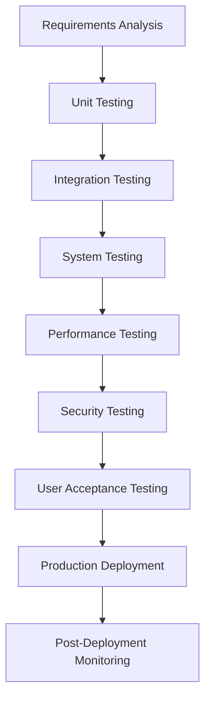
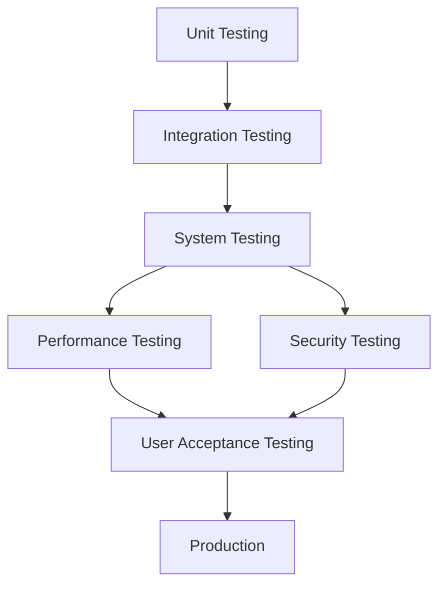
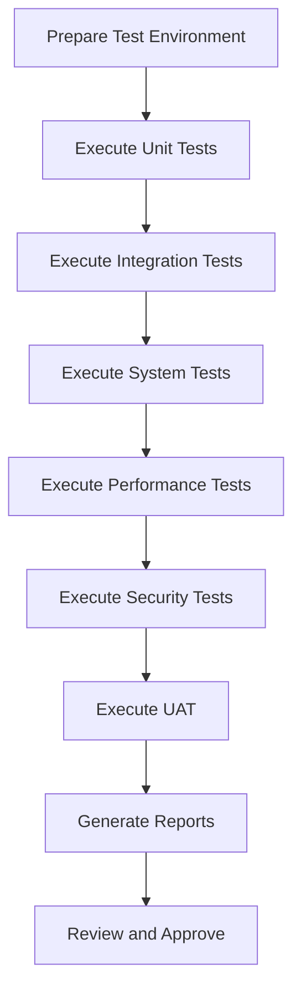

# Comprehensive Test Plan and Test Cases: Algorithmic Trading System (ATS)

## 1. Introduction

### 1.1 Purpose
This document provides a comprehensive test plan and detailed test cases for the Algorithmic Trading System (ATS). The purpose is to ensure the system meets all specified requirements, including functionality, performance, security, and compliance, as outlined in the Business Requirements Document (BRD), Functional Requirements Document (FRD), Product Requirements Document (PRD), Functional Specification Document (FSD), Technical Specification Document (TSD), System Design Document (SDD), Software Requirements Specification (SRS), and API Documentation. The plan validates the system's readiness for production deployment by thoroughly testing its components and interactions.

### 1.2 Scope
The testing scope encompasses:
- **Functional Testing**: Validates that all features operate as specified.
- **Integration Testing**: Ensures seamless interaction between system modules and external integrations.
- **Performance Testing**: Confirms the system meets latency, throughput, and scalability targets.
- **Security Testing**: Verifies protection against vulnerabilities and compliance with regulations.
- **User Acceptance Testing (UAT)**: Ensures the system meets end-user and business needs.

Components tested include the Core Trading Engine, Data Pipelines, AI Assistant, Analytics, User Interface (UI), APIs, and Security mechanisms.

### 1.3 Definitions, Acronyms, and Abbreviations
- **ATS**: Algorithmic Trading System
- **BRD**: Business Requirements Document
- **FRD**: Functional Requirements Document
- **PRD**: Product Requirements Document
- **FSD**: Functional Specification Document
- **TSD**: Technical Specification Document
- **SDD**: System Design Document
- **SRS**: Software Requirements Specification
- **API**: Application Programming Interface
- **UI**: User Interface
- **UAT**: User Acceptance Testing
- **QA**: Quality Assurance
- **CI/CD**: Continuous Integration/Continuous Deployment
- **JWT**: JSON Web Token
- **RBAC**: Role-Based Access Control
- **AI**: Artificial Intelligence
- **ML**: Machine Learning
- **NLP**: Natural Language Processing
- **RAG**: Retrieval-Augmented Generation
- **SMA**: Simple Moving Average
- **RSI**: Relative Strength Index
- **VaR**: Value at Risk

### 1.4 References
- "Features, Phases & Integration Strategy - Algorithmic Trading System.docx"
- Business Requirements Document (BRD)
- Functional Requirements Document (FRD)
- Product Requirements Document (PRD)
- Functional Specification Document (FSD)
- Technical Specification Document (TSD)
- System Design Document (SDD)
- Software Requirements Specification (SRS)
- API Documentation
- NautilusTrader Documentation: [https://nautilustrader.io/](https://nautilustrader.io/)
- Apache Kafka Documentation: [https://kafka.apache.org/](https://kafka.apache.org/)

---

## 2. Test Strategy

### 2.1 Testing Objectives
- **Functional Correctness**: Confirm all features align with FRD and FSD specifications.
- **System Integration**: Validate interactions between microservices and external systems (e.g., market data feeds, exchanges).
- **Performance**: Ensure the system meets latency (<100ms) and throughput requirements under load.
- **Security**: Verify authentication, authorization, and data protection mechanisms.
- **Usability**: Ensure an intuitive experience for non-technical and professional users.
- **Compliance**: Adhere to regulatory standards (e.g., SEC, FINRA, GDPR, CCPA).

### 2.2 Testing Types
- **Unit Testing**: Tests individual components in isolation.
- **Integration Testing**: Verifies module interactions.
- **System Testing**: Validates end-to-end functionality.
- **Performance Testing**: Assesses scalability and responsiveness.
- **Security Testing**: Evaluates security controls.
- **User Acceptance Testing (UAT)**: Confirms user satisfaction and business alignment.

### 2.3 Testing Tools
- **Unit Testing**: pytest (Python), Jest (JavaScript)
- **Integration Testing**: Postman, Newman
- **System Testing**: Selenium, Cypress
- **Performance Testing**: JMeter, Locust
- **Security Testing**: OWASP ZAP, Bandit
- **CI/CD**: GitHub Actions, Jenkins

### 2.4 Test Environment
- **Development**: Local Docker containers for isolated testing.
- **Staging**: Cloud-based (AWS/GCP/Azure) mirroring production configurations.
- **Production**: High-availability cloud setup with disaster recovery.

### 2.5 Test Deliverables
- Test Plan Document
- Test Case Specifications
- Test Scripts and Automation Code
- Test Execution Reports
- Defect Reports
- Test Summary Report

### 2.6 Testing Process Flow
Below is a Mermaid diagram illustrating the testing process:

---

## 3. Test Plan

### 3.1 Test Phases
1. **Unit Testing**: Conducted during development to validate individual components.
2. **Integration Testing**: Performed post-unit testing to ensure component interoperability.
3. **System Testing**: Validates the fully integrated system.
4. **Performance Testing**: Assesses system behavior under load.
5. **Security Testing**:    Testing**: Ensures compliance and security standards are met.
6. **User Acceptance Testing (UAT)**: Validates system usability and business requirements.

### 3.2 Test Schedule
| Phase                | Duration         | Timeline       |
|----------------------|------------------|----------------|
| Unit Testing         | Ongoing          | Months 1-10    |
| Integration Testing  | 3 months         | Months 4-6     |
| System Testing       | 2 months         | Months 6-8     |
| Performance Testing  | 2 months         | Months 7-9     |
| Security Testing     | 2 months         | Months 8-10    |
| UAT                  | 1 month          | Month 10       |

### 3.3 Roles andind Responsibilities
- **Test Manager**: Oversees testing, resource allocation, and plan adherence.
- **QA Engineers**: Design, execute, and report on test cases.
- **Developers**: Perform unit tests and resolve defects.
- **DevOps Engineers**: Manage test environments.
- **Security Specialists**: Conduct security audits.
- **End-Users**: Participate in UAT.

### 3.4 Risk Management
| Risk                   | Mitigation Strategy                              |
|-----------------------|-------------------------------------------------|
| Integration Failures  | Early and frequent integration tests            |
| Performance Issues    | Continuous performance monitoring               |
| Security Breaches     | Security testing in CI/CD pipeline             |
| User Rejection        | Early user feedback via prototypes              |

### 3.5 Test Phase Dependencies

---

## 4. Test Cases

### 4.1 Functional Test Cases

#### 4.1.1 Core Trading Engine
**Test Case ID**: TC-CE-001  
**Title**: Verify Strategy Creation  
**Description**: Ensure users can create a trading strategy.  
**Preconditions**: User authenticated with "Trader" role.  
**Steps**:  
1. Navigate to strategy creation page.  
2. Enter name, description, and Python code.  
3. Submit.  
**Expected Result**: Strategy created with success message and ID.

**Test Case ID**: TC-CE-002  
**Title**: Validate Backtesting Functionality  
**Description**: Confirm backtesting accuracy.  
**Preconditions**: Strategy and historical data available.  
**Steps**:  
1. Select strategy.  
2. Set parameters (date range, capital).  
3. Run backtest.  
**Expected Result**: Results (e.g., profit/loss, Sharpe ratio) displayed.

#### 4.1.2 Data Pipelines
**Test Case ID**: TC-DP-001  
**Title**: Test Market Data Ingestion  
**Description**: Verify real-time data ingestion.  
**Preconditions**: Data sources configured.  
**Steps**:  
1. Trigger ingestion for an asset.  
2. Monitor Kafka topics.  
**Expected Result**: Data ingested and published to Kafka.

**Test Case ID**: TC-DP-002  
**Title**: Check Data Normalization  
**Description**: Ensure data consistency.  
**Preconditions**: Raw data available.  
**Steps**:  
1. Ingest raw data.  
2. Retrieve normalized data.  
**Expected Result**: Data formatted consistently.

#### 4.1.3 AI Assistant
**Test Case ID**: TC-AI-001  
**Title**: Validate NLP Query Processing  
**Description**: Confirm AI interprets queries correctly.  
**Preconditions**: AI active.  
**Steps**:  
1. Submit query (e.g., "What’s AAPL’s price?").  
2. Review response.  
**Expected Result**: Accurate response provided.

**Test Case ID**: TC-AI-002  
**Title**: Test Code Generation  
**Description**: Ensure AI generates valid strategy code.  
**Preconditions**: AI configured.  
**Steps**:  
1. Request code (e.g., "Moving average crossover").  
2. Review code.  
**Expected Result**: Valid Python code generated.

#### 4.1.4 Analytics
**Test Case ID**: TC-AN-001  
**Title**: Verify ML Prediction Accuracy  
**Description**: Ensure accurate price predictions.  
**Preconditions**: Historical data and model available.  
**Steps**:  
1. Request prediction for an asset.  
2. Compare with actual data.  
**Expected Result**: Prediction within ±5% error.

**Test Case ID**: TC-AN-002  
**Title**: Test Portfolio Optimization  
**Description**: Confirm valid portfolio suggestions.  
**Preconditions**: Portfolio exists.  
**Steps**:  
1. Input risk/return preferences.  
2. Run optimization.  
**Expected Result**: Diversified allocation provided.

#### 4.1.5 User Interface
**Test Case ID**: TC-UI-001  
**Title**: Validate Dashboard Data  
**Description**: Ensure real-time data accuracy.  
**Preconditions**: User logged in.  
**Steps**:  
1. View dashboard.  
2. Compare data with known values.  
**Expected Result**: Data matches expectations.

**Test Case ID**: TC-UI-002  
**Title**: Test No-Code Strategy Builder  
**Description**: Verify no-code strategy creation.  
**Preconditions**: Access to builder.  
**Steps**:  
1. Drag/drop blocks for strategy.  
2. Save and run.  
**Expected Result**: Strategy executes correctly.

#### 4.1.6 APIs
**Test Case ID**: TC-API-001  
**Title**: Verify API Authentication  
**Description**: Ensure endpoints require authentication.  
**Preconditions**: User has credentials.  
**Steps**:  
1. Access endpoint without token.  
2. Access with invalid token.  
3. Access with valid token.  
**Expected Result**: Denied without valid token; allowed with valid token.

**Test Case ID**: TC-API-002  
**Title**: Test API Rate Limiting  
**Description**: Confirm rate limits enforced.  
**Preconditions**: Limit set (e.g., 100 req/min).  
**Steps**:  
1. Exceed limit with requests.  
2. Check for 429 response.  
**Expected Result**: Excess requests rejected with 429.

#### 4.1.7 Security and Compliance
**Test Case ID**: TC-SC-001  
**Title**: Validate RBAC  
**Description**: Ensure role-based access control.  
**Preconditions**: Users with different roles.  
**Steps**:  
1. Access admin features as regular user.  
2. Access as admin.  
**Expected Result**: Denied for unauthorized; allowed for authorized.

**Test Case ID**: TC-SC-002  
**Title**: Verify Data Encryption  
**Description**: Confirm sensitive data encrypted.  
**Preconditions**: Data in database.  
**Steps**:  
1. Inspect database for encryption.  
2. Decrypt with key.  
**Expected Result**: Data encrypted and decryptable.

---

### 4.2 Integration Test Cases

#### 4.2.1 Core Trading Engine and Data Pipelines
**Test Case ID**: TC-INT-001  
**Title**: Verify Market Data Integration  
**Description**: Ensure trading engine uses real-time data.  
**Preconditions**: Pipelines and engine operational.  
**Steps**:  
1. Trigger data ingestion.  
2. Monitor engine response.  
**Expected Result**: Engine processes data and executes strategies.

#### 4.2.2 AI Assistant and Analytics
**Test Case ID**: TC-INT-002  
**Title**: Test AI Analytics Integration  
**Description**: Confirm AI uses analytics data.  
**Preconditions**: Analytics data available.  
**Steps**:  
1. Query AI for prediction insight.  
2. Verify response includes analytics.  
**Expected Result**: Data-driven response provided.

---

### 4.3 Performance Test Cases

#### 4.3.1 Load Testing
**Test Case ID**: TC-PERF-001  
**Title**: Simulate High User Load  
**Description**: Ensure system handles 1000 users.  
**Preconditions**: Load tools configured.  
**Steps**:  
1. Simulate 1000 users (queries, trades).  
2. Monitor response times/errors.  
**Expected Result**: Response <100ms, no errors.

#### 4.3.2 Stress Testing
**Test Case ID**: TC-PERF-002  
**Title**: Test Extreme Load  
**Description**: Determine breaking point and recovery.  
**Preconditions**: Stress tools configured.  
**Steps**:  
1. Increase load beyond limits.  
2. Observe behavior and recovery.  
**Expected Result**: Graceful handling and recovery.

---

### 4.4 Security Test Cases

#### 4.4.1 Penetration Testing
**Test Case ID**: TC-SEC-001  
**Title**: Identify Vulnerabilities  
**Description**: Detect weaknesses with OWASP ZAP.  
**Preconditions**: ZAP configured.  
**Steps**:  
1. Run full scan.  
2. Address vulnerabilities.  
**Expected Result**: No critical issues found.

#### 4.4.2 Compliance Testing
**Test Case ID**: TC-SEC-002  
**Title**: Verify Audit Trail  
**Description**: Ensure logs are immutable.  
**Preconditions**: Logging enabled.  
**Steps**:  
1. Perform actions (trade, login).  
2. Review logs.  
**Expected Result**: Accurate, unalterable logs.

---

### 4.5 User Acceptance Test Cases

#### 4.5.1 Non-technical User Workflow
**Test Case ID**: TC-UAT-001  
**Title**: Validate No-Code Strategy  
**Description**: Ensure ease for non-technical users.  
**Preconditions**: "Trader" role user logged in.  
**Steps**:  
1. Create strategy with no-code builder.  
2. Backtest and deploy.  
**Expected Result**: Strategy deployed without issues.

#### 4.5.2 Professional User Workflow
**Test Case ID**: TC-UAT-002  
**Title**: Test Custom Strategy  
**Description**: Confirm custom strategy execution.  
**Preconditions**: "Professional" role with API access.  
**Steps**:  
1. Upload Python strategy via API.  
2. Execute and monitor.  
**Expected Result**: Strategy executes as expected.

---

## 5. Test Execution and Reporting

### 5.1 Test Execution Process
- Tests follow the sequence: Unit → Integration → System → Performance → Security → UAT.
- Automated tests run via CI/CD; UAT involves manual execution.
- Defects tracked in Jira and prioritized.

### 5.2 Test Reporting
- **Daily Reports**: Pass/fail rates, defect status.
- **Final Report**: Coverage metrics, defect analysis, risk assessment, deployment recommendation.

### 5.3 Test Execution Workflow

---

## 6. Appendices

### 6.1 Glossary
- **Backtest**: Simulating a strategy with historical data.
- **JWT**: Token for secure authentication.
- **Strategy**: Rules defining trading behavior.

### 6.2 References
- NautilusTrader Documentation: [https://nautilustrader.io/](https://nautilustrader.io/)
- Apache Kafka Documentation: [https://kafka.apache.org/](https://kafka.apache.org/)
- OWASP ZAP Documentation: [https://owasp.org/www-project-zap/](https://owasp.org/www-project-zap/)