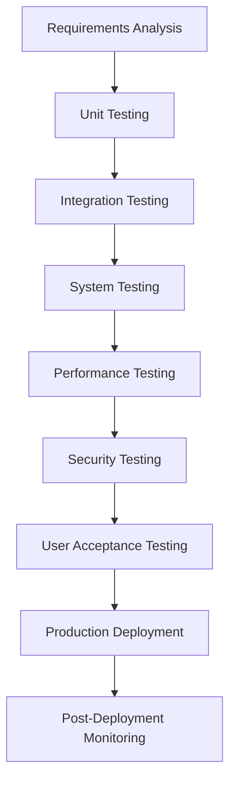
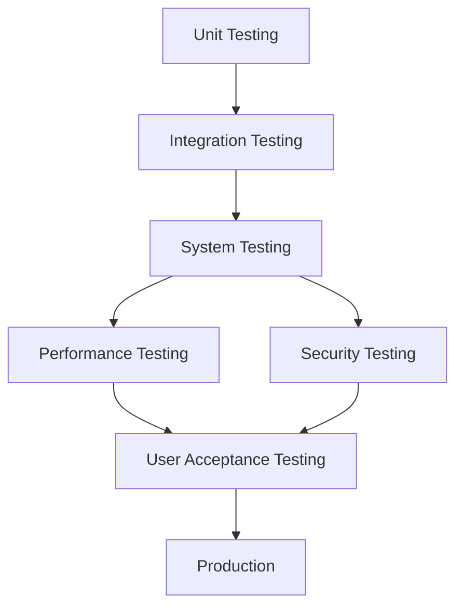
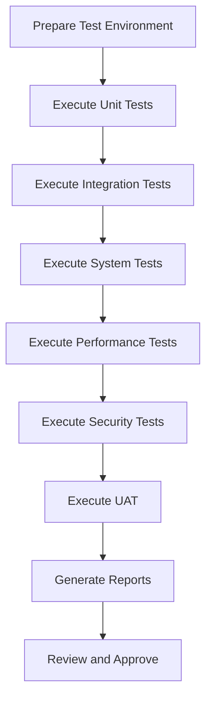

# Comprehensive Test Plan and Test Cases: Algorithmic Trading System (ATS)

## 1. Introduction

### 1.1 Purpose
This document outlines a comprehensive test plan and detailed test cases for the Algorithmic Trading System (ATS), ensuring alignment with the requirements specified in the “Features, Phases & Integration Strategy - Algorithmic Trading System.docx” and phase-wise prompts. The objective is to validate the system’s functionality, performance, security, and usability, covering all components, including the Core Trading Engine (NautilusTrader), Agentic AI Assistant (OpenHands and Lobe Chat), Data Pipelines (Kafka), APIs (FastAPI, gRPC), and databases (PostgreSQL/pgvector, ClickHouse, DuckDB, Apache Iceberg). The plan ensures the system meets the needs of both non-technical and professional users while adhering to enterprise-grade standards.

### 1.2 Scope
The testing scope includes:
- **Functional Testing**: Validates features such as strategy creation, backtesting, AI-driven interactions, and data processing.
- **Integration Testing**: Ensures seamless interaction between microservices, external APIs, and databases.
- **Performance Testing**: Confirms latency (<100ms for critical operations), throughput, and scalability under load.
- **Security Testing**: Verifies authentication, authorization, data encryption, and regulatory compliance.
- **User Acceptance Testing (UAT)**: Ensures usability for non-technical and professional users.

Components tested:
- Core Trading Engine (NautilusTrader)
- Agentic AI Assistant (OpenHands, Lobe Chat, LangChain, LangGraph, TradingAgents, OpenBB)
- Data Pipelines (Kafka, Schema Registry)
- APIs (FastAPI, gRPC)
- Databases (PostgreSQL/pgvector, ClickHouse, DuckDB, Qdrant, Apache Iceberg)
- Frontend (Next.js)
- Security (Bandit, Zero-Trust, RBAC, Unleash)
- Observability (Prometheus, Grafana, Grafana Tempo, Memray)

### 1.3 Definitions, Acronyms, and Abbreviations
- **ATS**: Algorithmic Trading System
- **BRD**: Business Requirements Document
- **FRD**: Functional Requirements Document
- **PRD**: Product Requirements Document
- **FSD**: Functional Specification Document
- **TSD**: Technical Specification Document
- **SDD**: System Design Document
- **SRS**: Software Requirements Specification
- **API**: Application Programming Interface
- **UI**: User Interface
- **UAT**: User Acceptance Testing
- **QA**: Quality Assurance
- **CI/CD**: Continuous Integration/Continuous Deployment
- **JWT**: JSON Web Token
- **RBAC**: Role-Based Access Control
- **MCP**: Model Context Protocol
- **RAG**: Retrieval-Augmented Generation
- **SMA**: Simple Moving Average
- **RSI**: Relative Strength Index
- **VaR**: Value at Risk
- **LLM**: Large Language Model

### 1.4 References
- “Features, Phases & Integration Strategy - Algorithmic Trading System.docx”
- “Prompt - Phasewise and Taskwise - Algorithmic Trading System.docx”
- NautilusTrader Documentation: [https://nautilustrader.io/](https://nautilustrader.io/)
- Apache Kafka Documentation: [https://kafka.apache.org/](https://kafka.apache.org/)
- OpenHands Documentation: [https://docs.all-hands.dev/](https://docs.all-hands.dev/)
- Lobe Chat Documentation: [https://lobehub.com/](https://lobehub.com/)

---

## 2. Test Strategy

### 2.1 Testing Objectives
- Ensure all features meet functional requirements (e.g., strategy creation, backtesting, AI interactions).
- Validate seamless integration between microservices and external systems (e.g., market data feeds, exchanges).
- Confirm performance metrics (e.g., <100ms latency for trade execution, high throughput).
- Verify security measures (e.g., RBAC, encryption) and regulatory compliance (e.g., SEC, GDPR).
- Ensure usability for non-technical users (via no-code interfaces) and professionals (via APIs, custom strategies).

### 2.2 Testing Types
- **Unit Testing**: Tests individual components (e.g., strategy logic, AI tools).
- **Integration Testing**: Validates interactions between services (e.g., Kafka and NautilusTrader).
- **System Testing**: Ensures end-to-end functionality across all components.
- **Performance Testing**: Assesses scalability and responsiveness under load.
- **Security Testing**: Evaluates protection against vulnerabilities.
- **User Acceptance Testing (UAT)**: Confirms alignment with user and business needs.

### 2.3 Testing Tools
- **Unit Testing**: pytest (Python), Jest (JavaScript)
- **Integration Testing**: Postman, Newman
- **System Testing**: Selenium, Cypress
- **Performance Testing**: JMeter, Locust
- **Security Testing**: OWASP ZAP, Bandit
- **CI/CD**: GitHub Actions, Jenkins
- **Observability**: Prometheus, Grafana, Grafana Tempo, Memray

### 2.4 Test Environment
- **Development**: Docker containers for isolated testing.
- **Staging**: Cloud-based (AWS/GCP/Azure) mirroring production setup.
- **Production**: High-availability cloud setup with disaster recovery.
- **Configuration**:
  - Python 3.11.x
  - NautilusTrader (latest stable version)
  - Kafka (confluentinc/cp-kafka)
  - PostgreSQL with pgvector
  - ClickHouse, DuckDB, Qdrant, Apache Iceberg
  - FastAPI, gRPC, Next.js

### 2.5 Test Deliverables
- Test Plan Document
- Test Case Specifications
- Test Scripts and Automation Code
- Test Execution Reports
- Defect Reports
- Test Summary Report

### 2.6 Testing Process Flow

---

## 3. Test Plan

### 3.1 Test Phases
1. **Unit Testing**: Validates individual components during development (e.g., NautilusTrader strategy logic, OpenHands code generation).
2. **Integration Testing**: Ensures interoperability between microservices (e.g., Kafka with NautilusTrader, Lobe Chat with FastAPI).
3. **System Testing**: Verifies end-to-end functionality across all components.
4. **Performance Testing**: Confirms scalability and low-latency performance.
5. **Security Testing**: Validates authentication, authorization, and compliance.
6. **User Acceptance Testing (UAT)**: Confirms usability and business alignment.

### 3.2 Test Schedule
| Phase                | Duration         | Timeline       |
|----------------------|------------------|----------------|
| Unit Testing         | Ongoing          | Months 1-10    |
| Integration Testing  | 3 months         | Months 4-6     |
| System Testing       | 2 months         | Months 6-8     |
| Performance Testing  | 2 months         | Months 7-9     |
| Security Testing     | 2 months         | Months 8-10    |
| UAT                  | 1 month          | Month 10       |

### 3.3 Roles and Responsibilities
- **Test Manager**: Oversees testing strategy and execution.
- **QA Engineers**: Design and execute test cases, report defects.
- **Developers**: Conduct unit tests, resolve defects.
- **DevOps Engineers**: Manage test environments.
- **Security Specialists**: Perform security audits.
- **End-Users**: Participate in UAT.

### 3.4 Risk Management
| Risk                   | Mitigation Strategy                              |
|-----------------------|-------------------------------------------------|
| Integration Failures  | Early integration testing with CI/CD pipelines  |
| Performance Bottlenecks | Continuous performance monitoring with Prometheus |
| Security Vulnerabilities | Regular scans with Bandit and OWASP ZAP         |
| User Rejection        | Iterative UAT with prototypes                   |

### 3.5 Test Phase Dependencies

---

## 4. Test Cases

### 4.1 Functional Test Cases

#### 4.1.1 Core Trading Engine (NautilusTrader)
**Test Case ID**: TC-CE-001  
**Title**: Verify Strategy Creation  
**Description**: Ensure users can create a trading strategy via NautilusTrader.  
**Preconditions**: User authenticated with “Trader” role, NautilusTrader service running.  
**Steps**:  
1. Navigate to strategy creation interface (via Lobe Chat or API).  
2. Input strategy parameters (e.g., SMA Crossover, ticker: AAPL).  
3. Submit strategy.  
**Expected Result**: Strategy created with success message and unique ID.  
**Test Data**: Strategy name: “SMACrossover”, ticker: “AAPL”, parameters: {“sma_short”: 10, “sma_long”: 30}.

**Test Case ID**: TC-CE-002  
**Title**: Validate Backtesting Functionality  
**Description**: Confirm backtesting produces accurate results.  
**Preconditions**: Strategy and historical data (e.g., AAPL 2023) available.  
**Steps**:  
1. Select strategy via API or Lobe Chat.  
2. Set backtest parameters (e.g., date range: 2023-01-01 to 2023-12-31).  
3. Run backtest.  
**Expected Result**: Results include profit/loss, Sharpe ratio, max drawdown.  
**Test Data**: Ticker: “AAPL”, date range: 2023-01-01 to 2023-12-31.

#### 4.1.2 Data Pipelines (Kafka)
**Test Case ID**: TC-DP-001  
**Title**: Test Market Data Ingestion  
**Description**: Verify real-time market data ingestion via Kafka.  
**Preconditions**: Kafka and Schema Registry running, Yahoo Finance connected.  
**Steps**:  
1. Trigger data ingestion for ticker (e.g., AAPL).  
2. Monitor Kafka topic `market_data.ticks`.  
**Expected Result**: Data ingested and published with correct schema.  
**Test Data**: Ticker: “AAPL”, source: “Yahoo Finance”.

**Test Case ID**: TC-DP-002  
**Title**: Check Data Fallback Logic  
**Description**: Ensure fallback data sources (e.g., Alpha Vantage) are used if primary fails.  
**Preconditions**: Yahoo Finance unavailable, Alpha Vantage configured.  
**Steps**:  
1. Trigger data fetch for AAPL.  
2. Simulate Yahoo Finance failure.  
3. Verify data from Alpha Vantage.  
**Expected Result**: Data retrieved from fallback source.  
**Test Data**: Ticker: “AAPL”, primary: “Yahoo Finance”, fallback: “Alpha Vantage”.

#### 4.1.3 Agentic AI Assistant (OpenHands)
**Test Case ID**: TC-AI-OH-001  
**Title**: Validate Code Generation by OpenHands  
**Description**: Ensure OpenHands generates valid Python strategy code.  
**Preconditions**: OpenHands service running, user authenticated.  
**Steps**:  
1. Input natural language command (e.g., “Create an SMA Crossover strategy for AAPL”).  
2. Review generated code.  
3. Execute code in NautilusTrader.  
**Expected Result**: Valid Python code generated and executable.  
**Test Data**: Command: “Create SMA Crossover strategy for AAPL with short=10, long=30”.

**Test Case ID**: TC-AI-OH-002  
**Title**: Test OpenHands Debugging  
**Description**: Verify OpenHands can debug strategy code errors.  
**Preconditions**: Strategy with known error (e.g., undefined variable).  
**Steps**:  
1. Submit erroneous code via OpenHands.  
2. Request debugging assistance.  
3. Review corrected code.  
**Expected Result**: Error identified and fixed code provided.  
**Test Data**: Code with undefined variable `price`.

#### 4.1.4 Agentic AI Assistant (Lobe Chat)
**Test Case ID**: TC-AI-LC-001  
**Title**: Validate NLP Query Processing  
**Description**: Confirm Lobe Chat interprets trading queries correctly.  
**Preconditions**: Lobe Chat service running, connected to LLM (e.g., Claude 3.5 Sonnet).  
**Steps**:  
1. Submit query (e.g., “What’s AAPL’s price today?”).  
2. Review response.  
**Expected Result**: Accurate price or data retrieved via Kafka.  
**Test Data**: Query: “What’s AAPL’s price today?”.

**Test Case ID**: TC-AI-LC-002  
**Title**: Test RAG Integration with Qdrant  
**Description**: Ensure Lobe Chat retrieves relevant documents for trading insights.  
**Preconditions**: Qdrant running, sample documents indexed.  
**Steps**:  
1. Upload market analysis PDF.  
2. Query: “Summarize AAPL’s market trends.”  
3. Review response.  
**Expected Result**: Summary based on document content.  
**Test Data**: PDF with AAPL market trends.

#### 4.1.5 Analytics
**Test Case ID**: TC-AN-001  
**Title**: Verify ML Prediction Accuracy  
**Description**: Ensure accurate price predictions using LSTM models.  
**Preconditions**: Historical data and trained LSTM model available.  
**Steps**:  
1. Request prediction for AAPL (e.g., next 7 days).  
2. Compare with actual data.  
**Expected Result**: Prediction within ±5% error.  
**Test Data**: Ticker: “AAPL”, horizon: 7 days.

**Test Case ID**: TC-AN-002  
**Title**: Test Portfolio Optimization  
**Description**: Confirm valid portfolio suggestions using PyPortfolioOpt.  
**Preconditions**: Portfolio data available.  
**Steps**:  
1. Input risk/return preferences.  
2. Run optimization.  
**Expected Result**: Diversified allocation provided.  
**Test Data**: Risk tolerance: 0.2, expected return: 0.1.

#### 4.1.6 User Interface (Next.js)
**Test Case ID**: TC-UI-001  
**Title**: Validate Dashboard Data Display  
**Description**: Ensure real-time data accuracy on the dashboard.  
**Preconditions**: User logged in, Next.js frontend running.  
**Steps**:  
1. Access dashboard.  
2. Compare displayed data (e.g., AAPL price) with Kafka feed.  
**Expected Result**: Data matches Kafka feed.  
**Test Data**: Ticker: “AAPL”.

**Test Case ID**: TC-UI-002  
**Title**: Test No-Code Strategy Builder  
**Description**: Verify Blockly-based strategy creation.  
**Preconditions**: Access to Blockly interface.  
**Steps**:  
1. Drag/drop blocks to create SMA Crossover strategy.  
2. Save and run backtest.  
**Expected Result**: Strategy executes correctly.  
**Test Data**: Blocks: SMA(10), SMA(30), Buy/Sell triggers.

#### 4.1.7 APIs (FastAPI, gRPC)
**Test Case ID**: TC-API-001  
**Title**: Verify Backtest Endpoint  
**Description**: Ensure `/backtest` endpoint triggers accurate backtests.  
**Preconditions**: FastAPI service running, NautilusTrader available.  
**Steps**:  
1. Send POST request to `/backtest` with payload: `{"ticker": "AAPL", "start_date": "2023-01-01", "end_date": "2023-12-31", "strategy_name": "sma_crossover"}`.  
2. Review response.  
**Expected Result**: Returns metrics (e.g., Sharpe ratio, max drawdown).  
**Test Data**: Payload as above.

**Test Case ID**: TC-API-002  
**Title**: Test gRPC Market Data Streaming  
**Description**: Confirm low-latency market data streaming via gRPC.  
**Preconditions**: gRPC service running, Kafka topic populated.  
**Steps**:  
1. Connect to `MarketData.StreamTicks` RPC.  
2. Stream ticks for AAPL.  
**Expected Result**: Ticks received with <100ms latency.  
**Test Data**: Ticker: “AAPL”.

#### 4.1.8 Security and Compliance
**Test Case ID**: TC-SC-001  
**Title**: Validate RBAC  
**Description**: Ensure role-based access control restricts unauthorized access.  
**Preconditions**: Users with “Trader” and “Admin” roles.  
**Steps**:  
1. Attempt admin action (e.g., modify strategy) as “Trader”.  
2. Attempt as “Admin”.  
**Expected Result**: Denied for “Trader”; allowed for “Admin”.  
**Test Data**: Action: Modify strategy ID “123”.

**Test Case ID**: TC-SC-002  
**Title**: Verify Audit Trail with Apache Iceberg  
**Description**: Ensure immutable order logs.  
**Preconditions**: Kafka topic `audit.orders` and Iceberg table configured.  
**Steps**:  
1. Place order via `/order` endpoint.  
2. Verify log in Iceberg table.  
**Expected Result**: Order details logged immutably.  
**Test Data**: Order: Buy 100 AAPL shares.

---

### 4.2 Integration Test Cases

#### 4.2.1 NautilusTrader and Kafka
**Test Case ID**: TC-INT-001  
**Title**: Verify Market Data Integration  
**Description**: Ensure NautilusTrader processes Kafka market data.  
**Preconditions**: Kafka topic `market_data.ticks` populated, NautilusTrader running.  
**Steps**:  
1. Publish AAPL ticks to Kafka.  
2. Monitor NautilusTrader strategy execution.  
**Expected Result**: Strategy processes ticks and generates signals.  
**Test Data**: Ticker: “AAPL”.

#### 4.2.2 OpenHands and FastAPI
**Test Case ID**: TC-INT-002  
**Title**: Test OpenHands API Interaction  
**Description**: Confirm OpenHands calls `/backtest` endpoint correctly.  
**Preconditions**: FastAPI and OpenHands services running.  
**Steps**:  
1. Submit backtest request via OpenHands (e.g., “Run SMA Crossover on GOOG”).  
2. Verify API call and response.  
**Expected Result**: Valid JSON payload sent, metrics returned.  
**Test Data**: Command: “Run SMA Crossover on GOOG”.

#### 4.2.3 Lobe Chat and Qdrant
**Test Case ID**: TC-INT-003  
**Title**: Test RAG Query Integration  
**Description**: Ensure Lobe Chat retrieves relevant documents from Qdrant.  
**Preconditions**: Qdrant running, documents indexed.  
**Steps**:  
1. Query Lobe Chat: “Analyze AAPL trends.”  
2. Verify Qdrant search and response.  
**Expected Result**: Response includes document-based insights.  
**Test Data**: Query: “Analyze AAPL trends”.

---

### 4.3 Performance Test Cases

#### 4.3.1 Load Testing
**Test Case ID**: TC-PERF-001  
**Title**: Simulate High User Load  
**Description**: Ensure system handles 1000 concurrent users.  
**Preconditions**: JMeter configured, all services running.  
**Steps**:  
1. Simulate 1000 users accessing `/backtest` and `/portfolio` endpoints.  
2. Monitor response times and errors.  
**Expected Result**: Response time <100ms, no errors.  
**Test Data**: 1000 users, mixed requests.

#### 4.3.2 Stress Testing
**Test Case ID**: TC-PERF-002  
**Title**: Test Extreme Load  
**Description**: Determine system breaking point and recovery.  
**Preconditions**: Locust configured.  
**Steps**:  
1. Increase load beyond 1000 users.  
2. Observe behavior and recovery.  
**Expected Result**: Graceful degradation and recovery.  
**Test Data**: 2000 users.

---

### 4.4 Security Test Cases

#### 4.4.1 Penetration Testing
**Test Case ID**: TC-SEC-001  
**Title**: Identify Vulnerabilities  
**Description**: Detect weaknesses using OWASP ZAP.  
**Preconditions**: OWASP ZAP configured.  
**Steps**:  
1. Run full scan on FastAPI endpoints.  
2. Address vulnerabilities.  
**Expected Result**: No critical vulnerabilities found.  
**Test Data**: Endpoints: `/backtest`, `/order`.

#### 4.4.2 Feature Flag Validation
**Test Case ID**: TC-SEC-002  
**Title**: Verify Unleash Feature Flags  
**Description**: Ensure feature flags control access to new features.  
**Preconditions**: Unleash configured, feature flag set.  
**Steps**:  
1. Disable a feature (e.g., no-code builder).  
2. Attempt access as user.  
**Expected Result**: Feature inaccessible when disabled.  
**Test Data**: Feature: “no_code_builder”.

---

### 4.5 User Acceptance Test Cases

#### 4.5.1 Non-technical User Workflow
**Test Case ID**: TC-UAT-001  
**Title**: Validate No-Code Strategy Creation  
**Description**: Ensure non-technical users can create strategies via Lobe Chat/Blockly.  
**Preconditions**: User logged in as “Trader”.  
**Steps**:  
1. Use Lobe Chat to request: “Create SMA Crossover for AAPL.”  
2. Alternatively, use Blockly to build strategy.  
3. Run backtest.  
**Expected Result**: Strategy created and backtested successfully.  
**Test Data**: Strategy: SMA Crossover, ticker: “AAPL”.

#### 4.5.2 Professional User Workflow
**Test Case ID**: TC-UAT-002  
**Title**: Test Custom Strategy Deployment  
**Description**: Confirm professional users can deploy custom strategies via OpenHands.  
**Preconditions**: User with “Professional” role, API access.  
**Steps**:  
1. Upload Python strategy via OpenHands.  
2. Execute and monitor via FastAPI.  
**Expected Result**: Strategy deployed and executed correctly.  
**Test Data**: Custom Python strategy for AAPL.

---

## 5. Test Execution and Reporting

### 5.1 Test Execution Process
- Execute tests in sequence: Unit → Integration → System → Performance → Security → UAT.
- Automate tests via CI/CD (GitHub Actions) for unit and integration tests.
- Conduct manual UAT with end-users.
- Track defects in Jira, prioritizing by severity.

### 5.2 Test Reporting
- **Daily Reports**: Pass/fail rates, defect counts.
- **Final Report**: Test coverage, defect resolution status, risk assessment, deployment readiness.

### 5.3 Test Execution Workflow

---

## 6. Appendices

### 6.1 Glossary
- **Backtest**: Simulating a trading strategy with historical data.
- **RAG**: Retrieval-Augmented Generation for context-aware AI responses.
- **MCP**: Model Context Protocol for AI agent integrations.

### 6.2 References
- NautilusTrader Documentation: [https://nautilustrader.io/](https://nautilustrader.io/)
- Apache Kafka Documentation: [https://kafka.apache.org/](https://kafka.apache.org/)
- OpenHands Documentation: [https://docs.all-hands.dev/](https://docs.all-hands.dev/)
- Lobe Chat Documentation: [https://lobehub.com/](https://lobehub.com/)