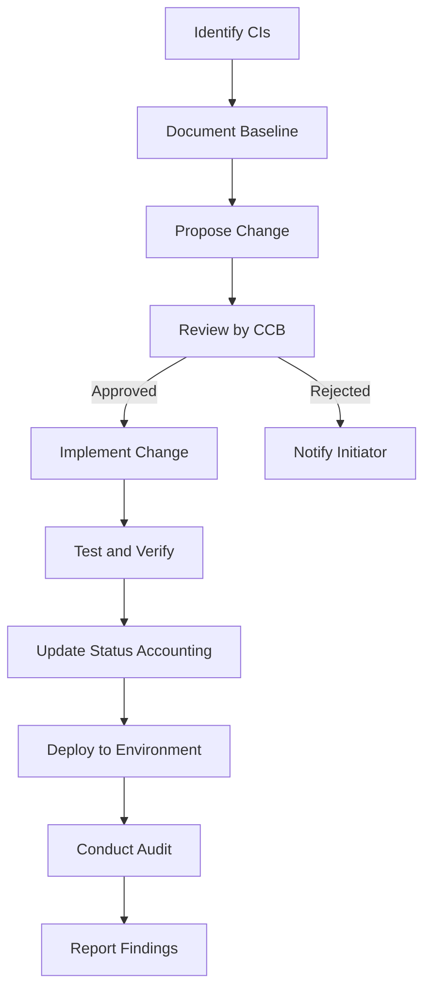
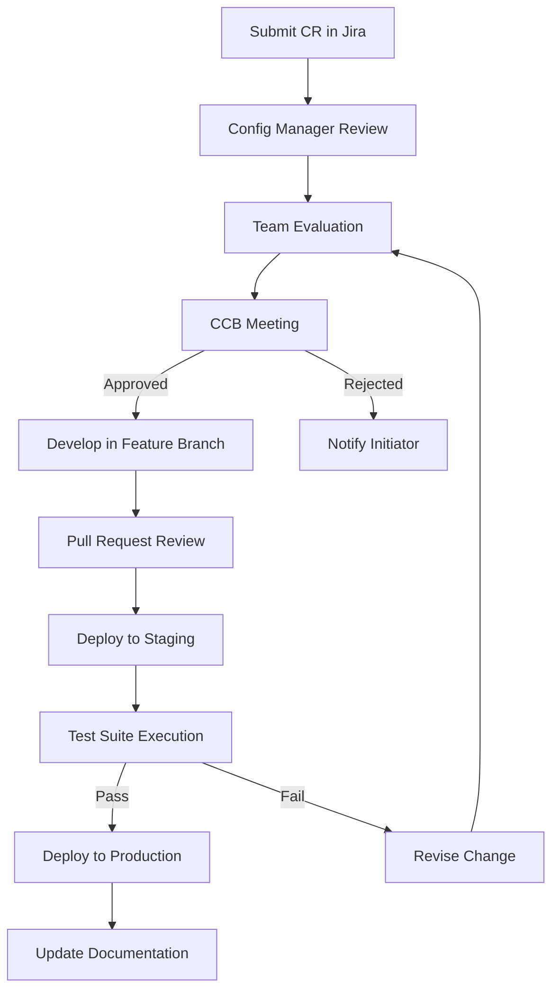
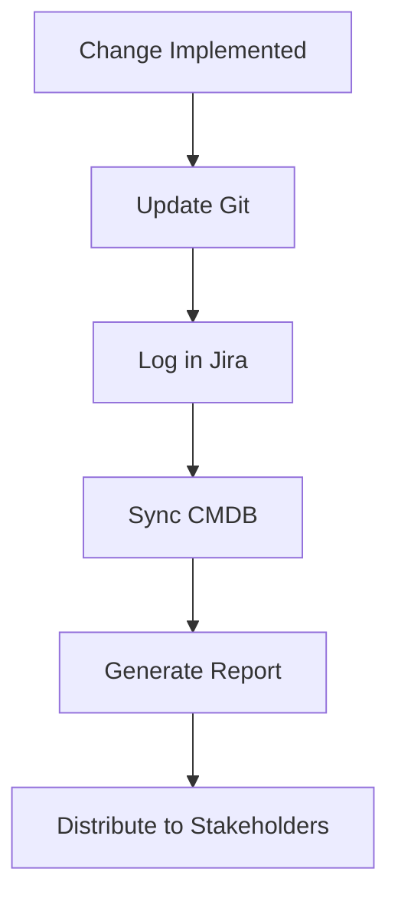
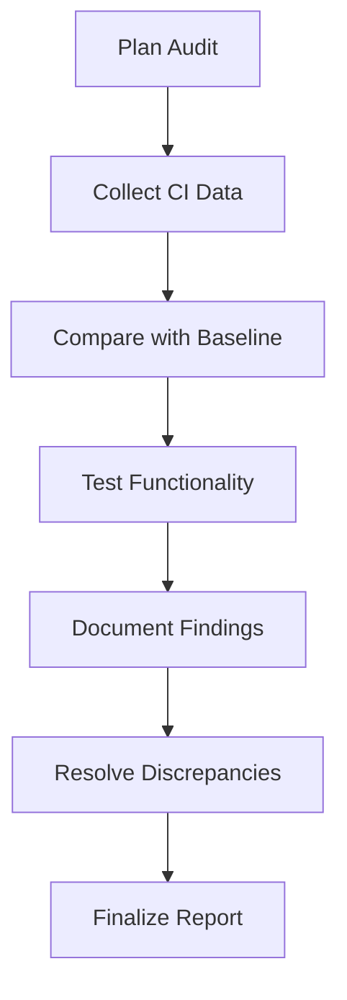
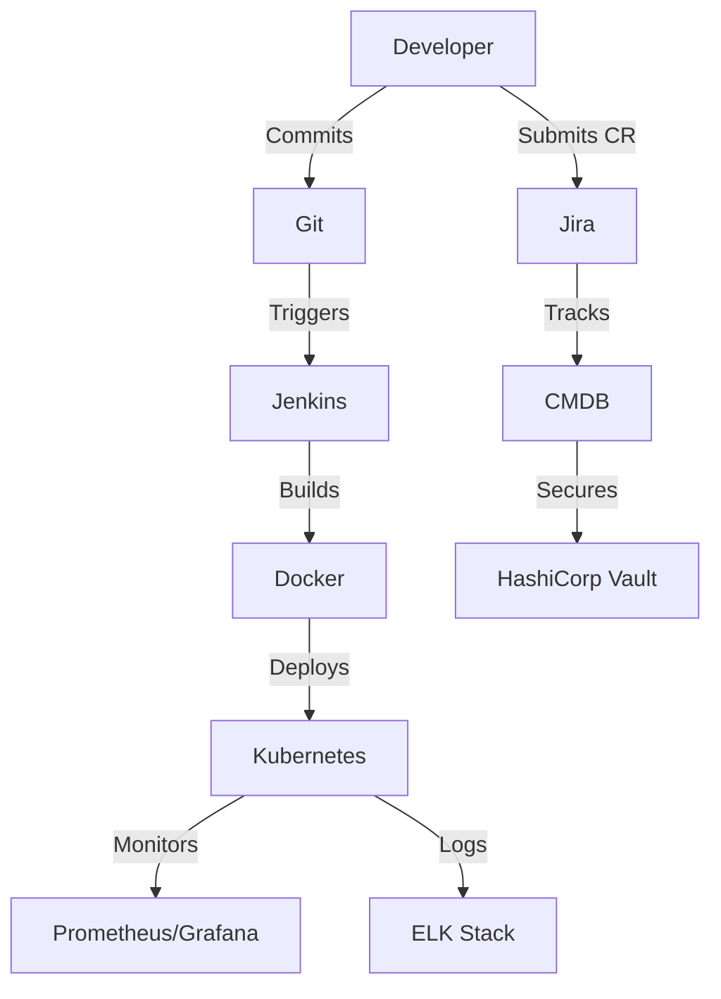
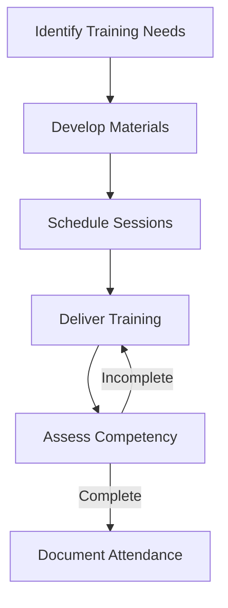

# Configuration Management Plan
## Algorithmic Trading System

---

### Table of Contents
1. [Introduction](#introduction)
   - 1.1 Purpose
   - 1.2 Scope
   - 1.3 Objectives
2. [Configuration Management Process](#configuration-management-process)
   - 2.1 Overview
   - 2.2 Roles and Responsibilities
   - 2.3 Process Flow
3. [Configuration Identification](#configuration-identification)
   - 3.1 Configuration Items (CIs)
   - 3.2 Naming Conventions
   - 3.3 Versioning Scheme
4. [Configuration Control](#configuration-control)
   - 4.1 Change Control Process
   - 4.2 Change Control Board (CCB)
   - 4.3 Special Considerations
5. [Configuration Status Accounting](#configuration-status-accounting)
   - 5.1 Tracked Information
   - 5.2 Reporting
6. [Configuration Audits](#configuration-audits)
   - 6.1 Types of Audits
   - 6.2 Audit Process
   - 6.3 Schedule
7. [Tools and Resources](#tools-and-resources)
   - 7.1 Configuration Management Tools
   - 7.2 Integration Diagram
8. [Training](#training)
   - 8.1 Training Plan
   - 8.2 Training Materials
9. [Security Considerations](#security-considerations)
   - 9.1 Access Control
   - 9.2 Data Protection
10. [Appendices](#appendices)
    - 10.1 Configuration Item List
    - 10.2 Change Request Form Template
    - 10.3 Configuration Audit Checklist
    - 10.4 Glossary

---

### Introduction

#### 1.1 Purpose
The Configuration Management Plan (CMP) for the Algorithmic Trading System (ATS) establishes a structured approach to identify, control, track, and audit all configuration items (CIs) throughout the system's lifecycle. The ATS is an enterprise-grade platform designed to automate trading strategies across diverse asset classes (stocks, ETFs, futures, options, forex, cryptocurrencies) using a "Best-of-Breed" integration strategy with open-source technologies like NautilusTrader, Apache Kafka, and LangChain. This CMP ensures that the system's integrity, reliability, and compliance with financial regulations (e.g., SEC, FINRA) and data privacy laws (e.g., GDPR, CCPA) are maintained as it evolves through its five-phase development roadmap.

#### 1.2 Scope
This plan applies to all components of the ATS, including software, documentation, infrastructure, databases, and integration configurations. It covers the entire lifecycle from Phase 1 (Foundational Setup) to Phase 5 (Advanced Features & Enterprise Readiness), as outlined in the "Features, Phases & Integration Strategy" document. The CMP addresses the management of CIs in development, staging, and production environments, ensuring consistency and traceability.

#### 1.3 Objectives
- **Consistency**: Maintain a consistent system baseline across all environments.
- **Control**: Manage changes to CIs through a formal, auditable process.
- **Traceability**: Provide visibility into the status and history of CIs.
- **Compliance**: Ensure adherence to regulatory and security standards.
- **Reliability**: Minimize risks of errors or regressions due to configuration changes.

---

### Configuration Management Process

#### 2.1 Overview
The configuration management process comprises four core activities:
1. **Configuration Identification**: Identifying and documenting all CIs.
2. **Configuration Control**: Managing changes to CIs via a structured process.
3. **Configuration Status Accounting**: Tracking and reporting CI status and history.
4. **Configuration Audits**: Verifying compliance with documented configurations.

#### 2.2 Roles and Responsibilities
| Role                  | Responsibilities                                                                 |
|-----------------------|---------------------------------------------------------------------------------|
| **Configuration Manager** | Oversees the CMP, chairs the CCB, ensures process compliance, and resolves disputes. |
| **Developers**        | Propose and implement changes to CIs, document updates, and adhere to versioning. |
| **Testers**           | Validate changes, ensuring no regressions or performance impacts.              |
| **DevOps Engineers**  | Manage infrastructure CIs, deploy changes, and monitor environment consistency. |
| **Project Manager**   | Integrates configuration management into project timelines and resource plans. |
| **Compliance Officer**| Reviews changes for regulatory compliance and participates in audits.          |
| **Stakeholders**      | Approve significant changes via the CCB and provide strategic input.          |

#### 2.3 Process Flow
The following Mermaid diagram illustrates the configuration management process:

---

### Configuration Identification

#### 3.1 Configuration Items (CIs)
CIs are components critical to the ATS’s functionality and stability. They are categorized as follows:

- **Software Components**:
  - Source code for microservices (e.g., NautilusTrader Engine, AI Assistant, FastAPI Gateway).
  - Third-party libraries (e.g., LangChain, VectorBT, PyPortfolioOpt).
  - AI/ML models (e.g., LSTM forecasting models, training datasets).
- **Documentation**:
  - BRD, FRD, PRD, FSD, TSD, SDD, SRS, API Documentation, Test Plan.
  - User manuals, deployment guides, and training materials.
- **Infrastructure**:
  - Dockerfiles and container images.
  - Kubernetes manifests and Helm charts.
  - Infrastructure as Code (IaC) scripts (e.g., Terraform for AWS/GCP/Azure).
- **Database**:
  - PostgreSQL schemas (users, strategies) with pgvector embeddings.
  - ClickHouse time-series data schemas.
  - Qdrant vector database configurations.
- **Integration Configurations**:
  - Kafka topic configurations and Schema Registry settings.
  - API keys/credentials for brokers (e.g., Interactive Brokers) and data sources (e.g., Yahoo Finance).

#### 3.2 Naming Conventions
- **Software**: `<service-name>-<component>-<version>` (e.g., `nautilus-trader-engine-v1.2.3`).
- **Documentation**: `<document-type>-<date>` (e.g., `BRD-2023-10-15`).
- **Infrastructure**: `<resource-type>-<env>-<version>` (e.g., `dockerfile-prod-v1.0`).
- **Database**: `<db-name>-<schema-type>-<version>` (e.g., `postgresql-users-v1.0`).

#### 3.3 Versioning Scheme
- **Semantic Versioning**: Used for software and infrastructure CIs (e.g., `v1.2.3` where Major.Minor.Patch reflects breaking changes, features, and fixes).
- **Date-Based Versioning**: Applied to documentation (e.g., `v2023-10-15`).
- **Environment-Specific Tags**: Development (`dev`), Staging (`stg`), Production (`prod`) tags appended to CI names.

---

### Configuration Control

#### 4.1 Change Control Process
The change control process ensures that modifications to CIs are deliberate and risk-assessed:

1. **Change Request Submission**:
   - Initiator submits a Change Request (CR) via Jira with:
     - Description, justification, impact analysis, implementation plan, and testing strategy.
2. **Initial Review**:
   - Configuration Manager assesses completeness and assigns to relevant team.
3. **Evaluation**:
   - Team analyzes feasibility, risks, and resource needs (e.g., performance testing for trading engine changes).
4. **CCB Review**:
   - Change Control Board evaluates CR and decides outcome (approve, reject, modify).
5. **Implementation**:
   - Developers implement changes in a Git feature branch, followed by peer-reviewed pull requests.
6. **Testing**:
   - Changes deployed to staging for automated (pytest, Jest) and manual validation.
7. **Deployment**:
   - Approved changes deployed via Kubernetes rolling updates with rollback capabilities.
8. **Documentation**:
   - Updates reflected in relevant documentation and release notes.

#### 4.2 Change Control Board (CCB)
- **Composition**: Configuration Manager (Chair), Project Manager, Lead Developer, AI Specialist, DevOps Engineer, Compliance Officer, Stakeholder Representative.
- **Meeting Frequency**: Weekly, with ad hoc sessions for urgent changes (e.g., critical bug fixes).
- **Authority**: Approves/rejects CRs, prioritizes changes, and resolves conflicts.

#### 4.3 Special Considerations
- **High-Frequency Trading**: Changes to NautilusTrader Engine require sub-100ms latency validation.
- **AI Models**: Updates to ML models (e.g., LSTM) need retraining validation and bias checks.
- **Regulatory Compliance**: Changes impacting audit trails or security require Compliance Officer approval.

Flowchart for Change Control Process:

---

### Configuration Status Accounting

#### 5.1 Tracked Information
- **CI Version**: Current approved version (e.g., `v1.2.3`).
- **Change History**: Log of CRs with dates, initiators, and outcomes.
- **Approval Status**: Pending, Approved, Rejected.
- **Deployment Status**: Environment-specific deployment details (e.g., `prod-v1.2.3`).

#### 5.2 Reporting
- **Tools**: Git for version history, Jira for CR tracking, CMDB (e.g., custom PostgreSQL database) for centralized status.
- **Reports**:
  - Weekly status summary (pending CRs, recent deployments).
  - Environment discrepancy report (e.g., version mismatches).
  - Audit preparation report (CI compliance status).

Status Accounting Workflow:

---

### Configuration Audits

#### 6.1 Types of Audits
- **Physical Configuration Audit (PCA)**: Verifies deployed CIs match approved baselines.
- **Functional Configuration Audit (FCA)**: Confirms system functionality aligns with requirements (e.g., BRD, FRD).

#### 6.2 Audit Process
1. **Planning**: Define scope, schedule, and participants (Configuration Manager, Testers, Compliance Officer).
2. **Execution**: Compare deployed CIs against baselines, test functionality (e.g., trade execution).
3. **Reporting**: Document findings and discrepancies in audit report.
4. **Resolution**: Address issues via change control process.

#### 6.3 Schedule
- **Routine Audits**: Quarterly, post-Phase milestones (e.g., end of Phase 4).
- **Event-Driven Audits**: After major releases or security incidents.

Audit Process Diagram:

---

### Tools and Resources

#### 7.1 Configuration Management Tools
| Tool                | Purpose                                 |
|---------------------|-----------------------------------------|
| **Git (GitHub)**    | Version control for code and docs       |
| **Jira**            | Change request tracking and workflow    |
| **Docker**          | Containerization for consistent builds  |
| **Kubernetes**      | Orchestration and deployment management |
| **Jenkins**         | CI/CD pipeline for automated testing   |
| **Prometheus/Grafana** | Monitoring configuration drift       |
| **ELK Stack**       | Log aggregation and analysis            |
| **HashiCorp Vault** | Secrets management for credentials     |

#### 7.2 Integration Diagram
The following Mermaid diagram shows tool integration:

---

### Training

#### 8.1 Training Plan
- **Initial Training**: Mandatory for all team members, covering CMP, tools (Git, Jira), and processes.
- **Refresher Training**: Biannual sessions to reinforce skills and introduce updates.
- **Role-Specific Training**: Tailored sessions (e.g., Developers: Git workflows; Testers: audit procedures).

#### 8.2 Training Materials
- Stored in Confluence or Git Markdown files.
- Includes:
  - CMP overview slides.
  - Tool usage guides (e.g., "How to Submit a CR in Jira").
  - Video tutorials for complex processes (e.g., Kubernetes deployment).

Training Workflow:

---

### Security Considerations

#### 9.1 Access Control
- **RBAC**: Restricts access to Git repos, Jira, and Kubernetes based on roles (e.g., Developers: write access; Testers: read-only).
- **Authentication**: OAuth2 with JWT for tool access, MFA for production environments.

#### 9.2 Data Protection
- **Secrets Management**: API keys and credentials stored in HashiCorp Vault, never hard-coded.
- **Encryption**: Sensitive CIs (e.g., configuration files) encrypted with AES-256 at rest and TLS 1.3 in transit.
- **Audit Trails**: All changes logged with user IDs and timestamps for traceability.

---

### Appendices

#### 10.1 Configuration Item List
- **Software**:
  - `nautilus-trader-engine`, `ai-assistant-service`, `fastapi-gateway`.
- **Documentation**:
  - `BRD-2023-10-15`, `API-Doc-latest`.
- **Infrastructure**:
  - `dockerfile-prod-v1.0`, `k8s-manifest-stg-v1.1`.
- **Database**:
  - `postgresql-users-v1.0`, `clickhouse-market-data-v1.0`.

#### 10.2 Change Request Form Template
| Field             | Description                              |
|-------------------|------------------------------------------|
| **CR ID**         | Auto-generated (e.g., CR-001)           |
| **Description**   | Overview of change                      |
| **Justification** | Reason for change                       |
| **Impact**        | Affected CIs, risks                     |
| **Plan**          | Implementation steps                    |
| **Testing**       | Validation strategy                     |
| **Initiator**     | Name and role                           |
| **Date**          | Submission timestamp                    |

#### 10.3 Configuration Audit Checklist
- **PCA**:
  - Deployed versions match approved baselines.
  - Configuration files consistent across environments.
- **FCA**:
  - Trade execution meets <100ms latency.
  - AI assistant responds within 2 seconds.

#### 10.4 Glossary
- **CI**: Configuration Item, a component under configuration management.
- **CCB**: Change Control Board, group approving changes.
- **CMDB**: Configuration Management Database, centralized CI status tracker.

---

This Configuration Management Plan provides a robust framework to manage the ATS’s complex configuration items, ensuring reliability, compliance, and scalability throughout its development and operational phases.