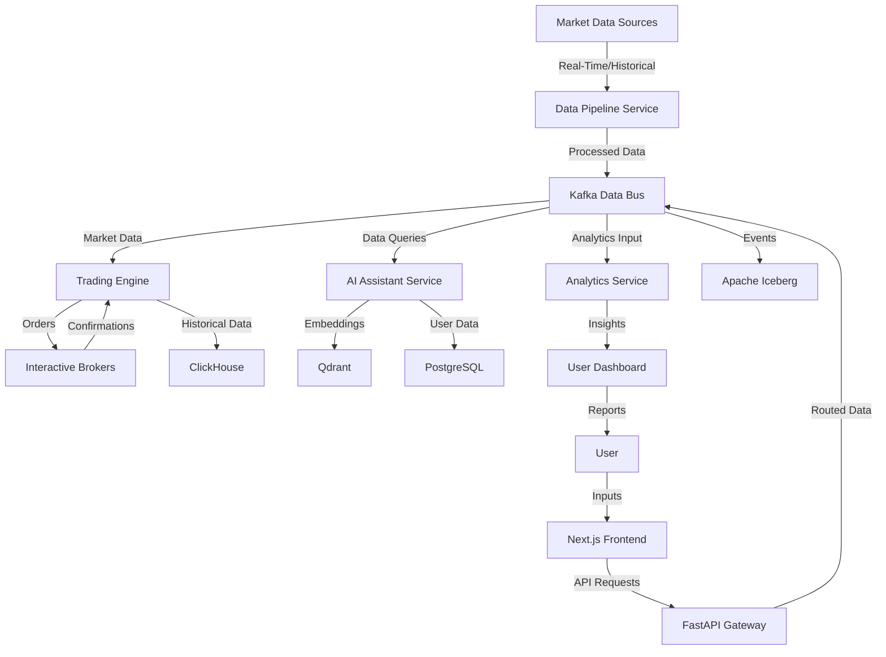
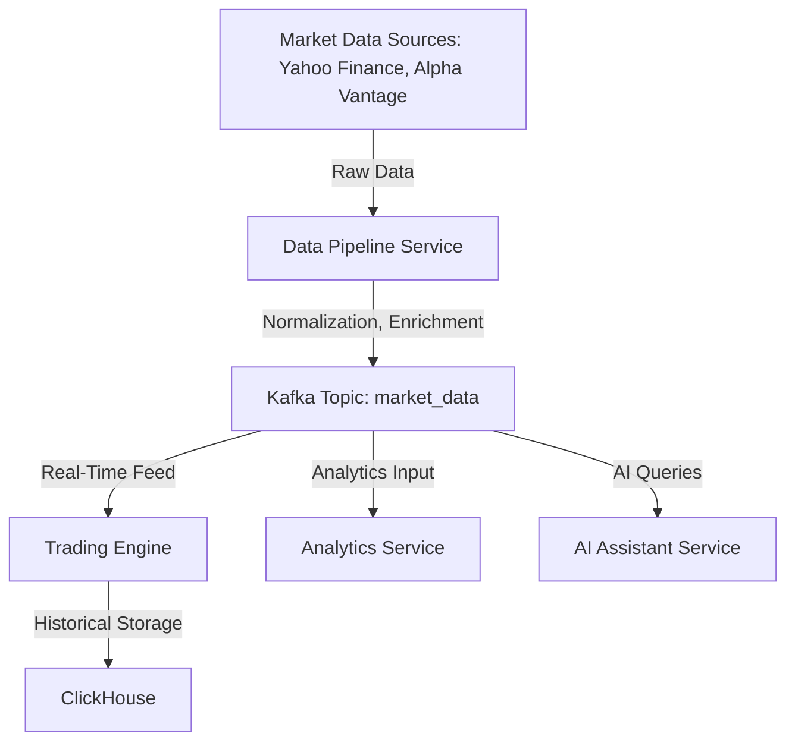
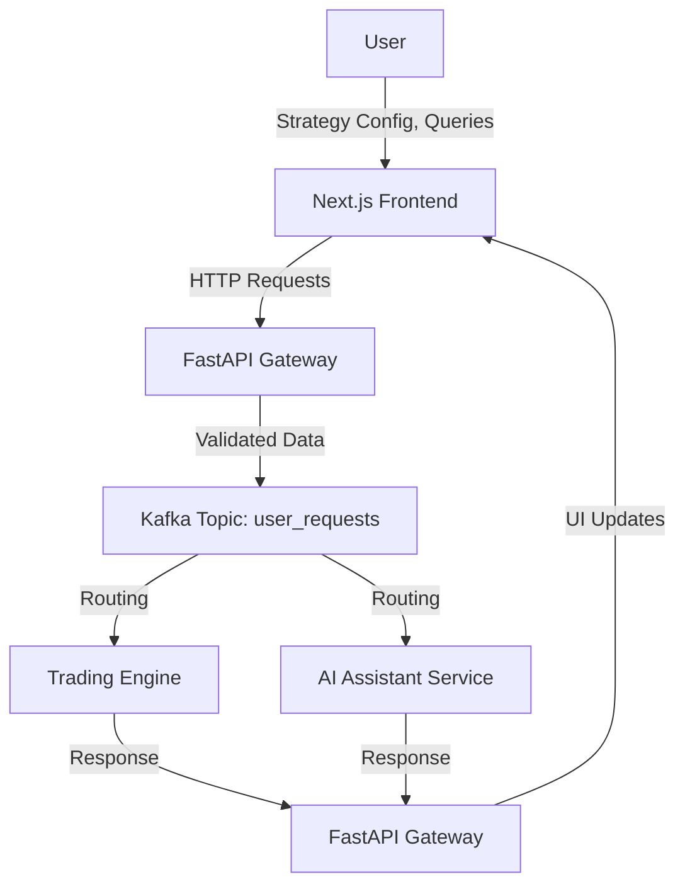
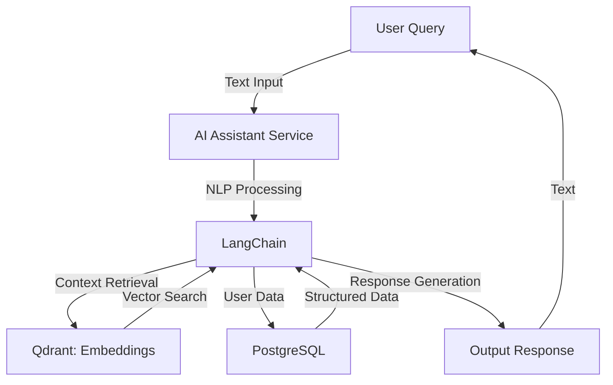
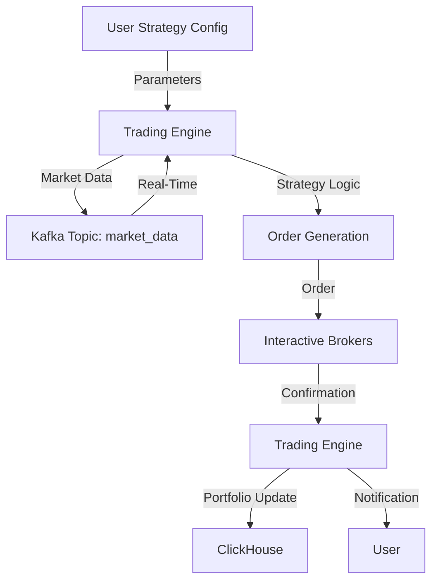
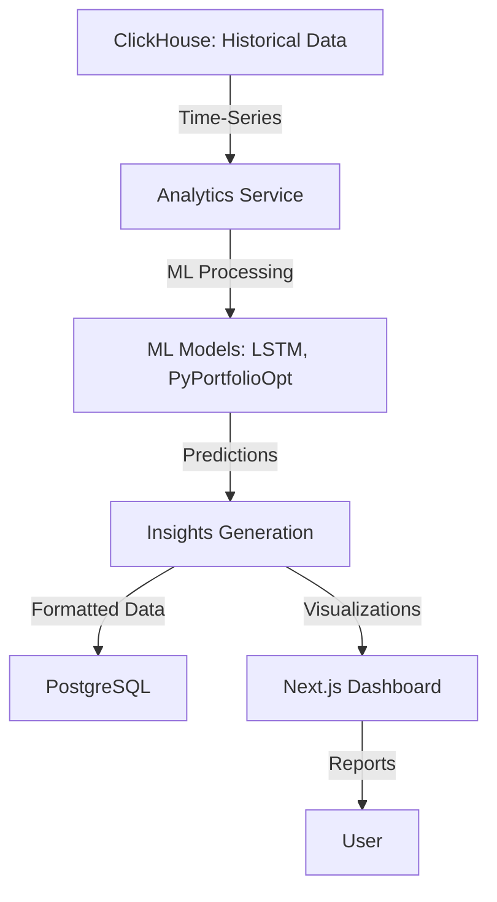
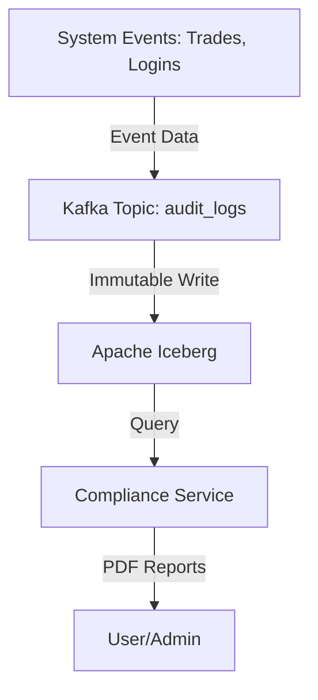

# Data Flow Document
## Algorithmic Trading System (ATS)

---

### Table of Contents
1. [Introduction](#introduction)
   - 1.1 Purpose
   - 1.2 Scope
   - 1.3 System Overview
2. [System Architecture](#system-architecture)
   - 2.1 External Data Sources
   - 2.2 Internal Components
   - 2.3 Data Storage Systems
   - 2.4 Outputs and Interfaces
3. [High-Level Data Flow Diagram](#high-level-data-flow-diagram)
4. [Detailed Data Flows](#detailed-data-flows)
   - 4.1 Market Data Flow
   - 4.2 User Interaction Flow
   - 4.3 AI Assistant Flow
   - 4.4 Strategy Execution Flow
   - 4.5 Analytics and Reporting Flow
   - 4.6 Security and Compliance Flow
5. [Data Formats and Specifications](#data-formats-and-specifications)
   - 5.1 Market Data
   - 5.2 User Data
   - 5.3 System-Generated Data
6. [Error Handling and Data Integrity](#error-handling-and-data-integrity)
   - 6.1 Error Handling Mechanisms
   - 6.2 Data Integrity Measures
7. [Performance and Scalability](#performance-and-scalability)
   - 7.1 Throughput Requirements
   - 7.2 Latency Goals
   - 7.3 Scalability Considerations
8. [Appendices](#appendices)
   - 8.1 Glossary
   - 8.2 References

---

### 1. Introduction

#### 1.1 Purpose
This Data Flow Document (DFD) outlines the movement of data within the Algorithmic Trading System (ATS), detailing how data is ingested, processed, stored, and outputted. It serves as a critical reference for developers, architects, and stakeholders to understand the system's data architecture, ensuring alignment with business requirements, functional specifications, and technical design.

#### 1.2 Scope
The DFD encompasses all primary data flows in the ATS, including:
- **Market Data**: Real-time and historical financial data ingestion and processing.
- **User Interactions**: Inputs from users via the frontend or APIs.
- **AI Assistant**: Natural language processing and response generation.
- **Strategy Execution**: Automated trading strategy execution and broker interactions.
- **Analytics and Reporting**: Data analysis, forecasting, and visualization.
- **Security and Compliance**: Audit trails and regulatory logging.

#### 1.3 System Overview
The ATS is an advanced, event-driven, microservices-based platform designed for algorithmic trading. It integrates real-time market data, user-defined trading strategies, AI-driven insights, and robust analytics. Key technologies include Apache Kafka for data streaming, NautilusTrader for trading execution, LangChain for AI capabilities, and multiple databases for storage (ClickHouse, PostgreSQL, Qdrant, Apache Iceberg).

---

### 2. System Architecture

#### 2.1 External Data Sources
- **Market Data Providers**: Yahoo Finance, Alpha Vantage, Interactive Brokers (real-time prices, historical data).
- **Brokerage Services**: Interactive Brokers for trade execution.
- **User Inputs**: Via Next.js frontend or RESTful API endpoints.

#### 2.2 Internal Components
- **Data Pipeline Service**: Ingests and preprocesses market data.
- **Trading Engine (NautilusTrader)**: Executes trading strategies and manages orders.
- **AI Assistant Service (LangChain, LangGraph)**: Processes queries and generates responses.
- **Analytics Service**: Runs machine learning models and generates reports.
- **FastAPI Gateway**: Orchestrates API requests and routes data.
- **Kafka Data Bus**: Facilitates real-time data streaming between components.

#### 2.3 Data Storage Systems
- **ClickHouse**: Time-series database for high-speed market data storage and retrieval.
- **PostgreSQL**: Relational database for user profiles, strategies, and configurations.
- **Qdrant**: Vector database for storing AI embeddings.
- **Apache Iceberg**: Immutable storage for audit trails and compliance data.

#### 2.4 Outputs and Interfaces
- **User Interface**: Next.js-based dashboards, strategy builder, and AI chat.
- **API Outputs**: RESTful endpoints for external system integration.
- **Reports**: Performance metrics, compliance logs, and analytics insights.

---

### 3. High-Level Data Flow Diagram

The following Mermaid diagram provides a high-level overview of data movement within the ATS:

---

### 4. Detailed Data Flows

#### 4.1 Market Data Flow
**Description**: This flow handles the ingestion, processing, and distribution of market data.

- **Input**: Raw market data (e.g., OHLCV - Open, High, Low, Close, Volume).
- **Processes**:
  - **Normalization**: Standardizes timestamps and formats.
  - **Enrichment**: Calculates technical indicators (e.g., SMA, RSI).
- **Output**: Processed data published to Kafka topics.
- **Storage**: Archived in ClickHouse for historical analysis.

#### 4.2 User Interaction Flow
**Description**: This flow manages user inputs and system responses.

- **Input**: User commands (e.g., strategy creation, AI queries).
- **Processes**:
  - **Validation**: Role-Based Access Control (RBAC) checks.
  - **Routing**: Directs requests to appropriate services.
- **Output**: Responses (e.g., strategy IDs, query results).
- **Storage**: User actions logged in Apache Iceberg.

#### 4.3 AI Assistant Flow
**Description**: This flow processes natural language queries and generates responses.

- **Input**: Natural language query (e.g., "Analyze AAPL trends").
- **Processes**:
  - **NLP**: LangChain interprets intent and context.
  - **Retrieval-Augmented Generation (RAG)**: Fetches relevant data from Qdrant and PostgreSQL.
- **Output**: Context-aware text response or actionable code.
- **Storage**: Query logs stored in PostgreSQL.

#### 4.4 Strategy Execution Flow
**Description**: This flow executes trading strategies and interacts with brokers.

- **Input**: Strategy parameters and real-time market data.
- **Processes**:
  - **Execution Logic**: Evaluates buy/sell conditions.
  - **Order Placement**: Submits orders via broker API.
- **Output**: Trade confirmations and updated portfolio.
- **Storage**: Trade records in ClickHouse and Iceberg.

#### 4.5 Analytics and Reporting Flow
**Description**: This flow generates insights and visualizations.

- **Input**: Historical and real-time data.
- **Processes**:
  - **Forecasting**: LSTM models predict price movements.
  - **Optimization**: PyPortfolioOpt adjusts portfolio allocations.
- **Output**: Insights and visualizations (e.g., charts, metrics).
- **Storage**: Results stored in PostgreSQL.

#### 4.6 Security and Compliance Flow
**Description**: This flow ensures auditability and regulatory compliance.

- **Input**: System events (e.g., trade executions, user logins).
- **Processes**:
  - **Logging**: Events captured and streamed via Kafka.
  - **Storage**: Immutable records written to Iceberg.
- **Output**: Compliance reports generated on demand.
- **Storage**: Permanent storage in Apache Iceberg.

---

### 5. Data Formats and Specifications

#### 5.1 Market Data
- **Format**: JSON (e.g., `{"symbol": "AAPL", "price": 150.25, "timestamp": "2023-10-15T12:00:00Z"}`).
- **Volume**: ~10,000 messages/second during peak hours.
- **Retention**: 5 years in ClickHouse.

#### 5.2 User Data
- **Format**: Structured SQL tables (e.g., `users`, `strategies`) and JSON for configurations.
- **Volume**: Moderate (e.g., 1,000 active users, 10 strategies each).
- **Retention**: Indefinite, with archival after 2 years of inactivity.

#### 5.3 System-Generated Data
- **Format**: JSON logs (e.g., `{"event": "trade", "timestamp": "2023-10-15T12:00:00Z", "details": {...}}`).
- **Volume**: High (e.g., millions of events/day).
- **Retention**: 30 days for debug logs, 7 years for compliance logs.

---

### 6. Error Handling and Data Integrity

#### 6.1 Error Handling Mechanisms
- **Data Ingestion**: Retry logic for transient failures (e.g., 3 retries with exponential backoff).
- **User Inputs**: Validation errors returned with HTTP 400 status.
- **AI Queries**: Fallback to generic responses for unparseable inputs.
- **Trading**: Circuit breakers halt execution on broker failures.

#### 6.2 Data Integrity Measures
- **Checksums**: Validate data during ingestion and transmission.
- **Idempotency**: Kafka ensures duplicate messages are handled safely.
- **Backups**: Hourly snapshots of ClickHouse and PostgreSQL (RTO: 1 hour, RPO: 5 minutes).

---

### 7. Performance and Scalability

#### 7.1 Throughput Requirements
- **Market Data**: Handle 10,000 messages/second.
- **User Requests**: Support 1,000 concurrent users.
- **Analytics**: Process 1 TB of historical data daily.

#### 7.2 Latency Goals
- **Market Data Processing**: < 10ms from ingestion to Kafka.
- **Trade Execution**: < 50ms end-to-end.
- **AI Response**: < 2 seconds for query processing.

#### 7.3 Scalability Considerations
- **Horizontal Scaling**: Kafka partitions and microservices replication.
- **Load Balancing**: FastAPI Gateway distributes requests.
- **Database Sharding**: ClickHouse for market data, PostgreSQL for user data.

---

### 8. Appendices

#### 8.1 Glossary
- **Event-Driven**: System reacts to real-time events (e.g., price changes).
- **Microservices**: Modular, independently deployable components.
- **RAG**: Retrieval-Augmented Generation for AI responses.

#### 8.2 References
- **NautilusTrader**: [https://nautilustrader.io/](https://nautilustrader.io/)
- **Kafka**: [https://kafka.apache.org/](https://kafka.apache.org/)
- **LangChain**: [https://langchain.com/](https://langchain.com/)

---

This Data Flow Document provides a comprehensive, detailed, and visual representation of data movement within the ATS, ensuring all stakeholders have a clear understanding of its architecture and operations.