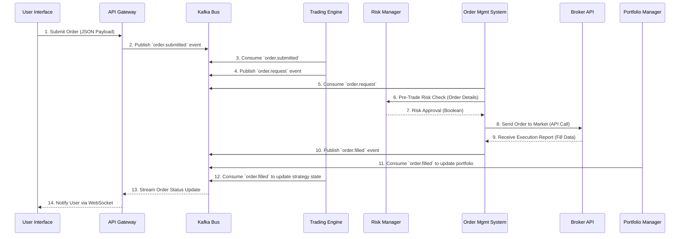

## **Data Flow Document (DFD)**

### **Nautilus Trader: Enterprise Algorithmic Trading System**

| **Version:** | 2.0             |
|:------------ |:--------------- |
| **Date:**    | August 6, 2025  |
| **Status:**  | For Review      |
| **Author:**  | Vincent Pereira |

-----

### **1.0 Introduction**

#### **1.1 Purpose**

This document details the flow of data throughout the Nautilus Trader Algorithmic Trading System (ATS). It provides a comprehensive visual and descriptive representation of how data is sourced, processed, stored, and consumed by the various components of the system. This DFD serves as a technical reference for developers, architects, and security personnel to understand the data architecture, dependencies between services, and the overall information lifecycle.

#### **1.2 Scope**

The scope of this document encompasses all major data flows within the Nautilus Trader platform. This includes:

* **External Data Ingestion:** Market data, broker data, and alternative data sources.
* **Internal Data Processing:** Communication and data exchange between all microservices via the Apache Kafka event bus.
* **Data Persistence:** How data is stored, retrieved, and managed across the polyglot persistence layer (e.g., PostgreSQL, ClickHouse, Apache Iceberg).
* **Data Consumption:** How data is delivered to user interfaces, APIs, and the AI Assistant.

#### **1.3 System Overview**

Nautilus Trader is a "Best-of-Breed" algorithmic trading platform built on a **cloud-native, event-driven, microservices architecture**. The system is designed for high performance, scalability, and enterprise-grade security. Data is the lifeblood of the system, with **Apache Kafka** serving as the central nervous system for all real-time communication, ensuring services are decoupled and data flow is resilient and replayable.

-----

### **2.0 Data Flow Diagrams (DFDs)**

#### **2.1 Context Diagram (Level 0)**

The Level 0 DFD shows the entire Nautilus Trader system as a single process, illustrating its interaction with external entities.

```mermaid
graph TD
    subgraph External Entities
        A[User<br>(Retail/Quant Trader)]
        B[Market Data Providers<br>(e.g., Polygon, Bloomberg)]
        C[Brokerage Platforms<br>(e.g., Interactive Brokers, Alpaca)]
        D[Alternative Data Sources<br>(News APIs, Social Media)]
        E[Compliance/Regulatory Bodies]
    end

    subgraph System
        S(Nautilus Trader<br>Algorithmic Trading System)
    end

    A -- User Commands & Queries --> S
    S -- Real-Time Dashboards & Notifications --> A

    B -- Real-Time & Historical Market Data --> S
    D -- News Feeds & Sentiment Data --> S

    C -- Account Data & Execution Fills --> S
    S -- Trade Orders --> C

    S -- Automated Compliance Reports --> E
```

**Description of Flows:**

* **User Commands & Queries:** Users interact with the system via the UI or API to manage strategies, place orders, and query data.
* **Real-Time Dashboards & Notifications:** The system provides real-time portfolio updates, market data, and alerts back to the user.
* **Market Data:** The system ingests high-frequency real-time and historical data from various providers.
* **Alternative Data:** Unstructured data like news is ingested for sentiment analysis.
* **Trade Orders:** The system sends validated trade orders to external brokers for execution.
* **Account Data & Fills:** Brokers send back account updates and trade execution confirmations (fills).
* **Compliance Reports:** The system generates and provides reports for regulatory bodies.

-----

#### **2.2 High-Level Data Flow Diagram (Level 1)**

This DFD decomposes the system into its core microservices and shows the primary data flows between them, the central Kafka event bus, and the various data stores.

```mermaid
graph TD
    subgraph Client Layer
        UI[User Interface<br>(Web, Mobile, Desktop)]
        API[External API Clients]
    end

    subgraph API Gateway
        GW[API Gateway<br>(FastAPI, GraphQL, WebSocket)]
    end

    subgraph Event Bus
        KAFKA[Apache Kafka & Schema Registry]
    end

    subgraph Microservices
        MD[Market Data Service]
        AI[Agentic AI Assistant]
        TE[Trading Engine<br>(NautilusTrader)]
        OMS[Order Management System]
        RM[Risk Manager]
        PM[Portfolio Manager]
    end

    subgraph Data Stores
        TSDB[(Time-Series DB<br>ClickHouse / InfluxDB)]
        VDB[(Vector DB<br>Qdrant / pgvector)]
        RDB[(Relational DB<br>PostgreSQL)]
        CACHE[(Cache<br>Redis)]
        AUDIT[(Immutable Storage<br>Apache Iceberg)]
    end

    subgraph External Integrations
        BROKER[Broker APIs]
        DATA_PROVIDER[Market Data Providers]
    end

    UI & API --> GW

    GW -- User Commands --> KAFKA
    GW -- Real-Time Data Request --> MD
    MD -- Real-Time Data Stream --> GW

    DATA_PROVIDER -- Raw Market Data --> MD
    MD -- Parsed Market Data --> KAFKA
    KAFKA -- Market Data Event --> TE
    KAFKA -- Market Data Event --> AI
    KAFKA -- Market Data Event --> RM
    MD -- Historical Market Data --> TSDB

    KAFKA -- User Query --> AI
    AI -- AI Insights & Document Embeddings --> VDB
    AI -- AI-Generated Signals --> KAFKA

    TE -- Trade Signal / Order Request --> KAFKA
    KAFKA -- Order Request --> OMS

    OMS -- Pre-Trade Check Request --> RM
    RM -- Risk Check Response --> OMS
    OMS -- Validated Order --> BROKER
    BROKER -- Fill Confirmation --> OMS
    OMS -- Order Status Update --> KAFKA

    KAFKA -- Order Fill Event --> PM
    KAFKA -- Order Fill Event --> TE

    PM -- Portfolio State --> RDB
    PM -- Live Portfolio Value --> CACHE
    TE -- Strategy State --> RDB
    OMS -- Order Records --> RDB

    KAFKA -- All Events for Audit --> AUDIT
```

-----

#### **2.3 Order Management Flow (Level 2)**

This DFD details the data flow for the critical process of submitting and executing a trade order.



-----

### **3.0 Data Store Specifications**

This section describes the purpose and structure of each data store within the system.

| Data Store               | Technology                | Purpose                                                                                      | Data Stored                                                                     | Written By                     | Read By                                    |
|:------------------------ |:------------------------- |:-------------------------------------------------------------------------------------------- |:------------------------------------------------------------------------------- |:------------------------------ |:------------------------------------------ |
| **Relational Database**  | **PostgreSQL**            | Stores transactional and relational data that requires strong consistency.                   | User accounts, strategy configurations, order records, portfolio snapshots.     | OMS, PM, TE                    | All Services, API Gateway                  |
| **Time-Series Database** | **ClickHouse** / InfluxDB | Optimized for high-speed ingestion and querying of time-stamped market data.                 | Historical tick and bar data (OHLCV) for all asset classes.                     | Market Data Service            | Trading Engine (Backtesting), AI Assistant |
| **Vector Database**      | **Qdrant** / **pgvector** | Stores high-dimensional vector embeddings for semantic search and AI applications.           | Document embeddings (from RAG), model feature vectors.                          | AI Assistant                   | AI Assistant                               |
| **Immutable Storage**    | **Apache Iceberg**        | Provides a long-term, immutable, and auditable transaction log for compliance.               | A copy of every event that passes through Kafka (trades, orders, logins, etc.). | Kafka Sink Connector           | Compliance Service, Audit Tools            |
| **In-Memory Cache**      | **Redis**                 | Provides low-latency access to frequently read data to reduce database load.                 | User sessions, real-time portfolio values, market data snapshots.               | Portfolio Manager, API Gateway | API Gateway, UI Backend                    |
| **Event Bus / Log**      | **Apache Kafka**          | The central, durable event streaming platform for all real-time inter-service communication. | All real-time events: market data, orders, fills, system alerts, AI insights.   | All Services                   | All Services                               |

-----

### **4.0 Data Dictionary**

This dictionary defines the structure of key data elements flowing through the system.

| Data Element          | Description                                                            | Fields & Data Types                                                                                                                                          | Source / Destination                      |
|:--------------------- |:---------------------------------------------------------------------- |:------------------------------------------------------------------------------------------------------------------------------------------------------------ |:----------------------------------------- |
| **UserCommand**       | A command initiated by a user from the UI or API.                      | `command_type: enum`, `payload: JSON`, `user_id: string`, `timestamp: long`                                                                                  | UI -\> Kafka -\> Services                 |
| **MarketDataTick**    | A single trade event from a market data feed.                          | `symbol: string`, `price: double`, `volume: long`, `timestamp: long`, `exchange: string`                                                                     | Market Data Service -\> Kafka -\> TE, AI  |
| **OrderRequest**      | A request to place a new trade order, generated by a strategy or user. | `order_id: string`, `account_id: string`, `symbol: string`, `side: enum (BUY/SELL)`, `type: enum (MARKET/LIMIT)`, `quantity: double`, `limit_price: double?` | Trading Engine -\> Kafka -\> OMS          |
| **OrderStatusUpdate** | An event representing a change in an order's state.                    | `order_id: string`, `status: enum (PENDING, FILLED, CANCELED)`, `filled_quantity: double`, `avg_fill_price: double?`, `reason: string?`                      | OMS -\> Kafka -\> All Services, UI        |
| **PortfolioState**    | A snapshot of a user's portfolio.                                      | `account_id: string`, `total_value: double`, `cash: double`, `positions: array[Position]`, `timestamp: long`                                                 | Portfolio Manager -\> PostgreSQL, Redis   |
| **Position**          | Details of a single asset holding within a portfolio.                  | `symbol: string`, `quantity: double`, `avg_entry_price: double`, `market_value: double`, `unrealized_pnl: double`                                            | (Part of PortfolioState)                  |
| **AIInsight**         | An analytical insight or prediction generated by the AI Assistant.     | `insight_id: string`, `type: enum (Sentiment, Forecast, Anomaly)`, `symbol: string`, `confidence: double`, `details: JSON`, `timestamp: long`                | AI Assistant -\> Kafka -\> UI, TE         |
| **AuditEvent**        | A generic, immutable event logged for compliance.                      | `event_id: UUID`, `timestamp: long`, `service_name: string`, `user_id: string`, `action: string`, `details: JSON`                                            | All Services -\> Kafka -\> Apache Iceberg |

-----

### **5.0 Data Security and Compliance**

Data security is paramount and is implemented at every layer of the system, adhering to a **Zero-Trust** model.

* **Data in Transit:**
  
  * **External:** All communication with external clients (UI, APIs) and services (brokers) is encrypted using **TLS 1.3**.
  * **Internal:** All service-to-service communication within the Kubernetes cluster, including traffic to and from Kafka, is secured with **mutual TLS (mTLS)**, enforced by the **Istio** service mesh.

* **Data at Rest:**
  
  * All sensitive data stored in databases (PostgreSQL, ClickHouse) and object storage (S3 for Iceberg) is encrypted using **AES-256**.
  * Sensitive credentials, such as broker API keys and database passwords, are not stored in code or configuration files. They are managed and injected at runtime using a secure secret management solution like **HashiCorp Vault**.

* **Compliance and Auditability:**
  
  * All system actions, from user logins to trade executions, are captured as immutable events and stored in **Apache Iceberg**. This provides a complete, verifiable audit trail to meet regulatory requirements (e.g., MiFID II, SOX).
  * Access to data is strictly controlled via **Role-Based Access Control (RBAC)**, ensuring users and services can only access the data necessary for their function.
