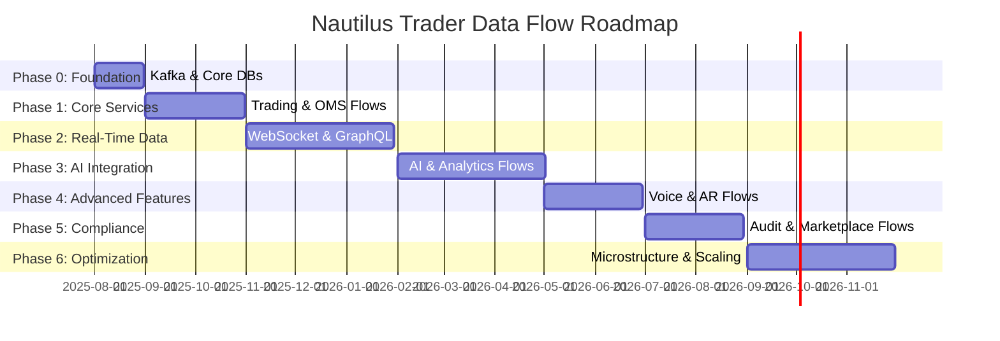

## **Data Flow Document (DFD)**

### **Nautilus Trader: Enterprise Algorithmic Trading System**

| **Version:** | 3.0                          |
|:------------ |:---------------------------- |
| **Date:**    | August 21, 2025             |
| **Status:**  | Draft                       |
| **Author:**  | Vincent Pereira             |

---

### **1.0 Introduction**

#### **1.1 Purpose**

This Data Flow Document (DFD) provides a comprehensive and detailed description of the data flows within the Nautilus Trader Algorithmic Trading System (ATS). It serves as a technical reference for developers, system architects, DevOps engineers, and compliance officers to understand how data is sourced, processed, stored, and consumed across the system's microservices, data stores, and external integrations. The document maps the lifecycle of data, from ingestion to delivery, ensuring traceability, performance, and compliance with regulatory standards (e.g., MiFID II, SOX, GDPR). It incorporates all features from the updated "Features, Phases & Integration Strategy - Algorithmic Trading System" document, including no-code strategy development, AI-driven analytics, voice trading, augmented reality (AR) interfaces, and the Strategy Marketplace.

#### **1.2 Scope**

This DFD covers all major data flows in the Nautilus Trader ATS, including:

- **External Data Ingestion:** Market data (Yahoo Finance, Finnhub, etc.), broker data (Interactive Brokers, Alpaca, etc.), and alternative data (news, social media, SEC filings).
- **Internal Data Processing:** Event-driven communication between microservices via Apache Kafka, including trading, AI analytics, risk management, and portfolio optimization.
- **Data Persistence:** Storage in a polyglot persistence layer (PostgreSQL/pgvector, ClickHouse, Qdrant, Apache Iceberg, DuckDB, Redis).
- **Data Consumption:** Delivery to user interfaces (web, mobile, desktop, PWA), APIs (REST, GraphQL, WebSocket, gRPC, FIX), and AI-driven outputs (predictions, sentiment analysis).
- **Specialized Data Flows:** Support for voice trading, AR visualizations, market microstructure analysis, and Strategy Marketplace interactions.

#### **1.3 System Overview**

Nautilus Trader is a cloud-native, event-driven, microservices-based algorithmic trading platform designed for high performance, scalability, and enterprise-grade security. It supports multi-asset trading (stocks, ETFs, futures, options, forex, commodities, cryptocurrencies) and caters to diverse users, from non-technical retail traders to professional quants. The platform leverages a "Best-of-Breed" integration strategy, incorporating open-source technologies (NautilusTrader, LangChain, PyPortfolioOpt, QuantLib, etc.) and a robust Apache Kafka event bus as the central nervous system for real-time data flows. Data flows are secured with TLS 1.3 (transit) and AES-256 (at rest), with immutable audit trails in Apache Iceberg ensuring regulatory compliance.

**Mermaid Diagram: System Overview**

```mermaid
graph TD
    subgraph External Entities
        USER[User<br>(Retail/Quant Trader)]
        BROKER[Broker APIs<br>(IBKR, Alpaca, OANDA, Coinbase)]
        DATA[Market Data Providers<br>(Yahoo Finance, Finnhub, etc.)]
        ALT[Alternative Data<br>(News, Social Media, SEC Filings)]
        REG[Regulatory Bodies<br>(SEC, ESMA)]
    end

    subgraph Nautilus Trader System
        S(Nautilus Trader ATS)
    end

    USER -->|Commands & Queries| S
    S -->|Dashboards, Alerts, AR| USER
    DATA -->|Market Data| S
    ALT -->|News & Sentiment| S
    BROKER -->|Account Data & Fills| S
    S -->|Trade Orders| BROKER
    S -->|Compliance Reports| REG
```

---

### **2.0 Data Flow Diagrams (DFDs)**

#### **2.1 Context Diagram (Level 0)**

The Level 0 DFD represents the Nautilus Trader ATS as a single process interacting with external entities.

```mermaid
graph TD
    subgraph External Entities
        USER[User<br>(Retail/Quant Trader)]
        BROKER[Broker APIs<br>(IBKR, Alpaca, OANDA, Coinbase)]
        DATA[Market Data Providers<br>(Yahoo Finance, Finnhub, etc.)]
        ALT[Alternative Data<br>(News, Social Media, SEC Filings)]
        REG[Regulatory Bodies<br>(SEC, ESMA)]
    end

    subgraph System
        S(Nautilus Trader ATS)
    end

    USER -->|Commands, Queries, Voice| S
    S -->|Dashboards, Alerts, AR Visuals| USER
    DATA -->|Real-Time & Historical Data| S
    ALT -->|News, Social Media, SEC Filings| S
    BROKER -->|Account Data, Execution Fills| S
    S -->|Trade Orders (Market, Limit, VWAP)| BROKER
    S -->|Compliance Reports (MiFID II, SOX)| REG
```

**Description of Flows:**

- **Commands, Queries, Voice:** Users interact via web, mobile, desktop, PWA, or voice interfaces to manage strategies, place orders, query portfolios, or request AI insights.
- **Dashboards, Alerts, AR Visuals:** The system delivers real-time portfolio updates, risk alerts, market data, and AR visualizations (via WebXR).
- **Real-Time & Historical Data:** Market data providers supply tick, bar, and options chain data (>5 years for backtesting).
- **News, Social Media, SEC Filings:** Alternative data feeds sentiment analysis and research queries.
- **Account Data, Execution Fills:** Brokers provide account balances and trade confirmations.
- **Trade Orders:** The system submits orders (Market, Limit, Stop, VWAP, TWAP, Iceberg) to brokers.
- **Compliance Reports:** Automated reports are generated for regulatory compliance.

#### **2.2 High-Level Data Flow Diagram (Level 1)**

The Level 1 DFD decomposes the system into microservices, showing data flows through Apache Kafka and data stores.

```mermaid
graph TD
    subgraph Client Layer
        UI[User Interface<br>(Web, Mobile, Desktop, PWA)]
        API[External API Clients<br>(REST, GraphQL, WebSocket, FIX)]
        VOICE[Voice Interface<br>(Whisper)]
        AR[AR Interface<br>(WebXR)]
    end

    subgraph API Gateway
        GW[API Gateway<br>(NGINX, Istio, Keycloak)]
    end

    subgraph Event Bus
        KAFKA[Apache Kafka & Schema Registry]
    end

    subgraph Microservices
        MD[Market Data Service]
        AI[Agentic AI Assistant<br>(LangGraph, RAGFlow)]
        TE[Trading Engine<br>(NautilusTrader)]
        OMS[Order Management System<br>(QuickFIX/J)]
        RM[Risk Manager<br>(PyOD, SHAP)]
        PM[Portfolio Manager<br>(PyPortfolioOpt)]
        SCANNER[Market Scanner]
        CSBOT[Customer Service Bot<br>(Lobe Chat)]
        MARKETPLACE[Strategy Marketplace]
    end

    subgraph Data Stores
        TSDB[(Time-Series DB<br>ClickHouse)]
        VDB[(Vector DB<br>Qdrant/pgvector)]
        RDB[(Relational DB<br>PostgreSQL)]
        CACHE[(Cache<br>Redis)]
        AUDIT[(Immutable Storage<br>Apache Iceberg)]
        OFFLINE[(Offline Analytics<br>DuckDB)]
    end

    subgraph External Integrations
        BROKER[Broker APIs]
        DATA_PROVIDER[Market Data Providers]
        ALT_DATA[Alternative Data Sources]
    end

    UI & API & VOICE & AR --> GW
    GW -->|Authenticated Requests| KAFKA
    GW -->|Real-Time Streams| MD
    MD -->|Real-Time Data| GW
    MD -->|Parsed Market Data| KAFKA
    DATA_PROVIDER -->|Raw Market Data| MD
    ALT_DATA -->|News & Social Media| AI
    KAFKA -->|Market Data| TE
    KAFKA -->|Market Data| AI
    KAFKA -->|Market Data| RM
    KAFKA -->|Market Data| SCANNER
    MD -->|Historical Data| TSDB
    KAFKA -->|User Queries| AI
    AI -->|Insights & Embeddings| KAFKA
    AI -->|Vector Embeddings| VDB
    TE -->|Order Requests| KAFKA
    OMS -->|Order Status| KAFKA
    OMS -->|Orders| BROKER
    BROKER -->|Fills & Account Data| OMS
    RM -->|Risk Metrics & Alerts| KAFKA
    PM -->|Portfolio State| KAFKA
    SCANNER -->|Scan Results| KAFKA
    CSBOT -->|Support Responses| KAFKA
    MARKETPLACE -->|Strategy Metadata| KAFKA
    KAFKA -->|Persistent Data| RDB
    KAFKA -->|Time-Series Data| TSDB
    KAFKA -->|Audit Trails| AUDIT
    KAFKA -->|Cache Updates| CACHE
    PM -->|Offline Analytics| OFFLINE
```

**Description of Flows:**

- **Authenticated Requests:** Users and API clients send commands (e.g., place order, run backtest) via the API Gateway, authenticated by Keycloak (OAuth 2.0/OIDC).
- **Real-Time Streams:** Market Data Service streams tick/bar data to clients via WebSocket.
- **Raw Market Data:** Providers (Yahoo Finance, Finnhub, etc.) supply tick, bar, and options data.
- **Parsed Market Data:** Market Data Service normalizes data and publishes to Kafka (`market.data.tick.*`).
- **News & Social Media:** Alternative data feeds AI Assistant for sentiment analysis.
- **Market Data Events:** Kafka distributes market data to Trading Engine, AI Assistant, Risk Manager, and Market Scanner.
- **Historical Data:** Market Data Service stores historical data in ClickHouse for backtesting.
- **User Queries:** AI Assistant processes queries (e.g., “Backtest VW MACD on AAPL”) via Kafka.
- **AI Insights & Embeddings:** AI Assistant generates predictions, sentiment scores, and embeddings, published to Kafka and stored in Qdrant/pgvector.
- **Order Requests:** Trading Engine submits orders to OMS via Kafka.
- **Order Status & Fills:** OMS publishes order updates and broker fills to Kafka.
- **Risk Metrics & Alerts:** Risk Manager calculates VaR, expected shortfall, and anomalies, publishing to Kafka.
- **Portfolio State:** Portfolio Manager updates portfolio data (value, positions) to Kafka and Redis.
- **Scan Results:** Market Scanner publishes symbol rankings based on custom indicators.
- **Support Responses:** Customer Service Bot responds to user queries via Kafka.
- **Strategy Metadata:** Strategy Marketplace manages strategy sharing and copy trading data.
- **Persistent Data:** Relational data (users, strategies) stored in PostgreSQL.
- **Audit Trails:** All actions logged in Apache Iceberg for compliance.
- **Cache Updates:** Redis caches session data and portfolio snapshots.
- **Offline Analytics:** DuckDB supports offline analytics in desktop apps.

---

### **3.0 Data Sources and Sinks**

| Data Store               | Technology                | Purpose                                                                                              | Data Types                                                                                   | Sources                        | Sinks                              |
|:------------------------ |:------------------------- |:---------------------------------------------------------------------------------------------------- |:------------------------------------------------------------------------------------------- |:------------------------------ |:---------------------------------- |
| **Relational DB**        | PostgreSQL/pgvector       | Stores structured data for user management, strategy metadata, and vector embeddings for RAG.         | User profiles, accounts, strategy metadata, embeddings.                                      | API Gateway, AI Assistant, OMS | UI, API, AI Assistant              |
| **Time-Series DB**       | ClickHouse                | Stores high-frequency market data and backtest results for fast querying.                            | Tick data, bar data, options chains, backtest results.                                       | Market Data Service, TE       | Backtesting, Analytics             |
| **Vector DB**            | Qdrant/pgvector           | Stores embeddings for RAG-based AI queries and sentiment analysis.                                   | Document embeddings, sentiment vectors.                                                     | AI Assistant                   | AI Assistant, CS Bot               |
| **Immutable Storage**    | Apache Iceberg            | Provides immutable audit trails for regulatory compliance.                                           | Trade events, order events, user actions, system logs.                                       | All Services via Kafka         | Compliance Service, Audit Tools    |
| **In-Memory Cache**      | Redis                     | Low-latency access to frequently used data (sessions, portfolio snapshots).                          | Session tokens, portfolio snapshots, market data snapshots.                                  | PM, API Gateway               | UI, API Gateway                    |
| **Offline Analytics**    | DuckDB                    | Supports offline analytics in desktop apps.                                                          | Historical market data, portfolio analytics, backtest results.                               | PM, Market Data Service       | Desktop App                        |
| **Event Bus**            | Apache Kafka              | Central event streaming platform for real-time inter-service communication.                          | All events: market data, orders, AI insights, risk alerts, support responses, marketplace data. | All Services                   | All Services                       |

---

### **4.0 Data Dictionary**

| Data Element          | Description                                                            | Fields & Data Types                                                                                                                                          | Source / Destination                      |
|:--------------------- |:---------------------------------------------------------------------- |:------------------------------------------------------------------------------------------------------------------------------------------------------------ |:----------------------------------------- |
| **UserCommand**       | User-initiated command (UI, API, voice).                               | `command_type: enum (ORDER, BACKTEST, QUERY)`, `payload: JSON`, `user_id: string`, `timestamp: string (ISO 8601)`, `voice_text: string?`                     | UI, Voice, API -> Kafka -> Services       |
| **MarketDataTick**    | Single trade event from market feed.                                   | `symbol: string`, `price: double`, `volume: long`, `timestamp: string`, `exchange: string`, `bid: double?`, `ask: double?`                                  | Market Data Service -> Kafka -> TE, AI, RM, SCANNER |
| **MarketDataBar**     | Aggregated bar data (OHLCV).                                           | `symbol: string`, `open: double`, `high: double`, `low: double`, `close: double`, `volume: long`, `timestamp: string`                                     | Market Data Service -> Kafka -> TE, AI     |
| **OrderRequest**      | Request to place a trade order.                                        | `order_id: string`, `account_id: string`, `symbol: string`, `side: enum (BUY/SELL)`, `type: enum (MARKET/LIMIT/STOP/VWAP/TWAP/ICEBERG)`, `quantity: double`, `limit_price: double?`, `stop_price: double?`, `strategy_id: string?` | TE -> Kafka -> OMS                |
| **OrderStatusUpdate** | Change in order state.                                                 | `order_id: string`, `status: enum (PENDING/FILLED/PARTIALLY_FILLED/CANCELED)`, `filled_quantity: double`, `avg_fill_price: double?`, `reason: string?`, `timestamp: string` | OMS -> Kafka -> UI, PM, RM        |
| **PortfolioState**    | Snapshot of user portfolio.                                            | `account_id: string`, `total_value: double`, `cash: double`, `positions: array[Position]`, `unrealized_pnl: double`, `realized_pnl_today: double`, `timestamp: string` | PM -> Kafka -> Redis, PostgreSQL  |
| **Position**          | Asset holding in portfolio.                                            | `symbol: string`, `quantity: double`, `avg_entry_price: double`, `market_value: double`, `unrealized_pnl: double`                                            | (Part of PortfolioState)                  |
| **AIInsight**         | AI-generated prediction or insight.                                    | `insight_id: string`, `type: enum (PREDICTION/SENTIMENT/ANOMALY)`, `symbol: string`, `confidence: double`, `details: JSON`, `timestamp: string`              | AI -> Kafka -> UI, TE, RM                 |
| **RiskAlert**         | Risk threshold breach or anomaly.                                      | `alert_id: string`, `type: enum (VAR/ANOMALY/EXPOSURE)`, `symbol: string?`, `message: string`, `value: double`, `timestamp: string`                        | RM -> Kafka -> UI, PM                     |
| **ScanResult**        | Market Scanner output.                                                 | `symbol: string`, `score: double`, `indicators: JSON (e.g., {"vw_macd": 0.5})`, `timestamp: string`                                                         | SCANNER -> Kafka -> UI                    |
| **SupportResponse**   | Customer Service Bot response.                                         | `query_id: string`, `response: string`, `confidence: double`, `timestamp: string`                                                                            | CSBOT -> Kafka -> UI                      |
| **StrategyMetadata**  | Strategy details for Marketplace.                                      | `strategy_id: string`, `name: string`, `asset_class: enum`, `performance: JSON (e.g., {"sharpe_ratio": 1.5})`, `creator_id: string`, `timestamp: string`     | MARKETPLACE -> Kafka -> PostgreSQL, UI    |
| **AuditEvent**        | Immutable event for compliance.                                        | `event_id: string`, `timestamp: string`, `service_name: string`, `user_id: string`, `action: string`, `details: JSON`                                        | All Services -> Kafka -> Apache Iceberg   |

---

### **5.0 Data Security and Compliance**

The Nautilus Trader ATS implements a zero-trust security model to protect data integrity and confidentiality.

- **Data in Transit:**
  - **External:** All client (UI, API) and external (broker, data provider) communications use TLS 1.3.
  - **Internal:** Service-to-service communication within Kubernetes uses mutual TLS (mTLS) via Istio service mesh.
  - **Kafka:** Kafka brokers enforce TLS 1.3 and SASL/SCRAM for authentication.

- **Data at Rest:**
  - **Encryption:** All databases (PostgreSQL, ClickHouse, Qdrant) and storage (S3 for Iceberg) use AES-256 encryption.
  - **Secrets Management:** API keys, database credentials, and TLS certificates are stored in HashiCorp Vault with short-lived tokens.
  - **Access Control:** RBAC via Keycloak ensures least-privilege access to data.

- **Compliance and Auditability:**
  - **Audit Trails:** Apache Iceberg stores immutable logs of all actions (trades, orders, user logins) for MiFID II, SOX, and GDPR compliance.
  - **Data Retention:** Configurable retention policies (e.g., 7 years for audit trails) enforced via Iceberg.
  - **User and Entity Behavior Analytics (UEBA):** PyOD detects anomalies in data flows (<5% false positives).

---

### **6.0 Data Flow Scenarios**

#### **6.1 Strategy Development (No-Code)**

1. User creates a strategy using Blockly in the web UI.
2. UI sends `UserCommand` (Blockly JSON) to API Gateway.
3. API Gateway publishes to Kafka (`strategy.create`).
4. AI Assistant validates and converts JSON to Python code, storing in PostgreSQL.
5. Strategy metadata is published to Kafka (`strategy.created`) and cached in Redis.

#### **6.2 Backtesting**

1. User initiates backtest via UI/API (`POST /backtest`).
2. API Gateway publishes `UserCommand` to Kafka (`backtest.run`).
3. Trading Engine fetches historical data from ClickHouse, runs event-driven backtest (NautilusTrader).
4. Results (Sharpe Ratio, P&L) are stored in ClickHouse and published to Kafka (`backtest.completed`).
5. UI receives results via WebSocket.

#### **6.3 Live Trading**

1. Trading Engine generates `OrderRequest` based on strategy signals.
2. Published to Kafka (`order.submitted`).
3. OMS performs pre-trade risk checks (via Risk Manager) and routes to broker.
4. Broker sends `ExecutionReport` to OMS, published to Kafka (`order.filled`).
5. Portfolio Manager updates `PortfolioState` in Redis and PostgreSQL.
6. Audit trail logged in Apache Iceberg.

#### **6.4 AI-Driven Analytics**

1. User queries AI Assistant (“Predict AAPL price for tomorrow”).
2. API Gateway publishes `UserCommand` to Kafka (`ai.query`).
3. AI Assistant (LangGraph) retrieves embeddings from Qdrant/pgvector, runs LSTM model.
4. Prediction (`AIInsight`) published to Kafka (`ai.prediction`) with >90% accuracy.
5. UI receives insight via WebSocket.

#### **6.5 Voice Trading**

1. User issues voice command (“Buy 100 AAPL at market”).
2. Voice Interface (Whisper) converts to text (>95% accuracy), sends to API Gateway.
3. API Gateway publishes `UserCommand` to Kafka (`order.voice`).
4. OMS processes as `OrderRequest`, follows live trading flow.
5. Response published to Kafka (`order.status`) and streamed to user.

#### **6.6 AR Visualization**

1. User requests AR visualization for portfolio.
2. API Gateway publishes `UserCommand` to Kafka (`ar.visualize`).
3. Portfolio Manager fetches data from Redis, formats for WebXR.
4. Data streamed to AR Interface via WebSocket (`ar.data`).

#### **6.7 Strategy Marketplace**

1. User publishes strategy to Marketplace via UI.
2. API Gateway publishes `StrategyMetadata` to Kafka (`marketplace.publish`).
3. Marketplace Service stores metadata in PostgreSQL, publishes to Kafka (`marketplace.listed`).
4. Other users subscribe via UI, triggering `UserCommand` to copy strategy.

---

### **7.0 Phased Implementation**

The data flow infrastructure aligns with the six-phase roadmap:

- **Phase 0: Foundation**
  - Set up Kafka, PostgreSQL, ClickHouse, and Redis.
  - Implement Market Data Service and basic UI data flows.

- **Phase 1: Core Services**
  - Deploy Trading Engine, OMS, and Portfolio Manager with Kafka integration.
  - Enable REST and WebSocket APIs.

- **Phase 2: Real-Time Data**
  - Integrate WebSocket streams for market data and portfolio updates.
  - Deploy GraphQL subscriptions.

- **Phase 3: AI Integration**
  - Deploy AI Assistant (LangGraph, RAGFlow) with Qdrant/pgvector.
  - Enable predictive analytics and sentiment analysis flows.

- **Phase 4: Advanced Features**
  - Implement voice trading (Whisper) and AR (WebXR) data flows.
  - Deploy FIX API for institutional trading.

- **Phase 5: Compliance & Marketplace**
  - Configure Apache Iceberg for audit trails.
  - Deploy Strategy Marketplace data flows.

- **Phase 6: Optimization**
  - Enable market microstructure analysis data flows.
  - Optimize for >10,000 concurrent users and >1M Kafka messages/second.

**Mermaid Gantt Chart:**



---

This Data Flow Document provides a detailed and comprehensive mapping of data flows in the Nautilus Trader ATS, incorporating all features from the updated "Features, Phases & Integration Strategy - Algorithmic Trading System" document. It uses Mermaid diagrams to visualize flows and includes technical details to ensure clarity for development and compliance.

