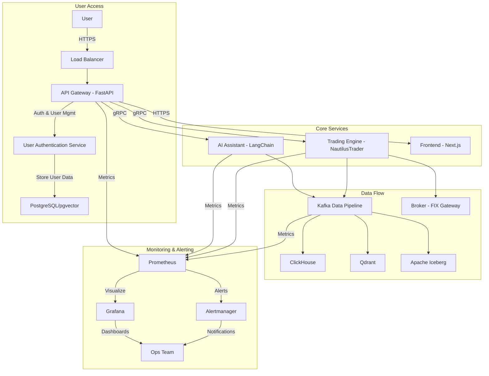
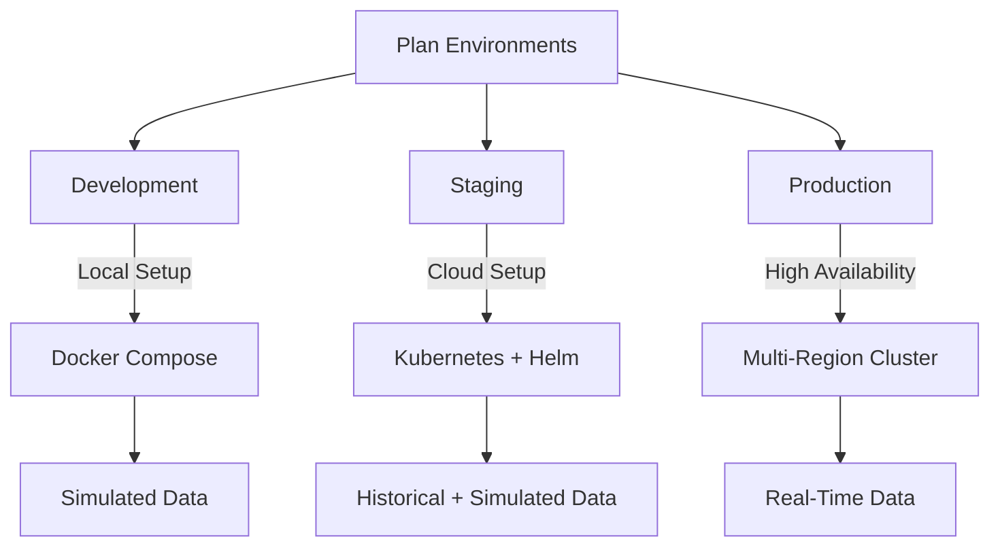
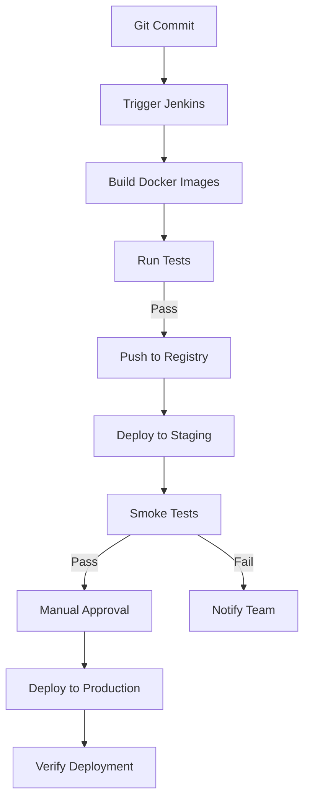

# Deployment Guide  
## Algorithmic Trading System (ATS)  

---

### Table of Contents
- [Deployment Guide](#deployment-guide)
  - [Algorithmic Trading System (ATS)](#algorithmic-trading-system-ats)
    - [Table of Contents](#table-of-contents)
    - [1. Introduction](#1-introduction)
      - [1.1 Purpose](#11-purpose)
      - [1.2 Scope](#12-scope)
      - [1.3 System Overview](#13-system-overview)
    - [2. Deployment Architecture](#2-deployment-architecture)
      - [2.1 Cloud Environment](#21-cloud-environment)
      - [2.2 Microservices and Containers](#22-microservices-and-containers)
      - [2.3 Networking and Security](#23-networking-and-security)
      - [2.4 Data Storage and Management](#24-data-storage-and-management)
      - [Architecture Diagram](#architecture-diagram)
    - [3. Prerequisites](#3-prerequisites)
      - [3.1 Software and Tools](#31-software-and-tools)
      - [3.2 Hardware Requirements](#32-hardware-requirements)
      - [3.3 Access and Permissions](#33-access-and-permissions)
    - [4. Environment Setup](#4-environment-setup)
      - [4.1 Development Environment](#41-development-environment)
      - [4.2 Staging Environment](#42-staging-environment)
      - [4.3 Production Environment](#43-production-environment)
      - [Environment Setup Flow](#environment-setup-flow)
    - [5. Configuration Management](#5-configuration-management)
      - [5.1 Environment Variables](#51-environment-variables)
      - [5.2 Secrets Management](#52-secrets-management)
      - [5.3 Configuration Files](#53-configuration-files)
    - [6. Deployment Process](#6-deployment-process)
      - [6.1 Build and Packaging](#61-build-and-packaging)
      - [6.2 Containerization](#62-containerization)
      - [6.3 Orchestration with Kubernetes](#63-orchestration-with-kubernetes)
      - [6.4 CI/CD Pipeline](#64-cicd-pipeline)
      - [Deployment Workflow Diagram](#deployment-workflow-diagram)
    - [7. Post-Deployment Tasks](#7-post-deployment-tasks)
      - [7.1 Verification and Testing](#71-verification-and-testing)
      - [7.2 Monitoring and Logging](#72-monitoring-and-logging)
      - [7.3 Backup and Recovery](#73-backup-and-recovery)
    - [8. Troubleshooting](#8-troubleshooting)
      - [8.1 Common Issues](#81-common-issues)
      - [8.2 Debugging Tools](#82-debugging-tools)
    - [9. Appendices](#9-appendices)
      - [9.1 Glossary](#91-glossary)
      - [9.2 References](#92-references)

---

### 1. Introduction

#### 1.1 Purpose
This Deployment Guide provides detailed instructions for deploying the Algorithmic Trading System (ATS) across development, staging, and production environments. It is intended for DevOps engineers, system administrators, and developers to ensure a consistent, reliable, and secure deployment process that aligns with the business objectives outlined in the Business Requirements Document (BRD). The guide aims to minimize risks, ensure high availability, and support the system's scalability and performance requirements.

#### 1.2 Scope
The guide encompasses:
- **Environment Setup**: Instructions for configuring development, staging, and production environments.
- **Configuration Management**: Handling environment variables, secrets, and configuration files.
- **Deployment Process**: Steps for building, containerizing, and deploying the ATS using modern DevOps practices.
- **Post-Deployment Tasks**: Verification, monitoring, and recovery procedures.
- **Troubleshooting**: Strategies for diagnosing and resolving deployment issues.

Out of scope:
- Detailed development workflows (covered in the SDD and TSD).
- End-user training (covered in separate documentation).

#### 1.3 System Overview
The ATS is a modular, scalable trading platform built on a microservices architecture. It leverages:
- **User Authentication Service**: Handles secure user registration, login, and profile management using JWT.
- **Apache Kafka**: Event-driven data streaming for real-time market data and trade execution.
- **NautilusTrader**: Core trading engine for strategy execution and order management.
- **AI Assistant**: Powered by LangChain and Lobe Chat for natural language interaction and strategy generation.
- **Frontend**: Next.js with real-time dashboards and no-code tools (Blockly), integrated with backend for predictions.
- **Backend**: FastAPI for RESTful APIs and gRPC for internal communication.
- **Monitoring and Alerting**: Production-ready systems (Prometheus, Grafana, Alertmanager) for system health and performance.

The system supports multiple asset classes (stocks, ETFs, futures, options, forex, cryptocurrencies) and features such as no-code strategy building, backtesting, live trading, advanced analytics, and robust user management.

---

### 2. Deployment Architecture

#### 2.1 Cloud Environment
The ATS is deployed on a cloud platform (e.g., AWS, GCP, or Azure) to ensure scalability, resilience, and low-latency performance. Key components include:
- **Compute**: Kubernetes clusters (e.g., AWS EKS) for managing microservices.
- **Storage**: Managed database services (e.g., Amazon RDS, ClickHouse on EBS).
- **Networking**: Virtual Private Cloud (VPC) with private subnets and load balancers.

#### 2.2 Microservices and Containers
The ATS is composed of containerized microservices using Docker:
- **User Authentication Service**: Manages user registration, login, and profile management.
- **Trading Engine**: NautilusTrader for trade execution and backtesting.
- **Data Pipeline**: Kafka with Schema Registry for real-time data streaming.
- **AI Assistant**: LangChain, Lobe Chat, and RAGFlow for AI-driven features.
- **API Gateway**: FastAPI for external RESTful APIs, gRPC for internal communication.
- **Frontend**: Next.js with react-financial-charts and ag-Grid for dashboards, integrated for predictions.
- **Databases**: PostgreSQL/pgvector, ClickHouse, Qdrant, DuckDB, Apache Iceberg.
- **Monitoring**: Prometheus for metrics collection.
- **Alerting**: Alertmanager for alert routing.
- **Visualization**: Grafana for dashboards.

#### 2.3 Networking and Security
- **Load Balancer**: AWS ALB or equivalent to distribute traffic to the API Gateway.
- **Security Groups**: Restrict access to specific ports (e.g., 443 for HTTPS, 9092 for Kafka).
- **SSL/TLS**: Encrypt all data in transit using certificates from a trusted CA.
- **Zero-Trust Architecture**: Enforce RBAC and mutual TLS for microservice communication.
- **User Authentication**: Implement JWT-based authentication for all API endpoints, with secure password hashing (e.g., bcrypt) for user credentials.

#### 2.4 Data Storage and Management
- **PostgreSQL/pgvector**: Stores user data, trading strategies, and configurations.
- **ClickHouse**: Handles high-volume time-series market data.
- **Qdrant**: Manages vector embeddings for AI-driven features.
- **Apache Iceberg**: Provides immutable audit logs for compliance.
- **DuckDB**: Lightweight analytics for backtesting.

#### Architecture Diagram

---

### 3. Prerequisites

#### 3.1 Software and Tools
- **Docker**: Version 20.10+ for containerization.
- **Kubernetes**: Version 1.25+ (e.g., AWS EKS, GKE) for orchestration.
- **Helm**: Version 3.10+ for managing Kubernetes deployments.
- **Git**: Version 2.30+ for version control.
- **Jenkins**: Version 2.400+ for CI/CD automation.
- **Prometheus**: Version 2.x+ for metrics collection.
- **Grafana**: Version 9.x+ for data visualization and dashboards.
- **Alertmanager**: Version 0.25+ for alert management and routing.
- **HashiCorp Vault**: For secrets management.
- **Python**: Version 3.10+ for backend services.
- **Node.js**: Version 18+ for frontend development.

#### 3.2 Hardware Requirements
- **Development**: 8 vCPUs, 16GB RAM, 100GB SSD per node.
- **Staging**: 16 vCPUs, 32GB RAM, 500GB SSD per node.
- **Production**: 32 vCPUs, 128GB RAM, 1TB SSD per node, 10Gbps network bandwidth.

#### 3.3 Access and Permissions
- **Cloud Account**: Admin access to the chosen cloud provider.
- **Git Repository**: Read/write access to the ATS codebase.
- **Kubernetes Cluster**: Cluster admin role for deployment and management.
- **Broker API Keys**: Access to broker APIs (e.g., Interactive Brokers).

---

### 4. Environment Setup

#### 4.1 Development Environment
- **Purpose**: Local testing and development.
- **Setup**:
  1. Install Docker and Docker Compose.
  2. Clone the ATS repository: `git clone <repository-url>`.
  3. Start services: `docker-compose up -d`.
  4. Configure local databases (PostgreSQL, ClickHouse) with sample data.
- **Data Feeds**: Simulated market data for testing.

#### 4.2 Staging Environment
- **Purpose**: Pre-production validation of integrations and performance.
- **Setup**:
  1. Provision a Kubernetes cluster on the cloud provider.
  2. Deploy services using Helm charts: `helm install ats-staging ./helm`.
  3. Load historical data into ClickHouse and PostgreSQL.
  4. Simulate live data feeds via Kafka producers.
- **Scale**: Reduced compute resources compared to production.

#### 4.3 Production Environment
- **Purpose**: Live trading and enterprise use.
- **Setup**:
  1. Provision a multi-region Kubernetes cluster with high availability.
  2. Deploy services: `helm install ats-prod ./helm --namespace production`.
  3. Connect to real-time market data feeds (e.g., Bloomberg, Reuters).
  4. Integrate with live broker accounts via FIX Gateway.
- **Security**: Enforce Zero-Trust policies and RBAC.

#### Environment Setup Flow

---

### 5. Configuration Management

#### 5.1 Environment Variables
- Use `.env` files or Kubernetes ConfigMaps:
  - `BROKER_API_KEY`: API key for broker integration.
  - `DB_CONNECTION_STRING`: Connection string for PostgreSQL.
  - `KAFKA_BOOTSTRAP_SERVERS`: List of Kafka broker addresses.
  - `AI_MODEL_ENDPOINT`: Endpoint for LangChain model.
  - `JWT_SECRET_KEY`: Secret key for signing JWTs (critical for authentication).
  - `JWT_ALGORITHM`: Algorithm used for JWT signing (e.g., HS256).
  - `ACCESS_TOKEN_EXPIRE_MINUTES`: Expiration time for access tokens in minutes.

#### 5.2 Secrets Management
- **HashiCorp Vault**:
  1. Store secrets: `vault kv put secret/ats broker_api_key=<key>`.
  2. Retrieve secrets in Kubernetes via Vault Agent.
- **Kubernetes Secrets**: Inject into pods at runtime.

#### 5.3 Configuration Files
- **Helm Charts**: Define Kubernetes resources in `values.yaml`.
- **Kafka Schemas**: Register schemas in Schema Registry for data consistency.

---

### 6. Deployment Process

#### 6.1 Build and Packaging
- **Steps**:
  1. Clone repository: `git clone <repository-url>`.
  2. Build Docker images: `docker build -t ats-<service>:v1.0.0 .`.
  3. Tag images with version: `docker tag ats-<service>:v1.0.0 <registry>/ats-<service>:v1.0.0`.

#### 6.2 Containerization
- **Steps**:
  1. Push images to registry: `docker push <registry>/ats-<service>:v1.0.0`.
  2. Validate images locally with Docker Compose for development.
  3. **Database Initialization**: Ensure the PostgreSQL database is initialized with the necessary user authentication schema. This can be done via a migration tool or by running an `init.sql` script during deployment.

#### 6.3 Orchestration with Kubernetes
- **Steps**:
  1. Apply Helm charts: `helm upgrade --install ats ./helm --namespace <env>`.
  2. Use namespaces to isolate environments (e.g., `dev`, `staging`, `prod`).
  3. Enable rolling updates for zero-downtime deployments.

#### 6.4 CI/CD Pipeline
- **Tool**: Jenkins.
- **Pipeline Stages**:
  1. **Build**: Compile code and build Docker images.
  2. **Test**: Run unit and integration tests from the Test Plan.
  3. **Push**: Upload images to the container registry.
  4. **Deploy to Staging**: Apply Helm charts and run smoke tests.
  5. **Approval**: Manual approval for production deployment.
  6. **Deploy to Production**: Roll out updates with validation.

#### Deployment Workflow Diagram

---

### 7. Post-Deployment Tasks

#### 7.1 Verification and Testing
- **Health Checks**: Query `/health` endpoints for each service.
- **Data Validation**: Ensure Kafka topics and database records are populated.
- **End-to-End Tests**: Execute critical workflows (e.g., strategy deployment, trade execution).

#### 7.2 Monitoring and Logging
A comprehensive monitoring and logging infrastructure is crucial for maintaining the health and performance of the ATS in production.

- **Prometheus Setup**:
  - Deploy Prometheus instances within the Kubernetes cluster.
  - Configure `scrape_configs` to discover and collect metrics from all ATS microservices (FastAPI Gateway, Trading Engine, AI Assistant, Data Pipeline).
  - Ensure appropriate `relabel_configs` are in place for proper metric labeling.
- **Grafana Dashboards**:
  - Deploy Grafana and configure it to use Prometheus as a data source.
  - Import or create dashboards for key operational metrics:
    - API latency and error rates.
    - Service resource utilization (CPU, memory).
    - Kafka topic throughput and consumer lag.
    - Trading engine performance (order execution times, strategy PnL).
    - User authentication metrics (login success/failure rates).
- **Alertmanager Configuration**:
  - Deploy Alertmanager and configure alert routing based on severity and service.
  - Define alert rules in Prometheus (e.g., high error rates, service downtime, low disk space).
  - Integrate with notification channels (e.g., Slack, PagerDuty, email) for immediate alerts to the operations team.
- **Centralized Logging (ELK Stack)**:
  - Deploy Elasticsearch, Logstash, and Kibana (ELK) for centralized log aggregation.
  - Configure Logstash to ingest logs from all ATS services.
  - Use Kibana for log analysis, troubleshooting, and creating visualizations of log data.

#### 7.3 Backup and Recovery
- **Database Backups**: Daily snapshots of PostgreSQL and ClickHouse.
- **Kafka**: Configure topic replication and 7-day retention.
- **Disaster Recovery**: Test failover to a secondary region quarterly.

---

### 8. Troubleshooting

#### 8.1 Common Issues
- **Service Downtime**: Check container status with `kubectl get pods`.
- **Network Latency**: Verify VPC and security group settings.
- **Data Loss**: Inspect Kafka consumer offsets and replication status.

#### 8.2 Debugging Tools
- **kubectl**: Inspect Kubernetes resources and logs.
- **docker logs**: View container output.
- **Grafana**: Analyze performance anomalies.

---

### 9. Appendices

#### 9.1 Glossary
- **ATS**: Algorithmic Trading System.
- **CI/CD**: Continuous Integration/Continuous Deployment.
- **RBAC**: Role-Based Access Control.

#### 9.2 References
- **NautilusTrader**: [https://nautilustrader.io/](https://nautilustrader.io/)
- **Apache Kafka**: [https://kafka.apache.org/](https://kafka.apache.org/)
- **Kubernetes**: [https://kubernetes.io/](https://kubernetes.io/)

This Deployment Guide ensures a robust, scalable, and secure deployment of the ATS, aligning with the business and technical requirements outlined in the BRD and supporting documentation.- **NautilusTrader**: [https://nautilustrader.io/](https://nautilustrader.io/)
- **Apache Kafka**: [https://kafka.apache.org/](https://kafka.apache.org/)
- **Kubernetes**: [https://kubernetes.io/](https://kubernetes.io/)

This Deployment Guide ensures a robust, scalable, and secure deployment of the ATS, aligning with the business and technical requirements outlined in the BRD and supporting documentation.
