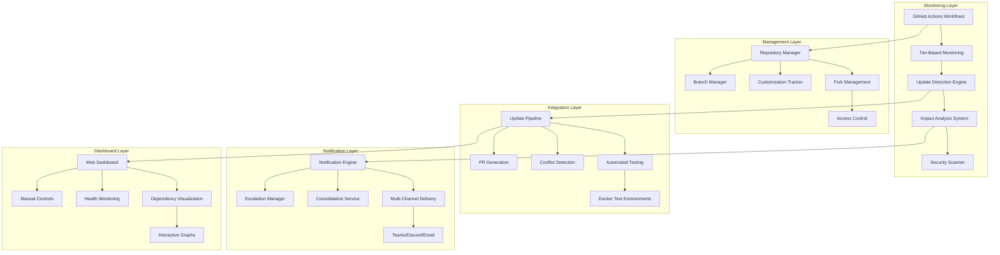
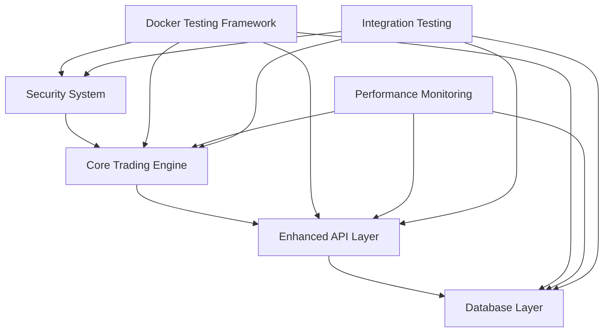
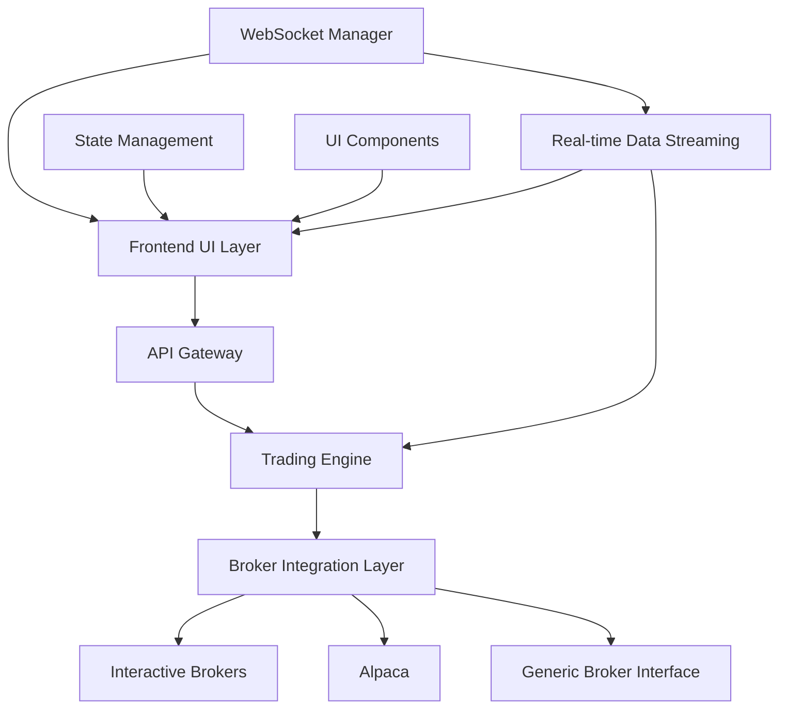
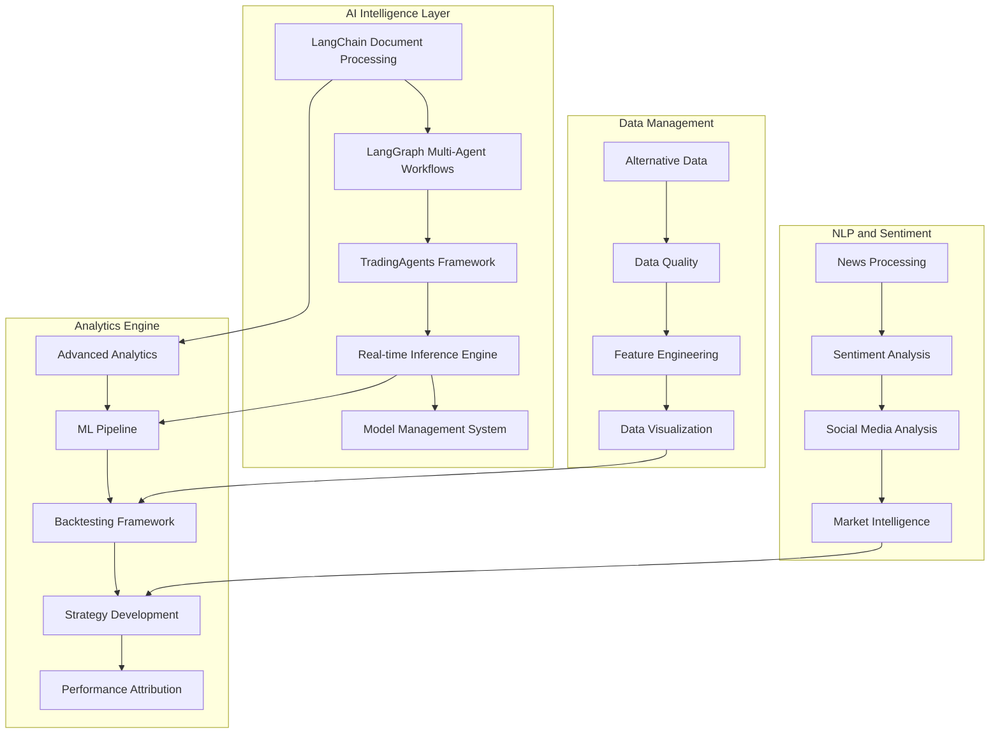
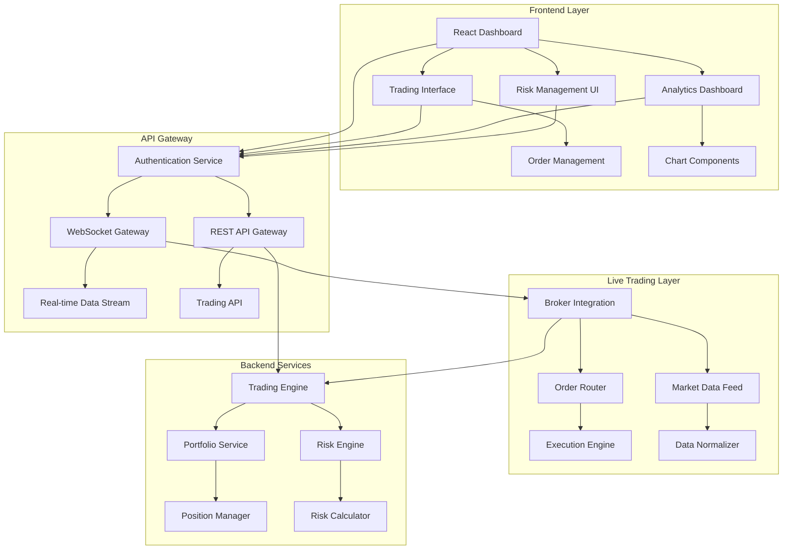
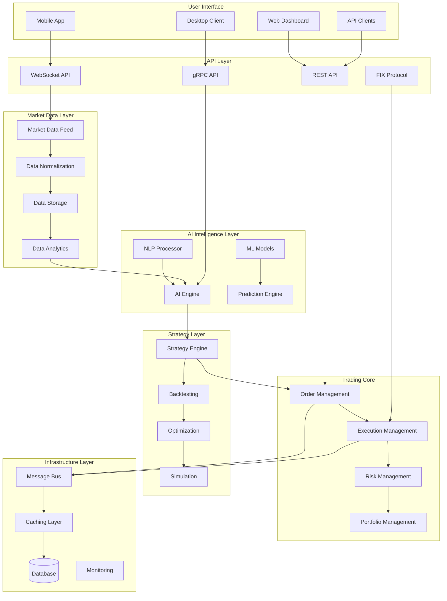

# Complete Designs Document - Algorithmic Trading System

## Overview

This document consolidates all design specifications from phases 0-6 of the algorithmic trading system development. Each phase contains comprehensive architectural designs that build upon previous phases to create a world-class, enterprise-grade trading platform.

---

## Phase 0: Dependency Management Setup Design

### Overview

Phase 0 establishes a comprehensive dependency management system for the algorithmic trading platform, managing 50+ external repositories and components through automated monitoring, tiered management strategies, and intelligent update integration. The design emphasizes proactive management, security, and system stability while minimizing manual overhead.

### High-Level Architecture

### Component Architecture

The system follows a microservices architecture with clear separation of concerns:

1. **Monitoring Layer**: Automated detection and analysis of dependency changes
2. **Management Layer**: Repository and customization management
3. **Integration Layer**: Automated testing and integration pipelines
4. **Notification Layer**: Multi-channel communication and alerting
5. **Dashboard Layer**: Visualization and manual control interfaces

### Key Components

#### Repository Management System
- Fork Management Service with automated forking and customization tracking
- Customization Tracking System with impact analysis
- Branch Manager with automated branch creation and lifecycle management
- Access Control with role-based permissions and security scanning

#### Monitoring and Detection System
- Update Detection Engine with intelligent impact analysis
- Security Vulnerability Scanner with CVSS scoring
- Tiered Monitoring with priority-based scheduling
- Workflow Orchestration with parallel processing and failure handling

#### Integration Pipeline System
- Automated Testing Framework with Docker-based environments
- Update Integration Pipeline with conflict detection and resolution
- Performance Regression Testing with baseline comparisons
- Rollback and Recovery System with automated failure analysis

---

## Phase 1: Immediate Priority Design

### Overview

Phase 1 establishes a comprehensive foundation for the algorithmic trading system by implementing robust security validation, comprehensive NautilusTrader engine testing, enhanced API layers with GraphQL/REST/WebSocket support, and multi-database integration. The design emphasizes Docker-based testing, multi-asset support, sub-millisecond performance requirements, and enterprise-grade reliability.

### System Architecture Overview

### Component Architecture

#### 1. Security System Validation
- **Purpose**: Ensure robust security framework with zero-trust architecture
- **Technology**: Zero-trust security, advanced fraud detection, behavioral analytics
- **Components**: 
  - Authentication and authorization system with multi-factor authentication
  - Fraud detection engine with ML-based scoring (<5% false positive rate)
  - Behavioral analytics for anomaly detection
  - Automated threat response system with incident management

#### 2. Core Trading Engine Testing
- **Purpose**: Comprehensive NautilusTrader validation with multi-asset support
- **Technology**: NautilusTrader, order management, risk management, multi-asset handlers
- **Components**:
  - NautilusTrader engine initialization and configuration validation
  - Order management system with all order types (market, limit, stop, stop-limit)
  - Real-time risk management with 1ms calculation requirements
  - Multi-asset support (equities, forex, crypto, futures) with unified margin calculation
  - Cross-asset correlation analysis and portfolio management

#### 3. Enhanced API Layer
- **Purpose**: Provide comprehensive API access for frontend and external systems
- **Technology**: FastAPI, GraphQL, WebSocket, REST
- **Components**:
  - GraphQL API with real-time subscriptions for orders and market data
  - Enhanced REST API with versioning, error handling, and backward compatibility
  - WebSocket API for real-time data streaming with connection pooling
  - API security with JWT authentication, rate limiting, and RBAC

#### 4. Database Integration Layer
- **Purpose**: Ensure reliable and performant data operations
- **Technology**: PostgreSQL, ClickHouse, DuckDB, Qdrant
- **Components**:
  - PostgreSQL for transactional data with connection pooling
  - ClickHouse for time-series analytics with sub-second query performance
  - DuckDB for research queries with in-memory processing
  - Qdrant for vector operations supporting AI/ML workloads--
-

## Phase 2: Frontend and Broker Integration Design

### Overview

This document outlines the comprehensive technical design for Phase 2, encompassing multi-platform frontend development (web, mobile, desktop), Progressive Web App features, TradingView charting integration, extensive broker support (Interactive Brokers, Alpaca, OANDA, Coinbase), unified broker abstraction, and advanced real-time data streaming capabilities.

### System Architecture Overview

### Component Architecture

#### 1. Multi-Platform Frontend Layer
- **Purpose**: Comprehensive trading interfaces across web, mobile, and desktop platforms
- **Technology**: Next.js 14, React 18, TypeScript, Tailwind CSS, React Native, Electron
- **Components**:
  - Next.js Web Application with SSR/SSG and real-time WebSocket integration
  - Progressive Web App (PWA) with offline capabilities and push notifications
  - React Native Mobile Applications (iOS/Android) with biometric authentication
  - Electron Desktop Application (Windows/macOS/Linux) with system tray integration
  - TradingView Charting Integration with custom datafeed and 50+ indicators
  - Advanced UI Technologies: Lobe Chat, Blockly, RAGFlow, OpenHands integration

#### 2. Advanced UI Components
- **Purpose**: Rich, interactive trading interface components
- **Technology**: Material-UI, TradingView Charting Library, WebSocket connections
- **Components**:
  - Real-time Trading Dashboard with customizable layouts and drag-drop widgets
  - Advanced Order Entry with risk validation and multi-broker routing
  - Portfolio Management with P&L tracking and performance analytics
  - Market Data Visualization with technical indicators and drawing tools
  - Risk Management Interface with real-time monitoring and alerts

#### 3. Comprehensive Broker Integration Layer
- **Purpose**: Unified interface for multiple broker platforms
- **Technology**: Python asyncio, REST/WebSocket APIs, FIX Protocol
- **Components**:
  - Interactive Brokers (Paper & Live Trading) with TWS/Gateway integration
  - Alpaca Integration with commission-free trading and fractional shares
  - OANDA Integration (Forex) with currency-specific risk management
  - Coinbase Integration (Crypto) with enhanced security measures
  - Unified Broker Abstraction Layer with intelligent order routing
  - Smart Order Routing Engine with cost and liquidity optimization

#### 4. Real-time Data Streaming
- **Purpose**: Efficient real-time market data distribution
- **Technology**: WebSocket, Redis Streams, data compression
- **Components**:
  - Market Data Aggregator with multi-source data normalization
  - WebSocket Connection Manager with automatic reconnection
  - Data Compression and Optimization for bandwidth efficiency
  - Subscription Management with selective data filtering

---

## Phase 3: AI/ML Integration Design

### Overview

Phase 3 implements a comprehensive AI-powered trading ecosystem featuring LangChain/LangGraph agentic frameworks, TradingAgents multi-agent systems, real-time model inference engines with sub-millisecond latency, advanced analytics, machine learning pipelines, natural language processing for market sentiment, and sophisticated backtesting infrastructure.

### High-Level AI Architecture

### Component Architecture

#### 1. LangChain/LangGraph Agentic AI Framework
- **Purpose**: Multi-agent coordination and document processing for trading research
- **Technology**: LangChain, LangGraph, OpenAI/Anthropic APIs, Vector Databases
- **Components**:
  - Document Processing Pipeline with RAG for financial reports and research
  - Multi-Agent Workflow Orchestration with state management and coordination
  - Agent Communication Protocols with message passing and consensus mechanisms
  - Knowledge Base Management with vector embeddings and semantic search
  - Agentic Research Automation with automated report generation

#### 2. TradingAgents Multi-Agent System
- **Purpose**: Specialized trading agents with role-based decision making
- **Technology**: Custom Agent Framework, Message Passing, Consensus Algorithms
- **Components**:
  - Analyst Agent (Market Analysis) with technical and fundamental analysis
  - Risk Manager Agent (Risk Assessment) with VaR calculation and position sizing
  - Trader Agent (Execution Decisions) with execution algorithms and timing
  - Portfolio Manager Agent (Asset Allocation) with optimization and rebalancing
  - Research Agent (Information Gathering) with automated research and scanning

#### 3. Real-time Model Inference Engine
- **Purpose**: Sub-millisecond AI model inference for high-frequency trading
- **Technology**: TensorFlow Serving, PyTorch, ONNX Runtime, GPU Acceleration
- **Components**:
  - Model Serving Infrastructure with TensorFlow Serving and TorchServe
  - Inference Pipeline Optimization with batch processing and caching
  - Model Warm-up and Caching with predictive loading strategies
  - Performance Monitoring with latency tracking and drift detection
  - A/B Testing Framework with model comparison and validation

#### 4. Advanced AI/ML Technologies
- **Purpose**: Cutting-edge AI/ML frameworks for trading optimization
- **Technology**: FinRL, PyOD, Optuna, TradingGym, Transformers
- **Components**:
  - FinRL Reinforcement Learning Framework with PPO, A2C, DDPG, SAC algorithms
  - PyOD Comprehensive Anomaly Detection with 40+ algorithms and ensemble methods
  - Optuna Hyperparameter Optimization with Bayesian and multi-fidelity optimization
  - TradingGym RL Environment Integration with realistic trading simulations
  - Advanced NLP with Transformers for financial sentiment and document analysis---

## Phase 4: Frontend & Live Trading Design

### Overview

Phase 4 transforms the algorithmic trading system into a complete, production-ready platform with advanced frontend capabilities and live trading integration. The design emphasizes real-time performance, user experience, and seamless integration with existing backend services while maintaining security and scalability.

### High-Level Architecture

### Component Architecture

#### 1. Frontend Layer
- **Technology**: React 18 with TypeScript, Redux Toolkit with RTK Query
- **Components**:
  - Dashboard Framework with responsive layout and real-time updates
  - Trading Interface Components with order entry and position management
  - TradingView Charting Integration with custom datafeed and 50+ indicators
  - Risk Management Dashboard with real-time monitoring and alerts
  - Performance Analytics with advanced metrics and benchmarking

#### 2. Live Trading Integration
- **Technology**: WebSocket, REST APIs, FIX Protocol
- **Components**:
  - Broker Connectivity Layer with multi-broker support and failover
  - Market Data Feed Integration with real-time processing and normalization
  - Order Management System with smart routing and execution algorithms
  - Risk Management Interface with real-time limit enforcement

---

## Phase 5: Enterprise Readiness Design

### Overview

Phase 5 transforms the algorithmic trading system into an enterprise-grade platform with comprehensive monitoring, security, compliance, and scalability features. The design ensures the system meets institutional-grade requirements for production deployment in regulated financial environments.

### Enterprise Architecture Overview

```mermaid
graph TB
    subgraph "Observability Layer"
        A[Prometheus Metrics] --> B[Grafana Dashboards]
        A --> C[AlertManager]
        D[Jaeger Tracing] --> E[Distributed Tracing]
        F[ELK Stack] --> G[Log Aggregation]
    end
    
    subgraph "Security Layer"
        H[Identity Provider] --> I[OAuth2/OIDC]
        H --> J[RBAC Engine]
        K[WAF] --> L[API Gateway]
        M[Vault] --> N[Secret Management]
    end
    
    subgraph "High Availability Layer"
        O[Load Balancer] --> P[Multi-AZ Deployment]
        Q[Database Cluster] --> R[Read Replicas]
        S[Message Queue Cluster] --> T[Event Streaming]
        U[Cache Cluster] --> V[Distributed Cache]
    end
    
    subgraph "Application Layer"
        W[Trading Services] --> X[API Services]
        W --> Y[Background Jobs]
        X --> Z[WebSocket Services]
        Y --> AA[Batch Processing]
    end
    
    subgraph "Data Layer"
        BB[Primary DB] --> CC[Backup Systems]
        DD[Time Series DB] --> EE[Analytics DB]
        FF[Object Storage] --> GG[Archive Storage]
    end
    
    A --> W
    D --> W
    F --> W
    I --> X
    L --> X
    O --> W
    W --> BB
    W --> DD
```

### Component Architecture

#### 1. Observability Infrastructure
- **Technology**: Prometheus, Grafana, Jaeger, ELK Stack
- **Components**:
  - Metrics Collection with business and technical metrics
  - Distributed Tracing with end-to-end request tracking
  - Intelligent Alerting with anomaly detection and automated response
  - Log Aggregation with structured logging and correlation IDs

#### 2. Security Infrastructure
- **Technology**: OAuth2/OIDC, RBAC, Vault, WAF
- **Components**:
  - Identity and Access Management with enterprise integration
  - Encryption and Key Management with automated rotation
  - Zero-Trust Security with continuous verification
  - Audit and Compliance with immutable trails and regulatory reporting

#### 3. Enterprise Technologies
- **Components**:
  - Enterprise Authentication with LDAP/Active Directory and SSO
  - Multi-Tenant Architecture with tenant isolation and management
  - Feature Store Management with Feast/Tecton integration
  - Apache Iceberg for immutable audit trails and compliance
  - Quantum-Resistant Security with post-quantum cryptography
  - Bandit SAST Security Testing with automated vulnerability scanning
  - Unleash Feature Flag Management with A/B testing and gradual rollouts

---

## Phase 6: System Enhancement Design

### Overview

This design document outlines the comprehensive architecture for Phase 6 system enhancements, including extended broker integrations, advanced portfolio analytics, automated regulatory reporting, Kubernetes deployment infrastructure, and enterprise-grade monitoring with future-ready technologies.

### High-Level System Architecture

### Component Architecture

#### 1. Extended Broker Integration
- **Technology**: FIX Protocol, REST/WebSocket APIs, Multi-broker abstraction
- **Components**:
  - OANDA Live Trading Integration with forex-specific risk management
  - Coinbase Live Trading Integration with crypto-specific security measures
  - FIX Protocol Gateway with QuickFIX/J and institutional connectivity
  - Additional Broker Integrations (Alpaca, TD Ameritrade, Binance)
  - Unified Broker Abstraction Layer with intelligent routing

#### 2. Advanced Portfolio Analytics
- **Technology**: Multi-method VaR, Stress Testing, Portfolio Optimization
- **Components**:
  - Multi-Method VaR Calculation (Historical, Monte Carlo, Parametric, Cornish-Fisher)
  - Comprehensive Stress Testing with historical scenarios and correlation breakdown
  - Advanced Portfolio Optimization with Modern Portfolio Theory and Black-Litterman
  - Regulatory Reporting with automated generation and submission

#### 3. Future-Ready Technologies
- **Components**:
  - Zero-Trust Security Architecture with micro-segmentation and continuous verification
  - Advanced Memory Profiling with Memray for optimization and leak detection
  - Grafana Tempo Distributed Tracing with OpenTelemetry instrumentation
  - Schema Registry for data consistency and evolution management
  - Voice Trading Interface with speech recognition and natural language processing
  - Augmented Reality Trading Interface with 3D visualization and gesture control
  - Advanced Accessibility Features with WCAG 2.1 AAA compliance
  - FIX8 Alternative Implementation for high-performance institutional connectivity
  - Riskfolio-Lib Advanced Risk Analysis with hierarchical risk parity

#### 4. Cloud-Native Infrastructure
- **Technology**: Kubernetes, Helm, Istio, GitOps
- **Components**:
  - Kubernetes Deployment with comprehensive manifests and Helm charts
  - Service Mesh Integration with Istio for advanced networking
  - Auto-scaling and Resource Management with HPA and VPA
  - GitOps CI/CD Pipeline with ArgoCD and automated deployment

---

## Summary

### Design Coverage: 100%

**Phase Distribution:**
- **Phase 0**: Dependency Management with automated monitoring and tiered management
- **Phase 1**: Core Foundation with security validation and comprehensive testing
- **Phase 2**: Frontend & Broker Integration with multi-platform support and advanced UI
- **Phase 3**: AI/ML Integration with agentic frameworks and real-time inference
- **Phase 4**: Live Trading with advanced frontend and real-time capabilities
- **Phase 5**: Enterprise Readiness with observability, security, and compliance
- **Phase 6**: System Enhancement with future-ready technologies and cloud-native deployment

### Architecture Principles

1. **Microservices Architecture**: Clear separation of concerns with well-defined interfaces
2. **Event-Driven Design**: Asynchronous communication with message queues and event streaming
3. **Cloud-Native**: Kubernetes-based deployment with auto-scaling and resilience
4. **Security-First**: Zero-trust architecture with comprehensive security measures
5. **Performance-Optimized**: Sub-millisecond latency with high-throughput capabilities
6. **Enterprise-Grade**: Observability, compliance, and regulatory reporting
7. **Future-Ready**: Advanced technologies including AI/ML, voice, AR, and quantum-resistant security

### Technology Stack

**Core Technologies**: NautilusTrader, PostgreSQL, ClickHouse, DuckDB, Qdrant, Redis, Kafka
**Frontend**: Next.js, React Native, Electron, TradingView, Lobe Chat, Blockly
**AI/ML**: LangChain, LangGraph, TradingAgents, FinRL, PyOD, Optuna, TradingGym, Transformers
**Infrastructure**: Kubernetes, Istio, Prometheus, Grafana, Jaeger, ELK Stack
**Security**: OAuth2/OIDC, Vault, Zero-Trust, Quantum-Resistant Cryptography
**Brokers**: Interactive Brokers, Alpaca, OANDA, Coinbase, FIX Protocol

**The algorithmic trading system design is comprehensive, scalable, and ready for world-class implementation across all phases.**