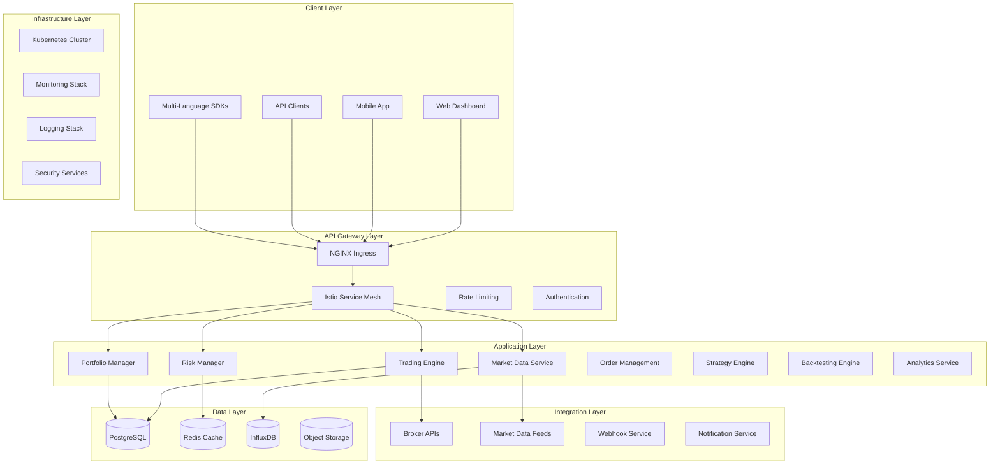
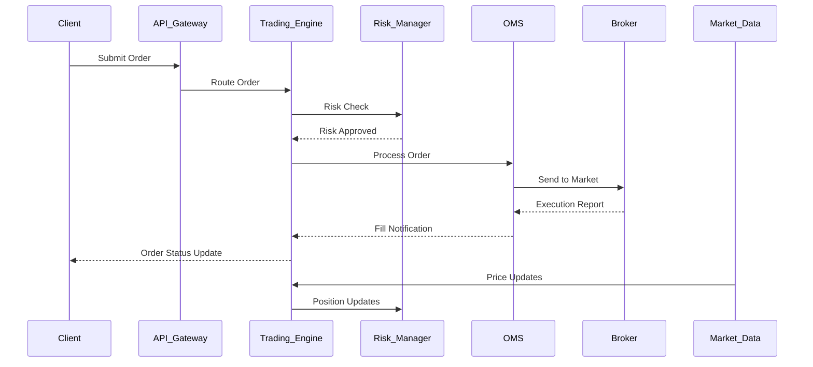
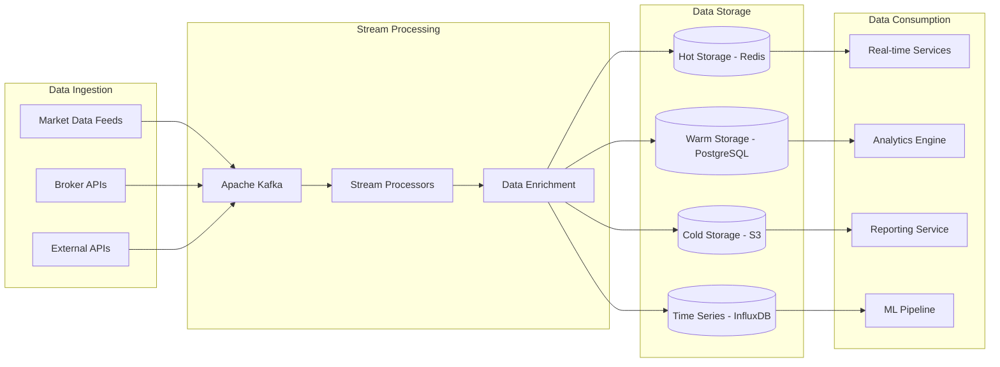
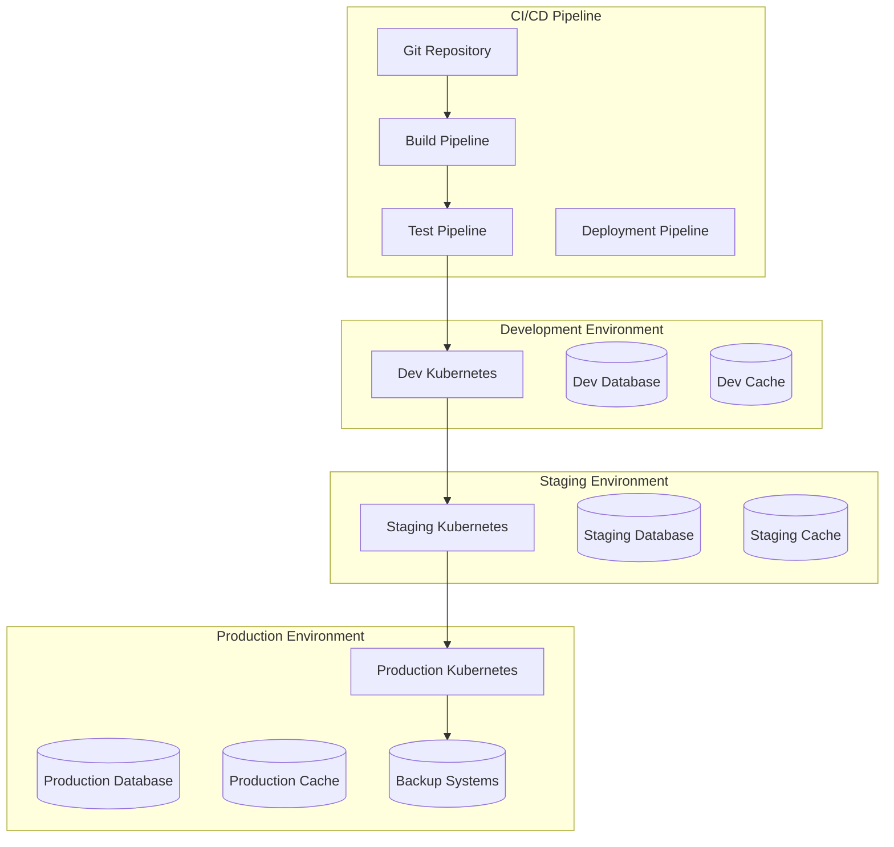
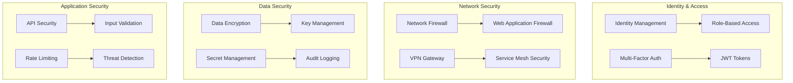
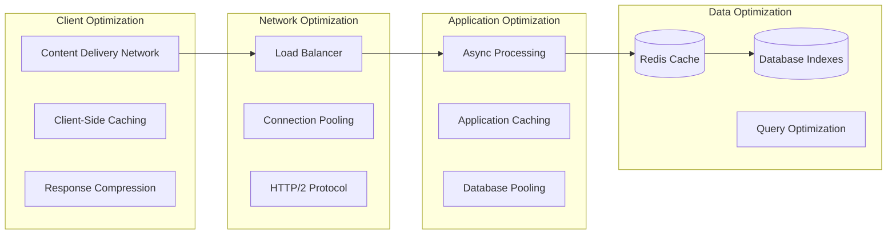
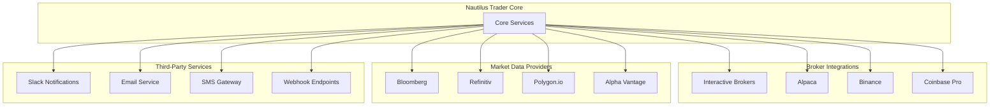
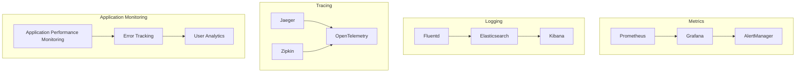

# Nautilus Trader - Comprehensive System Architecture

## Table of Contents

1. [System Overview](#system-overview)
2. [Architecture Principles](#architecture-principles)
3. [System Components](#system-components)
4. [Data Flow Architecture](#data-flow-architecture)
5. [Technology Stack](#technology-stack)
6. [Deployment Architecture](#deployment-architecture)
7. [Security Architecture](#security-architecture)
8. [Performance Architecture](#performance-architecture)
9. [Integration Architecture](#integration-architecture)
10. [Monitoring and Observability](#monitoring-and-observability)

## System Overview

Nautilus Trader is a comprehensive algorithmic trading platform designed for high-frequency trading, portfolio management, and risk analysis. The system follows a microservices architecture with cloud-native deployment capabilities.

### Key Characteristics

- **High Performance**: Microsecond-level latency for trading operations
- **Scalable**: Horizontal scaling across multiple nodes
- **Resilient**: Fault-tolerant with automatic failover
- **Secure**: Enterprise-grade security with zero-trust architecture
- **Observable**: Comprehensive monitoring and alerting

## Architecture Principles

### 1. Microservices Architecture
- **Service Decomposition**: Each business capability is a separate service
- **Independent Deployment**: Services can be deployed independently
- **Technology Diversity**: Services can use different technologies
- **Fault Isolation**: Failure in one service doesn't affect others

### 2. Event-Driven Architecture
- **Asynchronous Communication**: Services communicate via events
- **Event Sourcing**: All state changes are captured as events
- **CQRS**: Command Query Responsibility Segregation
- **Event Streaming**: Real-time event processing

### 3. Cloud-Native Design
- **Container-First**: All services are containerized
- **Kubernetes Native**: Designed for Kubernetes orchestration
- **12-Factor App**: Follows 12-factor application principles
- **Infrastructure as Code**: All infrastructure is code-defined

### 4. API-First Design
- **RESTful APIs**: Standard REST interfaces
- **GraphQL**: Flexible query interface
- **WebSocket**: Real-time communication
- **gRPC**: High-performance inter-service communication

## System Components



### Core Services

#### 1. Trading Engine
- **Purpose**: Execute trading strategies and manage orders
- **Technology**: Python/Rust for performance-critical paths
- **Key Features**:
  - Order routing and execution
  - Strategy execution
  - Position management
  - Trade settlement

#### 2. Portfolio Manager
- **Purpose**: Manage portfolios and asset allocation
- **Technology**: Python with NumPy/Pandas
- **Key Features**:
  - Portfolio optimization
  - Asset allocation
  - Performance attribution
  - Rebalancing

#### 3. Risk Manager
- **Purpose**: Monitor and control trading risks
- **Technology**: Python with real-time processing
- **Key Features**:
  - Real-time risk monitoring
  - VaR calculations
  - Exposure limits
  - Stress testing

#### 4. Market Data Service
- **Purpose**: Collect, process, and distribute market data
- **Technology**: Python/Go for high throughput
- **Key Features**:
  - Real-time data feeds
  - Historical data storage
  - Data normalization
  - Market data distribution

#### 5. Order Management System (OMS)
- **Purpose**: Manage order lifecycle and execution
- **Technology**: Python with low-latency optimizations
- **Key Features**:
  - Order validation
  - Execution management
  - Fill processing
  - Compliance checks

## Data Flow Architecture

### Real-Time Trading Flow



### Data Processing Pipeline



## Technology Stack

### Programming Languages
- **Python**: Primary language for business logic
- **Rust**: Performance-critical components
- **TypeScript**: Frontend and Node.js services
- **Go**: Infrastructure and tooling
- **SQL**: Database queries and procedures

### Frameworks and Libraries
- **FastAPI**: REST API framework
- **GraphQL**: Query language and runtime
- **React**: Frontend framework
- **Pandas/NumPy**: Data processing
- **Asyncio**: Asynchronous programming

### Databases and Storage
- **PostgreSQL**: Primary relational database
- **Redis**: Caching and session storage
- **InfluxDB**: Time-series data
- **Apache Kafka**: Event streaming
- **MinIO/S3**: Object storage

### Infrastructure
- **Kubernetes**: Container orchestration
- **Docker**: Containerization
- **Istio**: Service mesh
- **NGINX**: Load balancing and ingress
- **Helm**: Package management

### Monitoring and Observability
- **Prometheus**: Metrics collection
- **Grafana**: Visualization and dashboards
- **Jaeger**: Distributed tracing
- **ELK Stack**: Logging and search
- **AlertManager**: Alert management

## Deployment Architecture

### Multi-Environment Setup



### Kubernetes Architecture

```yaml
# Namespace Organization
namespaces:
  - nautilus-trader-prod
  - nautilus-trader-staging
  - nautilus-trader-dev
  - nautilus-trader-monitoring
  - nautilus-trader-system

# Resource Allocation
resources:
  trading-engine:
    requests: { cpu: "2", memory: "4Gi" }
    limits: { cpu: "4", memory: "8Gi" }
  
  portfolio-manager:
    requests: { cpu: "1", memory: "2Gi" }
    limits: { cpu: "2", memory: "4Gi" }
  
  risk-manager:
    requests: { cpu: "1", memory: "2Gi" }
    limits: { cpu: "2", memory: "4Gi" }

# Scaling Configuration
autoscaling:
  trading-engine:
    minReplicas: 3
    maxReplicas: 20
    targetCPU: 70%
  
  api-gateway:
    minReplicas: 2
    maxReplicas: 10
    targetCPU: 60%
```

## Security Architecture

### Zero-Trust Security Model



### Security Controls

#### Authentication & Authorization
- **OAuth 2.0/OpenID Connect**: Standard authentication
- **JWT Tokens**: Stateless authentication
- **RBAC**: Role-based access control
- **API Keys**: Service-to-service authentication

#### Data Protection
- **Encryption at Rest**: AES-256 encryption
- **Encryption in Transit**: TLS 1.3
- **Key Management**: HashiCorp Vault
- **Secret Management**: Kubernetes secrets

#### Network Security
- **Network Policies**: Kubernetes network policies
- **Service Mesh**: Istio for service-to-service security
- **Ingress Security**: NGINX with security headers
- **DDoS Protection**: Rate limiting and throttling

## Performance Architecture

### Latency Optimization



### Performance Targets

| Component | Latency Target | Throughput Target |
|-----------|---------------|-------------------|
| API Gateway | < 10ms | 10,000 RPS |
| Trading Engine | < 1ms | 100,000 TPS |
| Risk Manager | < 5ms | 50,000 TPS |
| Market Data | < 100μs | 1M messages/sec |
| Database Queries | < 50ms | 10,000 QPS |

## Integration Architecture

### External Integrations



### Integration Patterns

#### 1. API Integration
- **REST APIs**: Standard HTTP-based integration
- **GraphQL**: Flexible query-based integration
- **WebSocket**: Real-time bidirectional communication
- **gRPC**: High-performance RPC

#### 2. Message-Based Integration
- **Apache Kafka**: Event streaming platform
- **RabbitMQ**: Message queuing
- **Redis Pub/Sub**: Lightweight messaging
- **WebHooks**: HTTP callbacks

#### 3. Data Integration
- **ETL Pipelines**: Extract, Transform, Load
- **Change Data Capture**: Real-time data sync
- **Batch Processing**: Scheduled data processing
- **Stream Processing**: Real-time data processing

## Monitoring and Observability

### Observability Stack



### Key Metrics

#### System Metrics
- **CPU Utilization**: Per service and cluster-wide
- **Memory Usage**: Heap and non-heap memory
- **Network I/O**: Bandwidth and packet rates
- **Disk I/O**: Read/write operations and latency

#### Application Metrics
- **Request Rate**: Requests per second
- **Response Time**: P50, P95, P99 latencies
- **Error Rate**: 4xx and 5xx error percentages
- **Throughput**: Transactions per second

#### Business Metrics
- **Trading Volume**: Daily/hourly trading volumes
- **P&L**: Profit and loss tracking
- **Order Fill Rate**: Percentage of orders filled
- **Strategy Performance**: Individual strategy metrics

### Alerting Strategy

#### Alert Levels
- **Critical**: Immediate response required (P1)
- **Warning**: Response within 1 hour (P2)
- **Info**: Response within 24 hours (P3)

#### Alert Channels
- **PagerDuty**: Critical alerts for on-call engineers
- **Slack**: Team notifications for warnings
- **Email**: Detailed reports and summaries
- **SMS**: Critical alerts for key personnel

## Disaster Recovery and Business Continuity

### Backup Strategy
- **Database Backups**: Daily full, hourly incremental
- **Configuration Backups**: Version-controlled infrastructure
- **Application Backups**: Container images and artifacts
- **Data Archival**: Long-term storage for compliance

### Recovery Procedures
- **RTO (Recovery Time Objective)**: 15 minutes
- **RPO (Recovery Point Objective)**: 5 minutes
- **Failover Process**: Automated with manual override
- **Data Recovery**: Point-in-time recovery capability

### High Availability
- **Multi-AZ Deployment**: Across multiple availability zones
- **Load Balancing**: Automatic traffic distribution
- **Health Checks**: Continuous service monitoring
- **Circuit Breakers**: Automatic failure isolation

## Conclusion

The Nautilus Trader architecture is designed to provide a robust, scalable, and high-performance algorithmic trading platform. The microservices architecture enables independent scaling and deployment, while the cloud-native design ensures portability and operational efficiency.

Key architectural strengths:
- **Performance**: Sub-millisecond latency for critical operations
- **Scalability**: Horizontal scaling to handle increased load
- **Reliability**: Fault-tolerant design with automatic recovery
- **Security**: Zero-trust security model with comprehensive controls
- **Observability**: Full-stack monitoring and alerting

This architecture supports the platform's mission to provide institutional-grade algorithmic trading capabilities while maintaining the flexibility to adapt to changing market conditions and requirements.

---

*Last Updated: August 1, 2025*
*Version: 1.0.0*