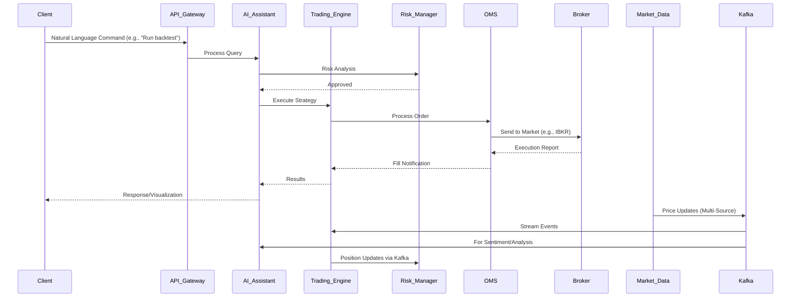

# Nautilus Trader - Comprehensive System Architecture

## Table of Contents

1. [System Overview](#system-overview)
2. [Architecture Principles](#architecture-principles)
3. [System Components](#system-components)
4. [Data Flow Architecture](#data-flow-architecture)
5. [Technology Stack](#technology-stack)
6. [Deployment Architecture](#deployment-architecture)
7. [Security Architecture](#security-architecture)
8. [Performance Architecture](#performance-architecture)
9. [Integration Architecture](#integration-architecture)
10. [Monitoring and Observability](#monitoring-and-observability)
11. [AI and ML Integration Architecture](#ai-and-ml-integration-architecture)
12. [Custom Technical Analysis and Indicators](#custom-technical-analysis-and-indicators)
13. [Data Feed and Fallback Mechanisms](#data-feed-and-fallback-mechanisms)
14. [Frontend and User Interface Architecture](#frontend-and-user-interface-architecture)
15. [Enterprise Readiness and Compliance](#enterprise-readiness-and-compliance)
16. [Development Phases and Integration Strategy](#development-phases-and-integration-strategy)
17. [Disaster Recovery and Business Continuity](#disaster-recovery-and-business-continuity)
18. [Conclusion](#conclusion)

## System Overview

Nautilus Trader is a comprehensive, enterprise-grade algorithmic trading platform designed for high-frequency trading, portfolio management, risk analysis, and AI-driven decision-making. The system adopts a "Best-of-Breed" integration strategy, selecting optimal open-source projects for each component to create a modular, powerful foundation. It caters to non-technical users through simplicity and no-code options, while providing professional traders and analysts with enterprise-grade features. The architecture leverages AI Agents and Agentic AI extensively, with a sophisticated Agentic AI Assistant serving as the platform's "brain" for natural language-based management of trading, research, and analysis.

The core trading engine is NautilusTrader, a high-performance, Python-based platform with Rust components for event-driven backtesting and live trading across all asset classes (stocks, ETFs, futures, options, forex, cryptocurrencies). The system incorporates advanced forecasting (Stock-Prediction-Models, LSTM-Neural-Network-for-Time-Series-Prediction, Real-time-stock-market-prediction), GPU-accelerated backtesting (VectorBT), flexible strategy development (TradingGym), portfolio optimization (PyPortfolioOpt, Riskfolio-Lib), anomaly detection (PyOD), no-code building (Blockly), visualization (react-financial-charts, Plotly Dash), explainable AI (SHAP), reinforcement learning (FinRL), NLP (Transformers, PyTorch), and options analytics (QuantLib).

The platform is structured as distinct microservices communicating via an Apache Kafka event bus, enabling decoupling, data replayability for testing, and scalability for high-frequency data streams. It supports multiple asset classes, paper and live trading modes (starting with Interactive Brokers integration), custom volume-weighted indicators, multi-source data feeds with fallbacks, and advanced AI workflows for strategy refinement.

### Key Characteristics

- **High Performance**: Microsecond-level latency for trading operations, with Rust optimizations in critical paths.
- **Scalable**: Horizontal scaling across multiple nodes, with intelligent auto-scaling and resource management.
- **Resilient**: Fault-tolerant with automatic failover, automated self-healing mechanisms to detect and restore faulty components, minimizing downtime and preventing cascading failures.
- **Secure**: Enterprise-grade security with zero-trust architecture, User and Entity Behavior Analytics (UEBA), immutable audit trails (Apache Iceberg), Static Application Security Testing (SAST) with Bandit, threat modeling by design, and formalized backup strategy.
- **Observable**: Comprehensive monitoring and alerting with predictive performance models to forecast and mitigate bottlenecks.

## Architecture Principles

The architecture adheres to foundational principles derived from the system's requirements for modularity, performance, and extensibility.

### 1. Microservices Architecture
- **Service Decomposition**: Each business capability (e.g., trading engine, risk management, AI assistant) is a separate service.
- **Independent Deployment**: Services can be deployed independently, supporting technology diversity (e.g., Python/Rust for trading, Go for market data).
- **Technology Diversity**: Allows mixing languages and frameworks (e.g., Python for AI, Rust for low-latency).
- **Fault Isolation**: Failure in one service (e.g., portfolio manager) does not affect others, enforced via Kubernetes namespaces and Istio service mesh.
- **Automated Self-Healing**: Microservices include mechanisms for health checks, restarts, and recovery, integrated with Kubernetes liveness/readiness probes.

### 2. Event-Driven Architecture
- **Asynchronous Communication**: Services communicate via events on Apache Kafka, with hierarchical topic naming (e.g., domain.action.entity.source.symbol) and wildcard subscriptions.
- **Event Sourcing**: All state changes (e.g., order placements, risk updates) are captured as immutable events for replayability and auditing.
- **CQRS**: Command Query Responsibility Segregation, separating write (commands) and read (queries) paths for optimized performance.
- **Event Streaming**: Real-time processing with Kafka streams, supporting multi-agent AI communication asynchronously.

### 3. Cloud-Native Design
- **Container-First**: All services are containerized using Docker.
- **Kubernetes Native**: Orchestrated via Kubernetes, with Helm charts for deployment, Istio service mesh for traffic management, and GitOps CI/CD workflows.
- **12-Factor App**: Adheres to principles like codebase, dependencies, config, backing services, build/release/run, processes, port binding, concurrency, disposability, dev/prod parity, logs, and admin processes.
- **Infrastructure as Code**: All infrastructure defined using Terraform or similar tools.

### 4. API-First Design
- **RESTful APIs**: Standard REST interfaces with FastAPI, including versioning and error handling.
- **GraphQL**: Flexible query interface for complex data retrieval (e.g., portfolio metrics).
- **WebSocket**: Real-time communication for market data and order updates.
- **gRPC**: High-performance inter-service communication for low-latency calls.

## System Components

The system comprises core microservices, extended with AI/ML capabilities, custom analytics, and integrations.

```mermaid
graph TB
    subgraph "Client Layer"
        WEB[Web Dashboard (React 18/TypeScript)]
        MOBILE[Mobile App (React Native)]
        DESKTOP[Desktop App (Electron)]
        PWA[Progressive Web App]
        API_CLIENT[API Clients]
        SDK[Multi-Language SDKs]
    end
    
    subgraph "API Gateway Layer"
        NGINX[NGINX Ingress]
        ISTIO[Istio Service Mesh]
        RATE_LIMIT[Rate Limiting]
        AUTH[Authentication (OAuth2/OIDC)]
    end
    
    subgraph "Application Layer"
        TRADING[Trading Engine (NautilusTrader - Python/Rust)]
        PORTFOLIO[Portfolio Manager (PyPortfolioOpt, Riskfolio-Lib)]
        RISK[Risk Manager (Real-time VaR, Stress Testing)]
        MARKET_DATA[Market Data Service (Multi-Source Feeds)]
        ORDER_MGT[Order Management System (OMS - FIX Gateway)]
        STRATEGY[Strategy Engine (TradingGym, VectorBT)]
        BACKTEST[Backtesting Engine (GPU-Accelerated)]
        ANALYTICS[Analytics Service (OpenBB, TA-Lib)]
        AI_ASSISTANT[Agentic AI Assistant (LangChain, LangGraph, TradingAgent)]
        INFERENCE[Inference Engine (TensorFlow Serving/PyTorch)]
        SENTIMENT[Sentiment Analysis Pipeline (Transformers)]
        ANOMALY[Anomaly Detection (PyOD)]
        RL[Reinforcement Learning (FinRL)]
        MARKET_SCANNER[Market Scanner Service]
    end
    
    subgraph "Integration Layer"
        BROKER_API[Broker APIs (IBKR, Alpaca, OANDA, Coinbase, FIX - QuickFIX/J, FIX8)]
        MARKET_FEEDS[Market Data Feeds (Yahoo, Alpha Vantage, Finnhub, etc.)]
        WEBHOOK[Webhook Service]
        NOTIFICATION[Notification Service (Push, Biometrics)]
    end
    
    subgraph "Data Layer"
        POSTGRES[(PostgreSQL/pgvector - Vectors)]
        CLICKHOUSE[(ClickHouse - Time-Series)]
        DUCKDB[(DuckDB - Analytics)]
        QDRANT[(Qdrant - Vector DB)]
        REDIS[(Redis Cache)]
        ICEBERG[(Apache Iceberg - Immutable Audits)]
        OBJECT_STORE[(MinIO/S3 - Object Storage)]
    end
    
    subgraph "Infrastructure Layer"
        KUBERNETES[Kubernetes Cluster (Helm, Istio, GitOps)]
        MONITORING[Monitoring Stack (Prometheus, Grafana, Jaeger, Loki)]
        LOGGING[Logging Stack (ELK)]
        SECURITY[Security Services (Bandit, UEBA, Unleash)]
        KAFKA[Apache Kafka (Event Bus, Schema Registry)]
    end
    
    WEB --> NGINX
    MOBILE --> NGINX
    DESKTOP --> NGINX
    PWA --> NGINX
    API_CLIENT --> NGINX
    SDK --> NGINX
    
    NGINX --> ISTIO
    ISTIO --> TRADING
    ISTIO --> PORTFOLIO
    ISTIO --> RISK
    ISTIO --> MARKET_DATA
    ISTIO --> AI_ASSISTANT
    ISTIO --> MARKET_SCANNER
    
    TRADING --> POSTGRES
    TRADING --> KAFKA
    PORTFOLIO --> CLICKHOUSE
    RISK --> DUCKDB
    MARKET_DATA --> QDRANT
    AI_ASSISTANT --> REDIS
    MARKET_SCANNER --> ICEBERG
    
    TRADING --> BROKER_API
    MARKET_DATA --> MARKET_FEEDS
    AI_ASSISTANT --> SENTIMENT
    AI_ASSISTANT --> RL
    AI_ASSISTANT --> INFERENCE
    
    KUBERNETES --> MONITORING
    KUBERNETES --> SECURITY
    KUBERNETES --> LOGGING
```

### Core Services

#### 1. Trading Engine
- **Purpose**: Execute trading strategies, manage orders, and support multi-asset classes (stocks, ETFs, futures, options, forex, crypto).
- **Technology**: Python/Rust for performance-critical paths.
- **Key Features**:
  - Order routing and execution with basic/advanced types (Market, Limit, VWAP, TWAP).
  - Strategy execution, position management, trade settlement.
  - Paper and live trading modes with seamless switching via UI.
  - Integration with custom volume-weighted indicators (e.g., VW SMA, VW EMA, VW MACD, VW MFI) built using TA-Lib/ta-lib-python & Bukosabino/ta and NumPy.
  - FIX Gateway for institutional connectivity.

#### 2. Portfolio Manager
- **Purpose**: Manage portfolios, asset allocation, and optimization.
- **Technology**: Python with NumPy/Pandas, PyPortfolioOpt, Riskfolio-Lib.
- **Key Features**:
  - Portfolio optimization, asset allocation, performance attribution, rebalancing.

#### 3. Risk Manager
- **Purpose**: Monitor and control risks in real-time.
- **Technology**: Python with real-time processing.
- **Key Features**:
  - Real-time risk monitoring, VaR calculations, exposure limits, stress testing.
  - Real-time risk dashboard visualized in Next.js frontend.
  - Integration with anomaly detection (PyOD) and circuit breakers.

#### 4. Market Data Service
- **Purpose**: Collect, process, and distribute market data from multiple sources.
- **Technology**: Python/Go for high throughput.
- **Key Features**:
  - Real-time data feeds, historical data storage, data normalization, distribution.
  - Multi-source feeds with fallback chains per asset class (e.g., Primary: Yahoo Finance; Fallbacks: Alpha Vantage, Finnhub, Investing.com, CME Group, Twelve Data, Polygon, Barchart, SpiderRock, TradingCharts, Oanda).
  - Asset-class specific: Stocks/ETFs (Yahoo, IBKR, Alpha Vantage); Futures (Yahoo, Investing.com, CME); Options (Yahoo, Cboe, SpiderRock); Forex (Yahoo, Oanda, CME); Commodities (Yahoo, TradingCharts, CME); Crypto (Alpha Vantage, Coinbase, Binance).
  - Options data: Historical chains (5+ years), real-time implied volatility surfaces, dividend forecasts.
  - Kafka streaming with auto-switch on failure.

#### 5. Order Management System (OMS)
- **Purpose**: Manage order lifecycle and execution.
- **Technology**: Python with low-latency optimizations.
- **Key Features**:
  - Order validation, execution management, fill processing, compliance checks.
  - Supports basic (Market, Limit) and advanced/algorithmic orders (VWAP, TWAP, Iceberg).
  - FIX Gateway (QuickFIX/J, FIX8) for institutional connectivity.

#### 6. Market Scanner Service
- **Purpose**: Provide real-time scanning across symbols based on user-defined criteria.
- **Technology**: Python/Go for high-throughput.
- **Key Features**:
  - Consumes Kafka real-time streams.
  - Applies filters using TA-Lib and custom volume-weighted indicators.
  - Streams results to high-performance UI grid, similar to TradeStation's RadarScreen.

#### 7. Agentic AI Assistant
- **Purpose**: Serve as the platform's "brain" for natural language commands in trading, research, and analysis.
- **Technology**: LangChain/LangGraph for workflows, TradingAgent for multi-agent decisions.
- **Key Features**:
  - Chatbot interface (Lobe Chat) with Agentic RAG pipeline for document querying.
  - Specialized agents (Analyst, Researcher, Risk Manager, Compliance) communicating asynchronously via Kafka.
  - MCPs for context management across interactions.
  - LLM-driven iterative strategy refinement with feedback loops.
  - Integrations: OpenBB for data, TA-Lib for analysis, FinRL for RL, PyOD for anomalies, Optuna for tuning, Transformers/PyTorch for NLP.
  - Proactive RAG: Researcher agent monitors sources (news, SEC filings), updates vector DB (Qdrant/pgvector).

#### 8. AI-Powered Strategy Development
- **Purpose**: Enable strategy creation through multiple interfaces.
- **Technology**: Blockly for no-code, LangChain for AI-assisted.
- **Key Features**:
  - No-code builder generating clean Python code.
  - AI-assisted debugging and development.
  - Python Studio for coding.
  - Integration with NautilusTrader for execution.

## Data Flow Architecture

### Real-Time Trading Flow



### Data Processing Pipeline

```mermaid
graph LR
    subgraph "Data Ingestion"
        FEEDS[Multi-Source Market Feeds (Yahoo, Alpha Vantage, etc.)]
        BROKERS[Broker APIs (IBKR, Alpaca, etc.)]
        EXTERNAL[External APIs (News, SEC Filings)]
        USER_DOCS[User-Uploaded Documents]
    end
    
    subgraph "Stream Processing"
        KAFKA[Apache Kafka (Event Bus, Schema Registry)]
        STREAM_PROC[Stream Processors (Fallback Logic)]
        ENRICHMENT[Data Enrichment/Normalization]
        RAG_PIPELINE[RAG Pipeline (Unstructured.io)]
    end
    
    subgraph "Data Storage"
        HOT_STORAGE[(Redis Cache - Real-Time)]
        WARM_STORAGE[(PostgreSQL/pgvector - Vectors/Relational)]
        COLD_STORAGE[(Apache Iceberg - Immutable Audits)]
        TIMESERIES_DB[(ClickHouse - Time-Series)]
        ANALYTICS_DB[(DuckDB - Analytics Queries)]
        VECTOR_DB[(Qdrant - Vector Storage)]
    end
    
    subgraph "Data Consumption"
        REAL_TIME[Real-Time Services (Trading Engine, OMS)]
        ANALYTICS[Analytics Engine (OpenBB, TA-Lib)]
        AI_AGENTS[AI Agents (LangChain, TradingAgent)]
        ML_PIPELINE[ML Pipeline (FinRL, PyOD, Optuna)]
        UI_DASH[UI Dashboards (TradingView, Plotly)]
    end
    
    FEEDS --> KAFKA
    BROKERS --> KAFKA
    EXTERNAL --> KAFKA
    USER_DOCS --> RAG_PIPELINE
    RAG_PIPELINE --> VECTOR_DB
    
    KAFKA --> STREAM_PROC
    STREAM_PROC --> ENRICHMENT
    
    ENRICHMENT --> HOT_STORAGE
    ENRICHMENT --> WARM_STORAGE
    ENRICHMENT --> COLD_STORAGE
    ENRICHMENT --> TIMESERIES_DB
    ENRICHMENT --> ANALYTICS_DB
    
    HOT_STORAGE --> REAL_TIME
    WARM_STORAGE --> ANALYTICS
    COLD_STORAGE --> ML_PIPELINE
    TIMESERIES_DB --> AI_AGENTS
    ANALYTICS_DB --> UI_DASH
    VECTOR_DB --> AI_AGENTS
```

## Technology Stack

### Programming Languages
- **Python**: Primary for business logic, AI/ML (LangChain, FinRL, PyOD, Optuna, Transformers, PyTorch, SHAP).
- **Rust**: Performance-critical in NautilusTrader.
- **TypeScript**: Frontend (React) and Node.js services.
- **Go**: Infrastructure, market data service for high throughput.
- **SQL**: Database queries in PostgreSQL, ClickHouse.

### Frameworks and Libraries
- **FastAPI**: REST API framework.
- **GraphQL**: Query language/runtime.
- **React 18**: Frontend with TypeScript.
- **Pandas/NumPy**: Data processing.
- **Asyncio**: Asynchronous programming.
- **TA-Lib/ta-lib-python & Bukosabino/ta**: Technical analysis with custom volume-weighted extensions.
- **OpenBB**: Financial data integration.
- **VectorBT**: GPU-accelerated backtesting.
- **TradingGym**: Strategy development environments.
- **PyPortfolioOpt, Riskfolio-Lib**: Portfolio optimization.
- **PyOD**: Anomaly detection.
- **Blockly**: No-code strategy builder.
- **react-financial-charts, Plotly Dash**: Visualization.
- **SHAP**: Explainable AI.
- **FinRL**: Reinforcement learning.
- **Transformers, PyTorch**: Advanced NLP.
- **QuantLib**: Options analytics.
- **Stock-Prediction-Models, LSTM-Neural-Network-for-Time-Series-Prediction, Real-time-stock-market-prediction**: Forecasting.
- **TradingAgent**: Multi-agent AI.
- **Unstructured.io**: Document processing in RAG.
- **LangChain, LangGraph**: AI workflows and MCPs.

### Databases and Storage
- **PostgreSQL/pgvector**: Primary relational with vector extensions for AI.
- **ClickHouse**: Time-series data.
- **DuckDB**: Analytics queries.
- **Qdrant**: Vector database for RAG.
- **Redis**: Caching and session storage.
- **Apache Iceberg**: Immutable audit trails.
- **Apache Kafka**: Event streaming with Schema Registry.
- **MinIO/S3**: Object storage.

### Infrastructure
- **Kubernetes**: Orchestration with Helm, Istio, GitOps.
- **Docker**: Containerization.
- **Istio**: Service mesh.
- **NGINX**: Load balancing/ingress.
- **Terraform**: Infrastructure as Code.

### Monitoring and Observability
- **Prometheus**: Metrics collection.
- **Grafana**: Visualization/dashboards, including Tempo for tracing.
- **Jaeger**: Distributed tracing.
- **ELK Stack**: Logging/search.
- **AlertManager**: Alert management.
- **Memray**: Memory profiling.

## Deployment Architecture

### Multi-Environment Setup

```mermaid
graph TB
    subgraph "Development Environment"
        DEV_K8S[Dev Kubernetes (Helm Charts)]
        DEV_DB[(Dev Databases: PostgreSQL, ClickHouse)]
        DEV_CACHE[(Dev Redis, Qdrant)]
        DEV_AI[Dev AI Stack (LangChain, FinRL)]
    end
    
    subgraph "Staging Environment"
        STAGE_K8S[Staging Kubernetes (Istio Mesh)]
        STAGE_DB[(Staging Databases with pgvector)]
        STAGE_CACHE[(Staging Cache/Vector DB)]
        STAGE_AI[Staging AI (RLOps Pipeline)]
    end
    
    subgraph "Production Environment"
        PROD_K8S[Production Kubernetes (Multi-Region)]
        PROD_DB[(Production Databases - Immutable Iceberg)]
        PROD_CACHE[(Production Redis/Qdrant)]
        PROD_BACKUP[(Automated Backups/Recovery)]
        PROD_AI[Prod AI (Inference Engine, Agents)]
    end
    
    subgraph "CI/CD Pipeline"
        GIT[Git Repository (Forks/Tiers)]
        BUILD[Build Pipeline (Docker)]
        TEST[Test Pipeline (Automated Validation)]
        DEPLOY[Deployment Pipeline (GitOps)]
    end
    
    GIT --> BUILD
    BUILD --> TEST
    TEST --> DEV_K8S
    DEV_K8S --> STAGE_K8S
    STAGE_K8S --> PROD_K8S
    
    PROD_K8S --> PROD_BACKUP
    PROD_K8S --> PROD_AI
```

### Kubernetes Architecture

```yaml
# Namespace Organization
namespaces:
  - nautilus-trader-prod
  - nautilus-trader-staging
  - nautilus-trader-dev
  - nautilus-trader-monitoring
  - nautilus-trader-ai
  - nautilus-trader-security

# Resource Allocation (Example)
resources:
  trading-engine:
    requests: { cpu: "4", memory: "8Gi" }
    limits: { cpu: "8", memory: "16Gi" }
  
  ai-assistant:
    requests: { cpu: "2", memory: "4Gi" }
    limits: { cpu: "4", memory: "8Gi" }
  
  market-data-service:
    requests: { cpu: "2", memory: "4Gi" }
    limits: { cpu: "4", memory: "8Gi" }

# Scaling Configuration
autoscaling:
  trading-engine:
    minReplicas: 5
    maxReplicas: 50
    targetCPU: 70%
    targetMemory: 80%
  
  ai-inference:
    minReplicas: 3
    maxReplicas: 20
    targetCPU: 60%
```

## Security Architecture

### Zero-Trust Security Model

```mermaid
graph TB
    subgraph "Identity & Access"
        IAM[Identity Management (OAuth2/OIDC, SSO)]
        MFA[Multi-Factor Auth]
        RBAC[Role-Based Access Control]
        JWT[JWT Tokens]
        LDAP[LDAP/Active Directory Integration]
    end
    
    subgraph "Network Security"
        FIREWALL[Network Firewall]
        WAF[Web Application Firewall]
        VPN[VPN Gateway]
        MESH_SEC[Istio Service Mesh Security]
        DDOS[DDoS Protection]
    end
    
    subgraph "Data Security"
        ENCRYPTION[Data Encryption (AES-256, TLS 1.3)]
        KEY_MGT[Key Management (HashiCorp Vault)]
        SECRETS[Secret Management (Kubernetes Secrets)]
        AUDIT[Immutable Audit Logging (Apache Iceberg)]
        RETENTION[Data Retention Policies]
    end
    
    subgraph "Application Security"
        API_SEC[API Security (Rate Limiting, Input Validation)]
        SAST[SAST with Bandit]
        UEBA[User/Entity Behavior Analytics]
        THREAT_MODEL[Threat Modeling (STRIDE)]
        FRAUD_DET[ML-Based Fraud Detection]
    end
    
    IAM --> RBAC
    MFA --> JWT
    FIREWALL --> WAF
    VPN --> MESH_SEC
    ENCRYPTION --> KEY_MGT
    SECRETS --> AUDIT
    API_SEC --> SAST
    UEBA --> THREAT_MODEL
    THREAT_MODEL --> FRAUD_DET
```

### Security Controls

#### Authentication & Authorization
- **OAuth 2.0/OpenID Connect**: Standard authentication with MFA.
- **JWT Tokens**: Stateless auth.
- **RBAC**: Role-based, integrated with LDAP/AD.
- **API Keys**: For service-to-service.

#### Data Protection
- **Encryption at Rest/Transit**: AES-256, TLS 1.3.
- **Key Management**: Vault.
- **Secret Management**: Kubernetes secrets.
- **Immutable Audits**: Apache Iceberg for compliance.

#### Network Security
- **Network Policies**: Kubernetes/Istio.
- **Ingress Security**: NGINX with headers.
- **DDoS Protection**: Rate limiting/throttling.

#### Application Security
- **SAST**: Bandit for Python vulnerabilities.
- **UEBA**: Proactive threat detection.
- **Threat Modeling**: STRIDE in SDLC.
- **Feature Flags**: Unleash for toggles/kill-switches.

## Performance Architecture

### Latency Optimization

```mermaid
graph LR
    subgraph "Client Optimization"
        CDN[Content Delivery Network]
        CACHE_CLIENT[Client-Side Caching (PWA Offline)]
        COMPRESSION[Response Compression]
        WEBSOCKET[WebSocket for Real-Time]
    end
    
    subgraph "Network Optimization"
        LOAD_BALANCER[NGINX Load Balancer]
        CONNECTION_POOL[Connection Pooling]
        HTTP2[HTTP/2 & gRPC]
        DMA[Direct Market Access/Co-Location]
    end
    
    subgraph "Application Optimization"
        ASYNC_PROC[Async Processing (Asyncio)]
        CACHE_APP[Application Caching (Redis)]
        DB_POOL[Database Pooling]
        GPU_ACCEL[GPU Acceleration (VectorBT)]
        FPGA[FPGAs/SmartNICs for Critical Paths]
    end
    
    subgraph "Data Optimization"
        REDIS_CACHE[(Redis Cache)]
        DB_INDEX[(Database Indexes - pgvector, ClickHouse)]
        QUERY_OPT[Query Optimization (DuckDB)]
        LOCK_FREE[Lock-Free Structures/Cache-Line Alignment]
    end
    
    CDN --> LOAD_BALANCER
    LOAD_BALANCER --> ASYNC_PROC
    ASYNC_PROC --> REDIS_CACHE
    REDIS_CACHE --> DB_INDEX
    DMA --> FPGA
```

### Performance Targets

| Component          | Latency Target | Throughput Target    |
|--------------------|----------------|----------------------|
| API Gateway        | < 10ms        | 10,000 RPS          |
| Trading Engine     | < 100μs       | 1M TPS              |
| Risk Manager       | < 5ms         | 50,000 TPS          |
| Market Data        | < 50μs        | 5M messages/sec     |
| AI Inference       | < 1ms         | 100,000 predictions/sec |
| Database Queries   | < 20ms        | 20,000 QPS          |
| Backtesting        | < 1s per sim  | GPU-accelerated     |

## Integration Architecture

### External Integrations

```mermaid
graph TB
    subgraph "Nautilus Trader Core"
        CORE[Core Services (NautilusTrader, AI Assistant)]
    end
    
    subgraph "Broker Integrations"
        IB[Interactive Brokers (Paper/Live)]
        ALPACA[Alpaca]
        OANDA[OANDA (Forex)]
        COINBASE[Coinbase (Crypto)]
        BINANCE[Binance (Crypto)]
        FIX[FIX Protocol (QuickFIX/J, FIX8)]
    end
    
    subgraph "Market Data Providers"
        YAHOO[Yahoo Finance (Primary)]
        ALPHA[Alpha Vantage]
        FINNHUB[Finnhub]
        INVESTING[Investing.com]
        CME[CME Group]
        TWELVE[Twelve Data]
        POLYGON[Polygon.io]
        BARCHART[Barchart]
        SPIDER[SpiderRock (Options)]
        TRADINGCHARTS[TradingCharts (Commodities)]
        OANDA_DATA[Oanda (Forex)]
        CBOE[Cboe (Options)]
        DXFEED[dxFeed (Forex)]
    end
    
    subgraph "Third-Party Services"
        NEWS[News/Social APIs for Sentiment]
        SEC[SEC Filings API]
        SLACK[Slack Notifications]
        EMAIL[Email Service]
        SMS[SMS Gateway]
        WEBHOOK[Webhook Endpoints]
        TRADINGVIEW[TradingView Charting]
        LOBE_CHAT[Lobe Chat (AI Shell)]
        BLOCKLY[Blockly (No-Code)]
    end
    
    CORE --> IB
    CORE --> ALPACA
    CORE --> OANDA
    CORE --> COINBASE
    CORE --> BINANCE
    CORE --> FIX
    
    CORE --> YAHOO
    CORE --> ALPHA
    CORE --> FINNHUB
    CORE --> INVESTING
    CORE --> CME
    CORE --> TWELVE
    CORE --> POLYGON
    CORE --> BARCHART
    CORE --> SPIDER
    CORE --> TRADINGCHARTS
    CORE --> OANDA_DATA
    CORE --> CBOE
    CORE --> DXFEED
    
    CORE --> NEWS
    CORE --> SEC
    CORE --> SLACK
    CORE --> EMAIL
    CORE --> SMS
    CORE --> WEBHOOK
    CORE --> TRADINGVIEW
    CORE --> LOBE_CHAT
    CORE --> BLOCKLY
```

### Integration Patterns

#### 1. API Integration
- **REST APIs**: With FastAPI, supporting versioning.
- **GraphQL**: For flexible queries.
- **WebSocket**: Real-time bidirectional.
- **gRPC**: High-performance RPC.

#### 2. Message-Based Integration
- **Apache Kafka**: Event streaming with Schema Registry.
- **Redis Pub/Sub**: Lightweight messaging.
- **WebHooks**: HTTP callbacks.

#### 3. Data Integration
- **ETL Pipelines**: For historical data.
- **Change Data Capture**: Real-time sync.
- **Batch Processing**: Scheduled.
- **Stream Processing**: Real-time with fallbacks.

## AI and ML Integration Architecture

### Agentic Framework

```mermaid
graph TB
    subgraph "Agentic AI Assistant"
        CHATBOT[Chatbot Interface (Lobe Chat)]
        RAG[RAG Pipeline (Unstructured.io, Qdrant/pgvector)]
        WORKFLOWS[LangGraph Workflows]
        MCP[MCPs (LangChain Context Management)]
        AGENTS[Specialized Agents: Analyst, Researcher, Risk, Compliance, Trader]
    end
    
    subgraph "ML Pipelines"
        FORECAST[Forecasting (Stock-Prediction-Models, LSTM, Real-time-prediction)]
        RL_PIPE[FinRL RLOps Pipeline]
        ANOMALY[PyOD Anomaly Detection]
        TUNING[Optuna Hyperparameter Tuning]
        NLP[Transformers/PyTorch NLP]
        EXPLAIN[SHAP Explainability]
    end
    
    CHATBOT --> RAG
    RAG --> WORKFLOWS
    WORKFLOWS --> MCP
    MCP --> AGENTS
    AGENTS --> KAFKA[Kafka Event Bus (Async Communication)]
    
    AGENTS --> FORECAST
    AGENTS --> RL_PIPE
    AGENTS --> ANOMALY
    AGENTS --> TUNING
    AGENTS --> NLP
    AGENTS --> EXPLAIN
    
    KAFKA --> TRADING_ENGINE[Trading Engine]
    KAFKA --> RISK_MANAGER[Risk Manager]
```

- **Key Features**: Multi-agent collaboration, proactive RAG with Researcher agent, iterative refinement loops, integration with trading services via Kafka/API.

## Custom Technical Analysis and Indicators

The system includes a comprehensive suite of custom-developed, volume-weighted technical indicators and market analysis metrics, fully integrated into NautilusTrader.

- Beta vis-à-vis Market Index
- Auto Correlation
- Historical Annual Volatility
- Intraday Annual Volatility
- 55 Day VW SMA of Open (Entry)
- 13 Day VW SMA of Open (Entry)
- 5 Day VW SMA of High (Exit)
- 5 Day VW SMA of Low (Exit)
- 34 Day VW SMA of Open (Entry)
- 13 Day VW SMA of High (Exit)
- 13 Day VW SMA of Low (Exit)
- 13 Day VW EMA of Open
- 5 Day VW EMA of HLC Average (Trend Finder)
- VW MACD of HLC Average (12 Day, 26 Day, 9 Day)
- VW MACD Histogram of HLC Average
- 14 Day VW MFI of HLC Average
- 34 Day VW SMA of MFI (14) of HLC Average (Entry)
- 21 Day VW SMA of MFI (14) of HLC Average (Exit)
- Market Normalisation with 21 Day VW ATR for Positional Trades [N]
- Rupee Volatility / Risk [N x Lot Size] (adapt to Dollar/Pound for US/LSE)
- Contract Risk (Units) [2N]
- Max. Lots that can be Traded with a Unit of x Rs. [No. of Lots]
- 21 Day Average True Range Percent
- Market Normalisation with 8 Day VW ATR for Intraday Trades [N]
- Rupee Volatility / Risk [N x Lot Size] (adapt currencies)
- Contract Risk (Units) [0.75N]
- 8 Day Average True Range Percent
- Strength / Weakness (Based on 21 Day Avg. HLC & ATR) for Positional
- Strength / Weakness (Based on 8 Day Avg. HLC & ATR) for Intraday
- High Low Range Average for ORB
- 8 Day SMA Average % Change
- 13 Day SMA Average % Change
- 21 Day SMA Average % Change
- Buy Easier Day and Sell Easier Day
- 21 Day Choppy Market Index
- 21 Day Market Mode (Trending / Choppy)
- 8 Day Choppy Market Index
- 8 Day Market Mode (Trending / Choppy)

These are built with TA-Lib/NumPy and integrated for strategy development/analysis.

## Data Feed and Fallback Mechanisms

Multi-source strategy ensures uninterrupted availability, with Kafka streaming and auto-switch.

- **Fallback Order**: Yahoo Finance → Alpha Vantage → Finnhub → Investing.com → CME Group → Twelve Data → Polygon → Barchart → SpiderRock → TradingCharts → Oanda.
- **Per Asset Class**: Customized chains as detailed in components.
- **Historical Data**: Free sources for paper, IBKR for live.
- **Real-Time**: Subscribed via IBKR post-paper validation.

## Frontend and User Interface Architecture

Responsive UI with React 18/TypeScript, including:

- Trading dashboard, order management, portfolio views.
- Integration: Lobe Chat (AI), Blockly (no-code to code), TradingView (charting with indicators), Plotly Dash (analytics).
- Platforms: PWA, React Native mobile (voice mode, biometrics), Electron desktop.
- Real-time: WebSocket for data, "Glass Box" UI for Kafka event visualization (Decision Event Explorer with sentiment trends/topic clouds).

## Enterprise Readiness and Compliance

- **High Availability**: Multi-region, auto-scaling, self-healing.
- **Compliance**: Automated reporting, retention, immutable trails (Iceberg).
- **Integration**: LDAP/AD, Feast/Tecton (feature stores), Unleash (flags).
- **Pro-Desk Guide**: Quick-start for professionals (docker-compose, Kafka access, backtests, FIX routing).

## Development Phases and Integration Strategy

### Phase 0: Dependency Management
- Fork/manage 60+ repos in tiers, automated monitoring, testing, dashboard.

### Phase 1: Core System Validation
- Validate engine, APIs, databases, Kafka, security, data feeds, custom indicators.

### Phase 2: Frontend and Broker Integration
- Build UI, integrate IBKR for paper, no-code pipeline, multi-platform.

### Phase 3: AI/ML Integration
- Agentic framework, analytics (FinRL, PyOD), RLOps, indicators, sentiment.

### Phase 4: Frontend & Live Trading
- Enable live, "Glass Box" UI, TradingView, analytics dashboard.

### Phase 5: Enterprise Readiness
- HA, security (Iceberg, UEBA), integrations, market scanner, pro-guide.

### Phase 6: System Enhancement
- Low-latency (DMA, FPGAs), advanced orders, brokers (OANDA, Coinbase), Kubernetes, iterative AI, voice/AR, bot, marketplace scope.

## Disaster Recovery and Business Continuity

### Backup Strategy
- **Database**: Daily full, hourly incremental (PostgreSQL, ClickHouse).
- **Configuration**: Version-controlled IaC.
- **Application**: Container images.
- **Data Archival**: Long-term in Iceberg/S3.

### Recovery Procedures
- **RTO**: 15 minutes.
- **RPO**: 5 minutes.
- **Failover**: Automated Kubernetes/Istio.
- **Data Recovery**: Point-in-time.

### High Availability
- **Multi-AZ/Region**: Deployment.
- **Load Balancing**: NGINX/Istio.
- **Health Checks**: Continuous.
- **Circuit Breakers**: Failure isolation.

## Conclusion

The Nautilus Trader architecture provides a robust, scalable, AI-driven algorithmic trading platform, incorporating all specified features for performance, security, and extensibility. It supports diverse users and assets while ensuring compliance and resilience.

Key strengths:
- **Performance**: Sub-microsecond latency with optimizations.
- **Scalability**: Auto-scaling for HFT.
- **Reliability**: Self-healing, multi-region.
- **Security**: Zero-trust, UEBA, immutable audits.
- **Observability**: Predictive monitoring.
- **Intelligence**: Agentic AI for autonomous operations.

This architecture adapts to market changes and requirements.

---

*Last Updated: August 21, 2025*
*Version: 2.0.0*