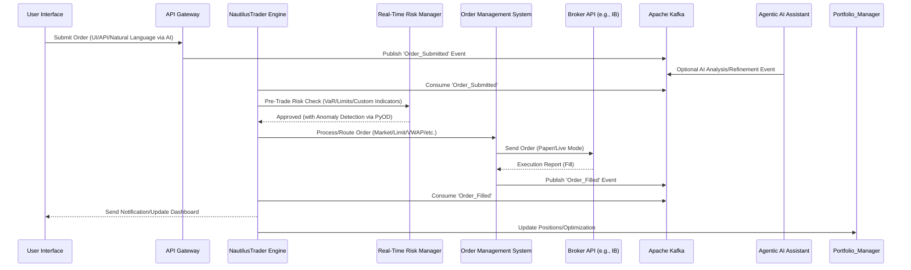

## **Business Requirements Document (BRD)**

### **Nautilus Trader: Enterprise Algorithmic Trading System**

| **Version:** | 3.0                             |
|:------------ |:------------------------------- |
| **Date:**    | August 21, 2025                 |
| **Status:**  | Draft                           |
| **Author:**  | Vincent Pereira                 |
| **Owner:**   | Project Sponsor, Business Owner |

-----

### **1.0 Executive Summary**

#### **1.1 Purpose**

This Business Requirements Document (BRD) defines the business needs, objectives, and functional and non-functional requirements for the **Nautilus Trader Algorithmic Trading System (ATS)**. It serves as the foundational agreement between stakeholders, providing a clear roadmap for the development team to ensure the final product aligns perfectly with business goals and user expectations. The project's goal is to build a comprehensive, enterprise-grade algorithmic trading platform from the ground up, designed to automate trading strategies across a wide array of asset classes. The system adopts a "Best-of-Breed" integration strategy, selecting the top open-source projects for each major component to create a powerful, modular foundation. It caters to both non-technical users through simplicity and no-code options, and professional traders/analysts via enterprise-grade features, leveraging AI Agents and Agentic AI extensively. The architecture is structured as distinct microservices communicating through an Apache Kafka event bus, ensuring decoupling, data replayability for robust testing, and scalability for high-frequency data streams. A standout feature is the sophisticated Agentic AI Assistant, serving as the platform's "brain," enabling natural language management of trading, research, and analysis. The core trading engine is NautilusTrader, a high-performance, Python-based platform with Rust components, supporting event-driven backtesting and live trading across all asset classes.

#### **1.2 Project Background and Problem Statement**

The development of the ATS is driven by a clear market need for a sophisticated yet accessible trading platform. Current market offerings are either too simplistic for professional traders or overly complex for non-technical users. Existing solutions often lack robust, integrated AI-driven tools, exhibit inadequate performance for high-frequency data processing, and fail to meet stringent enterprise security and compliance standards. This project addresses these gaps by building a "Best-of-Breed" system that integrates premier open-source technologies, including NautilusTrader for the trading engine, TradingAgent for multi-agent AI decision-making, OpenBB for financial data, TA-Lib/ta-lib-python (primary) and Bukosabino/ta (secondary) for technical analysis, Stock-Prediction-Models and LSTM-Neural-Network-for-Time-Series-Prediction for forecasting, Real-time-stock-market-prediction for live predictions, VectorBT for GPU-accelerated backtesting, TradingGym for strategy development, PyPortfolioOpt and Riskfolio-Lib for portfolio optimization, PyOD for anomaly detection, Blockly for no-code strategy building, react-financial-charts and Plotly Dash for visualization, SHAP for explainable AI, FinRL for reinforcement learning, Transformers and PyTorch for advanced NLP, and QuantLib for options analytics. The platform will deliver a unified, high-performance, secure system that empowers diverse users with cutting-edge AI-powered tools and analytics.

#### **1.3 Business Objectives and Success Criteria**

The primary business objectives for the Nautilus Trader platform are:

| Objective                                         | Description                                                                                                                                        | Success Criteria / Key Performance Indicators (KPIs)                                                                                                                                                                                                                               |
|:------------------------------------------------- |:-------------------------------------------------------------------------------------------------------------------------------------------------- |:---------------------------------------------------------------------------------------------------------------------------------------------------------------------------------------------------------------------------------------------------------------------------------- |
| **Democratize Algorithmic Trading**               | Make sophisticated trading tools accessible to non-technical users while providing powerful features for professionals, including no-code options and AI-assisted development. | - Successful launch and adoption of the no-code strategy builder via Blockly, generating clean Python code.<br>- High user satisfaction scores for the Agentic AI Assistant, measured by natural language command execution accuracy >90%.                                                                                        |
| **Achieve High Performance**                      | Deliver an institutional-grade, low-latency trading experience suitable for high-frequency strategies, with microsecond-level latency.                      | - Core trading engine latency under 1ms.<br>- API gateway latency under 10ms.<br>- Market data processing latency under 100µs.<br>- GPU-accelerated backtesting completing in seconds for large datasets.                                                                                                                          |
| **Provide AI-Driven Intelligence**                | Leverage AI and ML for predictive insights, automated analysis, and decision-making, including multi-agent collaboration, sentiment analysis, and iterative strategy refinement.         | - >90% accuracy for ML-based pattern recognition and forecasting models (e.g., LSTM).<br>- >85% accuracy for NLP sentiment analysis from Transformers/PyTorch.<br>- Measurable P&L improvement from AI-recommended strategies, with SHAP explainability scores >80%.                                                                                                            |
| **Ensure Enterprise-Grade Security & Compliance** | Build a secure, auditable, and compliant platform with zero-trust architecture, immutable audit trails, and automated threat detection.                      | - Zero critical vulnerabilities in penetration tests.<br>- Successful generation of automated compliance reports (e.g., MiFID II).<br>- Immutable audit trails verifiable via Apache Iceberg.<br>- UEBA detecting anomalies with <5% false positives. |
| **Enhance Trading Efficiency & Reduce Costs**     | Automate workflows, incorporate custom volume-weighted indicators, and use open-source tech to minimize manual effort and overhead.    | - Reduction in manual trade execution errors by >70%.<br>- Increased strategies managed per user (target: 50+).<br>- Lower total cost of ownership compared to proprietary systems, with seamless paper-to-live trading switches.                                                                                                        |
| **Achieve High Reliability & Availability**       | Ensure fault-tolerant, scalable operations with automated self-healing and multi-region failover.                                                           | - Achieve 99.95% system uptime.<br>- Successful automated disaster recovery drills with RTO <4 hours and RPO <15 minutes.<br>- Horizontal scaling handling 10,000+ concurrent users.                                                                                                                              |

#### **1.4 Scope**

##### **In-Scope**

The scope includes the design, development, and deployment of a complete algorithmic trading system with:

- **Multi-Asset Trading:** Support for stocks, ETFs, futures (stock/index), options (stock/index), forex (including futures/options), commodities (including futures/options), and cryptocurrencies (including futures/options).
- **Strategy Development:** Interfaces including no-code visual builder (Blockly generating clean Python code), AI-assisted development/debugging agent, Agentic AI Assistant for natural language commands, and Python Studio.
- **AI-Powered Core:** Agentic AI Assistant as the "brain," leveraging TradingAgent for multi-agent decisions, OpenBB for data, TA-Lib/ta-lib-python and Bukosabino/ta for technical analysis, Stock-Prediction-Models/LSTM for forecasting, Real-time-stock-market-prediction for live predictions. Includes RAG for document querying, MCPs with LangChain/LangGraph for context management, defined workflows for multi-step tasks, and optional future integrations like Hugging Face Transformers/PyTorch.
- **Backtesting & Optimization:** Event-driven backtesting with NautilusTrader, GPU-accelerated with VectorBT, flexible environments with TradingGym, hyperparameter tuning with Optuna.
- **Portfolio & Risk Management:** Optimization with PyPortfolioOpt/Riskfolio-Lib, anomaly detection with PyOD, real-time risk dashboard (VaR, exposure limits, stress testing).
- **Market Data & Scanner:** Multi-source feeds with fallbacks (Yahoo Finance primary, Alpha Vantage/Finnhub/etc. fallbacks per asset class), historical data (5+ years for options), real-time IV surfaces, dividend forecasts. Market Scanner for real-time scanning with custom filters/TA-Lib.
- **Order Management:** OMS with broker connectivity (starting Interactive Brokers), order types (Market/Limit/advanced like VWAP/TWAP), FIX Gateway for institutional connectivity.
- **Broker Integration:** Interactive Brokers for paper/live trading (seamless switching), expansions to Alpaca/OANDA/Coinbase/FIX.
- **Custom Indicators:** Comprehensive volume-weighted indicators (e.g., VW SMA/EMA/MACD/MFI, Normalized ATR, Choppy Market Index, Buy/Sell Easier Day, Strength/Weakness metrics) using TA-Lib/NumPy, integrated into NautilusTrader.
- **Visualization & UI:** Multi-platform (Web/Mobile/Desktop/PWA), react-financial-charts/Plotly Dash/TradingView for charts, Lobe Chat for AI, real-time streaming via WebSocket.
- **Enterprise Features:** Zero-trust architecture, RBAC, immutable audit trails (Apache Iceberg), feature flags (Unleash), SAST (Bandit), UEBA, threat modeling, backup strategy, self-healing microservices.
- **Infrastructure:** Microservices with Kafka event bus (hierarchical topics), cloud-native (Docker/Kubernetes/12-Factor), API-first (REST/GraphQL/WebSocket/gRPC), observability (Prometheus/Grafana/Loki/Jaeger).
- **Advanced Features:** LLM-driven iterative strategy refinement, RLOps for DRL (FinRL), proactive RAG with Researcher agent, AI Knowledge Hub (Archon), voice/AR interfaces, Strategy Marketplace scoping, ultra-low latency (DMA/co-location/FPGAs/SmartNICs), market microstructure analysis.
- **Professional Quick-Start Guide:** Detailed guide for pros on Kafka/ClickHouse/FIX, with commands/outputs.

##### **Out-of-Scope**

- Development of proprietary trading hardware.
- Direct management of client funds or acting as a custodian.
- Providing financial advice; tools for analysis only.
- Management of third-party broker platforms beyond API integrations.

#### **1.5 Stakeholders**

| Stakeholder Role                       | Name/Title       | Interest & Responsibilities                                                                                                                                                                                                                          |
|:-------------------------------------- |:---------------- |:---------------------------------------------------------------------------------------------------------------------------------------------------------------------------------------------------------------------------------------------------- |
| **Project Sponsor**                    | [To Be Assigned] | Provides funding and strategic oversight; ensures alignment with business goals.                                                                                                                                     |
| **Business Owner**                     | [To Be Assigned] | Defines goals and vision; responsible for ROI and market fit.                                                                                                                                               |
| **Retail / Non-Technical Trader**      | End-User Persona | Primary user of no-code tools/AI assistant; requires intuitive interface.                                                                                                                       |
| **Professional / Quantitative Trader** | End-User Persona | Primary user of Python Studio/advanced analytics/low-latency; requires deep functionality.                                                                                   |
| **Portfolio / Risk Manager**           | End-User Persona | Uses risk dashboards/optimization/compliance tools for exposure management.                                                                                                                |
| **Compliance Officer**                 | [To Be Assigned] | Ensures regulatory compliance (e.g., MiFID II); requires audit trails/reporting.                                                                                     |
| **Development Team**                   | Internal         | Responsible for design/implementation/testing/deployment; includes AI/ML/UI/DevOps roles. |
| **Security Team**                      | [To Be Assigned] | Implements/monitors zero-trust/encryption/threat detection.                                                                                                             |

#### **1.6 Assumptions and Dependencies**

- **Assumption:** Market data feeds/broker APIs (e.g., Interactive Brokers) available/reliable.
- **Assumption:** Cloud infrastructure meets performance/scalability needs.
- **Dependency:** Stability of open-source components (e.g., NautilusTrader/Kafka); mitigated by Phase 0 dependency management.
- **Dependency:** Phase completion dependent on prior phases.

-----

## 2. Diagrams and Workflows

### 2.1 Architecture Diagram

The high-level architecture is depicted below, illustrating client interfaces, API gateway, microservices, Kafka event bus, and data storage.

```mermaid
graph TD
    subgraph "Client Layer"
        CL1[Web Dashboard (Next.js)]
        CL2[Mobile App (React Native)]
        CL3[Desktop App (Electron)]
        CL4[External API Clients]
    end

    subgraph "API Gateway & Service Mesh"
        AG[NGINX Ingress Controller]
        SM[Istio Service Mesh]
    end

    subgraph "Microservices Layer"
        MS1[Trading Engine (NautilusTrader)]
        MS2[Agentic AI Assistant (TradingAgent/LangChain)]
        MS3[Portfolio Manager (PyPortfolioOpt/Riskfolio-Lib)]
        MS4[Risk Manager (Real-Time VaR/Stress Testing)]
        MS5[Market Data Service (Multi-Source Feeds)]
        MS6[Order Management System (OMS with FIX)]
        MS7[Market Scanner Service]
    end

    subgraph "Event Bus"
        EB[Apache Kafka (Hierarchical Topics)]
    end

    subgraph "Data Layer"
        DL1[PostgreSQL/pgvector - Transactional/Vector]
        DL2[ClickHouse - Analytics/Time-Series]
        DL3[Qdrant - Vector Search]
        DL4[Apache Iceberg - Audit Trails]
        DL5[DuckDB - Local Analytics]
        DL6[Redis - Cache]
    end

    CL1 --> AG
    CL2 --> AG
    CL3 --> AG
    CL4 --> AG
    AG --> SM
    SM --> MS1
    SM --> MS2
    SM --> MS3
    SM --> MS4
    SM --> MS5
    SM --> MS6
    SM --> MS7
    MS1 --> EB
    MS2 --> EB
    MS3 --> EB
    MS4 --> EB
    MS5 --> EB
    MS6 --> EB
    MS7 --> EB
    EB --> DL1
    EB --> DL2
    EB --> DL3
    EB --> DL4
    EB --> DL5
    EB --> DL6
```

### 2.2 Business Process Model

#### **2.2.1 High-Level Trading Workflow**

The event-driven workflow from trade submission to execution.



**Workflow Description:**

1. User submits order via UI/API or natural language to AI Assistant.
2. API Gateway publishes event to Kafka.
3. AI may refine/analyze if involved.
4. Trading Engine consumes, checks risk (including custom VW indicators/PyOD).
5. Approved orders routed via OMS to broker (paper/live toggle).
6. Execution published to Kafka for updates across services/portfolio.

-----

### **3.0 Functional Requirements**

#### **3.1 User Interfaces and Experience (UI/UX)**

- **FR-101: Multi-Platform Access:** Consistent responsive UI across Web (Next.js), Mobile (React Native), Desktop (Electron), PWA; includes push notifications/biometric auth.
- **FR-102: Real-Time Trading Dashboard:** Customizable dashboard for portfolio/P&L/positions/market data/active strategies; real-time updates via WebSocket.
- **FR-103: Advanced Charting:** Integrate TradingView/react-financial-charts/Plotly Dash for real-time data, 50+ indicators (including custom VW), drawing tools, multi-timeframes.
- **FR-104: AI Chat Interface:** Lobe Chat for natural language interaction with Agentic AI (queries/backtests/trades/document analysis).
- **FR-105: No-Code Strategy Builder:** Blockly drag-and-drop generating clean, readable Python code; pathway to programmatic customization.
- **FR-106: Python Development Environment:** Python Studio for coding/debugging; AI-assisted via OpenHands/Goose.
- **FR-107: Glass Box UI/Decision Event Explorer:** Visualize Kafka event chains for trades, with sentiment trends/topic clouds.
- **FR-108: Market Scanner UI:** High-performance grid for real-time scanning results based on custom criteria/TA-Lib.
- **FR-109: Risk & Analytics Dashboard:** Real-time risk metrics (VaR/exposure), performance analytics, live calculations.
- **FR-110: Voice/AR Interfaces:** Future-ready voice trading/AR visuals for enhanced interaction.
- **FR-111: Professional Quick-Start Guide:** Integrated guide with commands for Kafka/ClickHouse/FIX, e.g., docker-compose --profile pro up, JupyterHub access, etc.

#### **3.2 Trading and Order Management**

- **FR-201: Multi-Asset Class Support:** Equities/ETFs/futures/options/forex/commodities/crypto across venues.
- **FR-202: Comprehensive Order Types:** Market/Limit/Stop/Stop-Limit/advanced (VWAP/TWAP/Iceberg); smart order router for slicing/minimizing impact.
- **FR-203: Broker Integration:** Unified abstraction for Interactive Brokers (paper/live toggle), Alpaca/OANDA/Coinbase; intelligent routing.
- **FR-204: FIX Protocol Connectivity:** FIX Gateway (QuickFIX/J/FIX8) for institutional connectivity.
- **FR-205: Order Lifecycle Management:** Validation/execution/fill processing/compliance checks; placement/modification/cancellation via UI.
- **FR-206: Paper/Live Trading Modes:** Seamless switching in UI; configure NautilusTrader for IB paper/live, compliance/regulations.
- **FR-207: Position Management & Settlement:** Real-time position tracking/trade settlement.

#### **3.3 AI, Analytics, and Strategy Development**

- **FR-301: Agentic AI Assistant:** Multi-agent (Analyst/Researcher/Risk/Compliance/Trader); asynchronous Kafka communication; natural language for trading/research/backtests; RAG for documents; MCPs (LangChain/LangGraph) for context/workflows; iterative refinement feedback loop.
- **FR-302: Predictive Modeling:** Integrate Stock-Prediction-Models/LSTM/Real-time-stock-market-prediction for forecasting/time-series; sub-ms inference engine (TensorFlow Serving/PyTorch).
- **FR-303: High-Performance Backtesting:** NautilusTrader event-driven; VectorBT GPU; TradingGym simulations; Optuna tuning.
- **FR-304: Portfolio Optimization:** PyPortfolioOpt/Riskfolio-Lib for mean-variance/hierarchical risk parity/rebalancing/attribution.
- **FR-305: Sentiment Analysis:** Pipeline for news/social/financial docs using Transformers/PyTorch.
- **FR-306: Explainable AI (XAI):** SHAP for model explanations.
- **FR-307: Reinforcement Learning:** FinRL for DRL strategies; RLOps pipeline for continuous training/delivery.
- **FR-308: Anomaly Detection:** PyOD for detecting irregularities in data/trades.
- **FR-309: Custom Volume-Weighted Indicators:** Implement/integrate: VW SMA/EMA/MACD/MFI (various periods), Normalized ATR (21/8 Day), Rupee/Dollar Volatility, Contract Risk, ATR Percent, Strength/Weakness (21/8 Day), High Low Range Avg, SMA Avg % Change, Buy/Sell Easier Day, Choppy Market Index (21/8 Day), Market Mode; using TA-Lib/NumPy.
- **FR-310: Proactive RAG Intelligence:** Researcher agent monitors sources (news/SEC), updates vector DB (Qdrant/pgvector) real-time.
- **FR-311: AI Knowledge Hub (Archon):** Central MCP server for agents; ingest docs for Tier 1 components.
- **FR-312: Market Microstructure Analysis:** Real-time order book/liquidity detection/market impact estimation.
- **FR-313: Options Analytics:** QuantLib for pricing/IV surfaces/dividend integration.

#### **3.4 Risk, Security, and Compliance**

- **FR-401: Real-Time Risk Management:** Dashboard/engine for VaR/exposure/limits/stress/circuit breakers; pre-trade checks.
- **FR-402: Zero-Trust Security:** Continuous verification; service mesh enforcement.
- **FR-403: Role-Based Access Control (RBAC):** Granular access.
- **FR-404: Immutable Audit Trails:** Apache Iceberg for all actions/events.
- **FR-405: Automated Security Scanning:** SAST with Bandit for Python vulnerabilities.
- **FR-406: Feature Flags & Kill Switches:** Unleash for dynamic toggling/emergencies.
- **FR-407: User/Entity Behavior Analytics (UEBA):** Proactive threat detection.
- **FR-408: Threat Modeling:** STRIDE methodology in SDLC.
- **FR-409: Backup Strategy:** Formalized for data resilience.
- **FR-410: Microservice Self-Healing:** Automated detection/restoration.

#### **3.5 Market Data and Infrastructure**

- **FR-501: Multi-Source Data Feeds:** Primary Yahoo Finance; fallbacks (Alpha Vantage/Finnhub/Investing.com/CME/Twelve Data/Polygon/Barchart/SpiderRock/TradingCharts/Oanda) per asset; Kafka streaming/auto-switch on failure.
- **FR-502: Historical Data:** 5+ years options chains; free sources for paper (Yahoo/Alpha/etc.), IB for live.
- **FR-503: Data Normalization/Distribution:** Real-time/historical normalization; multi-asset fallback chains.
- **FR-504: Ultra-Low Latency Infrastructure:** DMA/co-location strategy; FPGAs/SmartNICs exploration; lock-free structures/cache alignment.
- **FR-505: Kubernetes Deployment:** Helm charts/Istio/GitOps CI/CD.
- **FR-506: Event-Driven Architecture:** Kafka hierarchical topics (e.g., domain.action.entity.source.symbol); wildcard subscriptions.
- **FR-507: Schema Registry:** For data consistency.
- **FR-508: Customer Service Bot:** RAG-based automated support.
- **FR-509: Strategy Marketplace:** Scoped for future with copy trading.

-----

### **4.0 Non-Functional Requirements (NFRs)**

| Category                       | NFR ID | Requirement Description                                                                                                                                                                      |
|:------------------------------ |:------ |:-------------------------------------------------------------------------------------------------------------------------------------------------------------------------------------------- |
| **Performance & Latency**      | NFR-01 | Trading engine <1ms latency; microsecond-level for operations.                                                                                                       |
|                                | NFR-02 | API Gateway <10ms response.                                                                                                                           |
|                                | NFR-03 | Market data <100µs processing.                                                                                         |
| **Scalability & Throughput**   | NFR-04 | Horizontal scaling for 10,000+ users/connections.                                                                                           |
|                                | NFR-05 | API >10,000 RPS.                                                                                                       |
|                                | NFR-06 | Market data >1M messages/sec.                                                                                                           |
| **Reliability & Availability** | NFR-07 | 99.95% uptime.                                                                                                         |
|                                | NFR-08 | Multi-AZ/multi-region with auto-failover/self-healing.                                      |
|                                | NFR-09 | RTO <4 hours; RPO <15 minutes.                                                   |
| **Security**                   | NFR-10 | TLS 1.3+ for transit; AES-256 at rest.                                                                                                                               |
|                                | NFR-11 | Zero-Trust with service mesh. |
| **Observability**              | NFR-13 | Prometheus/Grafana for metrics/dashboards.         |
|                                | NFR-14 | Jaeger/Tempo for tracing.                       |
|                                | NFR-15 | Loki/ELK for logs.      |
| **Compliance**                 | NFR-16 | Automated reports (MiFID II/SOX); data retention.                                          |

-----

### **5.0 Data Requirements**

#### **5.1 Data Sources**

- Real-time/historical market data from multi-sources/fallbacks per asset.
- Fundamental/alternative data (OpenBB/news/social).
- User/transactional data (orders/strategies).

#### **5.2 Data Management and Storage**

- **Transactional/Vector:** PostgreSQL/pgvector/Qdrant.
- **Analytics/Time-Series:** ClickHouse/DuckDB.
- **Audit:** Apache Iceberg.
- **Cache:** Redis.
- **Event Log:** Kafka with Schema Registry.

-----

### **6.0 Project Phases and Milestones**

Incremental phases:

| Phase       | Title & Objective                                                                                                                                                                          | Key Deliverables                                                                                                                                                                                                                                                                                                     |
|:----------- |:------------------------------------------------------------------------------------------------------------------------------------------------------------------------------------------ |:-------------------------------------------------------------------------------------------------------------------------------------------------------------------------------------------------------------------------------------------------------------------------------------------------------------------- |
| **Phase 0** | Dependency Management Setup: Framework for 60+ components.                  | Automated monitoring/notifications/testing; health dashboard.                                              |
| **Phase 1** | Core System Validation & Hardening: Stabilize core with observability/security.    | Validated zero-trust/trading engine/API; database connections; Kafka hierarchical topics; threat modeling; data fallback.                                        |
| **Phase 2** | Frontend and Broker Integration: MVP UI/broker for paper trading.                                  | Multi-platform UI; IB integration/abstraction; Lobe Chat/Blockly; WebSocket streaming; paper/live toggle.                                         |
| **Phase 3** | AI/ML Integration: Add AI brains with agents/models.           | LangChain/Graph; TradingAgents; inference engine; Archon hub; FinRL/PyOD/Optuna/Transformers; RLOps; custom VW indicators; sentiment pipeline. |
| **Phase 4** | Frontend & Live Trading: Enable live execution/transparency.          | WebSocket/REST for live; order management UI; TradingView/risk/analytics dashboards; Glass Box UI.                                           |
| **Phase 5** | Enterprise Readiness: High availability/security/compliance.         | Multi-region failover; audit trails; LDAP/Unleash/Feast; regulatory reporting; Pro Quick-Start; Market Scanner; UEBA; self-healing.                  |
| **Phase 6** | System Enhancement & Future-Ready Tech: Low-latency/next-gen features. | Smart router/algorithms; broker expansions; Kubernetes deployment; iterative refinement; voice/AR; Memray/Tempo; DMA/FPGAs; microstructure; Marketplace scoping.                |

-----

### **7.0 Risks and Mitigation**

| Risk Category                   | Description                                                                                                                                                                  | Mitigation Strategy                                                                                                                                                                                                                                                                                                                                            |
|:------------------------------- |:---------------------------------------------------------------------------------------------------------------------------------------------------------------------------- |:-------------------------------------------------------------------------------------------------------------------------------------------------------------------------------------------------------------------------------------------------------------------------------------------------------------------------------------------------------------- |
| **Integration Complexity**      | Integrating 60+ components.                                | Phase 0 management; forked repos/buffer time.                                                                                       |
| **Performance Bottlenecks**     | Failing sub-ms latency.                | Rust optimizations; Memray profiling; gRPC/Kafka. |
| **Security Vulnerabilities**    | Breaches of financial data.                       | Zero-Trust/audits/Bandit in CI/CD.                                  |
| **Regulatory Non-Compliance**   | Failing MiFID II/GDPR. | Compliance involvement/audit trails/automated reports.                                                                                        |
| **Open-Source Dependency Risk** | Abandonment/vulnerabilities.                                       | Monitoring/forks/security patches.                                      |

-----

### **8.0 Approval and Sign-off**

| Stakeholder Role       | Signature | Date |
|:---------------------- |:--------- |:---- |
| **Project Sponsor**    |           |      |
| **Business Owner**     |           |      |
| **Lead Developer**     |           |      |
| **Compliance Officer** |           |      |

-----

### **9.0 Glossary**

| Term           | Definition                                                                                                                                                                                    |
|:-------------- |:--------------------------------------------------------------------------------------------------------------------------------------------------------------------------------------------- |
| **Agentic AI** | Multi-agent collaborative AI for tasks.                                                   |
| **ATS**        | Algorithmic Trading System.                                                                                                                                           |
| **FIX**        | Financial Information eXchange protocol.                                           |
| **RAG**        | Retrieval-Augmented Generation. |
| **RBAC**       | Role-Based Access Control.                                              |
| **VaR**        | Value at Risk.                                            |
| **Zero-Trust** | Never trust, always verify.          |

### **10.0 Appendices**

- **Appendix A:** Comprehensive System Architecture Document.
- **Appendix B:** Detailed Design Specifications.
- **Appendix C:** Full Phased Implementation Tasks.

---

**Note:** This is a high-level overview of the project. The actual implementation details will be provided in the detailed design specifications and comprehensive system architecture document.

