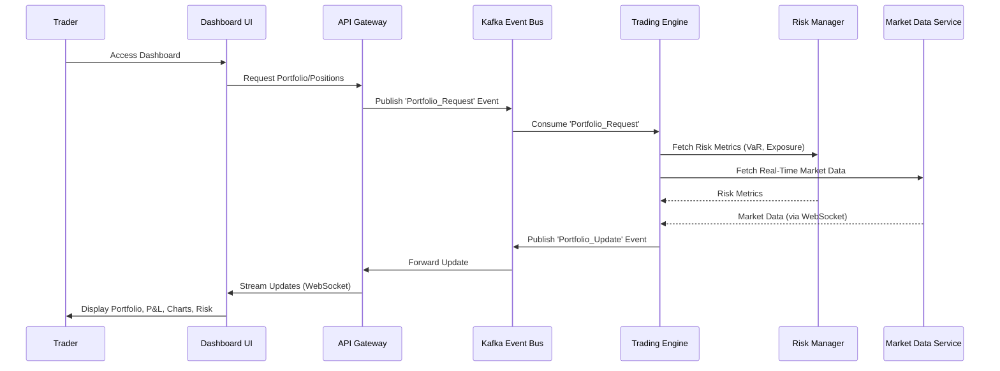
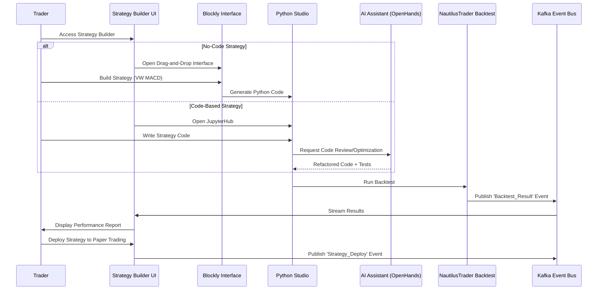
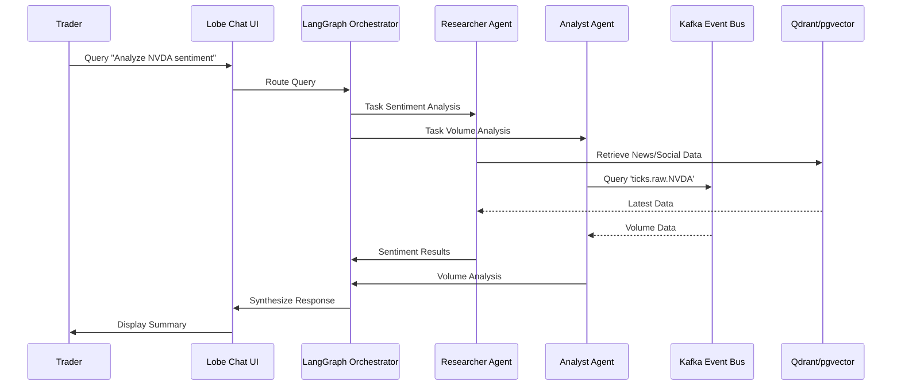
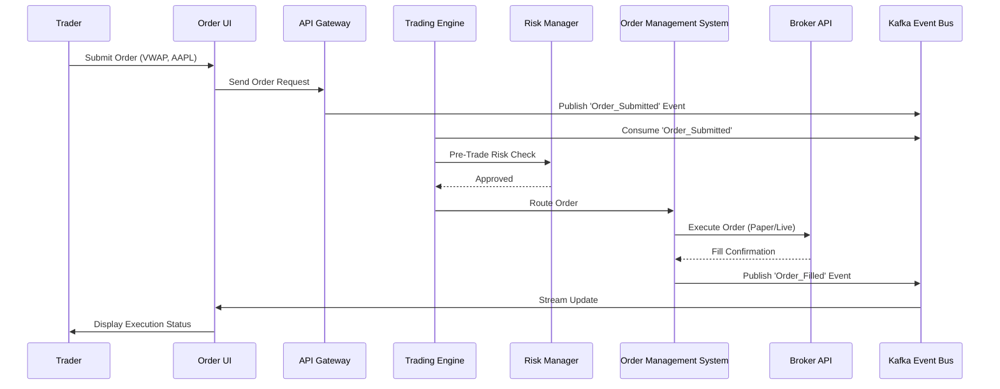
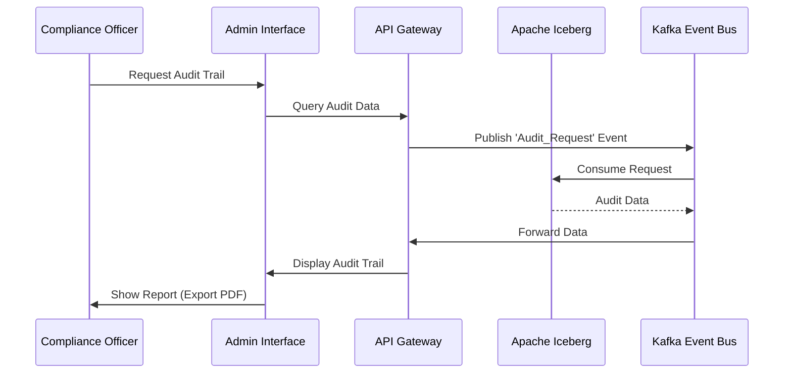
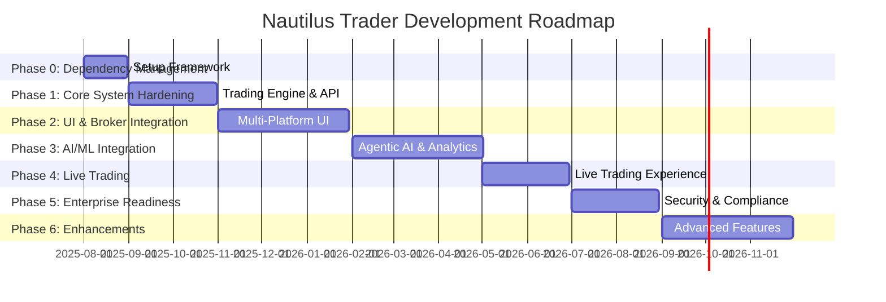

## **Product Requirements Document (PRD)**

### **Nautilus Trader: Enterprise Algorithmic Trading System**

| **Version:**      | 3.0                    |
|:----------------- |:---------------------- |
| **Date:**         | August 21, 2025        |
| **Status:**       | Draft                  |
| **Product Lead:** | [Product Manager Name] |

---

### **1.0 Introduction**

#### **1.1 Product Vision**

The Nautilus Trader Algorithmic Trading System (ATS) is envisioned as the definitive platform for algorithmic trading, designed to empower a diverse user base ranging from non-technical retail investors to sophisticated quantitative analysts and institutional portfolio managers. By adopting a "Best-of-Breed" integration strategy, the platform leverages premier open-source technologies to deliver a modular, high-performance, and AI-driven trading ecosystem. Central to its design is an Agentic AI Assistant, acting as the platform’s "brain," which enables natural language interaction, advanced analytics, and autonomous decision-making. Built on a microservices architecture with Apache Kafka as the event bus, Nautilus Trader ensures ultra-low latency, scalability, and data replayability for robust testing and compliance. The platform supports multi-asset trading across stocks, ETFs, futures, options, forex, commodities, and cryptocurrencies, offering intuitive no-code interfaces, enterprise-grade security, and comprehensive observability to meet the needs of retail and institutional users alike.

#### **1.2 The Problem**

The financial technology landscape is fragmented, with existing trading platforms failing to address critical user needs:

- **Accessibility Barriers:** Retail investors lack access to sophisticated trading tools due to complex interfaces or programming requirements, while professional traders are constrained by platforms that lack flexibility for advanced strategies.
- **Limited Intelligence:** Most platforms offer rudimentary analytics, missing integrated AI capabilities for predictive modeling, sentiment analysis, or automated strategy refinement, limiting decision-making power.
- **Performance Gaps:** High-frequency trading demands microsecond-level latency and high-throughput data processing, which many platforms cannot deliver due to outdated architectures.
- **Security and Compliance Shortfalls:** Institutional users require zero-trust security, immutable audit trails, and automated compliance reporting (e.g., MiFID II, SOX), which are often inadequately implemented.
- **Fragmented Tooling:** Traders juggle multiple tools for data analysis, backtesting, and execution, leading to inefficiencies and discrepancies between research and production environments.
- **High Costs:** Proprietary systems incur significant licensing and maintenance costs, while open-source solutions often lack enterprise-grade integration and support.

Nautilus Trader addresses these challenges by delivering a unified, accessible, high-performance, and secure platform that leverages open-source technologies to reduce costs while providing institutional-grade functionality.

#### **1.3 Target Audience & User Personas**

The platform serves four primary user personas, each with distinct needs and goals:

**Persona 1: Retail Investor (Sarah)**

- **Background:** Sarah, 35, is a retail investor with a solid understanding of market fundamentals but no coding skills. She manages a personal portfolio and seeks to automate trading strategies to optimize returns.
- **Goals:**
  - Build and deploy strategies using no-code tools like Blockly.
  - Access AI-driven market insights and portfolio summaries in plain language.
  - Monitor portfolio performance and risks in real-time with minimal setup.
  - Seamlessly switch between paper and live trading modes for safe testing.
- **Pain Points:**
  - Intimidated by platforms requiring coding expertise.
  - Struggles to translate trading ideas into executable strategies.
  - Concerned about the opacity of automated systems and associated risks.
  - Limited by platforms lacking comprehensive multi-asset support.

**Persona 2: Quantitative Analyst (Michael)**

- **Background:** Michael, 40, is a professional quant at a hedge fund, proficient in Python, Rust, and statistical modeling. He develops high-frequency, data-driven trading strategies requiring low-latency execution.
- **Goals:**
  - Utilize a trading engine with sub-millisecond latency for high-frequency strategies.
  - Integrate custom datasets, machine learning models, and proprietary indicators.
  - Leverage GPU-accelerated backtesting and hyperparameter optimization.
  - Ensure compliance through auditable trade logs and FIX connectivity.
- **Pain Points:**
  - Frustrated by discrepancies between backtesting and live trading environments.
  - Spends excessive time on infrastructure setup instead of strategy development.
  - Needs flexible APIs and observability tools for debugging.
  - Requires enterprise-grade features for institutional workflows.

**Persona 3: Portfolio Manager (Emma)**

- **Background:** Emma, 45, oversees diversified portfolios at an asset management firm, focusing on risk management, optimization, and performance attribution across multiple asset classes.
- **Goals:**
  - Access real-time risk dashboards with metrics like Value at Risk (VaR) and exposure limits.
  - Optimize portfolios using advanced techniques (mean-variance, hierarchical risk parity).
  - Conduct stress tests to assess portfolio resilience.
  - Use AI-driven insights to identify market trends and anomalies.
- **Pain Points:**
  - Lacks integrated tools for real-time risk monitoring and rebalancing.
  - Struggles with platforms lacking multi-asset risk analytics.
  - Requires explainable AI outputs for stakeholder reporting.
  - Needs seamless compliance reporting integration.

**Persona 4: Compliance Officer (Priya)**

- **Background:** Priya, 38, is a compliance officer at a financial institution, responsible for regulatory adherence (MiFID II, SOX, GDPR) and data security.
- **Goals:**
  - Maintain immutable audit trails for all trading and system events.
  - Generate automated compliance reports with minimal effort.
  - Implement zero-trust security and user behavior analytics for threat detection.
  - Ensure platform stability and regulatory alignment for institutional clients.
- **Pain Points:**
  - Current platforms lack robust audit capabilities or require manual data extraction.
  - Security vulnerabilities expose sensitive financial data.
  - Difficulty monitoring user behavior for insider threats.
  - Needs clear documentation and quick-start guides for professional users.

#### **1.4 Strategic Fit & Goals**

Nautilus Trader aligns with strategic business objectives by:

- **Democratizing Trading:** Providing no-code tools and AI assistance to empower retail investors, increasing user adoption and engagement.
- **Maximizing Performance:** Delivering microsecond-level latency and high-throughput data processing for high-frequency trading.
- **Enhancing Intelligence:** Integrating Agentic AI, predictive analytics, and sentiment analysis for superior decision-making.
- **Ensuring Enterprise Readiness:** Implementing zero-trust security, immutable audit trails, and automated compliance reporting for institutional adoption.
- **Reducing Costs:** Leveraging open-source technologies to lower total cost of ownership compared to proprietary systems.
- **Achieving Scalability and Reliability:** Supporting 10,000+ concurrent users with 99.95% uptime via a cloud-native microservices architecture.

---

### **2.0 System Architecture Overview**

The Nautilus Trader platform is built on a modular, event-driven microservices architecture, ensuring scalability, fault tolerance, and low-latency performance. The following Mermaid diagram illustrates the high-level architecture:

```mermaid
graph TD
    subgraph "Client Layer"
        CL1[Web Dashboard (Next.js)]
        CL2[Mobile App (React Native)]
        CL3[Desktop App (Electron)]
        CL4[PWA]
        CL5[External API Clients]
    end

    subgraph "API Gateway & Service Mesh"
        AG[NGINX Ingress Controller]
        SM[Istio Service Mesh]
    end

    subgraph "Microservices Layer"
        MS1[Trading Engine (NautilusTrader)]
        MS2[Agentic AI Assistant (TradingAgent/LangChain)]
        MS3[Portfolio Manager (PyPortfolioOpt/Riskfolio-Lib)]
        MS4[Risk Manager (Real-Time VaR/Stress Testing)]
        MS5[Market Data Service (Multi-Source Feeds)]
        MS6[Order Management System (OMS with FIX)]
        MS7[Market Scanner Service]
        MS8[Customer Service Bot (RAG-Based)]
    end

    subgraph "Event Bus"
        EB[Apache Kafka (Hierarchical Topics)]
    end

    subgraph "Data Layer"
        DL1[PostgreSQL/pgvector - Transactional/Vector]
        DL2[ClickHouse - Analytics/Time-Series]
        DL3[Qdrant - Vector Search]
        DL4[Apache Iceberg - Audit Trails]
        DL5[DuckDB - Local Analytics]
        DL6[Redis - Cache]
    end

    CL1 --> AG
    CL2 --> AG
    CL3 --> AG
    CL4 --> AG
    CL5 --> AG
    AG --> SM
    SM --> MS1
    SM --> MS2
    SM --> MS3
    SM --> MS4
    SM --> MS5
    SM --> MS6
    SM --> MS7
    SM --> MS8
    MS1 --> EB
    MS2 --> EB
    MS3 --> EB
    MS4 --> EB
    MS5 --> EB
    MS6 --> EB
    MS7 --> EB
    MS8 --> EB
    EB --> DL1
    EB --> DL2
    EB --> DL3
    EB --> DL4
    EB --> DL5
    EB --> DL6
```

**Architecture Description:**

- **Client Layer:** Provides multi-platform access via web (Next.js), mobile (React Native), desktop (Electron), PWA, and external API clients.
- **API Gateway & Service Mesh:** NGINX Ingress Controller and Istio ensure secure, scalable API access and service communication.
- **Microservices Layer:** Independent services for trading, AI, portfolio management, risk, market data, order management, scanning, and customer support, communicating via Kafka.
- **Event Bus:** Apache Kafka with hierarchical topics (e.g., `domain.action.entity.source.symbol`) enables decoupled, auditable data flows.
- **Data Layer:** Diverse storage solutions (PostgreSQL/pgvector, ClickHouse, Qdrant, Apache Iceberg, DuckDB, Redis) support transactional, analytical, vector, audit, and caching needs.

---

### **3.0 Product Features and Requirements**

This section details the core features and requirements, ensuring all functionalities from the "Features, Phases & Integration Strategy - Algorithmic Trading System" document are comprehensively addressed.

#### **3.1 Feature: Unified Multi-Platform Experience**

- **Description:** A seamless, responsive user experience across web, mobile, desktop, and PWA platforms, delivering real-time updates and customizable interfaces for trading, analytics, and risk management.

- **Goal:** To enable users to manage trading activities from any device, ensuring accessibility, consistency, and real-time performance.

- **User Stories & Requirements:**
  
  - **User Story (Sarah):** "As a retail investor, I want to access my trading dashboard on any device, so I can monitor my portfolio and trades on the go."
    - The system SHALL provide a responsive web interface using React 18, Next.js, and TypeScript, compatible with Chrome, Firefox, Safari, and Edge.
    - The system SHALL offer a PWA with offline functionality, push notifications for market events, and native-like installation.
    - The system SHALL provide native mobile apps for iOS and Android using React Native, supporting biometric authentication and push notifications.
    - The system SHALL provide a desktop application for Windows, macOS, and Linux using Electron, with system tray integration and native notifications.
    - All UI components SHALL update in real-time via WebSocket connections for market data, portfolio updates, and trade executions.
  - **User Story (Michael):** "As a quant, I want a customizable dashboard with advanced charting, so I can monitor strategies and analytics in real-time."
    - The system SHALL provide a customizable trading dashboard displaying portfolio value, P&L, open positions, active strategies, and market data, with user-configurable layouts saved across sessions.
    - The dashboard SHALL integrate TradingView, react-financial-charts, and Plotly Dash for professional-grade charting, supporting real-time price data, over 50 technical indicators, multiple timeframes, and drawing tools.
    - The system SHALL implement a "Glass Box UI / Decision Event Explorer" to visualize Kafka event chains, including timestamps, agent decisions, sentiment trends, and topic clouds.
  - **User Story (Emma):** "As a portfolio manager, I want a real-time risk dashboard, so I can monitor VaR and exposure limits."
    - The system SHALL provide a real-time risk monitoring interface with visual warnings for approaching risk limits, configurable via user-defined thresholds.
    - The system SHALL support a high-performance UI grid for the Market Scanner Service, displaying real-time scanning results based on custom criteria and technical indicators.

- **Workflow Diagram (Trading Dashboard Interaction):**



#### **3.2 Feature: Democratized Strategy Development**

- **Description:** A comprehensive suite of tools for creating, testing, and deploying trading strategies, including no-code visual builders, AI-assisted coding, and professional Python environments, supported by custom volume-weighted indicators.

- **Goal:** To enable retail investors to automate strategies without coding while providing quants with powerful, flexible development tools.

- **User Stories & Requirements:**
  
  - **User Story (Sarah):** "As a retail investor, I want a drag-and-drop tool to build strategies, so I can automate my trading ideas easily."
    - The system SHALL provide a no-code strategy builder using Blockly, supporting drag-and-drop blocks for technical indicators, operators, conditions, and trade actions.
    - The Blockly builder SHALL generate clean, human-readable, well-commented Python code compatible with NautilusTrader’s strategy framework.
    - The system SHALL allow users to configure strategy parameters (e.g., symbol, timeframe, quantity) and validate logic before execution.
  - **User Story (Michael):** "As a quant, I want a Python environment with AI assistance to develop and optimize complex strategies."
    - The system SHALL provide a "Python Studio" with JupyterHub, featuring syntax highlighting, autocompletion, and debugging tools.
    - The system SHALL integrate an AI-Assisted Development Agent (OpenHands) for Python code generation, refactoring, debugging, and test coverage expansion.
    - The system SHALL include a high-level AI workflow orchestrator (Codename Goose) to automate multi-step DevOps tasks, such as pipeline fixes and strategy optimization.
  - **User Story (Michael):** "As a quant, I want robust backtesting and optimization tools, so I can validate strategies realistically."
    - The system SHALL provide an event-driven backtesting engine via NautilusTrader, simulating strategies against historical tick-level data with slippage, fees, and latency.
    - The system SHALL integrate VectorBT for GPU-accelerated backtesting, enabling rapid testing across large parameter sets.
    - The system SHALL support TradingGym for flexible strategy development environments, simulating various market scenarios.
    - Backtests SHALL generate comprehensive performance reports with metrics like Sharpe Ratio, Maximum Drawdown, and trade-by-trade analysis.
    - The system SHALL integrate Optuna for hyperparameter optimization, automatically tuning strategy parameters.
  - **User Story (Michael):** "As a quant, I want custom indicators tailored to my markets, so I can develop precise strategies."
    - The system SHALL implement custom volume-weighted indicators using TA-Lib, Bukosabino/ta, and NumPy, integrated into NautilusTrader, including:
      - Beta vis-à-vis Market Index
      - Auto Correlation
      - Historical/Intraday Annual Volatility
      - VW SMA/EMA/MACD/MFI (various periods)
      - Normalized ATR (21/8 Day)
      - Rupee/Dollar/Pound Volatility
      - Contract Risk
      - Choppy Market Index
      - Buy/Sell Easier Day Metrics
    - Indicators SHALL be configurable for different markets (e.g., Dollar Volatility for US exchanges) and integrated into backtesting and live trading workflows.

- **Workflow Diagram (Strategy Development):**



#### **3.3 Feature: Agentic AI Assistant**

- **Description:** A conversational AI system serving as the platform’s "brain," enabling natural language interaction for trading, research, backtesting, and document analysis, powered by a multi-agent framework and RAG pipeline.

- **Goal:** To transform user interactions into intuitive, conversational workflows, delivering actionable insights and automating complex tasks.

- **User Stories & Requirements:**
  
  - **User Story (Sarah):** "As a retail investor, I want to ask the system in plain English for market insights or to execute trades, so I can act without technical expertise."
    - The system SHALL provide a chatbot interface via Lobe Chat for natural language queries, backtests, trade execution, and document analysis.
    - The AI assistant SHALL process commands like “Run a backtest on a VW MACD strategy for AAPL” or “Summarize sentiment for tech stocks.”
  - **User Story (Emma):** "As a portfolio manager, I want the AI to analyze documents and monitor trends, so I can make informed decisions."
    - The system SHALL implement a Retrieval-Augmented Generation (RAG) pipeline with RAGFlow to process user-uploaded documents (e.g., SEC filings, research papers).
    - The system SHALL deploy a proactive RAG intelligence engine with a Researcher agent to monitor external sources (news, social media) and update Qdrant/pgvector in real-time.
    - The system SHALL integrate an AI Knowledge Hub (Archon) as a central MCP server, ingesting documentation for Tier 1 components (NautilusTrader, Kafka).
  - **User Story (Michael):** "As a quant, I want the AI to refine my strategies iteratively, so I can improve performance automatically."
    - The AI assistant SHALL consist of specialized agents (Analyst, Researcher, Risk Manager, Compliance, Trader) communicating via Kafka for asynchronous, auditable interactions.
    - The system SHALL implement Model Context Protocols (MCPs) using LangChain and LangGraph for multi-step workflows and conversation history.
    - The system SHALL support iterative strategy refinement, analyzing performance and generating optimized code via FinRL and Optuna.

- **Workflow Diagram (AI Assistant Interaction):**



#### **3.4 Feature: Multi-Asset Trading and Broker Integration**

- **Description:** Comprehensive support for trading multiple asset classes with seamless broker integration, enabling paper and live trading with advanced order types.

- **Goal:** To provide a flexible, high-performance trading engine supporting diverse markets and reliable execution.

- **User Stories & Requirements:**
  
  - **User Story (Sarah):** "As a retail investor, I want to trade stocks, options, and crypto easily, so I can diversify my portfolio."
    - The system SHALL support trading across stocks, ETFs, futures (stock/index), options (stock/index), forex, commodities, and cryptocurrencies.
    - The system SHALL provide an intuitive order management interface for placing, modifying, and canceling orders, with real-time pre-trade risk checks.
  - **User Story (Michael):** "As a quant, I want a low-latency trading engine with FIX connectivity, so I can execute high-frequency strategies."
    - The system SHALL integrate with Interactive Brokers for paper and live trading, with seamless mode switching in the UI.
    - The system SHALL provide a unified broker abstraction layer to normalize data and order execution across Interactive Brokers, Alpaca, OANDA, and Coinbase.
    - The system SHALL implement a FIX Gateway (QuickFIX/J, FIX8) for institutional connectivity.
    - The system SHALL support standard order types (Market, Limit, Stop, Stop-Limit) and advanced orders (VWAP, TWAP, Iceberg) via a smart order router.
    - The system SHALL manage the full order lifecycle, including validation, execution, fill processing, and settlement.

- **Workflow Diagram (Order Execution):**



#### **3.5 Feature: Advanced Analytics and Portfolio Management**

- **Description:** A suite of AI-driven analytics tools for predictive modeling, portfolio optimization, risk management, and market analysis, incorporating custom indicators and explainable AI.
- **Goal:** To empower users with data-driven insights and robust risk management tools to optimize performance and mitigate risks.
- **User Stories & Requirements:**
  - **User Story (Emma):** "As a portfolio manager, I want real-time risk metrics and optimization tools, so I can manage exposure and maximize returns."
    - The system SHALL provide a real-time risk dashboard with VaR, exposure limits, and circuit breakers, updating via WebSocket.
    - The system SHALL integrate PyPortfolioOpt and Riskfolio-Lib for portfolio optimization (mean-variance, hierarchical risk parity), rebalancing, and attribution.
    - The system SHALL support stress testing by simulating adverse market scenarios.
  - **User Story (Michael):** "As a quant, I want predictive models and custom indicators, so I can develop precise strategies."
    - The system SHALL integrate predictive models (Stock-Prediction-Models, LSTM-Neural-Network-for-Time-Series-Prediction, Real-time-stock-market-prediction) with >90% accuracy.
    - The system SHALL provide a real-time inference engine (TensorFlow Serving, PyTorch) for sub-millisecond predictions via Kafka.
    - The system SHALL implement custom volume-weighted indicators using TA-Lib, Bukosabino/ta, and NumPy, integrated into NautilusTrader.
    - The system SHALL integrate QuantLib for options analytics, including pricing, implied volatility surfaces, and dividend forecasts.
  - **User Story (Emma):** "As a portfolio manager, I want explainable AI outputs, so I can justify decisions."
    - The system SHALL use SHAP for explainable AI, achieving scores >80%.
    - The system SHALL implement a sentiment analysis pipeline using Transformers and PyTorch, achieving >85% accuracy.
    - The system SHALL use PyOD for anomaly detection, achieving <5% false positives.
    - The system SHALL integrate FinRL and TradingGym for reinforcement learning with an RLOps pipeline.

#### **3.6 Feature: Market Data and Scanner**

- **Description:** Robust market data services with multi-source feeds, historical data access, and a high-performance market scanner for real-time opportunity identification.
- **Goal:** To ensure reliable, low-latency data delivery and enable users to identify trading opportunities.
- **User Stories & Requirements:**
  - **User Story (Sarah):** "As a retail investor, I want reliable market data, so I can make informed decisions."
    - The system SHALL integrate multi-source data feeds with Yahoo Finance as primary and fallbacks (Alpha Vantage, Finnhub, etc.) per asset class.
    - The system SHALL provide historical data (5+ years for options) from free sources for paper trading and Interactive Brokers for live trading.
    - The system SHALL normalize and distribute data via Kafka, supporting dividend forecasts.
  - **User Story (Michael):** "As a quant, I want a real-time market scanner, so I can identify opportunities."
    - The system SHALL implement a Market Scanner Service to scan symbols in real-time, applying custom filters and TA-Lib indicators, with results streamed to a UI grid.

#### **3.7 Feature: Enterprise-Grade Security and Compliance**

- **Description:** A comprehensive security and compliance framework with zero-trust architecture, immutable audit trails, and automated reporting.

- **Goal:** To ensure data security, regulatory compliance, and operational transparency for institutional trust.

- **User Stories & Requirements:**
  
  - **User Story (Priya):** "As a compliance officer, I want audit trails and automated reporting, so I can ensure compliance."
    - The system SHALL authenticate users via OAuth 2.0/OpenID Connect with MFA.
    - The system SHALL enforce RBAC to restrict access.
    - The system SHALL log all actions to Apache Iceberg for compliance.
    - The system SHALL generate automated compliance reports (MiFID II, SOX).
  - **User Story (Priya):** "As a compliance officer, I want proactive threat detection, so I can mitigate risks."
    - The system SHALL implement UEBA for anomaly detection.
    - The system SHALL integrate SAST with Bandit in CI/CD.
    - The system SHALL use Unleash for feature flags and kill switches.
    - The system SHALL encrypt data (AES-256 at rest, TLS 1.3 in transit).
    - The system SHALL deploy microservices with self-healing mechanisms.

- **Workflow Diagram (Compliance Audit):**



#### **3.8 Feature: Infrastructure and Advanced Capabilities**

- **Description:** A cloud-native, event-driven architecture with ultra-low latency, comprehensive observability, and future-ready enhancements.
- **Goal:** To deliver a scalable, reliable platform with advanced features for current and future needs.
- **User Stories & Requirements:**
  - **User Story (Michael):** "As a quant, I want an ultra-low latency platform with observability, so I can execute strategies and debug issues."
    - The system SHALL implement an event-driven architecture with Kafka hierarchical topics.
    - The system SHALL deploy on Kubernetes with Helm charts and Istio.
    - The system SHALL optimize performance with lock-free structures and FPGAs/SmartNICs.
    - The system SHALL integrate Prometheus, Grafana, Jaeger, and Loki for observability.
  - **User Story (Sarah):** "As a retail investor, I want a customer service bot, so I can get quick support."
    - The system SHALL implement a RAG-based Customer Service Bot.
  - **User Story (Michael):** "As a quant, I want market microstructure analysis, so I can optimize execution."
    - The system SHALL provide tools for order book analytics, liquidity detection, and market impact estimation.
  - **User Story (Sarah):** "As a retail investor, I want voice trading, so I can interact naturally."
    - The system SHALL support voice trading and AR interfaces.
    - The system SHALL scope a Strategy Marketplace for future implementation.

---

### **4.0 User Experience and Design Requirements**

- **UX-01 (Intuitiveness):** The interface SHALL be clean and intuitive, enabling new users to navigate without tutorials.
- **UX-02 (Consistency):** The design language and user flows SHALL be consistent across platforms.
- **UX-03 (Feedback):** The system SHALL provide immediate feedback for user actions via visual cues and notifications.
- **UX-04 (Accessibility):** The interface SHALL comply with WCAG 2.1 standards.
- **UX-05 (Customization):** Users SHALL customize dashboard layouts, chart settings, and risk thresholds, saved across sessions.
- **UX-06 (Transparency):** The Glass Box UI SHALL visualize trade event chains and AI decisions for trust.

---

### **5.0 System and Non-Functional Requirements**

| Category            | Requirement                                                                     |
|:------------------- |:------------------------------------------------------------------------------- |
| **Performance**     | Trading engine latency <1ms; API Gateway <10ms; market data <100µs.             |
| **Scalability**     | Horizontal scaling for 10,000+ users; >1M messages/sec for market data.         |
| **Reliability**     | 99.95% uptime with multi-region failover; RTO <4 hours; RPO <15 minutes.        |
| **Security**        | Zero-trust architecture; AES-256 encryption at rest; TLS 1.3 in transit.        |
| **Observability**   | Prometheus/Grafana for metrics; Jaeger/Tempo for tracing; Loki/ELK for logging. |
| **Compliance**      | Automated MiFID II/SOX reports; immutable audit trails via Apache Iceberg.      |
| **Maintainability** | Microservices independently deployable, adhering to 12-Factor App principles.   |

---

### **6.0 Release Plan (Product Roadmap)**



- **Phase 0: Dependency Management Setup**
  - **Objective:** Establish a framework for managing 60+ open-source components.
  - **Deliverables:** Automated monitoring, testing, and health dashboard.
- **Phase 1: Core System Validation & Hardening**
  - **Objective:** Stabilize trading engine, API, and data infrastructure.
  - **Deliverables:** NautilusTrader engine, database connections, Kafka topics, zero-trust security.
- **Phase 2: Frontend and Broker Integration**
  - **Objective:** Launch multi-platform UI and broker integrations.
  - **Deliverables:** Web, mobile, desktop, PWA; Interactive Brokers integration; Lobe Chat, Blockly.
- **Phase 3: AI/ML Integration**
  - **Objective:** Integrate AI-driven features and analytics.
  - **Deliverables:** Agentic AI, predictive models, sentiment analysis, custom indicators.
- **Phase 4: Live Trading Experience**
  - **Objective:** Enable seamless live trading.
  - **Deliverables:** WebSocket/REST for live trading; order UI; risk dashboards.
- **Phase 5: Enterprise Readiness**
  - **Objective:** Achieve high availability and compliance.
  - **Deliverables:** Multi-region failover; audit trails; regulatory reporting; UEBA.
- **Phase 6: System Enhancement & Future-Ready Tech**
  - **Objective:** Introduce advanced and future-ready features.
  - **Deliverables:** Smart router; additional brokers; voice/AR; Strategy Marketplace.

---

### **7.0 Success Metrics**

- The success of Nautilus Trader will be measured by:
  * **User Adoption & Engagement:**
    * Monthly Active Users (MAU) target: 10,000+ within 12 months.
    * User retention rate: >80% after 6 months.
    * Feature adoption: >50% of users utilizing no-code builder, >30% using AI assistant.
  * **Performance & Reliability:**
    * System uptime: 99.95%.
    * Median API response time: <10ms; 99th percentile: <50ms.
    * Order execution latency: <1ms.
    * Market data processing: <100µs.
  * **Business Impact:**
    * Customer Satisfaction Score (CSAT): >85; Net Promoter Score (NPS): >50.
    * Number of live trading strategies: >1,000 within 12 months.
    * Reduction in operational overhead for institutional clients: >50% compared to proprietary systems.
    * AI-driven strategy performance: Measurable P&L improvement with SHAP explainability scores >80%.

---

### **8.0 Future Considerations**

- The platform’s modular architecture will support future enhancements, including:
  * Integration with quantum-resistant security protocols to future-proof data protection.
  * Expansion of voice-activated trading for hands-free operation.
  * Development of augmented reality (AR) interfaces for immersive data visualization.
  * Launch of a Strategy Marketplace with copy trading and community-driven strategy sharing.
  * Exploration of blockchain-based settlement for cryptocurrency trading.
  * Advanced market microstructure analytics for institutional high-frequency traders.

---

### **9.0 Appendices**

- **Appendix A:** Comprehensive System Architecture Document.
- **Appendix B:** Detailed Design Specifications.
- **Appendix C:** Full Phased Implementation Tasks.

This PRD provides a comprehensive overview of the Nautilus Trader project, its requirements, and roadmap. It includes functional, non-functional, and success metrics, as well as future considerations and appendices.

---
