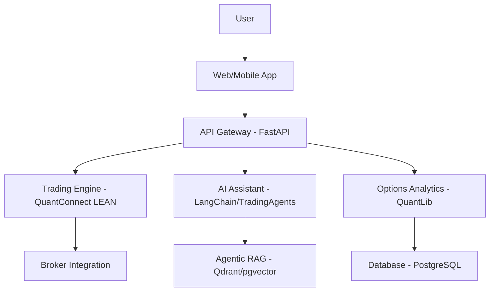
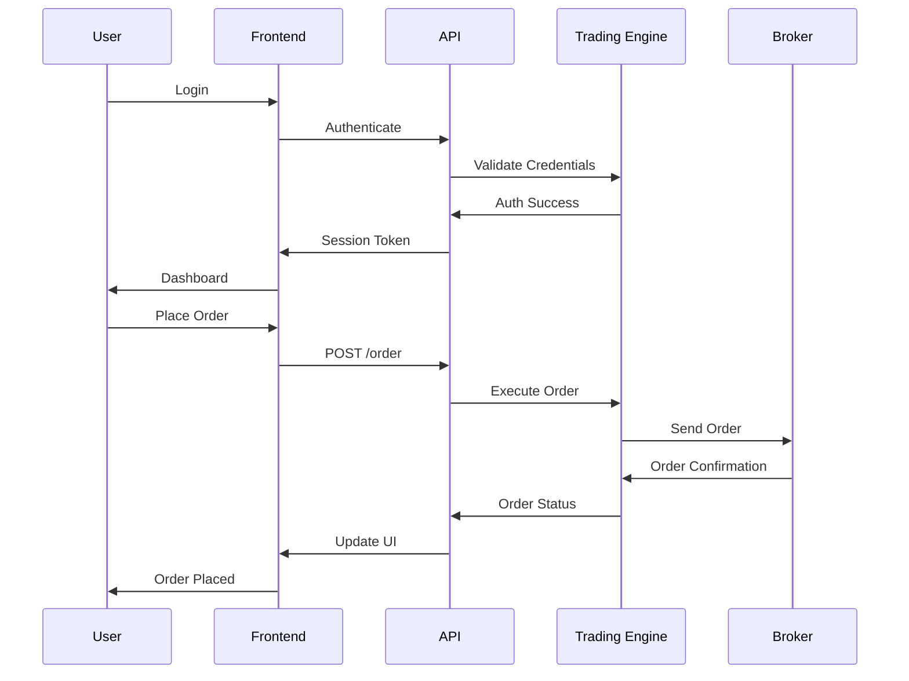

# Product Requirements Document (PRD)  
## Enterprise-Grade Algorithmic Trading System with Domingo with Agentic AI Assistant

---

### Table of Contents

1. [Introduction](#introduction)
2. [Why This Project Exists](#why-this-project-exists)
3. [Objectives](#objectives)
4. [Scope](#scope)
5. [Functional Requirements](#functional-requirements)
   - [Core Trading Infrastructure](#core-trading-infrastructure)
   - [Data Management & Analytics](#data-management--analytics)
   - [AI-Powered Strategy Development & Backtesting](#ai-powered-strategy-development--backtesting)
   - [Integrated Agentic AI Assistant](#integrated-agentic-ai-assistant)
   - [User Experience & Multi-Platform Accessibility](#user-experience--multi-platform-accessibility)
   - [Enterprise-Grade Security, Compliance & Operations](#enterprise-grade-security-compliance--operations)
   - [Options Trading](#options-trading)
6. [Non-Functional Requirements](#non-functional-requirements)
7. [User Stories](#user-stories)
8. [Test Cases](#test-cases)
9. [UI Mockups and Wireframes](#ui-mockups-and-wireframes)
10. [Diagrams](#diagrams)
11. [Development Phases](#development-phases)
12. [Appendices](#appendices)

---

### Introduction

This Product Requirements Document (PRD) outlines the specifications for an enterprise-grade algorithmic trading system designed to revolutionize how traders interact with financial markets. The system integrates a sophisticated Agentic AI Assistant as its central feature, enabling natural language interactions for trading, research, and portfolio management. Built on a "Best-of-Breed" integration strategy, the platform leverages leading open-source technologies to create a modular, scalable, and powerful foundation.

The architecture consists of microservices communicating via a centralized API bridge, with key components including a core trading engine, advanced data analytics, AI-driven strategy development tools, and a responsive user interface. This PRD details the functional and non-functional requirements, user stories, test cases, and development roadmap to guide the creation of this cutting-edge platform.

---

### Why This Project Exists

This project is driven by a vision to transform algorithmic trading by making sophisticated tools accessible to a wide range of users, from novice traders to seasoned professionals. It is not merely another trading platform; it is a comprehensive system designed to empower users with precision, confidence, and innovation in navigating the complexities of financial markets.

The high-level "why" of this project includes:
- **Democratization of Trading Tools**: To provide access to advanced trading strategies and technologies traditionally reserved for institutional investors.
- **Innovation through AI**: To harness artificial intelligence and machine learning to deliver intuitive, powerful, and user-friendly trading capabilities.
- **Flexibility and Scalability**: To create a platform that adapts to the evolving financial landscape and scales with user needs.
- **User Empowerment**: To bridge the gap between cutting-edge technology and practical trading applications, enabling anyone to succeed with the right tools.

This system challenges the status quo by pushing the boundaries of algorithmic trading, setting a new standard for what a trading platform can achieve.

---

### Objectives

- **Primary Objective**: Build a scalable, secure, and intuitive algorithmic trading platform with an integrated Agentic AI Assistant to enhance trading, strategy development, and portfolio management.
- **Secondary Objectives**:
  - Leverage best-in-class open-source technologies for each component.
  - Ensure a modular architecture for maintainability and future enhancements.
  - Deliver a seamless user experience across web and mobile platforms.
  - Meet enterprise-grade security and compliance standards.

---

### Scope

The system encompasses the following major components:
- A core trading engine supporting multiple asset classes and broker integrations.
- Data management and analytics for real-time and historical market data.
- AI-powered tools for strategy creation, backtesting, and optimization.
- An Agentic AI Assistant for natural language interaction and task automation.
- A unified, responsive user interface for web and mobile access.
- Enterprise-grade security, compliance, and operational features.
- Advanced options trading capabilities.

---

### Functional Requirements

#### Core Trading Infrastructure

- **Multi-Broker & Market Connectivity**:
  - Integrate with brokers such as Interactive Brokers, Alpaca, and TD Ameritrade.
  - Support for the FIX protocol for institutional connectivity.
  - Real-time connection health monitoring and seamless switching between paper and live trading accounts.

- **Trading Instruments**:
  - Support for stocks, ETFs, futures, options, forex, and cryptocurrencies.

- **Order Management System (OMS)**:
  - Basic order types: Market, Limit, Stop, Stop-Limit, Trailing Stop.
  - Advanced order types: GTC, IOC, FOK, VWAP, TWAP, Iceberg, OCO.
  - Order execution logging and robust error handling for failed orders.

#### Data Management & Analytics

- **Data Feed Management**:
  - Integrate free data sources (e.g., Yahoo Finance, Alpha Vantage).
  - Real-time trading data via Interactive Brokers.
  - Data resiliency with fallback mechanisms and real-time quality scoring.

- **Alternative & Advanced Data Integration**:
  - Real-time news feeds with sentiment analysis.
  - Fundamental, economic, and ESG data streams.
  - Exotic data sources (e.g., satellite imagery, IoT sensor networks).

- **Market Analytics & Microstructure**:
  - Advanced market screener with natural language filters.
  - AI-powered opportunity detection and cross-asset screening.
  - Market microstructure analysis for order book dynamics and liquidity.

- **Post-Trade Analytics**:
  - Transaction Cost Analysis (TCA), fill rate analysis, and broker performance evaluation.

#### AI-Powered Strategy Development & Backtesting

- **Strategy Creation Studios & Management**:
  - No-code strategy builder with a drag-and-drop interface.
  - Generative AI assistant to convert natural language prompts into strategy code.
  - Python/API studio with cloud-based Jupyter notebooks for advanced users.

- **Backtesting & Optimization Engine**:
  - Enterprise-grade backtester with realistic modeling (slippage, commissions, market impact).
  - Advanced analytics: Monte Carlo stress testing, walk-forward optimization.
  - AI-assisted optimization with hyperparameter tuning and overfitting detection.

- **Strategy Management**:
  - Git integration for version control and collaboration.
  - Strategy marketplace for sharing and licensing.

#### Integrated Agentic AI Assistant

- **Core Intelligence: Agentic Framework**:
  - Agentic Retrieval-Augmented Fine-Tuning (RAFT) system.
  - Pre-tuned domains for finance and legal systems.
  - Custom fine-tuning with user-uploaded datasets.
  - Intelligent model routing and continuous learning pipeline.

- **Document & Content Processing**:
  - Universal ingestion of file formats (text, PDFs, spreadsheets, images, audio/video).
  - Intelligent processing pipeline with noise removal and content validation.

- **Database & Analytics Integration**:
  - Support for relational (PostgreSQL), vector (pgvector/Qdrant), and time-series databases.
  - Automated database selection and query optimization.

- **Advanced Hybrid Search & Retrieval**:
  - Multi-modal search (semantic, keyword, graph-based).
  - Personalized and federated search with web integration and fact-checking.

- **Collaborative Agent Network**:
  - Specialized agents (Analyst, Researcher, Risk Manager, Compliance) for task delegation.

#### User Experience & Multi-Platform Accessibility

- **Unified User Interface (UI)**:
  - Personalized dashboards with drag-and-drop widgets.
  - Institutional-grade charting with TradingView integration.
  - Guided workflows and tooltips for new users.

- **Conversational Chatbot Interface**:
  - Modern chat interface with real-time messaging and file uploads.
  - Long-term memory and advanced conversational intelligence.

- **Mobile, Desktop & Web Access**:
  - Responsive web app built with Next.js, React, and TypeScript.
  - Native mobile apps for iOS and Android using React Native.
  - Progressive Web App (PWA) with offline capabilities.

- **Accessibility & Internationalization**:
  - Compliance with WCAG 2.1 accessibility standards.
  - Multi-language support with real-time translation.

#### Enterprise-Grade Security, Compliance & Operations

- **Advanced Security & Compliance**:
  - Zero-Trust Architecture with continuous verification.
  - End-to-end encryption and container security scanning.

- **Regulatory Compliance & Auditing**:
  - Compliance with GDPR, HIPAA, and financial regulations.
  - Automated compliance reporting and immutable audit trails.

- **Risk Management**:
  - Real-time risk hub for pre-trade checks and circuit breakers.
  - Advanced risk analytics (VaR, correlation analysis).

- **User Management & Entitlements**:
  - Role-Based AccessLocalLLM Access Control (RBAC) with custom roles.
  - Single Sign-On (SSO) integration with major identity providers.

- **Operational Monitoring & DevOps**:
  - Observability stack with Prometheus, Grafana, and ELK.
  - Infrastructure as Code (IaC) using Terraform and Ansible.
  - Automated CI/CD pipeline and disaster recovery strategies.

#### Options Trading

- **Comprehensive Options Trading**:
  - Support for basic, complex, and exotic options strategies.
  - Tools for Greeks calculation, payoff diagrams, and pricing models.

- **Enhanced Features**:
  - Visual strategy builders and risk/reward simulators.
  - Pricing engines (Heston, Monte Carlo, binomial models).
  - Volatility suite with surface constructors and skew arbitrage detectors.
  - Risk management tools for Greek exposure and margin forecasting.

---

### Non-Functional Requirements

- **Performance**:
  - Handle high-frequency trading with latency under 100ms for critical operations.
  - API response times below 100ms.

- **Scalability**:
  - Horizontal scaling to support growing user base and data volume.
  - Modular architecture for independent component scaling.

- **Security**:
  - Compliance with OWASP Top 10 security standards.
  - Regular audits and penetration testing.

- **Reliability**:
  - 99.99% system uptime with robust failover mechanisms.
  - Automated backups and disaster recovery plans.

- **Usability**:
  - Intuitive UI with a minimal learning curve.
  - Comprehensive documentation and user guides.

---

### User Stories

- **As a novice trader**, I want a no-code strategy builder so I can create trading strategies without programming knowledge.
- **As an experienced trader**, I want a Python studio to develop and test complex strategies with full control.
- **As a portfolio manager**, I want to ask the AI assistant for real-time portfolio insights using natural language.
- **As a compliance officer**, I want automated reporting and audit trails to ensure regulatory compliance.
- **As a mobile user**, I want full platform functionality on my smartphone for trading on the go.
- **As an options trader**, I want tools to calculate Greeks and visualize payoff diagrams for my strategies.

---

### Test Cases

- **Test Case 1: Broker Connectivity**
  - **Description**: Verify the system connects to Interactive Brokers and executes a market order.
  - **Steps**: Connect to IB, place a market order for 10 shares of AAPL, confirm execution.
  - **Expected Result**: Order executed successfully, logged in the system.

- **Test Case 2: AI Assistant Query**
  - **Description**: Ensure the AI assistant processes a natural language query and returns portfolio data.
  - **Steps**: Ask, "What’s my current portfolio value?" via the chatbot.
  - **Expected Result**: Accurate portfolio value returned in real-time.

- **Test Case 3: Backtesting Accuracy**
  - **Description**: Validate the backtesting engine with historical data.
  - **Steps**: Run a moving average crossover strategy on AAPL data from 2022.
  - **Expected Result**: Results match expected performance metrics (e.g., Sharpe Ratio).

- **Test Case 4: Risk Management**
  - **Description**: Check that pre-trade risk checks prevent invalid orders.
  - **Steps**: Attempt to place an order exceeding account risk limits.
  - **Expected Result**: Order rejected with an appropriate error message.

- **Test Case 5: UI Responsiveness**
  - **Description**: Confirm the UI is accessible and responsive on web and mobile.
  - **Steps**: Access dashboard on desktop and mobile, resize window.
  - **Expected Result**: UI adapts seamlessly without loss of functionality.

---

### UI Mockups and Wireframes

- **Dashboard Wireframe**:
  - A central dashboard with widgets for portfolio overview, recent trades, and market news.
  - Drag-and-drop functionality for widget customization.

- **Strategy Builder Mockup**:
  - Visual interface with blocks for indicators, conditions, and actions.
  - Real-time preview of strategy logic and performance metrics.

- **AI Chatbot Interface**:
  - Chat window supporting text input, file uploads, and voice commands.
  - Contextual suggestions and quick actions based on queries.

---

### Diagrams

#### System Architecture

#### Order Execution Flow

---

### Development Phases

The project follows a 5-phase roadmap:

1. **Phase 1: Foundational Setup**
   - Objective: Establish core infrastructure with QuantConnect LEAN and PostgreSQL/pgvector.
   - Key Deliverables: Dockerized environment, basic backtesting with Yahoo Finance data.

2. **Phase 2: API Bridge**
   - Objective: Build a FastAPI wrapper for programmatic control of the trading engine.
   - Key Deliverables: POST /backtest endpoint, integration of TA-Lib and pandas-ta.

3. **Phase 3: AI Assistant MVP**
   - Objective: Integrate LangChain and TradingAgents for an initial AI assistant.
   - Key Deliverables: Agentic RAG pipeline, tools for backtesting and document queries, Open-WebUI chat interface.

4. **Phase 4: Full User Experience**
   - Objective: Develop the Next.js frontend and enable paper/live trading.
   - Key Deliverables: TradingView charts, live trading endpoints, enhanced AI tools.

5. **Phase 5: Advanced Features & Enterprise Readiness**
   - Objective: Add advanced analytics, security, and monitoring features.
   - Key Deliverables: QuantLib integration, no-code builder, enterprise guardrails, observability stack.

---

### Appendices

- **Glossary**:
  - **Agentic RAG**: Retrieval-Augmented Generation system with AI agents for information processing.
  - **Zero-Trust Architecture**: Security model requiring continuous verification of all requests.

- **References**:
  - [QuantConnect LEAN Documentation](https://www.quantconnect.com/docs)
  - [LangChain Documentation](https://langchain.com/docs)
  - [QuantLib Documentation](https://www.quantlib.org/docs)

---

This PRD provides a detailed blueprint for the development of an enterprise-grade algorithmic trading system, ensuring all requirements are clearly defined and actionable. The integration of open-source technologies with custom development will create a robust, innovative platform ready to meet the needs of modern traders.