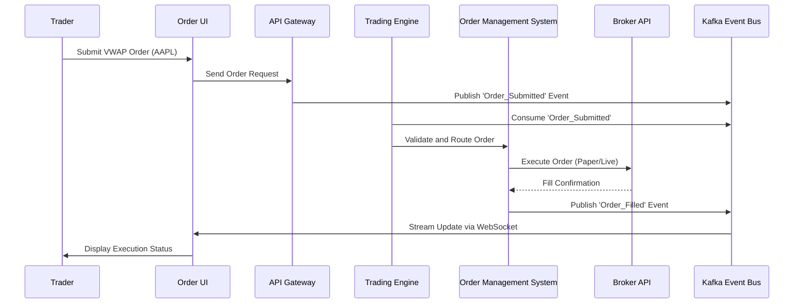
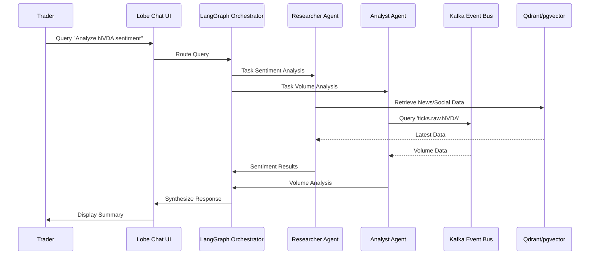
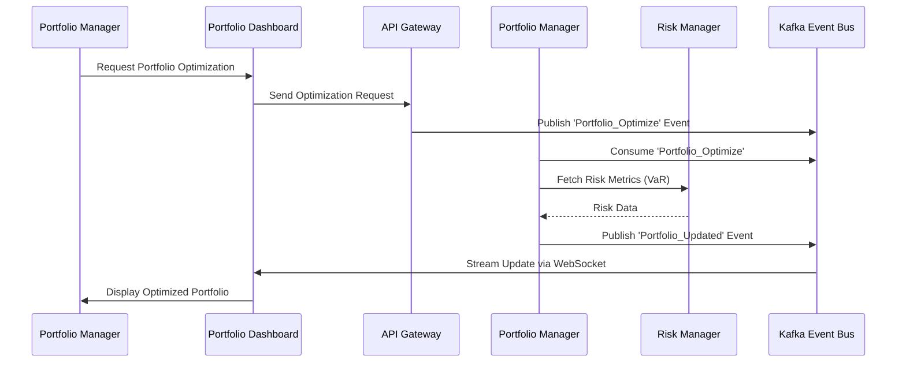
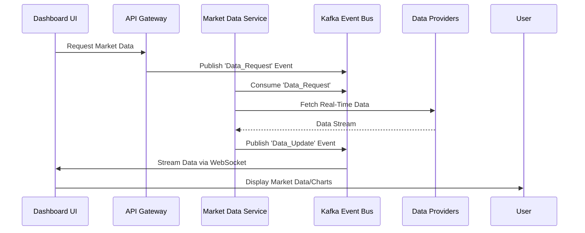
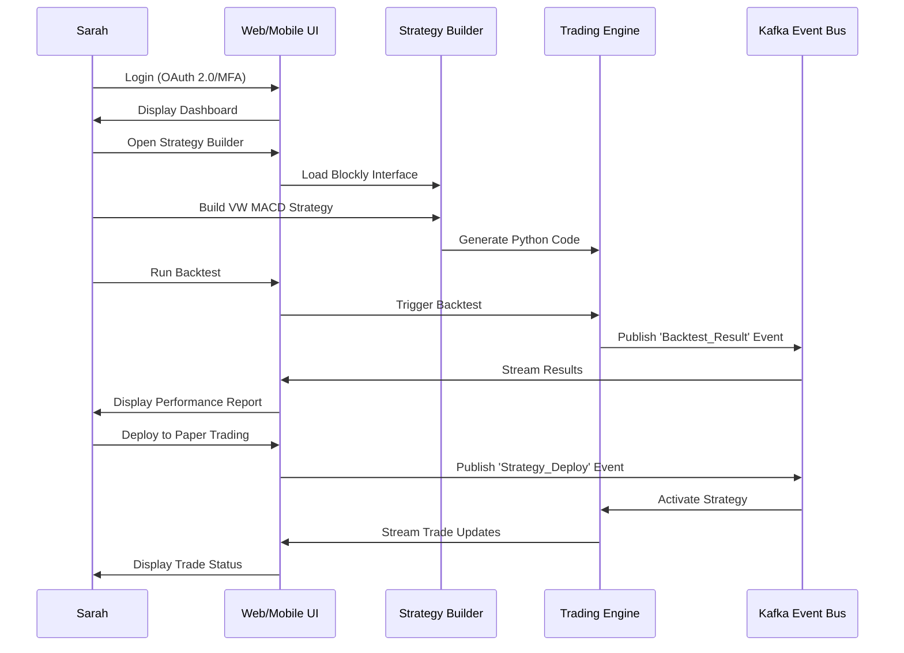
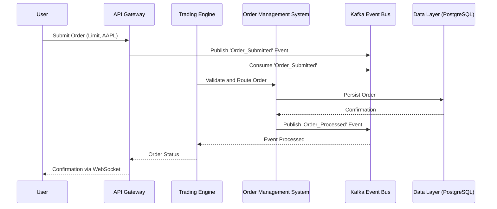
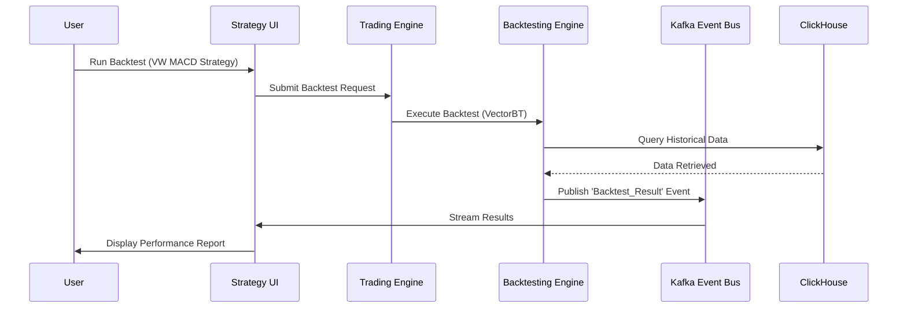

# Functional Specification Document (FSD)

## Nautilus Trader: Enterprise Algorithmic Trading System

| **Version:**      | 3.0                             |
|:----------------- |:------------------------------- |
| **Date:**         | August 21, 2025                 |
| **Status:**       | Draft                           |
| **Author:**       | Vincent Pereira                 |
| **Owner:**        | Project Sponsor, Business Owner |

---

## 1.0 Introduction

### 1.1 Purpose of the Document

This Functional Specification Document (FSD) provides a comprehensive and detailed description of the functional requirements, behaviors, and workflows of the Nautilus Trader Algorithmic Trading System (ATS). It serves as a bridge between the high-level business requirements outlined in the Business Requirements Document (BRD) and the technical implementation details specified in the Technical Specification Document (TSD) and System Design Document (SDD). The FSD ensures alignment among stakeholders—business owners, developers, testers, and end-users—by clearly defining system functionalities, user interactions, integration points, and expected behaviors under various conditions. This document is based on the updated "Features, Phases & Integration Strategy - Algorithmic Trading System" document, ensuring all specified features are captured without omission.

### 1.2 Scope

The scope of this FSD encompasses the functional requirements of the Nautilus Trader ATS, including:

- Detailed specifications for all system components, including the trading engine, AI assistant, portfolio management, risk management, market data services, and order management system (OMS).
- User workflows for diverse personas: retail investors, quantitative analysts, portfolio managers, and compliance officers.
- System behavior under normal, edge, and error conditions, including failover and recovery mechanisms.
- Integration with external systems (brokers, data providers) and internal microservices, ensuring seamless data flows and execution.
- Security, compliance, performance, and usability requirements to deliver an enterprise-grade platform.
- Support for multi-asset trading, no-code and code-based strategy development, AI-driven analytics, and future-ready features like voice trading and augmented reality (AR) interfaces.

**Out-of-Scope:**

- Non-functional requirements (e.g., hardware specifications, detailed network configurations) covered in the TSD and SDD.
- Proprietary trading hardware development.
- Direct management of client funds or custodial services.
- Financial advisory services beyond analytical tools.

### 1.3 Definitions, Acronyms, and Abbreviations

| Term                | Definition                                                                 |
|---------------------|---------------------------------------------------------------------------|
| **ATS**             | Algorithmic Trading System                                               |
| **OMS**             | Order Management System                                                  |
| **FIX**             | Financial Information eXchange protocol                                  |
| **RAG**             | Retrieval-Augmented Generation (AI technique)                            |
| **RBAC**            | Role-Based Access Control                                                |
| **VaR**             | Value at Risk (risk measurement metric)                                  |
| **API**             | Application Programming Interface                                        |
| **JWT**             | JSON Web Token (security token standard)                                 |
| **CQRS**            | Command Query Responsibility Segregation                                  |
| **DMA**             | Direct Market Access                                                     |
| **MCP**             | Model Context Protocol (for AI conversation context)                     |
| **RLOps**           | Reinforcement Learning Operations                                         |
| **SAST**            | Static Application Security Testing                                      |
| **UEBA**            | User and Entity Behavior Analytics                                       |
| **VW**              | Volume-Weighted (e.g., VW SMA, VW MACD)                                  |
| **ATR**             | Average True Range                                                       |
| **MFI**             | Money Flow Index                                                         |

---

## 2.0 System Overview

The Nautilus Trader ATS is an enterprise-grade algorithmic trading platform designed to serve a diverse user base, from retail investors to institutional traders. It adopts a modular, event-driven microservices architecture with Apache Kafka as the backbone for asynchronous communication, ensuring scalability, low-latency execution, and data replayability. The platform leverages leading open-source technologies and integrates a sophisticated Agentic AI Assistant as its "brain," enabling natural language interaction, advanced analytics, and autonomous strategy optimization. It supports trading across multiple asset classes (stocks, ETFs, futures, options, forex, commodities, cryptocurrencies) and integrates with brokers and data providers for seamless execution and data access.

### Key Components

The following Mermaid diagram illustrates the high-level system architecture:

```mermaid
graph TD
    subgraph "Client Layer"
        CL1[Web Dashboard (React 18/Next.js)]
        CL2[Mobile App (React Native)]
        CL3[Desktop App (Electron)]
        CL4[PWA]
        CL5[External API Clients]
    end

    subgraph "API Gateway & Service Mesh"
        AG[NGINX Ingress Controller]
        SM[Istio Service Mesh]
    end

    subgraph "Microservices Layer"
        MS1[Trading Engine (NautilusTrader)]
        MS2[Agentic AI Assistant (TradingAgents/LangChain)]
        MS3[Portfolio Manager (PyPortfolioOpt/Riskfolio-Lib)]
        MS4[Risk Manager (Real-Time VaR/PyOD)]
        MS5[Market Data Service (Multi-Source Feeds)]
        MS6[Order Management System (OMS/FIX)]
        MS7[Market Scanner Service]
        MS8[Customer Service Bot (RAG-Based)]
    end

    subgraph "Event Bus"
        EB[Apache Kafka (Hierarchical Topics)]
    end

    subgraph "Data Layer"
        DL1[PostgreSQL/pgvector - Transactional/Vector]
        DL2[ClickHouse - Time-Series/Analytics]
        DL3[Qdrant - Vector Search]
        DL4[Apache Iceberg - Audit Trails]
        DL5[DuckDB - Local Analytics]
        DL6[Redis - Cache]
    end

    CL1 --> AG
    CL2 --> AG
    CL3 --> AG
    CL4 --> AG
    CL5 --> AG
    AG --> SM
    SM --> MS1
    SM --> MS2
    SM --> MS3
    SM --> MS4
    SM --> MS5
    SM --> MS6
    SM --> MS7
    SM --> MS8
    MS1 --> EB
    MS2 --> EB
    MS3 --> EB
    MS4 --> EB
    MS5 --> EB
    MS6 --> EB
    MS7 --> EB
    MS8 --> EB
    EB --> DL1
    EB --> DL2
    EB --> DL3
    EB --> DL4
    EB --> DL5
    EB --> DL6
```

**Component Descriptions:**

- **Trading Engine (NautilusTrader):** Executes trading strategies, manages orders, and integrates with brokers for paper and live trading.
- **Agentic AI Assistant (TradingAgents/LangChain):** Provides natural language interaction, document analysis, and strategy optimization via a multi-agent framework.
- **Portfolio Manager (PyPortfolioOpt/Riskfolio-Lib):** Optimizes portfolio allocations, performs rebalancing, and provides performance attribution.
- **Risk Manager (PyOD):** Monitors real-time risks (VaR, exposure) and detects anomalies in trading patterns.
- **Market Data Service:** Aggregates, normalizes, and distributes real-time and historical market data from multiple sources.
- **Order Management System (OMS):** Manages the order lifecycle, supporting standard and algorithmic orders with FIX connectivity.
- **Market Scanner Service:** Scans symbols in real-time based on custom criteria and technical indicators.
- **Customer Service Bot:** Provides automated support using a RAG-based pipeline.

---

## 3.0 Functional Requirements

The functional requirements are organized by system component, reflecting all features from the "Features, Phases & Integration Strategy - Algorithmic Trading System" document.

### 3.1 Trading Engine

- **FR-101:** The Trading Engine SHALL support trading across stocks, ETFs, futures (stock/index), options (stock/index), forex (including futures/options), commodities, and cryptocurrencies.
- **FR-102:** The Trading Engine SHALL execute user-defined and AI-generated strategies, supporting no-code (Blockly-generated) and code-based (Python) implementations.
- **FR-103:** The Trading Engine SHALL manage order operations (placement, modification, cancellation) with real-time updates via WebSocket.
- **FR-104:** The Trading Engine SHALL provide real-time updates on positions, account balances, and P&L, streamed to the UI and stored in PostgreSQL.
- **FR-105:** The Trading Engine SHALL integrate with Interactive Brokers (TWS/Gateway) for paper and live trading, with plans for Alpaca, OANDA, Coinbase, and FIX protocol support.
- **FR-106:** The Trading Engine SHALL support a unified broker abstraction layer to normalize data and order execution across brokers.
- **FR-107:** The Trading Engine SHALL implement event-driven processing using NautilusTrader, with all events published to Kafka topics (e.g., `trade.order.submitted`).

**Workflow Diagram (Trading Engine Order Execution):**



### 3.2 Agentic AI Assistant

- **FR-201:** The Agentic AI Assistant SHALL provide a chatbot interface via Lobe Chat, supporting natural language commands for trading, backtesting, research, and document analysis.
- **FR-202:** The Assistant SHALL consist of specialized agents (Analyst, Researcher, Risk Manager, Compliance, Trader) communicating asynchronously via Kafka.
- **FR-203:** The Assistant SHALL use a Retrieval-Augmented Generation (RAG) pipeline with RAGFlow to process user-uploaded documents (e.g., PDFs, SEC filings) and provide context-aware insights.
- **FR-204:** The Assistant SHALL implement Model Context Protocols (MCPs) using LangChain and LangGraph to maintain conversation history and manage multi-step workflows.
- **FR-205:** The Assistant SHALL deploy a proactive RAG intelligence engine with a Researcher agent to monitor external sources (news, social media) and update Qdrant/pgvector in real-time.
- **FR-206:** The Assistant SHALL integrate an AI Knowledge Hub (Archon) to ingest documentation for Tier 1 components (NautilusTrader, Kafka) for context-aware task execution.
- **FR-207:** The Assistant SHALL support iterative strategy refinement, analyzing performance metrics and generating optimized code using FinRL and Optuna.

**Workflow Diagram (AI Assistant Query Processing):**



### 3.3 Portfolio Manager

- **FR-301:** The Portfolio Manager SHALL optimize portfolio allocations using PyPortfolioOpt and Riskfolio-Lib, supporting mean-variance optimization, hierarchical risk parity, and rebalancing.
- **FR-302:** The Portfolio Manager SHALL generate performance attribution reports, detailing returns by asset, strategy, and timeframe, stored in ClickHouse.
- **FR-303:** The Portfolio Manager SHALL integrate with the Risk Manager for real-time risk assessments, including VaR, expected shortfall, and exposure limits.
- **FR-304:** The Portfolio Manager SHALL support stress testing by simulating adverse market scenarios (e.g., 10% market drop) and displaying impacts on portfolio metrics.
- **FR-305:** The Portfolio Manager SHALL provide real-time portfolio updates via WebSocket, displayed on the dashboard.

**Workflow Diagram (Portfolio Optimization):**



### 3.4 Risk Manager

- **FR-401:** The Risk Manager SHALL monitor trading risks in real-time, including market, credit, and operational risks, using PyOD for anomaly detection.
- **FR-402:** The Risk Manager SHALL calculate risk metrics (VaR, expected shortfall, volatility) and enforce user-defined exposure and position limits.
- **FR-403:** The Risk Manager SHALL perform pre-trade risk checks, integrating custom volume-weighted indicators and flagging violations via the UI.
- **FR-404:** The Risk Manager SHALL support stress testing and scenario analysis, simulating adverse market conditions and reporting impacts.
- **FR-405:** The Risk Manager SHALL provide real-time risk alerts via WebSocket, displayed on the risk dashboard with configurable thresholds.

### 3.5 Market Data Service

- **FR-501:** The Market Data Service SHALL collect real-time market data from multiple sources (Yahoo Finance primary, Alpha Vantage, Finnhub, Investing.com, CME Group, Twelve Data, Polygon, Barchart, SpiderRock, TradingCharts, Oanda as fallbacks) per asset class.
- **FR-502:** The Market Data Service SHALL normalize and distribute data via Kafka, supporting dividend forecasts and multi-asset fallback chains.
- **FR-503:** The Market Data Service SHALL provide historical data (minimum 5 years for options chains) from free sources for paper trading and Interactive Brokers for live trading.
- **FR-504:** The Market Data Service SHALL implement a Market Scanner Service to scan symbols in real-time, applying custom filters and TA-Lib indicators, with results streamed to a high-performance UI grid.

**Workflow Diagram (Market Data Processing):**



### 3.6 Order Management System (OMS)

- **FR-601:** The OMS SHALL manage the full order lifecycle (validation, routing, execution, confirmation) for standard (Market, Limit, Stop, Stop-Limit) and algorithmic orders (VWAP, TWAP, Iceberg).
- **FR-602:** The OMS SHALL perform pre-trade compliance checks (margin, regulatory restrictions) and integrate with the Risk Manager.
- **FR-603:** The OMS SHALL support a smart order router to minimize market impact and optimize execution across brokers.
- **FR-604:** The OMS SHALL integrate with the Trading Engine for seamless order execution and status updates, supporting FIX Gateway (QuickFIX/J, FIX8) for institutional connectivity.

### 3.7 Strategy Development and Backtesting

- **FR-701:** The system SHALL provide a no-code strategy builder using Blockly, supporting drag-and-drop blocks for technical indicators, operators, conditions, and trade actions.
- **FR-702:** The Blockly builder SHALL generate clean, human-readable Python code compatible with NautilusTrader’s strategy framework.
- **FR-703:** The system SHALL provide a "Python Studio" with JupyterHub for professional users, featuring syntax highlighting, autocompletion, and debugging tools.
- **FR-704:** The system SHALL integrate an AI-Assisted Development Agent (OpenHands) for code generation, refactoring, and test coverage expansion.
- **FR-705:** The system SHALL provide an event-driven backtesting engine via NautilusTrader, simulating strategies with realistic market conditions (slippage, fees, latency).
- **FR-706:** The system SHALL integrate VectorBT for GPU-accelerated backtesting and TradingGym for flexible strategy environments.
- **FR-707:** Backtests SHALL generate comprehensive performance reports (Sharpe Ratio, Maximum Drawdown, P&L) stored in ClickHouse.
- **FR-708:** The system SHALL integrate Optuna for hyperparameter optimization, tuning strategy parameters automatically.
- **FR-709:** The system SHALL support a comprehensive suite of custom volume-weighted indicators using TA-Lib, Bukosabino/ta, and NumPy, including:
  - Beta vis-à-vis Market Index
  - Auto Correlation
  - Historical/Intraday Annual Volatility
  - VW SMA/EMA/MACD/MFI (various periods)
  - Normalized ATR (21/8 Day)
  - Rupee/Dollar/Pound Volatility
  - Contract Risk
  - Choppy Market Index
  - Buy/Sell Easier Day Metrics

### 3.8 Advanced Analytics

- **FR-801:** The system SHALL integrate predictive models (Stock-Prediction-Models, LSTM-Neural-Network-for-Time-Series-Prediction, Real-time-stock-market-prediction) with >90% accuracy for pattern recognition.
- **FR-802:** The system SHALL provide a real-time inference engine (TensorFlow Serving, PyTorch) for sub-millisecond predictions via Kafka.
- **FR-803:** The system SHALL implement a sentiment analysis pipeline using Transformers and PyTorch, achieving >85% accuracy for news and social media.
- **FR-804:** The system SHALL use PyOD for anomaly detection, achieving <5% false positives in trading patterns and system performance.
- **FR-805:** The system SHALL integrate SHAP for explainable AI, providing transparent model explanations with scores >80%.
- **FR-806:** The system SHALL support reinforcement learning via FinRL and TradingGym, with an RLOps pipeline for continuous training and deployment.
- **FR-807:** The system SHALL integrate QuantLib for options analytics, including pricing, implied volatility surfaces, and dividend forecasts.

### 3.9 Security and Compliance

- **FR-901:** The system SHALL authenticate users via OAuth 2.0/OpenID Connect with Multi-Factor Authentication (MFA) supporting biometric and TOTP options.
- **FR-902:** The system SHALL enforce Role-Based Access Control (RBAC) to restrict access based on user roles.
- **FR-903:** The system SHALL log all actions, API calls, and events to an immutable audit trail in Apache Iceberg for compliance (MiFID II, SOX, GDPR).
- **FR-904:** The system SHALL integrate Static Application Security Testing (SAST) with Bandit in the CI/CD pipeline to scan Python code.
- **FR-905:** The system SHALL implement User and Entity Behavior Analytics (UEBA) for proactive threat detection with <5% false positives.
- **FR-906:** The system SHALL use Unleash for feature flags and kill switches to toggle strategies or halt operations.
- **FR-907:** The system SHALL encrypt data at rest (AES-256) and in transit (TLS 1.3).
- **FR-908:** The system SHALL implement threat modeling (STRIDE) in the SDLC and deploy microservices with automated self-healing mechanisms.

### 3.10 Infrastructure and Advanced Features

- **FR-1001:** The system SHALL implement an event-driven architecture with Apache Kafka, using hierarchical topics (e.g., `domain.action.entity.source.symbol`) and wildcard subscriptions.
- **FR-1002:** The system SHALL deploy on Kubernetes with Helm charts, Istio service mesh, and GitOps CI/CD for scalability and observability.
- **FR-1003:** The system SHALL optimize performance with lock-free data structures, cache-line alignment, and exploration of FPGAs/SmartNICs for critical paths.
- **FR-1004:** The system SHALL integrate Prometheus, Grafana, Jaeger, and Grafana Loki for metrics, tracing, and logging.
- **FR-1005:** The system SHALL use Memray for memory profiling and Grafana Tempo for distributed tracing.
- **FR-1006:** The system SHALL provide market microstructure analysis tools for real-time order book analytics, liquidity detection, and market impact estimation.
- **FR-1007:** The system SHALL implement a RAG-based Customer Service Bot for automated user support.
- **FR-1008:** The system SHALL support voice trading capabilities for natural language commands (e.g., “Buy 100 AAPL at market”).
- **FR-1009:** The system SHALL provide augmented reality (AR) interfaces for immersive data visualization.
- **FR-1010:** The system SHALL scope a Strategy Marketplace with copy trading capabilities for future implementation.

---

## 4.0 User Interactions and Workflows

### 4.1 Retail Investor Workflow (Sarah)

1. **Login:** Sarah authenticates via OAuth 2.0 with MFA (biometric/TOTP).
2. **Dashboard:** Views real-time portfolio value, P&L, open positions, and market data on the web/mobile/desktop UI.
3. **Strategy Builder:** Uses Blockly to create a VW MACD crossover strategy for AAPL, configuring parameters (timeframe, quantity).
4. **Backtesting:** Runs a backtest using NautilusTrader, reviewing performance metrics (Sharpe Ratio, Drawdown) on the dashboard.
5. **Deployment:** Deploys the strategy to paper trading mode via Interactive Brokers with a single click.
6. **Monitoring:** Monitors real-time performance, risk metrics, and Kafka event chains via the Glass Box UI, receiving push notifications for trade executions.

**Workflow Diagram (Retail Investor):**



### 4.2 Quantitative Analyst Workflow (Michael)

1. **Login:** Michael authenticates via OAuth 2.0 with MFA.
2. **Python Studio:** Launches JupyterHub (`docker-compose --profile pro up`) to write a Python strategy with custom VW MFI and Normalized ATR indicators.
3. **AI Assistance:** Uses OpenHands to debug and optimize code, generating additional test cases.
4. **Backtesting:** Runs GPU-accelerated backtest with VectorBT, analyzing results in ClickHouse.
5. **Optimization:** Submits strategy for hyperparameter tuning via Optuna (`POST /optimise`).
6. **Deployment:** Deploys strategy to live trading via FIX Gateway, setting `LIVE_TRADING_MODE=FIX`.
7. **Monitoring:** Monitors trade executions, risk metrics, and microstructure analytics (order book, liquidity) on the dashboard.

### 4.3 Portfolio Manager Workflow (Emma)

1. **Login:** Emma authenticates via OAuth 2.0 with MFA.
2. **Portfolio Dashboard:** Views real-time portfolio value, P&L, and risk metrics (VaR, exposure).
3. **Optimization:** Requests portfolio optimization using PyPortfolioOpt, specifying risk tolerance and goals.
4. **Stress Testing:** Runs stress tests simulating adverse market scenarios, reviewing impacts.
5. **AI Insights:** Queries the AI Assistant via Lobe Chat for sentiment analysis and anomaly detection (e.g., “Check NVDA volume anomalies”).
6. **Monitoring:** Receives real-time risk alerts and updates portfolio allocations based on AI recommendations.

### 4.4 Compliance Officer Workflow (Priya)

1. **Login:** Priya authenticates with admin RBAC permissions.
2. **Audit Trail:** Queries Apache Iceberg for immutable audit logs of trades and system events.
3. **Compliance Reporting:** Generates automated MiFID II/SOX reports, exported as PDFs.
4. **Threat Detection:** Monitors UEBA dashboard for anomalous login attempts, triggering MFA challenges.
5. **System Control:** Uses Unleash to toggle risky strategies or activate kill switches.
6. **Health Monitoring:** Reviews Prometheus/Grafana dashboard for system stability and self-healing events.

---

## 5.0 System Behavior

### 5.1 Normal Conditions

- The Trading Engine SHALL process orders with sub-millisecond latency (<1ms).
- Market data updates SHALL be delivered with latency below 100µs.
- The Agentic AI Assistant SHALL respond to queries within 2 seconds.
- The system SHALL handle 10,000 concurrent users and >1M messages/second on Kafka.
- UI updates SHALL occur in real-time via WebSocket with <100ms latency.

### 5.2 Error Conditions

- **Network Failure:** The system SHALL retry connections up to 5 times, logging errors to Grafana Loki and notifying admins via Slack/Email.
- **Data Inconsistency:** The system SHALL use Kafka event sourcing to rebuild state, ensuring data integrity.
- **Broker API Failure:** The system SHALL failover to secondary brokers (e.g., Alpaca if Interactive Brokers fails) and log events.
- **Security Breach:** The system SHALL trigger immediate alerts, initiate lockdown via Unleash kill switches, and restrict access until resolved.
- **Microservice Failure:** The system SHALL use Kubernetes self-healing to restart failed services, with Prometheus alerts for monitoring.

---

## 6.0 Integration Points

### 6.1 External Systems

- **Brokers:** Interactive Brokers (TWS/Gateway), Alpaca, OANDA, Coinbase, FIX-compliant brokers (via QuickFIX/J, FIX8).
- **Data Providers:** Yahoo Finance (primary), Alpha Vantage, Finnhub, Investing.com, CME Group, Twelve Data, Polygon, Barchart, SpiderRock, TradingCharts, Oanda (fallbacks).
- **Notification Services:** Slack, Email, SMS, Webhooks for real-time alerts.
- **Authentication Providers:** OAuth 2.0/OpenID Connect (e.g., Keycloak) for user authentication.

### 6.2 Internal Services

- **Microservices Communication:** All microservices SHALL communicate asynchronously via Apache Kafka with hierarchical topics (e.g., `trade.order.submitted.AAPL`).
- **Synchronous Calls:** High-performance services (e.g., Trading Engine to OMS) SHALL use gRPC for sub-millisecond responses.
- **Data Storage:** PostgreSQL/pgvector for transactional/vector data, ClickHouse for analytics, Qdrant for vector search, Apache Iceberg for audit trails, Redis for caching, DuckDB for local analytics.

---

## 7.0 Security and Compliance

### 7.1 Security

- **Authentication:** OAuth 2.0/OpenID Connect with JWT tokens, supporting MFA (biometric, TOTP).
- **Authorization:** RBAC enforced at the NGINX Ingress Controller and microservice levels.
- **Encryption:** AES-256 for data at rest; TLS 1.3 for data in transit.
- **Threat Modeling:** STRIDE methodology integrated into the SDLC for all services.
- **SAST:** Bandit scans in CI/CD pipeline to detect Python code vulnerabilities.
- **UEBA:** Real-time anomaly detection for user and system behavior, with <5% false positives.
- **Feature Flags:** Unleash for dynamic toggling of strategies and kill switches.

### 7.2 Compliance

- **Audit Trails:** Immutable logs in Apache Iceberg for all user actions, API calls, and trade events.
- **Regulatory Reporting:** Automated reports for MiFID II, SOX, and GDPR, exportable as PDFs.
- **Data Retention:** Configurable retention policies for audit trails and historical data, compliant with regulatory requirements.

---

## 8.0 Performance Requirements

- **Latency:** Trading Engine <1ms, API Gateway <10ms, Market Data Service <100µs.
- **Throughput:** Kafka event bus SHALL handle >1M messages/second.
- **Scalability:** System SHALL support 10,000+ concurrent users via horizontal scaling on Kubernetes.
- **Uptime:** 99.95% with multi-region failover, Recovery Time Objective (RTO) <4 hours, Recovery Point Objective (RPO) <15 minutes.

---

## 9.0 Usability Requirements

- **Intuitiveness:** Basic operations (e.g., strategy creation, order placement) SHALL require no tutorial for users with trading experience.
- **Consistency:** Uniform design language, navigation, and user flows across web, mobile, desktop, and PWA interfaces.
- **Feedback:** Immediate visual/auditory feedback for all user actions (e.g., order submissions, errors).
- **Accessibility:** Compliance with WCAG 2.1 standards for users with disabilities.
- **Customization:** Users SHALL save dashboard layouts, chart settings, and risk thresholds across sessions.

---

## 10.0 Technical Details

### 10.1 Technology Stack

- **Frontend:** React 18, Next.js, TypeScript, Tailwind CSS, TradingView, react-financial-charts, Plotly Dash.
- **Mobile:** React Native for iOS/Android, supporting biometric authentication.
- **Desktop:** Electron for Windows, macOS, Linux.
- **Backend:** NautilusTrader (Python/Rust), Apache Kafka, gRPC.
- **AI/ML:** LangChain, LangGraph, RAGFlow, OpenHands, Goose, FinRL, Optuna, PyOD, SHAP, Transformers, PyTorch, TensorFlow Serving, QuantLib.
- **Data Storage:** PostgreSQL/pgvector, ClickHouse, Qdrant, Apache Iceberg, DuckDB, Redis.
- **Infrastructure:** Kubernetes, Helm, Istio, GitOps (ArgoCD), Prometheus, Grafana, Jaeger, Grafana Loki, Grafana Tempo, Memray.
- **Security:** OAuth 2.0/OpenID Connect, Bandit, Unleash.
- **Broker APIs:** Interactive Brokers (TWS/Gateway), Alpaca, OANDA, Coinbase, QuickFIX/J, FIX8.

### 10.2 Performance Optimization

- **Lock-Free Data Structures:** Used in NautilusTrader for critical code paths to minimize contention.
- **Cache-Line Alignment:** Applied to optimize memory access in high-frequency trading components.
- **FPGAs/SmartNICs:** Explored for ultra-low latency data paths in Phase 6.
- **Direct Market Access (DMA):** Implemented with co-location strategies to reduce network latency.
- **CQRS:** Separates read/write operations for optimized data handling in microservices.

---

## 11.0 Appendices

### 11.1 Data Flow Diagram (Order Processing)



### 11.2 Backtesting Workflow Diagram



### 11.3 References

- Business Requirements Document (BRD) - Version 3.0
- Features, Phases & Integration Strategy - Algorithmic Trading System
- Comprehensive System Architecture
- Detailed Design Specifications
- Full Phased Implementation Tasks

---

This FSD provides a detailed and comprehensive specification of the Nautilus Trader ATS, incorporating all features from the updated "Features, Phases & Integration Strategy - Algorithmic Trading System" document. It includes Mermaid diagrams to visualize workflows and architecture, ensuring clarity for development, testing, and deployment.

