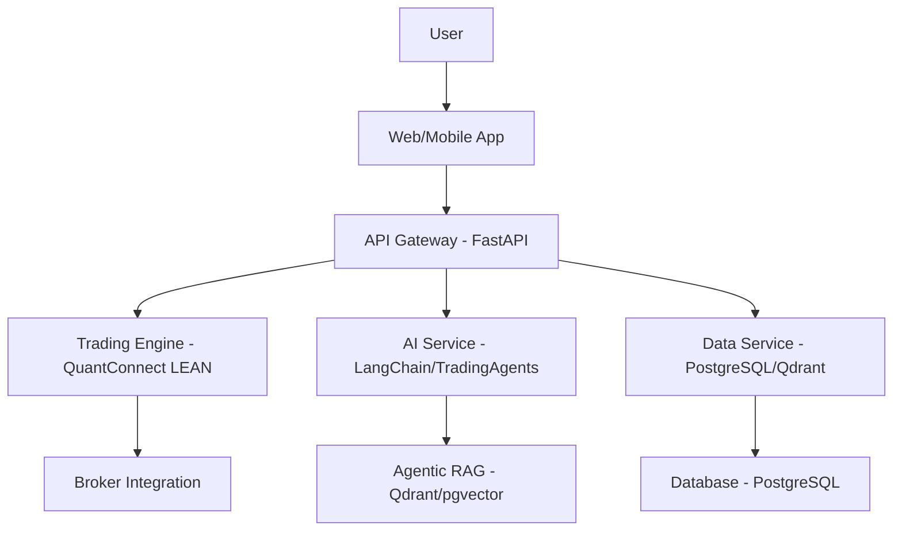
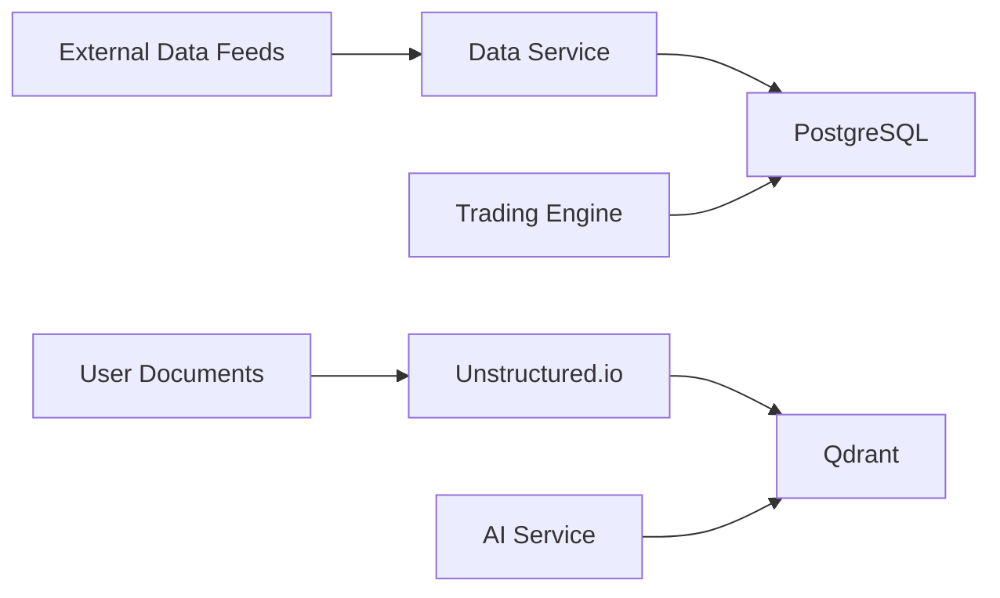

# Technical Specification Document (TSD)
## Enterprise-Grade Algorithmic Trading System with Agentic AI Assistant

---

### Table of Contents

 1. Introduction
 2. System Architecture
 3. Technology Stack
 4. Component Design
    - Trading Engine Service
    - AI Service
    - Data Service
    - Frontend Service
 5. Data Design
 6. Integration Points
 7. Security
 8. Performance
 9. Deployment
10. Testing
11. Appendices

---

### Introduction

This Technical Specification Document (TSD) provides a comprehensive technical blueprint for the development of an enterprise-grade algorithmic trading system with an integrated AI chatbot and agentic RAFT (Retrieval-Augmented Fine-Tuning) capabilities. The system is designed to deliver advanced trading functionalities, real-time data analysis, and intelligent user assistance through natural language processing. Built using a microservices architecture, it leverages best-of-breed open-source technologies to ensure scalability, maintainability, and performance.

The primary audience for this document includes developers, architects, project managers, and stakeholders involved in the system's development, deployment, and maintenance. The TSD outlines the system's architecture, technology stack, component designs, data flow, integration points, security measures, performance considerations, deployment strategy, and testing approach, serving as a guide for implementation and collaboration.

---

### System Architecture

The system adopts a **microservices architecture**, where each major component operates as an independent service. This approach enhances scalability, facilitates independent development, and simplifies deployment. The key components are:

- **API Gateway**: Built with FastAPI, it serves as the central entry point, routing requests from the frontend to appropriate backend services.
- **Trading Engine Service**: Powered by QuantConnect LEAN, it manages trading logic, order execution, and broker integrations.
- **AI Service**: Implements the Agentic AI Assistant using LangChain and TradingAgents, enabling intelligent responses and task automation.
- **Data Service**: Handles data storage and retrieval, utilizing PostgreSQL with pgvector and Qdrant.
- **Frontend Service**: A responsive web application developed with Next.js, React, and TypeScript, providing the user interface.

Services communicate via RESTful APIs, with the API Gateway ensuring secure and efficient request handling. The system is containerized using Docker and orchestrated with Kubernetes for robust deployment and scaling.

#### Architecture Diagram

---

### Technology Stack

The system leverages a modern, robust technology stack tailored to its requirements:

- **Programming Languages**:

  - **Python 3.9+**: Backend services, including trading and AI logic.
  - **JavaScript/TypeScript**: Frontend development for type safety and scalability.

- **Frameworks and Libraries**:

  - **Backend**:
    - **FastAPI**: High-performance API gateway.
    - **QuantConnect LEAN**: Core trading engine for algorithmic strategies.
    - **LangChain**: Framework for AI and natural language processing.
    - **LangGraph**: Framework to manage the complex, asynchronous workflows between the AI Agents, Multi Agents, Agentic AI, data, and trading services and act as an Orchestrator.
    - **TradingAgents**: Finance-specific AI agents.
    - **QuantLib**: Options analytics and financial computations.
    - **ib_insync**: Integration with Interactive Brokers.
    - **TA-Lib/pandas-ta**: Technical indicators for trading strategies.
  - **Frontend**:
    - **Next.js**: Server-side rendering and routing.
    - **React**: Dynamic UI components.
    - **TypeScript**: Enhanced code reliability.
    - **TradingView Lightweight Charts**: Real-time charting.
  - **Data**:
    - **PostgreSQL with pgvector**: Relational and vector data storage.
    - **Qdrant**: High-performance vector search for AI retrieval.
  - **Document Processing**:
    - **Unstructured.io**: Parsing various file formats for RAG.

- **Tools**:

  - **Docker**: Containerization for consistent environments.
  - **Kubernetes**: Orchestration for scalability and resilience.
  - **Git**: Version control for collaborative development.
  - **Prometheus & Grafana**: Real-time monitoring and visualization.
  - **ELK Stack**: Centralized logging and analysis.

---

### Component Design

#### Trading Engine Service

- **Responsibilities**:

  - Execute trades based on user-defined algorithmic strategies.
  - Manage order lifecycle (placement, modification, cancellation).
  - Integrate with brokers for trade execution.
  - Support multiple order types: Market, Limit, Stop, VWAP, TWAP.

- **Technologies**:

  - **QuantConnect LEAN**: Core trading engine.
  - **Python**: Custom logic, strategy implementation, and integrations.
  - **ib_insync**: Broker connectivity (e.g., Interactive Brokers).

- **Interactions**:

  - Receives strategy execution requests via the API Gateway.
  - Queries the Data Service for real-time and historical market data.
  - Communicates with brokers for order execution and status updates.

- **Sample Workflow**:

  1. User submits a trading strategy via the frontend.
  2. API Gateway routes the request to the Trading Engine.
  3. Trading Engine fetches market data from the Data Service.
  4. Executes trades through broker APIs and logs results.

#### AI Service

- **Responsibilities**:

  - Provide an AI chatbot for natural language interaction.
  - Implement Agentic RAG for document retrieval and response generation.
  - Delegate tasks to specialized agents (e.g., Analyst, Researcher).

- **Technologies**:

  - **LangChain**: AI pipeline.
  - **LangGraph**:  Orchestration.
  - **TradingAgents**: Finance-specific agent implementations.
  - **Ollama**: Local large language models (LLMs).
  - **Unstructured.io**: Document processing for RAG.

- **Interactions**:

  - Receives user queries from the Frontend Service via the API Gateway.
  - Queries the Data Service for vector embeddings and database records.
  - Invokes the Trading Engine Service for trading-related actions.

- **Sample Workflow**:

  1. User asks, "What’s the best strategy for trading AAPL?"
  2. AI Service processes the query using LangChain and Ollama.
  3. Retrieves relevant documents from Qdrant via the Data Service.
  4. Generates a response and optionally triggers a trading action.

#### Data Service

- **Responsibilities**:

  - Store and retrieve market data, user data, and AI embeddings.
  - Manage vector search for document retrieval.

- **Technologies**:

  - **PostgreSQL with pgvector**: Relational and vector data storage.
  - **Qdrant**: Dedicated vector database for high-performance search.

- **Interactions**:

  - Supplies market data to the Trading Engine Service.
  - Provides embeddings and records to the AI Service for RAG.

- **Sample Workflow**:

  1. Ingests real-time market data from external feeds.
  2. Stores data in PostgreSQL and updates Qdrant with embeddings.
  3. Responds to queries from other services with optimized data access.

#### Frontend Service

- **Responsibilities**:

  - Deliver a responsive web interface for trading and AI interaction.
  - Display dashboards, real-time charts, and chatbot UI.

- **Technologies**:

  - **Next.js**: Server-side rendering and routing.
  - **React**: Component-based UI development.
  - **TypeScript**: Type-safe coding.
  - **TradingView Lightweight Charts**: Interactive charting.

- **Interactions**:

  - Sends user requests to the API Gateway.
  - Receives and renders data from backend services.

- **Sample Workflow**:

  1. User logs in and views a portfolio dashboard.
  2. Frontend fetches data via the API Gateway.
  3. Displays charts and enables chatbot interaction.

---

### Data Design

The data design ensures efficient storage, retrieval, and processing of diverse data types.

- **Database Schema (PostgreSQL)**:

  - **Users**: `id, username, password_hash, email, preferences`.
  - **Strategies**: `id, user_id, name, code, parameters`.
  - **Orders**: `id, strategy_id, type, status, quantity, price, timestamp`.
  - **Positions**: `id, user_id, symbol, quantity, avg_price, timestamp`.
  - **Market Data**: `id, symbol, timestamp, open, high, low, close, volume`.

- **Vector Data (Qdrant)**:

  - Stores embeddings of user-uploaded documents for Agentic RAG.

- **Data Flow**:

  - **Ingestion**: Market data from feeds → PostgreSQL.
  - **Document Processing**: User files → Unstructured.io → Qdrant.
  - **Retrieval**: AI Service queries Qdrant and PostgreSQL.

#### Data Flow Diagram

---

### Integration Points

The system integrates with external services for functionality:

- **Brokers**:

  - **Interactive Brokers**: Via `ib_insync`, using API keys/OAuth.
  - **Data Format**: JSON for order requests/responses.

- **Data Feeds**:

  - **Yahoo Finance, Alpha Vantage**: REST APIs, JSON data.

- **AI Models**:

  - **Ollama**: Local LLMs, managed by LangChain for inference.

- **Document Processing**:

  - **Unstructured.io**: API-based parsing of PDFs, CSVs, etc.

Each integration specifies APIs, authentication, and data formats.

---

### Security

Security is paramount for a financial trading system:

- **Authentication**:

  - JWT tokens for user sessions.
  - OAuth for broker integrations.

- **Authorization**:

  - Role-Based Access Control (RBAC) with roles: Admin, Trader, Viewer.

- **Data Encryption**:

  - TLS 1.3 for data in transit.
  - AES-256 for data at rest.

- **Container Security**:

  - OpenVAS for vulnerability scanning.
  - Wazuh for runtime protection.

- **Compliance**:

  - GDPR: Data retention and user consent.
  - HIPAA: Secure handling of personal data (if applicable).
  - Financial Regulations: Audit trails and reporting.

---

### Performance

Performance is optimized for real-time trading:

- **Latency**:

  - Target &lt;100ms for order execution and data retrieval.

- **Scalability**:

  - Horizontal scaling with Kubernetes.
  - Load balancing via API Gateway.

- **Optimization**:

  - Redis caching for frequent queries.
  - Asynchronous processing with Celery for non-critical tasks.

---

### Deployment

The system is deployed using modern DevOps practices:

- **Environments**:

  - **Development**: Local testing and feature development.
  - **Staging**: Integration and QA.
  - **Production**: Live trading environment.

- **CI/CD**:

  - GitHub Actions for automated build, test, and deploy pipelines.

- **Deployment Strategy**:

  - Docker containers orchestrated by Kubernetes.
  - Rolling updates for zero downtime.

- **Monitoring**:

  - Prometheus for metrics collection.
  - Grafana for dashboards and alerts.
  - ELK Stack for log aggregation.

---

### Testing

A robust testing strategy ensures reliability:

- **Unit Testing**:

  - **pytest**: Python services.
  - **Jest**: Frontend components.

- **Integration Testing**:

  - Test service interactions using Docker Compose and mocks.

- **End-to-End Testing**:

  - Cypress for browser-based user journey simulation.

- **Performance Testing**:

  - Locust for load testing.
  - JMeter for stress testing scalability limits.

---

### Appendices

- **Glossary**:

  - **Agentic RAG**: Retrieval-Augmented Generation with task delegation.
  - **Microservices**: Independent, loosely coupled services.

- **References**:

  - QuantConnect LEAN Documentation
  - LangChain Documentation
  - QuantLib Documentation

- **Version History**:

  - **v1.0**: Initial draft - \[Date\].
  - **v1.1**: Stakeholder feedback incorporated - \[Date\].

---