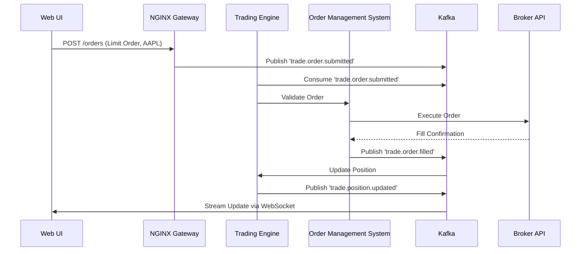
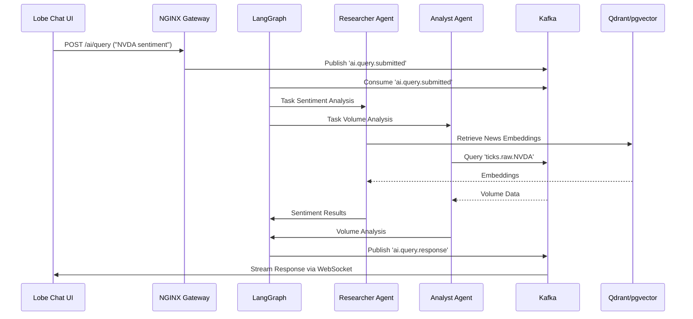
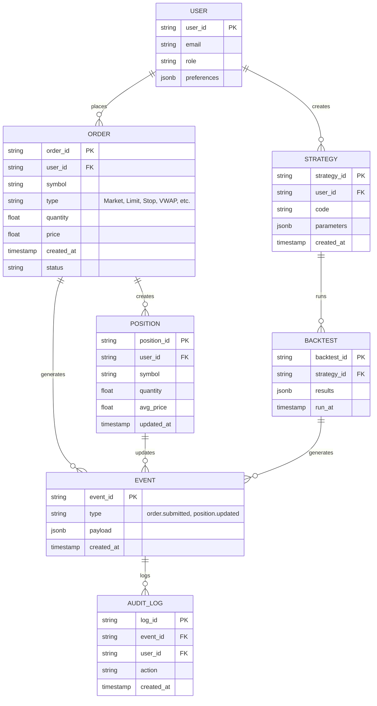
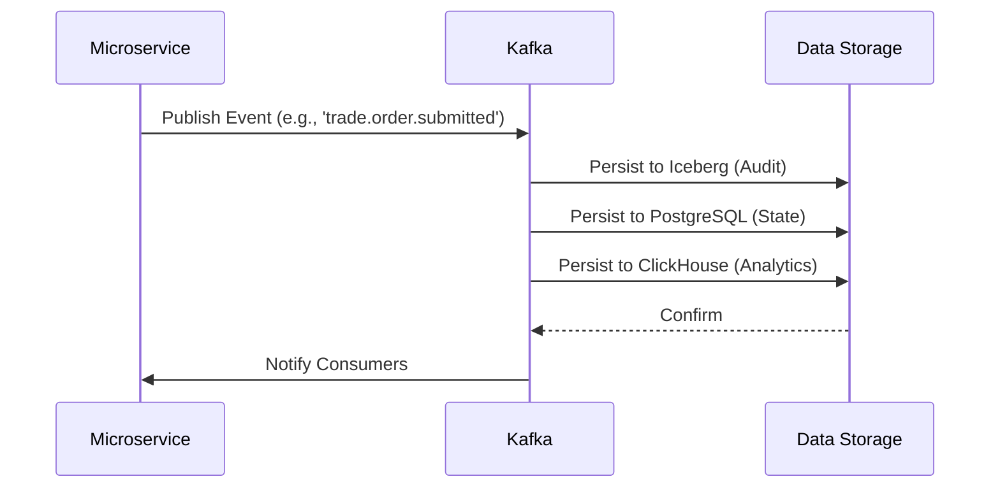
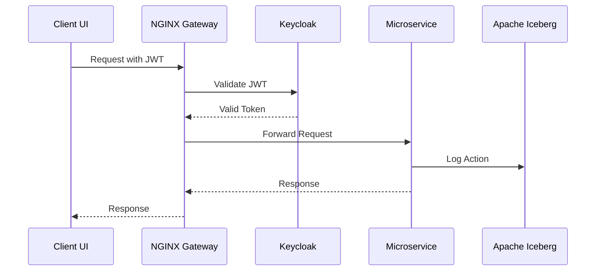
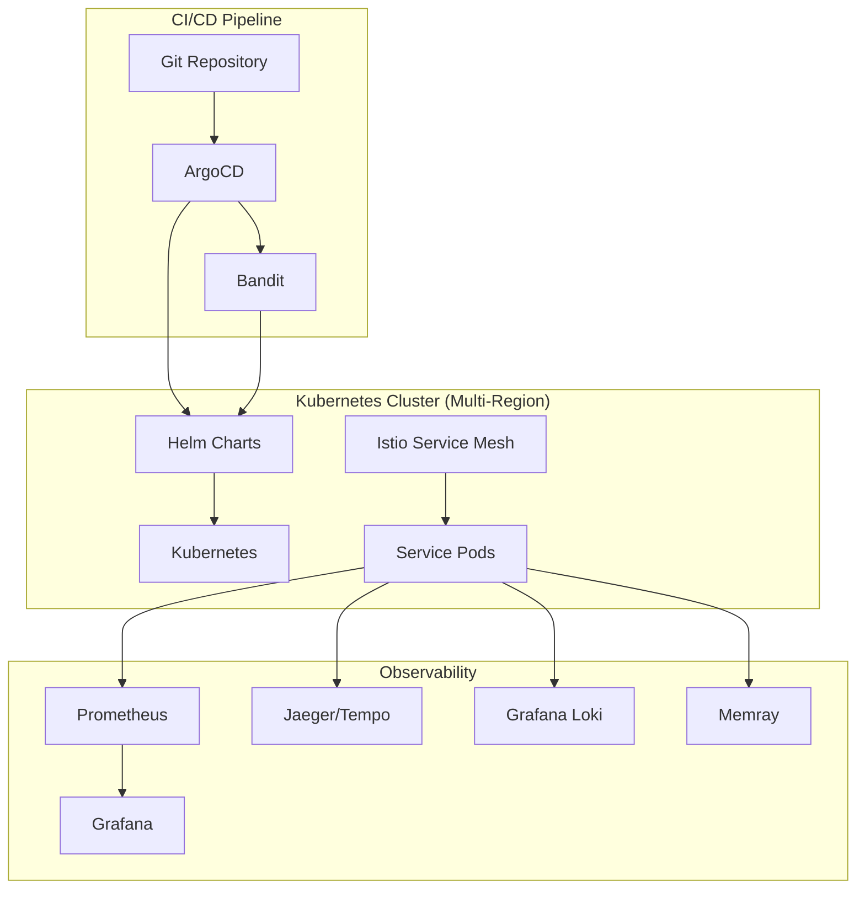
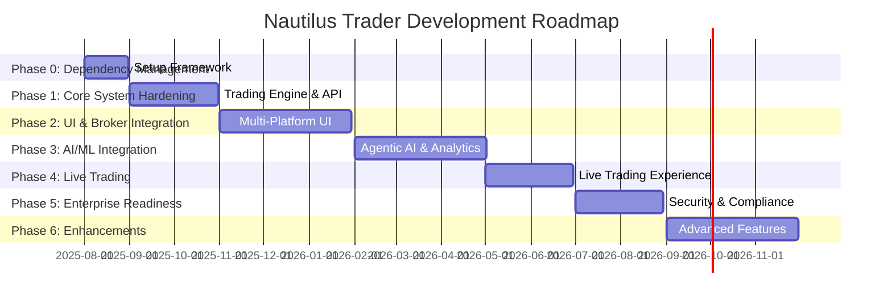
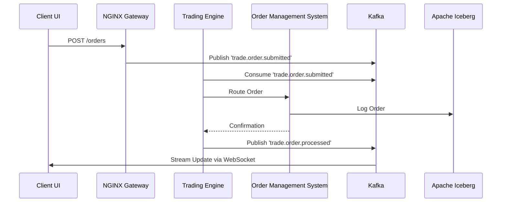

## **Technical Specification Document (TSD)**

### **Nautilus Trader: Enterprise Algorithmic Trading System**

| **Version:**        | 3.0                             |
|:------------------- |:------------------------------- |
| **Date:**           | August 21, 2025                |
| **Status:**         | Draft                          |
| **Author(s):**      | Vincent Pereira                |
| **Technical Lead:** | [To Be Assigned]               |

---

### **1.0 Introduction**

#### **1.1 Purpose**

This Technical Specification Document (TSD) provides a comprehensive technical blueprint for the design, development, and deployment of the Nautilus Trader Algorithmic Trading System (ATS). It translates the business and functional requirements from the Business Requirements Document (BRD), Product Requirements Document (PRD), and Functional Specification Document (FSD) into a detailed implementation plan for engineering teams. The TSD details the system architecture, component designs, data models, API specifications, security framework, and deployment strategies, ensuring alignment with the updated "Features, Phases & Integration Strategy - Algorithmic Trading System" document. This document ensures that all specified features are technically feasible, scalable, and maintainable, providing a clear roadmap for development, testing, and operations.

#### **1.2 Scope**

The scope of this TSD encompasses the end-to-end technical specifications for the Nautilus Trader ATS, including:

- **System Architecture:** A modular, event-driven, cloud-native microservices architecture with Apache Kafka as the event bus.
- **Component Design:** Detailed designs for core services (Trading Engine, Agentic AI Assistant, Portfolio Manager, Risk Manager, Market Data Service, Order Management System, Market Scanner, Customer Service Bot).
- **Data Architecture:** Specifications for data models, storage systems (PostgreSQL/pgvector, ClickHouse, Qdrant, Apache Iceberg, DuckDB, Redis), and processing pipelines.
- **API Specifications:** Definitions for REST, GraphQL, WebSocket, gRPC, and FIX APIs for internal and external communication.
- **Security Framework:** Implementation of a zero-trust security model, encryption, Role-Based Access Control (RBAC), and compliance mechanisms.
- **Infrastructure and Deployment:** Kubernetes-based orchestration, CI/CD pipelines, observability stack (Prometheus, Grafana, Jaeger, Loki, Tempo, Memray), and performance optimizations (lock-free structures, FPGAs/SmartNICs).
- **Integration Points:** Connectivity with brokers (Interactive Brokers, Alpaca, OANDA, Coinbase, FIX) and data providers (Yahoo Finance, Alpha Vantage, etc.).
- **Advanced Features:** Support for no-code strategy development, AI-driven analytics, voice trading, augmented reality (AR) interfaces, and a Strategy Marketplace.

**Out-of-Scope:**

- Development of proprietary hardware or physical infrastructure.
- Management of client funds or custodial services.
- Financial advisory services beyond analytical tools.
- Non-technical requirements (e.g., business processes, marketing strategies).

#### **1.3 Definitions, Acronyms, and Abbreviations**

| Term     | Definition                                                                                                                    |
|:-------- |:----------------------------------------------------------------------------------------------------------------------------- |
| **ATS**  | Algorithmic Trading System                                                                                                   |
| **OMS**  | Order Management System                                                                                                      |
| **FIX**  | Financial Information eXchange protocol                                                                                      |
| **RAG**  | Retrieval-Augmented Generation (AI technique)                                                                                |
| **RBAC** | Role-Based Access Control                                                                                                    |
| **VaR**  | Value at Risk (risk measurement metric)                                                                                      |
| **API**  | Application Programming Interface                                                                                            |
| **JWT**  | JSON Web Token (security token standard)                                                                                     |
| **CQRS** | Command Query Responsibility Segregation                                                                                      |
| **MCP**  | Model Context Protocol (for AI conversation context)                                                                          |
| **RLOps**| Reinforcement Learning Operations                                                                                             |
| **SAST** | Static Application Security Testing                                                                                          |
| **UEBA** | User and Entity Behavior Analytics                                                                                           |
| **VW**   | Volume-Weighted (e.g., VW SMA, VW MACD)                                                                                      |
| **ATR**  | Average True Range                                                                                                           |
| **MFI**  | Money Flow Index                                                                                                             |
| **DMA**  | Direct Market Access                                                                                                         |

---

### **2.0 System Architecture**

The Nautilus Trader ATS is designed with four core architectural principles to ensure performance, scalability, resilience, and maintainability:

1. **Microservices Architecture:** The system is decomposed into loosely coupled, independently deployable services, each encapsulating a specific business capability (e.g., Trading Engine, Risk Manager). This enables fault isolation, technology diversity, and independent scaling.
2. **Event-Driven Architecture:** Services communicate asynchronously via Apache Kafka, enabling event sourcing, data replayability, and decoupled interactions for robust testing and resilience.
3. **Cloud-Native Design:** Services are containerized with Docker and orchestrated with Kubernetes, adhering to 12-Factor App principles and defined as Infrastructure-as-Code (IaC) for automated deployments.
4. **API-First Design:** All functionality is exposed through well-defined APIs (REST, GraphQL, WebSocket, gRPC, FIX), ensuring flexibility and interoperability for clients and external systems.

#### **2.1 High-Level Architecture Diagram**

The following Mermaid diagram illustrates the system’s layered architecture and component interactions:

```mermaid
graph TB
    subgraph "Client Layer"
        WEB[Web Dashboard: React 18/Next.js/TypeScript]
        MOBILE[Mobile App: React Native]
        DESKTOP[Desktop App: Electron]
        PWA[Progressive Web App]
        API_CLIENT[External API Clients]
    end

    subgraph "API Gateway & Service Mesh"
        NGINX[NGINX Ingress Controller]
        ISTIO[Istio Service Mesh]
        AUTH[Authentication/Authorization: Keycloak]
    end

    subgraph "Application Layer (Microservices)"
        TRADING[Trading Engine: NautilusTrader]
        AI[Agentic AI Assistant: LangChain/LangGraph]
        PORTFOLIO[Portfolio Manager: PyPortfolioOpt/Riskfolio-Lib]
        RISK[Risk Manager: PyOD]
        MARKET_DATA[Market Data Service: Multi-Source Feeds]
        OMS[Order Management System: FIX/QuickFIX/J]
        SCANNER[Market Scanner Service]
        CSBOT[Customer Service Bot: RAG-Based]
    end

    subgraph "Event Bus"
        KAFKA[Apache Kafka & Schema Registry]
    end

    subgraph "Integration Layer"
        BROKERS[Broker APIs: Interactive Brokers, Alpaca, OANDA, Coinbase, FIX]
        DATA_FEEDS[Data Feeds: Yahoo Finance, Alpha Vantage, Finnhub, etc.]
    end

    subgraph "Data Layer (Polyglot Persistence)"
        POSTGRES[(PostgreSQL/pgvector: Transactional/Vector)]
        CLICKHOUSE[(ClickHouse: Time-Series/Analytics)]
        QDRANT[(Qdrant: Vector Search)]
        ICEBERG[(Apache Iceberg: Audit Trails)]
        DUCKDB[(DuckDB: Local Analytics)]
        REDIS[(Redis: Cache/Session)]
    end

    subgraph "Infrastructure & Observability"
        KUBERNETES[Kubernetes Cluster: Helm]
        MONITORING[Prometheus/Grafana]
        LOGGING[Grafana Loki/ELK]
        TRACING[Jaeger/Tempo]
        PROFILING[Memray]
    end

    WEB --> NGINX
    MOBILE --> NGINX
    DESKTOP --> NGINX
    PWA --> NGINX
    API_CLIENT --> NGINX
    NGINX --> ISTIO
    ISTIO --> AUTH
    ISTIO --> TRADING
    ISTIO --> AI
    ISTIO --> PORTFOLIO
    ISTIO --> RISK
    ISTIO --> MARKET_DATA
    ISTIO --> OMS
    ISTIO --> SCANNER
    ISTIO --> CSBOT
    TRADING --> KAFKA
    AI --> KAFKA
    PORTFOLIO --> KAFKA
    RISK --> KAFKA
    MARKET_DATA --> KAFKA
    OMS --> KAFKA
    SCANNER --> KAFKA
    CSBOT --> KAFKA
    TRADING --> BROKERS
    MARKET_DATA --> DATA_FEEDS
    KAFKA --> POSTGRES
    KAFKA --> CLICKHOUSE
    KAFKA --> QDRANT
    KAFKA --> ICEBERG
    KAFKA --> DUCKDB
    KAFKA --> REDIS
    KUBERNETES --> TRADING
    KUBERNETES --> AI
    KUBERNETES --> PORTFOLIO
    KUBERNETES --> RISK
    KUBERNETES --> MARKET_DATA
    KUBERNETES --> OMS
    KUBERNETES --> SCANNER
    KUBERNETES --> CSBOT
    MONITORING --> KUBERNETES
    LOGGING --> KUBERNETES
    TRACING --> KUBERNETES
    PROFILING --> KUBERNETES
```



**Architecture Description:**

- **Client Layer:** Provides multi-platform access via web (React 18/Next.js), mobile (React Native), desktop (Electron), PWA, and external API clients.
- **API Gateway & Service Mesh:** NGINX Ingress Controller routes external traffic, while Istio manages internal service communication with mutual TLS (mTLS).
- **Application Layer:** Microservices handle trading, AI, portfolio management, risk, market data, order management, scanning, and customer support.
- **Event Bus:** Apache Kafka with Schema Registry ensures decoupled, auditable event streaming with hierarchical topics (e.g., `trade.order.submitted.AAPL`).
- **Integration Layer:** Connects to brokers and data providers for execution and market data.
- **Data Layer:** Polyglot persistence with PostgreSQL/pgvector (transactional/vector), ClickHouse (analytics), Qdrant (vector search), Apache Iceberg (audit trails), DuckDB (local analytics), and Redis (caching).
- **Infrastructure & Observability:** Kubernetes orchestrates services, with Prometheus/Grafana for monitoring, Loki/ELK for logging, Jaeger/Tempo for tracing, and Memray for profiling.

---

### **3.0 Detailed Component Design**

This section provides detailed technical designs for each major component, ensuring all features from the "Features, Phases & Integration Strategy" document are implemented.

#### **3.1 Trading Engine**

- **Core Technology:** NautilusTrader (Python with Rust for performance-critical paths).
- **Description:** The Trading Engine is the core component responsible for executing trading strategies, managing orders, and interfacing with brokers. It supports high-frequency trading with sub-millisecond latency and ensures research-to-production parity.
- **Key Features:**
  - **Order Management:** Supports Market, Limit, Stop, Stop-Limit, and algorithmic orders (VWAP, TWAP, Iceberg) via a smart order router.
  - **Position Management:** Tracks positions across asset classes (stocks, ETFs, futures, options, forex, commodities, cryptocurrencies) in real-time.
  - **Backtesting:** Event-driven engine simulates realistic market conditions with slippage, fees, and latency, using historical tick-level data from ClickHouse.
  - **Data Integration:** Supports custom datasets via Parquet files, integrated into Kafka streams.
  - **Broker Integration:** Connects to Interactive Brokers (TWS/Gateway) for paper/live trading, with a unified abstraction layer for Alpaca, OANDA, Coinbase, and FIX-compliant brokers.
- **Technical Details:**
  - **Implementation:** Python 3.10+ with Rust components for low-latency execution, using `async/await` for non-blocking operations.
  - **Event Handling:** Publishes and consumes events via Kafka (e.g., `trade.order.submitted`, `trade.position.updated`).
  - **Performance Optimization:** Uses lock-free data structures and cache-line alignment for critical paths, with exploration of FPGAs/SmartNICs in Phase 6.
  - **APIs:** Exposes REST (`/orders`, `/positions`) and gRPC endpoints for inter-service communication.

**Data Flow Diagram (Trading Engine):**



#### **3.2 Agentic AI Assistant**

- **Core Technology:** LangChain, LangGraph, RAGFlow, Lobe Chat, OpenHands, Goose, Archon.
- **Description:** The Agentic AI Assistant is the platform’s "brain," providing a conversational interface for trading, research, backtesting, and document analysis. It comprises specialized agents (Analyst, Researcher, Risk Manager, Compliance, Trader) orchestrated via LangGraph.
- **Key Features:**
  - **Conversational Interface:** Lobe Chat frontend supports natural language queries (e.g., “Run a VW MACD backtest on AAPL”).
  - **Multi-Agent Framework:** Agents collaborate via Kafka, with tasks routed by LangGraph using Model Context Protocols (MCPs).
  - **RAG Pipeline:** RAGFlow processes user-uploaded documents (PDFs, SEC filings) and external data (news, social media), storing embeddings in Qdrant/pgvector.
  - **AI Knowledge Hub:** Archon ingests documentation for Tier 1 components (NautilusTrader, Kafka) for context-aware task execution.
  - **Code Assistance:** OpenHands generates, refactors, and debugs Python code, while Goose automates DevOps tasks (e.g., pipeline fixes).
  - **Strategy Optimization:** Integrates FinRL and Optuna for iterative strategy refinement based on performance metrics.
- **Technical Details:**
  - **Implementation:** Python 3.10+ with LangChain/LangGraph for orchestration, Transformers/PyTorch for NLP, and RAGFlow for document processing.
  - **Event Handling:** Publishes events to Kafka (e.g., `ai.query.processed`, `ai.strategy.optimized`).
  - **APIs:** Exposes REST (`/ai/query`) and WebSocket endpoints for real-time chat.
  - **Data Storage:** Qdrant/pgvector for vector embeddings, ClickHouse for analytics, Redis for session caching.

**Workflow Diagram (AI Assistant):**



#### **3.3 Portfolio Manager**

- **Core Technology:** PyPortfolioOpt, Riskfolio-Lib.
- **Description:** Manages portfolio allocations, rebalancing, and performance attribution across multiple asset classes.
- **Key Features:**
  - **Optimization:** Supports mean-variance optimization, hierarchical risk parity, and automated rebalancing.
  - **Performance Attribution:** Generates reports detailing returns by asset, strategy, and timeframe.
  - **Risk Integration:** Interfaces with the Risk Manager for real-time VaR, expected shortfall, and exposure metrics.
  - **Stress Testing:** Simulates adverse market scenarios (e.g., 10% market drop) to assess portfolio resilience.
- **Technical Details:**
  - **Implementation:** Python 3.10+ with PyPortfolioOpt for optimization and Riskfolio-Lib for advanced risk modeling.
  - **Data Storage:** ClickHouse for performance analytics, PostgreSQL for portfolio state.
  - **Event Handling:** Publishes events to Kafka (e.g., `portfolio.optimized`, `portfolio.rebalanced`).
  - **APIs:** Exposes REST (`/portfolio/optimize`, `/portfolio/report`) and gRPC endpoints.

#### **3.4 Risk Manager**

- **Core Technology:** PyOD, SHAP.
- **Description:** Monitors real-time trading risks and detects anomalies using machine learning.
- **Key Features:**
  - **Risk Metrics:** Calculates VaR, expected shortfall, and volatility in real-time.
  - **Anomaly Detection:** Uses PyOD for detecting irregularities in trading patterns (<5% false positives).
  - **Pre-Trade Checks:** Enforces exposure and position limits, integrating custom VW indicators.
  - **Explainability:** Uses SHAP to provide transparent explanations of risk model outputs (>80% scores).
- **Technical Details:**
  - **Implementation:** Python 3.10+ with PyOD for anomaly detection and SHAP for explainable AI.
  - **Data Storage:** ClickHouse for risk analytics, Redis for real-time thresholds.
  - **Event Handling:** Publishes alerts to Kafka (e.g., `risk.threshold.breached`).
  - **APIs:** Exposes REST (`/risk/metrics`) and WebSocket for real-time alerts.

#### **3.5 Market Data Service**

- **Core Technology:** Kafka, ClickHouse, Yahoo Finance, Alpha Vantage, Finnhub, etc.
- **Description:** Aggregates, normalizes, and distributes real-time and historical market data from multiple sources.
- **Key Features:**
  - **Data Sources:** Primary: Yahoo Finance; Fallbacks: Alpha Vantage, Finnhub, Investing.com, CME Group, Twelve Data, Polygon, Barchart, SpiderRock, TradingCharts, Oanda.
  - **Normalization:** Ensures consistent data formats across sources, supporting dividend forecasts.
  - **Historical Data:** Provides 5+ years of options chain data for backtesting.
  - **Market Scanner:** Scans symbols in real-time using TA-Lib indicators, streaming results to a UI grid.
- **Technical Details:**
  - **Implementation:** Python 3.10+ with Kafka Connect for data ingestion and TA-Lib for indicators.
  - **Data Storage:** ClickHouse for time-series data, PostgreSQL for metadata.
  - **Event Handling:** Publishes data to Kafka (e.g., `market.ticks.AAPL`).
  - **APIs:** Exposes WebSocket (`/market/stream`) and REST (`/market/historical`) endpoints.

#### **3.6 Order Management System (OMS)**

- **Core Technology:** QuickFIX/J, FIX8.
- **Description:** Manages the full order lifecycle, supporting standard and algorithmic orders with broker integration.
- **Key Features:**
  - **Order Types:** Market, Limit, Stop, Stop-Limit, VWAP, TWAP, Iceberg.
  - **Smart Order Router:** Optimizes execution across brokers to minimize market impact.
  - **Compliance Checks:** Performs pre-trade checks for margin and regulatory compliance.
  - **FIX Connectivity:** Supports institutional trading via FIX Gateway.
- **Technical Details:**
  - **Implementation:** Python 3.10+ with QuickFIX/J for FIX protocol support.
  - **Event Handling:** Publishes order events to Kafka (e.g., `order.submitted`, `order.filled`).
  - **APIs:** Exposes REST (`/orders`) and gRPC endpoints.

#### **3.7 Strategy Development and Backtesting**

- **Core Technology:** NautilusTrader, Blockly, VectorBT, TradingGym, Optuna.
- **Description:** Provides no-code and code-based environments for strategy development and testing.
- **Key Features:**
  - **No-Code Builder:** Blockly generates Python code for strategies using drag-and-drop blocks.
  - **Python Studio:** JupyterHub with syntax highlighting, autocompletion, and debugging.
  - **AI Assistance:** OpenHands for code generation, refactoring, and test coverage.
  - **Backtesting:** Event-driven engine with VectorBT for GPU acceleration and TradingGym for flexible environments.
  - **Optimization:** Optuna for hyperparameter tuning.
  - **Custom Indicators:** Implements VW SMA/EMA/MACD/MFI, Normalized ATR, Choppy Market Index, etc., using TA-Lib, Bukosabino/ta, and NumPy.
- **Technical Details:**
  - **Implementation:** Python 3.10+ with JupyterHub for Python Studio and Blockly for no-code UI.
  - **Data Storage:** ClickHouse for backtest results, PostgreSQL for strategy metadata.
  - **Event Handling:** Publishes backtest results to Kafka (e.g., `backtest.completed`).
  - **APIs:** Exposes REST (`/strategies`, `/backtest`) endpoints.

#### **3.8 Advanced Analytics**

- **Core Technology:** Stock-Prediction-Models, LSTM-Neural-Network-for-Time-Series-Prediction, Real-time-stock-market-prediction, FinRL, QuantLib.
- **Description:** Provides predictive modeling, sentiment analysis, and options analytics.
- **Key Features:**
  - **Predictive Models:** >90% accuracy for pattern recognition using LSTM and real-time models.
  - **Sentiment Analysis:** >85% accuracy using Transformers/PyTorch for news and social media.
  - **Options Analytics:** QuantLib for pricing, implied volatility surfaces, and dividend forecasts.
  - **Reinforcement Learning:** FinRL with RLOps pipeline for strategy optimization.
- **Technical Details:**
  - **Implementation:** Python 3.10+ with TensorFlow Serving/PyTorch for inference.
  - **Data Storage:** ClickHouse for analytics, Qdrant for embeddings.
  - **Event Handling:** Publishes predictions to Kafka (e.g., `analytics.prediction`).
  - **APIs:** Exposes REST (`/analytics/predict`) and gRPC endpoints.

#### **3.9 Customer Service Bot**

- **Core Technology:** RAGFlow, Lobe Chat.
- **Description:** Provides automated user support using a RAG-based pipeline.
- **Key Features:** Handles user queries, troubleshooting, and platform guidance via natural language.
- **Technical Details:**
  - **Implementation:** Python 3.10+ with RAGFlow for document retrieval and Lobe Chat for UI.
  - **Data Storage:** Qdrant/pgvector for embeddings, Redis for session caching.
  - **Event Handling:** Publishes support events to Kafka (e.g., `support.query.resolved`).
  - **APIs:** Exposes WebSocket (`/support/chat`) endpoint.

#### **3.10 Future-Ready Features**

- **Voice Trading:** Supports natural language commands (e.g., “Buy 100 AAPL at market”) using speech-to-text APIs.
- **Augmented Reality (AR):** Provides immersive data visualization interfaces.
- **Strategy Marketplace:** Scopes a platform for sharing and copy trading strategies.
- **Market Microstructure Analysis:** Tools for order book analytics, liquidity detection, and market impact estimation.
- **Technical Details:**
  - **Implementation:** Python 3.10+ with speech recognition libraries (e.g., Whisper) and AR frameworks (e.g., WebXR).
  - **Event Handling:** Publishes events to Kafka (e.g., `voice.command.processed`).
  - **APIs:** Exposes REST (`/voice/command`, `/ar/visualize`) endpoints.

---

### **4.0 Data Architecture**

The data architecture employs polyglot persistence to optimize for different use cases:

- **PostgreSQL/pgvector:** Transactional data (user accounts, orders, strategies) and vector embeddings for RAG.
- **ClickHouse:** Time-series data for market data and analytics (ticks, bars, backtest results).
- **Qdrant:** Vector search for AI embeddings (news, documents).
- **Apache Iceberg:** Immutable audit trails for compliance (MiFID II, SOX, GDPR).
- **DuckDB:** Local analytics for lightweight, in-memory processing.
- **Redis:** In-memory caching for sessions, real-time thresholds, and frequently accessed data.
- **Kafka:** Durable event log for all inter-service communication, with Schema Registry for data consistency.

**Data Model (Simplified):**



**Data Flow Diagram (Event Processing):**



---

### **5.0 API Specifications**

The system employs a multi-protocol API strategy to support diverse client needs:

- **REST API:**
  - **Framework:** FastAPI (Python 3.10+).
  - **Endpoints:** `/orders`, `/positions`, `/strategies`, `/backtest`, `/portfolio/optimize`, `/risk/metrics`, `/market/historical`.
  - **Features:** API versioning (`/v1/`), OpenAPI/Swagger documentation, JWT authentication.
  - **Example:**
    ```http
    POST /v1/orders
    Authorization: Bearer <JWT>
    Content-Type: application/json
    {
        "symbol": "AAPL",
        "type": "Limit",
        "quantity": 100,
        "price": 150.25
    }
    ```

- **GraphQL API:**
  - **Framework:** Graphene (Python 3.10+).
  - **Purpose:** Flexible queries for dashboards (e.g., fetch portfolio and risk metrics).
  - **Features:** Subscriptions for real-time updates.
  - **Example:**
    ```graphql
    query {
        portfolio(userId: "123") {
            value
            positions {
                symbol
                quantity
            }
        }
    }
    ```

- **WebSocket API:**
  - **Framework:** FastAPI with WebSocket support.
  - **Purpose:** Real-time streaming of market data, order updates, and risk alerts.
  - **Endpoint:** `/ws/market/stream`, `/ws/orders`, `/ws/risk`.
  - **Example Payload:**
    ```json
    {
        "event": "market.ticks",
        "symbol": "AAPL",
        "price": 150.30,
        "timestamp": "2025-08-21T02:42:00Z"
    }
    ```

- **gRPC API:**
  - **Framework:** gRPC-Python.
  - **Purpose:** High-performance inter-service communication (e.g., Trading Engine to OMS).
  - **Proto Example:**
    ```proto
    service TradingService {
        rpc SubmitOrder(OrderRequest) returns (OrderResponse);
    }
    message OrderRequest {
        string symbol = 1;
        string type = 2;
        double quantity = 3;
        double price = 4;
    }
    ```

- **FIX API:**
  - **Framework:** QuickFIX/J, FIX8.
  - **Purpose:** Institutional connectivity for high-frequency trading.
  - **Messages:** NewOrderSingle, OrderCancelRequest, ExecutionReport.

---

### **6.0 Security Specifications**

The platform implements a zero-trust security model to ensure data integrity and compliance:

- **Architecture:** Zero-trust enforced via Istio mTLS, requiring authentication and authorization for all requests.
- **Authentication:** OAuth 2.0/OpenID Connect with Keycloak, supporting MFA (biometric, TOTP) and LDAP/SSO integration.
- **Authorization:** RBAC enforced at NGINX Ingress and microservice levels, with roles (e.g., Retail, Quant, Admin).
- **Encryption:**
  - **In Transit:** TLS 1.3 for all network communication.
  - **At Rest:** AES-256 for databases and object storage.
- **Auditability:** Apache Iceberg stores immutable logs of all actions, API calls, and events.
- **Compliance:** Automated reporting for MiFID II, SOX, GDPR, exported as PDFs.
- **Application Security:**
  - **SAST:** Bandit scans Python code in CI/CD pipeline.
  - **UEBA:** Detects anomalies in user behavior (<5% false positives).
  - **Feature Flags:** Unleash for dynamic toggling and kill switches.

**Security Workflow Diagram:**



---

### **7.0 Non-Functional Requirements (Technical)**

| Category                  | NFR ID | Requirement Description                                                                                                  |
|:------------------------- |:------ |:------------------------------------------------------------------------------------------------------------------------ |
| **Performance & Latency** | NFR-01 | Trading Engine order processing latency <1ms.                                                                            |
|                           | NFR-02 | API Gateway median response time <10ms, 99th percentile <50ms.                                                          |
|                           | NFR-03 | Market data processing latency <100µs.                                                                                  |
|                           | NFR-04 | AI inference latency <100ms for real-time predictions.                                                                  |
| **Scalability**           | NFR-05 | Horizontal scaling to support 10,000+ concurrent users and >1M messages/second on Kafka.                                 |
| **Reliability**           | NFR-06 | 99.95% uptime with multi-region failover, RTO <4 hours, RPO <15 minutes.                                               |
| **Security**              | NFR-07 | Zero-trust architecture with AES-256 encryption at rest and TLS 1.3 in transit.                                         |
| **Observability**         | NFR-08 | Comprehensive metrics (Prometheus/Grafana), tracing (Jaeger/Tempo), logging (Loki/ELK), and memory profiling (Memray). |
| **Maintainability**       | NFR-09 | Microservices adhere to 12-Factor App principles, independently deployable via Helm and GitOps.                         |

---

### **8.0 Infrastructure and Deployment**

- **Containerization:** Docker for all services, with images stored in a private registry (e.g., Harbor).
- **Orchestration:** Kubernetes with Helm charts for service deployment and Istio for service mesh (mTLS, traffic management).
- **CI/CD Pipeline:** GitOps with ArgoCD for automated builds, tests, and deployments, integrating Bandit for SAST.
- **Observability Stack:**
  - **Monitoring:** Prometheus for metrics, Grafana for dashboards (e.g., latency, throughput, error rates).
  - **Logging:** Grafana Loki for centralized log aggregation, ELK as fallback.
  - **Tracing:** Jaeger/Tempo for distributed tracing to debug microservice latency.
  - **Profiling:** Memray for Python memory profiling to optimize performance.
- **High Availability:** Multi-region Kubernetes clusters with automated failover, using Kafka for data replication.
- **Performance Optimization:**
  - **Lock-Free Structures:** Used in NautilusTrader for critical paths.
  - **Cache-Line Alignment:** Optimizes memory access in Trading Engine.
  - **FPGAs/SmartNICs:** Explored for ultra-low latency in Phase 6.
  - **DMA:** Co-location strategies for direct market access.

**Deployment Diagram:**



---

### **9.0 Phased Implementation Summary**

The project is structured into six phases to deliver value incrementally:



- **Phase 0: Dependency Management**
  - Setup automated monitoring for 60+ open-source components (NautilusTrader, Kafka, etc.).
  - Implement dependency health dashboard with Renovate for updates.
- **Phase 1: Core System Hardening**
  - Stabilize NautilusTrader, PostgreSQL/pgvector, ClickHouse, Qdrant, Iceberg, Redis, DuckDB.
  - Deploy Kafka with Schema Registry and initial topics.
  - Implement zero-trust security with Keycloak and Istio.
- **Phase 2: UI & Broker Integration**
  - Launch web (Next.js), mobile (React Native), desktop (Electron), and PWA interfaces.
  - Integrate Interactive Brokers with paper/live toggle.
  - Deploy Lobe Chat and Blockly for AI and no-code features.
- **Phase 3: AI/ML Integration**
  - Roll out Agentic AI Assistant with LangChain, LangGraph, and RAGFlow.
  - Integrate predictive models (LSTM, FinRL), sentiment analysis, and custom VW indicators.
- **Phase 4: Live Trading Experience**
  - Enable WebSocket/REST for live trading.
  - Deploy order management UI, risk dashboards, and Glass Box UI.
- **Phase 5: Enterprise Readiness**
  - Implement multi-region failover, Iceberg audit trails, and compliance reporting.
  - Deploy UEBA, Unleash, and advanced observability (Prometheus, Jaeger, Loki).
- **Phase 6: System Enhancement**
  - Introduce smart order router, additional brokers (Alpaca, OANDA, Coinbase, FIX).
  - Deploy voice trading, AR interfaces, and market microstructure tools.
  - Scope Strategy Marketplace.

---

### **10.0 Appendices**

#### **10.1 Data Flow Diagram (Order Processing)**



#### **10.2 References**

- Business Requirements Document (BRD) - Version 3.0
- Product Requirements Document (PRD) - Version 3.0
- Functional Specification Document (FSD) - Version 3.0
- Features, Phases & Integration Strategy - Algorithmic Trading System
- Comprehensive System Architecture
- Detailed Design Specifications

---

This TSD provides a detailed and comprehensive technical blueprint for the Nautilus Trader ATS, incorporating all features from the updated "Features, Phases & Integration Strategy - Algorithmic Trading System" document. It uses Mermaid diagrams to visualize architecture, workflows, and data models, ensuring clarity for development and deployment.

