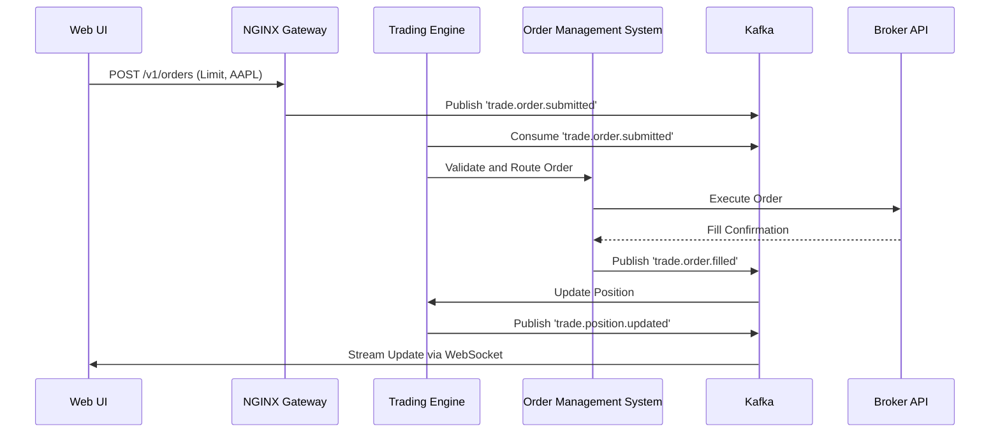
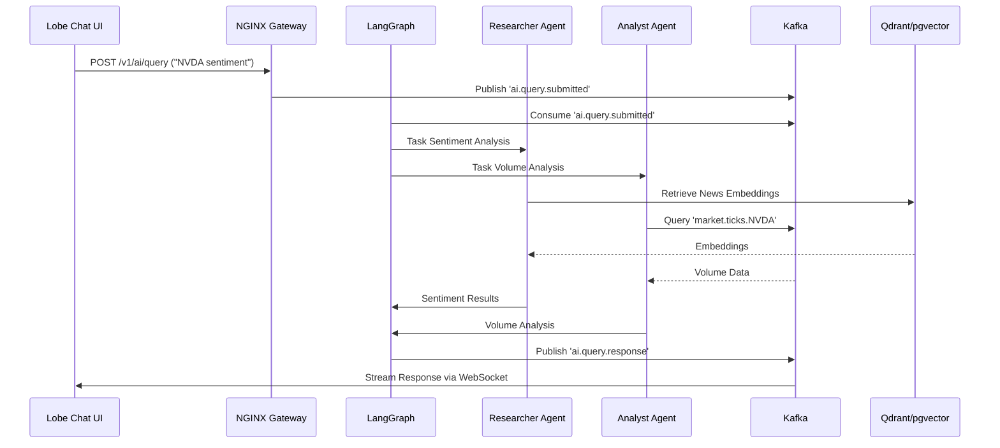
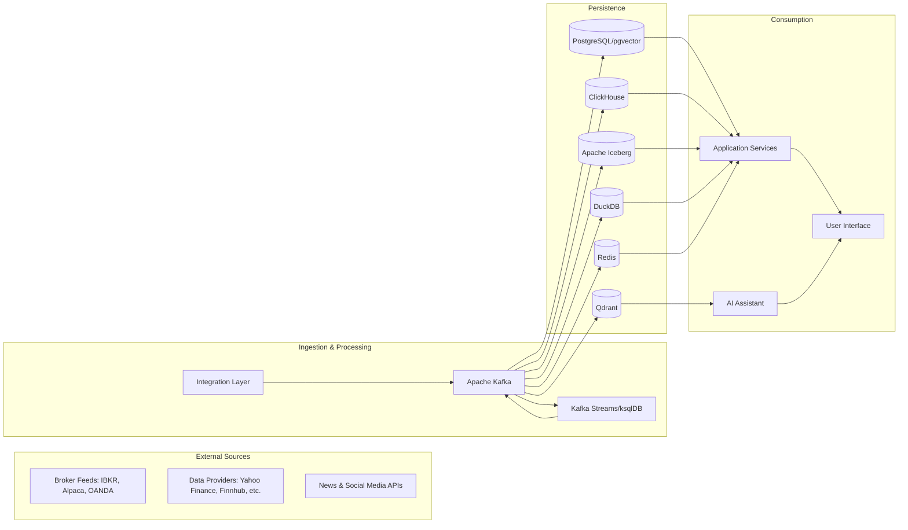
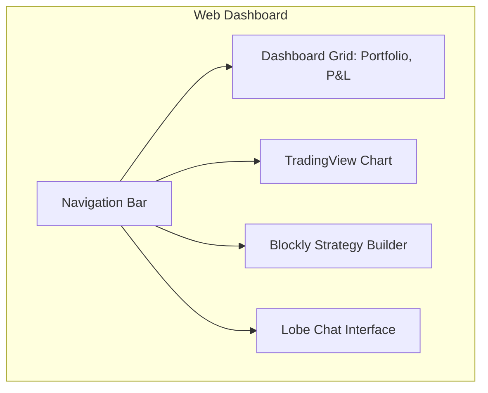
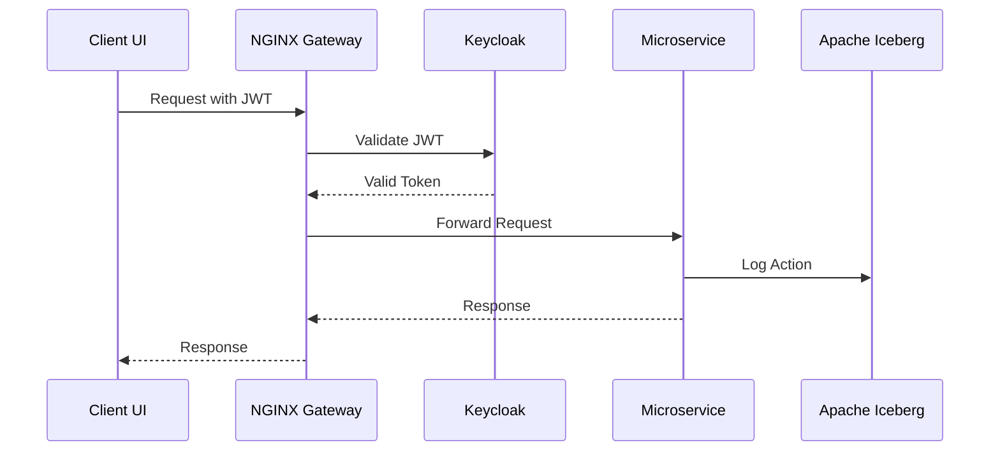
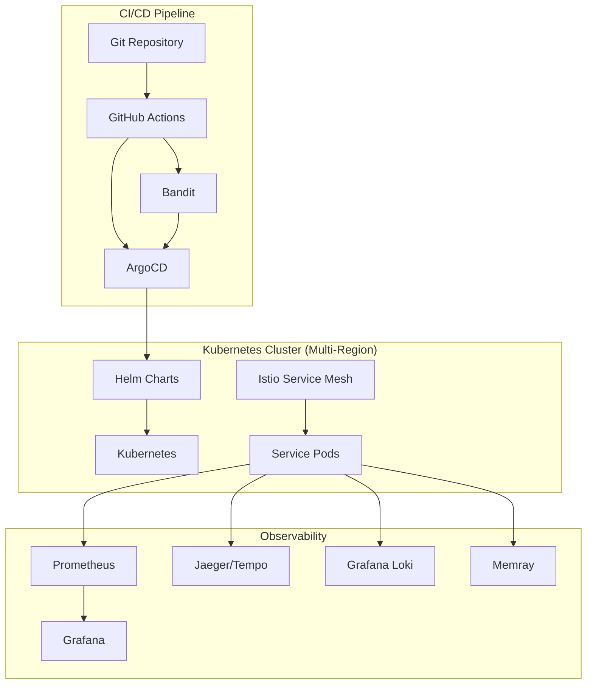
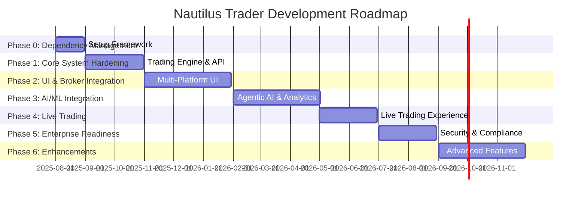
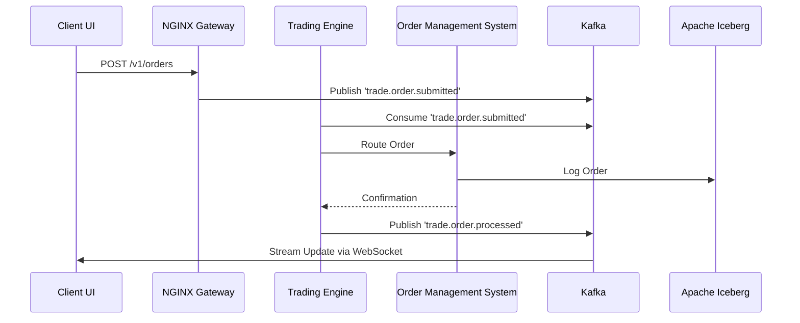

## **System Design Document (SDD)**

### **Nautilus Trader: Enterprise Algorithmic Trading System**

| **Version:**        | 3.0                             |
|:------------------- |:------------------------------- |
| **Date:**           | August 21, 2025                |
| **Status:**         | Draft                          |
| **Author(s):**      | Vincent Pereira                |
| **Technical Lead:** | [To Be Assigned]               |

---

### **1.0 Introduction**

#### **1.1 Purpose**

This System Design Document (SDD) provides a comprehensive architectural and technical design for the Nautilus Trader Algorithmic Trading System (ATS). It serves as the master blueprint for engineering teams, translating the business, functional, and technical requirements from the Business Requirements Document (BRD), Product Requirements Document (PRD), Functional Specification Document (FSD), and Technical Specification Document (TSD) into detailed design specifications. The SDD outlines the system’s components, their interactions, data models, interfaces, security framework, and deployment strategies, ensuring alignment with the updated "Features, Phases & Integration Strategy - Algorithmic Trading System" document. This document ensures a unified, scalable, and maintainable design for development, testing, and operations.

#### **1.2 Scope**

The scope of this SDD encompasses the end-to-end design of the Nautilus Trader ATS, including:

- **System Architecture:** High-level and low-level design of the microservices, event-driven communication, and cloud-native infrastructure.
- **Component Design:** Detailed internal design of each microservice, including Trading Engine, Agentic AI Assistant, Portfolio Manager, Risk Manager, Market Data Service, Order Management System (OMS), Market Scanner Service, and Customer Service Bot.
- **Data Design:** Comprehensive data models, database schemas, Kafka event schemas, and data flow diagrams.
- **Interface Design:** Specifications for internal and external APIs (REST, GraphQL, WebSocket, gRPC, FIX) and user interfaces (web, mobile, desktop, PWA).
- **Security Design:** Implementation of a zero-trust security model, authentication, authorization, encryption, and compliance mechanisms.
- **Deployment and Operations:** Kubernetes-based orchestration, CI/CD pipeline, observability stack (Prometheus, Grafana, Jaeger, Loki, Tempo, Memray), and performance optimizations.
- **Advanced Features:** Support for no-code strategy development, AI-driven analytics, voice trading, augmented reality (AR) interfaces, and a Strategy Marketplace.

**Out-of-Scope:**

- Development of proprietary hardware or physical infrastructure.
- Management of client funds or custodial services.
- Financial advisory services beyond analytical tools.
- Non-technical business processes or marketing strategies.

#### **1.3 System Overview**

Nautilus Trader is an enterprise-grade algorithmic trading platform designed for performance, intelligence, and accessibility, catering to retail investors, quantitative analysts, portfolio managers, and compliance officers. It adopts a "Best-of-Breed" integration strategy, leveraging leading open-source technologies (NautilusTrader, Apache Kafka, LangChain, etc.) to deliver a modular, scalable, and high-performance system. The architecture is microservices-based, event-driven, and cloud-native, ensuring low-latency execution, fault tolerance, and seamless integration with brokers and data providers. The platform supports multi-asset trading (stocks, ETFs, futures, options, forex, commodities, cryptocurrencies) and includes advanced features like AI-driven analytics, no-code strategy development, and future-ready capabilities (voice trading, AR, Strategy Marketplace).

#### **1.4 Definitions, Acronyms, and Abbreviations**

| Term     | Definition                                                                                                                    |
|:-------- |:----------------------------------------------------------------------------------------------------------------------------- |
| **ATS**  | Algorithmic Trading System                                                                                                   |
| **OMS**  | Order Management System                                                                                                      |
| **FIX**  | Financial Information eXchange protocol                                                                                      |
| **RAG**  | Retrieval-Augmented Generation (AI technique)                                                                                |
| **RBAC** | Role-Based Access Control                                                                                                    |
| **VaR**  | Value at Risk (risk measurement metric)                                                                                      |
| **API**  | Application Programming Interface                                                                                            |
| **JWT**  | JSON Web Token (security token standard)                                                                                     |
| **CQRS** | Command Query Responsibility Segregation                                                                                      |
| **MCP**  | Model Context Protocol (for AI conversation context)                                                                          |
| **RLOps**| Reinforcement Learning Operations                                                                                             |
| **SAST** | Static Application Security Testing                                                                                          |
| **UEBA** | User and Entity Behavior Analytics                                                                                           |
| **VW**   | Volume-Weighted (e.g., VW SMA, VW MACD)                                                                                      |
| **ATR**  | Average True Range                                                                                                           |
| **MFI**  | Money Flow Index                                                                                                             |
| **DMA**  | Direct Market Access                                                                                                         |

---

### **2.0 System Architecture**

The Nautilus Trader ATS is built on four core architectural principles to ensure performance, scalability, resilience, and maintainability:

1. **Microservices Architecture:** Decomposes the system into fine-grained, independently deployable services, each handling a specific business capability (e.g., Trading Engine, Risk Manager). This ensures fault isolation, technology diversity, and agile development.
2. **Event-Driven Architecture:** Uses Apache Kafka as the central event bus for asynchronous communication, enabling event sourcing, data replayability, and decoupled service interactions.
3. **Cloud-Native Design:** Leverages Docker for containerization and Kubernetes for orchestration, adhering to 12-Factor App principles and Infrastructure-as-Code (IaC) for automated, repeatable deployments.
4. **API-First Design:** Exposes all functionality through well-defined APIs (REST, GraphQL, WebSocket, gRPC, FIX), ensuring clear contracts for internal and external communication.

#### **2.1 High-Level Architecture Diagram**

The following Mermaid diagram illustrates the system’s logical architecture, showing layers and component interactions:

```mermaid
graph TD
    subgraph "Client Layer"
        WEB[Web Dashboard: React 18/Next.js/TypeScript]
        MOBILE[Mobile App: React Native]
        DESKTOP[Desktop App: Electron]
        PWA[Progressive Web App]
        API_CLIENT[External API Clients]
    end

    subgraph "API Gateway & Service Mesh"
        NGINX[NGINX Ingress Controller]
        ISTIO[Istio Service Mesh]
        AUTH[Authentication/Authorization: Keycloak]
    end

    subgraph "Application Layer (Microservices)"
        TRADING[Trading Engine: NautilusTrader]
        AI[Agentic AI Assistant: LangChain/LangGraph]
        PORTFOLIO[Portfolio Manager: PyPortfolioOpt/Riskfolio-Lib]
        RISK[Risk Manager: PyOD/SHAP]
        MARKET_DATA[Market Data Service: Multi-Source Feeds]
        OMS[Order Management System: QuickFIX/J]
        SCANNER[Market Scanner Service]
        CSBOT[Customer Service Bot: RAGFlow]
    end

    subgraph "Event Bus"
        KAFKA[Apache Kafka & Schema Registry]
    end

    subgraph "Integration Layer"
        BROKERS[Broker APIs: IBKR, Alpaca, OANDA, Coinbase, FIX]
        DATA_FEEDS[Data Feeds: Yahoo Finance, Alpha Vantage, Finnhub, etc.]
    end

    subgraph "Data Persistence Layer"
        POSTGRES[(PostgreSQL/pgvector: Transactional/Vector)]
        CLICKHOUSE[(ClickHouse: Time-Series/Analytics)]
        QDRANT[(Qdrant: Vector Search)]
        ICEBERG[(Apache Iceberg: Audit Trails)]
        DUCKDB[(DuckDB: Local Analytics)]
        REDIS[(Redis: Cache/Session)]
    end

    subgraph "Observability & Operations"
        KUBERNETES[Kubernetes Cluster: Helm]
        MONITORING[Prometheus/Grafana]
        LOGGING[Grafana Loki/ELK]
        TRACING[Jaeger/Tempo]
        PROFILING[Memray]
    end

    WEB --> NGINX
    MOBILE --> NGINX
    DESKTOP --> NGINX
    PWA --> NGINX
    API_CLIENT --> NGINX
    NGINX --> ISTIO
    ISTIO --> AUTH
    ISTIO --> TRADING
    ISTIO --> AI
    ISTIO --> PORTFOLIO
    ISTIO --> RISK
    ISTIO --> MARKET_DATA
    ISTIO --> OMS
    ISTIO --> SCANNER
    ISTIO --> CSBOT
    TRADING --> KAFKA
    AI --> KAFKA
    PORTFOLIO --> KAFKA
    RISK --> KAFKA
    MARKET_DATA --> KAFKA
    OMS --> KAFKA
    SCANNER --> KAFKA
    CSBOT --> KAFKA
    TRADING --> BROKERS
    MARKET_DATA --> DATA_FEEDS
    KAFKA --> POSTGRES
    KAFKA --> CLICKHOUSE
    KAFKA --> QDRANT
    KAFKA --> ICEBERG
    KAFKA --> DUCKDB
    KAFKA --> REDIS
    KUBERNETES --> TRADING
    KUBERNETES --> AI
    KUBERNETES --> PORTFOLIO
    KUBERNETES --> RISK
    KUBERNETES --> MARKET_DATA
    KUBERNETES --> OMS
    KUBERNETES --> SCANNER
    KUBERNETES --> CSBOT
    MONITORING --> KUBERNETES
    LOGGING --> KUBERNETES
    TRACING --> KUBERNETES
    PROFILING --> KUBERNETES
```



**Architecture Description:**

- **Client Layer:** Provides multi-platform access via web (React 18/Next.js), mobile (React Native), desktop (Electron), PWA, and external API clients.
- **API Gateway & Service Mesh:** NGINX routes external traffic, Istio manages internal communication with mutual TLS (mTLS), and Keycloak handles authentication.
- **Application Layer:** Microservices handle trading, AI, portfolio management, risk, market data, order management, market scanning, and customer support.
- **Event Bus:** Apache Kafka with Schema Registry ensures decoupled, auditable event streaming with hierarchical topics (e.g., `trade.order.submitted.AAPL`).
- **Integration Layer:** Connects to brokers and data providers for execution and market data.
- **Data Persistence Layer:** Polyglot persistence with PostgreSQL/pgvector, ClickHouse, Qdrant, Apache Iceberg, DuckDB, and Redis.
- **Observability & Operations:** Kubernetes orchestrates services, with Prometheus/Grafana for monitoring, Loki/ELK for logging, Jaeger/Tempo for tracing, and Memray for profiling.

---

### **3.0 Detailed Component Design**

This section provides detailed designs for each microservice, ensuring all features from the "Features, Phases & Integration Strategy" document are implemented.

#### **3.1 Trading Engine (`trading-engine-service`)**

- **Core Technology:** NautilusTrader (Python 3.10+ with Rust extensions).
- **Responsibilities:**
  - Executes trading strategies (user-defined or AI-generated) across asset classes (stocks, ETFs, futures, options, forex, commodities, cryptocurrencies).
  - Manages order lifecycle (placement, modification, cancellation) with real-time updates.
  - Supports backtesting with realistic market conditions (slippage, fees, latency).
  - Integrates with brokers via a unified abstraction layer.
- **Internal Logic:**
  - **Strategy Execution:** Instantiates strategy classes (Python or Blockly-generated), consuming market data from Kafka topics (e.g., `market.ticks.AAPL`) and publishing order requests (`trade.order.submitted`).
  - **Backtesting:** Uses NautilusTrader’s event-driven engine with VectorBT for GPU acceleration, pulling historical data from ClickHouse.
  - **Broker Integration:** Connects to Interactive Brokers (TWS/Gateway) for paper/live trading, with plans for Alpaca, OANDA, Coinbase, and FIX support via QuickFIX/J.
  - **Performance Optimization:** Implements lock-free data structures, cache-line alignment, and explores FPGAs/SmartNICs for ultra-low latency.
- **Dependencies:** Kafka, PostgreSQL, Redis, Broker APIs.
- **APIs:**
  - REST: `/v1/orders`, `/v1/positions`, `/v1/strategies`.
  - gRPC: `SubmitOrder`, `GetPosition`.
- **Event Flow:** Subscribes to `market.data.*`, `strategy.control.*`; Publishes `trade.order.*`, `trade.position.*`.

**Workflow Diagram (Order Execution):**



#### **3.2 Agentic AI Assistant (`ai-assistant-service`)**

- **Core Technologies:** LangChain, LangGraph, RAGFlow, Lobe Chat, OpenHands, Goose, Archon.
- **Responsibilities:**
  - Provides a conversational interface for trading, research, backtesting, and document analysis.
  - Orchestrates specialized agents (Analyst, Researcher, Risk Manager, Compliance, Trader).
  - Manages Retrieval-Augmented Generation (RAG) for document-based Q&A.
  - Generates, debugs, and optimizes Python code for strategies.
- **Internal Logic:**
  - **Entrypoint:** FastAPI server with Lobe Chat UI for natural language queries.
  - **Orchestration:** LangGraph routes tasks to agents based on intent (e.g., “Analyze NVDA sentiment” → Researcher Agent).
  - **RAG Pipeline:** RAGFlow processes uploaded documents (PDFs, SEC filings) and external data (news, social media), storing embeddings in Qdrant/pgvector.
  - **AI Knowledge Hub:** Archon ingests documentation for Tier 1 components (NautilusTrader, Kafka) for context-aware task execution.
  - **Code Assistance:** OpenHands generates/refactors code, while Goose automates DevOps tasks (e.g., pipeline fixes).
  - **Strategy Optimization:** Uses FinRL and Optuna for iterative strategy refinement.
- **Dependencies:** Kafka, Qdrant, pgvector, Redis, ClickHouse.
- **APIs:**
  - REST: `/v1/ai/query`, `/v1/ai/strategy`.
  - WebSocket: `/ws/ai/chat`.
- **Event Flow:** Subscribes to `ai.query.*`, `market.data.*`; Publishes `ai.response.*`, `ai.strategy.*`.

**Workflow Diagram (AI Query Processing):**



#### **3.3 Portfolio Manager (`portfolio-manager-service`)**

- **Core Technologies:** PyPortfolioOpt, Riskfolio-Lib.
- **Responsibilities:**
  - Optimizes portfolio allocations using mean-variance optimization and hierarchical risk parity.
  - Performs automated rebalancing and generates performance attribution reports.
  - Integrates with Risk Manager for real-time risk assessments (VaR, exposure).
- **Internal Logic:**
  - **Optimization:** Uses PyPortfolioOpt for mean-variance optimization and Riskfolio-Lib for risk parity, pulling market data from Kafka.
  - **Rebalancing:** Triggers rebalancing based on user-defined schedules or thresholds, publishing `portfolio.rebalanced` events.
  - **Reporting:** Generates reports (returns by asset/strategy) stored in ClickHouse.
  - **Stress Testing:** Simulates adverse market scenarios (e.g., 10% market drop) to assess portfolio resilience.
- **Dependencies:** Kafka, ClickHouse, PostgreSQL, Risk Manager.
- **APIs:**
  - REST: `/v1/portfolio/optimize`, `/v1/portfolio/report`.
  - gRPC: `OptimizePortfolio`, `GetPerformanceReport`.
- **Event Flow:** Subscribes to `market.data.*`, `risk.metrics.*`; Publishes `portfolio.optimized`, `portfolio.rebalanced`.

#### **3.4 Risk Manager (`risk-manager-service`)**

- **Core Technologies:** PyOD, SHAP.
- **Responsibilities:**
  - Monitors real-time trading risks (market, credit, operational).
  - Performs pre-trade risk checks and enforces exposure/position limits.
  - Detects anomalies in trading patterns (<5% false positives).
- **Internal Logic:**
  - **Risk Metrics:** Calculates VaR, expected shortfall, and volatility using real-time data from Kafka.
  - **Anomaly Detection:** Uses PyOD to identify irregularities, publishing `risk.anomaly.detected` events.
  - **Explainability:** SHAP provides transparent model explanations (>80% scores).
  - **Pre-Trade Checks:** Integrates custom VW indicators, rejecting non-compliant orders.
- **Dependencies:** Kafka, ClickHouse, Redis.
- **APIs:**
  - REST: `/v1/risk/metrics`, `/v1/risk/alerts`.
  - WebSocket: `/ws/risk/stream`.
- **Event Flow:** Subscribes to `trade.order.*`, `portfolio.update.*`; Publishes `risk.threshold.breached`, `risk.anomaly.detected`.

#### **3.5 Market Data Service (`market-data-service`)**

- **Core Technologies:** Kafka, ClickHouse, TA-Lib.
- **Responsibilities:**
  - Aggregates and normalizes real-time and historical market data from multiple sources.
  - Supports Market Scanner Service for real-time symbol scanning.
- **Internal Logic:**
  - **Data Ingestion:** Uses Kafka Connect to pull data from Yahoo Finance (primary), Alpha Vantage, Finnhub, etc. (fallbacks).
  - **Normalization:** Ensures consistent data formats, supporting dividend forecasts.
  - **Storage:** Persists time-series data in ClickHouse, metadata in PostgreSQL.
  - **Market Scanner:** Applies TA-Lib indicators (e.g., VW MACD, Normalized ATR) for real-time symbol filtering, streaming results to UI grid.
- **Dependencies:** Kafka, ClickHouse, PostgreSQL, Redis.
- **APIs:**
  - REST: `/v1/market/historical`.
  - WebSocket: `/ws/market/stream`.
- **Event Flow:** Subscribes to `data.feed.*`; Publishes `market.ticks.*`, `market.bars.*`.

#### **3.6 Order Management System (`oms-service`)**

- **Core Technologies:** QuickFIX/J, FIX8.
- **Responsibilities:**
  - Manages order lifecycle (validation, routing, execution, confirmation).
  - Supports standard (Market, Limit, Stop, Stop-Limit) and algorithmic orders (VWAP, TWAP, Iceberg).
- **Internal Logic:**
  - **Smart Order Router:** Optimizes execution across brokers to minimize market impact.
  - **Compliance Checks:** Performs pre-trade checks (margin, regulatory) with Risk Manager.
  - **FIX Connectivity:** Supports institutional trading via FIX Gateway.
- **Dependencies:** Kafka, PostgreSQL, Broker APIs.
- **APIs:**
  - REST: `/v1/orders`.
  - gRPC: `SubmitOrder`, `CancelOrder`.
- **Event Flow:** Subscribes to `trade.order.submitted`; Publishes `trade.order.filled`, `trade.order.rejected`.

#### **3.7 Market Scanner Service (`market-scanner-service`)**

- **Core Technologies:** TA-Lib, Bukosabino/ta, NumPy.
- **Responsibilities:**
  - Scans symbols in real-time based on custom criteria and technical indicators.
  - Streams results to a high-performance UI grid.
- **Internal Logic:**
  - **Indicators:** Implements VW SMA/EMA/MACD/MFI, Normalized ATR, Choppy Market Index, etc.
  - **Filtering:** Applies user-defined filters, publishing `scanner.results.*` events.
- **Dependencies:** Kafka, ClickHouse, Market Data Service.
- **APIs:**
  - REST: `/v1/scanner/run`.
  - WebSocket: `/ws/scanner/stream`.
- **Event Flow:** Subscribes to `market.data.*`; Publishes `scanner.results.*`.

#### **3.8 Customer Service Bot (`csbot-service`)**

- **Core Technologies:** RAGFlow, Lobe Chat.
- **Responsibilities:**
  - Provides automated user support via natural language queries.
- **Internal Logic:**
  - **RAG Pipeline:** Processes user queries against documentation and FAQs, storing embeddings in Qdrant/pgvector.
  - **Chat Interface:** Lobe Chat UI for conversational support.
- **Dependencies:** Kafka, Qdrant, Redis.
- **APIs:**
  - WebSocket: `/ws/support/chat`.
- **Event Flow:** Subscribes to `support.query.*`; Publishes `support.response.*`.

#### **3.9 Strategy Development and Backtesting**

- **Core Technologies:** Blockly, JupyterHub, VectorBT, TradingGym, Optuna.
- **Responsibilities:**
  - Provides no-code (Blockly) and code-based (JupyterHub) environments for strategy development.
  - Supports event-driven backtesting and hyperparameter optimization.
- **Internal Logic:**
  - **No-Code Builder:** Blockly generates Python code for strategies, stored in PostgreSQL.
  - **Python Studio:** JupyterHub with syntax highlighting, autocompletion, and debugging.
  - **AI Assistance:** OpenHands generates/refactors code, expanding test coverage.
  - **Backtesting:** NautilusTrader and VectorBT simulate realistic market conditions, storing results in ClickHouse.
  - **Optimization:** Optuna tunes strategy parameters, publishing `backtest.optimized` events.
- **Dependencies:** Kafka, ClickHouse, PostgreSQL.
- **APIs:**
  - REST: `/v1/strategies`, `/v1/backtest`.
- **Event Flow:** Subscribes to `strategy.create.*`, `backtest.run.*`; Publishes `backtest.completed.*`.

#### **3.10 Advanced Analytics**

- **Core Technologies:** Stock-Prediction-Models, LSTM-Neural-Network-for-Time-Series-Prediction, Real-time-stock-market-prediction, FinRL, QuantLib, Transformers, PyTorch.
- **Responsibilities:**
  - Provides predictive modeling, sentiment analysis, and options analytics.
- **Internal Logic:**
  - **Predictive Models:** >90% accuracy for pattern recognition using LSTM and real-time models.
  - **Sentiment Analysis:** >85% accuracy for news/social media using Transformers.
  - **Options Analytics:** QuantLib for pricing, implied volatility, and dividend forecasts.
  - **Reinforcement Learning:** FinRL with RLOps pipeline for strategy optimization.
- **Dependencies:** Kafka, ClickHouse, Qdrant.
- **APIs:**
  - REST: `/v1/analytics/predict`.
  - gRPC: `RunPrediction`, `GetSentiment`.
- **Event Flow:** Subscribes to `market.data.*`; Publishes `analytics.prediction.*`.

#### **3.11 Future-Ready Features**

- **Voice Trading:** Processes natural language commands (e.g., “Buy 100 AAPL at market”) using Whisper or equivalent.
- **Augmented Reality (AR):** Provides immersive data visualization via WebXR.
- **Strategy Marketplace:** Scopes a platform for sharing and copy trading strategies.
- **Market Microstructure Analysis:** Tools for order book analytics, liquidity detection, and market impact estimation.
- **Dependencies:** Kafka, PostgreSQL, Redis.
- **APIs:**
  - REST: `/v1/voice/command`, `/v1/ar/visualize`.
- **Event Flow:** Subscribes to `voice.command.*`; Publishes `voice.response.*`.

---

### **4.0 Data Design**

#### **4.1 Data Flow Diagram**

The following diagram illustrates the flow of data through the system:



#### **4.2 Database Schemas**

- **PostgreSQL Schema (`main_db`)**
  - `users`: `user_id` (UUID, PK), `email` (string), `hashed_password` (string), `role` (enum: trader, quant, admin), `preferences` (jsonb), `created_at` (timestamptz).
  - `accounts`: `account_id` (UUID, PK), `user_id` (UUID, FK), `broker_name` (string), `account_number` (string), `api_key_encrypted` (string).
  - `strategies`: `strategy_id` (UUID, PK), `user_id` (UUID, FK), `name` (string), `code` (text), `parameters` (jsonb), `version` (string).
  - `orders`: `order_id` (UUID, PK), `strategy_id` (UUID, FK), `symbol` (string), `type` (enum), `side` (enum), `quantity` (float), `price` (float), `status` (enum), `created_at` (timestamptz).
  - `positions`: `position_id` (UUID, PK), `user_id` (UUID, FK), `symbol` (string), `quantity` (float), `avg_price` (float), `updated_at` (timestamptz).

- **ClickHouse Schema (`market_data_db`)**
  - `ticks`: `timestamp` (DateTime64), `symbol` (String), `price` (Float64), `volume` (UInt64).
  - `bars_1min`: `timestamp` (DateTime), `symbol` (String), `open` (Float64), `high` (Float64), `low` (Float64), `close` (Float64), `volume` (UInt64).
  - `backtest_results`: `backtest_id` (UUID), `strategy_id` (UUID), `results` (JSON), `run_at` (DateTime).

- **Apache Iceberg Schema (`audit_db`)**
  - `actions_log`: `event_id` (UUID, PK), `timestamp` (timestamptz), `user_id` (UUID), `service_name` (string), `action_type` (string), `details` (jsonb).

- **Qdrant/pgvector Schema (`embeddings_db`)**
  - `embeddings`: `vector_id` (UUID, PK), `vector` (vector[1536]), `metadata` (jsonb), `created_at` (timestamptz).

- **Redis Schema (`cache_db`)**
  - Key-value pairs for session data, risk thresholds, and frequently accessed market data.

#### **4.3 Kafka Event Schemas**

Events are versioned and managed by Kafka Schema Registry using Avro format:

- **Topic:** `market.data.tick`
  - **Schema:** `{ "timestamp": long, "symbol": string, "price": double, "volume": int }`
- **Topic:** `trade.order.request`
  - **Schema:** `{ "order_id": string, "user_id": string, "account_id": string, "symbol": string, "type": string, "side": string, "quantity": double, "limit_price": double | null }`
- **Topic:** `trade.order.filled`
  - **Schema:** `{ "order_id": string, "fill_id": string, "fill_price": double, "fill_quantity": double, "timestamp": long }`
- **Topic:** `ai.query.response`
  - **Schema:** `{ "query_id": string, "user_id": string, "response": string, "timestamp": long }`

---

### **5.0 Interface Design**

#### **5.1 API Specifications**

- **REST API (FastAPI):**
  - `POST /v1/orders`: Submits a new order.
  - `GET /v1/orders/{order_id}`: Retrieves order status.
  - `POST /v1/strategies`: Creates/updates a strategy.
  - `POST /v1/backtest`: Runs a backtest.
  - `POST /v1/portfolio/optimize`: Optimizes portfolio.
  - `GET /v1/risk/metrics`: Retrieves risk metrics.
  - **Features:** Versioning (`/v1/`), OpenAPI/Swagger, JWT authentication.
  - **Example:**
    ```http
    POST /v1/orders
    Authorization: Bearer <JWT>
    Content-Type: application/json
    {
        "symbol": "AAPL",
        "type": "Limit",
        "side": "Buy",
        "quantity": 100,
        "price": 150.25
    }
    ```

- **GraphQL API (Graphene):**
  - **Query:** `portfolio(userId: String!) { value, positions { symbol, quantity } }`
  - **Subscription:** `onOrderUpdate(orderId: String!) { status, filledQuantity }`
  - **Features:** Flexible queries, real-time subscriptions.

- **WebSocket API (FastAPI):**
  - **Channels:** `marketdata:{symbol}`, `portfolio:{user_id}`, `risk:{user_id}`, `support:{user_id}`.
  - **Example Payload:**
    ```json
    {
        "event": "market.ticks",
        "symbol": "AAPL",
        "price": 150.30,
        "timestamp": "2025-08-21T02:48:00Z"
    }
    ```

- **gRPC API (gRPC-Python):**
  - **Service:** `TradingService { rpc SubmitOrder(OrderRequest) returns (OrderResponse); }`
  - **Purpose:** High-performance inter-service communication.

- **FIX API (QuickFIX/J, FIX8):**
  - **Messages:** NewOrderSingle, OrderCancelRequest, ExecutionReport.
  - **Purpose:** Institutional trading connectivity.

#### **5.2 User Interface Design**

- **Web Dashboard (React 18/Next.js/TypeScript):**
  - **Components:** Real-time portfolio grid, TradingView charts, Blockly strategy builder, Lobe Chat interface.
  - **Features:** Customizable layouts, saved in PostgreSQL.
- **Mobile App (React Native):**
  - **Features:** Biometric authentication, push notifications, simplified charts.
- **Desktop App (Electron):**
  - **Features:** Offline capabilities, local DuckDB analytics.
- **PWA:** Progressive web app for cross-device access.
- **Accessibility:** WCAG 2.1 compliance for users with disabilities.

**UI Mockup (Simplified):**



---

### **6.0 Security Design**

The security design follows a zero-trust model, ensuring robust protection and compliance:

- **Authentication:**
  - OAuth 2.0/OpenID Connect via Keycloak, supporting MFA (biometric, TOTP) and LDAP/SSO.
  - Short-lived JWTs issued for client authentication.
- **Authorization:**
  - RBAC enforced at NGINX Ingress and microservices, with roles (trader, quant, admin) encoded in JWTs.
- **Network Security:**
  - Istio service mesh enforces mTLS for all service-to-service communication.
  - Network policies restrict traffic to authorized services.
- **Data Security:**
  - **Encryption at Rest:** AES-256 for PostgreSQL, ClickHouse, and Iceberg.
  - **Encryption in Transit:** TLS 1.3 for all network communication.
  - **Secret Management:** HashiCorp Vault for storing API keys and sensitive data.
- **Application Security:**
  - **SAST:** Bandit scans Python code in CI/CD pipeline.
  - **UEBA:** Detects anomalies in user behavior (<5% false positives).
  - **Feature Flags:** Unleash for toggling strategies or kill switches.
- **Compliance:**
  - Immutable audit trails in Apache Iceberg for MiFID II, SOX, GDPR.
  - Automated compliance reports exported as PDFs.

**Security Workflow Diagram:**



---

### **7.0 Deployment and Operations**

- **Infrastructure as Code (IaC):** Terraform for cluster setup, Helm for service deployment.
- **CI/CD Pipeline:**
  - **Tools:** ArgoCD for GitOps, GitHub Actions for CI.
  - **Steps:**
    1. Commit code to Git repository.
    2. Run unit/integration tests and Bandit SAST scans.
    3. Build Docker images and push to Harbor registry.
    4. Deploy to Kubernetes using blue-green strategy.
- **Observability:**
  - **Monitoring:** Prometheus scrapes metrics, Grafana visualizes dashboards (latency, throughput, errors).
  - **Logging:** Grafana Loki aggregates logs, ELK as fallback.
  - **Tracing:** Jaeger/Tempo for distributed tracing.
  - **Profiling:** Memray for Python memory optimization.
- **High Availability:**
  - Multi-region Kubernetes clusters with automated failover.
  - Kafka replication for data durability.
  - RTO <4 hours, RPO <15 minutes.
- **Performance Optimization:**
  - Lock-free data structures in NautilusTrader.
  - Cache-line alignment for memory efficiency.
  - DMA with co-location for low-latency broker access.
  - FPGA/SmartNIC exploration in Phase 6.

**Deployment Diagram:**



---

### **8.0 Phased Implementation**

The project is structured into six phases to deliver value incrementally:



- **Phase 0: Dependency Management**
  - Setup Renovate for automated dependency updates.
  - Monitor 60+ open-source components (NautilusTrader, Kafka, etc.).
- **Phase 1: Core System Hardening**
  - Deploy NautilusTrader, Kafka, PostgreSQL/pgvector, ClickHouse, Qdrant, Iceberg, DuckDB, Redis.
  - Implement zero-trust security with Keycloak and Istio.
- **Phase 2: UI & Broker Integration**
  - Launch web, mobile, desktop, and PWA interfaces.
  - Integrate Interactive Brokers with paper/live toggle.
  - Deploy Blockly and Lobe Chat for no-code and AI features.
- **Phase 3: AI/ML Integration**
  - Roll out Agentic AI Assistant with LangChain, LangGraph, RAGFlow.
  - Integrate predictive models, sentiment analysis, and custom VW indicators.
- **Phase 4: Live Trading Experience**
  - Enable WebSocket/REST for live trading.
  - Deploy risk dashboards, Glass Box UI, and order management UI.
- **Phase 5: Enterprise Readiness**
  - Implement multi-region failover, Iceberg audit trails, and compliance reporting.
  - Deploy UEBA, Unleash, and advanced observability.
- **Phase 6: System Enhancement**
  - Introduce smart order router, additional brokers, voice trading, AR, and market microstructure tools.
  - Scope Strategy Marketplace.

---

### **9.0 Appendices**

#### **9.1 Data Flow Diagram (Order Processing)**



#### **9.2 References**

- Business Requirements Document (BRD) - Version 3.0
- Product Requirements Document (PRD) - Version 3.0
- Functional Specification Document (FSD) - Version 3.0
- Technical Specification Document (TSD) - Version 3.0
- Features, Phases & Integration Strategy - Algorithmic Trading System
- Comprehensive System Architecture
- Detailed Design Specifications

---

This SDD provides a detailed and comprehensive design for the Nautilus Trader ATS, incorporating all features from the updated "Features, Phases & Integration Strategy - Algorithmic Trading System" document. It uses Mermaid diagrams to visualize architecture, workflows, and data models, ensuring clarity for development and deployment.

