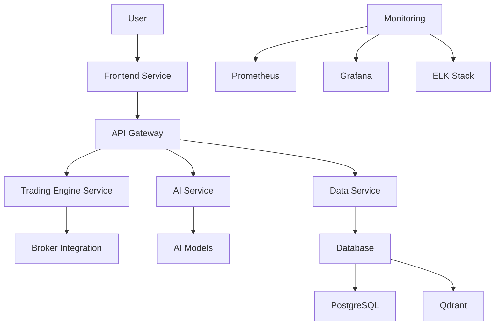

# System Design Document (SDD)
## Algorithmic Trading System

---

### Table of Contents
1. [Introduction](#introduction)
2. [System Architecture](#system-architecture)
3. [Component Design](#component-design)
   - [API Gateway](#api-gateway)
   - [Trading Engine Service](#trading-engine-service)
   - [AI Service](#ai-service)
   - [Data Service](#data-service)
   - [Frontend Service](#frontend-service)
   - [Database](#database)
   - [Monitoring and Logging](#monitoring-and-logging)
4. [Data Design](#data-design)
5. [Integration Points](#integration-points)
6. [Security](#security)
7. [Performance and Scalability](#performance-and-scalability)
8. [Deployment](#deployment)
9. [Monitoring and Maintenance](#monitoring-and-maintenance)
10. [Appendices](#appendices)

---

### Introduction
The Algorithmic Trading System is a cutting-edge platform designed to automate and optimize trading strategies across multiple asset classes, including stocks, ETFs, futures, options, forex, and cryptocurrencies. By leveraging advanced artificial intelligence (AI) and machine learning, the system enables traders to develop, backtest, and execute sophisticated trading strategies with high precision and efficiency. The platform integrates seamlessly with various brokers and data sources, ensuring high availability, reliability, and security.

This System Design Document (SDD) provides a comprehensive blueprint of the system's architecture, components, data flow, integration points, security measures, and deployment strategies. It serves as a guide for developers, architects, and stakeholders to understand the system's design and ensure it meets both functional and non-functional requirements.

---

### System Architecture
The system employs a **microservices architecture**, emphasizing modularity, scalability, and maintainability. Each microservice is dedicated to a specific domain, enabling independent development, deployment, and scaling. This architecture supports high-frequency trading, accommodates large user bases, and facilitates complex AI-driven operations.

#### Architecture Diagram


#### Component Overview
- **API Gateway**: Acts as the central entry point for client requests, managing routing, authentication, and rate limiting.
- **Trading Engine Service**: Executes trading logic, manages orders, and integrates with external brokers.
- **AI Service**: Powers the AI Assistant, processes natural language, and generates trading strategies.
- **Data Service**: Handles market data, alternative data, and advanced analytics.
- **Frontend Service**: Delivers a responsive user interface for web and mobile access.
- **Database**: Stores user profiles, trading strategies, market data, and AI embeddings.
- **Monitoring and Logging**: Ensures system health and performance via real-time monitoring and centralized logging.

---

### Component Design
This section details each major component, including their responsibilities, technologies, and key features.

#### API Gateway
- **Technology**: FastAPI
- **Responsibilities**:
  - Route incoming requests to appropriate microservices.
  - Authenticate users using JSON Web Tokens (JWT).
  - Enforce Role-Based Access Control (RBAC) for authorization.
  - Implement rate limiting to prevent abuse.
- **Key Endpoints**:
  - `/auth`: User authentication and token generation.
  - `/trade`: Routes trading requests to the Trading Engine Service.
  - `/ai`: Routes AI-related queries to the AI Service.
  - `/data`: Handles data requests for the Data Service.

#### Trading Engine Service
- **Technology**: QuantConnect LEAN, Python
- **Responsibilities**:
  - Execute trading strategies based on predefined logic.
  - Manage the order lifecycle (placement, modification, cancellation).
  - Integrate with external brokers for trade execution.
- **Features**:
  - Supports multiple asset classes: stocks, options, futures, forex, cryptocurrencies.
  - Order types: Market, Limit, Stop, VWAP, TWAP, etc.
  - Real-time order status updates and logging for audit trails.

#### AI Service
- **Technology**: LangChain, Ollama, Python
- **Responsibilities**:
  - Process natural language queries for trading, portfolio management, and document analysis.
  - Generate trading strategies from user prompts using generative AI.
  - Analyze documents using Agentic Retrieval-Augmented Generation (RAG).
- **Features**:
  - Collaborative agent network for task delegation (e.g., Analyst, Researcher, Risk Manager).
  - Integration with local large language models (LLMs) via Ollama for secure processing.
  - Continuous learning pipeline for model improvement.

#### Data Service
- **Technology**: PostgreSQL with pgvector, Qdrant, Python
- **Responsibilities**:
  - Collect, store, and provide access to real-time and historical market data.
  - Integrate alternative data sources (e.g., news, sentiment analysis).
  - Perform advanced analytics and market screening.
- **Features**:
  - Fallback mechanism for data source reliability.
  - Support for alternative data (e.g., real-time news with sentiment analysis).
  - Market microstructure analysis for in-depth insights.

#### Frontend Service
- **Technology**: Next.js, React, TypeScript
- **Responsibilities**:
  - Render a responsive user interface for web and mobile devices.
  - Display real-time charts, dashboards, and the AI chatbot interface.
- **Features**:
  - Responsive design for seamless cross-device experience.
  - Integration with TradingView for institutional-grade charting.
  - Chatbot interface for natural language interaction with the AI Assistant.

#### Database
- **Technology**: PostgreSQL with pgvector, Qdrant
- **Responsibilities**:
  - Store user profiles, trading strategies, market data, and AI embeddings.
  - Manage vector embeddings for AI functionalities.
- **Schema**:
  - **Users**: `id`, `username`, `password_hash`, `email`, `role`
  - **Strategies**: `id`, `user_id`, `name`, `code`, `parameters`
  - **Orders**: `id`, `strategy_id`, `type`, `status`, `quantity`, `price`, `timestamp`
  - **Market Data**: `id`, `symbol`, `timestamp`, `open`, `high`, `low`, `close`, `volume`
  - **Vector Embeddings**: Stored in Qdrant for efficient retrieval.

#### Monitoring and Logging
- **Technology**: Prometheus, Grafana, ELK Stack
- **Responsibilities**:
  - Collect and visualize system metrics.
  - Aggregate logs for analysis and troubleshooting.
- **Features**:
  - Real-time dashboards for key performance indicators (KPIs).
  - Alerting for anomalies and critical events.
  - Centralized log management for all services.

---

### Data Design
The data architecture combines relational and vector databases to manage structured and unstructured data efficiently.

#### Database Schema
**PostgreSQL with pgvector**
- **Users Table**:
  - `id`: Primary Key
  - `username`: String
  - `password_hash`: String
  - `email`: String
  - `role`: Enum (Admin, Trader, Quant, etc.)
- **Strategies Table**:
  - `id`: Primary Key
  - `user_id`: Foreign Key to Users
  - `name`: String
  - `code`: Text (strategy code)
  - `parameters`: JSON (strategy parameters)
- **Orders Table**:
  - `id`: Primary Key
  - `strategy_id`: Foreign Key to Strategies
  - `type`: Enum (Market, Limit, etc.)
  - `status`: Enum (Pending, Executed, Cancelled)
  - `quantity`: Integer
  - `price`: Float
  - `timestamp`: Timestamp
- **Market Data Table**:
  - `id`: Primary Key
  - `symbol`: String
  - `timestamp`: Timestamp
  - `open`: Float
  - `high`: Float
  - `low`: Float
  - `close`: Float
  - `volume`: Integer

**Qdrant**
- **Vector Embeddings**: Stores document embeddings for the AI Assistant's RAG pipeline.
  - Collection: `document_embeddings`
  - Vector size: 768 (e.g., for BERT-based models)

#### Data Flow
- **Market Data Ingestion**: External feeds → Data Service → PostgreSQL
- **Document Processing**: User uploads → Unstructured.io → Text extraction → Embeddings → Qdrant
- **Trading Execution**: User request → API Gateway → Trading Engine → Broker
- **AI Queries**: User query → AI Service → Database/Qdrant → Response

---

### Integration Points
The system integrates with external services and APIs to deliver comprehensive functionality:

- **Brokers**:
  - Interactive Brokers: Using `ib_insync` library.
  - Alpaca, TD Ameritrade: Via REST APIs.
- **Data Feeds**:
  - Yahoo Finance, Alpha Vantage: REST APIs for market data.
  - News APIs: For sentiment analysis and alternative data.
- **AI Models**:
  - Ollama: Local LLMs for secure processing.
- **Document Processing**:
  - Unstructured.io: For parsing PDFs, DOCX, etc.

API keys and credentials are securely managed via environment variables or a secrets manager.

---

### Security
Security is paramount due to the sensitive nature of financial data and trading operations.

- **Authentication**:
  - JWT tokens for user sessions.
  - OAuth 2.0 for broker integrations.
- **Authorization**:
  - RBAC with roles: Admin, Trader, Quant, Risk Manager, etc.
- **Encryption**:
  - TLS 1.3 for data in transit.
  - AES-256 for data at rest (e.g., credentials, API keys).
- **Compliance**:
  - **GDPR**: Data retention and user consent management.
  - **Financial Regulations**: Audit trails and reporting.
- **Container Security**:
  - Vulnerability scanning with OpenVAS.
  - Runtime protection with Wazuh.

---

### Performance and Scalability
The system is optimized for high-frequency trading and large-scale usage.

- **Latency Targets**:
  - Order execution: <100ms
  - API responses: <100ms for critical operations
- **Scalability**:
  - Horizontal scaling with Kubernetes.
  - Load balancing via the API Gateway.
- **Optimization**:
  - Caching with Redis for frequent data access.
  - Asynchronous processing with Celery for non-critical tasks.

---

### Deployment
Modern DevOps practices ensure reliable and scalable deployment.

- **Environments**:
  - **Development**: Feature development and testing.
  - **Staging**: Integration and QA.
  - **Production**: Live trading environment.
- **CI/CD Pipeline**:
  - Automated builds and tests with GitHub Actions.
  - Deployment to Kubernetes via Helm charts.
- **Deployment Strategy**:
  - Rolling updates for zero downtime.
  - Blue-green deployments for major releases.

---

### Monitoring and Maintenance
Continuous monitoring and proactive maintenance ensure system reliability.

- **Monitoring Tools**:
  - **Prometheus**: Collects metrics.
  - **Grafana**: Visualizes KPIs and alerts.
  - **ELK Stack**: Aggregates and analyzes logs.
- **Maintenance**:
  - **Backups**: Daily database backups.
  - **Updates**: Regular security patches and feature updates.
  - **Audits**: Quarterly security and compliance reviews.

---

### Appendices

#### Appendix A: API Specifications
- **Endpoint**: `/v1/data`
  - **Method**: GET
  - **Description**: Retrieves market data for a specified asset class and symbol.
  - **Parameters**:
    - `asset_class`: String (required)
    - `symbol`: String (required)
    - `type`: String (optional, default: "price")
    - `start`: String (optional, ISO 8601)
    - `end`: String (optional, ISO 8601)
    - `real_time`: Boolean (optional, default: false)

#### Appendix B: Configuration Files
- **Kubernetes Deployment YAML**:
  ```yaml
  apiVersion: apps/v1
  kind: Deployment
  metadata:
    name: trading-engine
  spec:
    replicas: 3
    selector:
      matchLabels:
        app: trading-engine
    template:
      metadata:
        labels:
          app: trading-engine
      spec:
        containers:
        - name: trading-engine
          image: registry.example.com/trading-engine:latest
          ports:
          - containerPort: 8080
  ```

#### Appendix C: Troubleshooting Guide
- **Issue**: API Gateway returns 502 Bad Gateway
  - **Solution**: Verify backend service availability.
- **Issue**: Database connection timeout
  - **Solution**: Check network and credentials.

---

This SDD provides a thorough overview of the Algorithmic Trading System, ensuring all design aspects are documented for development, deployment, and maintenance.