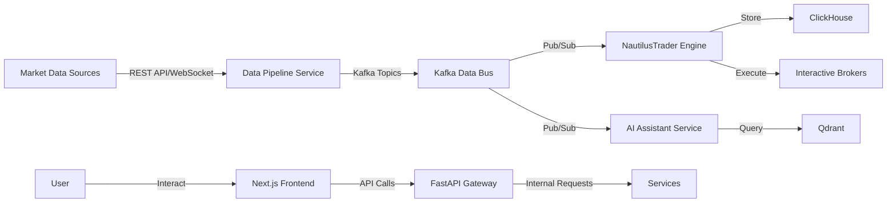
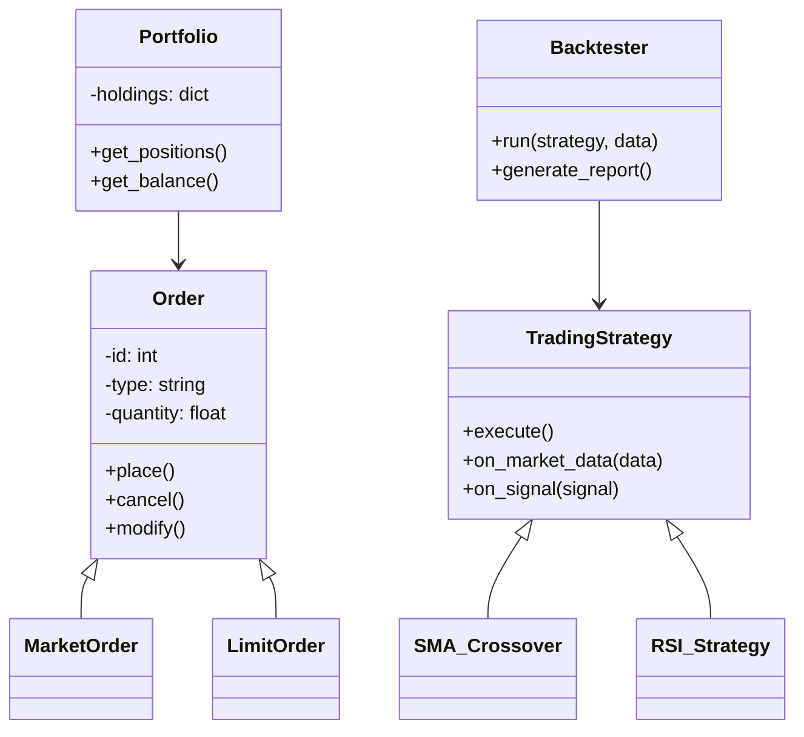
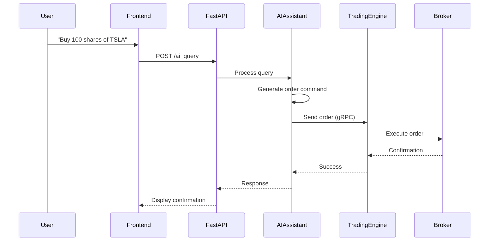

# System Design Document (SDD): Algorithmic Trading System

## 1. Introduction

### 1.1 Purpose

This System Design Document (SDD) outlines the architecture, design, and implementation strategy for the Algorithmic Trading System (ATS), an enterprise-grade platform designed to empower users—ranging from non-technical traders to professional analysts—to develop, test, and execute automated trading strategies. The ATS leverages real-time market data, AI-driven insights, and a scalable, modular architecture to deliver high-performance trading capabilities across multiple asset classes (e.g., equities, forex, cryptocurrencies). This document provides a detailed blueprint for architects, developers, and stakeholders to align the system's design with business and technical requirements.

### 1.2 Scope

The ATS is a comprehensive platform with the following key features:

- **Core Trading Engine**: Supports strategy development, backtesting, and live trade execution.
- **Real-Time Data Pipelines**: Ingests and processes market data from multiple sources.
- **Agentic AI Assistant**: Enables natural language interaction for strategy creation and system queries.
- **Prediction and Analytics**: Provides ML-based market forecasting and portfolio optimization.
- **User Interface**: Offers real-time dashboards and a no-code strategy builder.
- **APIs and Orchestration**: Includes RESTful APIs and low-latency streaming capabilities.
- **Security and Compliance**: Implements a Zero-Trust architecture with immutable audit trails.

This SDD details the system’s architecture, components, design considerations, data flows, and implementation strategies, ensuring a robust and maintainable solution.

### 1.3 Definitions, Acronyms, and Abbreviations

- **ATS**: Algorithmic Trading System
- **BRD**: Business Requirements Document
- **FRD**: Functional Requirements Document
- **PRD**: Product Requirements Document
- **FSD**: Functional Specification Document
- **TSD**: Technical Specification Document
- **SDD**: System Design Document
- **API**: Application Programming Interface
- **UI**: User Interface
- **UX**: User Experience
- **RBAC**: Role-Based Access Control
- **AI**: Artificial Intelligence
- **ML**: Machine Learning
- **NLP**: Natural Language Processing
- **SMA**: Simple Moving Average
- **RSI**: Relative Strength Index
- **VWAP**: Volume-Weighted Average Price
- **VaR**: Value at Risk
- **RAG**: Retrieval-Augmented Generation

### 1.4 References

- "Features, Phases & Integration Strategy - Algorithmic Trading System.docx"
- Business Requirements Document (BRD)
- Functional Requirements Document (FRD)
- Product Requirements Document (PRD)
- Functional Specification Document (FSD)
- Technical Specification Document (TSD)
- NautilusTrader Documentation: [https://nautilustrader.io/](https://nautilustrader.io/)
- Apache Kafka Documentation: [https://kafka.apache.org/](https://kafka.apache.org/)

---

## 2. System Architecture

### 2.1 Overview

The ATS adopts a microservices architecture to ensure modularity, scalability, and fault tolerance. Apache Kafka acts as the central event bus, facilitating real-time data streaming and loose coupling between services. The system integrates a trading engine, AI assistant, data pipelines, and a user interface, all deployed in a cloud-native environment (e.g., AWS, GCP, or Azure). This design supports high-frequency trading, extensibility, and resilience.

### 2.2 Architecture Diagram

The following Mermaid diagram provides a high-level view of the ATS architecture:

```mermaid
graph TD
    A[Next.js Frontend] -->|REST API| B[FastAPI Gateway]
    B -->|gRPC| C[Kafka Data Bus]
    C -->|Pub/Sub| D[NautilusTrader Engine]
    C -->|Pub/Sub| E[AI Assistant Service]
    C -->|Pub/Sub| F[Data Pipeline Service]
    F -->|Ingest| G[Market Data Sources<br/>(Yahoo Finance, Alpha Vantage, IB)]
    D -->|Execute Trades| H[Interactive Brokers]
    E -->|NLP & Code Gen| I[LangChain & OpenHands]
    J[PostgreSQL] -->|Store| K[User Data & Strategies]
    L[ClickHouse] -->|Analyze| M[Time-Series Data]
    N[Qdrant] -->|Vector Search| O[AI Embeddings]
    P[Apache Iceberg] -->|Audit Trails| Q[Compliance Logs]
```

### 2.3 Components and Modules

- **Next.js Frontend**: A React-based UI providing real-time dashboards, strategy creation tools, and AI interaction.
- **FastAPI Gateway**: A high-performance API layer serving as the entry point for frontend and external requests.
- **Kafka Data Bus**: A distributed streaming platform for real-time event handling and service communication.
- **NautilusTrader Engine**: The core trading engine for strategy execution, backtesting, and live trading.
- **AI Assistant Service**: An NLP-powered service for user queries, strategy generation, and system assistance.
- **Data Pipeline Service**: Ingests, processes, and distributes market data from external sources.
- **Databases**:
  - **PostgreSQL with pgvector**: Stores user profiles, trading strategies, and vector embeddings for AI.
  - **ClickHouse**: Manages high-volume time-series data for analytics and reporting.
  - **Qdrant**: Provides vector search capabilities for RAG-based AI insights.
  - **Apache Iceberg**: Ensures immutable storage of audit trails and compliance logs.

---

## 3. Design Considerations

### 3.1 Scalability

The ATS is engineered to scale horizontally to accommodate growing user bases and data volumes:

- **Microservices**: Independent services scale based on specific workloads (e.g., trading engine vs. data pipelines).
- **Containerization**: Docker ensures consistent deployment and easy replication.
- **Load Balancing**: NGINX ingress controllers distribute traffic across service instances.
- **Database Sharding**: ClickHouse supports sharding for efficient time-series data management.

### 3.2 Performance

Low latency and high throughput are critical for real-time trading:

- **Event-Driven Design**: Kafka enables asynchronous, non-blocking communication.
- **Optimized Storage**: ClickHouse delivers fast queries on time-series data.
- **Caching**: Redis caches market data and user preferences to minimize latency.
- **Algorithm Efficiency**: Trading strategies use optimized logic to reduce execution time.

### 3.3 Reliability

The system ensures uninterrupted operation through:

- **Redundancy**: Multiple instances of critical services with failover capabilities.
- **Health Monitoring**: Prometheus and Grafana track system metrics and trigger alerts.
- **Data Replication**: Kafka topics and database backups prevent data loss.
- **Graceful Degradation**: Non-critical failures (e.g., AI assistant downtime) do not disrupt trading.

### 3.4 Security

Robust security measures protect sensitive data and ensure compliance:

- **Zero-Trust Architecture**: All requests require authentication and authorization.
- **Encryption**: AES-256 for data at rest and TLS 1.3 for data in transit.
- **RBAC**: Role-based access controls restrict functionality by user type.
- **Audit Trails**: Apache Iceberg provides tamper-proof logging for regulatory compliance.

### 3.5 Extensibility

The modular design supports future enhancements:

- **Pluggable Data Sources**: New market data providers can be integrated via the pipeline service.
- **Custom Strategies**: Users can add bespoke trading algorithms via the NautilusTrader engine.
- **AI Upgrades**: The assistant service can adopt new LLMs or NLP frameworks.

---

## 4. Technical Design

### 4.1 Data Flow

The following Mermaid diagram illustrates the data flow within the ATS:



### 4.2 Class Diagrams

A simplified class diagram for the NautilusTrader Engine:



### 4.3 Sequence Diagrams

The sequence diagram below depicts a user executing a trade via the AI assistant:



### 4.4 Database Schema

#### Users Table (PostgreSQL)
```sql
CREATE TABLE users (
    id SERIAL PRIMARY KEY,
    username VARCHAR(50) UNIQUE NOT NULL,
    email VARCHAR(100) UNIQUE NOT NULL,
    password_hash VARCHAR(255) NOT NULL,
    role VARCHAR(20) DEFAULT 'user',
    created_at TIMESTAMP DEFAULT CURRENT_TIMESTAMP
);
```

#### Strategies Table (PostgreSQL)
```sql
CREATE TABLE strategies (
    id SERIAL PRIMARY KEY,
    user_id INT REFERENCES users(id),
    name VARCHAR(100) NOT NULL,
    code TEXT NOT NULL,
    parameters JSONB,
    created_at TIMESTAMP DEFAULT CURRENT_TIMESTAMP
);
```

#### Time-Series Data (ClickHouse)
```sql
CREATE TABLE market_data (
    symbol String,
    timestamp DateTime,
    open Float32,
    high Float32,
    low Float32,
    close Float32,
    volume UInt32
) ENGINE = MergeTree()
ORDER BY (symbol, timestamp);
```

---

## 5. Implementation Details

### 5.1 Programming Languages

- **Backend**: Python 3.9+ for its rich ecosystem and performance in data processing.
- **Frontend**: JavaScript/TypeScript with ES6+ for modern, responsive web applications.
- **AI/ML**: Python with PyTorch or TensorFlow for machine learning models.

### 5.2 Frameworks and Libraries

- **Backend**:
  - **FastAPI**: High-performance RESTful APIs with async support.
  - **gRPC**: Low-latency service-to-service communication.
  - **NautilusTrader**: Core trading engine for strategy execution.
  - **LangChain & OpenHands**: NLP and code generation for the AI assistant.
- **Frontend**:
  - **Next.js**: Server-side rendering and static site generation.
  - **react-financial-charts**: Real-time financial visualizations.
- **Data**:
  - **Apache Kafka**: Real-time event streaming and pub/sub messaging.
  - **PostgreSQL with pgvector**: Relational storage with vector embeddings.
  - **ClickHouse**: High-performance time-series analytics.
  - **Qdrant**: Vector search for AI-driven insights.
  - **Apache Iceberg**: Immutable data lake for compliance.

### 5.3 Development Environment

- **Containerization**: Docker for consistent builds and deployments.
- **Orchestration**: Kubernetes for scaling and resilience.
- **Version Control**: Git with GitHub for collaborative development.
- **CI/CD**: GitHub Actions for automated testing and deployment.

### 5.4 Coding Standards

- **Python**: Adheres to PEP8, uses type hints, and includes detailed docstrings.
- **JavaScript/TypeScript**: Uses ESLint, Prettier, and JSDoc for consistency.
- **Commit Messages**: Follows Conventional Commits (e.g., `feat: add trade execution`).

---

## 6. Testing and Quality Assurance

### 6.1 Unit Testing

- **Python**: pytest with 80%+ code coverage for backend logic.
- **JavaScript**: Jest for frontend components and utilities.

### 6.2 Integration Testing

- Validates interactions between services (e.g., FastAPI to Kafka, Trading Engine to Broker).
- Uses Postman or custom Python scripts for API testing.

### 6.3 System Testing

- End-to-end tests for key workflows (e.g., strategy creation, trade execution).
- Selenium or Cypress for UI automation.

### 6.4 Performance Testing

- Simulates 1000+ concurrent users and high-frequency market data ingestion.
- Measures latency (target: <100ms) and throughput under peak load.

---

## 7. Deployment

### 7.1 Deployment Architecture

- **Cloud Provider**: AWS (EKS), GCP (GKE), or Azure (AKS).
- **Container Orchestration**: Kubernetes with Horizontal Pod Autoscaling (HPA).
- **Load Balancing**: NGINX ingress controller for traffic distribution.

### 7.2 Installation Instructions

1. Clone repository: `git clone <repo-url>`
2. Build Docker images: `docker build -t ats-service .`
3. Deploy with Helm: `helm install ats ./helm-charts`
4. Verify deployment: `kubectl get pods`

### 7.3 Configuration Management

- Environment variables stored in `.env` files (e.g., API KEYS, DB URLs).
- Kubernetes ConfigMaps and Secrets for runtime configurations.

---

## 8. Maintenance and Support

### 8.1 Error Handling

- Try-catch blocks with descriptive, user-friendly error messages.
- Retry logic for transient failures (e.g., network timeouts, broker errors).

### 8.2 Logging

- Centralized logging via ELK stack (Elasticsearch, Logstash, Kibana).
- Log levels: DEBUG, INFO, WARN, ERROR.

### 8.3 Monitoring

- **Prometheus**: Collects metrics (e.g., latency, error rates, CPU usage).
- **Grafana**: Visualizes metrics and sends alerts via Slack/email.

### 8.4 Backup and Recovery

- Daily snapshots of PostgreSQL and ClickHouse databases.
- Kafka topic replication with a 7-day retention period.

---

## 9. Appendices

### 9.1 Glossary

- **Microservices**: Small, independent services with specific responsibilities.
- **Event-Driven**: Architecture where components react to events (e.g., market updates).

### 9.2 References

- NautilusTrader Docs: [https://nautilustrader.io/](https://nautilustrader.io/)
- Kafka Docs: [https://kafka.apache.org/](https://kafka.apache.org/)

### 9.3 Change History

- **v1.0**: Initial draft (2023-10-01).
- **v1.1**: Added detailed deployment steps (2023-10-05).
- **v1.2**: Refined diagrams and testing sections (2023-10-10).