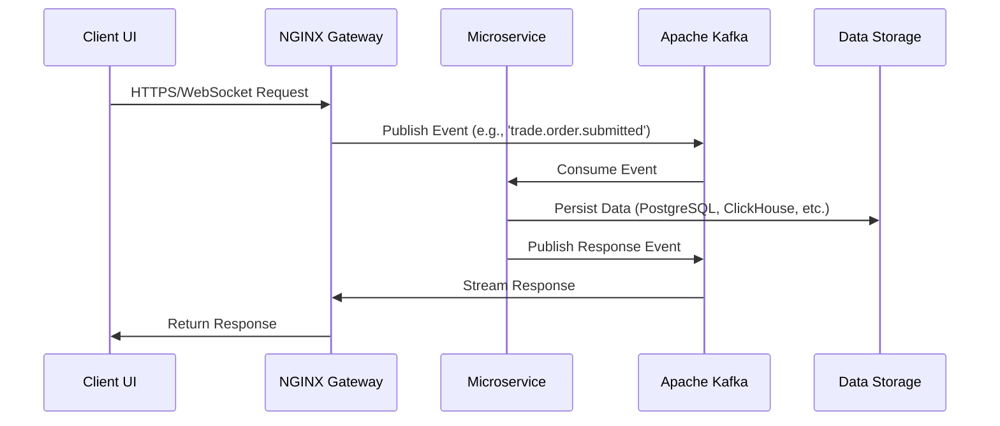

## **Software Requirements Specification (SRS)**

### **Nautilus Trader: Enterprise Algorithmic Trading System**

| **Version:**      | 3.0                                                           |
|:----------------- |:------------------------------------------------------------- |
| **Date:**         | August 21, 2025                                              |
| **Status:**       | Draft                                                        |
| **Prepared For:** | Nautilus Trader Development Team, QA Team, Project Management |

---

### **Table of Contents**

1. Introduction
2. Overall Description
3. Specific Requirements
4. Appendices

---

### **1. Introduction**

#### **1.1 Purpose**

This Software Requirements Specification (SRS) provides a comprehensive and detailed description of the functional and non-functional requirements for the Nautilus Trader Algorithmic Trading System (ATS). It serves as the primary guiding document for the development team, quality assurance (QA) team, and project management, ensuring a clear understanding of the system's intended behavior, capabilities, and constraints. This SRS translates the business, functional, and technical requirements from the Business Requirements Document (BRD), Product Requirements Document (PRD), Functional Specification Document (FSD), Technical Specification Document (TSD), and the updated "Features, Phases & Integration Strategy - Algorithmic Trading System" document into actionable specifications. It outlines external interfaces, user interactions, system attributes, and acceptance criteria to guide implementation, testing, and validation.

#### **1.2 Document Conventions**

This document adheres to the IEEE 830 standard for software requirements specifications. Requirements are uniquely identified with a hierarchical ID (e.g., FUN-UI-101 for functional user interface requirements) for traceability. Each requirement includes a description, rationale, and testable acceptance criteria. Technical terms are defined in Appendix A (Glossary). References to source documents are cited inline. Priority levels are indicated as follows:

- **MUST:** Mandatory requirement critical to core functionality.
- **SHALL:** Required functionality, but with potential for phased implementation.
- **SHOULD:** Desirable but non-critical functionality.
- **MAY:** Optional feature for future consideration.

#### **1.3 Intended Audience and Reading Suggestions**

- **Developers:** Focus on Section 3 (Specific Requirements), particularly functional requirements (3.2) for module-specific details, external interfaces (3.1) for integration points, and non-functional requirements (3.3) for performance and security constraints.
- **QA & Testers:** Use Section 3 to develop test plans, cases, and scripts, leveraging acceptance criteria for validation. Non-functional requirements (3.3) guide performance and security testing.
- **Project Managers:** Refer to the entire document to understand scope, track milestones, and ensure alignment with acceptance criteria during testing.
- **System Architects:** Review external interfaces (3.1), non-functional requirements (3.3), and architectural constraints (2.4) to align design decisions with system needs.
- **Stakeholders:** Focus on Section 2 (Overall Description) for a high-level understanding of the system’s purpose, functions, and user characteristics.

#### **1.4 Product Scope**

The Nautilus Trader ATS is a comprehensive, enterprise-grade algorithmic trading platform designed to automate trading strategies across multiple asset classes, including stocks, ETFs, futures, options, forex, commodities, and cryptocurrencies. It aims to democratize access to sophisticated trading tools for a diverse user base, from non-technical retail investors to professional quantitative analysts, by leveraging a "Best-of-Breed" integration strategy with leading open-source technologies (e.g., NautilusTrader, Apache Kafka, LangChain) and a powerful AI-driven core. The platform provides a modular, scalable, and user-friendly ecosystem that supports strategy development, backtesting, live trading, risk management, portfolio optimization, and advanced analytics. Key features include no-code strategy builders, AI-assisted trading, voice trading, augmented reality (AR) interfaces, and a future-ready Strategy Marketplace.

**In-Scope:**

- Multi-platform user interfaces (web, mobile, desktop, PWA).
- Strategy development (no-code, Python-based, AI-assisted).
- Event-driven backtesting with realistic market simulation.
- Low-latency order execution with broker integrations.
- AI-powered analytics (predictive modeling, sentiment analysis, options analytics).
- Real-time risk and portfolio management.
- Enterprise-grade security, compliance, and observability.
- Advanced features (voice trading, AR, market microstructure analysis, Strategy Marketplace).

**Out-of-Scope:**

- Development of proprietary hardware or physical infrastructure.
- Management of client funds or custodial services.
- Financial advisory services beyond analytical tools.
- Non-technical business processes or marketing strategies.

#### **1.5 References**

This SRS is based on the following documents:

1. Business Requirements Document (BRD) - Version 3.0
2. Product Requirements Document (PRD) - Version 3.0
3. Functional Specification Document (FSD) - Version 3.0
4. Technical Specification Document (TSD) - Version 3.0
5. System Design Document (SDD) - Version 3.0
6. Features, Phases & Integration Strategy - Algorithmic Trading System
7. Comprehensive System Architecture
8. Detailed Design Specifications

---

### **2. Overall Description**

#### **2.1 Product Perspective**

Nautilus Trader is a new, self-contained algorithmic trading platform designed as a cloud-native, microservices-based system orchestrated by Kubernetes. It integrates with external systems, including broker APIs (Interactive Brokers, Alpaca, OANDA, Coinbase, FIX-compliant brokers), market data providers (Yahoo Finance, Alpha Vantage, Finnhub, etc.), and third-party services (news/social media APIs, notification services). The platform is not a modification of an existing system but a purpose-built solution leveraging open-source technologies to deliver high performance, scalability, and accessibility.

#### **2.2 Product Functions**

The Nautilus Trader ATS provides the following major functions:

- **Multi-Platform User Interaction:** Supports web (React 18/Next.js), mobile (React Native), desktop (Electron), and Progressive Web App (PWA) interfaces for managing trading activities, portfolios, and strategies.
- **Strategy Development:** Offers no-code (Blockly), code-based (JupyterHub), and AI-assisted (OpenHands, Goose) environments for creating and optimizing trading strategies.
- **Backtesting and Optimization:** Provides an event-driven backtesting engine with realistic market simulation (slippage, fees, latency) and hyperparameter tuning via Optuna.
- **Live Trading and Execution:** Enables low-latency order execution with support for standard (Market, Limit, Stop) and algorithmic orders (VWAP, TWAP, Iceberg) across multiple brokers.
- **AI-Powered Analytics:** Delivers predictive modeling (>90% accuracy), sentiment analysis (>85% accuracy), options analytics (QuantLib), and reinforcement learning (FinRL) via an Agentic AI Assistant.
- **Risk and Portfolio Management:** Monitors real-time risk (VaR, expected shortfall), enforces pre-trade checks, and optimizes portfolios using PyPortfolioOpt and Riskfolio-Lib.
- **Market Scanner:** Scans symbols in real-time using custom technical indicators (VW SMA/EMA/MACD/MFI, Normalized ATR, etc.).
- **Customer Service Bot:** Provides automated support via a RAG-based conversational interface.
- **Future-Ready Features:** Includes voice trading, AR interfaces, market microstructure analysis, and a Strategy Marketplace for sharing and copy trading.
- **Enterprise Administration:** Offers user management, security configuration, compliance auditing (MiFID II, SOX, GDPR), and observability tools (Prometheus, Grafana, Jaeger, Loki).

#### **2.3 User Characteristics**

The system supports a diverse user base with distinct needs:

- **Non-Technical Traders/Retail Investors:** Limited programming skills, strong market knowledge. They rely on the no-code builder (Blockly), AI assistant, and intuitive UI for trading and analytics.
- **Professional Traders/Quantitative Analysts:** Proficient in Python, statistics, and financial modeling. They require programmatic access, high-performance backtesting, and advanced analytics.
- **Compliance Officers & Risk Managers:** Focus on regulatory adherence and risk monitoring. They need immutable audit trails, compliance reports, and real-time risk dashboards.
- **System Administrators & DevOps Engineers:** Responsible for infrastructure management. They require observability, automated deployments, and dependency monitoring.

#### **2.4 Constraints**

- **Architectural Constraints:**
  - The system MUST be designed as a microservices-based architecture with Apache Kafka as the event bus.
  - All services MUST be containerized using Docker and orchestrated by Kubernetes.
  - The system MUST adhere to 12-Factor App principles for cloud-native design.
- **Performance Constraints:**
  - Trading Engine order processing latency MUST be <1ms.
  - API Gateway response time MUST be <10ms (median).
  - Market data ingestion latency MUST be <100µs.
- **Security Constraints:**
  - The system MUST implement a zero-trust security model with TLS 1.3 for transit and AES-256 for data at rest.
  - All sensitive actions MUST be logged in an immutable audit trail.
- **Regulatory Constraints:**
  - The system MUST comply with MiFID II, SOX, and GDPR regulations, generating automated compliance reports.
- **Integration Constraints:**
  - The system MUST integrate with specified brokers (Interactive Brokers, Alpaca, OANDA, Coinbase, FIX) and data providers (Yahoo Finance, Alpha Vantage, Finnhub, etc.).

#### **2.5 Assumptions and Dependencies**

- **Assumptions:**
  - Users have reliable internet access for real-time trading and data streaming.
  - Broker APIs and data providers maintain consistent uptime and data quality.
  - Open-source dependencies (NautilusTrader, Kafka, LangChain, etc.) remain actively maintained.
- **Dependencies:**
  - External APIs for brokers and data providers.
  - Open-source libraries (NautilusTrader, LangChain, PyPortfolioOpt, etc.).
  - Kubernetes cluster with sufficient compute resources.

---

### **3. Specific Requirements**

#### **3.1 External Interfaces**

##### **3.1.1 User Interfaces**

- **FUN-UI-101: Multi-Platform Access**
  - **Description:** The system SHALL provide user interfaces for web, mobile, desktop, and PWA.
  - **Rationale:** To ensure accessibility across devices and user preferences.
  - **Acceptance Criteria:**
    1. The web interface (React 18/Next.js) SHALL provide a customizable dashboard with real-time portfolio, P&L, and market data widgets.
    2. The mobile app (React Native) SHALL support biometric authentication and push notifications.
    3. The desktop app (Electron) SHALL support offline analytics with DuckDB.
    4. The PWA SHALL provide a responsive experience across devices.
    5. All interfaces SHALL comply with WCAG 2.1 accessibility standards.

- **FUN-UI-102: TradingView Integration**
  - **Description:** The system SHALL integrate TradingView for advanced charting.
  - **Rationale:** To provide users with professional-grade charting tools.
  - **Acceptance Criteria:**
    1. The system SHALL feed real-time and historical data to TradingView charts via WebSocket.
    2. Users SHALL be able to overlay custom indicators (e.g., VW MACD, Normalized ATR).
    3. Charts SHALL support multi-asset visualization (stocks, forex, crypto).

- **FUN-UI-103: Glass Box UI**
  - **Description:** The system SHALL provide a Glass Box UI for strategy execution transparency.
  - **Rationale:** To enable users to monitor and debug strategy performance in real-time.
  - **Acceptance Criteria:**
    1. The UI SHALL display live strategy execution metrics (P&L, orders, signals).
    2. Users SHALL be able to pause/resume strategies via the UI.
    3. The UI SHALL integrate with WebSocket for real-time updates.

##### **3.1.2 Hardware Interfaces**

- **FUN-HW-201: No Proprietary Hardware**
  - **Description:** The system SHALL NOT require proprietary hardware.
  - **Rationale:** To reduce costs and ensure compatibility with cloud infrastructure.
  - **Acceptance Criteria:**
    1. All components SHALL run on standard cloud infrastructure (Kubernetes).
    2. Optional FPGA/SmartNIC support MAY be explored for ultra-low latency in Phase 6.

##### **3.1.3 Software Interfaces**

- **FUN-SI-301: Broker APIs**
  - **Description:** The system SHALL integrate with multiple broker APIs for trade execution.
  - **Rationale:** To enable users to trade across preferred brokers.
  - **Acceptance Criteria:**
    1. The system SHALL support Interactive Brokers (TWS/Gateway) for paper and live trading.
    2. The system SHALL integrate with Alpaca, OANDA, and Coinbase by Phase 6.
    3. The system SHALL support FIX-compliant brokers via QuickFIX/J.
    4. A unified abstraction layer SHALL normalize broker interactions.

- **FUN-SI-302: Market Data Providers**
  - **Description:** The system SHALL integrate with multiple market data providers.
  - **Rationale:** To ensure robust and redundant data sources for trading and analytics.
  - **Acceptance Criteria:**
    1. The system SHALL use Yahoo Finance as the primary data source.
    2. Fallback providers SHALL include Alpha Vantage, Finnhub, Investing.com, CME Group, Twelve Data, Polygon, Barchart, SpiderRock, TradingCharts, and Oanda.
    3. The system SHALL normalize data formats across providers.
    4. The system SHALL provide 5+ years of options chain data for backtesting.

- **FUN-SI-303: Notification Services**
  - **Description:** The system SHALL integrate with notification services for alerts.
  - **Rationale:** To keep users informed of critical events (e.g., order fills, risk alerts).
  - **Acceptance Criteria:**
    1. The system SHALL support email, SMS, and push notifications.
    2. Notifications SHALL be configurable by users (e.g., risk thresholds, order status).

##### **3.1.4 Communication Interfaces**

- **FUN-CI-401: API Protocols**
  - **Description:** The system SHALL support multiple API protocols for external and internal communication.
  - **Rationale:** To provide flexibility and performance for different use cases.
  - **Acceptance Criteria:**
    1. The system SHALL provide REST APIs (FastAPI) for standard client interactions.
    2. The system SHALL provide GraphQL APIs for flexible data queries.
    3. The system SHALL provide WebSocket APIs for real-time data streaming.
    4. The system SHALL use gRPC for high-performance inter-service communication.
    5. The system SHALL support FIX protocol for institutional trading.

- **FUN-CI-402: Event Bus**
  - **Description:** The system SHALL use Apache Kafka as the event bus.
  - **Rationale:** To enable asynchronous, scalable, and auditable communication.
  - **Acceptance Criteria:**
    1. All services SHALL publish and subscribe to Kafka topics (e.g., `market.data.tick`, `trade.order.submitted`).
    2. Kafka Schema Registry SHALL manage event schemas in Avro format.
    3. The system SHALL support hierarchical topic structures (e.g., `trade.order.submitted.AAPL`).

#### **3.2 Functional Requirements**

##### **Module 1: User Interface**

- **FUN-UI-104: No-Code Strategy Builder**
  - **Description:** The system SHALL provide a Blockly-based no-code interface for strategy creation.
  - **Rationale:** To enable non-technical users to develop trading strategies.
  - **Acceptance Criteria:**
    1. The interface SHALL allow drag-and-drop creation of strategies using visual blocks.
    2. The system SHALL translate Blockly JSON into executable Python code.
    3. Users SHALL be able to save and version strategies in PostgreSQL.
    4. The interface SHALL support custom indicators (VW SMA, VW MACD, etc.).

- **FUN-UI-105: Python Studio**
  - **Description:** The system SHALL provide a JupyterHub-based Python IDE for strategy development.
  - **Rationale:** To support professional users with programmatic access.
  - **Acceptance Criteria:**
    1. The IDE SHALL include syntax highlighting, autocompletion, and debugging.
    2. Users SHALL be able to import custom datasets (Parquet format) for analysis.
    3. The IDE SHALL integrate with the AI Assistant for code suggestions.

- **FUN-UI-106: Real-Time Market Scanner**
  - **Description:** The system SHALL provide a UI grid for real-time symbol scanning.
  - **Rationale:** To help users identify trading opportunities based on technical indicators.
  - **Acceptance Criteria:**
    1. The grid SHALL display symbols filtered by user-defined criteria (e.g., VW MACD crossover).
    2. The grid SHALL update in real-time via WebSocket.
    3. Users SHALL be able to save filter configurations.

##### **Module 2: Agentic AI Assistant**

- **FUN-AI-201: Conversational Interface**
  - **Description:** The system SHALL provide a conversational AI assistant via Lobe Chat.
  - **Rationale:** To simplify user interactions with complex trading tasks.
  - **Acceptance Criteria:**
    1. The assistant SHALL process natural language queries (e.g., “Run a VW MACD backtest on AAPL”).
    2. The system SHALL support real-time chat via WebSocket.
    3. The assistant SHALL handle queries for trading, research, risk, and compliance.

- **FUN-AI-202: Multi-Agent Framework**
  - **Description:** The system SHALL use LangGraph to orchestrate specialized AI agents (Analyst, Researcher, Risk Manager, Compliance, Trader).
  - **Rationale:** To distribute complex tasks across specialized models for accuracy and efficiency.
  - **Acceptance Criteria:**
    1. The system SHALL route tasks to appropriate agents based on intent.
    2. Agents SHALL collaborate via Kafka, using Model Context Protocols (MCPs).
    3. The system SHALL achieve <100ms inference latency for real-time responses.

- **FUN-AI-203: RAG Pipeline**
  - **Description:** The system SHALL implement a Retrieval-Augmented Generation (RAG) pipeline for document-based Q&A.
  - **Rationale:** To provide accurate responses based on user-uploaded documents and external data.
  - **Acceptance Criteria:**
    1. The system SHALL process PDFs, SEC filings, and external sources (news, social media).
    2. Embeddings SHALL be stored in Qdrant/pgvector for vector search.
    3. Responses SHALL achieve >85% accuracy for sentiment and research queries.

- **FUN-AI-204: Code Assistance**
  - **Description:** The system SHALL provide AI-driven code generation and debugging via OpenHands and Goose.
  - **Rationale:** To assist users in developing and optimizing trading strategies.
  - **Acceptance Criteria:**
    1. OpenHands SHALL generate Python code for strategies and unit tests.
    2. Goose SHALL automate DevOps tasks (e.g., pipeline fixes).
    3. The system SHALL achieve >80% test coverage for generated code.

##### **Module 3: Backtesting**

- **FUN-BT-301: Event-Driven Backtesting**
  - **Description:** The system SHALL provide an event-driven backtesting engine using NautilusTrader.
  - **Rationale:** To validate strategy performance under realistic conditions.
  - **Acceptance Criteria:**
    1. The engine SHALL process historical data sequentially to avoid lookahead bias.
    2. The simulation SHALL model transaction costs, variable slippage, and latency.
    3. The system SHALL generate reports with P&L charts, Sharpe Ratio, Max Drawdown, and trade logs.
    4. The system SHALL support GPU acceleration via VectorBT.

- **FUN-BT-302: Hyperparameter Optimization**
  - **Description:** The system SHALL support hyperparameter tuning using Optuna.
  - **Rationale:** To optimize strategy performance automatically.
  - **Acceptance Criteria:**
    1. The system SHALL tune parameters for user-defined strategies.
    2. Optimization results SHALL be stored in ClickHouse.
    3. The system SHALL publish `backtest.optimized` events to Kafka.

##### **Module 4: Order Management System (OMS)**

- **FUN-OMS-401: Order Lifecycle Management**
  - **Description:** The system SHALL manage the full order lifecycle (placement, modification, cancellation, execution).
  - **Rationale:** To ensure reliable and auditable trade execution.
  - **Acceptance Criteria:**
    1. The system SHALL support Market, Limit, Stop, Stop-Limit, VWAP, TWAP, and Iceberg orders.
    2. Pre-trade risk and compliance checks SHALL be performed before routing.
    3. The system SHALL process execution reports in real-time, updating portfolio state.
    4. All actions SHALL be logged in Apache Iceberg for auditing.

- **FUN-OMS-402: Smart Order Router**
  - **Description:** The system SHALL implement a smart order router for optimal execution.
  - **Rationale:** To minimize market impact and optimize fill rates.
  - **Acceptance Criteria:**
    1. The router SHALL select the best broker based on latency, fees, and liquidity.
    2. The system SHALL support cross-broker execution by Phase 6.

##### **Module 5: Portfolio Management**

- **FUN-PM-501: Portfolio Optimization**
  - **Description:** The system SHALL optimize portfolios using PyPortfolioOpt and Riskfolio-Lib.
  - **Rationale:** To maximize returns and manage risk effectively.
  - **Acceptance Criteria:**
    1. The system SHALL support mean-variance optimization and hierarchical risk parity.
    2. Users SHALL be able to set rebalancing schedules or thresholds.
    3. Optimization results SHALL be stored in ClickHouse.

- **FUN-PM-502: Performance Attribution**
  - **Description:** The system SHALL generate performance attribution reports.
  - **Rationale:** To provide transparency into portfolio returns.
  - **Acceptance Criteria:**
    1. Reports SHALL detail returns by asset, strategy, and timeframe.
    2. Reports SHALL be exportable as PDFs.

##### **Module 6: Risk Management**

- **FUN-RM-601: Real-Time Risk Monitoring**
  - **Description:** The system SHALL monitor risk metrics in real-time using PyOD and SHAP.
  - **Rationale:** To protect users from excessive losses and ensure compliance.
  - **Acceptance Criteria:**
    1. The system SHALL calculate VaR, expected shortfall, and volatility.
    2. Pre-trade checks SHALL enforce exposure and position limits.
    3. SHAP SHALL provide explainable risk model outputs (>80% scores).
    4. Alerts SHALL be streamed via WebSocket for threshold breaches.

- **FUN-RM-602: Anomaly Detection**
  - **Description:** The system SHALL detect anomalies in trading patterns.
  - **Rationale:** To identify potential errors or fraudulent activity.
  - **Acceptance Criteria:**
    1. PyOD SHALL achieve <5% false positives for anomaly detection.
    2. Anomalies SHALL trigger `risk.anomaly.detected` events.

##### **Module 7: Advanced Analytics**

- **FUN-AN-701: Predictive Modeling**
  - **Description:** The system SHALL provide predictive models for market patterns.
  - **Rationale:** To assist users in identifying trading opportunities.
  - **Acceptance Criteria:**
    1. Models (LSTM, Real-time-stock-market-prediction) SHALL achieve >90% accuracy for pattern recognition.
    2. Predictions SHALL be published to Kafka (`analytics.prediction.*`).
    3. Inference latency SHALL be <100ms.

- **FUN-AN-702: Sentiment Analysis**
  - **Description:** The system SHALL analyze sentiment from news and social media.
  - **Rationale:** To provide contextual insights for trading decisions.
  - **Acceptance Criteria:**
    1. Transformers/PyTorch SHALL achieve >85% accuracy for sentiment analysis.
    2. Results SHALL be stored in Qdrant/pgvector for RAG queries.

- **FUN-AN-703: Options Analytics**
  - **Description:** The system SHALL provide options pricing and analytics using QuantLib.
  - **Rationale:** To support options traders with advanced tools.
  - **Acceptance Criteria:**
    1. The system SHALL calculate option prices, implied volatility, and dividend forecasts.
    2. Results SHALL be accessible via REST and WebSocket APIs.

##### **Module 8: Customer Service Bot**

- **FUN-CS-801: Automated Support**
  - **Description:** The system SHALL provide a RAG-based customer service bot via Lobe Chat.
  - **Rationale:** To reduce support overhead and improve user experience.
  - **Acceptance Criteria:**
    1. The bot SHALL handle queries about platform usage, troubleshooting, and FAQs.
    2. Responses SHALL be generated using RAGFlow with embeddings in Qdrant/pgvector.
    3. The bot SHALL support real-time chat via WebSocket.

##### **Module 9: Future-Ready Features**

- **FUN-FR-901: Voice Trading**
  - **Description:** The system SHALL support voice-based trading commands.
  - **Rationale:** To enhance accessibility and user experience.
  - **Acceptance Criteria:**
    1. The system SHALL process natural language commands (e.g., “Buy 100 AAPL at market”).
    2. Speech-to-text SHALL use Whisper or equivalent with >95% accuracy.
    3. Commands SHALL be logged in Apache Iceberg.

- **FUN-FR-902: Augmented Reality (AR) Interface**
  - **Description:** The system SHALL provide AR-based data visualization.
  - **Rationale:** To offer immersive analytics for advanced users.
  - **Acceptance Criteria:**
    1. The system SHALL use WebXR for AR visualizations.
    2. Users SHALL be able to interact with 3D charts and portfolios.

- **FUN-FR-903: Strategy Marketplace**
  - **Description:** The system SHALL scope a marketplace for sharing and copy trading strategies.
  - **Rationale:** To foster community engagement and monetization.
  - **Acceptance Criteria:**
    1. The system SHALL allow users to publish and subscribe to strategies.
    2. The marketplace SHALL include ratings and performance metrics.

- **FUN-FR-904: Market Microstructure Analysis**
  - **Description:** The system SHALL provide tools for order book and liquidity analysis.
  - **Rationale:** To support high-frequency and institutional traders.
  - **Acceptance Criteria:**
    1. The system SHALL analyze order book depth and market impact.
    2. Results SHALL be accessible via REST and WebSocket APIs.

#### **3.3 Non-Functional Requirements (System Attributes)**

- **NFR-PERF-01: Latency**
  - **Description:** The system SHALL meet strict latency targets.
  - **Acceptance Criteria:**
    1. Trading Engine order processing latency MUST be <1ms.
    2. API Gateway median response time MUST be <10ms, 99th percentile <50ms.
    3. Market data ingestion latency MUST be <100µs.
    4. AI inference latency MUST be <100ms.

- **NFR-SEC-01: Security**
  - **Description:** The system SHALL implement a zero-trust security model.
  - **Acceptance Criteria:**
    1. All network communication SHALL use TLS 1.3.
    2. Sensitive data at rest SHALL be encrypted with AES-256.
    3. RBAC SHALL be enforced via Keycloak with JWTs.
    4. SAST (Bandit) SHALL be integrated into the CI/CD pipeline.
    5. UEBA SHALL detect anomalies with <5% false positives.

- **NFR-REL-01: Availability**
  - **Description:** The system SHALL achieve high availability.
  - **Acceptance Criteria:**
    1. The system SHALL target 99.95% uptime with multi-AZ deployment.
    2. Automated failover SHALL ensure RTO <4 hours and RPO <15 minutes.
    3. Monthly disaster recovery drills SHALL be conducted.

- **NFR-SCALE-01: Scalability**
  - **Description:** The system SHALL scale to handle high loads.
  - **Acceptance Criteria:**
    1. The system SHALL support 10,000+ concurrent users.
    2. The API Gateway SHALL handle >10,000 requests/second.
    3. Kafka SHALL process >1M messages/second.

- **NFR-OBS-01: Observability**
  - **Description:** The system SHALL implement comprehensive observability.
  - **Acceptance Criteria:**
    1. All services SHALL expose metrics to Prometheus.
    2. Structured logs SHALL be aggregated in Grafana Loki (ELK as fallback).
    3. Distributed tracing SHALL use Jaeger/Tempo.
    4. Memory profiling SHALL use Memray for Python optimization.

- **NFR-MNT-01: Maintainability**
  - **Description:** The system SHALL be maintainable and extensible.
  - **Acceptance Criteria:**
    1. Services SHALL adhere to 12-Factor App principles.
    2. Deployments SHALL use GitOps with ArgoCD and Helm.
    3. Dependency updates SHALL be automated via Renovate.

#### **3.4 Design Constraints**

- **DC-ARCH-01:** The system MUST use a microservices architecture with Apache Kafka as the event bus.
- **DC-TECH-01:** All services MUST be implemented in Python 3.10+ with Rust extensions for performance-critical paths.
- **DC-CLOUD-01:** The system MUST be containerized with Docker and orchestrated by Kubernetes.
- **DC-API-01:** APIs MUST be versioned and documented with OpenAPI/Swagger.
- **DC-REG-01:** The system MUST comply with MiFID II, SOX, and GDPR regulations.

---

### **4. Appendices**

#### **Appendix A: Glossary**

- **Agentic AI:** A system of collaborative AI agents that reason, plan, and execute tasks.
- **Apache Iceberg:** An open table format for immutable audit trails.
- **Blockly:** A visual block programming library for no-code strategy development.
- **LangGraph:** A library for orchestrating multi-actor AI applications.
- **NautilusTrader:** A high-performance algorithmic trading engine.
- **RAG (Retrieval-Augmented Generation):** An AI technique combining retrieval and generation.
- **VW Indicators:** Volume-weighted technical indicators (e.g., VW SMA, VW MACD).
- **MCP:** Model Context Protocol for AI agent coordination.
- **RLOps:** Reinforcement Learning Operations for strategy optimization.

#### **Appendix B: System Architecture Overview**

The following Mermaid diagram provides a high-level overview of the system’s microservices architecture:

```mermaid
graph TB
    subgraph "Client Layer"
        WEB[Web Dashboard: React 18/Next.js]
        MOBILE[Mobile App: React Native]
        DESKTOP[Desktop App: Electron]
        PWA[Progressive Web App]
        API_CLIENT[API Clients]
    end

    subgraph "API Gateway Layer"
        NGINX[NGINX Ingress] --> ISTIO[Istio Service Mesh]
        ISTIO --> AUTH[Keycloak Authentication]
    end

    subgraph "Application Layer (Microservices)"
        TRADING[Trading Engine: NautilusTrader]
        AI[Agentic AI Assistant: LangChain/LangGraph]
        PORTFOLIO[Portfolio Manager: PyPortfolioOpt]
        RISK[Risk Manager: PyOD/SHAP]
        MARKET_DATA[Market Data Service]
        OMS[Order Management System: QuickFIX/J]
        SCANNER[Market Scanner Service]
        CSBOT[Customer Service Bot: RAGFlow]
    end

    subgraph "Event Bus"
        KAFKA[Apache Kafka & Schema Registry]
    end

    subgraph "Data Layer"
        POSTGRES[(PostgreSQL/pgvector)]
        CLICKHOUSE[(ClickHouse)]
        QDRANT[(Qdrant)]
        ICEBERG[(Apache Iceberg)]
        DUCKDB[(DuckDB)]
        REDIS[(Redis)]
    end

    subgraph "External Integrations"
        BROKERS[Broker APIs: IBKR, Alpaca, OANDA, Coinbase]
        FEEDS[Data Feeds: Yahoo Finance, Finnhub, etc.]
    end

    Client Layer --> NGINX
    ISTIO --> TRADING
    ISTIO --> AI
    ISTIO --> PORTFOLIO
    ISTIO --> RISK
    ISTIO --> MARKET_DATA
    ISTIO --> OMS
    ISTIO --> SCANNER
    ISTIO --> CSBOT
    TRADING --> KAFKA
    AI --> KAFKA
    PORTFOLIO --> KAFKA
    RISK --> KAFKA
    MARKET_DATA --> KAFKA
    OMS --> KAFKA
    SCANNER --> KAFKA
    CSBOT --> KAFKA
    TRADING --> BROKERS
    MARKET_DATA --> FEEDS
    KAFKA --> POSTGRES
    KAFKA --> CLICKHOUSE
    KAFKA --> QDRANT
    KAFKA --> ICEBERG
    KAFKA --> DUCKDB
    KAFKA --> REDIS
```

#### **Appendix C: Data Flow Diagram**

The following diagram illustrates the flow of data through the system:



---

This SRS provides a detailed and comprehensive specification for the Nautilus Trader ATS, incorporating all features from the updated "Features, Phases & Integration Strategy - Algorithmic Trading System" document. It uses Mermaid diagrams to visualize architecture and data flows, ensuring clarity for development, testing, and validation.

