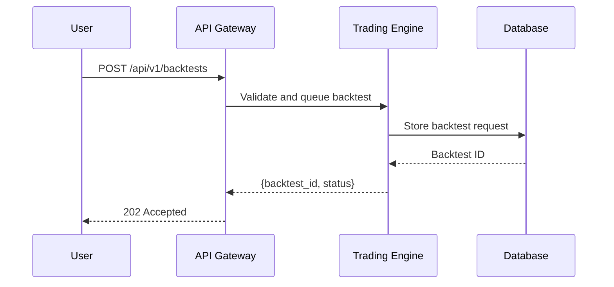
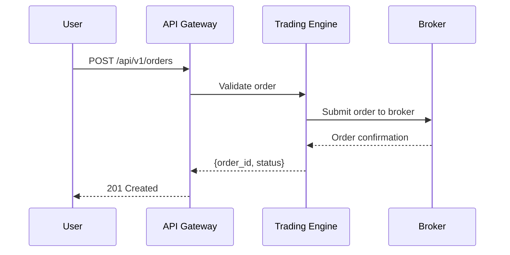
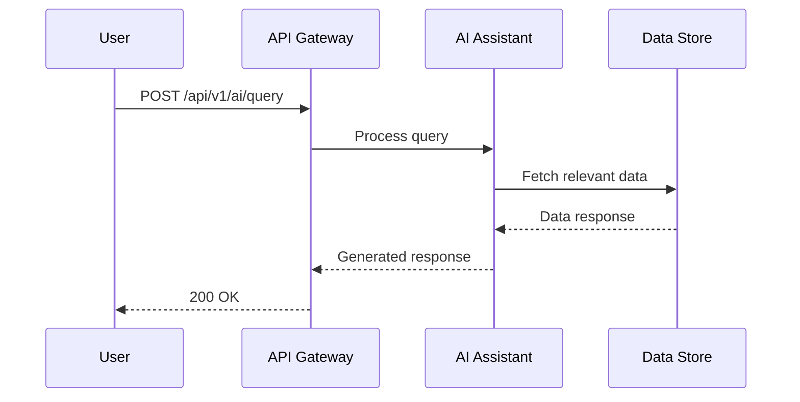

# API Documentation: Algorithmic Trading System (ATS)

## 1. Introduction

### 1.1 Purpose of the API
The Algorithmic Trading System (ATS) API enables developers to interact programmatically with a comprehensive trading platform. It provides access to features such as strategy management, backtesting, live trading, market data retrieval, AI-driven assistance, analytics, and security controls. Built with FastAPI for RESTful interactions and supplemented with gRPC for low-latency operations, this API serves both novice traders using the no-code interface and professional developers integrating custom solutions.

### 1.2 Overview of ATS Components
The ATS is a modular system with the following key components:
- **Core Trading Engine**: Manages trading strategies, backtesting, and real-time order execution.
- **Data Pipelines**: Processes and stores real-time and historical market data.
- **AI Assistant**: Offers natural language processing, code generation, and debugging capabilities.
- **Analytics**: Provides machine learning predictions and portfolio optimization tools.
- **User Interface Support**: Supplies data for dashboards and the no-code strategy builder.
- **Security and Compliance**: Ensures secure access, role-based permissions, and audit logging.

This documentation outlines the API endpoints, request/response formats, authentication mechanisms, and error handling procedures.

---

## 2. Authentication

### 2.1 Overview
All API endpoints require authentication via OAuth2 with JSON Web Tokens (JWT). Tokens must be included in the `Authorization` header of each request.

### 2.2 Token Generation
#### Endpoint: Generate Access Token
**Description**: Authenticates a user and returns an access token.  
**HTTP Method**: POST  
**Path**: `/auth/login`  
**Authentication**: Not Required  

**Request Body**:
```json
{
  "username": "string",
  "password": "string"
}
```

**Response**:
- **Success (200)**:
  ```json
  {
    "access_token": "string",
    "token_type": "bearer",
    "expires_in": 3600
  }
  ```
- **Error (401)**:
  ```json
  {
    "error": "Invalid credentials"
  }
  ```

**Example**:
```bash
curl -X POST '/auth/login' \
-H 'Content-Type: application/json' \
-d '{"username": "user@example.com", "password": "securepassword"}'
```

### 2.3 Token Refresh
#### Endpoint: Refresh Access Token
**Description**: Refreshes an expired access token using a refresh token.  
**HTTP Method**: POST  
**Path**: `/auth/refresh`  
**Authentication**: Required  

**Request Header**:
```
Authorization: Bearer <refresh_token>
```

**Response**:
- **Success (200)**:
  ```json
  {
    "access_token": "string",
    "token_type": "bearer",
    "expires_in": 3600
  }
  ```
- **Error (401)**:
  ```json
  {
    "error": "Invalid refresh token"
  }
  ```

**Example**:
```bash
curl -X POST '/auth/refresh' \
-H 'Authorization: Bearer <refresh_token>'
```

---

## 3. Core Trading Engine API

### 3.1 Strategy Management

#### 3.1.1 Create Strategy
**Description**: Creates a new trading strategy with user-defined code and parameters.  
**HTTP Method**: POST  
**Path**: `/api/v1/strategies`  
**Authentication**: Required  

**Request Body**:
```json
{
  "name": "string",
  "description": "string",
  "code": "string",  // Python code defining the strategy logic
  "parameters": {
    "param1": "value1",
    "param2": "value2"
  }
}
```

**Response**:
- **Success (201)**:
  ```json
  {
    "strategy_id": "uuid",
    "name": "string",
    "created_at": "timestamp",
    "status": "active"
  }
  ```
- **Error (400)**:
  ```json
  {
    "error": "Invalid strategy code syntax"
  }
  ```

**Example**:
```bash
curl -X POST '/api/v1/strategies' \
-H 'Authorization: Bearer <token>' \
-H 'Content-Type: application/json' \
-d '{"name": "MACD Strategy", "description": "MACD crossover strategy", "code": "def run(data): pass", "parameters": {"fast_period": 12, "slow_period": 26}}'
```

#### 3.1.2 List Strategies
**Description**: Retrieves a paginated list of strategies owned by the authenticated user.  
**HTTP Method**: GET  
**Path**: `/api/v1/strategies`  
**Authentication**: Required  

**Query Parameters**:
- `page`: integer (default: 1)
- `per_page`: integer (default: 20)

**Response**:
- **Success (200)**:
  ```json
  {
    "strategies": [
      {
        "strategy_id": "uuid",
        "name": "string",
        "created_at": "timestamp",
        "status": "active"
      }
    ],
    "total": integer,
    "page": integer,
    "per_page": integer
  }
  ```

**Example**:
```bash
curl -X GET '/api/v1/strategies?page=1&per_page=10' \
-H 'Authorization: Bearer <token>'
```

### 3.2 Backtesting

#### 3.2.1 Run Backtest
**Description**: Initiates a backtest for a specified strategy over a historical period.  
**HTTP Method**: POST  
**Path**: `/api/v1/backtests`  
**Authentication**: Required  

**Request Body**:
```json
{
  "strategy_id": "uuid",
  "start_date": "YYYY-MM-DD",
  "end_date": "YYYY-MM-DD",
  "initial_capital": float,
  "benchmark": "string"  // Optional, e.g., "SP500"
}
```

**Response**:
- **Success (202)**:
  ```json
  {
    "backtest_id": "uuid",
    "status": "queued",
    "submitted_at": "timestamp"
  }
  ```
- **Error (404)**:
  ```json
  {
    "error": "Strategy not found"
  }
  ```

**Example**:
```bash
curl -X POST '/api/v1/backtests' \
-H 'Authorization: Bearer <token>' \
-H 'Content-Type: application/json' \
-d '{"strategy_id": "123e4567-e89b-12d3-a456-426614174000", "start_date": "2023-01-01", "end_date": "2023-12-31", "initial_capital": 10000}'
```

**Diagram**:


#### 3.2.2 Get Backtest Results
**Description**: Retrieves the results of a completed backtest.  
**HTTP Method**: GET  
**Path**: `/api/v1/backtests/{backtest_id}`  
**Authentication**: Required  

**Path Parameters**:
- `backtest_id`: uuid

**Response**:
- **Success (200)**:
  ```json
  {
    "backtest_id": "uuid",
    "status": "completed",
    "results": {
      "profit_loss": float,
      "sharpe_ratio": float,
      "max_drawdown": float,
      "returns": [
        {"date": "YYYY-MM-DD", "value": float}
      ]
    },
    "completed_at": "timestamp"
  }
  ```
- **Error (404)**:
  ```json
  {
    "error": "Backtest not found"
  }
  ```

**Example**:
```bash
curl -X GET '/api/v1/backtests/123e4567-e89b-12d3-a456-426614174000' \
-H 'Authorization: Bearer <token>'
```

### 3.3 Live Trading

#### 3.3.1 Place Order
**Description**: Places a live trading order based on a strategy or manual input.  
**HTTP Method**: POST  
**Path**: `/api/v1/orders`  
**Authentication**: Required  

**Request Body**:
```json
{
  "strategy_id": "uuid",  // Optional if manual
  "asset": "string",
  "quantity": float,
  "order_type": "market|limit",
  "price": float,  // Required for limit orders
  "side": "buy|sell"
}
```

**Response**:
- **Success (201)**:
  ```json
  {
    "order_id": "uuid",
    "status": "placed",
    "timestamp": "timestamp"
  }
  ```
- **Error (400)**:
  ```json
  {
    "error": "Insufficient funds"
  }
  ```

**Example**:
```bash
curl -X POST '/api/v1/orders' \
-H 'Authorization: Bearer <token>' \
-H 'Content-Type: application/json' \
-d '{"asset": "AAPL", "quantity": 10, "order_type": "market", "side": "buy"}'
```

**Diagram**:


#### 3.3.2 Get Portfolio Status
**Description**: Retrieves the current portfolio status, including cash and positions.  
**HTTP Method**: GET  
**Path**: `/api/v1/portfolio`  
**Authentication**: Required  

**Response**:
- **Success (200)**:
  ```json
  {
    "cash": float,
    "positions": [
      {
        "asset": "string",
        "quantity": float,
        "value": float,
        "unrealized_pnl": float
      }
    ],
    "total_value": float,
    "updated_at": "timestamp"
  }
  ```

**Example**:
```bash
curl -X GET '/api/v1/portfolio' \
-H 'Authorization: Bearer <token>'
```

---

## 4. Data Pipelines API

### 4.1 Market Data Ingestion
**Description**: Initiates ingestion of market data for a specified asset (admin only).  
**HTTP Method**: POST  
**Path**: `/api/v1/data/ingest`  
**Authentication**: Required (Admin role)  

**Request Body**:
```json
{
  "asset": "string",
  "source": "string",  // e.g., "Yahoo Finance", "Alpha Vantage"
  "interval": "1m|5m|1h|1d"
}
```

**Response**:
- **Success (202)**:
  ```json
  {
    "message": "Ingestion queued",
    "job_id": "uuid"
  }
  ```
- **Error (403)**:
  ```json
  {
    "error": "Insufficient permissions"
  }
  ```

**Example**:
```bash
curl -X POST '/api/v1/data/ingest' \
-H 'Authorization: Bearer <token>' \
-H 'Content-Type: application/json' \
-d '{"asset": "BTC/USD", "source": "Binance", "interval": "1h"}'
```

### 4.2 Historical Data Retrieval
**Description**: Retrieves historical market data for an asset.  
**HTTP Method**: GET  
**Path**: `/api/v1/data/historical/{asset}`  
**Authentication**: Required  

**Path Parameters**:
- `asset`: string

**Query Parameters**:
- `start_date`: string (YYYY-MM-DD)
- `end_date`: string (YYYY-MM-DD)
- `interval`: string (default: "1d")

**Response**:
- **Success (200)**:
  ```json
  {
    "asset": "string",
    "interval": "string",
    "data": [
      {
        "timestamp": "timestamp",
        "open": float,
        "high": float,
        "low": float,
        "close": float,
        "volume": integer
      }
    ]
  }
  ```

**Example**:
```bash
curl -X GET '/api/v1/data/historical/AAPL?start_date=2023-01-01&end_date=2023-12-31' \
-H 'Authorization: Bearer <token>'
```

---

## 5. AI Assistant API

### 5.1 Submit Natural Language Query
**Description**: Submits a query to the AI assistant for analysis or advice.  
**HTTP Method**: POST  
**Path**: `/api/v1/ai/query`  
**Authentication**: Required  

**Request Body**:
```json
{
  "query": "string"  // e.g., "Should I invest in TSLA today?"
}
```

**Response**:
- **Success (200)**:
  ```json
  {
    "response": "string",
    "confidence": float  // 0.0 to 1.0
  }
  ```
- **Error (400)**:
  ```json
  {
    "error": "Query too vague"
  }
  ```

**Example**:
```bash
curl -X POST '/api/v1/ai/query' \
-H 'Authorization: Bearer <token>' \
-H 'Content-Type: application/json' \
-d '{"query": "Should I invest in TSLA today?"}'
```

**Diagram**:


### 5.2 Generate Strategy Code
**Description**: Requests Python code generation for a trading strategy.  
**HTTP Method**: POST  
**Path**: `/api/v1/ai/generate_code`  
**Authentication**: Required  

**Request Body**:
```json
{
  "description": "string"  // e.g., "Buy when 50-day SMA crosses above 200-day SMA"
}
```

**Response**:
- **Success (200)**:
  ```json
  {
    "code": "string",  // Python code
    "explanation": "string"
  }
  ```

**Example**:
```bash
curl -X POST '/api/v1/ai/generate_code' \
-H 'Authorization: Bearer <token>' \
-H 'Content-Type: application/json' \
-d '{"description": "Buy when 50-day SMA crosses above 200-day SMA"}'
```

---

## 6. Analytics API

### 6.1 Run ML Prediction
**Description**: Generates a price prediction for an asset using a specified model.  
**HTTP Method**: POST  
**Path**: `/api/v1/analytics/predict`  
**Authentication**: Required  

**Request Body**:
```json
{
  "asset": "string",
  "model": "string",  // e.g., "LSTM", "ARIMA"
  "horizon": integer  // Prediction period in days
}
```

**Response**:
- **Success (200)**:
  ```json
  {
    "asset": "string",
    "prediction": float,
    "confidence_interval": [float, float]
  }
  ```

**Example**:
```bash
curl -X POST '/api/v1/analytics/predict' \
-H 'Authorization: Bearer <token>' \
-H 'Content-Type: application/json' \
-d '{"asset": "ETH/USD", "model": "LSTM", "horizon": 7}'
```

---

## 7. User Interface API

### 7.1 Get Dashboard Data
**Description**: Retrieves data for the user dashboard.  
**HTTP Method**: GET  
**Path**: `/api/v1/ui/dashboard`  
**Authentication**: Required  

**Response**:
- **Success (200)**:
  ```json
  {
    "portfolio_value": float,
    "recent_trades": [
      {
        "order_id": "uuid",
        "asset": "string",
        "quantity": float,
        "price": float
      }
    ],
    "performance": {
      "daily_pnl": float,
      "monthly_pnl": float
    }
  }
  ```

**Example**:
```bash
curl -X GET '/api/v1/ui/dashboard' \
-H 'Authorization: Bearer <token>'
```

---

## 8. Security and Compliance API

### 8.1 Retrieve Audit Logs
**Description**: Fetches audit logs for monitoring and compliance (admin only).  
**HTTP Method**: GET  
**Path**: `/api/v1/security/audit_logs`  
**Authentication**: Required (Admin role)  

**Query Parameters**:
- `start_date`: string (YYYY-MM-DD)
- `end_date`: string (YYYY-MM-DD)
- `user_id`: uuid (optional)

**Response**:
- **Success (200)**:
  ```json
  {
    "logs": [
      {
        "timestamp": "timestamp",
        "user_id": "uuid",
        "action": "string",
        "details": "string"
      }
    ]
  }
  ```

**Example**:
```bash
curl -X GET '/api/v1/security/audit_logs?start_date=2023-01-01&end_date=2023-12-31' \
-H 'Authorization: Bearer <token>'
```

---

## 9. Error Handling

### 9.1 Standard Error Response Format
```json
{
  "error": "string",
  "details": "string",  // Optional
  "timestamp": "timestamp"
}
```

### 9.2 Common Error Codes
- **400 Bad Request**: Invalid or missing parameters.
- **401 Unauthorized**: Missing or invalid token.
- **403 Forbidden**: Insufficient permissions.
- **404 Not Found**: Resource not found.
- **429 Too Many Requests**: Rate limit exceeded.
- **500 Internal Server Error**: System failure.

### 9.3 Rate Limiting
- **Limit**: 100 requests per minute per user.
- **Header**: `X-Rate-Limit-Remaining` indicates remaining requests.

---

## 10. Appendices

### 10.1 Glossary
- **Backtest**: Simulation of a trading strategy using historical data.
- **JWT**: JSON Web Token used for authentication.
- **Strategy**: A codified set of trading rules.

### 10.2 References
- FastAPI Swagger UI: Accessible at `/docs` when running the server.
- OAuth2 Specification: [https://oauth.net/2/](https://oauth.net/2/)