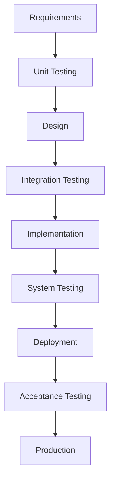
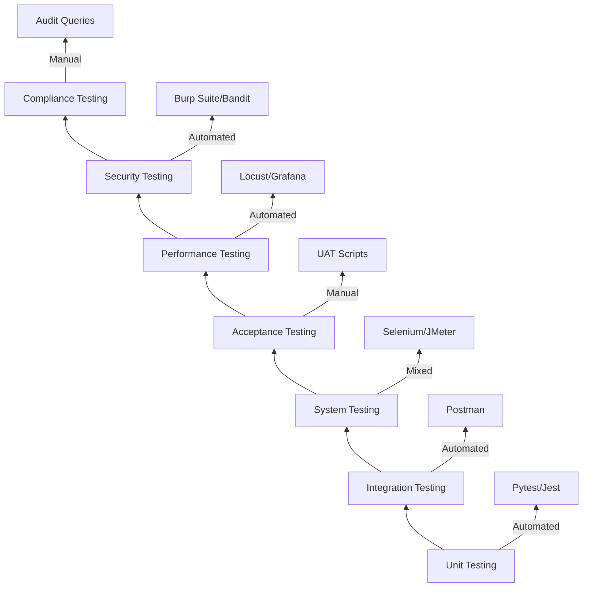
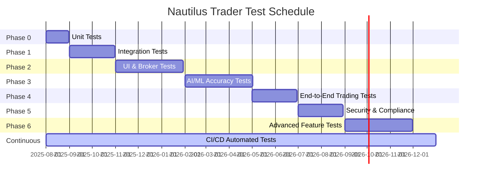
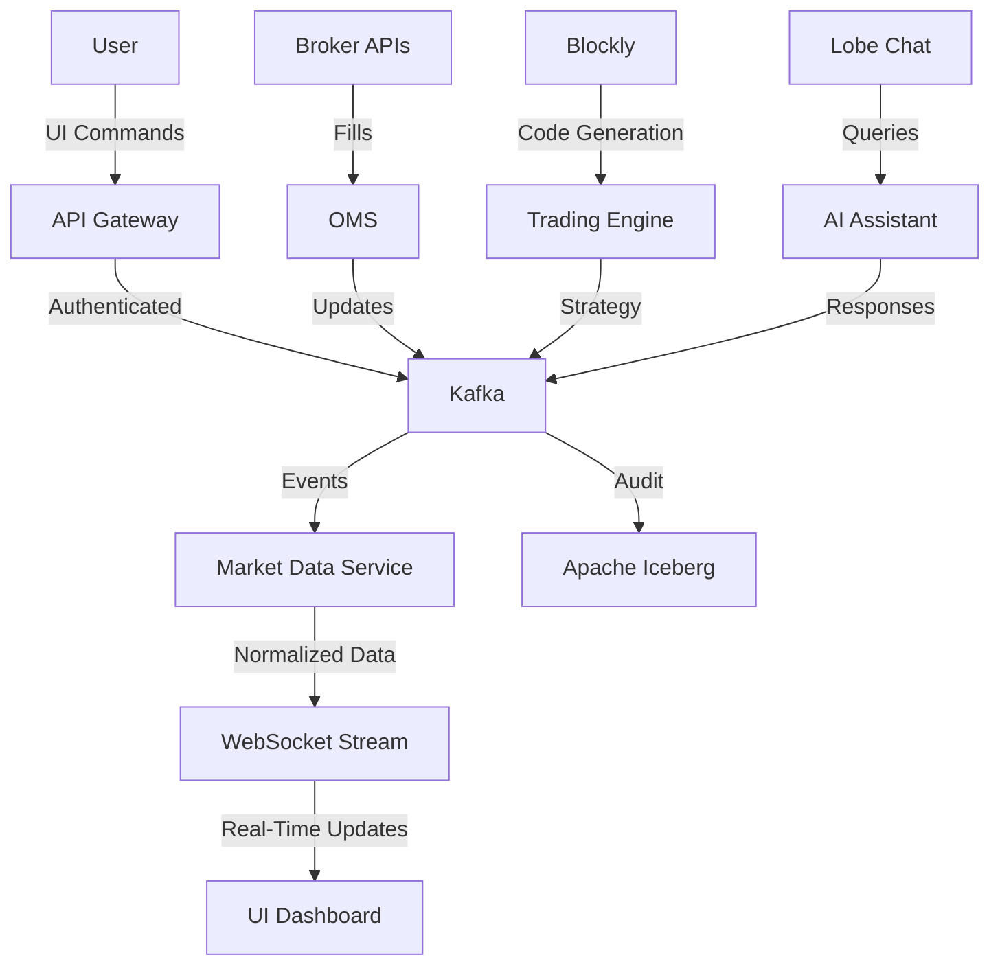
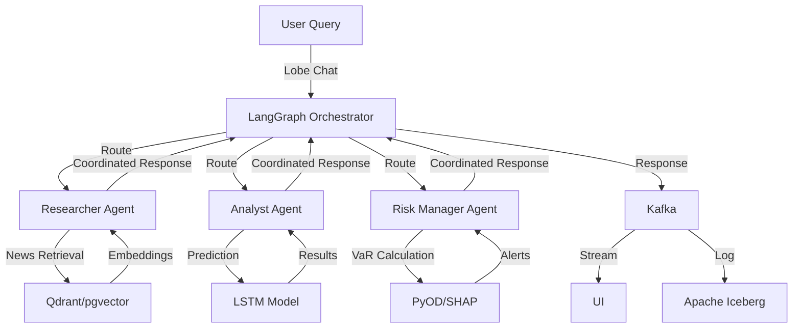
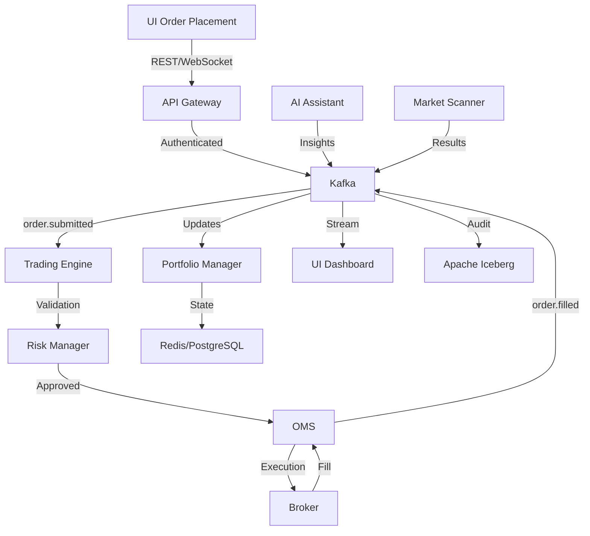
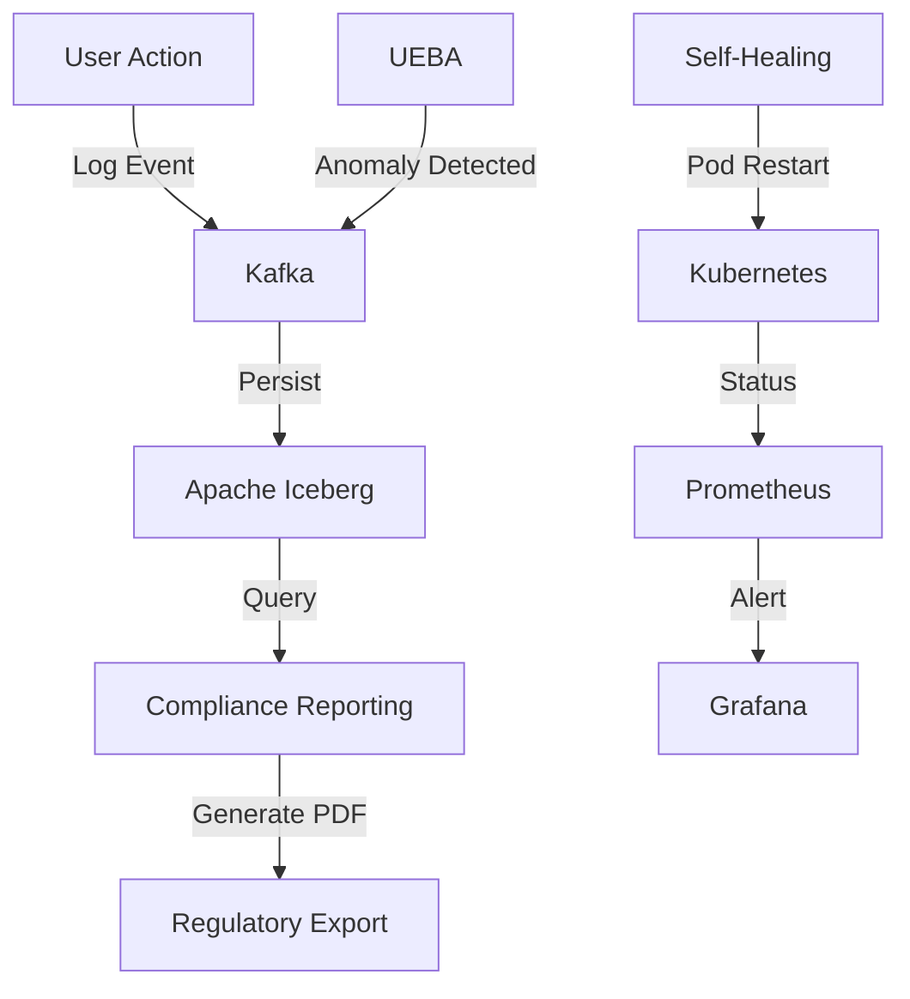
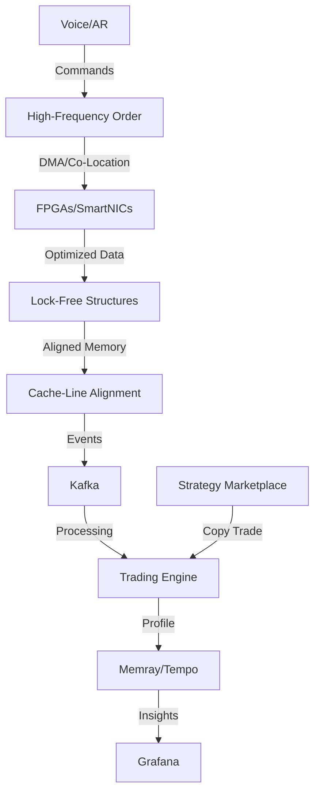

## **Comprehensive Test Plan and Test Cases**

### **Nautilus Trader: Enterprise Algorithmic Trading System**

| **Version:**      | 3.0                                                           |
|:----------------- |:------------------------------------------------------------- |
| **Date:**         | August 21, 2025                                              |
| **Status:**       | Draft                                                        |
| **Author:**       | Vincent Pereira                                              |
| **Prepared For:** | Nautilus Trader QA Team, Development Team, Project Management |

---

## **Part 1: Master Test Plan**

### **1.0 Introduction**

#### **1.1 Purpose**

This Comprehensive Test Plan outlines a structured and exhaustive testing strategy for the Nautilus Trader Algorithmic Trading System (ATS). The purpose is to verify that the system meets all functional, non-functional, performance, security, and compliance requirements specified in the project documentation, including the updated "Features, Phases & Integration Strategy - Algorithmic Trading System" document. Testing will ensure the platform is robust, scalable, and reliable, with zero critical defects before production deployment. This plan covers all phases of testing, from unit tests to user acceptance testing (UAT), and includes traceability to requirements for complete coverage.

#### **1.2 Scope of Testing**

##### **In-Scope**

The testing scope encompasses all features, tasks, and sub-tasks from the updated "Features, Phases & Integration Strategy - Algorithmic Trading System" document. This includes, but is not limited to:

- **Core Trading Functionality:**
  - NautilusTrader Engine (event-driven backtesting and live trading across all asset classes: stocks, ETFs, futures, options, forex, commodities, cryptocurrencies).
  - Order Management System (OMS): All order types (Market, Limit, Stop, Stop-Limit, TWAP, VWAP, Iceberg) with smart order routing.
  - Broker Integration: Interactive Brokers (paper/live toggle), Alpaca, OANDA, Coinbase, FIX Protocol (QuickFIX/J, FIX8).
  - Custom Volume-Weighted Indicators: VW SMA/EMA/MACD/MFI (various periods), Normalized ATR (21/8 Day), Rupee/Dollar Volatility, Contract Risk, Choppy Market Index, Buy/Sell Easier Day, etc., using TA-Lib/ta-lib-python and Bukosabino/ta.

- **User Interfaces (UI/UX):**
  - Multi-platform support: Web (Next.js/React 18), Mobile (React Native), Desktop (Electron), PWA.
  - Real-Time Trading Dashboard: Portfolio value, P&L, positions, market data (TradingView/react-financial-charts/Plotly Dash).
  - No-Code Strategy Builder: Blockly for visual strategy creation with code generation.
  - Python Studio: JupyterHub for advanced strategy development with AI-assisted debugging (OpenHands, Goose).
  - Glass Box UI: Visualizes Kafka event chains for trades and strategies.
  - Market Scanner UI: High-performance grid for real-time scanning results.
  - Voice Trading: Natural language commands for order placement.
  - AR Interfaces: Immersive 3D visualizations of portfolio and market data.

- **Agentic AI Assistant:**
  - Conversational Interface: Lobe Chat for natural language queries, trading, research, and analysis.
  - Multi-Agent Coordination: LangGraph/TradingAgents for Analyst, Researcher, Risk Manager, Compliance, and Trader agents.
  - Retrieval-Augmented Generation (RAG): RAGFlow for document analysis (e.g., SEC filings) with embeddings in Qdrant/pgvector.
  - Proactive RAG Intelligence: Researcher agent monitors news/social media for real-time updates.
  - AI Knowledge Hub: Archon for ingesting documentation of Tier 1 components (NautilusTrader, Kafka).
  - AI-Assisted Code Generation: OpenHands for Python code generation, refactoring, debugging, and test coverage.
  - Iterative Strategy Refinement: AI feedback loop with FinRL and Optuna for autonomous optimization.
  - Sentiment Analysis Pipeline: Transformers/PyTorch for news/social media analysis (>85% accuracy).

- **Portfolio & Risk Management:**
  - Real-Time Risk Dashboard: VaR, expected shortfall, exposure limits, circuit breakers.
  - Portfolio Optimization: PyPortfolioOpt/Riskfolio-Lib for mean-variance, hierarchical risk parity, rebalancing, and performance attribution.
  - Anomaly Detection: PyOD for irregularities in trading patterns/system performance (<5% false positives).
  - Stress Testing: Simulation of adverse market scenarios.
  - Pre-Trade Risk Checks: Integration with custom VW indicators.

- **Advanced Analytics:**
  - Predictive Modeling: Stock-Prediction-Models, LSTM-Neural-Network-for-Time-Series-Prediction, Real-time-stock-market-prediction (>90% accuracy).
  - Reinforcement Learning: FinRL/TradingGym with RLOps for DRL strategies.
  - Explainable AI: SHAP for model explanations (>80% scores).
  - Options Analytics: QuantLib for pricing, implied volatility surfaces, dividend forecasts.
  - Market Microstructure Analysis: Real-time order book analytics, liquidity detection, market impact estimation.

- **Market Data & Scanner:**
  - Multi-Source Ingestion: Yahoo Finance (primary), Alpha Vantage, Finnhub, Investing.com, CME Group, Twelve Data, Polygon, Barchart, SpiderRock, TradingCharts, Oanda (fallbacks).
  - Historical Data: >5 years for options chains.
  - Market Scanner: Real-time scanning with custom filters and TA-Lib indicators.

- **Broker Integration & Order Management:**
  - Unified Abstraction Layer: Normalizes data across brokers.
  - Paper/Live Toggle: Seamless switching in UI.
  - Smart Order Router: Optimizes execution with TWAP, VWAP, Iceberg.

- **Enterprise Features:**
  - Zero-Trust Security: RBAC, MFA, encryption (AES-256 at rest, TLS 1.3 in transit), SAST (Bandit), UEBA for threat detection.
  - Immutable Audit Trails: Apache Iceberg for all actions and trades.
  - High Availability: Multi-AZ/multi-region failover, self-healing microservices.
  - Observability: Prometheus/Grafana for metrics, Jaeger/Tempo for tracing, Grafana Loki/ELK for logs, Memray for memory profiling.
  - Feature Flags & Kill Switches: Unleash for dynamic toggling.
  - Compliance Reporting: Automated reports for MiFID II, SOX, GDPR.
  - Ultra-Low Latency Infrastructure: DMA, co-location, FPGAs/SmartNICs.
  - Strategy Marketplace: Sharing, copy trading, and community features.
  - Customer Service Bot: RAG-based automated support.

- **Infrastructure & Advanced Capabilities:**
  - Event-Driven Architecture: Kafka hierarchical topics.
  - Cloud-Native Deployment: Docker/Kubernetes/Helm with GitOps CI/CD.
  - Performance Optimization: Lock-free data structures, cache-line alignment.

##### **Out-of-Scope**

- Testing of third-party systems beyond integration points (e.g., internal broker functionality).
- Live production testing with real money (use paper trading).
- Proprietary hardware testing (e.g., FPGA implementation).
- Non-technical business processes (e.g., marketing workflows).

#### **1.3 Project References**

This Test Plan is derived from and traceable to the following documents:

1. Business Requirements Document (BRD) - Version 3.0
2. Product Requirements Document (PRD) - Version 3.0
3. Functional Specification Document (FSD) - Version 3.0
4. Technical Specification Document (TSD) - Version 3.0
5. System Design Document (SDD) - Version 3.0
6. Features, Phases & Integration Strategy - Algorithmic Trading System
7. Comprehensive System Architecture
8. Detailed Design Specifications
9. Full Phased Implementation Tasks

#### **1.4 Test Objectives**

- Verify that the system meets all requirements with 100% coverage for critical features.
- Ensure system performance (<1ms trading latency, <100µs data processing).
- Validate security and compliance (zero-trust, audit trails, UEBA).
- Detect and mitigate defects early in the development lifecycle.
- Achieve >95% test automation for repeatable testing.

#### **1.5 Testing Approach**

Testing is phased to align with the six-phase development roadmap, using a V-model for verification and validation. The approach includes automated and manual testing, with emphasis on API testing (Postman, JMeter), UI testing (Selenium, Appium), and performance testing (Locust).

**Mermaid Diagram: Testing Approach V-Model**



- **Automated Testing:** 80% of tests automated (unit, integration, API).
- **Manual Testing:** UI/UX, exploratory testing for AI interactions.
- **Tools:** Pytest (unit), Postman (API), Selenium/Appium (UI), JMeter/Locust (performance), Burp Suite (security).

### **2.0 Testing Strategy**

#### **2.1 Levels of Testing**

The testing strategy employs a multi-layered approach to ensure quality at every stage.

- **Level 1: Unit Testing:**
  - **Objective:** Test individual functions, methods, and components in isolation (e.g., VW MACD indicator logic).
  - **Responsibility:** Developers.
  - **Tools:** Pytest for Python backend, Jest/React Testing Library for frontend.
  - **Coverage:** >90% code coverage, including edge cases.

- **Level 2: Integration Testing:**
  - **Objective:** Verify interactions between microservices (e.g., Trading Engine to OMS via Kafka).
  - **Responsibility:** Developers/DevOps.
  - **Tools:** Pytest with mocks, Postman for API integration.
  - **Focus:** Kafka event flows, database interactions, broker APIs.

- **Level 3: System Testing:**
  - **Objective:** Test end-to-end workflows (e.g., strategy creation to live trading).
  - **Responsibility:** QA Team.
  - **Tools:** Selenium/Appium for UI, JMeter for load testing.
  - **Focus:** Functional flows, performance under load.

- **Level 4: Acceptance Testing (UAT):**
  - **Objective:** Validate against business requirements (e.g., user personas for retail/quant workflows).
  - **Responsibility:** Stakeholders/QA.
  - **Tools:** Manual scripting, Postman for API UAT.

- **Level 5: Performance Testing:**
  - **Objective:** Ensure <1ms trading latency, >10,000 concurrent users.
  - **Responsibility:** Performance Engineers.
  - **Tools:** JMeter/Locust, Grafana for metrics.

- **Level 6: Security Testing:**
  - **Objective:** Validate zero-trust model, RBAC, UEBA, encryption.
  - **Responsibility:** Security Team.
  - **Tools:** Burp Suite, Bandit (SAST), OWASP ZAP (DAST).

- **Level 7: Compliance Testing:**
  - **Objective:** Verify audit trails, reporting for MiFID II/SOX/GDPR.
  - **Responsibility:** Compliance Officer.
  - **Tools:** Manual audits, SQL queries on Apache Iceberg.

**Mermaid Diagram: Testing Levels Hierarchy**



#### **2.2 Test Environment**

- **Development Environment:** Local Docker Compose with minikube for unit/integration tests.
- **Staging Environment:** Kubernetes cluster mimicking production (multi-AZ, mock brokers).
- **Production Environment:** Multi-region Kubernetes with real brokers and data providers.
- **Test Data:** Synthetic market data for backtesting, anonymized user data for compliance.

**Technical Details:** Environments use Helm charts for consistent deployments, with Vault for secrets and Unleash for feature flags.

#### **2.3 Test Schedule**

Testing is integrated into the six-phase roadmap, with continuous testing via CI/CD.

- **Phase 0 (Dependency Management):** Unit tests for dependency management scripts.
- **Phase 1 (Core System Hardening):** Integration tests for Trading Engine, databases.
- **Phase 2 (Frontend & Broker Integration):** UI tests, broker API integration.
- **Phase 3 (AI/ML Integration):** AI model accuracy tests (>90% for predictions).
- **Phase 4 (Frontend & Live Trading):** End-to-end live trading tests (paper mode).
- **Phase 5 (Enterprise Readiness):** Security, performance, and compliance tests.
- **Phase 6 (System Enhancement):** Tests for voice trading, AR, Marketplace.

**Mermaid Gantt Chart: Test Schedule**



#### **2.4 Resources**

- **QA Team:** 5 full-time testers, 2 automation engineers.
- **Tools:** Pytest, Selenium, JMeter, Burp Suite, Postman, Locust, Appium.
- **Test Data Generators:** Synthetic data for market feeds, Faker for user data.
- **Budget:** Allocated for cloud resources (AWS/GCP) during load testing.

#### **2.5 Risks and Mitigation**

- **Risk: Integration Delays with Brokers**
  - **Mitigation:** Use mock brokers in early phases; conduct parallel testing with real APIs.
- **Risk: AI Model Inaccuracy**
  - **Mitigation:** Validate models with >90% accuracy thresholds; use SHAP for explainability.
- **Risk: Performance Bottlenecks**
  - **Mitigation:** Early load testing with Locust; optimize with Memray profiling.
- **Risk: Security Vulnerabilities**
  - **Mitigation:** Integrate Bandit SAST in CI; conduct penetration testing.
- **Risk: Data Loss in Backtesting**
  - **Mitigation:** Use Apache Iceberg for immutable storage; ensure RPO <15 minutes.

**Mermaid Diagram: Risk Mitigation Matrix**

```mermaid
matrix
    title Risk Mitigation Matrix
    x axis: Low Probability --> High Probability
    y axis: Low Impact --> High Impact
    quadrant 1: High Probability, Low Impact
    quadrant 2: High Probability, High Impact
    quadrant 3: Low Probability, Low Impact
    quadrant 4: Low Probability, High Impact
    Integration Delays: x=0.8, y=0.7
    AI Inaccuracy: x=0.6, y=0.9
    Performance Bottlenecks: x=0.7, y=0.8
    Security Vulnerabilities: x=0.5, y=0.95
    Data Loss: x=0.4, y=0.95
```

---

## **Part 2: Detailed Test Cases by Phase**

Test cases are organized by the six phases, covering all tasks and sub-tasks. Each scenario includes ID, Objective, Requirement, Preconditions, Steps, Expected Results, and Technical Details.

### **Phase 0: Dependency Management Setup - Testing**

**Objective:** Verify the foundational framework for managing 60+ open-source components, including automated monitoring, notifications, and testing.

#### **Test Scenario 0.1: Dependency Monitoring and Health Dashboard**

- **Test Case 0.1.1: Dependency Update Notification**
  - **ID:** TC-DEP-001
  - **Requirement:** Phase 0 Task: Automated dependency monitoring.
  - **Preconditions:** Dependency management system deployed; Renovate bot configured on GitHub.
  - **Test Steps:**
    1. Simulate an update to a core dependency (e.g., NautilusTrader) in the upstream repository.
    2. Trigger Renovate scan.
    3. Check for PR creation in the repository.
  - **Expected Results:**
    1. Renovate creates a PR with the update.
    2. PR includes changelog, compatibility notes, and automated tests.
    3. Health dashboard shows updated status (e.g., "Pending Review").
  - **Technical Details:** Use GitHub API to verify PR; dashboard built with Grafana, querying Renovate logs.

- **Test Case 0.1.2: Security Vulnerability Notification**
  - **ID:** TC-DEP-002
  - **Requirement:** Phase 0 Task: Security monitoring for dependencies.
  - **Preconditions:** Dependabot or Snyk configured; simulate a vulnerability in a dependency (e.g., LangChain).
  - **Test Steps:**
    1. Trigger vulnerability scan.
    2. Check for alert in Slack/Email.
    3. Verify PR for patch.
  - **Expected Results:**
    1. Alert sent with CVE details and severity.
    2. PR created with patched version.
    3. Health dashboard flags dependency as "Vulnerable" until resolved.
  - **Technical Details:** Use Dependabot alerts; integrate with Prometheus for dashboard metrics.

- **Test Case 0.1.3: Tiered Dependency Testing**
  - **ID:** TC-DEP-003
  - **Requirement:** Phase 0 Task: Tiered dependency management (Tier 1: NautilusTrader, LangGraph; Tier 2: PyPortfolioOpt; Tier 3: Lobe Chat).
  - **Preconditions:** Forked repositories for Tier 1 dependencies; CI pipeline configured.
  - **Test Steps:**
    1. Make a change in a Tier 1 forked repo (e.g., NautilusTrader).
    2. Run CI tests (unit, integration).
    3. Merge and verify system-wide impact.
  - **Expected Results:**
    1. Tests pass with >90% coverage.
    2. No breaking changes in dependent services.
    3. Dashboard shows "Healthy" for all tiers.
  - **Technical Details:** Pytest for unit tests; GitHub Actions for CI; coverage reports in Grafana.

**Mermaid Diagram: Phase 0 Dependency Flow**

```mermaid
graph TD
    A[Upstream Repo (NautilusTrader)] -->|Update| B[Renovate Scan]
    B -->|PR Created| C[GitHub Repo]
    C -->|Merge| D[CI Pipeline]
    D -->|Tests Pass| E[Health Dashboard]
    E -->|Alert| F[Slack/Email]
    D -->|Vulnerability| G[Security Scan (Bandit)]
    G -->|Fix PR| C
```

### **Phase 1: Core System Validation & Hardening - Testing**

**Objective:** Stabilize the core trading engine, database connections, API layer, and foundational security, including zero-trust architecture and threat modeling.

#### **Test Scenario 1.1: Trading Engine Backtesting**

- **Test Case 1.1.1: Event-Driven Backtest Execution**
  - **ID:** TC-TE-001
  - **Requirement:** Phase 1 Task: Validate NautilusTrader engine for backtesting.
  - **Preconditions:** Historical data (>5 years) loaded in ClickHouse; strategy code in PostgreSQL.
  - **Test Steps:**
    1. Submit backtest request for a VW MACD strategy on AAPL.
    2. Verify event processing (ticks ingested from Kafka).
    3. Check simulation for slippage, fees, and latency.
  - **Expected Results:**
    1. Backtest completes with metrics (Sharpe Ratio, drawdown) stored in ClickHouse.
    2. Events logged in Kafka (`backtest.event.*`).
    3. Latency <1ms for event processing.
  - **Technical Details:** Use Pytest with mock data; verify against expected P&L calculations.

- **Test Case 1.1.2: Multi-Asset Backtesting**
  - **ID:** TC-TE-002
  - **Requirement:** Phase 1 Task: Support for all asset classes in backtesting.
  - **Preconditions:** Data for stocks, forex, crypto loaded.
  - **Test Steps:**
    1. Run backtest on mixed portfolio (AAPL stock, EUR/USD forex, BTC/USD crypto).
    2. Verify asset-specific handling (e.g., forex pip calculations).
  - **Expected Results:**
    1. Backtest succeeds without errors.
    2. Portfolio metrics aggregated correctly.
  - **Technical Details:** Test with VectorBT for GPU acceleration; ensure <100ms for large datasets.

- **Test Case 1.1.3: Custom Indicator Integration**
  - **ID:** TC-TE-003
  - **Requirement:** Phase 1 Task: Integrate custom VW indicators (VW SMA/EMA/MACD/MFI, Normalized ATR, Choppy Market Index, etc.).
  - **Preconditions:** Indicators implemented in TA-Lib/ta-lib-python and Bukosabino/ta.
  - **Test Steps:**
    1. Load strategy using VW MACD (12, 26, 9 periods).
    2. Run backtest and verify indicator calculations.
  - **Expected Results:**
    1. Indicators compute correctly (e.g., VW MACD value matches manual calculation).
    2. Backtest incorporates indicators without errors.
  - **Technical Details:** Use NumPy for verification; test with various periods (e.g., 21/8 Day ATR).

- **Test Case 1.1.4: Database Connections**
  - **ID:** TC-DB-001
  - **Requirement:** Phase 1 Task: Validate connections to PostgreSQL/pgvector, ClickHouse, Qdrant, Apache Iceberg, DuckDB, Redis.
  - **Preconditions:** Databases deployed with sample data.
  - **Test Steps:**
    1. Query PostgreSQL for user metadata.
    2. Insert time-series data into ClickHouse.
    3. Store embeddings in Qdrant/pgvector.
    4. Log audit event in Apache Iceberg.
    5. Perform offline query in DuckDB.
    6. Cache session in Redis.
  - **Expected Results:**
    1. All operations succeed without connection errors.
    2. Data retrieval latency <10ms for Redis, <100ms for others.
  - **Technical Details:** Use SQLAlchemy for PostgreSQL, ClickHouse-driver for time-series; verify with Pytest.

- **Test Case 1.1.5: API Layer Validation**
  - **Requirement:** Phase 1 Task: Foundational REST/GraphQL/WebSocket APIs.
  - **ID:** TC-API-001
  - **Preconditions:** API Gateway (NGINX, Istio) deployed.
  - **Test Steps:**
    1. Send GET /health to check API status.
    2. Query GraphQL for system info.
    3. Subscribe to WebSocket for updates.
  - **Expected Results:**
    1. 200 OK responses; latency <10ms.
    2. WebSocket connects without errors.
  - **Technical Details:** Use Postman for REST/GraphQL; ws library for WebSocket; test with JWT authentication.

- **Test Case 1.1.6: Zero-Trust Security**
  - **ID:** TC-SEC-001
  - **Requirement:** Phase 1 Task: Implement zero-trust architecture with RBAC.
  - **Preconditions:** Keycloak deployed; users with roles (trader, quant, admin).
  - **Test Steps:**
    1. Login with trader role; attempt admin action.
    2. Verify mTLS between microservices.
  - **Expected Results:**
    1. Unauthorized actions return 403 Forbidden.
    2. All internal communications encrypted.
  - **Technical Details:** Use Burp Suite for interception; Keycloak for OAuth 2.0/OIDC.

- **Test Case 1.1.7: Threat Modeling**
  - **ID:** TC-SEC-002
  - **Requirement:** Phase 1 Task: Threat modeling with STRIDE.
  - **Preconditions:** STRIDE analysis conducted.
  - **Test Steps:**
    1. Simulate spoofing attack on API.
    2. Test for tampering in Kafka events.
  - **Expected Results:**
    1. Attacks detected and logged in Grafana Loki.
    2. System remains secure.
  - **Technical Details:** Use OWASP ZAP for automated threats; verify with Jaeger/Tempo traces.

- **Test Case 1.1.8: Market Data Fallback**
  - **ID:** TC-MD-001
  - **Requirement:** Phase 1 Task: Multi-source market data with fallbacks.
  - **Preconditions:** Primary (Yahoo Finance) and fallback (Alpha Vantage, Finnhub) configured.
  - **Test Steps:**
    1. Simulate failure of primary source.
    2. Verify data switches to fallback.
  - **Expected Results:**
    1. Data flow uninterrupted; latency <100µs.
    2. Alert logged for source failure.
  - **Technical Details:** Use mock APIs; test with Kafka throughput >1M messages/s.

**Mermaid Diagram: Phase 1 Data Flow**

```mermaid
graph TD
    A[Market Data Providers] -->|Real-Time Data| B[Market Data Service]
    B -->|Normalized Data| C[Kafka]
    C -->|Events| D[Trading Engine]
    D -->|Order Requests| E[OMS]
    E -->|Execution| F[Broker APIs]
    F -->|Fills| E
    E -->|Updates| C
    C -->|Portfolio Data| G[Portfolio Manager]
    G -->|Risk Metrics| H[Risk Manager]
    H -->|Alerts| C
    C -->|Audit Events| I[Apache Iceberg]
    J[UI/API] -->|Queries| K[API Gateway]
    K -->|Authenticated| C
    L[Databases] <--|Persistence| C
```

### **Phase 2: Frontend and Broker Integration - Testing**

**Objective:** Validate multi-platform UI, broker integrations, and real-time streaming, including Lobe Chat, Blockly, and paper/live toggle.

#### **Test Scenario 2.1: Multi-Platform UI Responsiveness**

- **Test Case 2.1.1: Web Dashboard Navigation**
  - **ID:** TC-UI-001
  - **Requirement:** Phase 2 Task: Responsive web interface with Next.js.
  - **Preconditions:** Web app deployed; user logged in.
  - **Test Steps:**
    1. Navigate to dashboard on Chrome (desktop) and Safari (mobile).
    2. Resize window to simulate mobile/tablet views.
    3. Verify layout adapts (e.g., collapsible menus).
  - **Expected Results:**
    1. No rendering errors; responsive design maintains usability.
    2. Load time <2s.
  - **Technical Details:** Use Selenium for automated UI tests; test across browsers (Chrome, Firefox, Safari, Edge).

- **Test Case 2.1.2: Mobile App Push Notifications**
  - **ID:** TC-UI-002
  - **Requirement:** Phase 2 Task: React Native app with biometric auth and notifications.
  - **Preconditions:** Mobile app installed on iOS/Android; push notifications enabled.
  - **Test Steps:**
    1. Trigger a trade fill event in staging.
    2. Verify notification received on device.
    3. Tap notification to open app.
  - **Expected Results:**
    1. Notification delivered within 5s.
    2. App opens to relevant screen (e.g., positions).
  - **Technical Details:** Use Appium for mobile testing; Firebase for push notifications.

- **Test Case 2.1.3: Desktop App Offline Analytics**
  - **ID:** TC-UI-003
  - **Requirement:** Phase 2 Task: Electron app with DuckDB for offline analytics.
  - **Preconditions:** Desktop app installed; historical data cached.
  - **Test Steps:**
    1. Disconnect internet.
    2. Run local backtest on cached data.
    3. Verify results displayed.
  - **Expected Results:**
    1. Backtest completes offline.
    2. Data integrity maintained.
  - **Technical Details:** Test with Electron's dev tools; DuckDB for in-memory queries.

- **Test Case 2.1.4: PWA Installation**
  - **ID:** TC-UI-004
  - **Requirement:** Phase 2 Task: PWA for cross-device access.
  - **Preconditions:** PWA deployed; browser supports PWA (Chrome/Edge).
  - **Test Steps:**
    1. Visit web app; install PWA via browser prompt.
    2. Launch PWA offline; access cached dashboard.
  - **Expected Results:**
    1. PWA installs successfully.
    2. Offline functionality for basic views.
  - **Technical Details:** Use Lighthouse for PWA audits.

#### **Test Scenario 2.2: Broker Integration**

- **Test Case 2.2.1: Interactive Brokers Paper/Live Toggle**
  - **ID:** TC-BR-001
  - **Requirement:** Phase 2 Task: IBKR integration with toggle.
  - **Preconditions:** IBKR API keys configured; mock account.
  - **Test Steps:**
    1. Set toggle to paper mode; place test order.
    2. Switch to live mode; place test order (simulated).
    3. Verify toggle in UI.
  - **Expected Results:**
    1. Orders execute in respective modes.
    2. No errors during switch.
  - **Technical Details:** Use IBKR TWS API mock; test with FIX messages.

- **Test Case 2.2.2: Broker Abstraction Layer**
  - **ID:** TC-BR-002
  - **Requirement:** Phase 2 Task: Unified abstraction for multiple brokers.
  - **Preconditions:** Brokers (IBKR, Alpaca) configured.
  - **Test Steps:**
    1. Place order via abstraction layer to IBKR.
    2. Repeat with Alpaca.
    3. Verify normalization (e.g., fill reports).
  - **Expected Results:**
    1. Consistent responses across brokers.
    2. Data normalized (e.g., timestamps in UTC).
  - **Technical Details:** Postman for API tests; verify JSON schemas.

- **Test Case 2.2.3: FIX Protocol Connectivity**
  - **ID:** TC-BR-003
  - **Requirement:** Phase 2 Task: FIX Gateway for institutional connectivity.
  - **Preconditions:** FIX8 deployed; mock FIX server.
  - **Test Steps:**
    1. Send NewOrderSingle message.
    2. Receive ExecutionReport.
    3. Verify order routing.
  - **Expected Results:**
    1. FIX messages exchanged without errors.
    2. Latency <1ms for internal routing.
  - **Technical Details:** Use QuickFIX/J for testing; FIX 4.4 protocol.

#### **Test Scenario 2.3: Real-Time Streaming**

- **Test Case 2.3.1: WebSocket Data Streaming**
  - **ID:** TC-ST-001
  - **Requirement:** Phase 2 Task: WebSocket for market data and updates.
  - **Preconditions:** WebSocket endpoint deployed.
  - **Test Steps:**
    1. Subscribe to AAPL ticks.
    2. Simulate data update in Market Data Service.
    3. Verify receipt in UI.
  - **Expected Results:**
    1. Data streamed in <100µs.
    2. No disconnections under load.
  - **Technical Details:** Use ws library; test with >1M messages/s.

- **Test Case 2.3.2: Lobe Chat Integration**
  - **ID:** TC-ST-002
  - **Requirement:** Phase 2 Task: Lobe Chat for AI interface.
  - **Preconditions:** Lobe Chat deployed.
  - **Test Steps:**
    1. Send query: "What is AAPL price?"
    2. Verify response from AI.
  - **Expected Results:**
    1. Response in <2s.
    2. Integration with Kafka events.
  - **Technical Details:** Test with Selenium; verify NLP accuracy.

- **Test Case 2.3.3: Blockly Code Generation**
  - **ID:** TC-NC-001
  - **Requirement:** Phase 2 Task: Blockly for no-code strategies.
  - **Preconditions:** Blockly UI deployed.
  - **Test Steps:**
    1. Build VW MACD strategy visually.
    2. Generate Python code.
    3. Validate code syntax.
  - **Expected Results:**
    1. Clean, commented Python code generated.
    2. Code executable in NautilusTrader.
  - **Technical Details:** Selenium for UI automation; Pylint for code validation.

- **Test Case 2.3.4: Paper/Live Toggle**
  - **ID:** TC-BR-004
  - **Requirement:** Phase 2 Task: UI toggle for paper/live modes.
  - **Preconditions:** Broker configured.
  - **Test Steps:**
    1. Toggle to paper; place order.
    2. Toggle to live; place order (simulated).
  - **Expected Results:**
    1. Orders routed correctly without errors.
    2. UI reflects mode change.
  - **Technical Details:** Test with mock brokers; verify in UI with Appium.

**Mermaid Diagram: Phase 2 Data Flow**



### **Phase 3: AI/ML Integration - Testing**

**Objective:** Validate Agentic AI Assistant, predictive models, sentiment analysis, custom indicators, and RLOps, including multi-agent coordination and RAG pipeline.

#### **Test Scenario 3.1: AI Assistant Interaction**

- **Test Case 3.1.1: Natural Language Query Processing**
  - **ID:** TC-AI-001
  - **Requirement:** Phase 3 Task: Lobe Chat interface for NLP queries.
  - **Preconditions:** Lobe Chat deployed; user logged in.
  - **Test Steps:**
    1. Send query: "Backtest VW MACD on AAPL for 1 year."
    2. Verify query routed to LangGraph.
    3. Check backtest execution and response.
  - **Expected Results:**
    1. Response in <2s with results (e.g., Sharpe Ratio).
    2. Events logged in Kafka (`ai.query.processed`).
  - **Technical Details:** Use Selenium for chat simulation; verify >85% NLP accuracy with Transformers/PyTorch.

- **Test Case 3.1.2: Multi-Agent Coordination**
  - **ID:** TC-AI-002
  - **Requirement:** Phase 3 Task: LangGraph orchestration of agents (Analyst, Researcher, etc.).
  - **Preconditions:** Agents deployed; Kafka connected.
  - **Test Steps:**
    1. Query: "Analyze AAPL sentiment and risk."
    2. Verify task routing (Researcher for sentiment, Risk Manager for VaR).
    3. Check MCPs for context management.
  - **Expected Results:**
    1. Coordinated response combining outputs.
    2. Asynchronous Kafka communication without errors.
  - **Technical Details:** Trace with Jaeger/Tempo; verify MCPs in LangChain.

- **Test Case 3.1.3: RAG Pipeline for Document Analysis**
  - **ID:** TC-AI-003
  - **Requirement:** Phase 3 Task: RAGFlow for user-uploaded documents.
  - **Preconditions:** Document uploaded (e.g., SEC filing); RAGFlow deployed.
  - **Test Steps:**
    1. Query: "Summarize risks in this AAPL 10-K filing."
    2. Verify embedding retrieval from Qdrant/pgvector.
    3. Check response generation.
  - **Expected Results:**
    1. Accurate summary with citations.
    2. Latency <100ms for retrieval.
  - **Technical Details:** Test with mock documents; verify embeddings dimension (1536 for OpenAI models).

- **Test Case 3.1.4: Proactive RAG Intelligence**
  - **ID:** TC-AI-004
  - **Requirement:** Phase 3 Task: Researcher agent monitors external sources.
  - **Preconditions:** Researcher agent deployed; news APIs mocked.
  - **Test Steps:**
    1. Simulate news event for AAPL.
    2. Verify agent updates Qdrant/pgvector.
    3. Query AI for updated sentiment.
  - **Expected Results:**
    1. Real-time update to vector DB.
    2. Sentiment score reflects new data (>85% accuracy).
  - **Technical Details:** Use Kafka for event triggers; PyTorch for sentiment pipeline.

- **Test Case 3.1.5: AI Knowledge Hub**
  - **ID:** TC-AI-005
  - **Requirement:** Phase 3 Task: Archon hub for Tier 1 documentation.
  - **Preconditions:** Archon deployed; docs ingested (NautilusTrader, Kafka).
  - **Test Steps:**
    1. Query: "Explain NautilusTrader backtesting API."
    2. Verify response from ingested docs.
  - **Expected Results:**
    1. Accurate, context-aware answer.
    2. No external API calls needed.
  - **Technical Details:** Test ingestion with RAGFlow; verify MCPs.

- **Test Case 3.1.6: Reinforcement Learning with RLOps**
  - **ID:** TC-AI-006
  - **Requirement:** Phase 3 Task: FinRL/TradingGym for DRL strategies with RLOps.
  - **Preconditions:** FinRL deployed; strategy model trained.
  - **Test Steps:**
    1. Train DRL model on historical data.
    2. Deploy via RLOps pipeline.
    3. Run live simulation.
  - **Expected Results:**
    1. Model converges with improving rewards.
    2. Deployment without downtime.
  - **Technical Details:** Use PyTorch for training; test with >90% reward improvement.

- **Test Case 3.1.7: Custom Indicator Calculation**
  - **ID:** TC-IND-001
  - **Requirement:** Phase 3 Task: Custom VW indicators (VW SMA/EMA/MACD/MFI, Normalized ATR, Choppy Market Index, etc.).
  - **Preconditions:** Indicators implemented in TA-Lib.
  - **Test Steps:**
    1. Input market data for AAPL.
    2. Compute VW MACD (12,26,9).
    3. Verify against manual calculation.
  - **Expected Results:**
    1. Accurate computation (e.g., VW MACD value matches NumPy reference).
    2. Integration with backtesting.
  - **Technical Details:** Pytest with NumPy; test periods (21/8 Day ATR).

- **Test Case 3.1.8: Sentiment Analysis Pipeline**
  - **ID:** TC-AI-007
  - **Requirement:** Phase 3 Task: Transformers/PyTorch for sentiment analysis.
  - **Preconditions:** Pipeline deployed; news data mocked.
  - **Test Steps:**
    1. Input AAPL news article.
    2. Run sentiment analysis.
    3. Verify score.
  - **Expected Results:**
    1. Score >85% accuracy (positive/negative/neutral).
    2. Logged in Kafka.
  - **Technical Details:** Hugging Face models; test with labeled datasets.

- **Test Case 3.1.9: Predictive Modeling**
  - **ID:** TC-AI-008
  - **Requirement:** Phase 3 Task: LSTM/Real-time-stock-market-prediction models.
  - **Preconditions:** Models trained; data in ClickHouse.
  - **Test Steps:**
    1. Predict AAPL price for next day.
    2. Compare with historical data.
  - **Expected Results:**
    1. >90% accuracy for pattern recognition.
    2. Latency <100ms with TensorFlow Serving.
  - **Technical Details:** PyTorch for inference; test with MAE/RMSE metrics.

- **Test Case 3.1.10: Anomaly Detection**
  - **ID:** TC-AI-009
  - **Requirement:** Phase 3 Task: PyOD for anomalies.
  - **Preconditions:** PyOD deployed; trading data mocked.
  - **Test Steps:**
    1. Introduce anomalous trade (e.g., high volume spike).
    2. Run detection.
  - **Expected Results:**
    1. <5% false positives; anomaly flagged.
    2. Alert published to Kafka.
  - **Technical Details:** Test with isolation forest algorithm; verify with SHAP explanations (>80% scores).

- **Test Case 3.1.11: Explainable AI**
  - **ID:** TC-AI-010
  - **Requirement:** Phase 3 Task: SHAP for model explanations.
  - **Preconditions:** SHAP integrated with models.
  - **Test Steps:**
    1. Run prediction; generate SHAP values.
    2. Display in UI.
  - **Expected Results:**
    1. Scores >80%; explanations match model outputs.
    2. Visualized in dashboard.
  - **Technical Details:** SHAP library; test with force plots.

- **Test Case 3.1.12: Options Analytics**
  - **ID:** TC-AI-011
  - **Requirement:** Phase 3 Task: QuantLib for options pricing.
  - **Preconditions:** QuantLib deployed; options data mocked.
  - **Test Steps:**
    1. Compute price for AAPL call option.
    2. Generate implied volatility surface.
  - **Expected Results:**
    1. Accurate pricing (e.g., Black-Scholes model).
    2. Integrated with dividend forecasts.
  - **Technical Details:** Test with binomial tree method; verify against market data.

**Mermaid Diagram: Phase 3 AI Flow**



### **Phase 4: Frontend & Live Trading - Testing**

**Objective:** Validate live trading workflows, frontend connectivity, and real-time features, including order management UI, risk dashboards, Glass Box UI, and WebSocket streaming.

#### **Test Scenario 4.1: Live Trading Execution**

- **Test Case 4.1.1: Order Placement and Execution**
  - **ID:** TC-LT-001
  - **Requirement:** Phase 4 Task: WebSocket/REST for live trading.
  - **Preconditions:** Broker connected (paper mode); market data streaming.
  - **Test Steps:**
    1. Place Limit order for AAPL via UI.
    2. Verify routing to OMS via Kafka.
    3. Simulate fill from broker.
  - **Expected Results:**
    1. Order status updates in real-time via WebSocket.
    2. Portfolio reflects fill.
    3. Latency <1ms for execution.
  - **Technical Details:** Use Postman for REST; ws library for WebSocket; test with slippage simulation.

- **Test Case 4.1.2: Algorithmic Order Execution**
  - **ID:** TC-LT-002
  - **Requirement:** Phase 4 Task: TWAP/VWAP/Iceberg orders.
  - **Preconditions:** Smart order router deployed.
  - **Test Steps:**
    1. Place VWAP order for 1000 AAPL shares.
    2. Verify child orders generated over time.
    3. Check average fill price against market VWAP.
  - **Expected Results:**
    1. Execution minimizes impact.
    2. Fill reports in Kafka.
  - **Technical Details:** Test with Locust for load; verify with market data from ClickHouse.

- **Test Case 4.1.3: Risk Dashboard Updates**
  - **ID:** TC-RD-001
  - **Requirement:** Phase 4 Task: Real-time risk dashboards.
  - **Preconditions:** Portfolio with positions; risk thresholds set.
  - **Test Steps:**
    1. Simulate market drop affecting VaR.
    2. Verify dashboard update via WebSocket.
    3. Check alert for threshold breach.
  - **Expected Results:**
    1. VaR recalculated in <100ms.
    2. Alert delivered via push notification.
  - **Technical Details:** Selenium for UI verification; test with PyOD anomalies.

- **Test Case 4.1.4: Glass Box UI Visualization**
  - **ID:** TC-GB-001
  - **Requirement:** Phase 4 Task: Glass Box UI for event chains.
  - **Preconditions:** Trade executed; Kafka events logged.
  - **Test Steps:**
    1. Open Glass Box for a trade.
    2. Verify visualization of Kafka events (timestamps, agents).
  - **Expected Results:**
    1. Event chain displayed with sentiment trends/topic clouds.
    2. No missing events.
  - **Technical Details:** Test with Jaeger traces; verify WebSocket streaming.

- **Test Case 4.1.5: Analytics Dashboard**
  - **ID:** TC-AD-001
  - **Requirement:** Phase 4 Task: Analytics dashboards with Plotly Dash.
  - **Preconditions:** Backtest results in ClickHouse.
  - **Test Steps:**
    1. View performance attribution.
    2. Run stress test simulation.
  - **Expected Results:**
    1. Dashboard updates in real-time.
    2. Metrics accurate (e.g., Sharpe Ratio).
  - **Technical Details:** Test with Selenium; verify data from ClickHouse.

**Mermaid Diagram: Phase 4 Live Trading Flow**



### **Phase 5: Enterprise Readiness - Testing**

**Objective:** Validate high availability, security, compliance, and enterprise features, including UEBA, self-healing, audit trails, and regulatory reporting.

#### **Test Scenario 5.1: High Availability and Failover**

- **Test Case 5.1.1: Multi-Region Failover**
  - **ID:** TC-HA-001
  - **Requirement:** Phase 5 Task: Multi-region failover.
  - **Preconditions:** Deployed in 2 regions; data replication enabled.
  - **Test Steps:**
    1. Simulate primary region failure (e.g., shutdown pods).
    2. Verify traffic routes to secondary region.
    3. Measure downtime.
  - **Expected Results:**
    1. Failover completes with RTO <4 hours, RPO <15 minutes.
    2. System uptime >99.95%.
  - **Technical Details:** Use Chaos Monkey for simulation; monitor with Prometheus.

- **Test Case 5.1.2: Self-Healing Microservices**
  - **ID:** TC-HA-002
  - **Requirement:** Phase 5 Task: Automated self-healing.
  - **Preconditions:** HPA and liveness probes configured.
  - **Test Steps:**
    1. Kill a Trading Engine pod.
    2. Verify Kubernetes restarts pod.
    3. Check service availability.
  - **Expected Results:**
    1. Pod restarts within 30s.
    2. No service interruption.
  - **Technical Details:** Test with kubectl; verify HPA scaling.

- **Test Case 5.1.3: Immutable Audit Trails**
  - **ID:** TC-COMP-001
  - **Requirement:** Phase 5 Task: Apache Iceberg for audit trails.
  - **Preconditions:** Iceberg deployed; trade executed.
  - **Test Steps:**
    1. Query audit log for trade event.
    2. Attempt to modify log entry.
  - **Expected Results:**
    1. Log retrieved correctly.
    2. Modification fails (immutable).
  - **Technical Details:** Use Spark for queries; test with SQL.

- **Test Case 5.1.4: Regulatory Reporting**
  - **ID:** TC-COMP-002
  - **Requirement:** Phase 5 Task: Automated MiFID II/SOX reports.
  - **Preconditions:** Audit data in Iceberg.
  - **Test Steps:**
    1. Generate MiFID II report.
    2. Verify report contents.
  - **Expected Results:**
    1. Report generated in PDF format.
    2. Includes all trades/actions.
  - **Technical Details:** Test with mock data; verify GDPR compliance.

- **Test Case 5.1.5: UEBA Threat Detection**
  - **ID:** TC-SEC-003
  - **Requirement:** Phase 5 Task: UEBA for proactive threats.
  - **Preconditions:** UEBA configured; normal user behavior baseline.
  - **Test Steps:**
    1. Simulate anomalous login (e.g., unusual IP).
    2. Verify detection and alert.
  - **Expected Results:**
    1. <5% false positives.
    2. Alert logged and notified.
  - **Technical Details:** PyOD for detection; test with simulated data.

- **Test Case 5.1.6: Market Scanner Integration**
  - **ID:** TC-MS-001
  - **Requirement:** Phase 5 Task: Market Scanner UI and flows.
  - **Preconditions:** Scanner deployed; data in ClickHouse.
  - **Test Steps:**
    1. Set filter: RSI >70 for tech stocks.
    2. Run scan; view results in UI grid.
  - **Expected Results:**
    1. Results in <1s.
    2. Accurate filtering with TA-Lib.
  - **Technical Details:** Test with Selenium; verify WebSocket updates.

- **Test Case 5.1.7: Professional Quick-Start Guide**
  - **ID:** TC-PRO-001
  - **Requirement:** Phase 5 Task: Quick-start guide for pros.
  - **Preconditions:** Guide integrated in UI.
  - **Test Steps:**
    1. Access guide; follow steps for Kafka access.
    2. Run command: `docker-compose --profile pro up`.
  - **Expected Results:**
    1. Guide accurate; commands succeed.
    2. JupyterHub launches at `http://localhost:8888`.
  - **Technical Details:** Manual test; verify outputs.

**Mermaid Diagram: Phase 5 Compliance Flow**



### **Phase 6: System Enhancement & Future-Ready Technologies - Testing**

**Objective:** Validate ultra-low latency infrastructure, advanced orders, broker expansions, iterative refinement, voice/AR interfaces, Memray/Tempo, and Strategy Marketplace.

#### **Test Scenario 6.1: Ultra-Low Latency Infrastructure**

- **Test Case 6.1.1: DMA and Co-Location**
  - **ID:** TC-LAT-001
  - **Requirement:** Phase 6 Task: DMA and co-location strategy.
  - **Preconditions:** Co-located servers with brokers; DMA configured.
  - **Test Steps:**
    1. Place high-frequency order.
    2. Measure end-to-end latency.
  - **Expected Results:**
    1. Latency <100µs.
    2. No packet loss.
  - **Technical Details:** Use Wireshark for network capture; test with FPGAs/SmartNICs.

- **Test Case 6.1.2: FPGA/SmartNIC Integration**
  - **ID:** TC-LAT-002
  - **Requirement:** Phase 6 Task: Specialized hardware for data paths.
  - **Preconditions:** FPGA/SmartNIC prototypes deployed.
  - **Test Steps:**
    1. Route market data through FPGA.
    2. Verify processing speed.
  - **Expected Results:**
    1. Data processing <50µs.
    2. Integration without errors.
  - **Technical Details:** Test with lock-free structures; Memray for profiling.

#### **Test Scenario 6.2: Advanced Order Management**

- **Test Case 6.2.1: Smart Order Router**
  - **ID:** TC-ORD-001
  - **Requirement:** Phase 6 Task: Smart router for TWAP/VWAP/Iceberg.
  - **Preconditions:** Router deployed; multiple brokers connected.
  - **Test Steps:**
    1. Place TWAP order for 1000 AAPL shares.
    2. Verify slicing and routing.
  - **Expected Results:**
    1. Order executed over time with minimal impact.
    2. Average price matches VWAP.
  - **Technical Details:** Locust for load; verify with market impact metrics.

- **Test Case 6.2.2: Broker Expansion**
  - **ID:** TC-BR-005
  - **Requirement:** Phase 6 Task: Integrate OANDA, Coinbase, FIX.
  - **Preconditions:** New brokers configured.
  - **Test Steps:**
    1. Place order via OANDA.
    2. Verify FIX message exchange.
  - **Expected Results:**
    1. Successful execution across brokers.
    2. Normalized data in portfolio.
  - **Technical Details:** Postman for FIX testing; verify latency <1ms.

#### **Test Scenario 6.3: Iterative Strategy Refinement**

- **Test Case 6.3.1: AI Feedback Loop**
  - **ID:** TC-STR-001
  - **Requirement:** Phase 6 Task: AI feedback for strategy optimization.
  - **Preconditions:** Strategy deployed; backtest data available.
  - **Test Steps:**
    1. Run strategy; simulate poor performance.
    2. Trigger AI refinement.
    3. Verify updated code.
  - **Expected Results:**
    1. Optimized strategy with improved Sharpe Ratio.
    2. Changes logged in Kafka.
  - **Technical Details:** Test with Optuna; verify FinRL convergence.

#### **Test Scenario 6.4: Voice Trading and AR Interfaces**

- **Test Case 6.4.1: Voice Command Processing**
  - **ID:** TC-VO-001
  - **Requirement:** Phase 6 Task: Voice trading interface.
  - **Preconditions:** Microphone access; Whisper deployed.
  - **Test Steps:**
    1. Speak: "Buy 100 AAPL at market."
    2. Verify transcription and order placement.
  - **Expected Results:**
    1. >95% transcription accuracy.
    2. Order routed to OMS.
  - **Technical Details:** Appium for mobile testing; test with noise simulations.

- **Test Case 6.4.2: AR Data Visualization**
  - **ID:** TC-AR-001
  - **Requirement:** Phase 6 Task: AR interfaces for portfolio visuals.
  - **Preconditions:** WebXR device; AR view enabled.
  - **Test Steps:**
    1. Load portfolio in AR.
    2. Interact with 3D charts (e.g., zoom on P&L).
  - **Expected Results:**
    1. Smooth rendering with real-time updates.
    2. Gestures/voice controls work.
  - **Technical Details:** Test with WebXR simulator; verify latency <100ms.

#### **Test Scenario 6.5: Memray Profiling and Tempo Tracing**

- **Test Case 6.5.1: Memory Profiling**
  - **ID:** TC-PROF-001
  - **Requirement:** Phase 6 Task: Memray for memory optimization.
  - **Preconditions:** Memray integrated; high-memory scenario simulated.
  - **Test Steps:**
    1. Run backtest with large dataset.
    2. Generate Memray profile.
  - **Expected Results:**
    1. Profile identifies leaks (<5% overhead).
    2. Optimizations applied reduce memory by >20%.
  - **Technical Details:** Test with Memray flame graphs; verify in Grafana.

- **Test Case 6.5.2: Distributed Tracing**
  - **ID:** TC-PROF-002
  - **Requirement:** Phase 6 Task: Grafana Tempo for tracing.
  - **Preconditions:** Tempo deployed; trade flow initiated.
  - **Test Steps:**
    1. Trace a trade from UI to broker.
    2. View trace in Grafana.
  - **Expected Results:**
    1. Full trace with spans (<100ms latency).
    2. No missing services.
  - **Technical Details:** Jaeger for sampling; test with OpenTelemetry.

#### **Test Scenario 6.6: Strategy Marketplace**

- **Test Case 6.6.1: Strategy Publishing and Copy Trading**
  - **ID:** TC-MKT-001
  - **Requirement:** Phase 6 Task: Strategy Marketplace with copy trading.
  - **Preconditions:** Marketplace deployed; strategy created.
  - **Test Steps:**
    1. Publish strategy to Marketplace.
    2. Another user subscribes and copies.
    3. Verify trades replicated.
  - **Expected Results:**
    1. Strategy visible with metrics (Sharpe Ratio).
    2. Copy trading executes in subscriber's account.
  - **Technical Details:** Test with mock users; verify Kafka events for replication.

- **Test Case 6.6.2: Marketplace Search and Ratings**
  - **ID:** TC-MKT-002
  - **Requirement:** Phase 6 Task: Search and rating features.
  - **Preconditions:** Multiple strategies published.
  - **Test Steps:**
    1. Search for "VW MACD" strategies.
    2. Rate a strategy (e.g., 4 stars).
  - **Expected Results:**
    1. Relevant results sorted by ratings.
    2. Rating updated in PostgreSQL.
  - **Technical Details:** Elasticsearch for search; test with >90% recall.

#### **Test Scenario 6.7: Low-Level Code Optimization**

- **Test Case 6.7.1: Lock-Free Data Structures**
  - **ID:** TC-OPT-001
  - **Requirement:** Phase 6 Task: Lock-free structures in critical paths.
  - **Preconditions:** Optimized code deployed.
  - **Test Steps:**
    1. Run high-concurrency backtest.
    2. Measure contention.
  - **Expected Results:**
    1. No locks; throughput >1M operations/s.
    2. Latency <50µs.
  - **Technical Details:** Test with Rust extensions; Memray for profiling.

- **Test Case 6.7.2: Cache-Line Alignment**
  - **ID:** TC-OPT-002
  - **Requirement:** Phase 6 Task: Cache-line alignment for efficiency.
  - **Preconditions:** Aligned structures in NautilusTrader.
  - **Test Steps:**
    1. Run memory-intensive task.
    2. Profile with Memray.
  - **Expected Results:**
    1. Reduced cache misses (>20% improvement).
    2. Memory usage optimized.
  - **Technical Details:** Use valgrind for cache analysis.

**Mermaid Diagram: Phase 6 Optimization Flow**



---

This Comprehensive Test Plan and Test Cases document provides an exhaustive testing framework for the Nautilus Trader ATS, covering all features, tasks, and sub-tasks from the updated "Features, Phases & Integration Strategy - Algorithmic Trading System" document. It uses multi-level testing, automated tools, and phased alignment to ensure complete coverage, with Mermaid diagrams for visualization and technical details for precision.