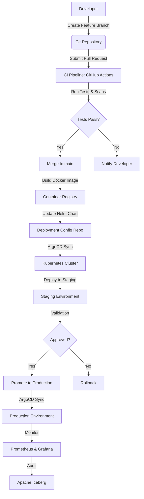
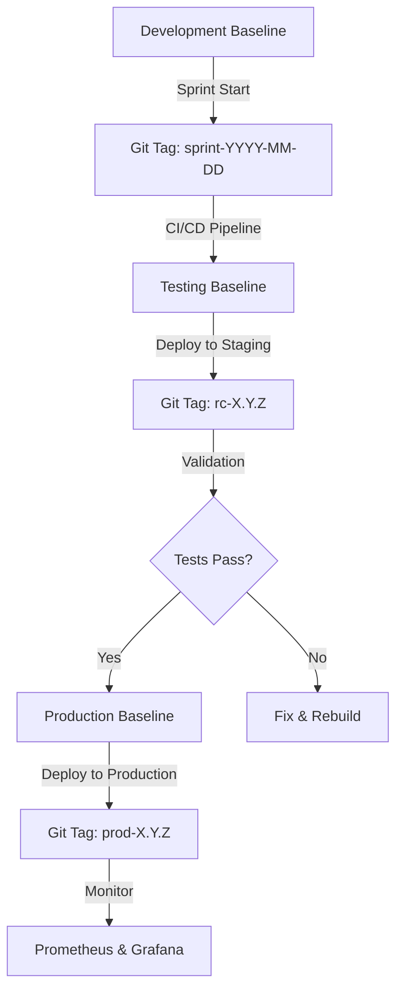
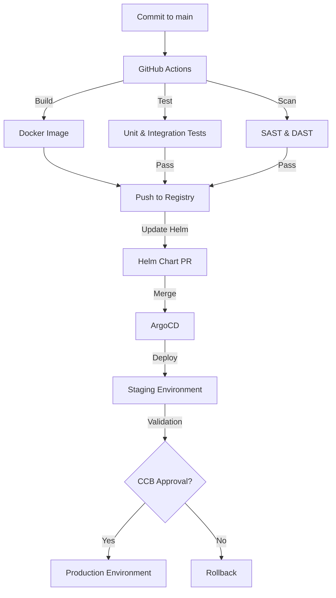
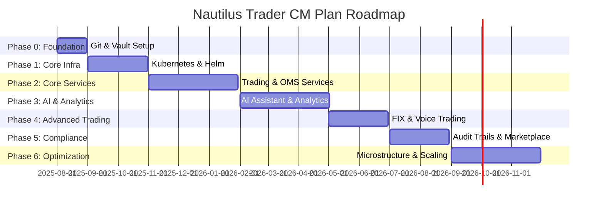

## **Configuration Management Plan**

### **Nautilus Trader: Enterprise Algorithmic Trading System**

| **Version:**   | 3.0                         |
|:-------------- |:--------------------------- |
| **Date:**      | August 21, 2025             |
| **Status:**    | Draft                       |
| **Author(s):** | Vincent Pereira             |
| **Owner:**     | Technical Lead, DevOps Team |

---

### **1.0 Introduction**

#### **1.1 Purpose**

This Configuration Management (CM) Plan establishes a comprehensive framework for identifying, controlling, tracking, and auditing all configurable items (CIs) within the Nautilus Trader Algorithmic Trading System (ATS). The plan ensures the integrity, consistency, and traceability of all system components across the development, testing, and production phases of the system's lifecycle. By adhering to this plan, the Nautilus Trader platform maintains enterprise-grade reliability, scalability, and compliance with regulatory standards (e.g., MiFID II, SOX, GDPR). It supports the system's advanced features, including no-code strategy development, AI-driven analytics, voice trading, augmented reality (AR) interfaces, and the Strategy Marketplace, as outlined in the "Features, Phases & Integration Strategy - Algorithmic Trading System" document.

#### **1.2 Scope**

This CM Plan encompasses all components of the Nautilus Trader ATS, including:

- **Source Code:** Microservices (Trading Engine, AI Assistant, Portfolio Manager, etc.), frontend applications (React 18/Next.js, React Native, Electron), and libraries (NautilusTrader, LangChain, PyPortfolioOpt, etc.).
- **Infrastructure as Code (IaC):** Kubernetes manifests, Helm charts, and Terraform configurations for cloud infrastructure (AWS/GCP multi-AZ deployments).
- **Container Images:** Docker images for all microservices, including versioned images for Python, Rust, and Node.js-based components.
- **Configuration Files:** Application settings (`values.yaml`), environment variables, and service configurations for REST, GraphQL, WebSocket, gRPC, and FIX APIs.
- **External Dependencies:** Over 60 open-source libraries and forked repositories (e.g., NautilusTrader, LangGraph, QuantLib, RAGFlow).
- **Databases:** Schemas for PostgreSQL (with pgvector), ClickHouse, Qdrant, Apache Iceberg, DuckDB, and Redis.
- **API Schemas:** OpenAPI/Swagger for REST, GraphQL SDL, Protocol Buffers for gRPC, and FIX 4.4+ specifications.
- **Documentation:** Project documents (BRD, PRD, SRS, SDD, TSD, API Documentation, this CM Plan).
- **Environments:** Development, Staging, Pre-Production, and Production environments, including isolated sandboxes for backtesting and AI model training.
- **Feature Flags:** Configurations for dynamic feature toggling via Unleash.
- **Secrets and Certificates:** API keys, OAuth 2.0 tokens, TLS certificates, and database credentials managed via HashiCorp Vault.

#### **1.3 Guiding Principles**

The CM strategy aligns with the Nautilus Trader platform's architectural principles:

- **Infrastructure as Code (IaC):** All infrastructure is defined in version-controlled Terraform and Helm configurations to ensure repeatability and auditability.
- **GitOps:** Git repositories serve as the single source of truth, with ArgoCD automating deployments based on repository state.
- **Automation:** CI/CD pipelines (GitHub Actions) automate building, testing, security scanning, and deployment to minimize human error.
- **Immutability:** Configuration changes are applied by deploying new, versioned artifacts (e.g., Docker images, Helm charts) rather than modifying running systems.
- **Zero-Trust Security:** All changes are subject to Role-Based Access Control (RBAC) and audited in Apache Iceberg for compliance.
- **Observability:** Prometheus, Grafana Loki, and Jaeger/Tempo provide real-time monitoring of configuration state and system health.

**Mermaid Diagram: Configuration Management Workflow**

---

### **2.0 Roles and Responsibilities**

| Role                           | Responsibilities                                                                                                                                                                                                                |
|:------------------------------ |:------------------------------------------------------------------------------------------------------------------------------------------------------------------------------------------------------------------------------- |
| **Development Team**           | - Authors source code, Dockerfiles, and configuration files for microservices (Trading Engine, AI Assistant, etc.), frontends, and analytics (QuantLib, FinRL). - Submits changes via pull requests (PRs) with unit tests. - Ensures compliance with coding standards and SAST (Bandit) scans. |
| **DevOps Team**                | - Manages CI/CD pipelines, IaC (Terraform, Helm), and Kubernetes orchestration. - Configures ArgoCD, HashiCorp Vault, and Unleash. - Monitors system health via Prometheus and Grafana. - Handles dependency updates via Renovate. |
| **AI/ML Team**                 | - Maintains AI model configurations (LangGraph, RAGFlow, LSTM, etc.) and training pipelines. - Manages embeddings in Qdrant/pgvector and RLOps for reinforcement learning (FinRL). |
| **Security Team**              | - Manages secrets and certificates in HashiCorp Vault. - Conducts SAST (Bandit) and DAST scans. - Implements User and Entity Behavior Analytics (UEBA) for anomaly detection. - Enforces zero-trust policies with Keycloak. |
| **Compliance Officer**         | - Defines audit trail and retention policies for regulatory compliance (MiFID II, SOX, GDPR). - Audits Apache Iceberg logs and configuration changes. - Validates compliance reports generated by the system. |
| **Change Control Board (CCB)** | - Reviews and approves high-impact changes (e.g., production deployments, major schema updates). - Includes Technical Lead, DevOps Lead, Security Lead, and Compliance Officer. - Ensures changes align with business and regulatory requirements. |

---

### **3.0 Configuration Identification**

Configuration Items (CIs) are uniquely identified and versioned to ensure traceability and consistency across the Nautilus Trader ATS.

#### **3.1 CI Naming and Versioning Convention**

- **Source Code Repositories:**
  - Format: `nautilus-trader-<component>-<type>` (e.g., `nautilus-trader-trading-service`, `nautilus-trader-web-frontend`).
  - Versioning: Semantic Versioning (`MAJOR.MINOR.PATCH`, e.g., `1.2.3`).
  - Hosted in a GitHub organization (`github.com/nautilus-trader`).

- **Docker Images:**
  - Format: `<registry>/nautilus-trader-<component>:<version>-<git-commit-short-sha>` (e.g., `our.registry/nautilus-trader-trading-service:1.2.3-a1b2c3d`).
  - Registry: Private container registry (AWS ECR or GCP Artifact Registry).
  - Images are immutable and rebuilt for each change.

- **Helm Charts:**
  - Stored in `nautilus-trader-helm-charts` repository.
  - Versioning: Semantic Versioning.
  - Example: `helm/nautilus-trader-trading-service:1.2.0`.

- **Terraform Modules:**
  - Stored in `nautilus-trader-infrastructure` repository.
  - Versioning: Semantic Versioning.
  - Example: `terraform/modules/eks-cluster:1.1.0`.

- **External Dependencies:**
  - Managed via a tiered system (Phase 0):
    - **Tier 1 (Core):** NautilusTrader, LangChain, PyPortfolioOpt, QuantLib (forked and maintained in-house).
    - **Tier 2 (Supporting):** FastAPI, Optuna, VectorBT, RAGFlow (pinned versions).
    - **Tier 3 (Optional):** Lobe Chat, Whisper, WebXR (evaluated and updated as needed).
  - Dependencies are pinned in `requirements.txt`, `package.json`, or equivalent.
  - Renovate automates dependency updates with PRs.

- **Database Schemas:**
  - PostgreSQL/pgvector: User data, strategy metadata, and embeddings.
  - ClickHouse: Time-series market data and backtest results.
  - Qdrant: Vector embeddings for RAG.
  - Apache Iceberg: Immutable audit trails for trades and actions.
  - DuckDB: Offline analytics in desktop apps.
  - Redis: Caching and session management.
  - Schemas are versioned in `nautilus-trader-db-schemas` repository.

- **API Schemas:**
  - REST: OpenAPI/Swagger files in `nautilus-trader-api-specs/rest`.
  - GraphQL: SDL files in `nautilus-trader-api-specs/graphql`.
  - gRPC: Protocol Buffers in `nautilus-trader-api-specs/grpc`.
  - FIX: Specifications in `nautilus-trader-api-specs/fix`.
  - Versioned with Semantic Versioning.

- **Feature Flags:**
  - Managed via Unleash in `nautilus-trader-feature-flags` repository.
  - Example: `feature/voice-trading:enabled`.

#### **3.2 Baselines**

Baselines establish reference points for CIs at key milestones:

- **Development Baseline:** Created at sprint start, tagged in Git (e.g., `sprint-2025-08-01`).
- **Testing Baseline:** Deployed to Staging for release candidates, tagged as `rc-<version>` (e.g., `rc-1.2.0`).
- **Production Baseline:** Current Production state, tagged as `prod-<version>` (e.g., `prod-1.2.0`).
- **AI Model Baseline:** Frozen model weights and configurations for reproducibility, stored in `nautilus-trader-ai-models`.

**Mermaid Diagram: Baseline Lifecycle**

---

### **4.0 Configuration Control**

Configuration control ensures that changes to CIs are systematic, authorized, and documented.

#### **4.1 Change Management Process**

1. **Change Request (CR):**
   - Initiated via Jira tickets linked to GitHub issues (e.g., `OMS-123: Add VWAP order type`).
   - Includes description, impact assessment, and test plan.

2. **Implementation:**
   - Developers create a feature branch (e.g., `feature/OMS-123-vwap-order`).
   - Changes include code, configurations, IaC, and documentation updates.
   - Unit tests (Pytest), integration tests, and SAST scans (Bandit) are mandatory.

3. **Pull Request (PR):**
   - PRs are submitted to merge changes into `main`.
   - PRs include:
     - Detailed description and Jira ticket reference.
     - Automated test results (unit, integration, security).
     - Documentation updates (e.g., API specs, user guides).
   - Minimum of two peer reviews required.

4. **Review and Approval:**
   - Code Review: Conducted by at least one developer and one senior engineer.
   - Automated Checks: GitHub Actions runs:
     - Unit tests (>80% coverage).
     - Integration tests with mocked brokers (Interactive Brokers, Alpaca).
     - SAST scans (Bandit, ESLint).
     - Dependency vulnerability scans (Dependabot).
   - Technical Lead approves for low-impact changes; CCB approves for high-impact changes.

5. **Merge and Artifact Creation:**
   - Merged PR triggers GitHub Actions to:
     - Build Docker images with version and Git SHA.
     - Update Helm charts in `nautilus-trader-helm-charts`.
     - Publish artifacts to container registry.

#### **4.2 CI/CD and Deployment**

The CI/CD pipeline is fully automated using GitHub Actions and ArgoCD, following a GitOps model.

1. **CI Pipeline:**
   - Trigger: Commit to `main` or PR.
   - Steps:
     - Build: Compile Python (3.10+), Rust, and Node.js code.
     - Test: Run unit, integration, and performance tests.
     - Scan: Perform SAST (Bandit) and DAST (OWASP ZAP).
     - Package: Build Docker images and push to registry.
     - Update: Create PR to update Helm chart `values.yaml`.

2. **Staging Deployment:**
   - ArgoCD monitors `nautilus-trader-helm-charts` for changes.
   - Deploys to Staging environment (Kubernetes namespace `staging`).
   - Validation includes:
     - End-to-end tests with mock market data (Yahoo Finance, Finnhub).
     - Performance tests to verify <10ms API latency and <100µs data ingestion.
     - AI model validation (LSTM, RAGFlow) with >90% accuracy.

3. **Production Deployment:**
   - Requires CCB approval for production PRs.
   - Uses blue-green or canary deployment to minimize downtime.
   - ArgoCD syncs to Production namespace (`prod`).
   - Post-deployment validation ensures 99.95% uptime and RTO <4 hours.

**Mermaid Diagram: CI/CD Pipeline**

#### **4.3 Managing Secrets and Sensitive Configuration**

- **Policy:** No secrets (API keys, passwords, certificates) are stored in Git repositories.
- **Storage:** Secrets are managed in HashiCorp Vault with:
  - Short-lived tokens for Kubernetes service accounts.
  - Dynamic secrets for database credentials.
  - TLS certificates for API Gateway (Istio).
- **Access:** RBAC via Keycloak enforces least-privilege access.
- **Auditing:** All secret access is logged in Apache Iceberg.

#### **4.4 Feature Flags**

- **Tool:** Unleash manages feature flags for dynamic configuration.
- **Use Cases:**
  - Enable/disable features (e.g., `voice-trading`, `ar-visualization`).
  - Control rollout of Strategy Marketplace and market microstructure analysis.
- **Management:** Flags are CIs, stored in `nautilus-trader-feature-flags` repository.
- **Auditing:** Flag changes are logged in Apache Iceberg.

---

### **5.0 Configuration Status Accounting and Reporting**

Status accounting tracks the state of all CIs and changes.

- **Single Source of Truth:** GitHub repositories (`nautilus-trader-*`) store code, IaC, and configurations.
- **Real-Time Status:**
  - **ArgoCD Dashboard:** Displays sync status between Git and Kubernetes.
  - **Dependency Health Dashboard:** Monitors 60+ external dependencies (NautilusTrader, LangChain, etc.) with real-time alerts for vulnerabilities.
  - **Grafana Dashboards:** Show system metrics (e.g., API latency, Kafka throughput) and configuration health.
- **Change History:**
  - **Git History:** Immutable log of all changes with PR descriptions, linked to Jira tickets.
  - **Apache Iceberg:** Stores audit trails for trades, orders, and configuration changes.
- **Reporting:**
  - Weekly CM reports generated via Grafana for DevOps and CCB.
  - Compliance reports for MiFID II, SOX, and GDPR exported as PDFs.

---

### **6.0 Configuration Auditing and Verification**

Auditing ensures configurations are correct, consistent, and compliant.

- **Automated Verification:**
  - **CI Pipeline:** Validates commits with tests and scans.
  - **ArgoCD:** Detects configuration drift in Kubernetes clusters.
  - **Prometheus Alerts:** Notify on anomalies (e.g., latency >10ms, memory leaks).
- **Periodic Audits:**
  - **Quarterly Technical Audits:**
    - Verify Terraform and Helm configurations match deployed state.
    - Check RBAC policies in Keycloak and Vault.
    - Scan for secrets in Git using TruffleHog.
  - **Compliance Audits:**
    - Conducted by Compliance Officer to verify Apache Iceberg logs.
    - Ensure adherence to regulatory standards.
- **AI Model Audits:**
  - Validate model configurations (LangGraph, RAGFlow) and weights.
  - Ensure >90% accuracy for predictive models and >85% for sentiment analysis.

---

### **7.0 Tools and Infrastructure**

| Tool                     | Purpose                                                                 |
|:------------------------ |:----------------------------------------------------------------------- |
| **GitHub**               | Version control for code, IaC, and configurations.                      |
| **Docker**               | Containerization for microservices and frontends.                      |
| **Kubernetes**           | Orchestration for Development, Staging, and Production environments.    |
| **Helm**                 | Package management for Kubernetes deployments.                         |
| **Terraform**            | IaC for provisioning cloud resources (AWS/GCP).                        |
| **ArgoCD**               | GitOps for automated deployments.                                      |
| **GitHub Actions**       | CI/CD pipeline orchestration.                                          |
| **HashiCorp Vault**      | Secrets and certificate management.                                    |
| **Unleash**              | Feature flag management for dynamic configuration.                     |
| **Prometheus & Grafana** | Monitoring, observability, and dashboards.                             |
| **Grafana Loki**         | Centralized logging with ELK as fallback.                              |
| **Jaeger/Tempo**         | Distributed tracing for API requests.                                  |
| **Apache Iceberg**       | Immutable audit trails for compliance.                                 |
| **Renovate**             | Automated dependency updates.                                          |
| **Bandit**               | SAST for Python code security.                                         |
| **TruffleHog**           | Secret detection in Git repositories.                                  |
| **Keycloak**             | OAuth 2.0/OIDC authentication and RBAC.                                |

---

### **8.0 Phased Implementation**

The CM Plan aligns with the six-phase roadmap from the "Features, Phases & Integration Strategy" document:

- **Phase 0: Foundation**
  - Initialize GitHub repositories and Vault.
  - Set up dependency management (Renovate) and tiered dependency system.
  - Establish CI pipeline with GitHub Actions.

- **Phase 1: Core Infrastructure**
  - Deploy Kubernetes clusters (EKS/GKE) with Terraform.
  - Configure ArgoCD and Helm for GitOps.
  - Set up PostgreSQL, ClickHouse, and Redis.

- **Phase 2: Core Services**
  - Deploy Trading Engine, OMS, and Portfolio Manager microservices.
  - Configure API schemas (REST, GraphQL, gRPC).
  - Integrate Unleash for feature flags.

- **Phase 3: AI and Analytics**
  - Deploy AI Assistant (LangGraph, RAGFlow) and analytics services (QuantLib, FinRL).
  - Configure Qdrant/pgvector for embeddings.
  - Set up RLOps for reinforcement learning.

- **Phase 4: Advanced Trading**
  - Deploy FIX API and smart order router.
  - Configure voice trading (Whisper) and AR (WebXR) components.

- **Phase 5: Compliance and Marketplace**
  - Implement Apache Iceberg for audit trails.
  - Configure Strategy Marketplace infrastructure.
  - Set up compliance reporting pipelines.

- **Phase 6: Optimization**
  - Enable market microstructure analysis and FPGA/SmartNIC support.
  - Optimize configurations for >10,000 concurrent users.

**Mermaid Gantt Chart:**

---

This Configuration Management Plan provides a detailed framework for managing the Nautilus Trader ATS, incorporating all features from the updated "Features, Phases & Integration Strategy - Algorithmic Trading System" document. It leverages GitOps, automation, and observability to ensure reliability, scalability, and compliance, supported by Mermaid diagrams for clarity.

