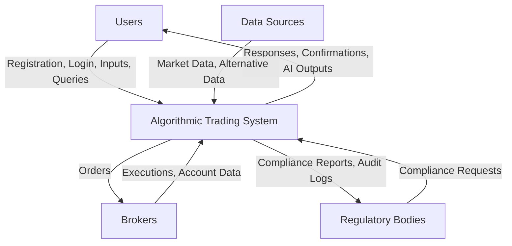

# Data Flow Document (DFD)
## Algorithmic Trading System

---

### Table of Contents
- [Data Flow Document (DFD)](#data-flow-document-dfd)
  - [Algorithmic Trading System](#algorithmic-trading-system)
    - [Table of Contents](#table-of-contents)
    - [Introduction](#introduction)
    - [Context Diagram (Level 0 DFD)](#context-diagram-level-0-dfd)
      - [External Entities](#external-entities)
      - [Data Flows](#data-flows)
      - [Visual Representation](#visual-representation)
    - [Level 1 DFD: Major Processes and Data Flows](#level-1-dfd-major-processes-and-data-flows)
      - [Processes](#processes)
      - [Data Stores](#data-stores)
      - [Data Flows](#data-flows-1)
    - [Level 2 DFD: Detailed Processes](#level-2-dfd-detailed-processes)
      - [Trading Infrastructure](#trading-infrastructure)
        - [Sub-Processes](#sub-processes)
        - [Data Flows](#data-flows-2)
      - [Data Management](#data-management)
        - [Sub-Processes](#sub-processes-1)
        - [Data Flows](#data-flows-3)
      - [AI Assistant](#ai-assistant)
        - [Sub-Processes](#sub-processes-2)
        - [Data Flows](#data-flows-4)
    - [Data Formats, Volumes, and Frequencies](#data-formats-volumes-and-frequencies)
    - [Security and Error Handling](#security-and-error-handling)
    - [Conclusion](#conclusion)

---

### Introduction
This Data Flow Document (DFD) provides a comprehensive graphical representation of data movement within the Algorithmic Trading System. The DFD illustrates how data flows from external entities into the system, how it is processed, stored, and transformed, and where it is directed. It serves as a critical tool for understanding the system's functionality, ensuring all data interactions are well-defined, and verifying alignment with architectural and operational requirements.

The DFD is organized into multiple levels:
- **Level 0 (Context Diagram)**: Depicts the system as a single entity interacting with external entities.
- **Level 1**: Breaks down the system into major processes, data stores, and their interconnections.
- **Level 2**: Offers detailed breakdowns of key processes, providing granularity for complex operations.

This document aims to be thorough, detailing each component with examples, descriptions, and considerations for data formats, security, and error handling.

---

### Context Diagram (Level 0 DFD)
The context diagram represents the Algorithmic Trading System as a single process interacting with external entities, highlighting primary data flows.

#### External Entities
- **Users**: Individuals (e.g., traders, portfolio managers) who manage accounts, place orders, develop strategies, and interact with the AI Assistant.
- **Brokers**: External financial institutions (e.g., Interactive Brokers, Alpaca) responsible for executing trades and providing account data.
- **Data Sources**: Providers of market data (e.g., Yahoo Finance, Alpha Vantage) and alternative data (e.g., news feeds).
- **Regulatory Bodies**: Entities requiring compliance reports and audit logs to ensure regulatory adherence.

#### Data Flows
- **Users to System**:
  - Registration data (e.g., username, email, password)
  - Login credentials
  - Strategy inputs (e.g., trading rules, parameters)
  - Order requests (e.g., buy/sell orders)
  - AI Assistant queries (e.g., "What’s my portfolio value?")
- **System to Users**:
  - Authentication responses (e.g., login success/failure)
  - Strategy outputs (e.g., backtest results)
  - Order confirmations and status updates
  - AI Assistant responses
- **Brokers to System**:
  - Execution confirmations (e.g., trade filled at $150)
  - Account data (e.g., balances, positions)
- **System to Brokers**:
  - Order submissions (e.g., limit order for 10 shares)
- **Data Sources to System**:
  - Market data (e.g., real-time prices, historical OHLC)
  - Alternative data (e.g., sentiment-analyzed news)
- **System to Regulatory Bodies**:
  - Compliance reports
  - Audit logs

#### Visual Representation

---

### Level 1 DFD: Major Processes and Data Flows
The Level 1 DFD decomposes the system into major processes, data stores, and their data flows, providing a high-level view of internal operations.

#### Processes
1. **User Management**: Manages user registration, authentication, and profile updates.
2. **Trading Infrastructure**: Oversees order placement, validation, submission, and execution monitoring.
3. **Data Management**: Collects, processes, stores, and retrieves market and alternative data.
4. **Strategy Development**: Facilitates creation, backtesting, and optimization of trading strategies.
5. **AI Assistant**: Interprets natural language queries and executes user commands.
6. **User Interface**: Provides web and mobile access to system features.
7. **Security and Compliance**: Ensures data protection and regulatory compliance.
8. **Options Trading**: Offers tools for options-specific strategies and analysis.

#### Data Stores
- **D1: User Database**: Stores user profiles, encrypted credentials, and preferences.
- **D2: Strategy Database**: Contains trading strategies, parameters, and backtest results.
- **D3: Order Logs**: Records order placements, executions, and statuses.
- **D4: Market Data Archive**: Holds historical and real-time market data.
- **D5: Compliance Logs**: Maintains audit trails and compliance data.

#### Data Flows
- **Users → User Interface**: Inputs (e.g., registration, orders, queries).
- **User Interface → User Management**: Registration/login data.
- **User Management ↔ User Database**: Store/retrieve user data.
- **User Interface → Strategy Development**: Strategy inputs.
- **Strategy Development ↔ Strategy Database**: Store/retrieve strategies.
- **Strategy Development → Data Management**: Historical data requests.
- **Data Management ↔ Market Data Archive**: Store/retrieve data.
- **User Interface → Trading Infrastructure**: Order requests.
- **Trading Infrastructure → Brokers**: Order submissions.
- **Brokers → Trading Infrastructure**: Execution confirmations.
- **Trading Infrastructure ↔ Order Logs**: Log orders/executions.
- **User Interface → AI Assistant**: Queries/commands.
- **AI Assistant → Trading Infrastructure**: Order commands.
- **AI Assistant → Data Management**: Data requests.
- **AI Assistant → Strategy Development**: Strategy queries.
- **Security and Compliance ↔ All Processes**: Monitor/enforce policies.
- **Security and Compliance ↔ Compliance Logs**: Store audit data.
- **Options Trading → Data Management**: Options data requests.
- **Options Trading → Strategy Development**: Options strategy tools.

---

### Level 2 DFD: Detailed Processes
This section details critical processes with sub-processes and specific data flows.

#### Trading Infrastructure
Handles the lifecycle of trading operations.

##### Sub-Processes
- **2.1 Order Placement**: Receives order requests.
- **2.2 Order Validation**: Validates orders against rules/limits.
- **2.3 Order Submission**: Sends orders to brokers.
- **2.4 Execution Monitoring**: Tracks and logs execution.

##### Data Flows
- **User Interface → 2.1**: Order requests (e.g., {symbol: "AAPL", qty: 10, type: "limit", price: 150}).
- **AI Assistant → 2.1**: AI-generated orders.
- **2.1 → 2.2**: Orders for validation.
- **2.2 → 2.3**: Validated orders.
- **2.2 → User Interface**: Errors (e.g., "Insufficient funds").
- **2.3 → Brokers**: Order submissions.
- **Brokers → 2.4**: Confirmations (e.g., {order_id: "123", status: "filled"}).
- **2.4 → Order Logs**: Log details.
- **2.4 → User Interface**: Status updates.

#### Data Management
Manages data collection and provision.

##### Sub-Processes
- **3.1 Data Collection**: Fetches raw data from sources.
- **3.2 Data Cleaning**: Normalizes data.
- **3.3 Data Storage**: Archives data.
- **3.4 Data Retrieval**: Provides data to processes.

##### Data Flows
- **Data Sources → 3.1**: Raw data (e.g., JSON prices).
- **3.1 → 3.2**: Data to clean.
- **3.2 → 3.3**: Cleaned data.
- **3.3 → Market Data Archive**: Store data.
- **Strategy Development → 3.4**: Data requests.
- **AI Assistant → 3.4**: Data requests.
- **Options Trading → 3.4**: Options data requests.
- **3.4 → Market Data Archive**: Retrieve data.
- **3.4 → Requesting Process**: Deliver data.

#### AI Assistant
Processes natural language interactions.

##### Sub-Processes
- **5.1 Query Processing**: Interprets queries.
- **5.2 Task Delegation**: Assigns tasks to agents.
- **5.3 Data Retrieval**: Fetches required data.
- **5.4 Response Generation**: Formulates responses.
- **5.5 Command Execution**: Executes actions.

##### Data Flows
- **User Interface → 5.1**: Queries (e.g., "Current BTC price?").
- **5.1 → 5.2**: Parsed intent.
- **5.2 → 5.3**: Data requests.
- **5.3 → Data Management**: Fetch data.
- **Data Management → 5.3**: Data provided.
- **5.3 → 5.4**: Data for response.
- **5.4 → User Interface**: Response (e.g., "BTC: $60,000").
- **5.2 → 5.5**: Action commands.
- **5.5 → Trading Infrastructure**: Order requests.
- **Trading Infrastructure → 5.5**: Confirmation.
- **5.5 → User Interface**: Relay confirmation.

---

### Data Formats, Volumes, and Frequencies
- **Market Data**: JSON/CSV, high-volume (thousands/sec), real-time/batch.
- **Order Requests**: JSON, variable volume, asynchronous.
- **AI Queries**: Text, moderate volume, on-demand.
- **Compliance Logs**: Structured logs, event-driven, continuous.

---

### Security and Error Handling
- **Security**:
  - Credentials encrypted (AES-256).
  - Sensitive data over TLS 1.3.
  - All actions logged for audit.
- **Error Handling**:
  - Fallback data sources on failure.
  - Validation errors returned to users.
  - AI clarification requests for ambiguous queries.

---

### Conclusion
This DFD comprehensively maps data flows in the Algorithmic Trading System, ensuring clarity and alignment with system requirements. It supports development, maintenance, and compliance efforts.