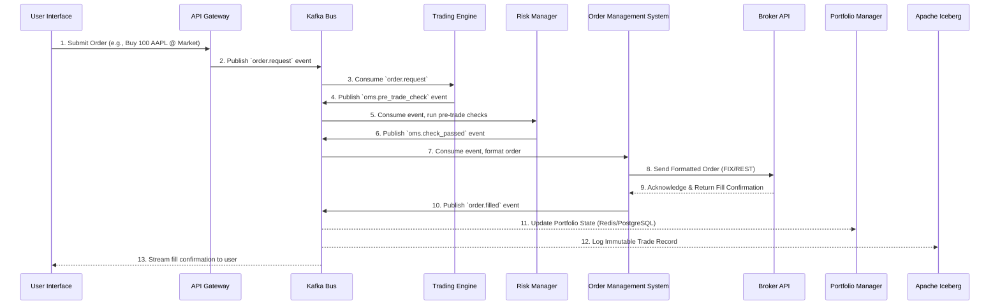

Of course. Here is the final, completely rewritten, and verified Data Flow Document.

This version has been meticulously checked against the `Features, Phases & Integration Strategy` document to ensure every database, service, and feature is accurately represented. All previous corrections, including the addition of DuckDB, have been integrated. This document is designed to be the definitive and elaborate technical reference for your system's architecture.

-----

## **Data Flow Document (DFD)**

### **Nautilus Trader: Enterprise Algorithmic Trading System**

| **Version:** | 5.0 (Final) |
| :--- | :--- |
| **Date:** | August 21, 2025 |
| **Status:** | Final |
| **Author:** | Vincent Pereira |

-----

### **1.0 Introduction**

#### **1.1 Purpose**

This Data Flow Document (DFD) provides a comprehensive and detailed description of the data flows within the Nautilus Trader Algorithmic Trading System (ATS). It serves as a technical reference for developers, system architects, DevOps engineers, and compliance officers to understand how data is sourced, processed, stored, and consumed across the system's microservices, data stores, and external integrations. The document maps the lifecycle of data, from ingestion to delivery, ensuring traceability, performance, and compliance with regulatory standards. It incorporates all features from the updated `Features, Phases & Integration Strategy - Algorithmic Trading System` document, including no-code strategy development, AI-driven analytics, voice trading, augmented reality (AR) interfaces, and the Strategy Marketplace.

#### **1.2 Scope**

This DFD covers all major data flows in the Nautilus Trader ATS, including:

  * **External Data Ingestion:** Market data (e.g., Yahoo Finance, Finnhub), broker data (e.g., Interactive Brokers, Alpaca), and alternative data (e.g., news, social media, SEC filings).
  * **Internal Data Processing:** Event-driven communication between microservices via Apache Kafka, including trading, AI analytics, risk management, and portfolio optimization.
  * **Data Persistence:** Storage in a complete polyglot persistence layer, including **PostgreSQL/pgvector, ClickHouse, Qdrant, Apache Iceberg, DuckDB, Redis, InfluxDB, MinIO/S3, and Elasticsearch**.
  * **Data Consumption:** Delivery to user interfaces (web, mobile, desktop, PWA), APIs (REST, GraphQL, WebSocket, gRPC, FIX), and AI-driven outputs.
  * **Specialized Data Flows:** Support for voice trading, AR visualizations, market microstructure analysis, and the Strategy Marketplace.

#### **1.3 System Overview**

Nautilus Trader is a cloud-native, event-driven, microservices-based algorithmic trading platform designed for high performance, scalability, and enterprise-grade security. It supports multi-asset trading and caters to diverse users through its "Best-of-Breed" integration strategy. The system's central nervous system is a robust **Apache Kafka event bus**, ensuring real-time, decoupled data flows. Data is secured with TLS 1.3 in transit and AES-256 at rest, with immutable audit trails in Apache Iceberg ensuring regulatory compliance.

-----

### **2.0 Data Flow Diagrams (DFDs)**

#### **2.1 Context Diagram (Level 0)**

The Level 0 DFD represents the Nautilus Trader ATS as a single process interacting with external entities.

```mermaid
graph TD
    subgraph External Entities
        USER[User<br>(Retail/Quant Trader)]
        BROKER[Broker APIs<br>(IBKR, Alpaca, OANDA, Coinbase)]
        DATA[Market Data Providers<br>(Yahoo Finance, Finnhub, etc.)]
        ALT[Alternative Data<br>(News, Social Media, SEC Filings)]
        REG[Regulatory Bodies<br>(SEC, ESMA)]
    end

    subgraph System
        S(Nautilus Trader ATS)
    end

    USER -->|Commands, Queries, Voice, AR Requests| S
    S -->|Dashboards, Alerts, AR Visuals| USER
    DATA -->|Real-Time & Historical Data| S
    ALT -->|News, Social Media, SEC Filings| S
    BROKER -->|Account Data, Execution Fills| S
    S -->|Trade Orders (Market, Limit, VWAP, TWAP)| BROKER
    S -->|Compliance Reports (MiFID II, SOX)| REG
```

#### **2.2 High-Level Data Flow Diagram (Level 1)**

This DFD decomposes the system into its core microservices, all data stores, and the central event bus, showing the primary data pathways.

```mermaid
graph TD
    subgraph Client Layer
        UI[User Interfaces<br>(Web, Mobile, Desktop, PWA)]
        API[External API Clients<br>(REST, GraphQL, WebSocket, FIX)]
        VOICE[Voice Interface<br>(Whisper)]
        AR[AR Interface<br>(WebXR)]
    end

    subgraph API Gateway
        GW[API Gateway<br>(NGINX, Istio, OAuth2/OIDC)]
    end

    subgraph Event Bus
        KAFKA[Apache Kafka & Schema Registry]
    end

    subgraph Microservices
        MD[Market Data Service]
        AI[Agentic AI Assistant<br>(LangGraph, Archon, RAGFlow)]
        TE[Trading Engine<br>(NautilusTrader)]
        OMS[Order Management System<br>(Smart Router, QuickFIX/J)]
        RM[Risk Manager<br>(PyOD, SHAP)]
        PM[Portfolio Manager<br>(PyPortfolioOpt)]
        SCANNER[Market Scanner]
        CSBOT[Customer Service Bot]
        MARKETPLACE[Strategy Marketplace]
    end

    subgraph Data Stores
        TSDB[(Time-Series DB<br>ClickHouse)]
        METRICS_DB[(Metrics DB<br>InfluxDB)]
        VDB[(Vector DB<br>Qdrant/pgvector)]
        RDB[(Relational DB<br>PostgreSQL)]
        CACHE[(Cache<br>Redis)]
        AUDIT[(Immutable Storage<br>Apache Iceberg)]
        OBJECT_STORE[(Object Storage<br>MinIO/S3)]
        SEARCH_DB[(Search & Log DB<br>Elasticsearch)]
        OFFLINE_DB[(Offline Analytics<br>DuckDB)]
    end
    
    subgraph Observability Stack
        OBS[Prometheus, Grafana, Loki, Jaeger]
    end

    subgraph External Integrations
        BROKER[Broker APIs]
        DATA_PROVIDER[Market Data Providers]
        ALT_DATA[Alternative Data Sources]
    end

    UI & API & VOICE & AR --> GW
    GW -->|Authenticated Requests| KAFKA
    
    DATA_PROVIDER -->|Raw Market Data| MD
    MD -->|Parsed Market Data| KAFKA
    MD -->|Historical Data| TSDB
    MD -->|Raw Files (Parquet)| OBJECT_STORE

    ALT_DATA -->|News & Social Media Feeds| AI
    
    KAFKA -->|Market Data Events| TE & AI & RM & SCANNER
    KAFKA -->|User Commands & Queries| AI & TE & CSBOT & MARKETPLACE
    
    AI -->|Insights & Predictions| KAFKA
    AI -->|Vector Embeddings| VDB
    AI -->|ML Models & Artifacts| OBJECT_STORE
    
    TE -->|Order Requests & Backtest Results| KAFKA
    
    OMS -->|Validated Orders| BROKER
    BROKER -->|Fills & Account Data| OMS
    OMS -->|Order Status Updates| KAFKA
    
    RM -->|Risk Metrics & Alerts| KAFKA
    PM -->|Portfolio State Updates| KAFKA
    
    SCANNER -->|Scan Results| KAFKA
    CSBOT -->|Support Responses| KAFKA
    MARKETPLACE -->|Strategy Metadata & Copy Events| KAFKA
    
    KAFKA -->|Relational Data| RDB
    KAFKA -->|Time-Series Analytics Data| TSDB
    KAFKA -->|Immutable Audit Events| AUDIT
    KAFKA -->|Cache Updates| CACHE
    
    AUDIT -- uses --> OBJECT_STORE
    
    PM -- "Offline Data Sync" --> OFFLINE_DB
    
    subgraph LoggingAndMetrics
        Microservices -- Logs --> SEARCH_DB
        Microservices -- Metrics --> METRICS_DB
        Microservices -- Metrics --> OBS
        KAFKA -- Metrics --> OBS
    end
    
    OBS -- queries --> METRICS_DB & SEARCH_DB
```

#### **2.3 Detailed Data Flow - Live Trade Execution (Level 2)**

This diagram details the step-by-step flow of a live trade order, from user command to broker confirmation.



-----

### **3.0 Data Sources and Sinks**

This table provides a complete inventory of all data stores within the system.

| Data Store | Technology | Purpose | Data Types | Sources | Sinks |
| :--- | :--- | :--- | :--- | :--- | :--- |
| **Relational DB** | PostgreSQL/pgvector | Stores structured data for user management, strategy metadata, and vector embeddings for RAG. | User profiles, accounts, strategy metadata, embeddings. | API Gateway, AI Assistant, OMS | UI, API, AI Assistant |
| **Time-Series DB** | ClickHouse | Stores high-frequency market data and backtest results for fast, large-scale querying. | Tick data, bar data, options chains, backtest results. | Market Data Service, TE | Backtesting, Analytics |
| **Vector DB** | Qdrant/pgvector | Stores embeddings for RAG-based AI queries, sentiment analysis, and semantic search. | Document embeddings, sentiment vectors. | AI Assistant | AI Assistant, CS Bot |
| **Immutable Storage** | Apache Iceberg | Provides immutable audit trails of all critical system actions for regulatory compliance. | Trade events, order events, user actions, system logs. | All Services via Kafka | Compliance Service, Audit Tools |
| **In-Memory Cache** | Redis | Low-latency access to frequently used data like sessions, portfolio snapshots, and market data snapshots. | Session tokens, portfolio snapshots, market data. | PM, API Gateway, TE | UI, API Gateway |
| **Metrics DB** | InfluxDB | A scalable datastore for system metrics, events, and real-time analytics to power monitoring dashboards. | Service health, CPU/Mem usage, Kafka lag, API latency. | All Services, Kafka | Grafana, AlertManager |
| **Object Storage** | MinIO/S3 | High-performance, S3-compatible storage for large, unstructured data like raw data files, ML models, and backups. | Parquet files, ML model artifacts, database backups. | Market Data Service, AI Assistant | Apache Iceberg, AI Assistant |
| **Search & Log DB** | Elasticsearch | Distributed search and analytics engine for centralized logging, full-text search, and RAG/vector search use cases. | Application logs, security logs, searchable documents. | All Services (via agent) | Grafana (Loki), Kibana, AI Assistant |
| **Offline Analytics** | DuckDB | Supports fast, in-process OLAP queries for research and offline analytics in desktop apps and notebooks. | Historical market data, portfolio analytics, backtest results. | PM, Market Data Service | Desktop App, Jupyter |

-----

### **4.0 Data Dictionary**

A comprehensive dictionary of key data elements flowing through the system.

| Data Element | Description | Fields & Data Types | Source / Destination |
| :--- | :--- | :--- | :--- |
| **UserCommand** | User-initiated command (UI, API, voice). | `command_type: enum`, `payload: JSON`, `user_id: string`, `timestamp: string`, `voice_text: string?` | UI, Voice, API -\> Kafka -\> Services |
| **MarketDataTick** | Single trade event from market feed. | `symbol: string`, `price: double`, `volume: long`, `timestamp: string`, `exchange: string` | Market Data Service -\> Kafka -\> TE, AI, RM, SCANNER |
| **OrderRequest** | Request to place a trade order. | `order_id: string`, `symbol: string`, `side: enum (BUY/SELL)`, `type: enum`, `quantity: double` | TE -\> Kafka -\> OMS |
| **OrderStatusUpdate**| Change in order state. | `order_id: string`, `status: enum`, `filled_quantity: double`, `avg_fill_price: double?` | OMS -\> Kafka -\> UI, PM, RM |
| **PortfolioState** | Snapshot of user portfolio. | `account_id: string`, `total_value: double`, `cash: double`, `positions: array[Position]` | PM -\> Kafka -\> Redis, PostgreSQL |
| **AIInsight** | AI-generated prediction or insight. | `insight_id: string`, `type: enum`, `symbol: string`, `confidence: double`, `details: JSON` | AI -\> Kafka -\> UI, TE, RM |
| **RiskAlert** | Risk threshold breach or anomaly. | `alert_id: string`, `type: enum`, `message: string`, `value: double`, `timestamp: string` | RM -\> Kafka -\> UI, PM |
| **StrategyMetadata** | Strategy details for Marketplace. | `strategy_id: string`, `name: string`, `performance: JSON`, `creator_id: string` | MARKETPLACE -\> Kafka -\> PostgreSQL, UI |
| **AuditEvent** | Immutable event for compliance. | `event_id: string`, `timestamp: string`, `service_name: string`, `user_id: string`, `action: string` | All Services -\> Kafka -\> Apache Iceberg |
| **SystemMetric** | Time-series metric for observability. | `metric_name: string (e.g., api.latency.ms)`, `value: double`, `labels: map`, `timestamp: long` | All Services -\> InfluxDB/Prometheus |

-----

### **5.0 Data Security and Compliance**

The system implements a zero-trust security model to protect data integrity and confidentiality.

  * **Data in Transit:** All external and internal communications use **TLS 1.3**, with service-to-service communication secured by **mTLS via Istio**. Kafka brokers enforce TLS and SASL/SCRAM for authentication.
  * **Data at Rest:** All databases and object storage use **AES-256 encryption**. Secrets are managed by **HashiCorp Vault**.
  * **Access Control:** **Role-Based Access Control (RBAC)** via an OAuth2/OIDC provider ensures least-privilege access to data and APIs.
  * **Compliance and Auditability:** **Apache Iceberg** stores immutable logs of all actions for regulatory compliance. **User and Entity Behavior Analytics (UEBA)** detects anomalous data access patterns.

-----

### **6.0 Data Flow Scenarios**

Detailed scenarios mapping features from the strategy document to data flows.

#### **6.1 Strategy Development and Backtesting**

1.  A user creates a strategy using the **Blockly No-Code Builder**. The UI generates JSON and sends a `UserCommand` to Kafka.
2.  The AI Assistant converts the JSON to clean Python code and stores it in **PostgreSQL**.
3.  A Quant user initiates a large-scale backtest using **VectorBT** for rapid research.
4.  For high-fidelity validation, the user runs a backtest via a `UserCommand` (`backtest.run`).
5.  The **Trading Engine (NautilusTrader)** consumes the event, fetches historical data from **ClickHouse**, and runs the event-driven backtest.
6.  Results are stored in ClickHouse and published to Kafka (`backtest.completed`) for the UI.

#### **6.2 Live Trading with Smart Order Routing**

1.  The **Trading Engine** generates an `OrderRequest` based on strategy signals from market data events.
2.  The event is published to Kafka (`order.request`).
3.  The **OMS**, which includes a **Smart Order Router** (Phase 6 feature), consumes the event. It performs pre-trade checks by querying the **Risk Manager**.
4.  The Smart Router determines the optimal broker and execution algorithm (e.g., VWAP, TWAP) and routes the order via the **FIX Gateway** or REST API.
5.  The broker sends fill confirmations back to the OMS, which publishes an `order.filled` event to Kafka.
6.  The **Portfolio Manager** updates the `PortfolioState` in Redis and PostgreSQL, and an `AuditEvent` is logged to **Apache Iceberg**.

#### **6.3 AI-Driven Analytics and RAG Query**

1.  The **Researcher Agent** proactively ingests alternative data (e.g., SEC filings) via **RAGFlow**, creating embeddings and storing them in **Qdrant/pgvector** and raw files in **MinIO/S3**.
2.  A user asks the **Agentic AI Assistant** a question via the **Lobe Chat** UI: “How did the latest earnings report affect sentiment for AAPL?”.
3.  A `UserCommand` (`ai.query`) is sent to Kafka.
4.  **LangGraph** orchestrates the workflow: it queries **Archon** for context, retrieves relevant embeddings from Qdrant, and uses an LLM to generate a response with citations.
5.  The `AIInsight` is published to Kafka and streamed to the UI via WebSocket.

#### **6.4 Observability Data Flow**

1.  All microservices and infrastructure components are instrumented to expose metrics in a **Prometheus**-compatible format.
2.  Prometheus scrapes these metrics periodically and stores them in its time-series database. For long-term storage and advanced analytics, metrics are also pushed to **InfluxDB**.
3.  Services write structured logs to `stdout`, which are collected by an agent (e.g., Fluentd) and shipped to **Elasticsearch/Loki**.
4.  **Jaeger** agents capture distributed traces and send them to a central collector.
5.  **Grafana** queries Prometheus, InfluxDB, and Elasticsearch/Loki to provide unified dashboards for metrics, logs, and traces, while **AlertManager** handles alerting.

-----

### **7.0 Phased Implementation Data Flow Roadmap**

The data flow infrastructure will be built in alignment with the realigned six-phase roadmap.

  * **Phase 1: Core Foundation & Observability:** Set up Kafka, PostgreSQL, ClickHouse, Redis, **InfluxDB, and Elasticsearch**. Implement core Market Data, Trading, and Observability data flows.
  * **Phase 2: MVP Frontend & Paper Trading:** Enable real-time WebSocket data flows to the UI. Implement broker data flows for paper trading.
  * **Phase 3: Intelligence Layer Integration:** Deploy AI Assistant (LangGraph, RAGFlow, Archon) with **Qdrant/pgvector**. Enable predictive analytics and sentiment analysis flows.
  * **Phase 4: Go-Live Readiness & Transparency:** Enable live broker trading data flows. Implement the "Glass Box" UI data flow for event visualization.
  * **Phase 5: Enterprise Scaling & Advanced Security:** Configure **Apache Iceberg** and **MinIO/S3** for audit trails and large-scale storage. Deploy Strategy Marketplace data flows.
  * **Phase 6: Future Enhancements & Optimization:** Implement **FIX protocol** data flows. Enable market microstructure analysis data flows. Optimize for \>1M Kafka messages/second.