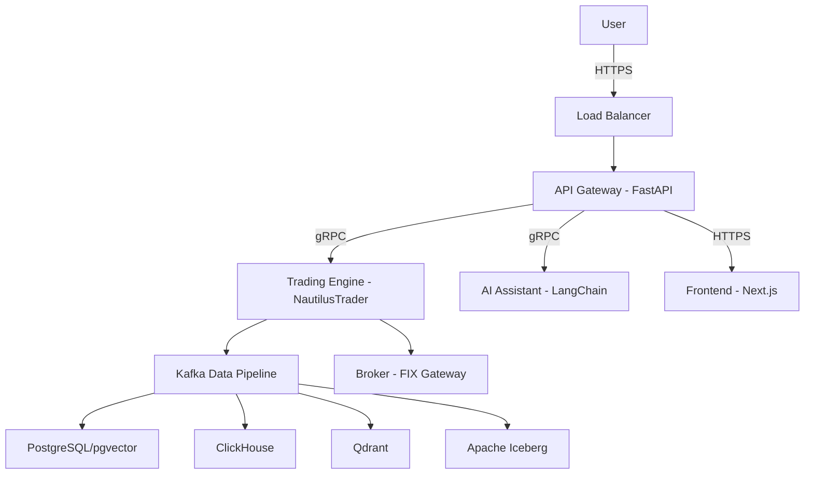
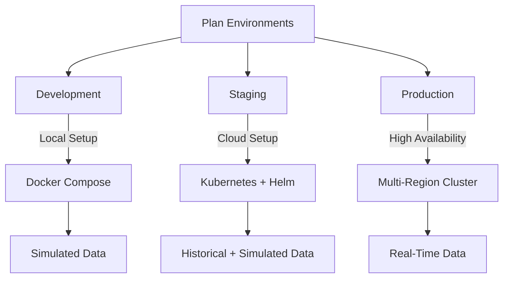
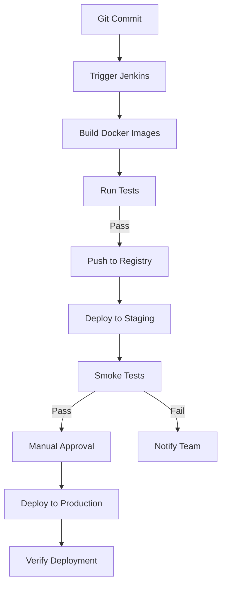

# Deployment Guide  
## Algorithmic Trading System (ATS)  

---

### Table of Contents
1. [Introduction](#introduction)
   - 1.1 Purpose
   - 1.2 Scope
   - 1.3 System Overview
2. [Deployment Architecture](#deployment-architecture)
   - 2.1 Cloud Environment
   - 2.2 Microservices and Containers
   - 2.3 Networking and Security
   - 2.4 Data Storage and Management
3. [Prerequisites](#prerequisites)
   - 3.1 Software and Tools
   - 3.2 Hardware Requirements
   - 3.3 Access and Permissions
4. [Environment Setup](#environment-setup)
   - 4.1 Development Environment
   - 4.2 Staging Environment
   - 4.3 Production Environment
5. [Configuration Management](#configuration-management)
   - 5.1 Environment Variables
   - 5.2 Secrets Management
   - 5.3 Configuration Files
6. [Deployment Process](#deployment-process)
   - 6.1 Build and Packaging
   - 6.2 Containerization
   - 6.3 Orchestration with Kubernetes
   - 6.4 CI/CD Pipeline
7. [Post-Deployment Tasks](#post-deployment-tasks)
   - 7.1 Verification and Testing
   - 7.2 Monitoring and Logging
   - 7.3 Backup and Recovery
8. [Troubleshooting](#troubleshooting)
   - 8.1 Common Issues
   - 8.2 Debugging Tools
9. [Appendices](#appendices)
   - 9.1 Glossary
   - 9.2 References

---

### 1. Introduction

#### 1.1 Purpose
This Deployment Guide provides detailed instructions for deploying the Algorithmic Trading System (ATS) across development, staging, and production environments. It is intended for DevOps engineers, system administrators, and developers to ensure a consistent, reliable, and secure deployment process that aligns with the business objectives outlined in the Business Requirements Document (BRD). The guide aims to minimize risks, ensure high availability, and support the system's scalability and performance requirements.

#### 1.2 Scope
The guide encompasses:
- **Environment Setup**: Instructions for configuring development, staging, and production environments.
- **Configuration Management**: Handling environment variables, secrets, and configuration files.
- **Deployment Process**: Steps for building, containerizing, and deploying the ATS using modern DevOps practices.
- **Post-Deployment Tasks**: Verification, monitoring, and recovery procedures.
- **Troubleshooting**: Strategies for diagnosing and resolving deployment issues.

Out of scope:
- Detailed development workflows (covered in the SDD and TSD).
- End-user training (covered in separate documentation).

#### 1.3 System Overview
The ATS is a modular, scalable trading platform built on a microservices architecture. It leverages:
- **Apache Kafka**: Event-driven data streaming for real-time market data and trade execution.
- **NautilusTrader**: Core trading engine for strategy execution and order management.
- **AI Assistant**: Powered by LangChain and Lobe Chat for natural language interaction and strategy generation.
- **Frontend**: Next.js with real-time dashboards and no-code tools (Blockly).
- **Backend**: FastAPI for RESTful APIs and gRPC for internal communication.

The system supports multiple asset classes (stocks, ETFs, futures, options, forex, cryptocurrencies) and features such as no-code strategy building, backtesting, live trading, and advanced analytics.

---

### 2. Deployment Architecture

#### 2.1 Cloud Environment
The ATS is deployed on a cloud platform (e.g., AWS, GCP, or Azure) to ensure scalability, resilience, and low-latency performance. Key components include:
- **Compute**: Kubernetes clusters (e.g., AWS EKS) for managing microservices.
- **Storage**: Managed database services (e.g., Amazon RDS, ClickHouse on EBS).
- **Networking**: Virtual Private Cloud (VPC) with private subnets and load balancers.

#### 2.2 Microservices and Containers
The ATS is composed of containerized microservices using Docker:
- **Trading Engine**: NautilusTrader for trade execution and backtesting.
- **Data Pipeline**: Kafka with Schema Registry for real-time data streaming.
- **AI Assistant**: LangChain, Lobe Chat, and RAGFlow for AI-driven features.
- **API Gateway**: FastAPI for external RESTful APIs, gRPC for internal communication.
- **Frontend**: Next.js with react-financial-charts and ag-Grid for dashboards.
- **Databases**: PostgreSQL/pgvector, ClickHouse, Qdrant, DuckDB, Apache Iceberg.

#### 2.3 Networking and Security
- **Load Balancer**: AWS ALB or equivalent to distribute traffic to the API Gateway.
- **Security Groups**: Restrict access to specific ports (e.g., 443 for HTTPS, 9092 for Kafka).
- **SSL/TLS**: Encrypt all data in transit using certificates from a trusted CA.
- **Zero-Trust Architecture**: Enforce RBAC and mutual TLS for microservice communication.

#### 2.4 Data Storage and Management
- **PostgreSQL/pgvector**: Stores user data, trading strategies, and configurations.
- **ClickHouse**: Handles high-volume time-series market data.
- **Qdrant**: Manages vector embeddings for AI-driven features.
- **Apache Iceberg**: Provides immutable audit logs for compliance.
- **DuckDB**: Lightweight analytics for backtesting.

#### Architecture Diagram

---

### 3. Prerequisites

#### 3.1 Software and Tools
- **Docker**: Version 20.10+ for containerization.
- **Kubernetes**: Version 1.25+ (e.g., AWS EKS, GKE) for orchestration.
- **Helm**: Version 3.10+ for managing Kubernetes deployments.
- **Git**: Version 2.30+ for version control.
- **Jenkins**: Version 2.400+ for CI/CD automation.
- **Prometheus & Grafana**: For monitoring and visualization.
- **HashiCorp Vault**: For secrets management.
- **Python**: Version 3.10+ for backend services.
- **Node.js**: Version 18+ for frontend development.

#### 3.2 Hardware Requirements
- **Development**: 8 vCPUs, 16GB RAM, 100GB SSD per node.
- **Staging**: 16 vCPUs, 32GB RAM, 500GB SSD per node.
- **Production**: 32 vCPUs, 128GB RAM, 1TB SSD per node, 10Gbps network bandwidth.

#### 3.3 Access and Permissions
- **Cloud Account**: Admin access to the chosen cloud provider.
- **Git Repository**: Read/write access to the ATS codebase.
- **Kubernetes Cluster**: Cluster admin role for deployment and management.
- **Broker API Keys**: Access to broker APIs (e.g., Interactive Brokers).

---

### 4. Environment Setup

#### 4.1 Development Environment
- **Purpose**: Local testing and development.
- **Setup**:
  1. Install Docker and Docker Compose.
  2. Clone the ATS repository: `git clone <repository-url>`.
  3. Start services: `docker-compose up -d`.
  4. Configure local databases (PostgreSQL, ClickHouse) with sample data.
- **Data Feeds**: Simulated market data for testing.

#### 4.2 Staging Environment
- **Purpose**: Pre-production validation of integrations and performance.
- **Setup**:
  1. Provision a Kubernetes cluster on the cloud provider.
  2. Deploy services using Helm charts: `helm install ats-staging ./helm`.
  3. Load historical data into ClickHouse and PostgreSQL.
  4. Simulate live data feeds via Kafka producers.
- **Scale**: Reduced compute resources compared to production.

#### 4.3 Production Environment
- **Purpose**: Live trading and enterprise use.
- **Setup**:
  1. Provision a multi-region Kubernetes cluster with high availability.
  2. Deploy services: `helm install ats-prod ./helm --namespace production`.
  3. Connect to real-time market data feeds (e.g., Bloomberg, Reuters).
  4. Integrate with live broker accounts via FIX Gateway.
- **Security**: Enforce Zero-Trust policies and RBAC.

#### Environment Setup Flow

---

### 5. Configuration Management

#### 5.1 Environment Variables
- Use `.env` files or Kubernetes ConfigMaps:
  - `BROKER_API_KEY`: API key for broker integration.
  - `DB_CONNECTION_STRING`: Connection string for PostgreSQL.
  - `KAFKA_BOOTSTRAP_SERVERS`: List of Kafka broker addresses.
  - `AI_MODEL_ENDPOINT`: Endpoint for LangChain model.

#### 5.2 Secrets Management
- **HashiCorp Vault**:
  1. Store secrets: `vault kv put secret/ats broker_api_key=<key>`.
  2. Retrieve secrets in Kubernetes via Vault Agent.
- **Kubernetes Secrets**: Inject into pods at runtime.

#### 5.3 Configuration Files
- **Helm Charts**: Define Kubernetes resources in `values.yaml`.
- **Kafka Schemas**: Register schemas in Schema Registry for data consistency.

---

### 6. Deployment Process

#### 6.1 Build and Packaging
- **Steps**:
  1. Clone repository: `git clone <repository-url>`.
  2. Build Docker images: `docker build -t ats-<service>:v1.0.0 .`.
  3. Tag images with version: `docker tag ats-<service>:v1.0.0 <registry>/ats-<service>:v1.0.0`.

#### 6.2 Containerization
- **Steps**:
  1. Push images to registry: `docker push <registry>/ats-<service>:v1.0.0`.
  2. Validate images locally with Docker Compose for development.

#### 6.3 Orchestration with Kubernetes
- **Steps**:
  1. Apply Helm charts: `helm upgrade --install ats ./helm --namespace <env>`.
  2. Use namespaces to isolate environments (e.g., `dev`, `staging`, `prod`).
  3. Enable rolling updates for zero-downtime deployments.

#### 6.4 CI/CD Pipeline
- **Tool**: Jenkins.
- **Pipeline Stages**:
  1. **Build**: Compile code and build Docker images.
  2. **Test**: Run unit and integration tests from the Test Plan.
  3. **Push**: Upload images to the container registry.
  4. **Deploy to Staging**: Apply Helm charts and run smoke tests.
  5. **Approval**: Manual approval for production deployment.
  6. **Deploy to Production**: Roll out updates with validation.

#### Deployment Workflow Diagram

---

### 7. Post-Deployment Tasks

#### 7.1 Verification and Testing
- **Health Checks**: Query `/health` endpoints for each service.
- **Data Validation**: Ensure Kafka topics and database records are populated.
- **End-to-End Tests**: Execute critical workflows (e.g., strategy deployment, trade execution).

#### 7.2 Monitoring and Logging
- **Prometheus**: Collect metrics (e.g., latency, trade volume).
- **Grafana**: Create dashboards for real-time monitoring.
- **ELK Stack**: Aggregate and analyze logs from all services.

#### 7.3 Backup and Recovery
- **Database Backups**: Daily snapshots of PostgreSQL and ClickHouse.
- **Kafka**: Configure topic replication and 7-day retention.
- **Disaster Recovery**: Test failover to a secondary region quarterly.

---

### 8. Troubleshooting

#### 8.1 Common Issues
- **Service Downtime**: Check container status with `kubectl get pods`.
- **Network Latency**: Verify VPC and security group settings.
- **Data Loss**: Inspect Kafka consumer offsets and replication status.

#### 8.2 Debugging Tools
- **kubectl**: Inspect Kubernetes resources and logs.
- **docker logs**: View container output.
- **Grafana**: Analyze performance anomalies.

---

### 9. Appendices

#### 9.1 Glossary
- **ATS**: Algorithmic Trading System.
- **CI/CD**: Continuous Integration/Continuous Deployment.
- **RBAC**: Role-Based Access Control.

#### 9.2 References
- **NautilusTrader**: [https://nautilustrader.io/](https://nautilustrader.io/)
- **Apache Kafka**: [https://kafka.apache.org/](https://kafka.apache.org/)
- **Kubernetes**: [https://kubernetes.io/](https://kubernetes.io/)

This Deployment Guide ensures a robust, scalable, and secure deployment of the ATS, aligning with the business and technical requirements outlined in the BRD and supporting documentation.