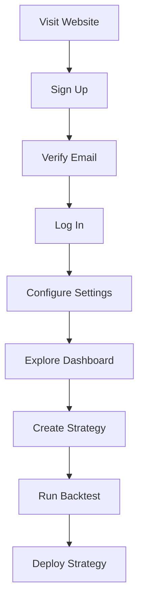
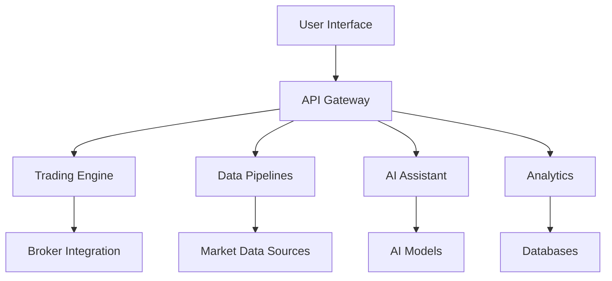
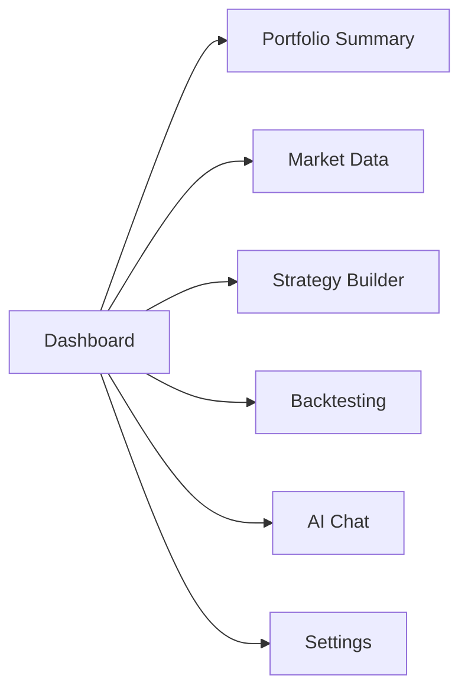
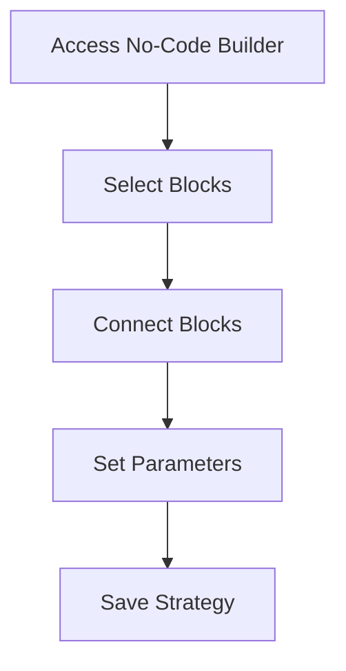
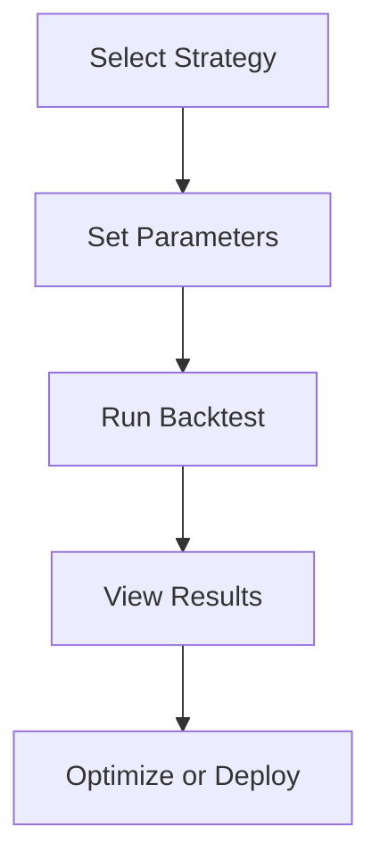

# User Documentation for Algorithmic Trading System (ATS)

## 1. Introduction

Welcome to the **Algorithmic Trading System (ATS)**, a state-of-the-art platform designed to empower traders of all experience levels to develop, test, and execute trading strategies across multiple asset classes. Whether you're a novice trader seeking an intuitive, no-code solution or a seasoned professional requiring advanced tools for high-frequency trading, ATS offers a comprehensive, secure, and scalable environment to meet your needs.

### 1.1 Overview of ATS

ATS is an enterprise-grade trading platform built with a "Best-of-Breed" integration strategy, combining leading open-source technologies such as **NautilusTrader**, **Apache Kafka**, **LangChain**, and **Next.js**. It supports trading in stocks, ETFs, futures, options, forex, and cryptocurrencies, providing real-time data processing, AI-driven insights, and robust analytics. The system is designed with a microservices architecture to ensure modularity, scalability, and high performance, making it suitable for both individual traders and institutional users.

### 1.2 Key Features

- **Multi-Asset Trading**: Execute strategies across diverse asset classes from a single platform.
- **AI-Powered Assistant**: Interact with the system using natural language, generate code, and receive market insights.
- **Real-Time Analytics**: Access live data feeds, advanced forecasting, and portfolio optimization tools.
- **No-Code Strategy Builder**: Create and deploy strategies using a visual drag-and-drop interface.
- **High-Performance Execution**: Benefit from low-latency trade execution (<100ms) and real-time monitoring.
- **Enterprise-Grade Security**: Protect your data and strategies with AES-256 encryption, Zero-Trust architecture, and Role-Based Access Control (RBAC).

### 1.3 Target Audience

- **Non-technical Traders**: Retail investors with basic market knowledge who prefer an accessible, no-code interface.
- **Professional Traders/Analysts**: Experienced users requiring high-performance tools, low-latency execution, and customization options.

---

## 2. Getting Started

This section guides you through the initial steps to set up and start using ATS effectively.

### 2.1 System Requirements

To ensure optimal performance, your system should meet the following minimum requirements:

- **Operating System**: Windows 10+, macOS 10.14+, or Linux (Ubuntu 18.04+)
- **Processor**: Intel Core i5 or equivalent
- **Memory**: 8GB RAM (16GB recommended)
- **Storage**: 10GB free disk space
- **Internet**: Stable broadband connection (10Mbps+)

### 2.2 Account Setup

1. **Visit the ATS Website**: Go to the official ATS website and click "Sign Up."
2. **Enter Details**: Provide your email address and create a strong password.
3. **Verify Email**: Check your inbox for a confirmation link and click it to verify your email.
4. **Complete Profile**: Log in and fill in required details (e.g., name, trading experience).

### 2.3 Initial Configuration

After logging in, configure your account to personalize your trading experience:

1. **Connect Data Sources**:
   - Navigate to "Settings" > "Data Sources."
   - Link to market data providers such as Yahoo Finance or Alpha Vantage by entering API keys if required.
2. **Set Up Broker Accounts**:
   - Go to "Settings" > "Broker Connections."
   - Select a broker (e.g., Interactive Brokers) and input your credentials to enable live trading.
3. **Configure Preferences**:
   - Set your timezone, default currency, and notification preferences under "Settings" > "Preferences."

### 2.4 Quick Start Guide

1. **Log In**: Use your credentials to access the ATS dashboard.
2. **Explore the Dashboard**: View your portfolio summary and real-time market data.
3. **Create a Strategy**: Use the no-code builder or Python Studio to design your first strategy.
4. **Run a Backtest**: Test your strategy with historical data to evaluate performance.
5. **Deploy to Live Trading**: Activate your strategy to start trading with real-time data.

The following diagram illustrates the quick start process:



---

## 3. System Overview

ATS is built with a modular architecture to deliver flexibility and performance. Below is a high-level view of its main components and their interactions.

### 3.1 Architecture Diagram



- **User Interface**: The Next.js-based frontend where you interact with the system.
- **API Gateway**: Routes requests to appropriate services using FastAPI.
- **Trading Engine**: Executes strategies and manages orders with NautilusTrader.
- **Data Pipelines**: Processes real-time market data via Apache Kafka.
- **AI Assistant**: Provides natural language support using LangChain and OpenHands.
- **Analytics**: Generates forecasts and insights with machine learning models.
- **Databases**: Store data in PostgreSQL, ClickHouse, Qdrant, and Apache Iceberg.

### 3.2 Component Roles

- **Trading Engine**: Handles backtesting and live trading across all asset classes.
- **Data Pipelines**: Ensures seamless data flow from external sources to the system.
- **AI Assistant**: Enhances usability with conversational AI and code generation.
- **Analytics**: Offers predictive tools and portfolio management capabilities.

---

## 4. User Interface Guide

The ATS user interface is designed for ease of use and efficiency. Below is an overview of the main dashboard and its components.

### 4.1 Dashboard Overview



- **Portfolio Summary**: Displays your current portfolio value, cash balance, and open positions.
- **Market Data**: Shows real-time price feeds and interactive charts for selected assets.
- **Strategy Builder**: Access the no-code builder or Python Studio to create strategies.
- **Backtesting**: Run simulations on historical data to test your strategies.
- **AI Chat**: Interact with the AI assistant for insights and assistance.
- **Settings**: Configure account preferences, data sources, and broker connections.

### 4.2 Navigation

- **Top Navigation Bar**: Access main sections (Dashboard, Strategies, Analytics, Settings).
- **Sidebar**: Quick links to portfolio details and recent activities.
- **Main Panel**: Displays the selected section’s content (e.g., charts, strategy editor).

---

## 5. Features and Functionalities

This section provides detailed instructions on using ATS’s core features, complete with step-by-step guides and examples.

### 5.1 Strategy Creation

ATS offers two methods to create trading strategies: a no-code builder for beginners and a Python Studio for advanced users.

#### 5.1.1 No-Code Builder (Blockly)

The no-code builder uses a visual, drag-and-drop interface powered by Blockly.

1. **Access the Builder**:
   - From the dashboard, click "Strategy Builder" > "No-Code."
2. **Select Blocks**:
   - Browse categories like "Indicators" (e.g., SMA), "Conditions" (e.g., greater than), and "Actions" (e.g., Buy).
3. **Build Logic**:
   - Drag blocks onto the canvas and connect them to define your strategy.
   - Example: Connect "SMA (50 days)" and "SMA (200 days)" to an "If" block with "SMA50 > SMA200" condition, then add a "Buy" action.
4. **Configure Parameters**:
   - Set values (e.g., SMA period) and select assets (e.g., AAPL) via dropdowns or inputs.
5. **Save and Name**:
   - Enter a name (e.g., "Golden Cross") and description, then click "Save."

**Flowchart**:


#### 5.1.2 Python Studio

For advanced users, Python Studio allows custom coding with full flexibility.

1. **Access the Studio**:
   - From the dashboard, click "Strategy Builder" > "Python Studio."
2. **Write Code**:
   - Use the integrated editor to write Python code, leveraging libraries like TA-Lib.
3. **Test Syntax**:
   - Click "Check Syntax" to validate your code.
4. **Save and Deploy**:
   - Name your strategy and save it for backtesting or live trading.

**Example Code**:
```python
import talib

def run(data):
    sma50 = talib.SMA(data['close'], timeperiod=50)
    sma200 = talib.SMA(data['close'], timeperiod=200)
    if sma50[-1] > sma200[-1] and sma50[-2] <= sma200[-2]:
        return 'buy'
    elif sma50[-1] < sma200[-1] and sma50[-2] >= sma200[-2]:
        return 'sell'
    return 'hold'
```

### 5.2 Backtesting

Backtesting evaluates your strategy’s performance using historical data.

1. **Select Strategy**:
   - Go to "Backtesting" and choose a saved strategy from your library.
2. **Set Parameters**:
   - Define the date range (e.g., 2022-01-01 to 2023-01-01), initial capital (e.g., $10,000), and asset (e.g., BTC/USD).
3. **Run Backtest**:
   - Click "Run" to start the simulation.
4. **Analyze Results**:
   - Review metrics (e.g., total return, Sharpe ratio) and charts (e.g., equity curve).

**Process Diagram**:


### 5.3 Live Trading

Deploy your strategy to execute trades in real-time.

1. **Deploy Strategy**:
   - From the strategy details page, click "Deploy to Live."
2. **Configure Settings**:
   - Set risk parameters (e.g., max position size, stop-loss) and confirm broker connection.
3. **Monitor Trades**:
   - Watch executions and portfolio updates on the dashboard’s order blotter.
4. **Manage Orders**:
   - View, modify, or cancel orders from the "Orders" tab.

**Note**: Ensure your broker account is funded and configured before enabling live trading.

### 5.4 AI Assistant

The AI Assistant enhances your trading experience with conversational support.

1. **Open Chat**:
   - Click the "AI Chat" icon on the dashboard.
2. **Ask Questions**:
   - Type queries like "What’s the trend for ETH/USD?" or "Generate a momentum strategy."
3. **Receive Responses**:
   - Get answers, code snippets, or suggestions in real-time.
4. **Debug Code**:
   - Paste your strategy code and ask for optimization tips (e.g., "Improve this RSI strategy").

**Example Interaction**:
- **User**: "Is it a good time to buy gold?"
- **Assistant**: "Gold shows a bullish trend with a 3% increase this week and RSI at 58. Consider buying if it breaks $1,900."

### 5.5 Analytics

Access advanced tools for forecasting and portfolio management.

- **Forecasting**:
  1. Go to "Analytics" > "Forecasting."
  2. Select an asset (e.g., SPY) and model (e.g., LSTM).
  3. View predicted price trends and confidence intervals.
- **Portfolio Optimization**:
  1. Go to "Analytics" > "Portfolio Optimization."
  2. Input risk tolerance and goals.
  3. Receive suggested asset allocations.
- **Risk Management**:
  1. Monitor real-time metrics like Value at Risk (VaR) on the dashboard.
  2. Set alerts for exposure thresholds.

---

## 6. Tutorials and Examples

These hands-on tutorials demonstrate how to use ATS effectively.

### 6.1 Tutorial 1: Creating a Moving Average Crossover Strategy

**Objective**: Build a simple strategy using the no-code builder.

**Steps**:
1. Navigate to "Strategy Builder" > "No-Code."
2. Drag an "SMA" block (set to 50 days) and another (set to 200 days) from "Indicators."
3. Add an "If" block from "Conditions" and set "SMA50 > SMA200."
4. Connect a "Buy" action to the "If" block.
5. Save as "Golden Cross" and select "AAPL" as the asset.
6. Run a backtest over the past year and review results.

**Outcome**: A strategy that buys when the 50-day SMA crosses above the 200-day SMA.

### 6.2 Tutorial 2: Using the AI Assistant for Market Analysis

**Objective**: Gain insights into market trends.

**Steps**:
1. Open "AI Chat" from the dashboard.
2. Type "Analyze recent trends in the Nasdaq 100."
3. Review the assistant’s response (e.g., trend direction, key indicators).
4. Ask "What sectors are performing best?" for deeper analysis.

**Outcome**: Actionable insights to inform your trading decisions.

### 6.3 Tutorial 3: Setting Up Live Trading

**Objective**: Deploy a strategy for real-time trading.

**Steps**:
1. Go to "Settings" > "Broker Connections" and connect Interactive Brokers.
2. Select a tested strategy (e.g., "Golden Cross").
3. Click "Deploy to Live" and set a $5,000 position limit.
4. Monitor trades on the dashboard’s order blotter.

**Outcome**: Your strategy executes trades automatically based on market conditions.

---

## 7. Troubleshooting and FAQs

### 7.1 Common Issues

- **Issue**: Unable to connect to data source.
  - **Solution**: Verify your internet connection and check API keys in "Settings" > "Data Sources."
- **Issue**: Strategy code has errors.
  - **Solution**: Use the Python Studio’s syntax checker or ask the AI Assistant for debugging help.
- **Issue**: Slow trade execution.
  - **Solution**: Ensure a stable, high-speed internet connection and contact support if persistent.

### 7.2 FAQs

- **Q**: Can I connect multiple brokers?
  - **A**: Yes, configure each broker in "Settings" > "Broker Connections."
- **Q**: How do I edit a live strategy?
  - **A**: Pause the strategy in "Strategies," edit in Python Studio or the no-code builder, and redeploy.
- **Q**: Is my data secure?
  - **A**: Yes, ATS uses AES-256 encryption, Zero-Trust architecture, and immutable audit trails.

---

## 8. Glossary and References

### 8.1 Glossary

- **Backtesting**: Simulating a strategy with historical data to assess performance.
- **Slippage**: Difference between expected and actual trade prices.
- **Order Types**: Instructions for trade execution (e.g., Market, Limit).

### 8.2 References

- **NautilusTrader Documentation**: [https://nautilustrader.io/](https://nautilustrader.io/)
- **Apache Kafka Documentation**: [https://kafka.apache.org/](https://kafka.apache.org/)
- **LangChain Documentation**: [https://langchain.com/](https://langchain.com/)

---

This User Documentation provides a detailed guide to mastering the Algorithmic Trading System (ATS). For additional support, contact our help center or explore the community forums. Happy trading!