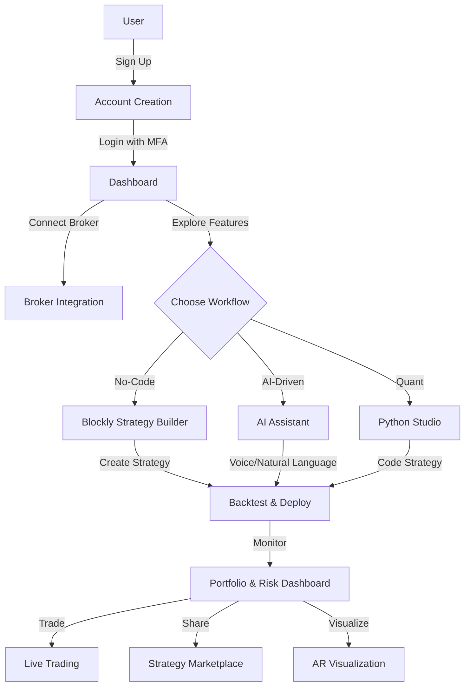
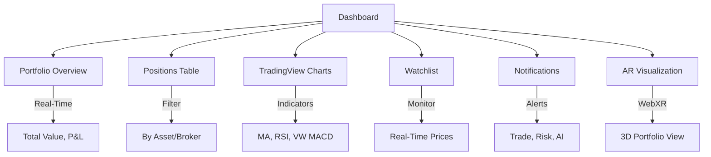

## **Nautilus Trader User Documentation**

**Welcome to Nautilus Trader!** 🚀

| **Version:**      | 3.0                          |
|:----------------- |:---------------------------- |
| **Last Updated:** | August 21, 2025             |
| **Audience:**     | All Users                   |

---

### **1.0 Introduction**

Welcome to Nautilus Trader, an enterprise-grade algorithmic trading platform designed to empower users ranging from novice retail investors to professional quantitative analysts. Built on a cloud-native, event-driven microservices architecture, Nautilus Trader integrates cutting-edge technologies to provide a seamless, secure, and powerful trading experience. The platform supports multi-asset trading (stocks, ETFs, futures, options, forex, commodities, cryptocurrencies) and offers features such as no-code strategy development, AI-driven analytics, voice trading, augmented reality (AR) visualizations, and a Strategy Marketplace for sharing and discovering trading strategies.

This comprehensive user guide provides detailed instructions for setting up your account, navigating the platform, creating and deploying trading strategies, leveraging advanced features, and troubleshooting issues. Whether you prefer a visual no-code interface, natural language commands, or professional-grade Python development, Nautilus Trader adapts to your workflow.

**Mermaid Diagram: User Workflow Overview**



---

### **2.0 Getting Started**

#### **2.1 Creating Your Account**

1. **Navigate to the Platform:**
   - Visit `https://app.nautilus-trader.com` or download the Nautilus Trader mobile app (iOS/Android) or desktop app (Electron).
   - Click **"Sign Up"** to begin.

2. **Enter Details:**
   - Provide your email, full name, and a strong password (minimum 12 characters, including uppercase, lowercase, numbers, and symbols).
   - Accept the terms of service and privacy policy.

3. **Verify Email:**
   - Check your inbox for a verification email from `no-reply@nautilus-trader.com`.
   - Click the verification link to activate your account.

#### **2.2 First Login & Securing Your Account**

Security is paramount at Nautilus Trader. Multi-Factor Authentication (MFA) is mandatory to protect your account.

1. **Login:**
   - Use your email and password at `https://app.nautilus-trader.com/login`.
   - Alternatively, use single sign-on (SSO) via Keycloak (supports Google, GitHub, or enterprise OAuth 2.0/OIDC providers).

2. **Set Up MFA:**
   - On first login, you’ll be prompted to enable MFA.
   - Download an authenticator app (e.g., Google Authenticator, Authy, or Microsoft Authenticator).
   - Scan the displayed QR code using your authenticator app.
   - Enter the 6-digit code generated by the app to complete setup.
   - **Backup Codes:** Save the provided backup codes in a secure location for emergency access.

3. **Session Management:**
   - Sessions expire after 24 hours or on logout.
   - Monitor active sessions in the **"Settings"** > **"Security"** tab and revoke unauthorized sessions.

#### **2.3 Connecting a Brokerage Account**

Nautilus Trader integrates with leading brokers to manage your trades securely.

1. **Access Broker Settings:**
   - From the dashboard, navigate to **"Settings"** > **"Broker Integrations"**.

2. **Select Broker:**
   - Choose from supported brokers: Interactive Brokers, Alpaca, OANDA, Coinbase, Binance, etc.
   - Click **"Add New Broker"**.

3. **Enter API Credentials:**
   - Obtain API keys from your broker’s platform (e.g., IBKR Client Portal, Alpaca Dashboard).
   - Enter the API key, secret, and any additional credentials (e.g., account ID).
   - Credentials are encrypted with AES-256 and stored in HashiCorp Vault.

4. **Verify Connection:**
   - The platform tests the connection and displays your account balance and positions.
   - Enable trading permissions (e.g., read-only, trade execution) as needed.

**Note:** Never share your API keys. Nautilus Trader does not store funds; all assets remain with your broker.

#### **2.4 System Requirements**

- **Web:** Chrome, Firefox, Safari, or Edge (latest versions).
- **Mobile:** iOS 15+ or Android 10+.
- **Desktop:** Windows 10+, macOS 11+, or Linux (Ubuntu 20.04+).
- **Internet:** Stable connection with >10 Mbps download speed for real-time data.

---

### **3.0 Navigating the Dashboard**

The Nautilus Trader dashboard is your central hub for trading, monitoring, and analysis, built with React 18/Next.js for web and React Native for mobile.

- **Portfolio Overview:**
  - Displays total portfolio value, cash balance, unrealized P&L, and realized P&L (daily/weekly/monthly).
  - Multi-asset support: stocks, ETFs, futures, options, forex, commodities, cryptocurrencies.

- **Positions Table:**
  - Lists open positions with details: symbol, quantity, average entry price, market value, unrealized P&L.
  - Filter by asset class or broker account.

- **TradingView Charts:**
  - Interactive charts with >100 technical indicators (e.g., VW MACD, RSI, Bollinger Bands).
  - Supports tick, bar, and candlestick data with customizable timeframes (1m, 5m, 1h, 1d).
  - Integrates market data from Yahoo Finance, Finnhub, and brokers.

- **Watchlist:**
  - Add assets to monitor (e.g., AAPL, BTC/USD, ES futures).
  - Real-time price updates via WebSocket (>1M messages/s throughput).

- **Notifications Panel:**
  - Real-time alerts for trade executions, risk thresholds, AI insights, and system events.
  - Configurable delivery: in-app, email, SMS, or push notifications.

- **AR Visualization (WebXR):**
  - Access via **"Portfolio"** > **"AR View"** on supported devices (e.g., Meta Quest, WebXR-enabled browsers).
  - Visualize portfolio performance and market trends in 3D.

**Mermaid Diagram: Dashboard Components**



---

### **4.0 Trading Workflows**

Nautilus Trader offers three flexible workflows to suit all skill levels.

#### **4.1 No-Code Strategy Builder**

The No-Code Strategy Builder uses **Blockly** for visual, drag-and-drop strategy creation, ideal for non-technical users.

**Steps to Create a Strategy:**

1. **Access Builder:**
   - Navigate to **"Strategies"** > **"No-Code Builder"**.

2. **Build Strategy:**
   - Drag blocks to define conditions (e.g., “If RSI > 70, sell 100 shares”).
   - Supported blocks: technical indicators (VW MACD, Bollinger Bands), order types (Market, Limit, Stop, VWAP, TWAP, Iceberg), and risk rules.

3. **Backtest:**
   - Click **"Backtest"** to test against historical data (>5 years, sourced from ClickHouse).
   - Review metrics: Sharpe Ratio, max drawdown, annualized return.

4. **Deploy:**
   - Select a broker account and click **"Deploy"** to run live.
   - Monitor performance in the dashboard.

**Example: Simple Moving Average Crossover**

```mermaid
graph TD
    A[Start] --> B[Get SMA(20)]
    B --> C[Get SMA(50)]
    C --> D{Price > SMA(20) & SMA(20) > SMA(50)?}
    D -->|Yes| E[Place Buy Order]
    D -->|No| F{Price < SMA(20) & SMA(20) < SMA(50)?}
    F -->|Yes| G[Place Sell Order]
    F -->|No| H[Do Nothing]
```

#### **4.2 AI Assistant**

The **Agentic AI Assistant** (powered by LangGraph and RAGFlow) enables natural language or voice-driven trading and analysis.

**Key Features:**

- **Natural Language Queries:**
  - Example: “Backtest a VW MACD strategy on AAPL for the last 3 years.”
  - The AI retrieves data from ClickHouse, runs the backtest, and displays results (e.g., Sharpe Ratio >1.5).

- **Voice Trading (Whisper):**
  - Example: “Buy 100 shares of TSLA at market.”
  - Whisper transcribes with >95% accuracy, converts to a command, and routes to the Order Management System (OMS).

- **Document Analysis (RAG):**
  - Upload PDFs (e.g., SEC filings, research reports) via **"AI Assistant"** > **"Upload Document"**.
  - Query: “What are the key risks in Tesla’s latest 10-K?”
  - The AI uses Qdrant/pgvector embeddings to provide cited answers.

- **Complex Workflows:**
  - Example: “If SPY’s RSI is >80 and sentiment is positive, buy 50 shares and set a 2% stop loss.”
  - The AI orchestrates multiple services (Market Scanner, AI Assistant, OMS) via Kafka.

**Accessing the AI Assistant:**

- **Web/Mobile:** Use the chat interface in the dashboard.
- **Voice:** Click the microphone icon or use the mobile app’s voice feature.
- **API:** Send queries via REST/GraphQL (`POST /ai/query`).

#### **4.3 Python Studio**

The **Python Studio** is a browser-based IDE for professional quants, built on the NautilusTrader framework.

**Key Features:**

- **NautilusTrader Integration:** Write high-performance strategies in Python 3.10+.
- **AI Co-pilot (OpenHands):** Debug and optimize code with natural language prompts (e.g., “@OpenHands, fix this KeyError”).
- **Backtesting and Deployment:** Run event-driven backtests and deploy to live accounts.
- **Libraries:** Access QuantLib, PyPortfolioOpt, FinRL, and VectorBT.

**Example Strategy: Momentum**

```python
from nautilus_trader.model.strategy import Strategy
from nautilus_trader.model.data import Bar
from nautilus_trader.indicators.momentum import Momentum

class MomentumStrategy(Strategy):
    def __init__(self, period=14):
        super().__init__()
        self.momentum = Momentum(period=period)
        self.add_indicator(self.momentum)

    def on_start(self):
        self.subscribe_bars("AAPL")

    def on_bar(self, bar: Bar):
        if self.momentum.is_ready:
            if self.momentum.value > 0:
                self.submit_order(
                    order_type="MARKET",
                    side="BUY",
                    quantity=100
                )
            elif self.momentum.value < 0:
                self.submit_order(
                    order_type="MARKET",
                    side="SELL",
                    quantity=100
                )
```

**Steps to Use Python Studio:**

1. Navigate to **"Strategies"** > **"Python Studio"**.
2. Write or import your strategy.
3. Backtest using historical data or paper trading.
4. Deploy to a live account via the OMS.

---

### **5.0 Advanced Features**

#### **5.1 Portfolio & Risk Management**

- **Risk Dashboard:**
  - Access via **"Portfolio"** > **"Risk"**.
  - Metrics: Value at Risk (VaR), expected shortfall, sector exposure, liquidity risk.
  - Powered by PyOD (anomaly detection) and SHAP (explainability).

- **Portfolio Optimization:**
  - Use PyPortfolioOpt and Riskfolio-Lib to optimize allocations.
  - Example: Maximize Sharpe Ratio with a 10% volatility constraint.
  - Access via **"Portfolio"** > **"Optimize"**.

- **Real-Time Monitoring:**
  - View portfolio metrics in real-time via Redis-backed updates.
  - Set risk alerts (e.g., VaR >5%) in **"Settings"** > **"Alerts"**.

#### **5.2 Strategy Marketplace**

- **Discover Strategies:**
  - Browse community strategies in **"Marketplace"**.
  - Filter by performance (Sharpe Ratio, drawdown), asset class, or creator.

- **Publish Strategies:**
  - Share your strategy via **"Strategies"** > **"Publish to Marketplace"**.
  - Set permissions (public, private, or subscription-based).

- **Copy Trading:**
  - Subscribe to a strategy to replicate its trades in your account.
  - Configure risk parameters (e.g., position sizing) before activation.

#### **5.3 Market Scanner**

- **Custom Scans:**
  - Create scans in **"Market Scanner"** using indicators (e.g., VW MACD, RSI).
  - Example: Find stocks with RSI >70 and volume >1M.

- **Real-Time Results:**
  - Results update via WebSocket and are stored in ClickHouse.
  - Export to CSV or integrate with strategies.

#### **5.4 Voice Trading**

- **Setup:**
  - Enable in **"Settings"** > **"Voice Trading"**.
  - Requires microphone access on web/mobile.

- **Commands:**
  - Examples: “Place a VWAP order for 200 SPY shares,” “Cancel all open orders.”
  - Processed by Whisper with >95% transcription accuracy.

#### **5.5 AR Visualization**

- **Access:**
  - Navigate to **"Portfolio"** > **"AR View"**.
  - Requires WebXR-compatible device or browser.

- **Features:**
  - 3D visualizations of portfolio performance, correlations, and market trends.
  - Interact with gestures or voice commands (e.g., “Zoom in on tech sector”).

#### **5.6 Market Microstructure Analysis**

- **Access:**
  - Available in **"Analytics"** > **"Microstructure"**.
  - Analyzes order book dynamics, liquidity, and slippage.

- **Use Case:**
  - Optimize VWAP/TWAP execution by analyzing bid-ask spreads and volume profiles.

#### **5.7 Compliance Reporting**

- **Automated Reports:**
  - Generate MiFID II, SOX, or GDPR-compliant reports in **"Compliance"**.
  - Stored in Apache Iceberg for auditability.

- **Export:**
  - Download as PDF or share with regulators via secure API.

---

### **6.0 Security & Account Settings**

- **Profile Management:**
  - Update email, name, or password in **"Settings"** > **"Profile"**.

- **API Keys:**
  - Generate keys for programmatic access in **"Settings"** > **"API Keys"**.
  - Restrict to read-only or trading permissions.

- **MFA and SSO:**
  - Reset MFA or configure SSO in **"Settings"** > **"Security"**.

- **Audit Logs:**
  - View account activity (logins, trades) in **"Settings"** > **"Audit"**.
  - Logs stored immutably in Apache Iceberg.

---

### **7.0 Troubleshooting & Support**

- **Help Center:**
  - Access FAQs and tutorials at `https://help.nautilus-trader.com`.

- **Customer Service Bot:**
  - Chat with the bot (Lobe Chat) in **"Support"** > **"Chat"**.
  - Example: “Why is my order not executing?”

- **Contact Support:**
  - Submit a ticket via **"Support"** > **"Contact Us"**.
  - Email: `support@nautilus-trader.com`.

- **Common Issues:**
  - **Broker Connection Failure:** Verify API keys and network connectivity.
  - **Backtest Errors:** Ensure sufficient historical data (>5 years recommended).
  - **Voice Command Issues:** Check microphone permissions and speak clearly.

---

### **8.0 Glossary**

- **Agentic AI:** A system of specialized AI agents collaborating to solve complex tasks.
- **Backtesting:** Testing a strategy on historical data to evaluate performance.
- **RAG (Retrieval-Augmented Generation):** AI technique combining document retrieval with natural language generation.
- **Sharpe Ratio:** Risk-adjusted return metric (higher is better).
- **VaR (Value at Risk):** Quantifies potential portfolio loss over a time frame.
- **VWAP/TWAP:** Volume/Time-Weighted Average Price for optimized trade execution.
- **Market Microstructure:** Analysis of order book dynamics and trading mechanisms.

---

This User Documentation provides a detailed guide to using the Nautilus Trader ATS, incorporating all features from the updated "Features, Phases & Integration Strategy - Algorithmic Trading System" document. It uses Mermaid diagrams and examples to ensure clarity for all users.

