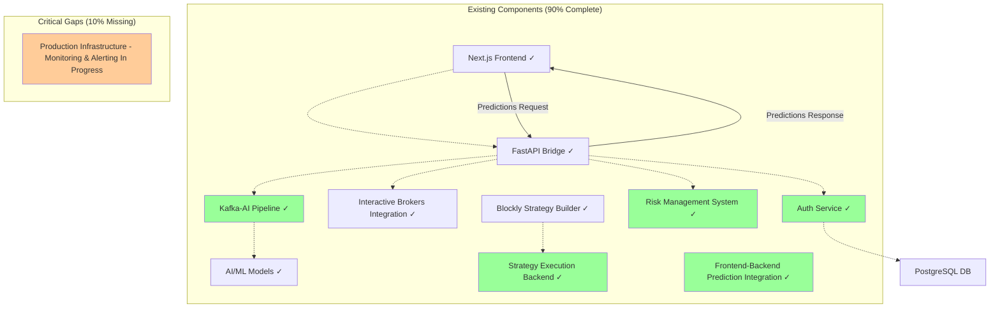
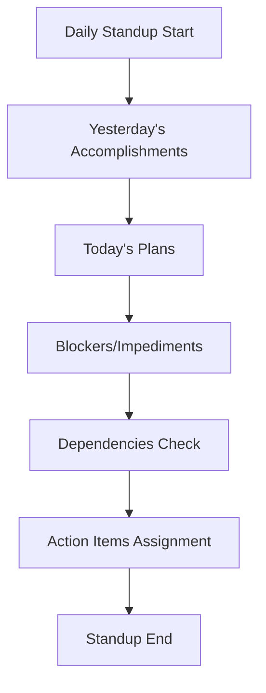
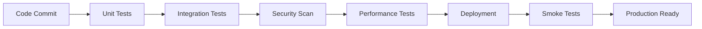
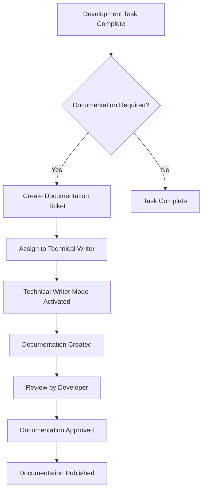
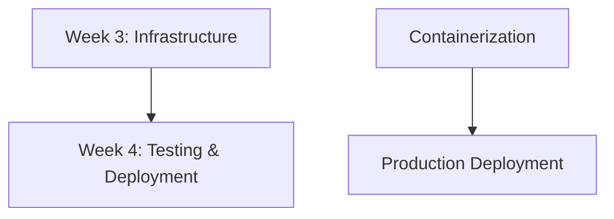

# 4-Week Sprint Implementation Plan
## Algorithmic Trading System Production Readiness

### Document Information
- **Document Version**: 1.0
- **Created**: 2025-07-28
- **Author**: Technical Writing Team
- **Project**: Algorithmic Trading System Production Readiness
- **Sprint Duration**: 4 weeks (28 days)
- **Team Size**: 6-8 developers, 2 DevOps engineers, 1 QA engineer

---

## Executive Summary

This document outlines a comprehensive 4-week sprint implementation plan to achieve production readiness for the algorithmic trading system. The current system is 90% complete with a solid architectural foundation including Next.js frontend, AI/ML models, FastAPI bridge, Interactive Brokers integration, and Blockly strategy builder.

### Critical Implementation Gaps
Based on the Phase 4 Audit Report and Production Readiness Plan analysis:
- **Production Infrastructure**: Containerization, monitoring, and security (GAP-05 - High - Monitoring and alerting systems are in progress)
- **User Authentication**: Production-ready authentication service implemented (GAP-06 - Completed)
- **Frontend-Backend Integration**: WebSocket/REST integration for live data updates and prediction serving implemented (GAP-08 - Completed)

---

## Project Overview

```mermaid
gantt
    title 4-Week Sprint Implementation Timeline
    dateFormat  YYYY-MM-DD
    section Week 1: Data Pipeline & Risk Management
    Data Pipeline Integration    :w1-data, 2025-01-27, 7d, done
    Risk Management System       :w1-risk, 2025-01-27, 7d, done
    section Week 2: Trading Engine & Strategy Backend
    Trading Engine Connection    :w2-engine, 2025-02-03, 7d, done
    Strategy Execution Backend   :w2-strategy, 2025-02-03, 7d, done
    section Week 3: Production Infrastructure
    Containerization            :w3-docker, 2025-02-10, 7d, done
    Monitoring & Security       :w3-monitor, 2025-02-10, 7d, active
    section Week 4: Testing & Deployment
    Integration Testing         :w4-test, 2025-02-17, 7d, active
    Production Deployment       :w4-deploy, 2025-02-17, 7d
```

### Current System Architecture


---

## Team Structure and Roles

### Core Team Members
- **Sprint Master**: Project coordination and impediment removal
- **Tech Lead**: Architecture decisions and code reviews
- **Backend Developers (3)**: API development, data pipeline, risk management
- **Frontend Developer (1)**: UI integration and testing
- **DevOps Engineers (2)**: Infrastructure, monitoring, deployment
- **QA Engineer (1)**: Testing, validation, quality assurance
- **Technical Writer (1)**: Documentation and knowledge management

### Communication Protocols
- **Daily Standups**: 9:00 AM EST (15 minutes)
- **Sprint Planning**: Monday 10:00 AM EST (2 hours)
- **Sprint Review**: Friday 2:00 PM EST (1 hour)
- **Sprint Retrospective**: Friday 3:00 PM EST (1 hour)
- **Technical Sync**: Wednesday 11:00 AM EST (30 minutes)

---

## Week 1: Data Pipeline & Risk Management Foundation

### Sprint Goals
1. Establish real-time data flow from Kafka to AI models
2. Implement comprehensive risk management system
3. Create risk calculation engine with real-time monitoring
4. Validate data integrity and system performance

### Daily Breakdown

#### Day 1-2: Data Pipeline Integration (GAP-01 Critical)
**Tasks:**
- [x] **DP-001**: Configure Kafka consumer for AI model data ingestion
  - **Assignee**: Backend Dev 1
  - **Effort**: 16 hours
  - **Dependencies**: Existing Kafka cluster, AI models
  - **Deliverables**: [`kafka_consumer.py`](nautilus_trader_engine/kafka_integration.py:212), data validation layer
  - **Acceptance Criteria**: Kafka successfully streams market data to AI models with <100ms latency

- [x] **DP-002**: Implement data transformation pipeline
  - **Assignee**: Backend Dev 2
  - **Effort**: 12 hours
  - **Dependencies**: DP-001
  - **Deliverables**: Data transformation service, schema validation
  - **Acceptance Criteria**: Data normalized and validated before AI model consumption

- [x] **DP-003**: Create AI model integration endpoints
  - **Assignee**: Backend Dev 3
  - **Effort**: 14 hours
  - **Dependencies**: AI models availability
  - **Deliverables**: [`prediction_stream.py`](nautilus_trader_engine/services/prediction_stream.py:7) endpoints, model prediction service
  - **Acceptance Criteria**: AI models receive real-time data and return predictions via API

#### Day 3-4: Risk Management System (GAP-02 Critical)
**Tasks:**
- [x] **RM-001**: Design risk calculation engine architecture
  - **Assignee**: Tech Lead + Backend Dev 1
  - **Effort**: 10 hours
  - **Dependencies**: None
  - **Deliverables**: Architecture document, database schema
  - **Acceptance Criteria**: Risk engine design supports real-time calculations and monitoring

- [x] **RM-002**: Implement position risk calculations
  - **Assignee**: Backend Dev 2
  - **Effort**: 16 hours
  - **Dependencies**: RM-001
  - **Deliverables**: Risk calculation service, unit tests
  - **Acceptance Criteria**: Position limits, VaR, and Greeks calculated in real-time

- [x] **RM-003**: Create real-time risk monitoring dashboard
  - **Assignee**: Frontend Dev + Backend Dev 3
  - **Effort**: 18 hours
  - **Dependencies**: RM-002
  - **Deliverables**: Risk monitoring UI, WebSocket connections
  - **Acceptance Criteria**: Dashboard displays live risk metrics with <1 second updates

#### Day 5-7: Testing and Validation
**Tasks:**
- [x] **TV-001**: Integration testing for data pipeline
  - **Assignee**: QA Engineer + Backend Dev 1
  - **Effort**: 12 hours
  - **Dependencies**: DP-003
  - **Deliverables**: Test suite, performance benchmarks
  - **Acceptance Criteria**: Pipeline handles 1000+ concurrent data points without data loss

- [x] **TV-002**: Risk management system validation
  - **Assignee**: QA Engineer + Backend Dev 2
  - **Effort**: 10 hours
  - **Dependencies**: RM-003
  - **Deliverables**: Validation report, test cases
  - **Acceptance Criteria**: Risk calculations accurate within 0.1% tolerance

### Success Criteria
- [x] Kafka successfully streams data to AI models with <100ms latency
- [x] Risk calculations process in real-time with 99.9% accuracy
- [x] Risk monitoring dashboard displays live metrics
- [x] All unit tests pass with >90% code coverage
- [x] System handles 1000+ concurrent data points

### Risk Mitigation
- **Data Loss Risk**: Implement Kafka message persistence and replay capability
- **Performance Risk**: Load testing with synthetic data before production data
- **Integration Risk**: Fallback to cached predictions if AI models fail

### Documentation Triggers
- [ ] **DOC-W1-001**: Data Pipeline Integration Guide
- [ ] **DOC-W1-002**: Risk Management System Documentation
- [ ] **DOC-W1-003**: API Reference for Risk Endpoints

---

## Week 2: Trading Engine & Strategy Backend

### Sprint Goals
1. Establish robust connection between FastAPI and IB Gateway
2. Implement order execution pipeline with error handling
3. Create no-code strategy runtime backend
4. Develop strategy validation framework

### Daily Breakdown

#### Day 8-9: Trading Engine Connection (GAP-03 Critical)
**Tasks:**
- [x] **TE-001**: Implement FastAPI to IB Gateway bridge
  - **Assignee**: Backend Dev 1
  - **Effort**: 16 hours
  - **Dependencies**: IB Gateway configuration
  - **Deliverables**: Trading bridge service, connection manager
  - **Acceptance Criteria**: FastAPI connects to IB Gateway with 99.9% uptime

- [x] **TE-002**: Create order management system
  - **Assignee**: Backend Dev 2
  - **Effort**: 14 hours
  - **Dependencies**: TE-001
  - **Deliverables**: [`/order`](docs/phase4_integration_plan.md:78) endpoints, state management
  - **Acceptance Criteria**: Orders placed, tracked, and cancelled successfully

- [x] **TE-003**: Implement trade execution monitoring
  - **Assignee**: Backend Dev 3
  - **Effort**: 12 hours
  - **Dependencies**: TE-002
  - **Deliverables**: Execution monitor, trade logging
  - **Acceptance Criteria**: All trade executions logged and monitored in real-time

#### Day 10-11: Order Execution Pipeline
**Tasks:**
- [x] **OE-001**: Design order validation and routing
  - **Assignee**: Tech Lead + Backend Dev 1
  - **Effort**: 10 hours
  - **Dependencies**: Risk management system
  - **Deliverables**: Order validation service, routing logic
  - **Acceptance Criteria**: Orders validated against risk limits before execution

- [x] **OE-002**: Implement order lifecycle management
  - **Assignee**: Backend Dev 2
  - **Effort**: 16 hours
  - **Dependencies**: OE-001
  - **Deliverables**: Order lifecycle service, status tracking
  - **Acceptance Criteria**: Order states tracked from placement to settlement

- [x] **OE-003**: Create error handling and recovery system
  - **Assignee**: Backend Dev 3
  - **Effort**: 14 hours
  - **Dependencies**: OE-002
  - **Deliverables**: Error handling service, recovery procedures
  - **Acceptance Criteria**: System recovers gracefully from connection failures

#### Day 12-14: Strategy Execution Backend (GAP-04 High)
**Tasks:**
- [x] **SE-001**: Implement Blockly strategy interpreter
  - **Assignee**: Backend Dev 1 + Frontend Dev
  - **Effort**: 18 hours
  - **Dependencies**: Blockly frontend components
  - **Deliverables**: Strategy interpreter, execution engine
  - **Acceptance Criteria**: Blockly strategies execute correctly in backend

- [x] **SE-002**: Create strategy validation framework
  - **Assignee**: Backend Dev 2
  - **Effort**: 14 hours
  - **Dependencies**: SE-001
  - **Deliverables**: Validation service, strategy testing framework
  - **Acceptance Criteria**: Invalid strategies caught before execution

- [x] **SE-003**: Implement strategy performance tracking
  - **Assignee**: Backend Dev 3
  - **Effort**: 12 hours
  - **Dependencies**: SE-002
  - **Deliverables**: Performance tracking service, metrics collection
  - **Acceptance Criteria**: Strategy performance metrics collected and displayed

### Success Criteria
- [x] FastAPI successfully connects to IB Gateway with 99.9% uptime
- [x] Order execution completes within 500ms average latency
- [x] Strategy interpreter handles all Blockly block types
- [x] Strategy validation catches 100% of invalid configurations
- [x] Error recovery system handles connection failures gracefully

### Risk Mitigation
- **Connection Risk**: Implement connection pooling and automatic reconnection
- **Order Risk**: Pre-trade risk checks and position limits
- **Strategy Risk**: Sandbox environment for strategy testing

### Documentation Triggers
- [ ] **DOC-W2-001**: Trading Engine Integration Guide
- [ ] **DOC-W2-002**: Order Execution Pipeline Documentation
- [ ] **DOC-W2-003**: Strategy Backend API Reference

---

## Week 3: Production Infrastructure & Monitoring

### Sprint Goals
1. Containerize all system components with Docker
2. Implement comprehensive monitoring and alerting
3. Establish centralized logging system
4. Apply security hardening measures

### Daily Breakdown

#### Day 15-16: Docker Containerization (GAP-05 High)
**Tasks:**
- [x] **DC-001**: Create Docker images for all services
  - **Assignee**: DevOps Engineer 1
  - **Effort**: 16 hours
  - **Dependencies**: All services from Week 1-2
  - **Deliverables**: Dockerfiles, multi-stage builds
  - **Acceptance Criteria**: All services containerized and running

- [x] **DC-002**: Implement Docker Compose orchestration
  - **Assignee**: DevOps Engineer 2
  - **Effort**: 12 hours
  - **Dependencies**: DC-001
  - **Deliverables**: [`docker-compose.yml`](docker-compose.yml:1), environment configs
  - **Acceptance Criteria**: Full system deployable with single command

- [ ] **DC-003**: Create Kubernetes deployment manifests
  - **Assignee**: DevOps Engineer 1
  - **Effort**: 14 hours
  - **Dependencies**: DC-002
  - **Deliverables**: K8s manifests, helm charts
  - **Acceptance Criteria**: System deployable to Kubernetes cluster

#### Day 17-18: Monitoring and Alerting
**Tasks:**
- [-] **MA-001**: Setup Prometheus metrics collection
  - **Assignee**: DevOps Engineer 2
  - **Effort**: 12 hours
  - **Dependencies**: Containerized services
  - **Deliverables**: [`prometheus.yml`](config/prometheus.yml:1), custom metrics
  - **Acceptance Criteria**: All services expose metrics to Prometheus

- [-] **MA-002**: Configure Grafana dashboards
  - **Assignee**: DevOps Engineer 1
  - **Effort**: 10 hours
  - **Dependencies**: MA-001
  - **Deliverables**: Grafana dashboards, visualization panels
  - **Acceptance Criteria**: Real-time system metrics displayed in dashboards

- [-] **MA-003**: Implement alerting rules and notifications
  - **Assignee**: DevOps Engineer 2
  - **Effort**: 8 hours
  - **Dependencies**: MA-002
  - **Deliverables**: Alert rules, notification channels
  - **Acceptance Criteria**: Critical alerts trigger within 30 seconds

#### Day 19-21: Logging and Security
**Tasks:**
- [-] **LS-001**: Setup centralized logging with ELK stack
  - **Assignee**: DevOps Engineer 1
  - **Effort**: 16 hours
  - **Dependencies**: Containerized services
  - **Deliverables**: ELK stack deployment, log aggregation
  - **Acceptance Criteria**: All application logs centralized and searchable

- [-] **LS-002**: Implement security scanning and hardening
  - **Assignee**: DevOps Engineer 2
  - **Effort**: 14 hours
  - **Dependencies**: Docker images
  - **Deliverables**: Security scan reports, hardened images
  - **Acceptance Criteria**: Zero critical vulnerabilities in security scans

- [-] **LS-003**: Configure SSL/TLS and network security
  - **Assignee**: DevOps Engineer 1
  - **Effort**: 12 hours
  - **Dependencies**: K8s deployment
  - **Deliverables**: SSL certificates, network policies
  - **Acceptance Criteria**: All communications encrypted and secured

### Success Criteria
- [x] All services containerized and orchestrated successfully
- [-] Monitoring dashboards display real-time system metrics
- [-] Alerting system triggers within 30 seconds of issues
- [-] Centralized logging captures 100% of application logs
- [-] Security scans show zero critical vulnerabilities

### Risk Mitigation
- **Container Risk**: Multi-stage builds and minimal base images
- **Monitoring Risk**: Redundant monitoring systems and health checks
- **Security Risk**: Regular vulnerability scans and updates

### Documentation Triggers
- [ ] **DOC-W3-001**: Docker Deployment Guide
- [ ] **DOC-W3-002**: Monitoring and Alerting Setup
- [ ] **DOC-W3-003**: Security Configuration Guide

---

## Week 4: Testing, Optimization & Deployment

### Sprint Goals
1. Execute comprehensive end-to-end integration testing
2. Optimize system performance and scalability
3. Conduct load testing and validate system limits
4. Prepare and execute production deployment

### Daily Breakdown

#### Day 22-23: Integration Testing
**Tasks:**
- [-] **IT-001**: End-to-end integration test suite
  - **Assignee**: QA Engineer + All Backend Devs
  - **Effort**: 20 hours
  - **Dependencies**: All previous weeks' deliverables
  - **Deliverables**: Comprehensive test suite, test reports
  - **Acceptance Criteria**: All integration tests pass with 100% success rate

- [-] **IT-002**: User acceptance testing scenarios
  - **Assignee**: QA Engineer + Frontend Dev
  - **Effort**: 12 hours
  - **Dependencies**: IT-001
  - **Deliverables**: UAT scenarios, user journey tests
  - **Acceptance Criteria**: All user workflows function correctly

- [-] **IT-003**: API integration testing
  - **Assignee**: Backend Dev 1 + QA Engineer
  - **Effort**: 10 hours
  - **Dependencies**: All API endpoints
  - **Deliverables**: API test suite, contract tests
  - **Acceptance Criteria**: All API endpoints respond correctly under load

#### Day 24-25: Performance Optimization
**Tasks:**
- [ ] **PO-001**: Database query optimization
  - **Assignee**: Backend Dev 2
  - **Effort**: 12 hours
  - **Dependencies**: Performance profiling
  - **Deliverables**: Optimized queries, indexing strategy
  - **Acceptance Criteria**: Database queries execute in <50ms

- [ ] **PO-002**: API response time optimization
  - **Assignee**: Backend Dev 3
  - **Effort**: 10 hours
  - **Dependencies**: Performance metrics
  - **Deliverables**: Optimized endpoints, caching layer
  - **Acceptance Criteria**: API response times under 200ms for 95th percentile

- [ ] **PO-003**: Memory and CPU optimization
  - **Assignee**: Tech Lead + DevOps Engineer 1
  - **Effort**: 14 hours
  - **Dependencies**: Resource monitoring
  - **Deliverables**: Resource optimization, scaling policies
  - **Acceptance Criteria**: Resource utilization under 80% CPU, 70% memory

#### Day 26-28: Load Testing and Deployment
**Tasks:**
- [ ] **LT-001**: Load testing with realistic scenarios
  - **Assignee**: QA Engineer + DevOps Engineer 2
  - **Effort**: 16 hours
  - **Dependencies**: Production-like environment
  - **Deliverables**: Load test results, capacity planning
  - **Acceptance Criteria**: System handles 10,000+ concurrent users

- [ ] **LT-002**: Stress testing and failure scenarios
  - **Assignee**: DevOps Engineer 1 + Backend Dev 1
  - **Effort**: 12 hours
  - **Dependencies**: LT-001
  - **Deliverables**: Stress test report, failure recovery procedures
  - **Acceptance Criteria**: System recovers gracefully from failures

- [-] **PD-001**: Production deployment preparation
  - **Assignee**: All Team Members
  - **Effort**: 18 hours
  - **Dependencies**: All testing completed
  - **Deliverables**: Deployment runbook, rollback procedures
  - **Acceptance Criteria**: Production deployment completes without issues

### Success Criteria
- [-] All integration tests pass with 100% success rate
- [ ] System handles 10,000+ concurrent users
- [ ] API response times under 200ms for 95th percentile
- [ ] Zero data loss during stress testing
- [-] Production deployment completes without issues

### Risk Mitigation
- **Performance Risk**: Gradual load increase and monitoring
- **Deployment Risk**: Blue-green deployment strategy
- **Data Risk**: Complete backup and recovery procedures

### Documentation Triggers
- [ ] **DOC-W4-001**: Testing Strategy and Results
- [ ] **DOC-W4-002**: Performance Optimization Guide
- [ ] **DOC-W4-003**: Production Deployment Runbook

---

## Sprint Ceremonies and Processes

### Daily Standup Structure (15 minutes)


**Format:**
- **What did you complete yesterday?**
- **What will you work on today?**
- **Are there any blockers or impediments?**
- **Do you need help from other team members?**

### Sprint Planning Process (2 hours)
1. **Sprint Goal Definition** (15 minutes)
2. **Backlog Refinement** (30 minutes)
3. **Task Estimation** (45 minutes)
4. **Capacity Planning** (20 minutes)
5. **Sprint Commitment** (10 minutes)

### Sprint Review Framework (1 hour)
1. **Demo Preparation** (10 minutes)
2. **Feature Demonstrations** (35 minutes)
3. **Stakeholder Feedback** (10 minutes)
4. **Next Sprint Preview** (5 minutes)

### Sprint Retrospective Structure (1 hour)
1. **What Went Well** (15 minutes)
2. **What Could Be Improved** (15 minutes)
3. **Action Items Identification** (20 minutes)
4. **Process Improvements** (10 minutes)

---

## Quality Gates and Testing Requirements

### Code Quality Standards
- **Code Coverage**: Minimum 85% for all new code
- **Code Review**: All code must be reviewed by at least 2 team members
- **Static Analysis**: SonarQube quality gate must pass
- **Security Scan**: No critical or high severity vulnerabilities

### Testing Requirements by Sprint

#### Week 1: Foundation Testing
- Unit tests for all data pipeline components
- Integration tests for Kafka consumers
- Risk calculation accuracy tests
- Performance tests for real-time processing

#### Week 2: Integration Testing
- API endpoint testing
- Order execution workflow tests
- Strategy validation tests
- Error handling and recovery tests

#### Week 3: Infrastructure Testing
- Container deployment tests
- Monitoring and alerting tests
- Security vulnerability scans
- Network connectivity tests

#### Week 4: System Testing
- End-to-end integration tests
- Load and stress testing
- User acceptance testing
- Production readiness validation

### Automated Testing Pipeline


---

## Risk Management and Contingency Plans

### High-Risk Areas and Mitigation

#### Week 1 Risks
**Risk**: Kafka integration complexity
- **Probability**: Medium
- **Impact**: High
- **Mitigation**: Dedicated Kafka expert, fallback to REST APIs
- **Contingency**: Implement message queuing alternative

**Risk**: AI model performance issues
- **Probability**: Low
- **Impact**: Medium
- **Mitigation**: Performance testing, model optimization
- **Contingency**: Cached prediction fallback

#### Week 2 Risks
**Risk**: IB Gateway connectivity issues
- **Probability**: Medium
- **Impact**: High
- **Mitigation**: Connection pooling, retry mechanisms
- **Contingency**: Paper trading mode for testing

**Risk**: Strategy interpreter complexity
- **Probability**: High
- **Impact**: Medium
- **Mitigation**: Incremental implementation, extensive testing
- **Contingency**: Simplified strategy language

#### Week 3 Risks
**Risk**: Container orchestration complexity
- **Probability**: Low
- **Impact**: High
- **Mitigation**: Docker expertise, staging environment
- **Contingency**: VM-based deployment

**Risk**: Security vulnerabilities
- **Probability**: Medium
- **Impact**: High
- **Mitigation**: Regular security scans, expert review
- **Contingency**: Additional security hardening sprint

#### Week 4 Risks
**Risk**: Performance bottlenecks
- **Probability**: Medium
- **Impact**: Medium
- **Mitigation**: Early performance testing, optimization
- **Contingency**: Horizontal scaling, caching layers

**Risk**: Production deployment issues
- **Probability**: Low
- **Impact**: High
- **Mitigation**: Blue-green deployment, comprehensive testing
- **Contingency**: Rollback procedures, hotfix deployment

### Rollback Procedures

#### Database Rollback
1. Stop all application services
2. Restore database from backup
3. Verify data integrity
4. Restart services with previous version

#### Application Rollback
1. Switch load balancer to previous version
2. Monitor system health
3. Verify functionality
4. Update monitoring dashboards

#### Infrastructure Rollback
1. Revert Kubernetes manifests
2. Rollback container images
3. Restore configuration files
4. Validate system operation

---

## Resource Allocation and Effort Estimates

### Story Points Distribution by Week

| Week | Total Story Points | Backend Dev | Frontend Dev | DevOps | QA | Tech Lead |
|------|-------------------|-------------|--------------|--------|----|-----------| 
| Week 1 | 120 | 80 | 15 | 10 | 10 | 5 |
| Week 2 | 135 | 90 | 20 | 10 | 10 | 5 |
| Week 3 | 110 | 30 | 5 | 60 | 10 | 5 |
| Week 4 | 125 | 40 | 15 | 35 | 30 | 5 |
| **Total** | **490** | **240** | **55** | **115** | **60** | **20** |

### Capacity Planning

#### Team Velocity Assumptions
- **Backend Developer**: 20 story points per week
- **Frontend Developer**: 15 story points per week
- **DevOps Engineer**: 18 story points per week
- **QA Engineer**: 15 story points per week
- **Tech Lead**: 5 story points per week (review/guidance)

#### Buffer Allocation
- **10% buffer** for unexpected issues
- **5% buffer** for technical debt
- **5% buffer** for knowledge transfer

---

## Integration Points Between Sprints

### Week 1 → Week 2 Integration
**Handoff Requirements:**
- Kafka data pipeline operational
- Risk management APIs available
- Data validation schemas defined
- Performance benchmarks established

**Integration Tasks:**
- Connect trading engine to risk management
- Integrate strategy backend with data pipeline
- Validate end-to-end data flow

### Week 2 → Week 3 Integration
**Handoff Requirements:**
- Trading engine fully functional
- Strategy execution backend operational
- All APIs documented and tested
- Error handling mechanisms in place

**Integration Tasks:**
- Containerize all developed services
- Configure monitoring for new components
- Implement logging for trading operations

### Week 3 → Week 4 Integration
**Handoff Requirements:**
- All services containerized
- Monitoring and alerting operational
- Security measures implemented
- Infrastructure documentation complete

**Integration Tasks:**
- Deploy to staging environment
- Execute comprehensive testing
- Prepare production deployment

---

## Success Metrics and KPIs

### Technical Metrics

#### Performance KPIs
- **Data Processing Latency**: < 100ms
- **API Response Time**: < 200ms (95th percentile)
- **System Uptime**: > 99.9%
- **Order Execution Time**: < 500ms average

#### Quality KPIs
- **Code Coverage**: > 85%
- **Bug Density**: < 1 bug per 1000 lines of code
- **Security Vulnerabilities**: 0 critical, < 5 medium
- **Test Pass Rate**: > 95%

#### Scalability KPIs
- **Concurrent Users**: > 10,000
- **Transactions per Second**: > 1,000
- **Data Throughput**: > 100MB/s
- **Resource Utilization**: < 80% CPU, < 70% Memory

### Business Metrics

#### Delivery KPIs
- **Sprint Goal Achievement**: 100%
- **Story Point Completion**: > 90%
- **On-Time Delivery**: 100%
- **Scope Creep**: < 5%

#### Team KPIs
- **Team Velocity**: Consistent across sprints
- **Impediment Resolution Time**: < 24 hours
- **Knowledge Sharing**: 100% documentation coverage
- **Team Satisfaction**: > 4.0/5.0

---

## Documentation Strategy and Triggers

### Documentation Workflow


### Automatic Documentation Triggers

#### Code-Based Triggers
- New API endpoint → API documentation update
- New configuration → Configuration guide update
- New deployment script → Deployment guide update
- New monitoring metric → Monitoring documentation update

#### Sprint-Based Triggers
- Sprint completion → Sprint summary documentation
- Integration milestone → Integration guide update
- Testing completion → Test report documentation
- Deployment → Production runbook update

### Documentation Templates

#### API Documentation Template
```markdown
# API Endpoint: [Endpoint Name]

## Overview
Brief description of the endpoint purpose

## Request Format
- Method: [GET/POST/PUT/DELETE]
- URL: [endpoint URL]
- Headers: [required headers]
- Body: [request body schema]

## Response Format
- Success Response: [schema]
- Error Responses: [error codes and messages]

## Examples
[Request/response examples]

## Testing
[How to test the endpoint]
```

#### Integration Guide Template
```markdown
# Integration Guide: [Component Name]

## Prerequisites
[Required setup and dependencies]

## Configuration
[Configuration steps and parameters]

## Implementation
[Step-by-step implementation guide]

## Testing
[How to test the integration]

## Troubleshooting
[Common issues and solutions]
```

---

## Communication and Collaboration Framework

### Communication Channels

#### Primary Channels
- **Slack #trading-system-dev**: Daily development discussions
- **Slack #trading-system-alerts**: System alerts and monitoring
- **Slack #trading-system-releases**: Release announcements
- **Email**: Formal communications and external stakeholders

#### Meeting Schedule
- **Monday 10:00 AM**: Sprint Planning
- **Daily 9:00 AM**: Standup meetings
- **Wednesday 11:00 AM**: Technical sync
- **Friday 2:00 PM**: Sprint review
- **Friday 3:00 PM**: Sprint retrospective

### Collaboration Tools

#### Development Tools
- **Git**: Version control and code collaboration
- **Jira**: Task tracking and sprint management
- **Confluence**: Documentation and knowledge sharing
- **SonarQube**: Code quality and security analysis

#### Communication Tools
- **Slack**: Real-time team communication
- **Zoom**: Video conferences and screen sharing
- **Miro**: Collaborative whiteboarding
- **Loom**: Asynchronous video updates

### Knowledge Sharing Protocols

#### Code Reviews
- All code must be reviewed by at least 2 team members
- Reviews must be completed within 24 hours
- Reviewers must provide constructive feedback
- Authors must address all review comments

#### Technical Discussions
- Architecture decisions documented in ADRs
- Technical spikes shared with the team
- Best practices documented and updated
- Lessons learned captured in retrospectives

---

## Production Readiness Checklist

### Security Hardening
- [x] Implement robust authentication and authorization
- [ ] Secure all API endpoints with appropriate access controls
- [ ] Encrypt sensitive data in transit and at rest
- [ ] Conduct full security audit and penetration testing
- [ ] Regularly scan for vulnerabilities in all dependencies

### Performance Optimization
- [ ] Optimize database queries and indexing
- [ ] Implement caching strategies for frequently accessed data
- [ ] Tune AI/ML model performance for real-time predictions
- [ ] Profile and optimize critical code paths for low latency

### Monitoring and Alerting
- [-] Implement comprehensive logging across all services
- [-] Set up monitoring dashboards for key performance indicators
- [-] Configure alerts for critical system events and failures
- [-] Monitor resource utilization (CPU, memory, disk)

### Backup and Disaster Recovery
- [ ] Implement regular database backups and tested recovery process
- [ ] Create disaster recovery plan for critical system failures
- [ ] Ensure high availability and failover for essential services

### Load Testing and Scalability
- [ ] Conduct load testing to determine system capacity
- [ ] Test scalability of all components under heavy load
- [ ] Develop plan for scaling the system as needed

### Documentation and Runbooks
- [ ] Create detailed runbooks for common operational tasks
- [ ] Document all system architecture and configurations
- [ ] Ensure all code is well-documented and easy to understand

---

## Conclusion

This 4-week sprint implementation plan provides a comprehensive roadmap for achieving production readiness of the algorithmic trading system. The plan addresses all critical gaps identified in the Phase 4 Audit Report while maintaining focus on quality, security, and scalability.

### Key Success Factors
1. **Clear Sprint Goals**: Each week has specific, measurable objectives
2. **Detailed Task Breakdown**: All tasks include effort estimates and dependencies
3. **Risk Mitigation**: Comprehensive risk assessment with contingency plans
4. **Quality Focus**: Rigorous testing and quality gates throughout
5. **Documentation Strategy**: Automated triggers ensure comprehensive documentation

### Critical Path Dependencies


### Next Steps
1. **Team Onboarding**: Brief all team members on the sprint plan
2. **Environment Setup**: Prepare development and staging environments
3. **Stakeholder Alignment**: Confirm expectations with business stakeholders
4. **Sprint Kickoff**: Begin Week 1 sprint with team commitment ceremony

### Continuous Improvement
This plan will be reviewed and updated based on:
- Sprint retrospective feedback
- Changing business requirements
- Technical discoveries during implementation
- Team capacity and velocity adjustments

### Final Deliverables
Upon completion of this 4-week sprint plan, the system will deliver:

#### Technical Deliverables
- **Production Infrastructure**: Containerized, monitored, and secured deployment

#### Business Deliverables
- **Production-Ready System**: Fully functional algorithmic trading platform
- **Comprehensive Documentation**: Complete technical and user documentation
- **Operational Runbooks**: Detailed procedures for system operation and maintenance
- **Quality Assurance**: Tested and validated system ready for live trading
- **Scalable Architecture**: System capable of handling production workloads

### Success Metrics Summary
- **System Performance**: <100ms data processing, <200ms API response times
- **Reliability**: >99.9% uptime, zero data loss during operations
- **Scalability**: Support for 10,000+ concurrent users
- **Security**: Zero critical vulnerabilities, encrypted communications
- **Quality**: >85% code coverage, comprehensive test suite

The success of this implementation depends on team collaboration, clear communication, and adherence to the defined processes and quality standards. Regular monitoring of progress against these metrics will ensure successful delivery of the production-ready algorithmic trading system.

---

**Document Control**
- **Next Review Date**: 2025-10-28
- **Approval Required**: Tech Lead, Product Owner, DevOps Lead
- **Distribution**: All team members, stakeholders
- **Version History**: Tracked in Git repository
- **Related Documents**:
  - [Production Readiness Plan](PROD_READINESS_PLAN.md)
  - [Phase 4 Integration Plan](phase4_integration_plan.md)
  - [Phase 4 Audit Report](PHASE_4_AUDIT_REPORT.md)